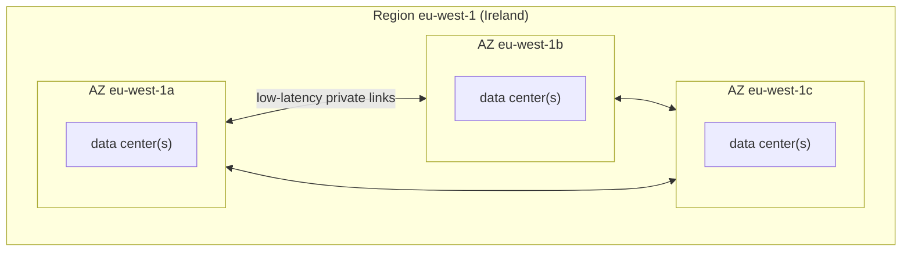

# AWS Regions and Availability Zones

> [!abstract] In one sentence
> AWS is split into **Regions** (separate geographic areas like `eu-west-1`, Ireland), each made of several isolated **Availability Zones** (groups of data centers a few kilometers apart); most resources live in **one Region**, and each **account** decides which Regions it can use: the older ones are always on, the newer **opt-in Regions** are off until someone **enables** them.

## Build-up: where should the shop run?

The shop's customers are mostly in Europe. Account `123456789012` (prod), with a separate backup account `111122223333`.

### Stage 1: picking a Region

A Region is the first choice for almost every resource, and it's hard to change later (moving means copying data and rebuilding). What decides it:

| Criterion | Example |
|---|---|
| **Latency** to users | European customers → a European Region |
| **Data residency / compliance** | Personal data must stay in the EU → only EU Regions |
| **Service availability** | Not every service or instance type exists in every Region (new ones launch in `us-east-1` first) |
| **Price** | The same instance costs different amounts per Region |

The shop picks **`eu-west-1`** (Ireland).

A Region's name has two forms: the **code** `eu-west-1` (used in APIs, CLI, ARNs) and the **display name** "Europe (Ireland)". Every API call goes to a **regional endpoint** (`ec2.eu-west-1.amazonaws.com`), which is why the CLI needs `--region` or a default region in its config.

### Stage 2: surviving a data center failure (Availability Zones)

A Region has **at least 3 Availability Zones** (`eu-west-1a`, `eu-west-1b`, `eu-west-1c`). Each AZ is one or more data centers with its **own power, cooling and networking**, far enough from the others not to share a flood or a fire, close enough (low-millisecond latency) to replicate data synchronously.



The shop's design: instances in **two or three AZs** behind a load balancer, [[RDS]] **Multi-AZ**, a [[VPC]] with one subnet per AZ. One AZ failing then costs capacity, not the service.

> [!info] AZ names are shuffled per account
> `eu-west-1a` in my account is not necessarily the same physical AZ as `eu-west-1a` in another account: AWS maps names randomly per account so everyone doesn't pile into "a". The **AZ ID** (`euw1-az1`, `euw1-az2`…) is the same for everyone. When two accounts must line up (shared subnets, a partner's endpoint, comparing latency), compare **AZ IDs**, not names.

```bash
aws ec2 describe-availability-zones --region eu-west-1 \
  --query 'AvailabilityZones[].[ZoneName,ZoneId]' --output table
```

### Stage 3: global, regional and zonal resources

The scope of a resource decides where I look for it and what a Region outage takes down:

| Scope | Examples | Consequence |
|---|---|---|
| **Global** | [[IAM]] users/roles/policies, [[Route 53]] hosted zones, CloudFront distributions, [[AWS Organizations]], the S3 **bucket namespace** | One copy for the whole account. IAM changes and CloudFront are managed from `us-east-1` behind the scenes (that's why their [[CloudTrail]] events land there) |
| **Regional** | [[S3]] bucket **data**, [[VPC]]s, [[Lambda]] functions, [[SQS]] queues, AMIs, [[Load balancers]], KMS keys, [[ECS]] clusters | Exists in one Region only. Using it elsewhere = copy it (AMI copy, S3 replication, KMS multi-Region keys) |
| **Zonal** | [[EC2]] instances, EBS volumes, subnets | Lives in one AZ. An EBS volume can only attach to an instance in the **same AZ** |

### Stage 4: a Region that isn't there (opt-in Regions)

Compliance asks for a copy of the shop's invoices in **Italy**. The Region is `eu-south-1` (Milan). It's marked as **not enabled** in the console's Region list, and CLI calls to it fail with an authentication error (typically "The security token included in the request is invalid"): the account's identities simply don't exist there yet.

Regions launched **after 20 March 2019** are **opt-in Regions**: they're **disabled by default** in every account, and an administrator must **enable** them for that account. Examples: `af-south-1` (Cape Town), `ap-east-1` (Hong Kong), `eu-south-1` (Milan), `eu-south-2` (Spain), `me-south-1` (Bahrain), `me-central-1` (UAE), `il-central-1` (Tel Aviv), `ap-southeast-3` (Jakarta) and the newer ones. Older Regions (`us-east-1`, `eu-west-1`, `eu-central-1`…) are **enabled by default and can't be disabled**.

Why AWS does this: a new Region is a new place my data, IAM principals and attack surface could reach. Opt-in means an account doesn't silently "exist" in a Region nobody chose.

Enabling it:

```bash
# console: account menu → Account → AWS Regions → Enable
aws account enable-region --region-name eu-south-1
aws account get-region-opt-status --region-name eu-south-1
# ENABLING … then ENABLED (can take minutes, sometimes hours)

# from the Organizations management account, for a member account:
aws account enable-region --account-id 111122223333 --region-name eu-south-1
aws account list-regions --region-opt-status-contains ENABLED ENABLED_BY_DEFAULT
```

What enabling actually does: the account's IAM principals become usable there (IAM is global, but its identities are only **propagated** to enabled Regions), and resources can be created there. **Disabling** it later makes the Region's resources unreachable to me, but doesn't delete them.

**Every account has its own list.** The prod account enabling Milan does nothing for the backup account. So when two accounts work together across Regions, the question is always: **does each account have the Regions it touches enabled?**

That's exactly what an S3 replication exam question tests (see [[S3 replication#Stage 4: replicating into an opt-in Region]]):
- The **source bucket owner** must have **both** the source and the destination Regions enabled (its replication role works in both)
- The **destination bucket owner** only needs the **destination** Region (that's where its bucket is)

### Stage 5: enabled vs allowed

Enabling a Region and **allowing** people to use it are separate controls:

| Control | What it does | Scope |
|---|---|---|
| **Region opt-in** (enable/disable) | Whether the account exists in an opt-in Region at all | Per account, opt-in Regions only |
| **SCP with `aws:RequestedRegion`** | Denies API calls to listed Regions, even default ones | Accounts/OUs in [[AWS Organizations]] |
| **IAM policy condition** `aws:RequestedRegion` | Same, per user or role | IAM principals |

The common guardrail: an SCP denying everything outside `eu-west-1` and `eu-central-1` (with exceptions for global services like IAM, Organizations, Route 53, CloudFront, support), so nobody starts instances in a Region no one monitors (where stolen keys usually mine crypto: see [[CloudTrail in production]]).

```json
{
  "Effect": "Deny",
  "NotAction": ["iam:*", "organizations:*", "route53:*", "cloudfront:*", "sts:*", "support:*"],
  "Resource": "*",
  "Condition": { "StringNotEquals": { "aws:RequestedRegion": ["eu-west-1", "eu-central-1"] } }
}
```

## Advanced problems

### 1. Temporary credentials rejected in an opt-in Region

A script gets credentials from the **global** STS endpoint (`sts.amazonaws.com`) and calls a service in `eu-south-1`: "The security token included in the request is invalid". By default, session tokens from the global endpoint are only valid in Regions **enabled by default**. Fixes: use the **regional** STS endpoint (`sts.eu-south-1.amazonaws.com`, the default in recent SDKs/CLI), or change the IAM account setting "Global endpoint session tokens" to **valid in all Regions** (longer tokens).

### 2. Two accounts, "the same AZ", different data centers

The shop's VPC endpoint and a partner's service are both "in `eu-west-1a`", yet traffic crosses AZs (latency, cross-AZ charges). The names map to different physical AZs per account. Use **AZ IDs** when coordinating.

### 3. A service isn't in my Region

A new feature launches in `us-east-1` only, or an instance type (GPU, newest Graviton) isn't in `eu-west-1` yet. Check the regional services list before designing. Same for opt-in Regions, which often get services later.

### 4. A disaster recovery Region nobody enabled

The DR runbook says "fail over to Milan". During the incident, the DR account can't create anything there: the Region was never enabled for **that** account, and enabling can take a while. Enable DR Regions (and test them) **before** they're needed.

## Beyond Regions
- **Local Zones**: a small extension of a Region in a big city (lower latency for some services), attached to a parent Region
- **Wavelength Zones**: inside telecom 5G networks
- **Outposts**: AWS racks in my own data center, managed from a Region
- **Edge locations**: hundreds of points of presence for CloudFront, Route 53 and Global Accelerator, not for running general workloads
- **Partitions**: `aws` (commercial), `aws-cn` (China, separate accounts), `aws-us-gov` (GovCloud). ARNs include the partition (see [[ARN]])

## Practice

> [!example]- S3 replication: the source bucket owner has the source and destination Regions enabled, the destination bucket owner has only the destination Region enabled. Does replication work (other requirements met)?
> Yes. That's exactly the requirement: the source owner needs both Regions, the destination owner only the destination Region.

> [!example]- Which Regions can't be disabled?
> Those enabled by default (launched before 20 March 2019). Only opt-in Regions can be enabled/disabled. Default ones can only be **blocked** with SCPs/IAM conditions.

> [!example]- Why compare AZ IDs rather than AZ names between two accounts?
> AZ names are mapped randomly per account. AZ IDs (like `euw1-az1`) identify the same physical AZ everywhere.

> [!example]- I enabled `eu-south-1` in the prod account. Can the backup account create buckets there?
> Not until the backup account enables it too. Region opt-in is per account.

> [!example]- Can an EBS volume in `eu-west-1a` attach to an instance in `eu-west-1b`?
> No. EBS volumes are zonal: same AZ only. Move it with a snapshot.

## Easy to get wrong
- Assuming every Region is available in every account (opt-in Regions are off by default)
- Thinking enabling a Region in one account enables it org-wide (it's per account)
- Confusing **enabling** a Region with **allowing** its use (SCPs, IAM conditions)
- Comparing AZ names across accounts
- Treating IAM, Route 53 or CloudFront as regional
- Forgetting a DR Region must be enabled and tested in the DR account beforehand
- Global STS endpoint tokens failing in opt-in Regions
- Assuming every service and instance type exists in every Region

## Related
- Uses Regions and AZs:: [[VPC]], [[EC2]], [[RDS]], [[S3]], [[S3 replication]], [[Auto Scaling]], [[Load balancers]]
- Controls:: [[AWS Organizations]] (SCPs, enabling Regions for members), [[IAM]]
- Global services:: [[Route 53]], [[IAM]], [[CloudTrail]] (us-east-1 events)
- Names:: [[ARN]], [[AWS naming conventions]]
- Big picture:: [[AWS services overview]], [[How AWS services connect]]

## Flashcards
#flashcards

What is an AWS Region? :: A separate geographic area (e.g. eu-west-1) containing several Availability Zones
What is an Availability Zone? :: One or more data centers with independent power, cooling and networking, within a Region
Minimum number of AZs in a Region? :: 3
Four criteria for choosing a Region? :: Latency to users, data residency/compliance, service availability, price
AZ name vs AZ ID? :: Names (eu-west-1a) are mapped randomly per account. IDs (euw1-az1) are the same physical AZ for everyone
Examples of global AWS services? :: IAM, Route 53, CloudFront, Organizations
Examples of zonal resources? :: EC2 instances, EBS volumes, subnets
What are opt-in Regions? :: Regions launched after 20 March 2019, disabled by default until an account enables them
Can default Regions like eu-west-1 be disabled? :: No. They can only be blocked with SCPs or IAM conditions
Is Region enablement per account or per organization? :: Per account (the management account can enable it for members)
CLI command to enable an opt-in Region? :: aws account enable-region --region-name <code>
S3 replication: which Regions must the source bucket owner have enabled? :: Both the source and the destination Regions
S3 replication: which Region must the destination bucket owner have enabled? :: Only the destination Region
Enabling a Region vs allowing its use? :: Enabling makes the account exist there. SCPs/IAM conditions on aws:RequestedRegion allow or deny calls
Why might global STS credentials fail in an opt-in Region? :: Global endpoint tokens are valid only in default Regions unless the account setting allows all Regions. Use regional STS
What happens to resources when an opt-in Region is disabled? :: They become inaccessible but aren't deleted
