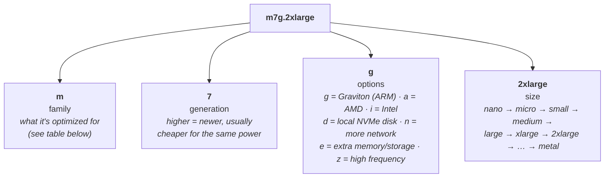
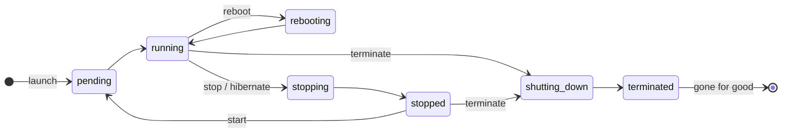

# EC2

> [!abstract] In one sentence
> A virtual machine (an **instance**) that I create from an image (**AMI**). It's where my code runs, and I'm in charge of everything on it.

## Sub-services & features

> Everything this service contains, grouped the way the console's left menu groups it. Linked = I have a note on it.

| Menu group | Sub-service | What it's for |
|---|---|---|
| **Overview** | Dashboard / EC2 Global View | Counts of resources, and a view of **all regions** at once (handy to find forgotten instances) |
| | Events | Scheduled maintenance/retirement of my instances |
| **Instances** | Instances | Launch, stop, terminate, connect |
| | Instance Types | Browse and compare the families (see below) |
| | Launch Templates | Saved instance recipes (see below, used by [[Auto Scaling]]) |
| | Spot Requests | Cheap, interruptible capacity |
| | Savings Plans / Reserved Instances | Discounts for committing 1–3 years |
| | Dedicated Hosts | A physical server just for me (licensing) |
| | Capacity Reservations | Guarantee capacity in an AZ even if I'm not running yet |
| **Images** | AMIs | My images (create from an instance, copy to other regions, share) |
| | AMI Catalog | Browse public / Marketplace / Quick Start images |
| **Elastic Block Store** | Volumes | EBS disks (create, attach, resize) |
| | Snapshots | Backups of volumes, the building block of AMIs |
| | Lifecycle Manager | Automatic snapshot/AMI schedules + retention |
| **Network & Security** | Security Groups | Instance firewalls (also listed in the VPC console) |
| | Elastic IPs | Static public IPs |
| | Placement Groups | Cluster / spread / partition |
| | Key Pairs | SSH keys |
| | Network Interfaces | ENIs, the virtual network cards |
| **Load Balancing** | Load Balancers, Target Groups, Trust Stores | → [[Load balancers]] (technically the ELB service, shown here) |
| **Auto Scaling** | Auto Scaling Groups | → [[Auto Scaling]] |

Related services that feel like part of EC2 but are separate: **Systems Manager** (Session Manager, patching → [[Bastion host]]), **EC2 Image Builder** (automated AMI pipelines), **Compute Optimizer** (right-sizing advice).

## Instance types

### Reading an instance type name



Each size step roughly **doubles** vCPUs, memory and price: `large` = 2 vCPU, `xlarge` = 4, `2xlarge` = 8…

### Families

| Family | Optimized for | Typical workloads |
|---|---|---|
| **T** | Cheap, **burstable** CPU (earns CPU credits while idle, spends them in spikes) | Small web servers, dev/test, the `t2.micro`/`t3.micro` free tier |
| **M** | **General purpose**, balanced CPU/memory | Web/app servers, backends, small–medium databases. The default choice |
| **C** | **Compute**: lots of CPU per GB of RAM | Batch processing, high-traffic web servers, gaming servers, video encoding, ML inference |
| **R** | **Memory**: lots of RAM per vCPU | In-memory caches (Redis), real-time big data, memory-hungry databases |
| **X** | **Very heavy memory** | SAP HANA, Apache Spark, big in-memory databases |
| **U** | **High memory** (several TB of RAM), bare metal | Very large in-memory databases (SAP HANA at scale) |
| **Z** | **High-frequency CPU** + high memory + NVMe SSDs | Chip design (EDA), databases licensed per CPU core |
| **I** | **Storage I/O**: fast local NVMe SSDs | NoSQL (Cassandra, MongoDB), OLTP databases, Elasticsearch/OpenSearch |
| **D** | **Dense storage**: lots of local HDD | Distributed file systems (HDFS), data warehousing, file servers |
| **H** | Up to 16 TB of local **HDD** with high disk throughput | MapReduce, Hadoop, Kafka, log processing |
| **P** | **GPU**, compute-focused | ML **training**, HPC, scientific simulations |
| **G** | **GPU**, graphics-focused | 3D rendering, game streaming, video, ML inference |
| **F** | **FPGA** (programmable hardware) | Genomics, financial analytics, custom hardware acceleration |
| **Inf / Trn** | AWS's own ML chips (Inferentia / Trainium) | Cheap ML inference / training |

> [!tip] How I remember them
> **T** = Tiny/Turbo · **M** = Main · **C** = Compute · **R** = RAM · **X** = eXtra RAM · **I** = I/O · **D** = Dense storage · **P** = Parallel GPU · **G** = Graphics · **F** = FPGA

> [!warning] Local disks (I, D, H, and anything with `d` like `m7gd`) are **instance store**
> Very fast, but **wiped when the instance stops or terminates**. Use them for caches or replicated data, never as the only copy.

## Creating an instance

![[Pasted image 20260920093658.png]]

To log into the instance from my machine (SSH), I need a **key pair**. AWS keeps the public key and I download the private one (`.pem`) **once**:

![[Pasted image 20260920093859.png]]

![[Pasted image 20260920094227.png]]

The **network settings** part of the form is where the instance meets the network:
- which [[VPC]] and which **subnet** it lives in (public or private)
- whether it gets a **public IP** (auto-assign)
- which **security group(s)** it wears

### Security groups
> A security group is a set of **firewall rules** attached to the instance (not the subnet). It says which traffic is allowed in and out.

- Only **allow** rules. Anything not allowed is blocked
- **Stateful**: if a request is allowed in, the response is automatically allowed back out
- The source of a rule can be an IP range **or another security group**. That's how "only the load balancer can reach my app" or "only the [[Bastion host]] can SSH in" are written
- Want `ping` to work? Allow **ICMP** (see [[ICMP]])
- Network ACLs are the subnet-level equivalent (see [[VPC]])

## Launch templates

> A saved "recipe" for an instance, so I don't click through the whole form every time. **[[Auto Scaling]] needs one** to know how to create new instances.

![[Pasted image 20260924191504.png]]

The creation form:
![[Pasted image 20260924191614.png]]

![[Pasted image 20260924192121.png]]

> [!note]
> The launch template form is basically the same form as launching an instance by hand. It just saves it instead of launching.

To use it: **Launch instance from template**:
![[Pasted image 20260924192453.png]]

## User data (bootstrap script)

In **Advanced details → User data**, I can paste a script that runs **once, as root, on the first boot**. That's how new instances (especially the ones [[Auto Scaling]] creates) install and start the app by themselves:

```bash
#!/bin/bash
dnf install -y nginx
systemctl enable --now nginx
```

## Storage: EBS vs instance store

| | **EBS volume** | **Instance store** |
|---|---|---|
| What | A network disk | A physical disk on the host machine |
| Survives stop/start? | ✅ Yes | ❌ **No, data is lost** |
| Survives terminate? | Root volume deleted by default ("Delete on termination"). Extra volumes are kept | ❌ No |
| Speed | Good (gp3, or io2 for heavy use) | Very fast |
| Backups | **Snapshots** (stored in S3). An AMI is basically snapshots + config | None |
| Scope | Stays in **one AZ**, attached to one instance (usually) | Tied to that instance |

For a filesystem shared by many instances → **EFS**.

## Instance lifecycle



| Action | Billed for compute? | Public IP | EBS data | Instance store |
|---|---|---|---|---|
| **Reboot** | Yes | Kept | Kept | Kept |
| **Stop** | No (EBS still billed) | **Changes** on next start | Kept | **Lost** |
| **Hibernate** | No | Changes | RAM saved to EBS | Lost |
| **Terminate** | No | Released | Root deleted by default | Lost |

→ Need an IP that never changes? Attach an **Elastic IP** (see [[VPC]]).
→ **Termination protection** (in instance settings) prevents deleting an important instance by accident.

## Pricing options

| Option | Deal | Good for |
|---|---|---|
| **On-Demand** | Pay per second, no commitment | Short or unpredictable workloads, testing |
| **Savings Plans** | Commit to $X/hour for 1 or 3 years → up to ~70% off | Steady usage, flexible across instance types |
| **Reserved Instances** | Commit to a specific instance type/region for 1 or 3 years | Steady, predictable servers (older model than Savings Plans) |
| **Spot** | Up to ~90% off, but AWS can **take it back with 2 minutes' notice** | Batch jobs, CI, stateless workers, part of an ASG |
| **Dedicated Hosts / Instances** | A physical server just for me | Licensing (per socket/core), compliance |

## Other things worth knowing
- **AMI**: the image an instance boots from. AMIs are **regional**, so copy one to another region to use it there. I can make my own from a configured instance
- **Instance metadata (IMDS)**: from inside the instance, `http://169.254.169.254/latest/meta-data/` gives the instance ID, IPs, and the temporary credentials of its IAM role. Use **IMDSv2** (token-based, the default now)
- **Placement groups**:
  - **cluster**: instances packed close together for low latency (HPC)
  - **spread**: each instance on different hardware (a few critical instances)
  - **partition**: groups of instances on separate racks (Kafka, HDFS, Cassandra)
- **Elastic Network Interface (ENI)**: the instance's virtual network card. Security groups are really attached to the ENI
- **Status checks**: *system* (AWS's hardware) vs *instance* (my OS). Failed system check → stop/start moves the instance to new hardware
- **Naming**: IDs like `i-0abc…`, and the human name is the `Name` tag. See [[AWS naming conventions]]

## Target groups & load balancers
Target groups are part of load balancing, so they now have their own section in [[Load balancers]]. The one-line version: a target group is a list of instances that a load balancer can send traffic to, plus the health check used to decide which ones are OK.

## Connects to
- [[VPC]]: every instance lives in a subnet of a VPC
- [[Load balancers]]: instances are registered in target groups
- [[Auto Scaling]]: creates/destroys instances from a launch template
- [[IAM]]: an instance can get permissions through an **IAM role** (instance profile) instead of hardcoded keys
- [[Bastion host]]: how to reach instances in private subnets
- [[Route 53]]: point a domain at an Elastic IP
- [[Certificate Manager (ACM)]]: ACM certs can't go directly on an instance. Put an ALB in front
- [[Lightsail]]: simplified EC2. Lightsail snapshots can be exported to EC2
- Choosing → [[EC2 vs Lightsail vs Lambda]]
- Big picture → [[How AWS services connect]]

## Open questions

- [x] What is the difference between RSA and ED25519, and between OpenSSH and PuTTY?
  - **ED25519** is newer, with shorter keys, faster and considered more secure. **RSA** is older but supported everywhere, and it's **required for Windows instances**
  - **OpenSSH** (`.pem`) is the standard `ssh` client on Linux/macOS/modern Windows. **PuTTY** is an older Windows client that wants its own `.ppk` format. Today, `.pem` + the built-in `ssh` is enough
- [x] If my EC2 instance sits behind a private IP, how come I can SSH into it?
  - I can't directly. I go through a [[Bastion host]] (or Session Manager / EC2 Instance Connect Endpoint)

## Flashcards
#flashcards

What is an AMI? :: The image (OS + preinstalled software) an EC2 instance is created from
Is a security group attached to a subnet or an instance? :: An instance (its network interface). NACLs are the subnet-level firewall
Are security groups stateful? :: Yes, responses to allowed traffic are automatically allowed
What does Auto Scaling need to create instances? :: A launch template
How should an EC2 instance get AWS permissions? :: Through an IAM role (instance profile), never hardcoded access keys
What does `m7g.2xlarge` mean? :: m = general purpose, 7 = generation, g = Graviton (ARM), 2xlarge = size (8 vCPU)
Which family for a Redis cache / memory-heavy DB? :: R (memory optimized), or X/U for huge in-memory workloads
Which family for CPU-heavy batch or video encoding? :: C (compute optimized)
Which family for NoSQL with fast local disks? :: I (storage I/O optimized)
P vs G GPU instances? :: P is for ML training / HPC. G is for graphics, rendering, inference
What is a T instance? :: Burstable. Low baseline CPU with credits for spikes. Cheap, free tier
What happens to instance store data on stop? :: It's lost. EBS data survives
What happens to the public IP on stop/start? :: It changes. Use an Elastic IP to keep one
When does user data run? :: Once, as root, at the first boot
Cheapest option for interruptible batch jobs? :: Spot instances (up to ~90% off, 2-minute interruption notice)
