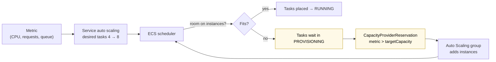

# ECS on Fargate vs EC2

> [!abstract] The short answer
> **Fargate**: I give ECS a task definition, AWS finds a micro-VM of the right size for each task, and I never see a server. **EC2 launch type**: I **provision the servers myself** (an Auto Scaling group of instances running the ECS agent), and ECS packs tasks onto them. Fargate by default. EC2 when I need what Fargate can't do (GPUs, host access, daemons, very large or special instances) or when a big, steady fleet makes owning the instances cheaper.

## Common misconceptions

**Wrong mental model #1:** "Fargate is a different service from ECS."

**What's actually true:** Fargate is a **compute engine** under ECS (and EKS). Same clusters, task definitions, services, load balancers, deployments. Only **where the tasks run** changes, chosen per service with a **capacity provider strategy**. One cluster can run some services on Fargate and others on EC2.

**Wrong mental model #2:** "With the EC2 launch type I just add instances to the cluster and I'm done."

**What's actually true:** I've signed up for a second scaling problem. ECS scales **tasks**, but if there's no room on the instances, new tasks sit in `PROVISIONING` and nothing starts. The instances must scale **with** the tasks (capacity provider managed scaling), be patched (new AMIs), be drained before termination so tasks move cleanly, and be secured (tasks must not steal the **instance's** IAM role). That's the "manual provisioning" cost.

| Wrong mental model | What's actually true |
|---|---|
| Fargate is always more expensive | Per vCPU-hour it costs more than a **fully used** instance. But instances are rarely full: idle capacity, headroom, and engineering time often make Fargate cheaper overall |
| Fargate tasks share a VM like containers on a host | Each Fargate task runs in its **own isolated micro-VM**, its own kernel. No neighbor tasks on the same kernel |
| EC2 tasks get their own IP like Fargate | Only in `awsvpc` mode (limited by ENIs per instance). In `bridge` mode they share the instance's IP on dynamic ports |
| Tasks on EC2 are isolated from the instance's IAM role | Not by default: a container that can reach the instance metadata (IMDS) can get the **instance role's** credentials. Must be blocked |
| Fargate can run anything ECS can | No GPUs, no privileged containers, no host network, no daemon tasks, no custom kernel, max 16 vCPU / 120 GB per task |

## Side by side

| | **Fargate** | **EC2 launch type** (my instances) |
|---|---|---|
| Who manages servers | AWS | **Me**: AMI, patching, scaling, draining |
| Unit I pay for | Task vCPU + memory **per second** while running | Instances **per second**, full or empty |
| Isolation | Micro-VM per task | Containers share the instance kernel |
| Network modes | `awsvpc` only | `awsvpc`, `bridge`, `host`, `none` |
| Load balancer target type | `ip` | `ip` (awsvpc) or `instance` (bridge, dynamic ports) |
| Scaling | Tasks only | Tasks **and** instances (capacity provider) |
| Startup | Image pulled each time (no cache) | Cached images on the host → faster |
| GPU, Inferentia, special instance types | ❌ | ✅ |
| Privileged containers, host mounts, Docker socket | ❌ | ✅ |
| Daemon services (one task per host) | ❌ (use sidecars) | ✅ |
| Max task size | 16 vCPU, 120 GB | Up to the instance size |
| Spot | **Fargate Spot** (~70% off, 2-min warning) | EC2 Spot in the Auto Scaling group |
| Windows containers | ✅ | ✅ |
| Discounts | Compute Savings Plans | Savings Plans, Reserved Instances |

## What they share
- Clusters, task definitions (with `requiresCompatibilities`), services, deployments, circuit breaker, Service Connect, auto scaling of tasks, ECS Exec (see [[ECS]])
- The task definition format and lifecycle (see [[ECS tasks and task definitions]])
- Execution role and task role
- Logs, metrics, CloudTrail

## Build-up: provisioning EC2 capacity by hand for the shop

Shop account `123456789012`, `eu-west-1`. Most services run on Fargate. A new `shop-recommender` service needs a **GPU** (`g5.xlarge`), and the platform team wants a **log agent on every host**: both are impossible on Fargate. So: an EC2-backed capacity for the `shop-prod` cluster.

### Stage 1: one instance that joins the cluster

An **ECS container instance** is a normal EC2 instance with three things:

1. **An AMI with Docker/containerd and the ECS agent**: the **ECS-optimized AMI**, found through a public SSM parameter (never hardcode the ID):
   ```bash
   aws ssm get-parameter --name /aws/service/ecs/optimized-ami/amazon-linux-2023/recommended/image_id \
     --query Parameter.Value --output text
   # GPU variant: /aws/service/ecs/optimized-ami/amazon-linux-2023/gpu/recommended/image_id
   ```
2. **An instance profile** with `AmazonEC2ContainerServiceforEC2Role` (the agent registers the instance, receives tasks, reports state) plus `AmazonSSMManagedInstanceCore` (to manage the host with [[Systems Manager]])
3. **User data** telling the agent which cluster to join:
   ```bash
   #!/bin/bash
   cat >> /etc/ecs/ecs.config <<'EOF'
   ECS_CLUSTER=shop-prod
   ECS_ENABLE_SPOT_INSTANCE_DRAINING=true
   ECS_IMAGE_PULL_BEHAVIOR=prefer-cached
   ECS_AWSVPC_BLOCK_IMDS=true
   EOF
   ```

Launch it in a private subnet, and it appears:

```bash
aws ecs list-container-instances --cluster shop-prod
aws ecs describe-container-instances --cluster shop-prod --container-instances <arn> \
  --query 'containerInstances[].{id:ec2InstanceId,agent:agentConnected,cpu:remainingResources[?name==`CPU`].integerValue|[0],mem:remainingResources[?name==`MEMORY`].integerValue|[0]}'
```

ECS now tracks this instance's **remaining CPU and memory** and places tasks onto it. The agent, like the SSM agent, **dials out** to the ECS endpoints (`ecs`, `ecs-agent`, `ecs-telemetry`): no inbound port needed, private subnets need NAT or those VPC endpoints.

**The problem:** one instance is a single point of failure, and when it fills up, new tasks wait forever.

### Stage 2: an Auto Scaling group and a capacity provider

- A **launch template** with the AMI, instance profile, user data, security group
- An **Auto Scaling group** `shop-prod-ecs-gpu` across two AZs, min 1 / max 6, with **scale-in protection** on new instances
- A **capacity provider** that links the group to the cluster, with **managed scaling**:

```bash
aws ecs create-capacity-provider --name shop-gpu \
  --auto-scaling-group-provider "autoScalingGroupArn=arn:aws:autoscaling:…:autoScalingGroupName/shop-prod-ecs-gpu,managedScaling={status=ENABLED,targetCapacity=90},managedTerminationProtection=ENABLED,managedDraining=ENABLED"

aws ecs put-cluster-capacity-providers --cluster shop-prod \
  --capacity-providers FARGATE FARGATE_SPOT shop-gpu \
  --default-capacity-provider-strategy capacityProvider=FARGATE,weight=1
```

How the two scaling loops work together:



- **`targetCapacity=90`**: keep the instances ~90% used, so there's 10% **headroom** for new tasks to start instantly. 100 = pack tightly, every scale-out waits for a new instance (minutes)
- **Managed termination protection**: the group won't terminate an instance that still runs tasks when scaling in
- **Managed draining**: before an instance goes away (scale-in, Spot, instance refresh), ECS puts it in **DRAINING**, the services start replacement tasks elsewhere, then the instance is released

### Stage 3: where tasks land (placement)

With several instances, ECS decides **which** instance gets each task:

| Strategy | Does | Use |
|---|---|---|
| `spread` on `attribute:ecs.availability-zone` | Even across AZs | **Always first**, for resilience |
| `binpack` on `memory` (or `cpu`) | Fill the fullest instance first | Fewer instances → cheaper |
| `spread` on `instanceId` | One task per instance as much as possible | Blast radius |
| `random` | Random | Rarely |

Constraints narrow the candidates: `distinctInstance` (never two tasks of this service on one host), or `memberOf` with an expression, e.g. `attribute:ecs.instance-type =~ g5.*` so the recommender only lands on GPU hosts.

```json
"placementStrategy": [
  { "type": "spread",  "field": "attribute:ecs.availability-zone" },
  { "type": "binpack", "field": "memory" }
]
```

Fargate has none of this: each task gets its own right-sized capacity.

### Stage 4: networking on my instances

| Mode | How tasks get the network | Trade-off |
|---|---|---|
| **`awsvpc`** | Each task gets its **own ENI**, IP and security group (like Fargate) | An instance has a limited number of ENIs (a `c5.large` has 3, one used by the host → 2 tasks). **ENI trunking** (account setting, Nitro instances) raises it a lot |
| **`bridge`** | Containers on a Docker bridge, ports mapped to the host. `hostPort: 0` = **dynamic port** (32768–60999) | Many tasks per host, ALB target group type **`instance`** registers `instance:port`. Security groups are per **instance**, not per task |
| **`host`** | Container uses the host's network directly | Fastest, but only one task per port per host |

The security trap in `bridge` mode: a container can reach `169.254.169.254` (IMDS) and get the **instance role's** credentials, which is more than the task should have. Fixes: IMDSv2 with **hop limit 1** on the launch template (packets from containers have one more hop, so they can't reach it), `ECS_AWSVPC_BLOCK_IMDS=true` for awsvpc tasks, and give apps a **task role** instead.

### Stage 5: one agent per host (daemon services)

The platform team's log/security agent must run **once on every instance**, including new ones:

```bash
aws ecs create-service --cluster shop-prod --service-name host-agent \
  --task-definition host-agent:3 --scheduling-strategy DAEMON \
  --launch-type EC2
```

ECS starts one copy on each container instance and on every instance that joins. On Fargate there are no hosts, so the equivalent is a **sidecar** in each task.

### Stage 6: patching the hosts

Every month AWS publishes a new ECS-optimized AMI (kernel, Docker, agent fixes). With EC2, **that's my job**:

1. Update the launch template to the new AMI (from the SSM parameter, or a [[Packer]]-built golden AMI based on the ECS-optimized one, with my hardening and agents baked in)
2. **Instance refresh** on the Auto Scaling group: with managed draining, each old instance is drained, its tasks are rescheduled elsewhere, then it's terminated
3. Watch the services stay stable throughout

With Fargate, AWS patches the platform underneath; at most a task gets a **retirement notice** and the service replaces it.

### Stage 7: the bill

Same workload, 20 tasks of 1 vCPU / 2 GB, around the clock:

| | Fargate | EC2 (`m7g.xlarge` = 4 vCPU / 16 GB) |
|---|---|---|
| What I pay for | 20 × (1 vCPU + 2 GB) every second | Instances. CPU-bound tasks: 4 per instance → 5 instances, but memory 75% unused |
| If the load drops at night to 6 tasks | Pay for 6 tasks | Pay for whatever instances haven't scaled in yet (headroom, slow scale-in) |
| Engineering time | ~0 for hosts | AMIs, patching, scaling tuning, draining, IMDS hardening, capacity troubleshooting |

Rule of thumb: Fargate wins for spiky, small, or many different services. EC2 wins when the fleet is **large and steady**, tasks fit instance shapes well (high utilization), or Reserved Instances / Savings Plans + Spot are used aggressively. **Fargate Spot** for interruptible work closes much of the gap.

> [!info] A middle option
> **ECS Managed Instances** (newer): AWS provisions, patches and scales EC2 instances for ECS, while I can still pick instance types (e.g. GPUs). EC2 flexibility with less of the manual work. Worth checking before building Stages 1–6 by hand.

## If you have to choose
- Default, web APIs, workers, scheduled jobs → **Fargate**
- Interruptible extra capacity, batch, dev environments → **Fargate Spot**
- **GPU**, privileged containers, host mounts, daemon agents, kernel tuning → **EC2**
- Very large, steady, well-packed fleet with commitments → **EC2** (or Managed Instances)
- Need images cached on hosts for fast scale-out of huge images → **EC2**
- A small team with no one to own hosts → **Fargate**

## Practice

> [!example]- New tasks on my EC2-backed service sit in PROVISIONING forever. Why?
> No instance has enough free CPU/memory (or ENIs). Use a capacity provider with managed scaling so the Auto Scaling group grows with the tasks.

> [!example]- What three things make an EC2 instance an ECS container instance?
> The ECS-optimized AMI (agent + container runtime), an instance profile with `AmazonEC2ContainerServiceforEC2Role`, and `ECS_CLUSTER=<name>` in `/etc/ecs/ecs.config` via user data.

> [!example]- What does `targetCapacity=90` on a capacity provider mean?
> Managed scaling keeps instances about 90% utilized, leaving ~10% headroom so new tasks start without waiting for instances.

> [!example]- Bridge-mode containers can read the EC2 instance role's credentials. How to stop it?
> IMDSv2 with hop limit 1 (containers can't reach IMDS), `ECS_AWSVPC_BLOCK_IMDS` for awsvpc tasks, and task roles for app permissions.

> [!example]- I need a monitoring agent on every host of the cluster. Fargate or EC2, and how?
> EC2, with a DAEMON scheduling strategy service. Fargate has no hosts: use a sidecar per task instead.

> [!example]- How do I roll a new AMI onto ECS container instances without breaking services?
> New launch template version, then an instance refresh with managed draining: instances drain, tasks reschedule, then they're replaced.

> [!example]- Which ALB target type for bridge mode with dynamic ports?
> `instance` (ECS registers instance + host port). For awsvpc it's `ip`.

## Easy to get wrong
- Thinking Fargate is a separate service rather than ECS's serverless compute
- Scaling tasks but not instances on EC2 (tasks stuck in PROVISIONING)
- `targetCapacity=100` and wondering why every scale-out takes minutes
- Forgetting managed termination protection / draining: scale-in kills running tasks
- Leaving IMDS reachable from containers on EC2
- Running out of ENIs with awsvpc on small instances (enable ENI trunking or pick bigger instances)
- Hardcoding the ECS-optimized AMI ID instead of the SSM parameter
- Never refreshing container instances: unpatched hosts
- Assuming Fargate has GPUs, privileged mode or daemons
- Comparing prices per vCPU without counting idle capacity and engineering time

## Related
- The orchestrator:: [[ECS]], [[ECS tasks and task definitions]]
- Provisioning my own hosts:: [[EC2]], [[Auto Scaling]], [[Packer]]
- Host management and security:: [[Systems Manager]], [[IAM]], [[Security groups]]
- Network:: [[VPC]], [[Load balancers]], [[Network interfaces]] (ENIs), [[Outbound-initiated connections]] (agents dialing out)
- Other compute:: [[Lambda]], [[EC2 vs Lightsail vs Lambda]]

## Flashcards
#flashcards

What is Fargate? :: Serverless compute for ECS/EKS: each task runs in its own AWS-managed micro-VM, no instances to manage
Fargate vs EC2 launch type in one line? :: Fargate: AWS provides capacity per task. EC2: I provision and manage the instances tasks run on
What makes an EC2 instance an ECS container instance? :: ECS-optimized AMI, instance profile with AmazonEC2ContainerServiceforEC2Role, ECS_CLUSTER in /etc/ecs/ecs.config
Where do you find the current ECS-optimized AMI ID? :: SSM public parameter /aws/service/ecs/optimized-ami/amazon-linux-2023/recommended/image_id
What is an ECS capacity provider? :: Where tasks run: FARGATE, FARGATE_SPOT, or an Auto Scaling group linked to the cluster
What does capacity provider managed scaling do? :: Scales the Auto Scaling group so instances fit the tasks, keeping utilization at targetCapacity
What does managed termination protection prevent? :: Scale-in terminating instances that still run tasks
What does managed draining do? :: Drains an instance (tasks rescheduled elsewhere) before it is terminated or replaced
Task placement strategies? :: spread, binpack, random
Typical ECS placement strategy on EC2? :: spread across AZs, then binpack on memory
What is a DAEMON service? :: Runs one task on every container instance (EC2 only)
Network modes available on Fargate? :: Only awsvpc
What limits awsvpc tasks per EC2 instance? :: The instance's ENI limit (raised with ENI trunking)
Bridge mode ALB target type and port? :: instance target type with dynamic host ports
How to stop containers on EC2 from using the instance role? :: IMDSv2 with hop limit 1, ECS_AWSVPC_BLOCK_IMDS, and task roles
Things Fargate can't do? :: GPUs, privileged containers, host networking/mounts, daemon tasks, tasks over 16 vCPU / 120 GB
What is Fargate Spot? :: Spare Fargate capacity at a big discount, tasks can be reclaimed with a 2-minute warning
Why can EC2 tasks start faster than Fargate tasks? :: Images are cached on the host. Fargate pulls the image for every task
When is EC2 launch type cheaper? :: Large, steady, well-packed fleets with commitments or Spot, when utilization is high
