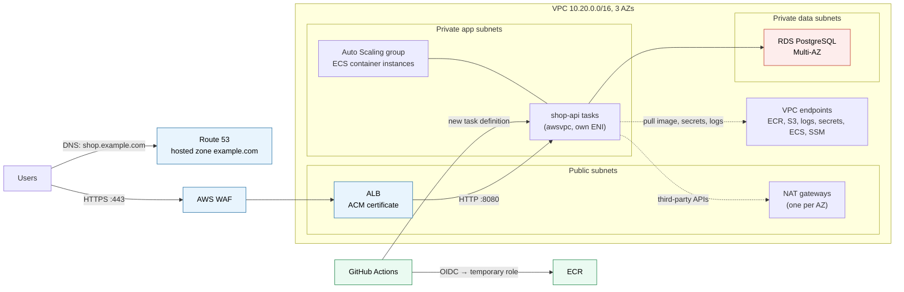
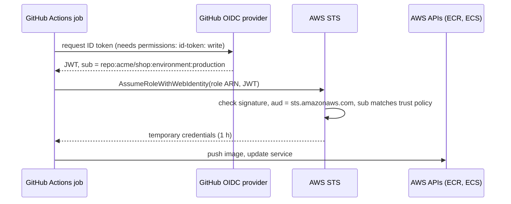
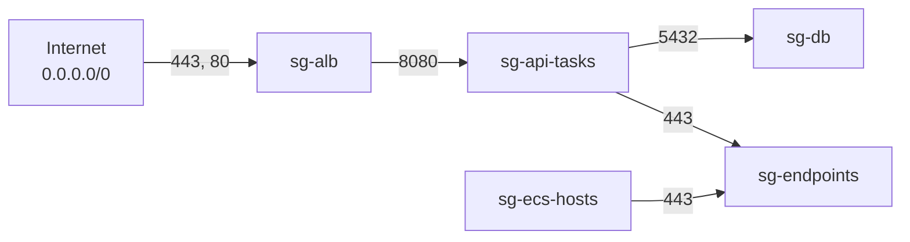
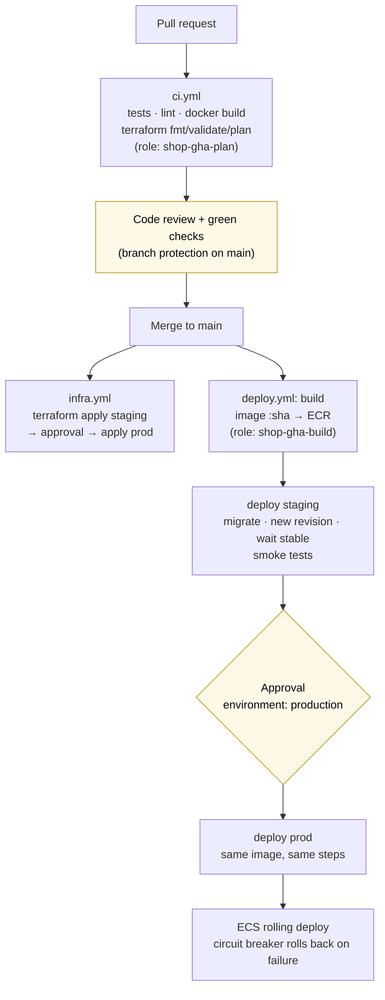
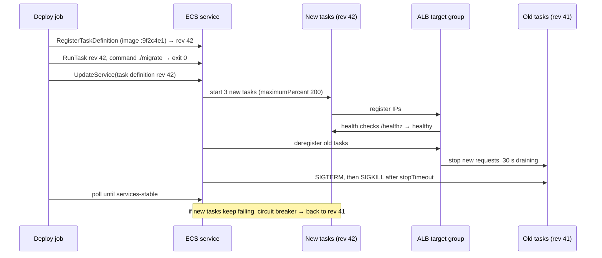

# ECS production stack

> [!abstract] In one sentence
> A production ECS setup is **everything around the containers, written as code in one GitHub repo**: a VPC across three AZs (public subnets for the load balancer and NAT, private subnets for the hosts, data subnets for the database), a Route 53 zone and an ACM certificate validated through DNS, an HTTPS ALB, an ECS cluster backed by an Auto Scaling group of EC2 instances, secrets in Secrets Manager injected at task start, and a GitHub Actions pipeline that logs into AWS through **OIDC (no stored keys)**, builds the image once, and rolls it out to staging then production.

This note puts together pieces that each have their own note ([[VPC]], [[Route 53]], [[Certificate Manager (ACM)]], [[Load balancers]], [[ECS]], [[ECS on Fargate vs EC2]], [[RDS]]). Here the question is: **in what order do I build them, how do they connect, and what makes it "prod ready"** instead of a demo.

## The whole picture first

The shop: an API `shop-api` (a container listening on `8080`), a PostgreSQL database, the domain `example.com`, users hitting `https://shop.example.com`. Region `eu-west-1`.



The pieces, and which ones I build in which order:

| Order | Piece | Why it comes here |
|---|---|---|
| 0 | Accounts, Terraform state, OIDC trust for GitHub | Everything else is applied **by the pipeline**, so the pipeline needs somewhere to keep state and a way to log in |
| 1 | VPC | Everything lives in it |
| 2 | Route 53 zone + ACM certificate | The ALB's HTTPS listener needs a **validated** certificate, and validation needs DNS |
| 3 | ALB, target group, WAF, DNS record | The front door |
| 4 | ECS cluster on EC2 (launch template, Auto Scaling group, capacity provider) | Somewhere for tasks to run |
| 5 | Secrets and the database | Tasks need them at startup |
| 6 | ECR, task definition, service, auto scaling | The app itself |
| 7 | CI/CD pipelines | From then on, every change goes through Git |
| 8 | Alarms, logs, runbooks | So I know when it breaks |

## The repo

One repo `acme/shop` on GitHub holds the app **and** the infrastructure. Infrastructure as code with [[Terraform]] (CloudFormation/CDK work the same way: the ideas below don't change).

```text
shop/
├── app/                      Dockerfile + source code
├── infra/
│   ├── bootstrap/            state bucket, GitHub OIDC provider, CI roles (applied once, by hand)
│   ├── modules/
│   │   ├── network/          VPC, subnets, NAT, endpoints, flow logs
│   │   ├── edge/             certificate, ALB, WAF, DNS records
│   │   ├── ecs-cluster/      launch template, Auto Scaling group, capacity provider
│   │   └── service/          ECR repo, task definition, service, scaling, alarms
│   └── envs/
│       ├── staging/          calls the modules with staging values
│       └── prod/             calls the modules with prod values
└── .github/workflows/
    ├── ci.yml                pull request: tests, image build, terraform plan
    ├── infra.yml             merge to main: terraform apply (with approval for prod)
    └── deploy.yml            merge to main: build image once, deploy staging → prod
```

**Why modules + one folder per environment:** staging and prod are built from **the same code** with different inputs (instance sizes, counts, domain). If staging works, prod is the same shape. Copy-pasted environments drift apart within weeks.

**Accounts:** one AWS account per environment (`staging` 222233334444, `prod` 123456789012) plus a `shared` account 111122223333 for ECR, all under [[AWS Organizations]], people log in through [[AWS Identity Center]]. A bug or a leaked role in staging then can't touch prod. A single account with name prefixes also works for a small project, but the account boundary is the strongest isolation AWS has.

## Build-up

### Stage 0: the pipeline needs state and a way to log in

Terraform remembers what it created in a **state file**. On a laptop it's a local file: two people (or two pipeline runs) applying at the same time corrupt it, and losing it means Terraform forgets everything it manages.

So the state goes into an S3 bucket, with locking:

```hcl
# infra/envs/prod/backend.tf
terraform {
  backend "s3" {
    bucket       = "acme-terraform-state-123456789012"
    key          = "shop/prod/terraform.tfstate"
    region       = "eu-west-1"
    encrypt      = true
    use_lockfile = true   # S3-native locking (Terraform 1.10+), replaces the old DynamoDB lock table
  }
}
```

The bucket has versioning (to recover a broken state), encryption, Block Public Access, and a bucket policy that only lets the CI roles and admins read it. **State contains secrets in plain text** (any password Terraform touched), so it's treated like a secret itself.

Next problem: GitHub Actions has to call AWS. The old way is an IAM user with an access key pasted into GitHub secrets: a long-lived key that never expires, that anyone with repo admin can exfiltrate, that has to be rotated by hand. Instead, <span style="color:rgb(255, 192, 0)"><b>OIDC federation</b></span>:

1. AWS is told to trust GitHub's identity provider `token.actions.githubusercontent.com`
2. Each workflow run asks GitHub for a short-lived **signed token (JWT)** that says *which repo, which branch, which environment* is running
3. The workflow hands that token to STS `AssumeRoleWithWebIdentity` and gets **temporary credentials** (1 hour) for one role
4. The role's **trust policy** decides which repo/branch/environment may assume it



The bootstrap (applied once, by an admin from their laptop, because the pipeline can't create its own login):

```hcl
# infra/bootstrap/oidc.tf
resource "aws_iam_openid_connect_provider" "github" {
  url            = "https://token.actions.githubusercontent.com"
  client_id_list = ["sts.amazonaws.com"]
}

# Role used by the production deploy job only
resource "aws_iam_role" "gha_deploy_prod" {
  name = "shop-gha-deploy-prod"
  assume_role_policy = jsonencode({
    Version = "2012-10-17"
    Statement = [{
      Effect    = "Allow"
      Principal = { Federated = aws_iam_openid_connect_provider.github.arn }
      Action    = "sts:AssumeRoleWithWebIdentity"
      Condition = {
        StringEquals = {
          "token.actions.githubusercontent.com:aud" = "sts.amazonaws.com"
          "token.actions.githubusercontent.com:sub" = "repo:acme/shop:environment:production"
        }
      }
    }]
  })
}
```

The `sub` claim is the important line. What GitHub puts in it depends on the job:

| The job… | `sub` claim |
|---|---|
| uses `environment: production` | `repo:acme/shop:environment:production` |
| runs on a push to `main`, no environment | `repo:acme/shop:ref:refs/heads/main` |
| runs on a pull request | `repo:acme/shop:pull_request` |

So I make **one role per kind of job**, each trusting exactly one `sub`:

| Role | Trusted `sub` | Can do |
|---|---|---|
| `shop-gha-plan` (each account) | `pull_request` | Read-only + read state: `terraform plan` |
| `shop-gha-build` (shared account) | `ref:refs/heads/main` | Push to the `shop-api` ECR repo, nothing else |
| `shop-gha-deploy-staging` / `-prod` | `environment:staging` / `environment:production` | Register task definitions, update the one service, `iam:PassRole` on its two task roles |
| `shop-gha-infra-prod` | `environment:production-infra` | `terraform apply`: broad, so gated behind an approval |

> [!warning] Never `repo:acme/*` or `*` in the `sub` condition
> A trust policy without a `sub` condition (or with a wildcard) lets **any GitHub repository in the world** assume the role, because everyone's tokens come from the same issuer. AWS now refuses to create such trust policies for the GitHub provider, but older roles may still have them.

The GitHub **environment** `production` gets protection rules: required reviewers and "only the `main` branch can deploy". Because the AWS role trusts only `environment:production`, the approval in GitHub is **enforced by AWS**: a workflow that skips the environment simply can't get prod credentials.

**The problem now:** the pipeline can log in, but there's nothing to deploy into.

### Stage 1: the network

A VPC `10.20.0.0/16` (from the org's address plan, see [[VPC IP address planning]]) across **three AZs**, with three tiers of subnets:

| Tier | CIDRs | Route `0.0.0.0/0` to | Holds |
|---|---|---|---|
| Public | `10.20.0.0/24`, `.1.0/24`, `.2.0/24` | Internet gateway | ALB, NAT gateways. **Nothing else** |
| Private app | `10.20.16.0/20`, `.32.0/20`, `.48.0/20` | NAT gateway **in the same AZ** | ECS container instances and tasks |
| Private data | `10.20.64.0/24`, `.65.0/24`, `.66.0/24` | Nothing (no internet route) | RDS |

App subnets are big (`/20` = 4,091 usable IPs each) because with `awsvpc` **every task takes an IP**, plus every instance, plus trunk ENIs. Running out of IPs mid-scale-out is a real outage.

```hcl
# infra/modules/network/main.tf (using the community VPC module)
module "vpc" {
  source  = "terraform-aws-modules/vpc/aws"
  version = "~> 5.0"

  name = "shop-${var.env}"
  cidr = "10.20.0.0/16"
  azs  = ["eu-west-1a", "eu-west-1b", "eu-west-1c"]

  public_subnets   = ["10.20.0.0/24", "10.20.1.0/24", "10.20.2.0/24"]
  private_subnets  = ["10.20.16.0/20", "10.20.32.0/20", "10.20.48.0/20"]
  database_subnets = ["10.20.64.0/24", "10.20.65.0/24", "10.20.66.0/24"]

  enable_nat_gateway     = true
  one_nat_gateway_per_az = true    # prod: an AZ outage doesn't cut the other AZs' egress
  # staging: single_nat_gateway = true to save ~2 × 32 $/month

  enable_dns_hostnames = true      # needed for interface endpoints' private DNS
  enable_flow_log      = true
  create_flow_log_cloudwatch_log_group = true
  create_flow_log_cloudwatch_iam_role  = true
}
```

**One NAT per AZ** because a NAT gateway lives in one AZ: with a single NAT, losing that AZ cuts outbound traffic for the whole app, and every cross-AZ byte through it is billed twice.

Then **VPC endpoints**, so the most frequent traffic (image pulls, logs, secrets, ECS agent) never goes through NAT:

| Endpoint | Type | Used for |
|---|---|---|
| `s3` | Gateway (free) | **Image layers** live in S3: without it, every pull goes through NAT and is billed per GB |
| `ecr.api`, `ecr.dkr` | Interface | Login and manifest for image pulls |
| `logs` | Interface | Container logs to CloudWatch |
| `secretsmanager`, `ssm` | Interface | Secrets and parameters injected at task start |
| `ecs`, `ecs-agent`, `ecs-telemetry` | Interface | The ECS agent on my instances talking to the control plane |
| `ssmmessages`, `ec2messages` | Interface | Session Manager on the hosts, ECS Exec |
| `kms`, `sts` | Interface | If the app decrypts or assumes roles |

Interface endpoints cost ~7-8 $/month per AZ each. In staging I may skip them and rely on NAT. In prod the NAT data savings and the "still works if NAT is broken" property are worth it.

Security groups chain by **reference**, not by CIDR (see [[Security groups]]):



- `sg-alb`: in 443 and 80 from anywhere
- `sg-api-tasks`: in 8080 **only from `sg-alb`**
- `sg-db`: in 5432 **only from `sg-api-tasks`**
- `sg-endpoints`: in 443 from the VPC CIDR
- `sg-ecs-hosts`: **no inbound at all** (the ECS and SSM agents dial out, see [[Outbound-initiated connections]])

**The problem now:** there's a network, but nobody can reach it by name or over HTTPS.

### Stage 2: DNS and the certificate

**The hosted zone.** The domain `example.com` is registered somewhere (a registrar, or Route 53 itself). Terraform creates a **public hosted zone** in the prod account, which gets four AWS name servers. One manual step remains: at the registrar, replace the domain's NS records with those four (delegation, see [[Route 53#Stage 1: the domain answers on the internet]]).

```hcl
resource "aws_route53_zone" "main" {
  name = "example.com"
}

output "name_servers" {
  value = aws_route53_zone.main.name_servers   # copy these to the registrar once
}
```

For staging, I'd rather delegate a **subdomain** `staging.example.com` to a zone in the staging account (an NS record in the prod zone pointing to it), so staging can manage its own records without prod permissions.

```bash
# Check delegation from the outside
dig +short NS example.com
dig +trace shop.example.com
```

**The certificate.** ACM issues it for free, but first I must prove I control the domain. With **DNS validation**, ACM gives me a CNAME to create; as long as it exists, ACM can also **renew the certificate by itself** every year, forever. (Email validation needs a human to click each renewal: avoid it.) The whole thing in Terraform:

```hcl
resource "aws_acm_certificate" "shop" {
  domain_name               = "example.com"
  subject_alternative_names = ["*.example.com"]
  validation_method         = "DNS"

  lifecycle {
    create_before_destroy = true   # a replacement cert exists before the old one is detached
  }
}

resource "aws_route53_record" "cert_validation" {
  for_each = {
    for o in aws_acm_certificate.shop.domain_validation_options : o.domain_name => o
  }
  zone_id         = aws_route53_zone.main.zone_id
  name            = each.value.resource_record_name
  type            = each.value.resource_record_type
  records         = [each.value.resource_record_value]
  ttl             = 60
  allow_overwrite = true   # apex and wildcard share the same validation CNAME
}

# Blocks until ACM says ISSUED, so the ALB listener below never gets a pending cert
resource "aws_acm_certificate_validation" "shop" {
  certificate_arn         = aws_acm_certificate.shop.arn
  validation_record_fqdns = [for r in aws_route53_record.cert_validation : r.fqdn]
}
```

Things that bite:
- The certificate must be in **the same Region as the ALB** (`eu-west-1`). A certificate for **CloudFront** must be in **`us-east-1`**, whatever Region the app runs in. Terraform needs a second provider alias for that one
- `*.example.com` covers `shop.example.com` but **not** `example.com` itself, and **not** `api.eu.example.com` (one level only). Hence the SAN list
- **Don't delete the validation CNAME** "because the cert is issued": renewal silently fails 60 days before expiry, and an expired cert is an outage (see [[Certificate rotation]])
- Add a **CAA record** if the zone has one: it must allow `amazon.com`, or ACM can't issue

Behind the ALB, traffic to tasks is plain HTTP inside the VPC, which is the usual choice. If compliance requires TLS all the way to the container, the task terminates TLS too (a sidecar proxy with a private certificate) and the target group switches to HTTPS. ACM public certificates can't be exported to put inside a container (see [[TLS]], [[Certificates and PKI]]).

**The problem now:** a valid certificate, but nothing serves it.

### Stage 3: the load balancer

An **internet-facing ALB** in the three public subnets:

```hcl
resource "aws_lb" "shop" {
  name               = "shop-${var.env}"
  load_balancer_type = "application"
  internal           = false
  subnets            = var.public_subnet_ids
  security_groups    = [aws_security_group.alb.id]

  enable_deletion_protection = true            # prod: a typo in Terraform can't delete it
  drop_invalid_header_fields = true
  access_logs {
    bucket  = var.alb_logs_bucket
    enabled = true
  }
}

resource "aws_lb_target_group" "api" {
  name                 = "shop-api-${var.env}"
  port                 = 8080
  protocol             = "HTTP"
  target_type          = "ip"                   # awsvpc tasks are registered by IP
  vpc_id               = var.vpc_id
  deregistration_delay = 30                     # default 300 s makes every deploy slow

  health_check {
    path                = "/healthz"
    matcher             = "200"
    interval            = 15
    healthy_threshold   = 2
    unhealthy_threshold = 3
  }
}

resource "aws_lb_listener" "https" {
  load_balancer_arn = aws_lb.shop.arn
  port              = 443
  protocol          = "HTTPS"
  ssl_policy        = "ELBSecurityPolicy-TLS13-1-2-2021-06"   # TLS 1.2 + 1.3 only
  certificate_arn   = aws_acm_certificate_validation.shop.certificate_arn
  default_action {
    type             = "forward"
    target_group_arn = aws_lb_target_group.api.arn
  }
}

resource "aws_lb_listener" "http" {
  load_balancer_arn = aws_lb.shop.arn
  port              = 80
  protocol          = "HTTP"
  default_action {
    type = "redirect"
    redirect {
      port        = "443"
      protocol    = "HTTPS"
      status_code = "HTTP_301"
    }
  }
}
```

Note `certificate_arn` comes from the **validation** resource, not the certificate: that's what makes Terraform wait until the certificate is issued.

**DNS record:** an **Alias** A record (and AAAA if dual-stack) from `shop.example.com` to the ALB. Alias, not CNAME: free queries, works at the zone apex, and follows the ALB's changing IPs.

```hcl
resource "aws_route53_record" "shop" {
  zone_id = var.zone_id
  name    = "shop.example.com"
  type    = "A"
  alias {
    name                   = aws_lb.shop.dns_name
    zone_id                = aws_lb.shop.zone_id
    evaluate_target_health = true
  }
}
```

**WAF** in front of the ALB: an [[AWS WAF]] web ACL with the AWS managed rule groups (common rule set, known bad inputs, IP reputation) and a **rate-based rule** (e.g. 2,000 requests per 5 minutes per IP), associated with the ALB. Start new rules in **count** mode for a few days, read what they would block, then switch to block.

**The problem now:** the ALB answers, but its target group is empty: there's nowhere for containers to run.

### Stage 4: the ECS cluster on EC2 capacity

The cluster itself is just a name plus settings:

```hcl
resource "aws_ecs_cluster" "shop" {
  name = "shop-${var.env}"
  setting {
    name  = "containerInsights"
    value = "enhanced"      # per-task CPU/memory/network metrics in CloudWatch
  }
}
```

The capacity is where EC2 differs from Fargate: I provision the servers. Three pieces (details and why in [[ECS on Fargate vs EC2#Build-up: provisioning EC2 capacity by hand for the shop]]):

**1. A launch template** with the ECS-optimized AMI (looked up, never hardcoded), an instance profile, user data to join the cluster, and IMDSv2:

```hcl
data "aws_ssm_parameter" "ecs_ami" {
  name = "/aws/service/ecs/optimized-ami/amazon-linux-2023/recommended/image_id"
}

resource "aws_launch_template" "ecs" {
  name_prefix   = "shop-${var.env}-ecs-"
  image_id      = data.aws_ssm_parameter.ecs_ami.value
  instance_type = "m6i.large"

  iam_instance_profile { arn = aws_iam_instance_profile.ecs_host.arn }
  vpc_security_group_ids = [aws_security_group.ecs_hosts.id]

  metadata_options {
    http_tokens                 = "required"   # IMDSv2 only
    http_put_response_hop_limit = 1            # containers in bridge mode can't reach IMDS
  }

  user_data = base64encode(<<-EOF
    #!/bin/bash
    cat >> /etc/ecs/ecs.config <<'CFG'
    ECS_CLUSTER=shop-${var.env}
    ECS_AWSVPC_BLOCK_IMDS=true
    ECS_ENABLE_SPOT_INSTANCE_DRAINING=true
    ECS_IMAGE_PULL_BEHAVIOR=prefer-cached
    ECS_CONTAINER_STOP_TIMEOUT=60s
    CFG
  EOF
  )
}
```

The instance profile has `AmazonEC2ContainerServiceforEC2Role` (the agent registers and receives tasks) and `AmazonSSMManagedInstanceCore` (Session Manager instead of SSH: no key pairs, no port 22, see [[Systems Manager]]). **Nothing else**: the app's permissions go in the **task role**, never on the instance, and `ECS_AWSVPC_BLOCK_IMDS=true` stops tasks from borrowing the instance's credentials.

**2. An Auto Scaling group** across the three private app subnets:

```hcl
resource "aws_autoscaling_group" "ecs" {
  name                  = "shop-${var.env}-ecs"
  vpc_zone_identifier   = var.private_subnet_ids
  min_size              = 3
  max_size              = 12
  protect_from_scale_in = true        # ECS decides which instance can go (managed termination protection)

  launch_template {
    id      = aws_launch_template.ecs.id
    version = aws_launch_template.ecs.latest_version
  }

  instance_refresh {                  # new AMI or template → replace instances gradually
    strategy = "Rolling"
    preferences { min_healthy_percentage = 66 }
  }

  tag {
    key                 = "AmazonECSManaged"
    value               = "true"
    propagate_at_launch = true
  }
}
```

**3. A capacity provider** that links the group to the cluster, so instances scale **with** the tasks:

```hcl
resource "aws_ecs_capacity_provider" "ec2" {
  name = "shop-${var.env}-ec2"
  auto_scaling_group_provider {
    auto_scaling_group_arn         = aws_autoscaling_group.ecs.arn
    managed_termination_protection = "ENABLED"
    managed_draining               = "ENABLED"
    managed_scaling {
      status          = "ENABLED"
      target_capacity = 90            # keep 10% headroom so new tasks start without waiting for an instance
    }
  }
}

resource "aws_ecs_cluster_capacity_providers" "shop" {
  cluster_name       = aws_ecs_cluster.shop.name
  capacity_providers = [aws_ecs_capacity_provider.ec2.name]
  default_capacity_provider_strategy {
    capacity_provider = aws_ecs_capacity_provider.ec2.name
    weight            = 1
  }
}
```

**ENI trunking.** With `awsvpc` on EC2, each task needs its own network interface, and an `m6i.large` supports only 3 ENIs (one is the instance's own): **two tasks per instance**, however much CPU is free. Turning on trunking raises it (to 10 tasks on that size) on supported Nitro instance types:

```bash
aws ecs put-account-setting-default --name awsvpcTrunking --value enabled
```

It only applies to instances launched **after** the setting, so I set it before stage 4 (or run an instance refresh after).

**Patching:** AWS publishes a new ECS-optimized AMI regularly. The SSM parameter changes, the next `terraform apply` creates a new launch template version, and the instance refresh replaces instances one AZ-share at a time while managed draining moves tasks off them. I schedule that apply weekly in CI (a cron workflow running the infra pipeline), so hosts never get months behind.

**The problem now:** there are hosts, but the app needs a database and secrets before it can start.

### Stage 5: secrets and the database

What the app needs at startup:

| Value | Secret? | Where it lives |
|---|---|---|
| `DB_HOST`, `DB_NAME`, `LOG_LEVEL`, feature flags | No | Plain `environment` in the task definition, or SSM Parameter Store `String` |
| Database password | Yes | **Secrets Manager**, created and **rotated by RDS** itself |
| Stripe API key, signing keys | Yes | **Secrets Manager** (or Parameter Store `SecureString`) |
| AWS credentials | **Never stored** | The **task role**: ECS hands temporary credentials to the app |

**The database.** [[RDS]] PostgreSQL, Multi-AZ, in the data subnets, `sg-db`, encrypted, deletion protection, automated backups (14 days), and the key line:

```hcl
resource "aws_db_instance" "shop" {
  identifier                  = "shop-${var.env}"
  engine                      = "postgres"
  instance_class              = "db.m6g.large"
  allocated_storage           = 100
  storage_encrypted           = true
  multi_az                    = true
  db_subnet_group_name        = var.db_subnet_group
  vpc_security_group_ids      = [aws_security_group.db.id]
  username                    = "shop_admin"
  manage_master_user_password = true    # RDS creates the password in Secrets Manager and rotates it
  backup_retention_period     = 14
  deletion_protection         = true
  skip_final_snapshot         = false
  final_snapshot_identifier   = "shop-${var.env}-final"
}
```

With `manage_master_user_password`, **the password never appears in my code, my pipeline or the Terraform state**: RDS generates it, stores it in a secret named like `rds!db-…` as JSON (`{"username": …, "password": …}`), and rotates it (every 7 days by default).

**Other secrets.** Terraform creates the secret **container**, but not the value:

```hcl
resource "aws_secretsmanager_secret" "stripe" {
  name       = "shop/${var.env}/stripe-api-key"
  kms_key_id = aws_kms_key.secrets.arn       # own key: who can decrypt is controlled by the key policy too
}
```

and a person sets the value once, out of band:

```bash
aws secretsmanager put-secret-value --secret-id shop/prod/stripe-api-key \
  --secret-string 'sk_live_…'
```

Why not put the value in Terraform: anything in a `.tf` file is in Git history forever, and anything Terraform sets is stored **in plain text in the state**. (Newer Terraform versions have **write-only arguments**, like `secret_string_wo`, that are sent to AWS but never saved in state: an option when the value must come from code.)

**Getting secrets into the container.** The task definition's `secrets` block: at task start, the **execution role** fetches each value and ECS injects it as an environment variable. The app never calls Secrets Manager and never sees an ARN:

```json
"secrets": [
  { "name": "DB_PASSWORD",
    "valueFrom": "arn:aws:secretsmanager:eu-west-1:123456789012:secret:rds!db-3f9c2a-AbCdEf:password::" },
  { "name": "STRIPE_API_KEY",
    "valueFrom": "arn:aws:secretsmanager:eu-west-1:123456789012:secret:shop/prod/stripe-api-key-XyZ123" },
  { "name": "FEATURE_FLAGS",
    "valueFrom": "arn:aws:ssm:eu-west-1:123456789012:parameter/shop/prod/feature-flags" }
]
```

The `:password::` suffix picks one JSON key out of the secret (format `secret-arn:json-key:version-stage:version-id`).

The execution role gets exactly those reads:

```json
{
  "Effect": "Allow",
  "Action": ["secretsmanager:GetSecretValue", "ssm:GetParameters", "kms:Decrypt"],
  "Resource": [
    "arn:aws:secretsmanager:eu-west-1:123456789012:secret:rds!db-3f9c2a-*",
    "arn:aws:secretsmanager:eu-west-1:123456789012:secret:shop/prod/*",
    "arn:aws:ssm:eu-west-1:123456789012:parameter/shop/prod/*",
    "arn:aws:kms:eu-west-1:123456789012:key/<secrets-key-id>"
  ]
}
```

> [!warning] Injected secrets don't follow rotation
> The value is read **once, when the task starts**. After RDS rotates the password, running tasks still hold the old one: existing database connections keep working, but **new connections fail**. Two fixes: the app reads the secret at runtime through the SDK (with a cache, and a re-read when authentication fails), or every rotation triggers a redeploy (`aws ecs update-service --force-new-deployment`) from an EventBridge rule on the rotation event. For the RDS password, the runtime read (or [[RDS]] Proxy with IAM auth) is the robust one.

**What stays in GitHub:** nothing secret. Role ARNs and account IDs go in GitHub **variables** (they're identifiers, not credentials). If some third-party token must live in GitHub (e.g. for a SaaS scan), it goes in an **environment secret** scoped to the job that needs it, not a repo-wide one.

**The problem now:** hosts, database and secrets are ready. Time to run the app.

### Stage 6: image, task definition, service

**ECR**, in the shared account so staging and prod pull the **same image**:

```hcl
resource "aws_ecr_repository" "api" {
  name                 = "shop-api"
  image_tag_mutability = "IMMUTABLE"            # a tag always means the same image
  image_scanning_configuration { scan_on_push = true }
  encryption_configuration { encryption_type = "KMS" }
}

resource "aws_ecr_lifecycle_policy" "api" {
  repository = aws_ecr_repository.api.name
  policy = jsonencode({
    rules = [{
      rulePriority = 1
      description  = "keep the last 200 images"
      selection    = { tagStatus = "any", countType = "imageCountMoreThan", countNumber = 200 }
      action       = { type = "expire" }
    }]
  })
}
```

A **repository policy** lets the staging and prod accounts pull (`ecr:BatchGetImage`, `ecr:GetDownloadUrlForLayer`, `ecr:BatchCheckLayerAvailability` for principals in 222233334444 and 123456789012), and each environment's execution role is allowed the same actions plus `ecr:GetAuthorizationToken`. Tags are the **Git commit SHA**: `shop-api:9f2c4e1`. Never `latest` (see [[Docker image tags]]).

**The task definition** (fields explained in [[ECS tasks and task definitions]]):

```hcl
resource "aws_ecs_task_definition" "api" {
  family                   = "shop-api"
  requires_compatibilities = ["EC2"]
  network_mode             = "awsvpc"
  execution_role_arn       = aws_iam_role.api_execution.arn
  task_role_arn            = aws_iam_role.api_task.arn

  container_definitions = jsonencode([{
    name              = "api"
    image             = "111122223333.dkr.ecr.eu-west-1.amazonaws.com/shop-api:${var.initial_image_tag}"
    cpu               = 512
    memory            = 1024
    essential         = true
    portMappings      = [{ containerPort = 8080, protocol = "tcp" }]
    environment       = [{ name = "DB_HOST", value = aws_db_instance.shop.address }]
    secrets           = local.api_secrets         # the list from stage 5
    readonlyRootFilesystem = true
    stopTimeout       = 60
    healthCheck = {
      command  = ["CMD-SHELL", "wget -qO- http://localhost:8080/healthz || exit 1"]
      interval = 15
      retries  = 3
    }
    logConfiguration = {
      logDriver = "awslogs"
      options = {
        awslogs-group         = "/ecs/shop-${var.env}/api"
        awslogs-region        = "eu-west-1"
        awslogs-stream-prefix = "api"
      }
    }
  }])
}
```

**The service:**

```hcl
resource "aws_ecs_service" "api" {
  name                              = "shop-api"
  cluster                           = aws_ecs_cluster.shop.id
  task_definition                   = aws_ecs_task_definition.api.arn
  desired_count                     = 3
  health_check_grace_period_seconds = 60
  enable_execute_command            = true
  deployment_minimum_healthy_percent = 100
  deployment_maximum_percent         = 200

  capacity_provider_strategy {
    capacity_provider = aws_ecs_capacity_provider.ec2.name
    weight            = 1
  }

  network_configuration {
    subnets         = var.private_subnet_ids
    security_groups = [aws_security_group.api_tasks.id]
  }

  load_balancer {
    target_group_arn = aws_lb_target_group.api.arn
    container_name   = "api"
    container_port   = 8080
  }

  deployment_circuit_breaker {
    enable   = true
    rollback = true
  }

  ordered_placement_strategy {
    type  = "spread"
    field = "attribute:ecs.availability-zone"
  }
  ordered_placement_strategy {
    type  = "binpack"
    field = "memory"
  }

  lifecycle {
    ignore_changes = [task_definition, desired_count]
  }
}
```

The `lifecycle.ignore_changes` line settles **who owns what**:

| Owner | Owns |
|---|---|
| Terraform (infra pipeline) | The service's existence, network, load balancer, scaling limits, the **first** task definition |
| Deploy pipeline | **Which revision runs**: every deploy registers a new task definition revision with the new image tag |
| Service auto scaling | `desired_count` |

Without it, the next `terraform apply` would roll the service **back** to the revision Terraform knows about, and reset the task count that auto scaling had raised: an outage caused by an unrelated infra change.

**Auto scaling** on the service (tasks), while the capacity provider scales the instances underneath:

```hcl
resource "aws_appautoscaling_target" "api" {
  service_namespace  = "ecs"
  resource_id        = "service/${aws_ecs_cluster.shop.name}/${aws_ecs_service.api.name}"
  scalable_dimension = "ecs:service:DesiredCount"
  min_capacity       = 3      # at least one per AZ
  max_capacity       = 30
}

resource "aws_appautoscaling_policy" "api_cpu" {
  name               = "cpu-60"
  policy_type        = "TargetTrackingScaling"
  service_namespace  = aws_appautoscaling_target.api.service_namespace
  resource_id        = aws_appautoscaling_target.api.resource_id
  scalable_dimension = aws_appautoscaling_target.api.scalable_dimension
  target_tracking_scaling_policy_configuration {
    target_value = 60
    predefined_metric_specification {
      predefined_metric_type = "ECSServiceAverageCPUUtilization"
    }
  }
}
```

(Requests per target, `ALBRequestCountPerTarget`, is often a better signal for an API than CPU.)

**Database migrations** don't run inside the app's startup (three tasks starting at once would race). The deploy pipeline runs them as a **one-off task** (`aws ecs run-task` with the new image and a `migrate` command override) and waits for exit code 0 before updating the service. Migrations must be backward compatible with the version still running (add the column now, drop the old one in a later release).

**The problem now:** it runs, but every change still needs someone at a terminal.

### Stage 7: CI/CD

Three workflows, one job each:



**`ci.yml`** on pull requests: run tests, build the image (without pushing), and `terraform plan` for each environment with the read-only plan role, posting the plan as a PR comment. The reviewer sees **the code change and its infrastructure effect** together. Plus `terraform fmt -check`, `validate`, and a static scanner (tfsec/Checkov) for things like public buckets or `0.0.0.0/0` on port 22.

**`deploy.yml`** on merges to `main`. **Build once, promote the same image**: what was tested in staging is byte-for-byte what reaches prod.

```yaml
name: deploy
on:
  push:
    branches: [main]
    paths: ["app/**", ".github/workflows/deploy.yml"]

permissions:
  id-token: write     # needed to request the OIDC token
  contents: read

concurrency:
  group: deploy-${{ github.ref }}
  cancel-in-progress: false   # never kill a deploy halfway

env:
  AWS_REGION: eu-west-1
  REGISTRY: 111122223333.dkr.ecr.eu-west-1.amazonaws.com
  REPO: shop-api

jobs:
  build:
    runs-on: ubuntu-latest
    outputs:
      image: ${{ steps.push.outputs.image }}
    steps:
      - uses: actions/checkout@v4
      - uses: aws-actions/configure-aws-credentials@v4
        with:
          role-to-assume: ${{ vars.BUILD_ROLE_ARN }}
          aws-region: ${{ env.AWS_REGION }}
      - uses: aws-actions/amazon-ecr-login@v2
      - id: push
        run: |
          IMAGE="$REGISTRY/$REPO:${GITHUB_SHA::7}"
          docker build -t "$IMAGE" app/
          docker push "$IMAGE"
          echo "image=$IMAGE" >> "$GITHUB_OUTPUT"

  deploy-staging:
    needs: build
    uses: ./.github/workflows/ecs-deploy.yml
    with:
      environment: staging
      image: ${{ needs.build.outputs.image }}
      cluster: shop-staging

  deploy-prod:
    needs: [build, deploy-staging]
    uses: ./.github/workflows/ecs-deploy.yml
    with:
      environment: production      # waits here for the required reviewers
      image: ${{ needs.build.outputs.image }}
      cluster: shop-prod
```

The reusable `ecs-deploy.yml` does the same steps for any environment:

```yaml
on:
  workflow_call:
    inputs:
      environment: { type: string, required: true }
      image:       { type: string, required: true }
      cluster:     { type: string, required: true }

permissions:
  id-token: write
  contents: read

jobs:
  deploy:
    runs-on: ubuntu-latest
    environment: ${{ inputs.environment }}   # sets the OIDC sub claim AND the approval gate
    steps:
      - uses: aws-actions/configure-aws-credentials@v4
        with:
          role-to-assume: ${{ vars.DEPLOY_ROLE_ARN }}   # environment variable: different per environment
          aws-region: eu-west-1

      - name: Current task definition
        run: |
          # strip the read-only fields that register-task-definition refuses
          aws ecs describe-task-definition --task-definition shop-api --query taskDefinition \
            | jq 'del(.taskDefinitionArn, .revision, .status, .requiresAttributes,
                      .compatibilities, .registeredAt, .registeredBy)' > taskdef.json

      - id: render                       # swaps the image of container "api" in the JSON
        uses: aws-actions/amazon-ecs-render-task-definition@v1
        with:
          task-definition: taskdef.json
          container-name: api
          image: ${{ inputs.image }}

      - id: register                     # new revision, e.g. shop-api:42, not running yet
        run: |
          ARN=$(aws ecs register-task-definition \
            --cli-input-json "file://${{ steps.render.outputs.task-definition }}" \
            --query taskDefinition.taskDefinitionArn --output text)
          echo "arn=$ARN" >> "$GITHUB_OUTPUT"

      - name: Run migrations as a one-off task (new image)
        run: |
          NET=$(aws ecs describe-services --cluster "${{ inputs.cluster }}" --services shop-api \
            --query 'services[0].networkConfiguration' --output json)
          TASK=$(aws ecs run-task --cluster "${{ inputs.cluster }}" \
            --task-definition "${{ steps.register.outputs.arn }}" \
            --network-configuration "$NET" \
            --overrides '{"containerOverrides":[{"name":"api","command":["./migrate"]}]}' \
            --query 'tasks[0].taskArn' --output text)
          aws ecs wait tasks-stopped --cluster "${{ inputs.cluster }}" --tasks "$TASK"
          CODE=$(aws ecs describe-tasks --cluster "${{ inputs.cluster }}" --tasks "$TASK" \
            --query 'tasks[0].containers[0].exitCode' --output text)
          test "$CODE" = "0"             # migration failed → stop here, nothing deployed

      - name: Roll out the new revision
        run: |
          aws ecs update-service --cluster "${{ inputs.cluster }}" --service shop-api \
            --task-definition "${{ steps.register.outputs.arn }}" > /dev/null
          aws ecs wait services-stable --cluster "${{ inputs.cluster }}" --services shop-api
          # fails the job if the deployment doesn't stabilise (e.g. circuit breaker rolled back)
          STATE=$(aws ecs describe-services --cluster "${{ inputs.cluster }}" --services shop-api \
            --query 'services[0].deployments[?status==`PRIMARY`].rolloutState | [0]' --output text)
          test "$STATE" = "COMPLETED"

      - name: Smoke test
        run: curl -fsS https://${{ vars.APP_HOST }}/healthz
```

Why register the revision myself instead of a ready-made deploy action: the migration must run with the **new** image before the service switches to it, so I need the new revision's ARN first. (The `amazon-ecs-deploy-task-definition` action does register + update + wait in one step when there's no migration.)

What happens inside AWS during these steps:



**`infra.yml`** on merges touching `infra/**`: `terraform apply` for staging, then the `production-infra` environment (approval) and apply for prod with the infra role. The plan applied must be **the one reviewed**: save the plan from the PR run as an artifact, or re-plan and require approval of that new plan before apply.

**Rollback:** the circuit breaker handles "new tasks never get healthy". For "healthy but wrong" (a bug in prod), I re-run the deploy workflow of the previous commit, or point the service at the previous revision: `aws ecs update-service --cluster shop-prod --service shop-api --task-definition shop-api:41`. Images are immutable and kept by the lifecycle policy, so the old revision still pulls.

**Beyond rolling deploys:** for zero-risk switches, ECS supports **blue/green** with two target groups and traffic shifting (natively in ECS now, previously only through CodeDeploy), with a test listener and automatic rollback on alarms. Rolling with circuit breaker is the sane default; blue/green when the cost of a bad minute is high.

**The problem now:** it deploys itself, but if it breaks at 3 a.m. nobody knows.

### Stage 8: knowing when it breaks

- **Logs:** `/ecs/shop-prod/api` with a retention of 30 days (not "never expire"), JSON logs so [[CloudWatch Logs]] Insights can query fields
- **Metrics:** Container Insights per task, ALB metrics, RDS metrics
- **Alarms** on symptoms first ([[CloudWatch alarms]]), to an SNS topic → on-call:

| Alarm | Means |
|---|---|
| ALB `HTTPCode_Target_5XX_Count` / requests > 1% for 5 min | The app is failing users |
| ALB `TargetResponseTime` p99 > 1 s | Slow |
| Target group `HealthyHostCount` < 2 | Close to an outage |
| `HTTPCode_ELB_5XX_Count` > 0 sustained | ALB can't reach any target (502/503) |
| ECS `CapacityProviderReservation` > 100 for 15 min | Tasks waiting for instances that don't come |
| ECS service deployment failed (EventBridge event) | Circuit breaker rolled back |
| RDS `FreeStorageSpace`, CPU, connections | Database trouble |
| Days to certificate expiry < 30 (ACM `DaysToExpiry`) | Renewal broken |

- **Audit:** [[CloudTrail]] on (org trail), so "who changed the service" has an answer
- **Access:** ECS Exec for a shell in a task, Session Manager for hosts. No bastion, no SSH keys
- **Backups:** RDS automated backups + snapshots copied to another Region (or AWS Backup), and a **restore tested** once, not just configured

## The "prod ready" checklist

| Area | Demo | Prod ready |
|---|---|---|
| Changes | Console clicks | Everything in Git, applied by CI, reviewed plan |
| Credentials in CI | IAM user access key in GitHub secrets | OIDC, one role per job, `sub` pinned to repo + environment |
| Availability | 1 AZ, 1 task | 3 AZs, ≥ 3 tasks spread across AZs, NAT per AZ, RDS Multi-AZ |
| Network | Everything in public subnets | Only ALB + NAT public, hosts/tasks private, DB without internet route, SGs by reference, endpoints |
| TLS | HTTP, or a cert renewed by hand | ACM DNS-validated, auto-renewing, HTTP → HTTPS redirect, TLS 1.2+ policy |
| Secrets | In env vars in the task definition, or in Git | Secrets Manager, injected by the execution role, rotation handled, never in state or Git |
| Images | `:latest` | Immutable SHA tags, scanned, built once and promoted |
| Deploys | Stop old, start new | Rolling with min 100% / max 200%, circuit breaker with rollback, migrations as one-off tasks |
| Hosts (EC2) | Hand-built instance | Launch template + ASG + capacity provider, IMDSv2, no SSH, weekly AMI refresh |
| Protection | | WAF, deletion protection on ALB and RDS, state bucket versioned |
| Visibility | `docker logs` | Logs with retention, symptom alarms, CloudTrail, tested restores |

## Alternative: Fargate instead of provisioning EC2

Everything above stays **except stage 4**, plus a few lines in the task definition and service. With Fargate, AWS runs each task in its own micro-VM and I never see an instance (full comparison in [[ECS on Fargate vs EC2]]).

**What disappears:**

| EC2 piece | With Fargate |
|---|---|
| ECS-optimized AMI lookup, launch template, user data, `ecs.config` | Gone |
| Instance profile, IMDS blocking | Gone: there's no instance role to steal |
| Auto Scaling group, instance refresh, weekly AMI patching | Gone: AWS patches the platform (tasks get retired and replaced on new platform versions, with notice) |
| Capacity provider with managed scaling/draining/termination protection | Replaced by the built-in `FARGATE` and `FARGATE_SPOT` providers |
| ENI trunking, ENI limits per instance | Gone: every task has its own ENI by design |
| `sg-ecs-hosts`, `ecs-agent`/`ecs-telemetry` endpoints | Gone (the task's own ENI pulls images, so ECR/S3/logs/secrets endpoints are still needed) |
| Binpack placement strategy | Gone: nothing to pack. AZ spread is automatic across the subnets given |
| `CapacityProviderReservation` alarm | Gone |

**What changes in code:**

```hcl
resource "aws_ecs_cluster_capacity_providers" "shop" {
  cluster_name       = aws_ecs_cluster.shop.name
  capacity_providers = ["FARGATE", "FARGATE_SPOT"]

  # 3 tasks always on regular Fargate, extra tasks 1:3 regular:Spot
  default_capacity_provider_strategy {
    capacity_provider = "FARGATE"
    base              = 3
    weight            = 1
  }
  default_capacity_provider_strategy {
    capacity_provider = "FARGATE_SPOT"
    weight            = 3
  }
}

resource "aws_ecs_task_definition" "api" {
  family                   = "shop-api"
  requires_compatibilities = ["FARGATE"]
  network_mode             = "awsvpc"          # the only mode Fargate has
  cpu                      = "512"             # task-level size is REQUIRED, from the valid combinations
  memory                   = "1024"
  runtime_platform {
    operating_system_family = "LINUX"
    cpu_architecture        = "ARM64"          # Graviton: ~20% cheaper; the image must be built for arm64
  }
  ephemeral_storage { size_in_gib = 30 }       # default 20 GiB, up to 200
  execution_role_arn    = aws_iam_role.api_execution.arn
  task_role_arn         = aws_iam_role.api_task.arn
  container_definitions = local.api_containers # same containers as before
}

resource "aws_ecs_service" "api" {
  # … same as before, minus ordered_placement_strategy and the EC2 capacity provider …
  platform_version = "LATEST"
  # capacity_provider_strategy omitted → the cluster default above applies
}
```

- Task size must be a **valid Fargate combination** (e.g. 0.5 vCPU with 1-4 GB, 1 vCPU with 2-8 GB, up to 16 vCPU / 120 GB)
- The target group stays `target_type = "ip"`, the security groups stay the same
- If the image is built for ARM, the build job needs `docker buildx build --platform linux/arm64` (or an ARM runner)
- Fargate Spot tasks can be reclaimed with a 2-minute SIGTERM warning: fine for a stateless API with `base` on regular Fargate, the app must shut down cleanly
- Startup is slower than on a warm EC2 host (no image cache): keep images small, consider SOCI lazy loading for big ones
- The CI/CD pipeline **doesn't change at all**: it only registers revisions and updates the service

**Which one for the shop:** Fargate by default. The EC2 version above makes sense when the fleet is big and steady enough that well-packed reserved instances are cheaper than paying per task, or when I need what Fargate can't do: GPUs, daemon tasks on every host, privileged containers, very large tasks. Both can live in **one cluster**: most services on Fargate, a GPU service on an EC2 capacity provider.

## Advanced problems

| Symptom | Likely cause | Fix |
|---|---|---|
| `terraform apply` hangs on `aws_acm_certificate_validation` | Delegation not done: Route 53 has the CNAME, but the internet asks the registrar's old name servers | `dig +trace _abc….example.com CNAME`; set the registrar's NS to the zone's four name servers |
| CI fails: `Not authorized to perform sts:AssumeRoleWithWebIdentity` | The token's `sub` doesn't match the trust policy (job without `environment:`, wrong branch, renamed repo), or `id-token: write` missing | Print the claims (`sub` shows in the error in CloudTrail), align the trust policy with the job |
| Tasks stuck in `PROVISIONING` | No room on EC2 instances: ASG at max, capacity provider not attached to the service, or ENI limit without trunking | Check `CapacityProviderReservation`, ASG max, `awsvpcTrunking`, instance type |
| `ResourceInitializationError: unable to pull secrets` | Execution role lacks `GetSecretValue`/`kms:Decrypt` for that ARN, or no path to Secrets Manager (no NAT, no endpoint) | Fix the policy (mind the random suffix of secret ARNs), add the `secretsmanager` endpoint |
| `CannotPullContainerError … i/o timeout` | Private subnet with no route to ECR: missing `ecr.dkr` endpoint or **S3 gateway endpoint** for layers | Add endpoints, check `sg-endpoints` allows 443 from the tasks |
| `CannotPullContainerError … 403` in prod only | Cross-account ECR: repository policy doesn't allow the prod account, or KMS key policy for the repo's key | Add the prod account to the repo policy (and key policy) |
| ALB returns **503** | Target group has no healthy targets: health check path wrong, app slow to start (grace period too short), SG blocks 8080 from `sg-alb` | Target health reason in the console/`describe-target-health`, fix path/port/SG/grace |
| ALB returns **502** | Target closed the connection: app keep-alive timeout shorter than the ALB idle timeout (60 s), app crashing | Set app keep-alive > ALB idle timeout, check task logs/exit codes |
| Deploy loops for an hour then fails | No circuit breaker, or failures that look healthy to ECS but not to the ALB | Enable the circuit breaker with rollback, wait for `services-stable` and check `rolloutState` in CI |
| Infra apply rolls the app back to an old version | Terraform manages `task_definition` on the service | `ignore_changes = [task_definition, desired_count]` |
| App can't connect to the DB a week after go-live | RDS rotated the password, tasks hold the injected old value | Runtime secret read with re-fetch on auth error, or redeploy on rotation |
| Certificate expired despite ACM | Validation CNAME deleted, or an **imported** cert (ACM doesn't renew those) | Recreate the CNAME, prefer ACM-issued certs, alarm on `DaysToExpiry` |

## Practice

> [!example]- Why does the pipeline log into AWS with OIDC instead of an access key in GitHub secrets?
> No long-lived credential exists to leak or rotate: each run gets 1-hour credentials, and the role's trust policy restricts which repo, branch or environment can get them.

> [!example]- The prod deploy job has `environment: production`, but the build job has none. What `sub` claims do their tokens carry, and why does it matter?
> Build: `repo:acme/shop:ref:refs/heads/main`. Deploy: `repo:acme/shop:environment:production`. Each role trusts exactly one of them, so the build role can't deploy and only a job that went through the production environment's approval can get prod credentials.

> [!example]- Why does the ALB listener take its certificate ARN from `aws_acm_certificate_validation` and not from `aws_acm_certificate`?
> The validation resource waits until the certificate is ISSUED, so Terraform doesn't try to attach a pending certificate to the listener.

> [!example]- After a `terraform apply` that only changed an alarm, the service went back to last week's image. Why?
> Terraform still manages the service's `task_definition` and reset it to the revision in its code. Add `ignore_changes = [task_definition, desired_count]` so the deploy pipeline owns the revision.

> [!example]- Why put the RDS password in Secrets Manager via `manage_master_user_password` instead of a Terraform variable?
> The value never appears in code, CI logs or Terraform state (which stores values in plain text), and RDS rotates it.

> [!example]- Tasks on EC2 sit in PROVISIONING although the instances show 70% free CPU. What's a likely cause?
> ENI limit: in awsvpc mode each task needs an ENI, and without ENI trunking an m6i.large fits only two tasks.

> [!example]- Moving this stack from EC2 to Fargate: which stages change?
> Only the cluster capacity (stage 4) and a few task definition/service fields: FARGATE compatibility, task-level CPU/memory, Fargate capacity providers, no placement strategy. VPC, DNS, certificate, ALB, secrets and the whole CI/CD pipeline stay the same.

## Easy to get wrong
- An OIDC trust policy without a precise `sub` condition: any GitHub repo could assume the role
- Forgetting `permissions: id-token: write` in the workflow: no token, no login
- Building a new image per environment instead of promoting the same SHA
- Secret values in `.tf` files or `tfvars`: they end up in Git and in the state in plain text
- Expecting running tasks to pick up a rotated secret
- Deleting the ACM validation CNAME after issuance: renewal fails a year later
- A certificate for CloudFront created in the app's Region instead of `us-east-1`
- Terraform owning the service's task definition and desired count
- One NAT gateway for a three-AZ production app
- Forgetting the S3 gateway endpoint: image layers through NAT, slow and billed per GB
- App subnets sized `/24` with awsvpc: IPs run out during scale-out
- The app's permissions on the instance profile instead of the task role, and IMDS not blocked
- Migrations run at app startup by every task at once
- Target group deregistration delay left at 300 s, and no health check grace period
- `terraform apply` of a plan nobody reviewed

## Related
- The pieces in detail:: [[VPC]], [[Security groups]], [[VPC IP address planning]], [[Route 53]], [[Certificate Manager (ACM)]], [[Certificate rotation]], [[Load balancers]], [[AWS WAF]], [[RDS]]
- ECS itself:: [[ECS]], [[ECS tasks and task definitions]], [[ECS on Fargate vs EC2]], [[Auto Scaling]], [[EC2]]
- The Kubernetes alternative:: [[Kubernetes worked example on EKS]]
- Identity and secrets:: [[IAM]], [[AWS Organizations]], [[AWS Identity Center]], [[Systems Manager]] (Parameter Store, Session Manager), *[[Secrets Manager]]*, *[[KMS]]*
- How GitHub OIDC works:: [[Connecting GitHub Actions to AWS]] (the general tutorial), [[OpenID Connect#Stage 8: OIDC for machines]], [[JWT and bearer tokens]], [[STS]] (trust policies, AssumeRoleWithWebIdentity)
- Infrastructure as code:: [[Terraform]], [[Terraform in production]], [[Terraform worked example]], [[Packer]] (when hosts need a custom AMI)
- Operations:: [[CloudWatch]], [[CloudWatch Logs]], [[CloudWatch alarms]], [[CloudTrail]]
- Images:: [[Docker]], [[Docker image tags]]
- Concepts:: [[Load balancing]], [[Reverse proxy]], [[TLS]], [[Certificates and PKI]], [[DNS]], [[NAT and PAT]], [[Outbound-initiated connections]]

## Flashcards
#flashcards

In what order do I build an ECS production stack? :: State + CI login (OIDC), VPC, Route 53 zone + ACM cert, ALB + WAF + DNS record, ECS cluster capacity, secrets + database, ECR + task definition + service, CI/CD, alarms
Why keep Terraform state in S3 with locking? :: Shared by people and pipelines, locked against concurrent applies, versioned for recovery; it contains secrets so it's locked down
How does GitHub Actions get AWS credentials without stored keys? :: OIDC: the job gets a signed JWT from GitHub, exchanges it with STS AssumeRoleWithWebIdentity for temporary credentials of a role whose trust policy matches the token's sub
What workflow permission is needed for OIDC? :: permissions: id-token: write
What is the OIDC sub claim for a job using environment production? :: repo:OWNER/REPO:environment:production
Why one role per CI job type? :: Least privilege: plan (read-only, PRs), build (push to ECR), deploy (one service, per environment), infra apply (gated by approval)
Why pin the sub claim in the trust policy? :: Every GitHub repo's tokens come from the same issuer; without sub any repo could assume the role
Which subnets hold what in a three-tier VPC? :: Public: ALB and NAT. Private app: ECS hosts and tasks. Private data: database, no internet route
Why one NAT gateway per AZ in prod? :: A NAT lives in one AZ; losing it would cut egress for all AZs, and cross-AZ traffic costs extra
Why is the S3 gateway endpoint essential for private ECS? :: ECR image layers are stored in S3; without it pulls go through NAT (cost) or fail
Why use DNS validation for ACM? :: ACM renews automatically as long as the validation CNAME exists; email validation needs a human each time
Where must a certificate for CloudFront be? :: us-east-1
Why does the ALB listener use aws_acm_certificate_validation's ARN? :: It waits until the certificate is issued before the listener uses it
Alias vs CNAME for the ALB record? :: Alias: works at the apex, free queries, follows the ALB's IPs
Which three pieces give ECS EC2 capacity? :: Launch template (ECS-optimized AMI, instance profile, ecs.config), Auto Scaling group, capacity provider with managed scaling
What does ENI trunking solve? :: awsvpc tasks on EC2 each need an ENI; trunking raises the number of tasks per instance beyond the instance's ENI limit
Why ECS_AWSVPC_BLOCK_IMDS=true? :: Stops tasks from reading the instance role's credentials through the metadata service
How do secrets reach an ECS container? :: The task definition's secrets block; the execution role fetches them at start and ECS injects them as environment variables
Does a rotated secret update running tasks? :: No, injected secrets are read at start; redeploy or read the secret at runtime
Why manage_master_user_password on RDS? :: RDS creates and rotates the password in Secrets Manager; it never touches code, CI or Terraform state
Why not set secret values with Terraform? :: They'd be in Git and stored in plain text in the state (unless write-only arguments are used)
Why ignore_changes on the service's task_definition and desired_count? :: The deploy pipeline owns the running revision and auto scaling owns the count; otherwise terraform apply rolls them back
Why build the image once and promote it? :: Prod runs exactly the bytes tested in staging
Why run database migrations as a one-off task? :: Several tasks starting at once would race; the pipeline runs one migration task and waits for exit code 0
Why does the deploy job wait for services-stable and check rolloutState? :: So the job fails when the deployment doesn't complete, e.g. when the circuit breaker rolls back
What disappears when moving from EC2 capacity to Fargate? :: AMI, launch template, ASG, instance patching, capacity provider scaling, ENI limits, IMDS blocking, placement binpack
What must a Fargate task definition declare that EC2 doesn't need? :: Task-level cpu and memory from a valid combination, requiresCompatibilities FARGATE, awsvpc
What does FARGATE base 3 + FARGATE_SPOT weight 3 mean? :: The first 3 tasks on regular Fargate, extra tasks split 1:3 between regular and Spot
ALB 503 vs 502? :: 503: no healthy targets. 502: the target closed or broke the connection (e.g. keep-alive shorter than ALB idle timeout)
