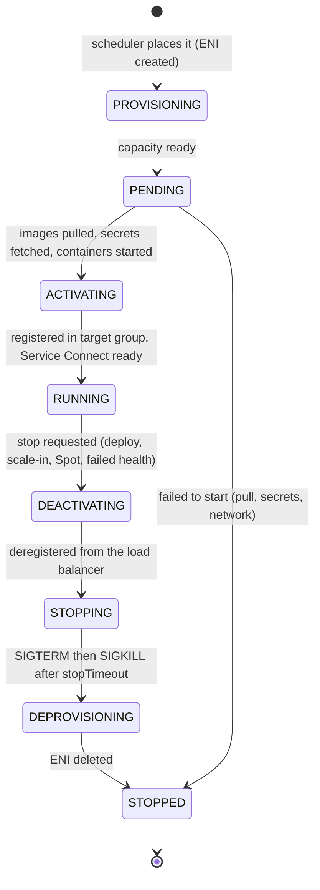

# ECS tasks and task definitions

> [!abstract] In one sentence
> A **task definition** is the versioned JSON recipe for a group of containers (images, CPU and memory, ports, environment and secrets, IAM roles, logging, health checks), and a **task** is one running copy of a revision of it: ECS takes it from `PROVISIONING` to `RUNNING` to `STOPPED`, and every stop leaves a **reason** I can read.

## Common misconceptions

**Wrong mental model #1:** "A task definition is one container."

**What's actually true:** it describes **up to 10 containers** that always run **together on the same host**, share the task's network (same IP, they reach each other on `localhost`), can share volumes, and live and die together. The main app plus **sidecars**: a log router, a proxy, a metrics agent, an init container that runs migrations first.

**Wrong mental model #2:** "Secrets in a task definition are refreshed when I rotate them."

**What's actually true:** values from `secrets` (Parameter Store / Secrets Manager) are fetched **once, when the task starts**, and injected as environment variables. A rotated password reaches the app only when **new tasks** start (force a new deployment). Apps that need live rotation must read the secret themselves at runtime with the task role.

| Wrong mental model | What's actually true |
|---|---|
| Editing a task definition changes it | Each registration creates a **new revision** (`shop-api:7` → `shop-api:8`). Revisions are immutable |
| The container's `memory` is a reservation | `memory` is a **hard limit**: exceed it and the container is **killed** (exit 137). `memoryReservation` is the soft one (EC2 only matters for placement) |
| CPU is a hard limit too | CPU is **shared and throttled**, not killed. On Fargate the task gets the vCPUs it asked for |
| Any CPU/memory combination works on Fargate | Fargate has **fixed combinations** (table below) |
| `environment` is fine for passwords | Plain `environment` values are visible to anyone who can read the task definition. Use `secrets` |
| A task that stops "for no reason" left no trace | Every stopped task has a **stop code**, a **stopped reason**, and per-container **exit codes** (kept about an hour in the API, forever if I capture the EventBridge event) |
| Containers in a task start in random order | They start in parallel **unless** `dependsOn` says otherwise |

## Anatomy of a task definition

### Task-level fields

| Field | What it sets | Notes |
|---|---|---|
| `family` | The name. Revisions are `family:N` | `shop-api` |
| `requiresCompatibilities` | `FARGATE`, `EC2`, or both | Validates the definition against that launch type |
| `networkMode` | `awsvpc`, `bridge`, `host`, `none` | Fargate: **only `awsvpc`**. See [[ECS on Fargate vs EC2]] |
| `cpu`, `memory` | Task size | **Required on Fargate**, from the allowed combinations |
| `runtimePlatform` | `LINUX`/`WINDOWS_SERVER_…`, `X86_64`/`ARM64` | Must match the image |
| `executionRoleArn` | Role **ECS** uses: pull image, logs, secrets | |
| `taskRoleArn` | Role **my code** uses | |
| `ephemeralStorage` | Fargate scratch disk | 20 GiB default, up to 200 GiB |
| `volumes` | Shared between containers, or persistent | Bind mounts (task-lived), **[[EFS]]** (shared, persistent, via access points), EBS (one per task) |

**Fargate CPU/memory combinations:**

| CPU (units) | vCPU | Memory allowed |
|---|---|---|
| 256 | 0.25 | 512 MB, 1 GB, 2 GB |
| 512 | 0.5 | 1–4 GB |
| 1024 | 1 | 2–8 GB |
| 2048 | 2 | 4–16 GB |
| 4096 | 4 | 8–30 GB |
| 8192 | 8 | 16–60 GB |
| 16384 | 16 | 32–120 GB |

(1,024 CPU units = 1 vCPU.)

### Container-level fields

| Field | What it does | Watch out |
|---|---|---|
| `image` | Registry/repo:tag (or `@sha256:` digest) | Pin a version, never `latest` |
| `essential` | If this container stops, **the whole task stops** | At least one must be essential. Sidecars that may exit (init) → `false` |
| `cpu`, `memory`, `memoryReservation` | Per-container share / hard limit / soft limit | Sum must fit in the task size |
| `portMappings` | Ports the container listens on | `awsvpc`: `containerPort` only. `bridge`: `hostPort` 0 = dynamic |
| `environment` / `environmentFiles` | Plain config (files from S3) | Not for secrets |
| `secrets` | Env vars filled from Parameter Store or Secrets Manager **at start** | Execution role needs read + `kms:Decrypt` |
| `logConfiguration` | Where stdout/stderr go | `awslogs` → CloudWatch Logs, or `awsfirelens` → Fluent Bit sidecar |
| `healthCheck` | Command ECS runs **inside** the container | The tool (`curl`) must exist in the image |
| `dependsOn` | Start order: `START`, `COMPLETE`, `SUCCESS`, `HEALTHY` | |
| `stopTimeout` | Seconds between SIGTERM and SIGKILL | Default 30, max 120 on Fargate |
| `readonlyRootFilesystem`, `user`, `linuxParameters` | Hardening: read-only FS, non-root user, drop capabilities, `initProcessEnabled` | `initProcessEnabled` reaps zombies and helps ECS Exec |
| `ulimits` | e.g. `nofile` (max open files/sockets) | Busy servers need a high `nofile` (see [[Sockets]]) |

## Build-up: the shop-api task, piece by piece

Shop account `123456789012`, `eu-west-1`, cluster `shop-prod` on Fargate (overview in [[ECS]]).

### Stage 1: one container

Task `shop-api:1`: one `api` container, 0.5 vCPU / 1 GB, logs to `/ecs/shop-api`, `DB_PASSWORD` from Parameter Store. It works, until a traffic spike:

```
stoppedReason: "OutOfMemoryError: Container killed due to memory usage"
containers[api].exitCode: 137
```

137 = 128 + 9: killed by **SIGKILL** (signal 9), here by the kernel's OOM killer because the container hit its **hard** `memory` limit. Fix: `shop-api:2` with 2 GB (the 512 CPU row allows up to 4 GB), and look at memory in [[CloudWatch]] Container Insights to see if it's a leak.

### Stage 2: sidecars

The app needs two helpers in the **same** task:
- **Log router** (`log-router`, Fluent Bit via **FireLens**): parses JSON logs, sends errors to CloudWatch Logs and everything to S3, instead of the plain `awslogs` driver
- **Migrations** (`migrate`): runs `alembic upgrade head` **before** the app starts, then exits

```json
"containerDefinitions": [
  { "name": "log-router", "essential": true,
    "image": "public.ecr.aws/aws-observability/aws-for-fluent-bit:stable",
    "firelensConfiguration": { "type": "fluentbit" } },
  { "name": "migrate", "essential": false,
    "image": "123456789012.dkr.ecr.eu-west-1.amazonaws.com/shop-api:1.43.0",
    "command": ["alembic", "upgrade", "head"] },
  { "name": "api", "essential": true,
    "image": "123456789012.dkr.ecr.eu-west-1.amazonaws.com/shop-api:1.43.0",
    "dependsOn": [
      { "containerName": "migrate",    "condition": "SUCCESS" },
      { "containerName": "log-router", "condition": "START" } ],
    "logConfiguration": { "logDriver": "awsfirelens", "options": { "Name": "cloudwatch_logs" } } }
]
```

- `migrate` is **not essential**: it's supposed to exit. `api` only starts if it exited with **0** (`SUCCESS`)
- All three share the task's network: the app could reach a sidecar on `localhost:<port>`, like processes on one machine (see [[Inter-process communication]])

**The problem:** with 10 tasks, **10 migrations** start at the same time on every deploy, racing each other. Migrations belong in **one** place: a standalone task (Stage 5), not in every service task.

### Stage 3: where the task gets its AWS credentials

My code calls `boto3.client("s3")` with no keys anywhere. How does it get the task role's permissions?

ECS sets `AWS_CONTAINER_CREDENTIALS_RELATIVE_URI` in the container. The SDK sees it and fetches **temporary credentials** for the **task role** from the link-local address `169.254.170.2`, refreshing them before they expire. The task's metadata (task ARN, IPs, limits) is at `$ECS_CONTAINER_METADATA_URI_V4`.

```bash
# inside a task (ECS Exec):
curl -s $ECS_CONTAINER_METADATA_URI_V4/task | jq '.TaskARN, .Containers[].Networks[].IPv4Addresses'
```

Consequences:
- **Never** put access keys in the image or env vars: the task role is automatic
- Each service gets **its own task role** with only what it needs (least privilege per service, not one big role for the cluster)
- In [[CloudTrail]] the app's calls appear as `assumed-role/shop-api-task/<task-id>`: the task ID is the session name, so I can trace a call to one task

### Stage 4: the life of a task



Where time goes when a Fargate task is "slow to start": capacity + ENI attach (seconds), **image pull** (the big one: a 1.5 GB image takes much longer than a 150 MB one, and Fargate doesn't cache images between tasks), secrets, then the app's own startup until health checks pass. Small images (multi-stage builds, slim bases) and **SOCI** lazy loading cut it.

### Stage 5: tasks without a service

Not everything is a long-running service:

**One-off task**: the migration, run once per deploy, before updating the service:

```bash
aws ecs run-task --cluster shop-prod --launch-type FARGATE \
  --task-definition shop-api:9 \
  --network-configuration "awsvpcConfiguration={subnets=[subnet-0priv2a],securityGroups=[sg-0shopapi],assignPublicIp=DISABLED}" \
  --overrides '{"containerOverrides":[{"name":"api","command":["alembic","upgrade","head"]}]}' \
  --started-by "deploy-1.43.0"
aws ecs wait tasks-stopped --cluster shop-prod --tasks <task-arn>   # then check its exit code
```

`--overrides` reuses the same image and settings with a different command: no separate task definition needed.

**Scheduled task**: the nightly invoice export, an [[EventBridge]] **Scheduler** schedule (`cron(0 2 * * ? *)`) whose target is ECS `RunTask`. No server sitting idle all day for a 10-minute job, and unlike [[Lambda]] there's no 15-minute limit.

**Orchestrated task**: a [[Step Functions]] state with `arn:aws:states:::ecs:runTask.sync` starts the task and **waits** for it to finish, with retries and error handling around it.

**Queue workers**: a service whose desired count follows the [[SQS]] backlog, scaled to zero overnight if allowed.

### Stage 6: revisions and cleanup

After a year: `shop-api:1` … `shop-api:214`. Old revisions cost nothing, but clutter and keep pointing at old images (ECR lifecycle policies may have deleted those images, so they're not even runnable). Deregister old revisions (they become `INACTIVE`, then can be deleted), keep the last N for rollback. Infrastructure-as-code (Terraform, CDK, Copilot) registers a revision per deploy and tracks which one each service uses.

## Why tasks stop

Stop codes (`stopCode`):

| Stop code | Meaning |
|---|---|
| `TaskFailedToStart` | Never got to RUNNING: image pull, secrets, network, capacity, invalid config |
| `EssentialContainerExited` | An essential container exited: the app crashed or finished |
| `ServiceSchedulerInitiated` | The service stopped it: deploy, scale-in, **failed health checks** |
| `SpotInterruption` | Fargate Spot capacity reclaimed |
| `UserInitiated` | Someone or something called `StopTask` |
| `TerminationNotice` | Fargate platform maintenance retiring the task |

Container exit codes:

| Exit code | Usually means |
|---|---|
| `0` | Finished normally (fine for jobs, suspicious for a service) |
| `1` | Application error: read the logs |
| `137` | SIGKILL: **out of memory**, or didn't exit within `stopTimeout` after SIGTERM |
| `139` | Segfault |
| `143` | 128 + 15: exited on SIGTERM (normal during deploys/scale-in) |
| `255` / `CannotStartContainerError` | Bad entrypoint/command, `exec format error` (wrong CPU architecture) |

To keep a history (the API forgets stopped tasks after about an hour), an EventBridge rule on **"ECS Task State Change"** with `lastStatus = STOPPED` sends every stop reason to a log group, and a [[CloudWatch alarms|CloudWatch alarm]] can fire on a spike of `TaskFailedToStart`.

## Practice

> [!example]- A container exits with code 137. Two possible causes?
> Out of memory (hit the hard `memory` limit), or it didn't stop within `stopTimeout` after SIGTERM and was SIGKILLed.

> [!example]- I rotated the DB password in Secrets Manager, but the app still uses the old one. Why?
> `secrets` are injected at task start. Force a new deployment (or have the app read the secret at runtime).

> [!example]- How does code in a task get AWS credentials without keys?
> The SDK reads `AWS_CONTAINER_CREDENTIALS_RELATIVE_URI` and fetches temporary task-role credentials from 169.254.170.2.

> [!example]- How do I run DB migrations once per deploy on ECS?
> A standalone `run-task` with a command override (or a Step Functions `runTask.sync` step) before updating the service. Not as a sidecar in every service task.

> [!example]- Is 0.25 vCPU with 4 GB a valid Fargate task size?
> No. 256 CPU units allow only 512 MB, 1 GB or 2 GB.

> [!example]- How do I make the app container wait for a migration container to succeed?
> `dependsOn` with `condition: SUCCESS` on the migration container, which is marked `essential: false`.

> [!example]- A nightly 40-minute export job: Lambda or ECS?
> ECS scheduled task (EventBridge Scheduler → RunTask). Lambda stops at 15 minutes.

## Easy to get wrong
- Treating `memory` as a soft limit: it's the kill threshold
- Picking an invalid Fargate CPU/memory combination
- Secrets in `environment` instead of `secrets`
- Expecting rotated secrets in running tasks
- Giving the execution role the app's permissions (or the task role ECR permissions)
- Making a sidecar that's supposed to exit `essential: true`: the whole task stops
- Health check commands using tools not in the image
- Migrations in every task of a service instead of once
- Ignoring stopped reasons: they're only in the API for about an hour, capture them via EventBridge
- One task role shared by every service in the cluster
- Not cleaning up hundreds of old revisions pointing at deleted images

## Related
- The orchestrator:: [[ECS]]
- The image in `image`:: [[Docker]], [[Docker image tags]]
- Where tasks run:: [[ECS on Fargate vs EC2]]
- Secrets and config:: [[Systems Manager]] (Parameter Store), [[IAM]]
- Logs and metrics:: [[CloudWatch Logs]], [[CloudWatch]], [[CloudWatch alarms]]
- Running tasks on events and schedules:: [[EventBridge]], [[Step Functions]], [[SQS]]
- Same job on other compute:: [[Lambda]], [[EC2]]
- Concepts:: [[Inter-process communication]] (signals, localhost between containers), [[Sockets]] (nofile limits)
- Audit:: [[CloudTrail]]

## Flashcards
#flashcards

What is a task definition? :: A versioned JSON template describing up to 10 containers, their resources, roles, networking, logging and secrets
What is a task definition revision? :: An immutable version (family:N). Every registration creates a new one
How many containers can a task definition have? :: Up to 10
What does essential: true mean on a container? :: If it stops, the whole task stops
memory vs memoryReservation in a container definition? :: memory = hard limit (killed above it). memoryReservation = soft limit used for placement
Smallest Fargate task size? :: 0.25 vCPU (256 units) with 512 MB, 1 GB or 2 GB
How many CPU units are one vCPU? :: 1024
When are task definition secrets resolved? :: Once at task start, injected as environment variables
Which role reads the secrets referenced in a task definition? :: The execution role (plus kms:Decrypt)
How does the SDK in a task get task-role credentials? :: From 169.254.170.2 via AWS_CONTAINER_CREDENTIALS_RELATIVE_URI
What does dependsOn condition SUCCESS do? :: Waits for that container to exit with code 0 before starting this one
What is FireLens? :: The awsfirelens log driver routing container logs through a Fluent Bit/Fluentd sidecar
Default and max ECS stopTimeout on Fargate? :: 30 s default, 120 s max
Default Fargate ephemeral storage? :: 20 GiB, configurable up to 200 GiB
ECS task lifecycle main states? :: PROVISIONING → PENDING → ACTIVATING → RUNNING → DEACTIVATING → STOPPING → DEPROVISIONING → STOPPED
Exit code 137? :: SIGKILL: out of memory, or didn't stop within stopTimeout
Exit code 143? :: Exited on SIGTERM (normal on deploy/scale-in)
What does stopCode TaskFailedToStart mean? :: The task never reached RUNNING (image pull, secrets, network, capacity, config)
How to run a one-off command (like a migration) on ECS? :: aws ecs run-task with a container command override
How to run an ECS task on a schedule? :: EventBridge Scheduler targeting ECS RunTask
How to keep stopped-task reasons beyond about an hour? :: EventBridge rule on ECS Task State Change (STOPPED) to a log group
Why is a big image slow on Fargate? :: Fargate pulls the image for every task, no host cache
