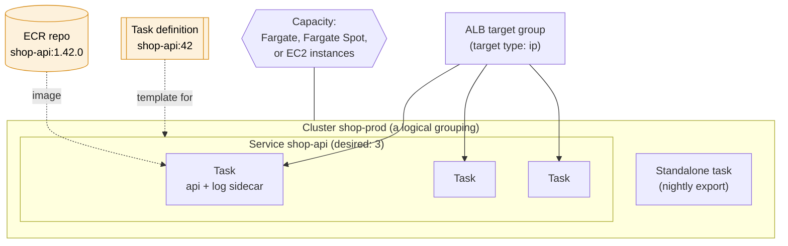
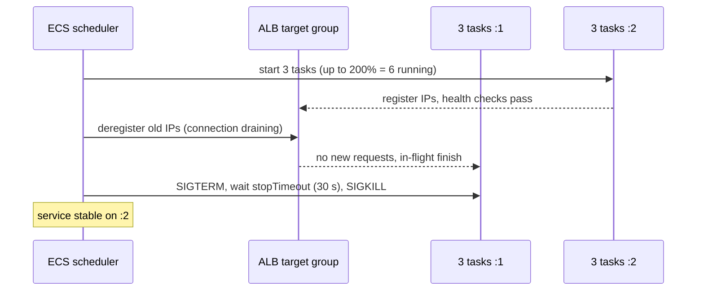

# ECS

> [!abstract] In one sentence
> ECS (Elastic Container Service) is AWS's **container orchestrator**: I describe my containers in a **task definition**, ECS runs copies of it as **tasks**, a **service** keeps the right number of tasks running behind a load balancer and replaces them when they die or when I deploy, and the tasks run either on **Fargate** (AWS provides the servers) or on **EC2 instances I provision**.

## Common misconceptions

**Wrong mental model #1:** "ECS runs my Docker containers on a server, like `docker run` on EC2."

**What's actually true:** ECS is a **scheduler**, not a place. It decides **where** each task runs, **restarts** what dies, **rolls out** new versions without downtime, registers tasks in the **load balancer**, and **scales** the count. The compute underneath is either Fargate (AWS-managed micro-VMs) or EC2 instances in my account running the ECS agent. Without a service, a task that crashes just stays dead.

**Wrong mental model #2:** "With Fargate there's nothing to configure: no networking, no IAM."

**What's actually true:** Fargate removes **servers**, not **design**. Every Fargate task gets its **own network interface** in **my** subnet with **my** security group, so it needs a route to ECR to pull its image (NAT or VPC endpoints), and it needs **two** IAM roles (one for ECS to start it, one for my code). Most "my task won't start" problems on Fargate are networking or IAM, not containers.

| Wrong mental model | What's actually true |
|---|---|
| A task = a container | A task = **one or more containers** started together on the same host, sharing network and lifecycle (app + sidecars) |
| A task definition is the running thing | It's a **versioned template** (like a launch template). Tasks are instances of one **revision** of it |
| Updating the task definition updates running tasks | Running tasks never change. Registering a new revision and **updating the service** starts new tasks and stops old ones |
| ECS needs Kubernetes knowledge | No. ECS is AWS's own, simpler orchestrator. **EKS** is the managed Kubernetes one |
| The image lives in ECS | Images live in a **registry**: usually **ECR** (Elastic Container Registry), or Docker Hub/GHCR |
| A healthy container = a healthy service | ECS health (container `healthCheck`) and **load balancer** health checks are separate, and either can kill tasks |
| `docker exec` into a Fargate task is impossible | **ECS Exec** opens a shell through Systems Manager (see Stage 8) |

## The building blocks



| Concept | What it is | Analogy |
|---|---|---|
| **Cluster** | A logical group of services/tasks (and EC2 instances if I use them). Free, just a namespace | A folder |
| **Task definition** | JSON template: images, CPU/memory, ports, env vars, secrets, roles, logging. Versioned as `family:revision` | A launch template |
| **Task** | A running copy of one task definition revision | An instance |
| **Service** | Keeps N tasks running, replaces failures, rolling deploys, ALB registration, auto scaling | An Auto Scaling group |
| **Capacity provider** | Where tasks run: `FARGATE`, `FARGATE_SPOT`, or an Auto Scaling group of EC2 instances | |
| **Container agent** | Software on each EC2 container instance that talks to ECS (hidden on Fargate) | |

Details of task definitions and the task lifecycle: [[ECS tasks and task definitions]]. Fargate vs provisioning EC2 instances myself: [[ECS on Fargate vs EC2]].

## Build-up: moving the shop API to ECS on Fargate

Shop account `123456789012`, `eu-west-1`, VPC `10.0.0.0/16` with public subnets for the ALB and private subnets `10.0.2.0/24`, `10.0.3.0/24` for the app. Today `shop-api` runs on EC2 instances built with [[Packer]].

### Stage 1: an image in ECR

```bash
aws ecr create-repository --repository-name shop-api \
  --image-scanning-configuration scanOnPush=true \
  --image-tag-mutability IMMUTABLE

aws ecr get-login-password --region eu-west-1 \
  | docker login --username AWS --password-stdin 123456789012.dkr.ecr.eu-west-1.amazonaws.com

docker build --platform linux/arm64 -t shop-api:1.42.0 .
docker tag  shop-api:1.42.0 123456789012.dkr.ecr.eu-west-1.amazonaws.com/shop-api:1.42.0
docker push 123456789012.dkr.ecr.eu-west-1.amazonaws.com/shop-api:1.42.0
```

- **Immutable tags**: `1.42.0` can never be overwritten, so "what's running" is unambiguous. Never deploy `:latest`
- **Scan on push** flags known CVEs
- **Lifecycle policy** on the repo: keep the last 30 images, expire untagged ones
- `--platform linux/arm64`: Graviton tasks are cheaper. The task definition must say the same architecture, or the task fails with `exec format error`

### Stage 2: a cluster and a task definition

```bash
aws ecs create-cluster --cluster-name shop-prod \
  --capacity-providers FARGATE FARGATE_SPOT \
  --settings name=containerInsights,value=enhanced
```

The task definition (trimmed: full field-by-field tour in [[ECS tasks and task definitions]]):

```json
{
  "family": "shop-api",
  "requiresCompatibilities": ["FARGATE"],
  "networkMode": "awsvpc",
  "cpu": "512",
  "memory": "1024",
  "runtimePlatform": { "cpuArchitecture": "ARM64", "operatingSystemFamily": "LINUX" },
  "executionRoleArn": "arn:aws:iam::123456789012:role/shop-api-execution",
  "taskRoleArn": "arn:aws:iam::123456789012:role/shop-api-task",
  "containerDefinitions": [{
    "name": "api",
    "image": "123456789012.dkr.ecr.eu-west-1.amazonaws.com/shop-api:1.42.0",
    "essential": true,
    "portMappings": [{ "containerPort": 8000, "protocol": "tcp" }],
    "environment": [{ "name": "ENV", "value": "prod" }],
    "secrets": [{ "name": "DB_PASSWORD",
                  "valueFrom": "arn:aws:ssm:eu-west-1:123456789012:parameter/shop/prod/db/password" }],
    "logConfiguration": { "logDriver": "awslogs", "options": {
        "awslogs-group": "/ecs/shop-api", "awslogs-region": "eu-west-1",
        "awslogs-stream-prefix": "api", "awslogs-create-group": "true" } },
    "healthCheck": { "command": ["CMD-SHELL", "curl -fs http://localhost:8000/health || exit 1"],
                     "interval": 15, "timeout": 5, "retries": 3, "startPeriod": 30 },
    "stopTimeout": 30
  }]
}
```

```bash
aws ecs register-task-definition --cli-input-json file://shop-api.json
# → shop-api:1 (the next registration becomes shop-api:2, and so on)
```

The **two roles**, the thing everyone mixes up:

| Role | Used by | Needs | Shop example |
|---|---|---|---|
| **Execution role** | **ECS/Fargate**, *before and around* my code | Pull from ECR, write to CloudWatch Logs, read the **secrets** referenced in the task definition | `AmazonECSTaskExecutionRolePolicy` + `ssm:GetParameters` on `/shop/prod/*` + `kms:Decrypt` |
| **Task role** | **My application** inside the container (the SDK picks it up automatically) | Whatever the app calls | `s3:PutObject` on the invoices bucket, `sqs:SendMessage` on `shop-prod-orders` |

### Stage 3: a service behind the ALB

```bash
aws ecs create-service --cluster shop-prod --service-name shop-api \
  --task-definition shop-api:1 --desired-count 3 \
  --capacity-provider-strategy capacityProvider=FARGATE,weight=1,base=2 capacityProvider=FARGATE_SPOT,weight=3 \
  --network-configuration "awsvpcConfiguration={subnets=[subnet-0priv2a,subnet-0priv3b],securityGroups=[sg-0shopapi],assignPublicIp=DISABLED}" \
  --load-balancers targetGroupArn=arn:aws:elasticloadbalancing:eu-west-1:123456789012:targetgroup/shop-api/abc123,containerName=api,containerPort=8000 \
  --health-check-grace-period-seconds 60 \
  --deployment-configuration "minimumHealthyPercent=100,maximumPercent=200,deploymentCircuitBreaker={enable=true,rollback=true}" \
  --enable-execute-command
```

- The ALB **target group** must be **target type `ip`**: with `awsvpc`, each task has its own IP, and ECS registers/deregisters those IPs as tasks start and stop (see [[Load balancers]])
- **Security groups per task**: the ALB's SG → `sg-0shopapi` on 8000. [[RDS]]'s SG allows 5432 from `sg-0shopapi`. Same pattern as instances, now per task (see [[Security groups]])
- **Capacity provider strategy**: the first 2 tasks (`base=2`) on regular Fargate, the rest 1:3 regular:Spot. Spot is ~70% cheaper and can be reclaimed with a 2-minute warning, so it's for the **extra** capacity
- `--health-check-grace-period-seconds 60`: ignore ALB health checks while the app starts, so slow starts aren't killed in a loop

**The problem:** the service is created, the tasks go `PROVISIONING → PENDING → STOPPED`, over and over. The stopped reason:

```
ResourceInitializationError: unable to pull secrets or registry auth: ...
  dial tcp 52.x.x.x:443: i/o timeout
```

### Stage 4: the network path to pull images

The tasks are in **private** subnets with `assignPublicIp=DISABLED`, and this VPC has **no NAT gateway**. To start a task, Fargate must reach, **from the task's own ENI**:

| Needed for | Endpoint | Type |
|---|---|---|
| ECR API (auth, manifest) | `com.amazonaws.eu-west-1.ecr.api` | Interface |
| Image pulls (registry) | `com.amazonaws.eu-west-1.ecr.dkr` | Interface |
| **Image layers** (stored in S3) | `com.amazonaws.eu-west-1.s3` | **Gateway** (free) |
| Logs (`awslogs`) | `com.amazonaws.eu-west-1.logs` | Interface |
| Secrets from Parameter Store / Secrets Manager | `ssm` / `secretsmanager` | Interface |
| ECS Exec | `ssmmessages` | Interface |

Two options:
- A **NAT gateway** (simple, pays per GB: image pulls of 500 MB × hundreds of task starts add up)
- **VPC endpoints** (the list above), with their security group allowing **443 from the task subnets**. The S3 gateway endpoint is the one everyone forgets: auth succeeds, then the layer download hangs

Same "outbound only" model as everything else in a private subnet: the task opens the connections, nothing comes in except from the ALB (see [[Outbound-initiated connections]]).

### Stage 5: deploying a new version

New image `1.43.0` → register `shop-api:2` → update the service:

```bash
aws ecs update-service --cluster shop-prod --service shop-api --task-definition shop-api:2
aws ecs wait services-stable --cluster shop-prod --services shop-api
```

With `minimumHealthyPercent=100, maximumPercent=200` and 3 tasks, the **rolling update**:



- **Deployment circuit breaker** with rollback: if new tasks keep failing to become healthy, ECS **stops the deployment and rolls back** to `:1` automatically, instead of looping forever
- The app must handle **SIGTERM** (stop accepting, finish requests): see [[Inter-process communication#Stage 3: signals, a tap on the shoulder]]. And the target group's **deregistration delay** (default 300 s) should be shortened to something like 30 s, or deploys crawl
- Other strategies: **blue/green** (a whole new set of tasks, then switch the ALB listener, with a bake time to roll back instantly), canary/linear traffic shifting

### Stage 6: scaling the service

Service Auto Scaling (Application Auto Scaling) changes the **desired count**:

```bash
aws application-autoscaling register-scalable-target --service-namespace ecs \
  --resource-id service/shop-prod/shop-api --scalable-dimension ecs:service:DesiredCount \
  --min-capacity 3 --max-capacity 30

aws application-autoscaling put-scaling-policy --service-namespace ecs \
  --resource-id service/shop-prod/shop-api --scalable-dimension ecs:service:DesiredCount \
  --policy-name cpu60 --policy-type TargetTrackingScaling \
  --target-tracking-scaling-policy-configuration \
  '{"TargetValue":60,"PredefinedMetricSpecification":{"PredefinedMetricType":"ECSServiceAverageCPUUtilization"}}'
```

Good metrics: `ECSServiceAverageCPUUtilization`, `ALBRequestCountPerTarget`, or for queue workers the **backlog per task** from [[SQS]]. On Fargate, scaling tasks is all there is. On EC2, the **instances** must scale too (see [[ECS on Fargate vs EC2]]).

### Stage 7: services finding each other

The new `shop-pricing` service must be called by `shop-api`. Options:
- An **internal ALB** in front of `shop-pricing` (simple, costs an ALB)
- **Service Connect**: each service gets a short name (`http://pricing:8080`), ECS injects a proxy into the tasks that load balances, retries, and publishes per-call metrics
- **Cloud Map** DNS records per task (`pricing.shop.local` → task IPs)

The general concepts are in [[Service discovery]], the AWS mapping in [[Proxies, load balancing and discovery in AWS]].

### Stage 8: getting a shell in a running task

```bash
aws ecs execute-command --cluster shop-prod \
  --task 8f3c2d1e0b9a4c7d --container api --interactive --command "/bin/sh"
```

Requirements: `--enable-execute-command` on the service (only tasks started after it), the **task role** allows `ssmmessages:CreateControlChannel`, `CreateDataChannel`, `OpenControlChannel`, `OpenDataChannel`, a path to the `ssmmessages` endpoint, and the Session Manager plugin locally. It's [[Systems Manager|Session Manager]] underneath: the agent inside the task dials out, the shell comes back on that connection. Sessions can be logged to S3/CloudWatch, and `ExecuteCommand` shows up in [[CloudTrail]].

## When tasks keep stopping

```bash
aws ecs describe-tasks --cluster shop-prod --tasks <task-id> \
  --query 'tasks[].{stopCode:stopCode,reason:stoppedReason,containers:containers[].{name:name,exit:exitCode,reason:reason}}'
aws ecs describe-services --cluster shop-prod --services shop-api --query 'services[].events[:10]'
```

| Symptom (stopped reason / exit code) | Meaning | Fix |
|---|---|---|
| `CannotPullContainerError` / `ResourceInitializationError … i/o timeout` | No network path to ECR/S3/secrets | NAT or VPC endpoints (incl. S3 gateway), endpoint SG on 443 |
| `… AccessDeniedException … ssm:GetParameters` | Execution role can't read the secret | Add permission (and `kms:Decrypt`) to the **execution** role |
| `exec format error` | Image architecture ≠ `runtimePlatform` | Build for the right arch (`--platform`) or multi-arch |
| Exit code **137**, `OutOfMemoryError: Container killed` | Hit the memory limit (SIGKILL) | More memory, fix the leak |
| `Task failed ELB health checks` | ALB couldn't reach `/health` in time | Health check path/port, SG from ALB, grace period |
| `Task failed container health checks` | The container's own `healthCheck` failed | The command (is `curl` even in the image?), `startPeriod` |
| `Essential container in task exited`, exit 1 | The app crashed | Read `/ecs/shop-api` logs |
| App gets `AccessDenied` from S3 | **Task** role missing the permission | Add it to the task role, not the execution role |

More in [[ECS tasks and task definitions#Why tasks stop]].

## ECS vs the other ways to run containers

| Option | What it is | Pick it when |
|---|---|---|
| **ECS on Fargate** | AWS orchestrator + serverless compute | Default for containers on AWS: no servers to manage |
| **ECS on EC2** | Same orchestrator, my instances | GPUs, huge sustained fleets, host-level agents, special instance types |
| **EKS** | Managed Kubernetes control plane | Team already on Kubernetes, multi-cloud portability, the K8s ecosystem |
| **App Runner** | Push an image, get an HTTPS URL | Simple web apps, no VPC/ALB design wanted |
| **Lambda (container image)** | Functions packaged as images | Event-driven, short (≤ 15 min) work |
| **Lightsail containers** | Fixed-price simple containers | Hobby/small sites (see [[Lightsail]]) |

## Practice

> [!example]- What's the difference between a task definition, a task and a service?
> Task definition: the versioned template. Task: a running copy of one revision. Service: keeps N tasks running, replaces failures, deploys, registers them with the load balancer.

> [!example]- My app in a Fargate task gets AccessDenied writing to S3. Which role do I fix?
> The task role (used by the application). The execution role is only for ECS pulling images, writing logs and fetching secrets.

> [!example]- Fargate tasks in a private subnet without NAT fail with `ResourceInitializationError … i/o timeout`. What's missing?
> A path to ECR: interface endpoints `ecr.api`, `ecr.dkr`, the S3 gateway endpoint for layers, plus `logs` and `ssm`/`secretsmanager` if used.

> [!example]- Which target type must the ALB target group use for Fargate tasks?
> `ip`, because each task has its own ENI and IP (awsvpc mode).

> [!example]- A bad deploy keeps starting tasks that never become healthy. How do I make ECS give up and go back?
> Enable the deployment circuit breaker with rollback.

> [!example]- How do I get a shell inside a running Fargate container?
> ECS Exec (`aws ecs execute-command`), enabled on the service, with ssmmessages permissions in the task role. It uses Session Manager.

## Easy to get wrong
- Mixing up the execution role (ECS's) and the task role (my app's)
- Forgetting the S3 gateway endpoint for image layers in private subnets
- ALB target group with target type `instance` for awsvpc tasks
- Deploying `:latest` (and mutable tags): nobody knows what's running
- Expecting running tasks to change when the task definition changes
- No health check grace period for slow-starting apps: tasks killed in a loop
- Apps ignoring SIGTERM: in-flight requests cut on every deploy
- Leaving the target group deregistration delay at 300 s: slow deploys
- Image built for x86 but task on ARM (or the opposite)
- Putting all capacity on Fargate Spot (no `base` on regular Fargate)
- No circuit breaker: failed deploys loop forever

## Related
- Deep dives:: [[ECS tasks and task definitions]], [[ECS on Fargate vs EC2]]
- Building and tagging the images:: [[Docker]], [[Docker image tags]] (why immutable tags and digests)
- In front of it:: [[Load balancers]], [[Proxies, load balancing and discovery in AWS]]
- Network:: [[VPC]], [[Security groups]], [[Outbound-initiated connections]]
- Permissions and secrets:: [[IAM]], [[Systems Manager]] (Parameter Store, ECS Exec)
- Observability:: [[CloudWatch]], [[CloudWatch Logs]], [[CloudWatch alarms]]
- Other compute:: [[EC2]], [[Lambda]], [[Lightsail]], [[EC2 vs Lightsail vs Lambda]]
- Workers and jobs:: [[SQS]], [[EventBridge]], [[Step Functions]]
- Concepts:: [[Service discovery]], [[Load balancing]], [[Inter-process communication]] (signals)

## Flashcards
#flashcards

What is ECS? :: AWS's container orchestrator: runs tasks from task definitions, services keep them running, on Fargate or EC2
Task definition vs task vs service? :: Template (versioned) vs running copy vs controller keeping N tasks running with deploys and LB registration
What is a task? :: One or more containers started together from one task definition revision, sharing network and lifecycle
What is ECR? :: Elastic Container Registry, AWS's private Docker image registry
Why use immutable image tags in ECR? :: A tag can't be overwritten, so a deployed version always means the same image
Execution role vs task role? :: Execution role: ECS pulls images, writes logs, fetches secrets. Task role: permissions for the app's own AWS calls
Which network mode does Fargate use? :: awsvpc: each task gets its own ENI, private IP and security groups
ALB target type for Fargate tasks? :: ip
What endpoints do private Fargate tasks need without NAT? :: ecr.api, ecr.dkr, S3 gateway (layers), logs, plus ssm/secretsmanager for secrets and ssmmessages for Exec
What does minimumHealthyPercent=100, maximumPercent=200 do in a deploy? :: Starts all new tasks before stopping old ones, never below the desired count
What is the ECS deployment circuit breaker? :: Stops a deployment whose tasks keep failing and optionally rolls back to the last working revision
What happens to a task's containers when it stops? :: SIGTERM, then SIGKILL after stopTimeout (default 30 s)
What is the health check grace period? :: Time after a task starts during which ALB health check failures are ignored
What does a capacity provider strategy with base and weight do? :: base = minimum tasks on a provider, weight = ratio for the rest (e.g. Fargate vs Fargate Spot)
How does Fargate Spot end a task? :: Reclaimed with a 2-minute warning (SIGTERM), so use it for extra, interruptible capacity
What scales an ECS service? :: Application Auto Scaling on the desired count (CPU, ALBRequestCountPerTarget, custom like SQS backlog)
What is ECS Service Connect? :: Short service names plus an injected proxy for load balancing, retries and metrics between services
How do you get a shell in a Fargate task? :: ECS Exec (aws ecs execute-command), built on SSM Session Manager
Exit code 137 in an ECS task? :: Killed by SIGKILL, usually out of memory
ECS vs EKS? :: ECS: AWS's own simpler orchestrator. EKS: managed Kubernetes
