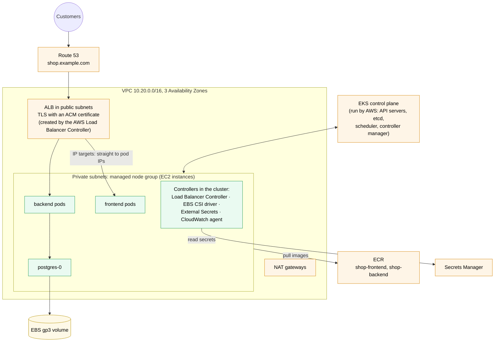
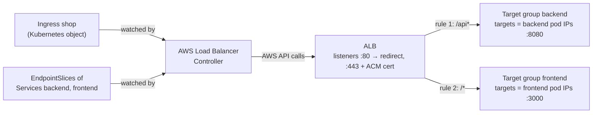
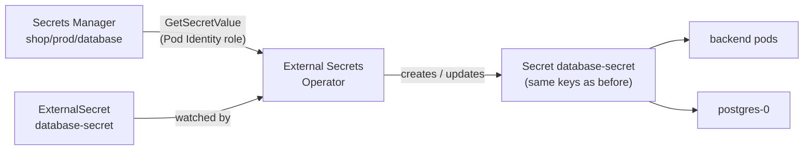

# Kubernetes worked example on EKS

> [!abstract] In one sentence
> The shop from [[Kubernetes worked example]] runs on EKS (Elastic Kubernetes Service) with **almost the same manifests**: AWS (Amazon Web Services) runs the control plane, and a few AWS **controllers** turn the platform-specific objects into AWS resources: an Ingress becomes an ALB (Application Load Balancer) with an ACM (AWS Certificate Manager) certificate, a PVC (PersistentVolumeClaim) becomes an EBS (Elastic Block Store) volume, a Secret is filled from Secrets Manager, and pods get IAM (Identity and Access Management) roles through Pod Identity. Only the **images, the Ingress, the StorageClass and the Secret** change.

Every manifest of the shop (Namespace, ConfigMap, ServiceAccount, RBAC, StatefulSet, Deployments, Services, HPA, PDB, NetworkPolicy, Job, CronJob) is explained in [[Kubernetes worked example]] and isn't repeated here. This note is about getting that same configuration onto AWS: what to build around it, and the few manifests that have to change.

## The whole picture first



What changes compared with a cluster I run myself:

| Piece | Self-managed cluster | EKS |
|---|---|---|
| Control plane (API server, etcd, scheduler, controllers) | Mine to run, back up and upgrade | AWS runs it across 3 AZs (Availability Zones). I pick the version and click "upgrade" |
| Nodes | Mine | **Managed node group**: an Auto Scaling group of EC2 (Elastic Compute Cloud) instances that EKS creates, patches and drains for me |
| Pod network | A CNI (Container Network Interface) plugin like Calico or Cilium | **Amazon VPC CNI**: every pod gets a **real VPC (Virtual Private Cloud) IP (Internet Protocol) address** from the subnet |
| Ingress controller | nginx or another proxy running as pods | **AWS Load Balancer Controller**: creates a real ALB, no proxy pods in the path |
| Storage provisioner | Whatever CSI (Container Storage Interface) driver the storage has | **EBS CSI driver**: one EBS volume per PVC |
| Image registry | `registry.example.com` | **ECR** (Elastic Container Registry) |
| Human access | Client certificates, OIDC (OpenID Connect) | IAM users/roles mapped through **access entries** |
| Pod access to cloud APIs (Application Programming Interfaces) | Keys in a Secret | **EKS Pod Identity**: an IAM role per ServiceAccount, no keys |

> [!tip] The pattern behind all of it
> EKS is the [[Kubernetes#The mental model: a giant state machine|state machine]] with extra controllers whose "corrective action" is an AWS API call. I declare an Ingress, and the Load Balancer Controller reconciles it into an ALB, listeners, rules and target groups. I declare a PVC, and the EBS CSI driver reconciles it into a volume. Debugging is the same too: if the AWS resource doesn't appear, read the **events** of the Kubernetes object, then the controller's logs.

## Build-up

### Stage 1: the cluster

**Problem:** the manifests need a cluster: a control plane, nodes in private subnets across 3 AZs, and the add-ons that connect Kubernetes to AWS.

I describe the cluster as a file too, with `eksctl` (the official command-line tool for EKS, which generates CloudFormation stacks). Region `eu-west-3` (Paris), to match the CronJob's time zone:

```yaml
# cluster.yaml
apiVersion: eksctl.io/v1alpha5
kind: ClusterConfig                     # same four questions as any manifest
metadata:
  name: shop-prod
  region: eu-west-3
  version: "1.34"                       # a currently supported Kubernetes version

vpc:
  cidr: 10.20.0.0/16                    # from the organisation's address plan
  nat:
    gateway: HighlyAvailable            # one NAT gateway per AZ
  clusterEndpoints:
    privateAccess: true                 # nodes reach the API server inside the VPC
    publicAccess: true                  # kubectl from my laptop / CI
  publicAccessCIDRs: ["203.0.113.0/24"] # …only from the office and CI runners

accessConfig:
  authenticationMode: API               # access entries, not the old aws-auth ConfigMap

addons:
  - name: vpc-cni
    configurationValues: '{"enableNetworkPolicy": "true"}'   # needed for step 16's NetworkPolicy
    useDefaultPodIdentityAssociations: true
  - name: coredns
  - name: kube-proxy
  - name: eks-pod-identity-agent        # hands IAM credentials to pods
  - name: aws-ebs-csi-driver            # PVC → EBS volume
    useDefaultPodIdentityAssociations: true
  - name: metrics-server                # the HPA needs pod CPU
  - name: amazon-cloudwatch-observability   # replaces the shop's own node-monitor DaemonSet
    useDefaultPodIdentityAssociations: true

iam:
  podIdentityAssociations:
    - namespace: kube-system
      serviceAccountName: aws-load-balancer-controller
      createServiceAccount: true
      wellKnownPolicies:
        awsLoadBalancerController: true

managedNodeGroups:
  - name: general
    instanceTypes: ["m6i.large"]        # 2 vCPUs, 8 GiB
    minSize: 3
    desiredCapacity: 3
    maxSize: 9
    privateNetworking: true             # nodes only in private subnets
    volumeSize: 50
    volumeType: gp3
```

```bash
eksctl create cluster -f cluster.yaml        # ~15-20 minutes: VPC, control plane, add-ons, nodes
aws eks update-kubeconfig --region eu-west-3 --name shop-prod
kubectl get nodes -L topology.kubernetes.io/zone   # 3 nodes, one per AZ
```

What `eksctl` built:
- A VPC with **public subnets** (for the ALB and NAT gateways) and **private subnets** (for nodes and pods), in 3 AZs. It also **tags** them, `kubernetes.io/role/elb=1` on public and `kubernetes.io/role/internal-elb=1` on private: that's how the Load Balancer Controller finds where to put load balancers. In an existing VPC, I add those tags myself (the network itself is the same as [[ECS production stack#Stage 1: the network]])
- The EKS control plane, with its own security group
- A managed node group: 3 `m6i.large` instances, with a node IAM role that can pull from ECR
- The add-ons, and Pod Identity associations giving the CNI, the EBS driver, the CloudWatch agent and the Load Balancer Controller their own IAM roles

> [!warning] Pod IPs come out of the subnets
> With the VPC CNI, each pod takes a VPC address, and each instance type has a **maximum number of pods** set by how many network interfaces and addresses it can hold (`m6i.large`: 29). A busy cluster runs out of subnet addresses or hits the per-node limit long before CPU. Plan subnets big, or use prefix delegation or a secondary range for pods (see [[VPC IP address planning]]).

> [!info] EKS Auto Mode
> With `autoModeConfig: { enabled: true }`, EKS also manages the nodes (it picks instances per pod, like Karpenter), the EBS driver and the load balancer integration, so most of the add-on list disappears. The manifests below still apply; only the names change (StorageClass provisioner `ebs.csi.eks.amazonaws.com`, and an IngressClass using the `eks.amazonaws.com/alb` controller). I describe the classic setup because it shows every moving part.

### Stage 2: who may use the cluster

**Problem:** the cluster's API is reached with IAM credentials, but Kubernetes RBAC (Role-Based Access Control) knows nothing about IAM. Something has to map "this IAM role" to "this Kubernetes user and permissions".

That's an **access entry**. Only the identity that created the cluster gets admin by default. Everyone else needs one:

```bash
# platform team: cluster admin
aws eks create-access-entry --cluster-name shop-prod \
  --principal-arn arn:aws:iam::123456789012:role/platform-admin
aws eks associate-access-policy --cluster-name shop-prod \
  --principal-arn arn:aws:iam::123456789012:role/platform-admin \
  --policy-arn arn:aws:eks::aws:cluster-access-policy/AmazonEKSClusterAdminPolicy \
  --access-scope type=cluster

# CI deploy role: edit rights in the shop namespace only
aws eks create-access-entry --cluster-name shop-prod \
  --principal-arn arn:aws:iam::123456789012:role/shop-deploy
aws eks associate-access-policy --cluster-name shop-prod \
  --principal-arn arn:aws:iam::123456789012:role/shop-deploy \
  --policy-arn arn:aws:eks::aws:cluster-access-policy/AmazonEKSEditPolicy \
  --access-scope type=namespace,namespaces=shop
```

The CI role itself is assumed through GitHub OIDC with no stored keys, exactly as in [[Connecting GitHub Actions to AWS]]. The shop's own Role and RoleBinding (steps 5-6 of the worked example) don't change: they're about the **backend pod's** permissions inside Kubernetes, not about people.

### Stage 3: images in ECR

**Problem:** the manifests pull from `registry.example.com`. On AWS the images go to ECR, which the nodes can pull from with their IAM role, so no `imagePullSecrets` are needed.

```bash
aws ecr create-repository --repository-name shop-backend  --image-tag-mutability IMMUTABLE
aws ecr create-repository --repository-name shop-frontend --image-tag-mutability IMMUTABLE

aws ecr get-login-password --region eu-west-3 \
  | docker login --username AWS --password-stdin 123456789012.dkr.ecr.eu-west-3.amazonaws.com

docker build -t 123456789012.dkr.ecr.eu-west-3.amazonaws.com/shop-backend:1.4.0 backend/
docker push 123456789012.dkr.ecr.eu-west-3.amazonaws.com/shop-backend:1.4.0
```

Immutable tags mean `1.4.0` can never point to a different image later (see [[Docker image tags]]). The image references in the manifests change, which brings up the real question of this note: **how to change a few things without copying every manifest.**

### Stage 4: one base, one EKS overlay

**Problem:** most manifests are platform-neutral, a few are not. Copying all of them into an "EKS version" means two copies to keep in sync.

The fix is **Kustomize** (built into `kubectl apply -k`): a **base** with everything that's the same everywhere, and an **overlay** per platform that adds or patches the rest.

```text
k8s/
├── base/                         the worked example, unchanged
│   ├── kustomization.yaml
│   ├── namespace.yaml  configmap.yaml  serviceaccount.yaml  role.yaml  rolebinding.yaml
│   ├── postgres-statefulset.yaml  postgres-service.yaml
│   ├── backend-deployment.yaml  backend-service.yaml
│   ├── frontend-deployment.yaml  frontend-service.yaml
│   ├── hpa.yaml  pdb.yaml  networkpolicy.yaml  cronjob.yaml
└── overlays/
    └── eks/
        ├── kustomization.yaml    images + what's added/patched
        ├── storageclass.yaml     fast-storage → EBS gp3
        ├── ingress.yaml          ALB instead of nginx + cert-manager
        ├── service-healthchecks.yaml
        ├── external-secret.yaml  database-secret from Secrets Manager
        └── networkpolicy-allow-alb.yaml
```

Three files from the worked example are **not** in the base:
- `secret.yaml`: real credentials never go in Git (the worked example's own warning). Each platform supplies the Secret its own way
- `ingress.yaml` and `storageclass.yaml`: they name a controller and a provisioner, so they're platform-specific by nature
- The DaemonSet: on EKS the CloudWatch Observability add-on already runs an agent on every node. The migration Job is run by the pipeline per release, not kept in the folder

```yaml
# k8s/overlays/eks/kustomization.yaml
apiVersion: kustomize.config.k8s.io/v1beta1
kind: Kustomization
resources:
  - ../../base
  - storageclass.yaml
  - ingress.yaml
  - external-secret.yaml
  - networkpolicy-allow-alb.yaml
patches:
  - path: service-healthchecks.yaml
images:                                   # rewrites every matching image, in Deployments, Jobs and CronJobs
  - name: registry.example.com/shop-backend
    newName: 123456789012.dkr.ecr.eu-west-3.amazonaws.com/shop-backend
  - name: registry.example.com/shop-frontend
    newName: 123456789012.dkr.ecr.eu-west-3.amazonaws.com/shop-frontend
```

```bash
kubectl kustomize k8s/overlays/eks | less     # see the final YAML before applying
```

The next stages are the files in that overlay, one problem each.

### Stage 5: storage, `fast-storage` becomes EBS

**Problem:** the PostgreSQL StatefulSet asks for `storageClassName: fast-storage`, and the worked example's StorageClass names a placeholder provisioner. On EKS, disks are EBS volumes.

The StatefulSet doesn't change at all. Only the StorageClass it points to does:

```yaml
# k8s/overlays/eks/storageclass.yaml
apiVersion: storage.k8s.io/v1
kind: StorageClass
metadata:
  name: fast-storage                      # same name: the StatefulSet's PVC template still matches
provisioner: ebs.csi.aws.com              # the EBS CSI driver add-on
parameters:
  type: gp3                               # general-purpose SSD (solid-state drive) volume
  iops: "6000"                            # gp3 lets me buy IOPS (I/O operations per second) separately
  throughput: "250"                       # MiB/s
  encrypted: "true"                       # KMS (Key Management Service) encryption, AWS-managed key unless kmsKeyId is set
reclaimPolicy: Retain                     # deleting the PVC keeps the volume
volumeBindingMode: WaitForFirstConsumer   # create the volume in the AZ where the pod lands
allowVolumeExpansion: true
```

When `postgres-0` is scheduled on a node in `eu-west-3a`, the driver creates a 20 GiB gp3 volume in `eu-west-3a` and attaches it to that instance.

> [!warning] An EBS volume lives in one AZ
> From then on, `postgres-0` can only run on nodes in `eu-west-3a`, where its volume is. If that AZ fails, the database is down until it's back: a StatefulSet on EBS is single-AZ. And with one node group spanning 3 AZs, the Cluster Autoscaler can't guarantee a node in **that** AZ when it needs one. Use one node group per AZ, or Karpenter, which picks the zone per pod. For a real shop, the better answer is Stage 10: [[RDS]].

### Stage 6: traffic in, the Ingress becomes an ALB

**Problem:** the worked example's Ingress uses `ingressClassName: nginx` and cert-manager. On EKS I want an AWS load balancer in front, with the certificate managed by ACM, and no extra proxy hop.

First the controller, installed with Helm (it uses the Pod Identity association `eksctl` created in Stage 1):

```bash
helm repo add eks https://aws.github.io/eks-charts
helm install aws-load-balancer-controller eks/aws-load-balancer-controller -n kube-system \
  --set clusterName=shop-prod \
  --set serviceAccount.create=false \
  --set serviceAccount.name=aws-load-balancer-controller \
  --set region=eu-west-3 \
  --set vpcId=vpc-0a1b2c3d4e5f67890
```

The certificate for `shop.example.com` is requested in ACM and validated through DNS (Domain Name System), as in [[ECS production stack#Stage 2: DNS and the certificate]]. Then the Ingress:

```yaml
# k8s/overlays/eks/ingress.yaml
apiVersion: networking.k8s.io/v1
kind: Ingress
metadata:
  name: shop
  namespace: shop
  annotations:
    alb.ingress.kubernetes.io/scheme: internet-facing        # public ALB, in the subnets tagged role/elb
    alb.ingress.kubernetes.io/target-type: ip                # send to pod IPs directly
    alb.ingress.kubernetes.io/listen-ports: '[{"HTTP": 80}, {"HTTPS": 443}]'
    alb.ingress.kubernetes.io/ssl-redirect: "443"            # HTTP → HTTPS
    alb.ingress.kubernetes.io/certificate-arn: arn:aws:acm:eu-west-3:123456789012:certificate/0f1e2d3c-4b5a-6978-8a9b-0c1d2e3f4a5b
    alb.ingress.kubernetes.io/ssl-policy: ELBSecurityPolicy-TLS13-1-2-2021-06
spec:
  ingressClassName: alb             # the AWS Load Balancer Controller
  # no "tls:" section: the certificate is on the ALB (ACM), not in a Secret
  rules:
    - host: shop.example.com
      http:
        paths:
          - path: /api              # FIRST: see the warning below
            pathType: Prefix
            backend:
              service:
                name: backend
                port:
                  number: 80
          - path: /
            pathType: Prefix
            backend:
              service:
                name: frontend
                port:
                  number: 80
```

And the health checks, which the ALB runs against each pod. They're set per target group, so they go on the **Services**:

```yaml
# k8s/overlays/eks/service-healthchecks.yaml (a patch: only these fields are merged into the base Service)
apiVersion: v1
kind: Service
metadata:
  name: backend
  namespace: shop
  annotations:
    alb.ingress.kubernetes.io/healthcheck-path: /ready     # the backend's readiness endpoint
```

The frontend keeps the default health check (`/`).

The controller reconciles this into: one ALB, an HTTP listener that redirects, an HTTPS listener with the ACM certificate, two rules (`/api*` → backend target group, `/*` → frontend target group), and target groups whose targets are the **pod IPs** (it watches the Services' EndpointSlices and registers/deregisters pods as they come and go).



> [!warning] On an ALB, rule order decides, not path length
> The worked example relies on "the longest matching path wins", which is how nginx behaves. An ALB evaluates its rules **by priority**, and the controller assigns priorities in the order the paths are written. With `/` first, it becomes `/*`, which also matches `/api/cart`, and the backend never gets a request. Put the most specific paths first.

DNS last: `kubectl get ingress shop -n shop` shows the ALB's name in `ADDRESS` (`k8s-shop-shop-1a2b3c4d5e-123456789.eu-west-3.elb.amazonaws.com`). I point `shop.example.com` at it with a Route 53 **alias** record, by hand or automatically with ExternalDNS (a controller that reconciles Ingress hostnames into Route 53 records, see [[Route 53]]).

### Stage 7: the Secret, from Secrets Manager

**Problem:** the backend and PostgreSQL both read the Secret `database-secret`, but its manifest isn't in Git anymore. The credentials should live in Secrets Manager (encrypted, audited, rotatable), and the pods shouldn't have to change.

External Secrets Operator (ESO) solves this: it reads a value in Secrets Manager and **writes a normal Kubernetes Secret**, with the same name the pods already use.

```bash
# the secret itself, created once (or by Terraform)
aws secretsmanager create-secret --name shop/prod/database \
  --secret-string '{"username":"shop_user","password":"<generated>"}'

helm repo add external-secrets https://charts.external-secrets.io
helm install external-secrets external-secrets/external-secrets -n external-secrets --create-namespace

# give the operator an IAM role that can read only shop/prod/* secrets
aws eks create-pod-identity-association --cluster-name shop-prod \
  --namespace external-secrets --service-account external-secrets \
  --role-arn arn:aws:iam::123456789012:role/shop-prod-external-secrets
```

The role's permission policy allows `secretsmanager:GetSecretValue` on `arn:aws:secretsmanager:eu-west-3:123456789012:secret:shop/prod/*`, and its trust policy trusts the principal `pods.eks.amazonaws.com` for `sts:AssumeRole` and `sts:TagSession` (that's what makes it usable by Pod Identity, see [[STS]]). Then two objects:

```yaml
# k8s/overlays/eks/external-secret.yaml
apiVersion: external-secrets.io/v1
kind: ClusterSecretStore
metadata:
  name: aws-secrets-manager
spec:
  provider:
    aws:
      service: SecretsManager
      region: eu-west-3           # no auth block: uses the operator's Pod Identity credentials
---
apiVersion: external-secrets.io/v1
kind: ExternalSecret
metadata:
  name: database-secret
  namespace: shop
spec:
  refreshInterval: 1h             # re-read Secrets Manager every hour
  secretStoreRef:
    kind: ClusterSecretStore
    name: aws-secrets-manager
  target:
    name: database-secret         # the Secret it creates: same name as the worked example's
  data:
    - secretKey: DATABASE_USER
      remoteRef: { key: shop/prod/database, property: username }
    - secretKey: DATABASE_PASSWORD
      remoteRef: { key: shop/prod/database, property: password }
```



The Deployments, the StatefulSet, the Job and the CronJob reference `database-secret` exactly as before: nothing else changes. Kubernetes Secrets on EKS are also encrypted at rest in etcd with KMS (by default on current versions; a customer-managed key can be set for control over who can decrypt).

> [!info] When the password rotates
> ESO updates the Secret within `refreshInterval`, but environment variables are read at container start, so running pods keep the old value until a `kubectl rollout restart`. Same problem as the ConfigMap in the worked example, same fixes.

### Stage 8: network rules that survive the ALB

**Problem:** the VPC CNI now enforces NetworkPolicies (`enableNetworkPolicy` in Stage 1), so the worked example's policy works: only backend pods reach PostgreSQL on 5432. But with IP targets, the ALB connects to pods **directly from its own addresses in the public subnets**. As soon as a default-deny policy is added to the namespace, the ALB's health checks and traffic are dropped and every target turns unhealthy.

The ALB isn't a pod, so a `podSelector` can't match it. It has to be allowed by address:

```yaml
# k8s/overlays/eks/networkpolicy-allow-alb.yaml
apiVersion: networking.k8s.io/v1
kind: NetworkPolicy
metadata:
  name: allow-from-alb
  namespace: shop
spec:
  podSelector:
    matchExpressions:
      - { key: app, operator: In, values: [frontend, backend] }
  policyTypes: [Ingress]
  ingress:
    - from:
        - ipBlock: { cidr: 10.20.0.0/19 }    # public subnet A (where the ALB has addresses)
        - ipBlock: { cidr: 10.20.32.0/19 }   # public subnet B
        - ipBlock: { cidr: 10.20.64.0/19 }   # public subnet C
      ports:
        - { protocol: TCP, port: 8080 }      # backend
        - { protocol: TCP, port: 3000 }      # frontend
```

(TCP is Transmission Control Protocol. The CIDR (Classless Inter-Domain Routing) ranges are whatever `eksctl` or the network plan gave the public subnets: `aws ec2 describe-subnets` shows them.)

The VPC itself adds a second layer: the node security group decides what reaches the instances at all, and the Load Balancer Controller adds rules to it so the ALB can reach the pod ports. Security groups filter per instance (or per pod, with "security groups for pods"), NetworkPolicies per pod by label. See [[Security groups]].

### Stage 9: apply, and watch it converge

```bash
kubectl apply -k k8s/overlays/eks
kubectl -n shop get pods,svc,ingress,pvc,externalsecret
kubectl -n shop rollout status deployment/backend
kubectl -n shop describe ingress shop          # events: ALB created, rules, errors from the controller
kubectl -n shop get pvc                        # Bound, with an EBS volume behind it
aws elbv2 describe-target-health --target-group-arn <backend TG ARN>   # pods healthy from the ALB's side
```

Then the migration Job for each release, from the pipeline, with the ECR image:

```bash
kubectl -n shop apply -f migration-1-4-0.yaml
kubectl -n shop wait --for=condition=complete job/database-migration-1-4-0 --timeout=10m
```

What each piece became on AWS:

| Worked example step | On EKS | Changed? |
|---|---|---|
| 1 Namespace, 2 ConfigMap, 4 ServiceAccount, 5-6 RBAC | Same objects | No |
| 3 Secret | ExternalSecret → Secret from Secrets Manager | **Replaced** |
| 7 PostgreSQL StatefulSet, 8 Service | Same objects, volume is EBS | No (Stage 10 replaces them with RDS) |
| 9, 11 Deployments | Same, image from ECR | **Image only** (Kustomize `images`) |
| 10, 12 Services | Same, plus an ALB health check annotation | **Annotation** |
| 13 Ingress | ALB through the Load Balancer Controller, ACM certificate, rule order | **Replaced** |
| 14 HPA | Same. metrics-server add-on. More nodes need a Cluster Autoscaler or Karpenter | No |
| 15 PDB | Same, and now it matters: node group upgrades drain nodes and respect it | No |
| 16 NetworkPolicy | Same, enforced by the VPC CNI. Plus an ALB allow rule | **Added one** |
| 17 Job, 18 CronJob | Same, image from ECR | **Image only** |
| 19 DaemonSet | CloudWatch Observability add-on | **Replaced** |
| 20 StorageClass | `ebs.csi.aws.com`, gp3, encrypted | **Replaced** |

### Stage 10: production step, PostgreSQL moves to RDS

**Problem:** the StatefulSet on EBS is single-AZ, and backups, upgrades, failover and point-in-time restore are all mine to build. On AWS, that's what RDS (Relational Database Service) is for: Multi-AZ with automatic failover, automated backups, managed minor upgrades.

What changes in the overlay:
- **Remove** the StatefulSet, its PVC and the `postgres` Service from the EKS overlay (move them out of the base into an overlay for clusters without a managed database)
- **ConfigMap**: `DATABASE_HOST` becomes the RDS endpoint, `shop-prod.c1a2b3c4d5e6.eu-west-3.rds.amazonaws.com`
- **Secret**: RDS can manage the master password in Secrets Manager itself and rotate it. The ExternalSecret points at that secret instead (an application user with fewer rights is better than the master user)
- **NetworkPolicy**: the policy protecting PostgreSQL pods has nothing to protect. Access to the database is now controlled by the **RDS security group**: allow 5432 from the node security group (or, tighter, from a security group attached only to backend pods)

```yaml
# overlay patch: the ConfigMap
apiVersion: v1
kind: ConfigMap
metadata:
  name: backend-config
  namespace: shop
data:
  DATABASE_HOST: "shop-prod.c1a2b3c4d5e6.eu-west-3.rds.amazonaws.com"
```

> [!warning] Why not an ExternalName Service called `postgres`?
> It's tempting to keep `DATABASE_HOST: postgres` and make `postgres` an `ExternalName` Service pointing at the RDS endpoint. It resolves, but with TLS (Transport Layer Security) verification (`sslmode=verify-full`), the client checks the certificate against the name **it was given**, `postgres`, while the RDS certificate is for `*.eu-west-3.rds.amazonaws.com`: the connection fails. Use the real endpoint name.

See [[RDS]] for Multi-AZ, replicas, backups and RDS Proxy (useful when many pods each open their own connection pool).

## What it costs

| Item | Roughly |
|---|---|
| EKS control plane | $0.10 per hour per cluster (~$73/month) while the version is in standard support; several times more in extended support, which is a reason to keep upgrading |
| Nodes | 3 × `m6i.large` on demand, plus their EBS root volumes |
| NAT gateways | One per AZ, per hour plus per GB (gigabyte) processed. Image pulls from ECR go through them unless there are VPC endpoints |
| ALB | Per hour plus capacity units |
| EBS / RDS | Volume size and IOPS / instance size, Multi-AZ doubles it |
| CloudWatch | Logs ingested and stored by the observability add-on: easy to underestimate |

The control plane fee is per cluster, so one cluster per environment is the usual split, with namespaces inside each.

## Advanced problems

### 1. The Ingress never gets an ADDRESS
**Symptom:** `kubectl get ingress` shows an empty `ADDRESS`. **Cause:** the controller isn't running, its IAM role is missing a permission, or it can't find subnets (`couldn't auto-discover subnets`: the `kubernetes.io/role/elb` tags are missing). **Check:** `kubectl describe ingress shop -n shop` (events), then `kubectl logs -n kube-system deploy/aws-load-balancer-controller`.

### 2. Pods `Pending` with "Too many pods" while CPU is free
**Cause:** the VPC CNI's per-instance pod limit (29 on `m6i.large`, including system pods), or the subnets have no free addresses left. **Fix:** prefix delegation (raises the limit to around 110), bigger instances, or more/larger subnets.

### 3. `postgres-0` stuck `Pending` after a node replacement
**Symptom:** `volume node affinity conflict`. **Cause:** the EBS volume is in `eu-west-3a` and no node with room is in that AZ. **Fix:** a node group per AZ or Karpenter, so capacity can be added in the right zone; long term, RDS.

### 4. 502 errors on every deploy
**Cause:** with IP targets, the ALB keeps sending to a pod for a moment after Kubernetes starts terminating it (deregistration takes time), and new pods may get traffic before the ALB has seen them healthy. **Fix:** a `preStop` sleep (a few seconds) plus a graceful SIGTERM (terminate signal) handler, and **pod readiness gates**: label the namespace `elbv2.k8s.aws/pod-readiness-gate-inject=enabled`, so a rollout waits until the ALB reports the new pod healthy before continuing.

### 5. `error: You must be logged in to the server (Unauthorized)`
**Cause:** the IAM identity I'm using has no access entry (often: the cluster was created by a CI role, and my own role was never added). **Fix:** `aws sts get-caller-identity` to see who I am, then an access entry for that ARN (Amazon Resource Name) from an identity that does have admin.

### 6. A managed node group upgrade fails with `PodEvictionFailure`
**Cause:** a PDB that allows no eviction (the worked example's warning about `minAvailable` equal to the replica count). EKS tries to drain each node, gives up after a timeout and fails the update. **Fix:** a PDB that leaves room for one eviction; force the upgrade only knowing pods will be killed.

## Practice

> [!example]- The ALB exists, but `/api/cart` returns the frontend's 404 page. What's wrong?
> The `/` path is listed before `/api` in the Ingress. The controller gives the rules priorities in that order, so `/*` matches first. Swap them so `/api` comes first.

> [!example]- After adding a default-deny NetworkPolicy to `shop`, all ALB targets turn unhealthy. Why, and what's the fix?
> With IP targets, the ALB connects to the pods from its own addresses in the public subnets, which no policy allows. Add a policy allowing the public subnet ranges (`ipBlock`) to the frontend and backend ports.

> [!example]- Which worked example manifests didn't change at all on EKS?
> Namespace, ConfigMap, ServiceAccount, Role, RoleBinding, the PostgreSQL StatefulSet and Service, the HPA, the PDB, the NetworkPolicy, and (apart from the image) the Deployments, Job and CronJob.

> [!example]- How does the backend pod get permission to read an S3 bucket of product images, with no keys anywhere?
> An IAM role with S3 read on that bucket, trusting `pods.eks.amazonaws.com`, and a Pod Identity association between that role and the ServiceAccount `shop/backend`. The Pod Identity agent hands the pod temporary credentials, and the AWS SDK (Software Development Kit) picks them up automatically.

> [!example]- Why does the StorageClass keep the name `fast-storage` on EKS?
> The StatefulSet's `volumeClaimTemplates` asks for `fast-storage`. Keeping the name means only the StorageClass changes per platform, and the StatefulSet stays in the shared base.

## Easy to get wrong
- Thinking EKS manages the add-ons and workloads: it manages the control plane (and, with managed node groups, the instances). Upgrading add-ons and nodes is still my job
- Forgetting the subnet tags, so the Load Balancer Controller can't place the ALB
- Writing ALB Ingress paths in "longest match" thinking: order decides
- Keeping a `tls:` section and cert-manager on an ALB Ingress: the certificate comes from ACM through an annotation
- Default-deny NetworkPolicies without an `ipBlock` for the ALB's subnets
- `enableNetworkPolicy` not set on the VPC CNI: policies are accepted and do nothing
- EBS is zonal: a StatefulSet on EBS is a single-AZ database
- Pods consume VPC addresses: per-node pod limits and subnet exhaustion
- No access entry for my own role: `Unauthorized`, even as an AWS admin
- Putting real credentials in a Secret manifest instead of Secrets Manager + External Secrets
- An unsatisfiable PDB blocking node group upgrades
- Running out of the control plane's standard support window and paying the extended support price

## Related
- The manifests themselves:: [[Kubernetes worked example]], [[Kubernetes manifest syntax]]
- Kubernetes concepts:: [[Kubernetes]], [[Kubernetes architecture]] (what EKS runs for me), [[Kubernetes Ingress]], [[Kubernetes StorageClass]], [[Kubernetes Secret]], [[Kubernetes ServiceAccount]], [[Kubernetes NetworkPolicy]], [[Kubernetes PodDisruptionBudget]]
- The same shop on ECS:: [[ECS production stack]], [[ECS]], [[ECS on Fargate vs EC2]]
- Network:: [[VPC]], [[VPC IP address planning]], [[Security groups]], [[Proxies, load balancing and discovery in AWS]], [[Load balancers]], [[Route 53]]
- Identity:: [[IAM]], [[STS]], [[Connecting GitHub Actions to AWS]], [[Workload identity (SPIFFE)]]
- Data:: [[RDS]], [[Certificate Manager (ACM)]], *[[Secrets Manager]]*
- Images:: [[Docker image tags]]
- Area:: [[AWS]], [[Containers]]

## Flashcards
#flashcards

What does EKS manage, and what stays mine? :: AWS runs the control plane (API servers, etcd, scheduler, controllers). Nodes (unless managed node groups/Auto Mode), add-ons, upgrades of both, and the workloads stay mine
Which worked example manifests change on EKS? :: Images (ECR), the Ingress (ALB), the StorageClass (EBS), and the Secret (from Secrets Manager). Plus an ALB allow NetworkPolicy and health check annotations
What turns an Ingress into an ALB on EKS? :: The AWS Load Balancer Controller (ingressClassName: alb), which reconciles the Ingress into an ALB, listeners, rules and target groups
What does alb.ingress.kubernetes.io/target-type: ip do? :: Registers pod IPs directly as ALB targets, skipping NodePorts and kube-proxy
How does an ALB Ingress pick between / and /api? :: By rule priority, in the order paths are written, not by longest match. Put /api first
Where does the TLS certificate live with an ALB Ingress? :: In ACM, referenced by the certificate-arn annotation. No tls: section or cert-manager needed
How does the Load Balancer Controller find the subnets for an ALB? :: Subnet tags: kubernetes.io/role/elb=1 (public) and kubernetes.io/role/internal-elb=1 (private)
What does the EBS CSI driver do? :: Creates an EBS volume for each PVC of an EBS StorageClass (provisioner ebs.csi.aws.com) and attaches it to the pod's node
Why is a StatefulSet on EBS a single-AZ database? :: An EBS volume lives in one AZ, so the pod can only run on nodes in that AZ
How do pods get AWS permissions on EKS without keys? :: EKS Pod Identity: an IAM role trusting pods.eks.amazonaws.com, associated with a namespace + ServiceAccount; the agent hands out temporary credentials
How do IAM identities get access to an EKS cluster? :: Access entries: an entry per IAM principal, plus access policies (cluster admin, edit…) scoped to the cluster or namespaces
What does External Secrets Operator do? :: Reads values from a secret store (Secrets Manager) and creates/refreshes a normal Kubernetes Secret, so pods don't change
Why do NetworkPolicies on EKS need enableNetworkPolicy? :: The VPC CNI only enforces NetworkPolicies when that setting is on. Otherwise they're accepted and ignored
Why do default-deny NetworkPolicies break an ALB with IP targets? :: The ALB connects from its own subnet addresses, not from a pod, so it needs an ipBlock rule
Why can pods be Pending with "Too many pods" on EKS? :: The VPC CNI gives each pod a VPC IP, and each instance type has a max pod count (29 on m6i.large). Prefix delegation raises it
What do pod readiness gates do with the Load Balancer Controller? :: Make a rollout wait until the ALB reports the new pod healthy before continuing, avoiding 502s
Why keep a Kustomize base and an EKS overlay? :: Platform-neutral manifests stay in one base; the overlay adds/patches only what differs (images, Ingress, StorageClass, Secret)
What does the EKS control plane cost? :: About $0.10/hour per cluster in standard support, several times more in extended support
Why not point an ExternalName Service at RDS and keep DATABASE_HOST: postgres? :: TLS verify-full checks the certificate against "postgres", but RDS's certificate is for its own endpoint name, so verification fails
