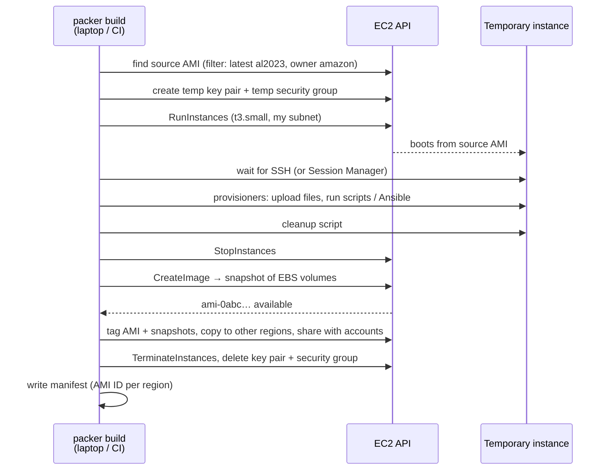
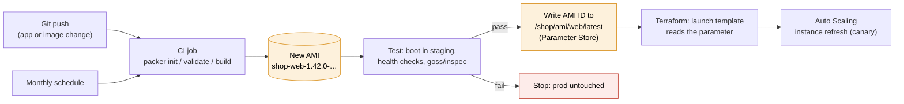

# Packer

> [!abstract] In one sentence
> Packer (by HashiCorp) builds **machine images from code**: it launches a temporary EC2 instance from a base AMI, runs my provisioning steps on it (scripts, files, Ansible), turns the result into a **new AMI**, and cleans up. Every server then boots **already configured** from that "golden image", instead of being set up after it starts.

## Common misconceptions

**Wrong mental model #1:** "Packer deploys and runs my servers, like Terraform."

**What's actually true:** Packer only **produces an image**, then everything it created to build it is deleted. Nothing keeps running. **Running** servers from that image is someone else's job: a launch template + [[Auto Scaling]] group, usually written in Terraform or CloudFormation. Packer = the **factory**, Terraform = the **deployment**.

**Wrong mental model #2:** "An AMI is like a Docker image: a clean, stateless template."

**What's actually true:** an AMI is a **snapshot of a whole disk** that was booted and used. Whatever was left on the build instance ends up in **every** server: SSH `authorized_keys` and host keys, shell history, cloud-init's "already ran" state, temp files, and any **secret** I copied there "just for the build". Building a good image includes **cleaning** it before the snapshot.

| Wrong mental model | What's actually true |
|---|---|
| Packer is an AWS tool | It's multi-cloud: the same template can build an AMI, an Azure image, a GCP image, a Docker image, a VMware template. On AWS it uses the **amazon** plugin |
| Baking an image = no more config at boot | Bake what's **the same everywhere** (packages, agents, the app). Inject what **differs per environment** (DB host, secrets) at boot from user data / [[Systems Manager#Stage 8: config and secrets in Parameter Store\|Parameter Store]] |
| An AMI works in every region | AMIs are **regional**. Packer can copy it to other regions (`ami_regions`), each copy has its own ID |
| Deregistering an AMI frees the storage | The AMI is metadata. Its **EBS snapshots** stay (and cost) unless they're deleted too |
| Build once, use forever | A golden image **ages**: every month without a rebuild is a month of missing security patches. Rebuild on a schedule |
| The build instance is safe because it's temporary | By default Packer opens **SSH to the build instance**. Use a private subnet and Session Manager, or restrict the source CIDR |

## Bake vs fry

Two ways to get a configured server:

| | **Fry** (configure at boot) | **Bake** (configure in the image) |
|---|---|---|
| How | Base AMI + user data / cloud-init installs everything when the instance starts | Packer installs everything once, the AMI is ready |
| Boot to healthy | Minutes (package downloads, compiles) | Seconds to ~1 minute |
| Depends at boot on | Package repos, internet/NAT, Git, artifact store all being up | Almost nothing |
| Every server identical? | No: `apt install nginx` today and next week give different versions | **Yes**: same AMI ID = same bytes |
| Change something | Edit the script, new instances get it | Rebuild the image, roll it out |
| Testable before prod | Hard (it happens at boot) | Yes: boot the AMI in staging, test, then promote **that exact AMI** |

The usual production answer is **bake almost everything, fry the last mile**: the AMI has the OS patches, agents and the application; user data only says which environment it's in and where to fetch its config.

This is **immutable infrastructure**: servers are never modified in place. A change = a new image = new instances replacing the old ones.

## How a Packer build works on AWS



The vocabulary of a template:

| Block | Role | AWS example |
|---|---|---|
| `packer { required_plugins }` | Which plugins to download (`packer init`) | `github.com/hashicorp/amazon` |
| `variable` / `locals` | Inputs and computed values | region, app version, timestamp |
| `source` | **Where and how** to build (the builder) | `amazon-ebs`: launch instance → snapshot EBS → AMI |
| `build` | **What to do** on it: provisioners and post-processors, for one or more sources | |
| Provisioners | Steps on the instance | `file`, `shell`, `ansible`, `powershell` (Windows) |
| Post-processors | Steps after the image exists | `manifest` (write the AMI ID to JSON), `shell-local` |
| `data` sources | Look things up at build time | `amazon-ami`, `amazon-parameterstore` |

Builders for AWS:

| Builder | How | When |
|---|---|---|
| **`amazon-ebs`** | Launch instance, provision, snapshot its EBS root | **Almost always** |
| `amazon-ebssurrogate` | Build the root volume on a second attached volume | Custom OS installs from scratch |
| `amazon-chroot` | Mount a volume on an existing instance and `chroot` into it, no new instance | Very fast builds, Linux only, needs a build host in AWS |
| `amazon-instance` | Instance-store-backed AMIs | Legacy |

## Build-up: a golden AMI for the shop's web servers

Shop account `123456789012`, `eu-west-1`. The `shop-prod-web` [[Auto Scaling]] group currently boots stock Amazon Linux 2023 and **user data** installs everything.

### Stage 1: everything in user data

The launch template's user data runs at every boot:

```bash
#!/bin/bash
dnf update -y
dnf install -y nginx python3.12 amazon-cloudwatch-agent
aws s3 cp s3://shop-artifacts/shop-api-1.42.0.tar.gz /tmp/
# … unpack, create users, write systemd units, start everything
```

**The problems:**
- New instances take **6 minutes** to become healthy. During a traffic spike, Auto Scaling adds instances that arrive after the spike is over
- The package mirror had an outage one morning: **every new instance failed** to boot properly, and the group kept replacing them in a loop
- `dnf update` at boot means instances launched on different days run **different package versions**. A bug appears on 3 of 20 servers and nobody can say why
- Nothing is tested before it runs in prod: the script runs for the first time on a production instance

### Stage 2: the first Packer template

`shop-web.pkr.hcl`:

```hcl
packer {
  required_plugins {
    amazon = {
      version = ">= 1.3.0"
      source  = "github.com/hashicorp/amazon"
    }
  }
}

variable "region"      { default = "eu-west-1" }
variable "app_version" { type = string }          # passed by CI: -var app_version=1.42.0

locals {
  timestamp = formatdate("YYYYMMDD-hhmm", timestamp())
}

source "amazon-ebs" "web" {
  region        = var.region
  instance_type = "t3.small"

  # Always start from the latest official Amazon Linux 2023
  source_ami_filter {
    filters = {
      name                = "al2023-ami-2023.*-x86_64"
      root-device-type    = "ebs"
      virtualization-type = "hvm"
    }
    owners      = ["amazon"]
    most_recent = true
  }

  ssh_username = "ec2-user"
  ami_name     = "shop-web-${var.app_version}-${local.timestamp}"

  tags = {
    Name        = "shop-web"
    AppVersion  = var.app_version
    BaseAMI     = "{{ .SourceAMI }}"
    BuiltBy     = "packer"
  }
}

build {
  sources = ["source.amazon-ebs.web"]

  provisioner "shell" {
    inline = [
      "cloud-init status --wait",                   # let first-boot cloud-init finish (dnf locks!)
      "sudo dnf update -y",
      "sudo dnf install -y nginx python3.12 amazon-cloudwatch-agent",
    ]
  }

  provisioner "file" {
    source      = "dist/shop-api-${var.app_version}.tar.gz"
    destination = "/tmp/shop-api.tar.gz"
  }

  provisioner "shell" {
    script = "scripts/install-app.sh"               # unpack, user, systemd unit, enable services
  }

  post-processor "manifest" {
    output = "packer-manifest.json"                 # CI reads the AMI ID from here
  }
}
```

Running it:

```bash
packer init .                                  # download the amazon plugin
packer fmt .                                   # format
packer validate -var app_version=1.42.0 .      # syntax + references
packer build    -var app_version=1.42.0 .
# ==> amazon-ebs.web: Found Image ID: ami-0a1b2c3d4e5f60718
# ==> amazon-ebs.web: Creating temporary keypair: packer_66fe…
# ==> amazon-ebs.web: Creating temporary security group for this instance: packer_66fe…
# ==> amazon-ebs.web: Launching a source AWS instance...
# ==> amazon-ebs.web: Waiting for SSH to become available...
# ==> amazon-ebs.web: Provisioning with shell script: scripts/install-app.sh
# ==> amazon-ebs.web: Stopping the source instance...
# ==> amazon-ebs.web: Creating AMI shop-web-1.42.0-20261003-1432 from instance i-0f…
# ==> amazon-ebs.web: Terminating the source AWS instance...
# ==> amazon-ebs.web: Deleting temporary security group / keypair...
# --> amazon-ebs.web: AMIs were created:
# eu-west-1: ami-0123456789abcdef0
```

The launch template now points at `ami-0123456789abcdef0`, and the user data shrinks to "which environment am I, fetch my config". Boot to healthy: **~40 seconds**. No package mirror needed at boot.

### Stage 3: the image remembered too much

A security review of a running instance finds:
- `~ec2-user/.ssh/authorized_keys` contains **Packer's temporary key** (harmless since it was deleted, but sloppy) and every instance shares the same **SSH host keys** (generated once on the build instance)
- `/tmp/shop-api.tar.gz` and `.bash_history` from the build
- An S3 access key that a build script wrote to `~/.aws/credentials` to download artifacts, now on **every server**, and in every account the AMI was shared with

**The fix: a cleanup provisioner, last in the build**, and **no secrets in images**:

```hcl
  provisioner "shell" {
    inline = [
      "sudo rm -rf /tmp/* /var/tmp/*",
      "sudo rm -f /etc/ssh/ssh_host_*",               # regenerated at first boot
      "rm -f ~/.ssh/authorized_keys ~/.bash_history",
      "sudo cloud-init clean --logs",                 # so cloud-init runs fully on the real instance
      "sudo dnf clean all",
    ]
  }
```

- The build instance gets AWS permissions through an **instance profile** (`iam_instance_profile`, or `temporary_iam_instance_profile_policy_document` so Packer creates a throwaway role), never keys on disk
- Secrets the **running** app needs come from [[Systems Manager#Stage 8: config and secrets in Parameter Store|Parameter Store]] or Secrets Manager **at boot**, with the instance's own role

### Stage 4: building without opening SSH to the world

By default Packer creates a security group allowing **port 22 from `0.0.0.0/0`** on an instance with a public IP. In the shop's account, an SCP and a Config rule flag that, and the build subnet is **private** anyway.

The fix is the same trick as for people: **Session Manager**. Packer tunnels its SSH connection through SSM, so the build instance needs **no inbound rule and no public IP**, only the SSM agent (already in Amazon Linux) and a path to the SSM endpoints (see [[Systems Manager]] and [[Outbound-initiated connections]]):

```hcl
source "amazon-ebs" "web" {
  # …
  subnet_id                   = "subnet-0private1a"   # private build subnet
  associate_public_ip_address = false
  communicator                = "ssh"
  ssh_interface               = "session_manager"
  iam_instance_profile        = "packer-build-ssm"     # includes AmazonSSMManagedInstanceCore
}
```

The machine running `packer build` needs the AWS CLI **Session Manager plugin**, and IAM permission for `ssm:StartSession`.

### Stage 5: encryption, regions and accounts

The shop has a **build account** (where images are made) and `staging` / `prod` accounts (where they run), plus a DR region `eu-central-1`:

```hcl
source "amazon-ebs" "web" {
  # …
  encrypt_boot = true
  kms_key_id   = "arn:aws:kms:eu-west-1:111122223333:key/…"   # customer managed key

  ami_regions = ["eu-central-1"]                                # copied after creation
  region_kms_key_ids = {
    "eu-central-1" = "arn:aws:kms:eu-central-1:111122223333:key/…"
  }

  ami_users = ["123456789012", "210987654321"]                  # prod, staging accounts

  launch_block_device_mappings {
    device_name           = "/dev/xvda"
    volume_size           = 20
    volume_type           = "gp3"
    delete_on_termination = true
  }
}
```

The classic trap: an **encrypted** AMI shared with another account **fails to launch** there ("client error" / instance stuck terminating) until the **KMS key policy** lets that account use the key (`kms:Decrypt`, `kms:CreateGrant`…). Sharing the AMI is not enough: the key must be shared too. AMIs encrypted with the **AWS-managed** `aws/ebs` key **can't** be shared at all, so a customer managed key is required.

### Stage 6: a pipeline instead of a laptop

Running `packer build` by hand means nobody knows which AMI came from which commit. The pipeline:



- **CI credentials**: the CI job assumes a role through **OIDC** (no stored AWS keys), allowed only the EC2/IAM/SSM actions Packer needs, in the build account
- **The manifest** gives the AMI ID; the pipeline publishes it to [[Systems Manager|Parameter Store]] (`/shop/ami/web/latest`) so Terraform and other teams consume "latest approved" without hardcoding IDs
- **Test the image**, not the script: boot it, check services are enabled and listening, the agent reports, the app answers `/health`
- **Roll out** with an [[Auto Scaling]] **instance refresh** (a few instances first, then the rest). **Rollback** = point back to the previous AMI ID, which still exists
- **Monthly rebuild** even without code changes, to pick up the latest base AMI and patches (this replaces in-place patching: see [[Systems Manager#Stage 7: patching without surprises]])
- **Retention**: keep the last N AMIs per app, deregister older ones **and delete their snapshots** (or let Data Lifecycle Manager / AMI deprecation handle it)

### Stage 7: one image, several builders

The same app also needs a local VirtualBox image for developers and a Docker image for CI tests. One template can declare several `source` blocks, and the `build` block runs the **same provisioners** on all of them:

```hcl
build {
  sources = ["source.amazon-ebs.web", "source.docker.web"]
  provisioner "shell" { script = "scripts/install-app.sh" }
}
```

That's Packer's original selling point: **one definition, identical images everywhere**.

## Packer vs the alternatives

| Option | What it is | Pick it when |
|---|---|---|
| **Packer** | Open-source CLI, HCL templates, runs anywhere (laptop, any CI) | Multi-cloud, existing Ansible/shell, want builds in my own CI and Git |
| **EC2 Image Builder** | AWS-managed pipelines: **recipes** (base image + YAML **components**), test components, **distribution** to regions/accounts, schedules, **Inspector** vulnerability scans, also builds container images | AWS-only shop that wants scheduled, managed, scanned pipelines with no build server to run |
| "Create image" in the console | Snapshot a hand-configured instance | One-off. Not reproducible: nobody knows what was done to it |
| User data / cloud-init only | Configure at every boot (fry) | Small or rarely scaled fleets, fast-changing config |
| Containers (Dockerfile) | The image is the app, not the whole VM | ECS/EKS/Lambda containers: the host AMI matters less (use the AWS-optimized one) |
| Ansible/Chef/Puppet on running servers | Configure servers in place | Long-lived pets. Can **also** run inside Packer as a provisioner |

## Advanced problems

### 1. "Waiting for SSH to become available…" forever

| Cause | Fix |
|---|---|
| Instance in a private subnet, Packer connects to the private IP from outside | Run Packer inside the VPC, or `ssh_interface = "session_manager"` |
| Public subnet but no public IP | `associate_public_ip_address = true` (or use SSM) |
| Security group / NACL blocks 22 from the CI runner's IP | `temporary_security_group_source_cidrs` = runner's range, or SSM |
| Wrong `ssh_username` | `ec2-user` (Amazon Linux), `ubuntu` (Ubuntu), `admin` (Debian), `centos`/`rocky` |
| Windows image | Use `communicator = "winrm"` and a user data script enabling WinRM |

`PACKER_LOG=1 packer build …` shows every API call and SSH attempt. `-on-error=ask` keeps the instance alive on failure so I can log in and look.

### 2. `dnf`/`apt` lock errors in the first provisioner

The base AMI's **cloud-init** (and on Ubuntu, unattended-upgrades) is still running when SSH comes up, holding the package manager lock. Start with `cloud-init status --wait`.

### 3. Leftover resources after a failed build

Packer cleans up on errors and Ctrl-C, but if the process is **killed** (CI timeout, laptop closed), the instance, key pair and security group named `packer_…` stay, and the instance keeps billing. Tag with `run_tags` so they're findable, and run a periodic cleanup for anything `packer_*` older than a few hours.

### 4. The "latest" base AMI changed under me

`most_recent = true` means two builds a day apart may start from different base images. Fine for monthly patch rebuilds (that's the goal), confusing when debugging. Record the source AMI in a tag (`{{ .SourceAMI }}` above), and pin a specific base AMI ID when reproducing an old build.

### 5. Images that drift from reality

If people still SSH in and change running servers, the AMI no longer describes production. Immutable infrastructure only works if **in-place changes are forbidden** (no SSH, Session Manager limited to read-only/break-glass, everything through a new image).

## Practice

> [!example]- What does Packer leave running after a successful `amazon-ebs` build?
> Nothing. It terminates the build instance and deletes the temporary key pair and security group. Only the AMI and its snapshots remain.

> [!example]- New instances in my Auto Scaling group take 6 minutes to become healthy because user data installs everything. What changes?
> Bake the packages, agents and app into an AMI with Packer, keep only environment-specific config in user data. Boot time drops to seconds and no longer depends on package repos.

> [!example]- How do I build an AMI in a private subnet with no inbound rules?
> `ssh_interface = "session_manager"` with an instance profile that includes `AmazonSSMManagedInstanceCore`, and a path from the subnet to the SSM endpoints.

> [!example]- I shared an encrypted AMI with the prod account, but instances fail to launch there. Why?
> The customer managed KMS key's policy must also allow the prod account to use it. (AMIs encrypted with the default `aws/ebs` key can't be shared.)

> [!example]- How do other tools find the newest approved AMI without hardcoding its ID?
> The pipeline writes the ID (from Packer's manifest) to a Parameter Store parameter after tests pass. Launch templates and Terraform read the parameter.

> [!example]- Why rebuild the golden AMI every month even if the app didn't change?
> To pick up OS security patches from the latest base AMI. An old image is an unpatched image.

> [!example]- What should a cleanup provisioner remove before the snapshot?
> Temp files, build artifacts, SSH host keys and authorized keys, shell history, cloud-init state (`cloud-init clean`), package caches, and above all any credentials.

## Easy to get wrong
- Expecting Packer to run or manage servers (it only builds images)
- Baking **secrets** or environment-specific config into the AMI
- Forgetting cleanup: shared SSH host keys, leftover keys, cloud-init state
- Default temporary security group open to `0.0.0.0/0` on port 22
- Forgetting AMIs are regional (copy with `ami_regions`)
- Sharing an encrypted AMI without sharing the KMS key (and using `aws/ebs`, which can't be shared)
- Deregistering AMIs without deleting their snapshots
- Not rebuilding regularly: golden images go stale
- `apt`/`dnf` lock errors because cloud-init is still running
- Building by hand from a laptop: no link between an AMI and a commit
- Killing a build mid-way and leaving a `packer_*` instance running

## Related
- Produces images for:: [[EC2]], [[Auto Scaling]] (launch templates, instance refresh), [[ECS on Fargate vs EC2]] (golden AMIs for ECS container instances)
- Containers instead of VM images:: [[ECS]], [[Docker]], [[Docker image tags]]
- Build access without SSH:: [[Systems Manager]], [[Outbound-initiated connections]]
- Image publishing and config:: [[Systems Manager]] (Parameter Store), [[S3]] (artifacts)
- Permissions and accounts:: [[IAM]], [[AWS Organizations]]
- Audit of builds:: [[CloudTrail]]
- Agents baked into the image:: [[CloudWatch agent]]

## Flashcards
#flashcards

What does Packer do? :: Builds machine images (e.g. AMIs) from code: launch a temp instance, provision it, snapshot it, clean up
Packer vs Terraform? :: Packer builds images. Terraform deploys and manages the infrastructure that runs them
What is a golden image? :: A pre-built, tested image with the OS, patches, agents and app already installed
Bake vs fry? :: Bake: configure in the image at build time. Fry: configure at boot with user data/cloud-init
Main benefits of baking AMIs? :: Fast boot, identical servers, no dependency on repos at boot, images testable before prod
What is immutable infrastructure? :: Servers are never changed in place: a change means a new image and replacement instances
Most common Packer builder for AWS? :: amazon-ebs (launch instance, provision, snapshot EBS into an AMI)
What does a Packer "source" block define? :: Where and how to build: builder type and its settings (region, base AMI, instance type)
What does a Packer "build" block define? :: Which sources to build and the provisioners/post-processors to run on them
How to always start from the latest Amazon Linux AMI in Packer? :: source_ami_filter with a name pattern, owners = ["amazon"], most_recent = true
Packer commands in order? :: packer init, packer fmt, packer validate, packer build
What does the manifest post-processor give you? :: A JSON file with the built artifact IDs (AMI ID per region) for the pipeline
How can Packer build without opening SSH inbound? :: ssh_interface = "session_manager" with an SSM instance profile
Why start provisioning with cloud-init status --wait? :: cloud-init may still hold package manager locks on first boot
What must be removed from an image before snapshot? :: Secrets, temp files, SSH host/authorized keys, shell history, cloud-init state
Where should secrets for an image-based server come from? :: At boot, from Parameter Store or Secrets Manager using the instance role
Are AMIs regional? :: Yes. Copy them to other regions (Packer ami_regions), each copy has its own ID
Why does a shared encrypted AMI fail to launch in another account? :: The KMS key policy doesn't allow that account. The default aws/ebs key can't be shared
Does deregistering an AMI delete its snapshots? :: Not by default. Delete them too or keep paying
How to roll out a new AMI to an Auto Scaling group? :: Update the launch template, then an instance refresh (canary first)
Packer vs EC2 Image Builder? :: Packer: multi-cloud CLI, runs in my CI. Image Builder: AWS-managed pipelines with components, schedules, distribution and Inspector scans
How to debug a hanging Packer build? :: PACKER_LOG=1 for logs, -on-error=ask to keep the instance for inspection
