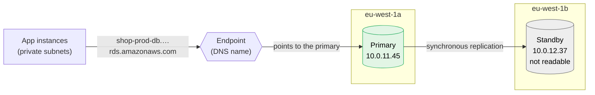
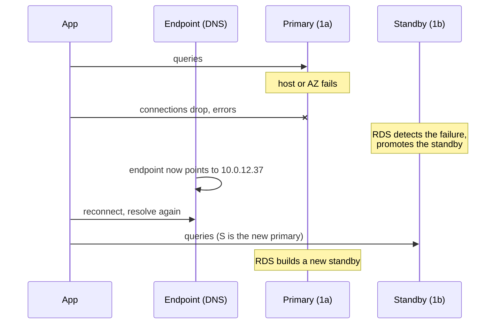
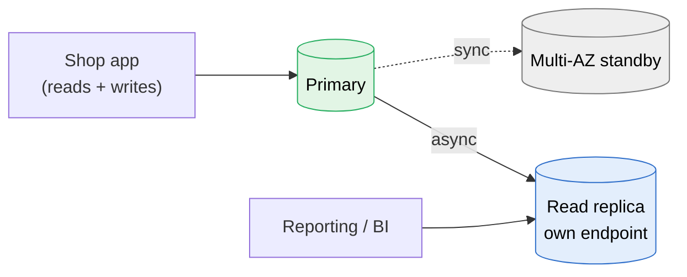

# RDS

> [!abstract] In one sentence
> RDS (Relational Database Service) is AWS running a **normal relational database for me** (PostgreSQL, MySQL, MariaDB, Oracle, SQL Server, Db2, or AWS's own **Aurora**). I still design the schema, write the queries and pick the size, but AWS installs it, patches it, backs it up, and fails it over to another Availability Zone when something breaks. I get an **endpoint** (a DNS name) and a port, never the server.

## The misconceptions I had

**Wrong mental model #1:** "RDS is an EC2 instance with PostgreSQL already installed. I'll SSH in when I need to fix something."

**What's actually true:** there's no server I can log into. I only get the database's own protocol on its port (5432 for PostgreSQL, 3306 for MySQL) and the AWS API around it.

| Thing I'd do on my own DB server | On RDS |
|---|---|
| SSH in, edit `postgresql.conf` | Change a **parameter group** in the console/API. Some parameters apply right away, **static** ones need a reboot ("pending-reboot") |
| `apt upgrade` for security patches | AWS does it in my **maintenance window**. Minor versions can upgrade automatically. Major versions are my decision (and my testing) |
| Write a cron job with `pg_dump` | **Automated backups** + point-in-time restore, built in |
| Become `postgres` superuser | I get a **master user** with *most* rights, not real superuser. Some extensions and settings are off-limits |
| Read the logs in `/var/log` | Logs in the console, or exported to CloudWatch Logs |
| Install anything on the box | Can't. (RDS **Custom**, for Oracle and SQL Server, gives OS access for apps that really need it) |

That's the trade: I give up control of the machine, AWS takes the boring and risky jobs.

**Wrong mental model #2:** "Multi-AZ means I get a second database to spread my reads on."

**What's actually true:** Multi-AZ and read replicas solve **different** problems, and I mixed them up for weeks:

| | **Multi-AZ** (instance deployment) | **Read replica** |
|---|---|---|
| Solves | **Availability**: survive an instance or AZ failure | **Read scaling**: more capacity for SELECTs (and some DR) |
| Copying | **Synchronous**: a write is confirmed only when the standby has it too | **Asynchronous**: the replica can lag behind (seconds, sometimes more) |
| Can I query the second copy? | **No**, the standby just waits | **Yes**, it has its own endpoint |
| When the primary dies | Automatic failover, same endpoint, ~1–2 min | Nothing automatic. I can **promote** it, it becomes a standalone DB with its own endpoint |
| Other region? | No, same region, other AZ | Yes, cross-region replicas exist |

Two extra details that confused me:
- The newer **Multi-AZ DB cluster** (PostgreSQL and MySQL) has **two readable standbys** in different AZs, so it does both jobs a bit. The classic one-standby setup above is still what most material means by "Multi-AZ"
- **Aurora** does it differently again (see below): its replicas *are* the failover targets

**Wrong mental model #3:** "Restoring a backup puts the old data back into my database."

**What's actually true:** a restore (from a snapshot or a point in time) **always creates a new DB instance** with a **new endpoint**. My app keeps talking to the old one until I change its connection string (or swap names around). So a restore is a small migration, not an undo button.

## Build-up: the database behind my shop

Same shop as in [[S3]]: account `123456789012`, `eu-west-1`, a [[VPC]] `10.0.0.0/16` with app instances in private subnets behind an ALB. The app needs a PostgreSQL database for products, users and orders.

### Stage 1: PostgreSQL on an EC2 instance

I launch an [[EC2]] instance `10.0.11.20`, install PostgreSQL, done. It works, and it's cheap.

**The problems, one by one:**
- Who installs the security patches? Me, at night, with downtime
- Backups are a `pg_dump` cron job writing to the same disk. Nobody has ever tested a restore
- The instance's AZ has an issue → the whole shop is down until I rebuild a server and find a backup
- Disk fills up at 3 a.m. → database stops accepting writes

None of that is my shop's actual business. That's what RDS takes over.

### Stage 2: a single RDS instance, in private subnets

Creating it, the choices that matter:

| Setting | What I pick | Why |
|---|---|---|
| Engine | PostgreSQL 17 | What my app speaks |
| Instance class | `db.t4g.medium` to start | Burstable (`t`) for small loads. `m`/`r` classes for steady production loads (same families as [[EC2]], with a `db.` prefix) |
| Storage | gp3, 50 GB, **storage autoscaling** on with a max | Grows by itself before it's full. Storage can grow, it can **never shrink** |
| **DB subnet group** | My private subnets in **2+ AZs** | Says which subnets RDS may put the instance (and later a standby) in. Required to have 2 AZs even for a single instance |
| Public access | **No** | The DB has no public IP. Only things inside the VPC (or connected to it) can reach it |
| Security group | `shop-prod-db-sg`: allow **5432 from `shop-prod-app-sg`** only | Referencing the app's SG instead of IPs (see [[Security groups]]) |
| Credentials | Master password **managed in Secrets Manager** | AWS generates and rotates it. The app reads it from Secrets Manager with its [[IAM]] role |
| Encryption | On, with a KMS key | **Must be chosen at creation.** Can't be turned on later in place |
| Backups | Retention 7 days | Automated backups + point-in-time restore |
| Deletion protection | On | One less way to have a very bad day |

The app connects to the **endpoint**, never an IP:
```
shop-prod-db.abc123xyz.eu-west-1.rds.amazonaws.com:5432
```

> [!tip] The endpoint is a DNS name on purpose
> Behind it there's an IP that **changes** on failover, maintenance or a resize. The name stays the same. Hardcoding the IP breaks the first time AWS moves anything.

**The new problem:** it's still **one instance in one AZ**. If the AZ (or the instance's host) fails, the shop is down until AWS replaces it, and recent writes might wait on a restore.

### Stage 3: Multi-AZ, surviving an AZ failure

I tick **Multi-AZ**. RDS creates a **standby** in another AZ and replicates every write to it **synchronously**.



What happens when the primary dies:



Things this taught me:
- Failover takes **about 1–2 minutes**, and the app **must reconnect**. Open connections just die
- The app has to **resolve the name again**. A runtime that caches DNS forever (old Java settings, connection pools that never refresh) keeps hammering the dead IP
- The standby also makes maintenance less painful: patching happens on the standby first, then a failover, then the old primary
- Cost: roughly **double** the instance price, since the standby is a full instance doing nothing visible
- A failover is **not** a backup. If I `DROP TABLE orders`, the standby drops it too, synchronously

### Stage 4: the reporting queries slow down the shop

The marketing team runs heavy reports at 10 a.m. Checkout gets slow because the reports eat the primary's CPU and I/O.

**The fix:** a **read replica**. It gets its own endpoint, `shop-prod-db-replica.abc123xyz.eu-west-1.rds.amazonaws.com`, and reporting tools connect there.



**The catch: replication lag.** The replica is a bit behind. If the shop itself reads from the replica right after a write ("show me my order"), the order may not be there yet. So: writes and read-your-own-writes on the primary, tolerant reads (reports, search pages) on replicas. Watch the `ReplicaLag` metric.

Also: RDS doesn't load-balance between replicas for me. With three replicas, it's three endpoints, and spreading the load is my job (or Aurora's reader endpoint, below).

### Stage 5: Lambda and the "too many connections" outage

I add an order-processing [[Lambda]] in the VPC. A sale starts, Lambda scales to 800 concurrent executions, each opens its own connection, and PostgreSQL answers `FATAL: too many connections`. The *shop* goes down too, because it can't get a connection either.

Every PostgreSQL connection is a process with its own memory, so `max_connections` is a real limit tied to instance size.

**The fix:** **RDS Proxy**. A managed connection pooler between the clients and the DB:
- Thousands of client connections → a small pool of real DB connections
- Takes the credentials from Secrets Manager, and can require [[IAM]] authentication from clients
- During a failover, it holds client connections and reconnects to the new primary itself, so the app sees a shorter blip than the DNS switch

### Stage 6: "someone ran a bad migration at 14:05"

A migration deletes a column with data in it. I need the database as it was at **14:04**.

**Point-in-time restore**: RDS keeps daily snapshots + transaction logs (shipped about every 5 minutes) for the retention period (up to **35 days**), so I can restore to any second in that window, up to roughly the last 5 minutes.

Remember misconception #3: it creates **a new instance**, `shop-prod-db-restore-1404`. Then I either copy the lost column back into production, or switch the app to the new instance.

| | **Automated backups** | **Manual snapshots** |
|---|---|---|
| Who takes them | RDS, daily, in the backup window | Me (or AWS Backup on a schedule) |
| Kept | 1–35 days, then deleted | **Until I delete them** |
| Point-in-time restore | Yes | No, only to the moment of the snapshot |
| When I delete the instance | Deleted too, unless I choose to keep them | Stay |
| Use | "Undo the last few days" | Before a risky change, long-term retention, copying to another region or account |

> [!warning] Deleting the instance
> RDS asks for a **final snapshot** when I delete an instance. Skipping it, with automated backups not retained, means the data is gone for good.

### Stage 7: losing the whole region

For disaster recovery in another region, from cheap and slow to expensive and fast:
1. **Copy snapshots** to another region (by hand or with AWS Backup). Recovery = restore a new instance there, so hours, and data as old as the last copy
2. **Cross-region read replica**. Recovery = promote it, minutes, data only behind by the replication lag
3. **Aurora Global Database**. Storage-level replication, typically under a second behind, managed failover to the other region

For encrypted databases, copying a snapshot to another region needs a **KMS key in the destination region**, because KMS keys don't leave their region.

## Aurora: same engines, different machine underneath

Aurora is AWS's own engine, **compatible** with PostgreSQL or MySQL (my app's driver and SQL don't change). What's different is the storage:

| | RDS (PostgreSQL/MySQL) | Aurora |
|---|---|---|
| Storage | An EBS volume per instance (copied to the standby) | One **shared cluster volume**, **6 copies across 3 AZs**, grows automatically up to the max |
| Replicas | Up to 15, each with its own copy of the data, async | Up to 15, all reading the **same** shared storage, lag usually milliseconds |
| Failover | To the Multi-AZ standby, ~1–2 min | To a replica, usually **under a minute** (often ~30 s) |
| Endpoints | One per instance | **Cluster endpoint** (always the writer), **reader endpoint** (load-balances across replicas), instance endpoints, custom endpoints |
| Scaling | Pick an instance size | Instance sizes, or **Aurora Serverless v2** that scales capacity up and down by itself |
| Cost | Cheaper for small, steady loads | More per hour, but often worth it for availability and read-heavy apps. I/O-Optimized option when I/O costs dominate |

Mental shortcut: in Aurora, **the replicas are the Multi-AZ**. A cluster with one writer and one replica in another AZ survives an AZ loss. A cluster with only a writer still has its data safe in 3 AZs, but must create a new instance to recover, which is slower.

## Advanced problems I'll actually debug

| Symptom | Usual cause | Fix |
|---|---|---|
| Connection **times out** from the app | Network path: the DB's security group doesn't allow 5432 from the app's SG, a NACL, or I'm connecting from outside the VPC to a non-public DB | Check SGs first, then **Reachability Analyzer**. From my laptop: go through a [[Bastion host]] / SSM port forwarding, not "make it public" |
| Connection **refused / auth failed** quickly | The network is fine, the credentials or database name are wrong, or the secret was rotated and the app cached the old password | Read the secret again on auth failure, don't cache it forever |
| App errors for ~2 minutes during a maintenance window | Multi-AZ failover, or a single-AZ instance rebooting for patches | Retries with backoff in the app, a DNS TTL respected by the runtime, RDS Proxy. Set the maintenance window to the quietest hour |
| App still fails **after** the failover finished | DNS cached by the runtime or connection pool keeps old connections | Respect DNS TTL (JVM `networkaddress.cache.ttl`), validate pooled connections |
| `too many connections` | Lambda or autoscaled instances each opening connections | RDS Proxy, smaller pools per instance |
| Fine all morning, then CPU-bound and slow | `t` class instance ran out of **CPU credits** | Check `CPUCreditBalance`. Move to an `m`/`r` class for steady load |
| Writes stop, instance in `storage-full` | Disk filled (logs, bloat, a runaway table) | Storage autoscaling with a sane maximum, `FreeStorageSpace` alarm |
| Parameter change "did nothing" | Static parameter, status `pending-reboot` | Reboot (in a quiet moment, it's downtime without Multi-AZ) |
| "User saved the form but the page shows old data" | Reading from a replica with lag | Read-your-own-writes on the primary. Watch `ReplicaLag` |
| `SSL error: certificate verify failed` after AWS emails about a CA | RDS CA rotation, clients still have the old CA bundle | Update the bundle on clients first, then switch the instance's CA ([[Certificate rotation#Certificates AWS manages that I still have to act on]]) |
| Want to encrypt an existing unencrypted DB | Encryption can't be switched on in place | Snapshot → **copy the snapshot with encryption** → restore a new instance → switch the app |
| Stopped the dev DB to save money, it's running again | Stopped RDS instances **restart automatically after 7 days** | Schedule a stop, or snapshot + delete for long breaks |

## Practice

> [!example]- My primary instance's AZ goes down. With Multi-AZ, what does my app see, and what must it do?
> Connections drop and queries fail for about 1–2 minutes. RDS promotes the standby and points the same endpoint to it. The app must reconnect and resolve the DNS name again. No config change needed, as long as it never hardcoded the IP or cached the DNS answer forever.

> [!example]- I need to scale reads for a reporting tool. Multi-AZ standby or read replica?
> Read replica. A classic Multi-AZ standby can't be queried. The replica is async, so reports may be a few seconds behind, which is fine for reports.

> [!example]- A developer dropped a table at 14:05 yesterday. Backup retention is 7 days. What do I do?
> Point-in-time restore to 14:04 yesterday. That creates a new instance with a new endpoint. Then copy the table back into production (or switch the app over). Multi-AZ wouldn't help, the standby dropped the table too.

> [!example]- 500 Lambda executions hit `too many connections`. What's the fix that isn't "a bigger instance"?
> RDS Proxy: it pools the client connections onto a few real database connections, and also smooths failovers.

## Easy to get wrong
- Treating Multi-AZ as read scaling (the classic standby isn't readable) or as a backup (it copies my mistakes instantly)
- Expecting a restore to overwrite the existing database: it always creates a new instance with a new endpoint
- Hardcoding the instance IP or caching DNS forever, then failing after every failover
- Making the DB publicly accessible "just to connect from my laptop"
- Forgetting encryption at creation time (no in-place switch later)
- Skipping the final snapshot when deleting an instance
- Assuming storage can be shrunk after autoscaling grew it
- Running a busy production DB on a `t` class and running out of CPU credits
- Reading from a replica right after writing and wondering where the data went
- Forgetting that a stopped instance starts again by itself after 7 days

## Related
- The write-ahead log behind backups and point-in-time restore:: [[Journaling]]
- Depends on:: [[VPC]], [[Security groups]], [[IAM]]
- Works with:: [[EC2]], [[Lambda]], [[Bastion host]], [[CloudTrail]]
- Certificates:: [[TLS]], [[Certificate rotation]]
- Same idea for files:: [[S3]] (versioning and replication, compared with backups and replicas here)
- Concept:: *[[Storage replication]]*, *[[Backups]]*, *[[Snapshots]]*
- Big picture:: [[How AWS services connect]]

## Flashcards
#flashcards

What is RDS? :: A managed relational database (PostgreSQL, MySQL, MariaDB, Oracle, SQL Server, Db2, Aurora): AWS handles installation, patching, backups and failover
Can I SSH into an RDS instance? :: No. Only the database port and the AWS API (except RDS Custom for Oracle and SQL Server)
How do I change database settings on RDS? :: Parameter groups. Static parameters need a reboot
Multi-AZ vs read replica? :: Multi-AZ: synchronous standby for availability, not readable. Read replica: asynchronous, readable, for read scaling
Can I query a classic Multi-AZ standby? :: No, it only waits for a failover
How long does a Multi-AZ failover take? :: About 1 to 2 minutes
How does the app find the new primary after a failover? :: The same endpoint DNS name now points to the promoted standby. The app must reconnect and resolve again
Does Multi-AZ protect against a DROP TABLE? :: No, the standby replicates it synchronously. Backups do
What does restoring a snapshot or a point in time create? :: A new DB instance with a new endpoint
Maximum automated backup retention? :: 35 days
Automated backups vs manual snapshots? :: Automated: daily + logs, point-in-time restore, deleted after retention. Manual: kept until I delete them, no point-in-time
What is a DB subnet group? :: The subnets (in at least 2 AZs) RDS may place the instance and standby in
How should the DB's security group be set up? :: Allow the DB port only from the app's security group
Can I enable encryption on an existing unencrypted RDS instance? :: No. Snapshot, copy the snapshot with encryption, restore a new instance
What is RDS Proxy for? :: Pooling many client connections (e.g. Lambda) onto few DB connections, and faster failovers
Can RDS storage shrink? :: No, it can only grow
Aurora storage? :: One shared cluster volume, 6 copies across 3 AZs
Aurora cluster endpoint vs reader endpoint? :: Cluster endpoint always points to the writer. Reader endpoint load-balances across the replicas
What happens to a stopped RDS instance after 7 days? :: It starts automatically
What does copying an encrypted snapshot to another region need? :: A KMS key in the destination region
Why does a t-class RDS instance get slow after hours of load? :: It ran out of CPU credits
Cheapest to fastest cross-region DR options for RDS? :: Snapshot copies, cross-region read replica (promote), Aurora Global Database
