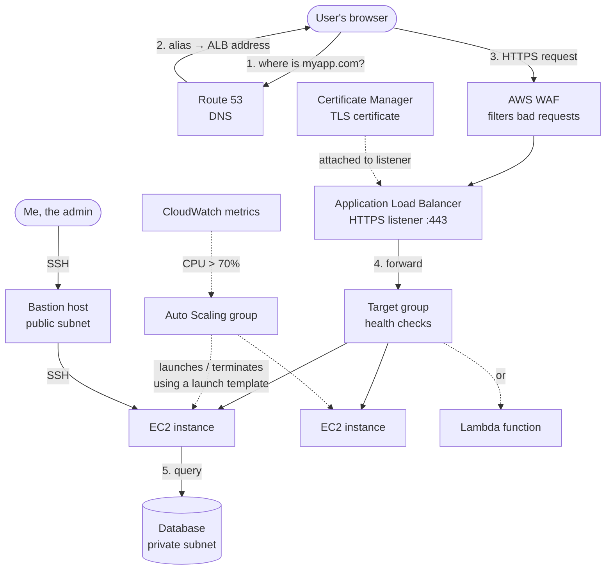

# How AWS services connect

> [!abstract] In one sentence
> Every AWS service is a small piece that does one job. A real app is just these pieces wired together, and it all makes sense once I follow **one request** from the user's browser down to the server.

## The journey of one request

Say a user types `https://myapp.com` in their browser. Here's who handles it, in order:



1. **[[Route 53]]** answers the DNS question: "myapp.com is this load balancer"
2. The browser opens an HTTPS connection. The certificate that proves "yes, this really is myapp.com" comes from **[[Certificate Manager (ACM)]]** and lives on the load balancer
3. **[[AWS WAF]]** (optional) looks at the request and blocks obvious attacks (SQL injection, bots…)
4. The **[[Load balancers|ALB]]** picks a healthy target from its **target group**
5. The target is an **[[EC2]]** instance (or a **[[Lambda]]** function). The instances are created and removed by **[[Auto Scaling]]** based on CloudWatch metrics
6. All of this sits inside a **[[VPC]]**: the ALB in public subnets, the servers and database in private subnets
7. When I need to log into a private server to debug, I go through a **[[Bastion host]]**

And around all of it:
- **[[IAM]]** decides who (people *and* services) is allowed to do what
- **[[CloudTrail]]** records every one of those API calls
- **[[AWS Organizations]]** sits above the accounts and caps what IAM can even allow

## Who talks to whom (cheat sheet)

| Service | Plugs into | Why |
|---|---|---|
| [[Route 53]] | ALB, CloudFront, S3, Lightsail, EC2 (Elastic IP) | Points a domain name at them, using an **Alias** record for AWS resources |
| [[Route 53]] | [[Certificate Manager (ACM)]] | ACM asks me to add a CNAME to prove I own the domain. One button when the domain is in Route 53 |
| [[Certificate Manager (ACM)]] | ALB, CloudFront, API Gateway | Provides the certificate for HTTPS. **Can't** be installed directly on an EC2 instance |
| [[AWS WAF]] | ALB, CloudFront, API Gateway | Filters requests before they reach the app |
| [[Load balancers]] | Target groups → EC2, IPs, Lambda | Spreads traffic across healthy targets |
| [[Auto Scaling]] | Launch template, target group, CloudWatch, SNS | Launches instances from the template and registers them in the target group |
| [[EC2]] | VPC subnet, security group, key pair, IAM role | Every instance lives in one subnet and wears security groups |
| [[Lambda]] | API Gateway, ALB, S3, SQS, EventBridge… | Something happens → Lambda runs. Logs go to CloudWatch |
| [[Lambda]] | [[VPC]] | Only needed if the function must reach private things (like a DB) |
| [[Lightsail]] | [[EC2]] (export), VPC (peering), Route 53 | Its own mini-world, with exits to "real" AWS when I outgrow it |
| [[Bastion host]] | VPC public subnet, security groups | The one door in from outside to my private subnets |
| [[IAM]] | Everything | Users/roles + policies. Lambda and EC2 get permissions through **roles** |
| [[CloudTrail]] | Everything | Logs every API call |

## Two other shapes of the same app

**Serverless version**: no servers at all:
```
Route 53 → API Gateway (ACM cert) → Lambda → DynamoDB
```

**Lightsail version**: everything in one simple console, for a small site:
```
Lightsail DNS zone → Lightsail load balancer (free cert) → Lightsail instances
```

See [[EC2 vs Lightsail vs Lambda]] for when to pick which.

## Easy to get wrong
- The load balancer doesn't know about Auto Scaling. The **target group** is the meeting point: the ASG puts instances *in*, the ALB sends traffic *to* whatever is in there
- ACM certificates go on the **load balancer**, not the instance. Traffic between ALB and EC2 is often plain HTTP inside the VPC
- A private subnet is not "private" because of a checkbox. It's private because its route table has **no route to an internet gateway** (see [[VPC]])

## Flashcards
#flashcards

In a classic web app on AWS, which service answers "where is myapp.com"? :: [[Route 53]], usually with an Alias record pointing to the load balancer
Where does the HTTPS certificate live in an ALB setup? :: On the ALB's HTTPS listener. It comes from ACM
What connects an Auto Scaling group to a load balancer? :: The target group. The ASG registers instances in it, and the ALB forwards to it
How do I get into an EC2 instance in a private subnet? :: Through a bastion host (or Session Manager / EC2 Instance Connect Endpoint)
