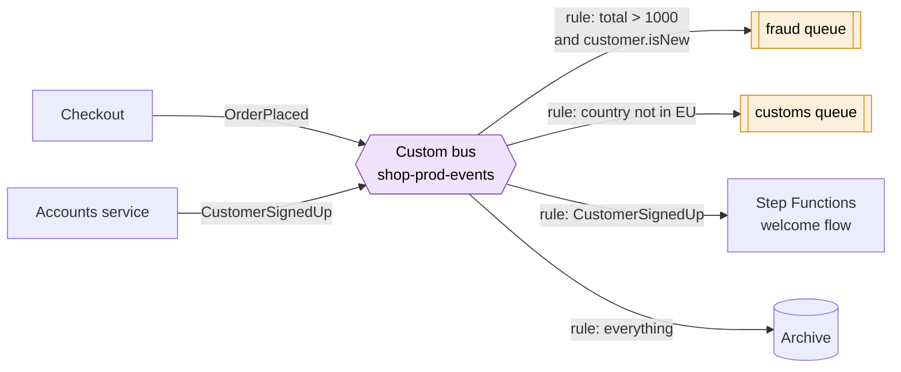

# EventBridge

> [!abstract] In one sentence
> EventBridge is an **event router**: things put **events** (JSON describing "something happened") on an **event bus**, and **rules** match events by their *content* and send them to **targets** (Lambda, SQS, SNS, Step Functions, another bus, an HTTP API…). It's also where **AWS's own services** report what happens in my account, and where scheduled jobs live.

## Common misconceptions

**Wrong mental model #1:** "EventBridge is SNS with a different name."

**What's actually true:** both push one event to several places, but they're built for different jobs:

| | [[SNS]] | **EventBridge** |
|---|---|---|
| Who publishes | My app | My app, **~all AWS services** (default bus), **SaaS partners** (Zendesk, Datadog, Auth0…) |
| How consumers choose | Subscribe to the topic, optional filter policy | **Rules** with rich patterns on **any field** of the event |
| Targets per rule/topic | Thousands of subscribers per topic | **5 targets per rule** (but many rules per bus) |
| Target types | SQS, Lambda, HTTPS, email, SMS, push, Firehose | 20+ AWS services (Step Functions, ECS tasks, Kinesis, CodePipeline…), HTTP **API destinations**, other buses (cross-account / cross-region) |
| Extras | Mobile push, SMS, email | **Archive and replay**, schema registry, **schedules**, input transformation |
| Latency / throughput | Very low latency, very high throughput | A bit more latency, a per-region PutEvents quota |

Short version: SNS for **high-volume fan-out** and notifications to people/phones, EventBridge for **routing by content** and **reacting to AWS itself**.

**Wrong mental model #2:** "To react to something in AWS (an instance stopping, a certificate expiring), I need a Lambda on a cron that checks."

**What's actually true:** AWS services already **emit events** to the **default event bus** of my account, for free. I just write a rule. Polling is the wrong answer on the exam almost every time.

**Wrong mental model #3:** "Scheduled tasks need an EC2 instance running cron."

**What's actually true:** **EventBridge Scheduler** runs schedules (cron, rate, or one-time at a date) and invokes a target directly. No server.

## What an event looks like

Every event has the same envelope. My rules match on these fields:

```json
{
  "version": "0",
  "id": "6a7e8feb-b491-4cf7-a9f1-bf3703467718",
  "detail-type": "EC2 Instance State-change Notification",
  "source": "aws.ec2",
  "account": "123456789012",
  "time": "2026-10-02T09:12:44Z",
  "region": "eu-west-1",
  "resources": ["arn:aws:ec2:eu-west-1:123456789012:instance/i-0abcd1234ef567890"],
  "detail": { "instance-id": "i-0abcd1234ef567890", "state": "stopped" }
}
```

And a rule's **event pattern** is the same shape with the values I want to match:

```json
{
  "source": ["aws.ec2"],
  "detail-type": ["EC2 Instance State-change Notification"],
  "detail": { "state": ["stopped", "terminated"] }
}
```

Patterns also do prefix, suffix, `anything-but`, numeric ranges, `exists`, and wildcard matching. Matching is **exact and case-sensitive**: `"Stopped"` doesn't match `"stopped"`.

## Build-up: my shop starts reacting to things

Same shop as in [[SQS]] and [[SNS]], account `123456789012`, `eu-west-1`.

### Stage 1: reacting to AWS itself

I want a Slack message when a production instance stops, and an alert before a certificate expires.

- Rule `shop-prod-ec2-stopped` on the **default bus** with the pattern above → target: an SNS topic that a chat integration subscribes to
- Rule on `aws.acm` / `"ACM Certificate Approaching Expiration"` → same topic (see [[Certificate rotation]])

No polling, no code. For AWS actions that have no dedicated event, there's the **"AWS API Call via CloudTrail"** event type: if [[CloudTrail]] records the API call, a rule can match it (e.g. "someone called `DeleteBucket`").

### Stage 2: my own events, routed by content

The SNS fan-out from [[SNS]] works, but the routing is getting complicated: the fraud team wants orders over 1,000 EUR from new customers, customs wants non-EU orders, the loyalty team wants orders from gold members. And the marketing team wants to react to `CustomerSignedUp`, `CartAbandoned`, `OrderRefunded`, not just orders.

I create a **custom bus** `shop-prod-events`. Services publish domain events with `PutEvents`:

```json
{ "Source": "shop.checkout", "DetailType": "OrderPlaced",
  "Detail": "{\"orderId\":\"o-8812\",\"total\":1240,\"currency\":\"EUR\",\"customer\":{\"tier\":\"gold\",\"isNew\":true},\"country\":\"CA\"}",
  "EventBusName": "shop-prod-events" }
```

Each team owns **rules** on the bus:



Why this beats SNS here:
- Rules filter on **nested fields of the body** with numeric and `anything-but` matching, and a team adds its rule without touching the producers
- Producers don't know who listens. New event type → nobody has to create a topic per event type
- I still put **SQS queues** behind the rules for consumers that need buffering (same reasoning as fan-out in [[SNS]])
- **Input transformer**: a rule can reshape the event before the target sees it ("send only `orderId` and `total`")

> [!warning] The `source` can't start with `aws.`
> Custom events must use my own source names (`shop.checkout`). Matching a rule on `aws.*` only catches real AWS events.

### Stage 3: replacing the cron server

The shop has an EC2 instance whose only job is cron: nightly report at 02:00, a cleanup every hour, and "send a review request 3 days after delivery" (stored in a table and checked every 5 minutes).

**EventBridge Scheduler:**
- Recurring: `cron(0 2 * * ? *)` with a **time zone** (`Europe/Paris`, so daylight saving time is handled) → Lambda `nightly-report`
- Rate: `rate(1 hour)` → an ECS task for cleanup
- **One-time** schedules: when an order is delivered, the app creates a schedule `at(2026-10-05T10:00:00)` → SQS message "send review request for o-8812". Scales to millions of schedules, no polling table

The older way, **scheduled rules** on a bus, still works, but Scheduler is the newer service with time zones, one-time schedules and much higher limits.

### Stage 4: events from another account

The company's security team works in a separate account `210987654321` (see [[AWS Organizations]]). They want every `aws.guardduty` finding and every root login from all accounts.

- In each workload account: a rule on the default bus → target = the **security account's bus** (cross-account target)
- On the security account's bus: a **resource-based policy** allowing the organization (`aws:PrincipalOrgID`) to `PutEvents`
- Cross-region works the same way: a rule targets a bus in another region

### Stage 5: "the fraud service had a bug for two days"

The fraud rule pointed to a Lambda with a bug that silently skipped some orders. With SNS or SQS, those messages are gone.

**Archive and replay**: an archive on the bus (all events, or a pattern) keeps them for a retention period I choose. After the fix, I **replay** the two days of `OrderPlaced` events to the bus, restricted to the fraud rule. The consumer must be **idempotent**, because the other rules shouldn't (and the fraud service will see some orders twice).

### Stage 6: point-to-point without glue code (Pipes)

The warehouse puts stock changes in an SQS queue, and a tiny Lambda's only job is "read from the queue, drop test messages, call the inventory API to add the product name, start a Step Functions execution".

**EventBridge Pipes** does exactly that shape: **source** (SQS, Kinesis, DynamoDB Streams, Kafka, MQ) → optional **filter** → optional **enrichment** (Lambda, Step Functions, API Gateway, API destination) → **target**. One source to one target, no bus, no glue code to maintain.

| Piece | Shape | For |
|---|---|---|
| **Event bus + rules** | Many producers → many consumers, routed by content | Event-driven architecture, AWS service events |
| **Scheduler** | Clock → one target | Cron jobs, one-time delayed actions |
| **Pipes** | One source → one target, with filter and enrichment | Replacing glue Lambdas between a stream/queue and a service |

## Delivery, retries and failures

- Delivery is **at least once**, **no ordering** guarantee. Consumers must be idempotent, and ordering needs something else (an SQS FIFO queue, Kinesis)
- If a target fails, EventBridge **retries** for up to **24 hours** and **185 attempts** by default (both configurable per target)
- After that: dropped, unless the target has a **DLQ** (an SQS queue). Set one, and alarm on it
- Permissions to reach the target: for Lambda, SNS and SQS, a **resource-based policy** on the target allows `events.amazonaws.com` (the console adds it). For most other targets (Step Functions, ECS, another account's bus, API destinations), the rule uses an **IAM role** that EventBridge assumes

## Advanced problems I'll actually debug

| Symptom | Usual cause | Fix |
|---|---|---|
| Rule never triggers | Pattern doesn't match: wrong case, wrong `detail-type` text, a field nested differently, array vs value | Use the **sandbox** (test a pattern against a sample event), compare with the real event in the archive or a catch-all rule logging to CloudWatch Logs |
| Rule matches (metric `MatchedEvents` > 0) but target never runs | Missing resource policy on the Lambda/SQS/SNS target, or the IAM role can't invoke it, or a KMS key policy | Check `FailedInvocations`, set a DLQ on the target to see the error |
| Custom events never arrive | Published to the **default** bus while the rule is on the custom bus (or the reverse), or `source` starts with `aws.` | Check `EventBusName` in `PutEvents`, check the `FailedEntryCount` in its response |
| Huge bill and a runaway Lambda | **Infinite loop**: the rule's target produces an event that matches the same rule (Lambda writes to S3, S3 event → same rule → Lambda…) | Narrow the pattern (prefix, exclude the output), write outputs elsewhere |
| Events processed twice | At-least-once delivery, or a replay | Idempotent consumers (store processed event `id`s) |
| Events processed out of order | No ordering guarantee | Ordering-sensitive consumers read from an SQS FIFO queue or Kinesis, or compare timestamps/versions |
| `PutEvents` throttled at peak | Regional PutEvents quota | Batch (10 entries per call), request a quota increase, or use SNS/Kinesis for very high volume |
| Scheduled job ran an hour off after a DST change | Scheduled rule in UTC | EventBridge Scheduler with a time zone |

## Practice

> [!example]- Notify the ops team whenever any EC2 instance in production is terminated. Polling Lambda or event?
> An EventBridge rule on the default bus matching `aws.ec2` state-change events with state `terminated`, target an SNS topic. AWS emits the event for free, no polling.

> [!example]- Alert when someone deletes an S3 bucket, an action with no dedicated EventBridge event. How?
> A rule on "AWS API Call via CloudTrail" with `eventName` `DeleteBucket` (CloudTrail must be recording that call).

> [!example]- A target Lambda had a bug for 2 days. Can I re-process the events?
> Only if the bus had an archive. Then replay the time window to the affected rule, with an idempotent consumer.

> [!example]- I need a reminder sent exactly 3 days after each delivery, for millions of orders. What do I use?
> EventBridge Scheduler one-time schedules created per order (target SQS or Lambda), instead of a polling table or SQS delays (max 15 minutes).

## Easy to get wrong
- Building a polling Lambda when AWS already emits the event on the default bus
- Writing patterns with the wrong case or wrong nesting, then wondering why nothing matches
- Forgetting a rule has at most **5 targets** (add more rules, or target an SNS topic)
- Expecting ordering or exactly-once
- No DLQ on targets, so failed events disappear after 24 hours of retries
- Rules on the wrong bus (default vs custom)
- Creating an infinite loop between a rule and its own target's side effects
- Thinking EventBridge keeps events: only if I created an **archive**
- "CloudWatch Events" in old material = EventBridge's default bus, same API

## Related
- Siblings:: [[SQS]], [[SNS]]
- Orchestration (one owner for a multi-step process):: [[Step Functions]]
- Choosing between them:: [[SQS vs SNS vs EventBridge]]
- Streams instead of queues:: [[Kafka]], [[Kafka vs AWS messaging services]]
- Targets:: [[Lambda]], [[SQS]], [[SNS]]
- Event sources:: [[EC2]], [[S3]], [[CloudTrail]], [[Certificate rotation]], [[Auto Scaling]]
- Cross-account:: [[AWS Organizations]], [[IAM]]
- Monitoring and security rules:: [[CloudWatch alarms]] (alarm state change events), [[CloudTrail in production]] (rules on dangerous API calls)
- Big picture:: [[How AWS services connect]]

## Flashcards
#flashcards

What is EventBridge? :: A serverless event router: events go on a bus, rules match them by content and send them to targets
What is on the default event bus? :: Events emitted by AWS services in my account (and scheduled rules)
What is a custom event bus for? :: My application's own domain events
What is a partner event bus? :: A bus receiving events from a SaaS partner (Zendesk, Datadog, Auth0…)
How does a rule select events? :: An event pattern matching fields of the event (source, detail-type, detail…), exact and case-sensitive
Maximum targets per EventBridge rule? :: 5
How to react to an AWS API call that has no dedicated event? :: A rule on "AWS API Call via CloudTrail" events
Can a custom event's source start with aws.? :: No
EventBridge vs SNS in one line? :: SNS: high-throughput fan-out and notifications. EventBridge: content-based routing, AWS service events, SaaS, archive and replay, schedules
EventBridge delivery guarantee? :: At least once, no ordering
Default EventBridge retry policy for a failed target? :: Up to 24 hours and 185 attempts, then a DLQ if configured
How can I re-process past events? :: Archive on the bus, then replay a time window
What is EventBridge Scheduler? :: A service for cron, rate and one-time schedules, with time zones, that invoke a target directly
What are EventBridge Pipes? :: Point-to-point integration: source → filter → enrichment → target, without glue code
How does EventBridge get permission to invoke a Lambda target? :: A resource-based policy on the function allowing events.amazonaws.com
How do I send events to another account? :: A rule targeting the other account's bus, whose resource policy allows PutEvents from my account or organization
What was EventBridge called before? :: CloudWatch Events
What is an input transformer? :: Rule option that reshapes the event before it reaches the target
