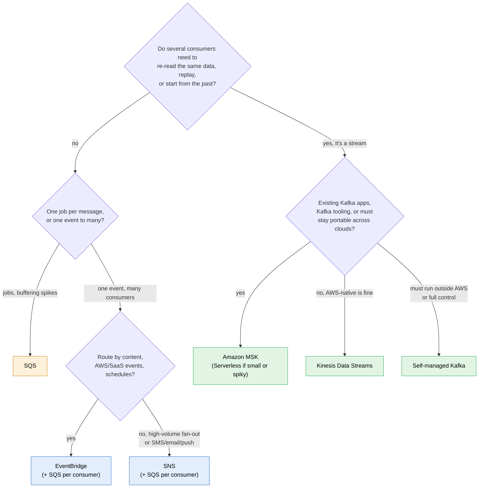
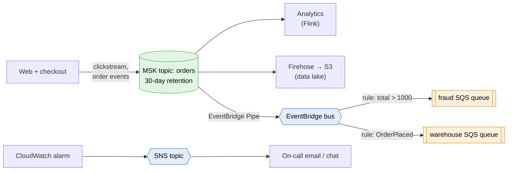

# Kafka vs AWS messaging services

> [!abstract] The short answer
> [[Kafka]] is a **log you keep and re-read**. [[SQS]] is a **queue you empty**. [[SNS]] and [[EventBridge]] **push and forget** (EventBridge can archive). In AWS, the services built like Kafka are **Kinesis Data Streams** (AWS's own API) and **Amazon MSK** (real Kafka, managed). So the real question is rarely "Kafka or SQS", it's "do I need a **replayable stream**, or do I need **work handed out / events routed**?"

## Side by side

|                             | **Kafka** (self-run)                                 | **Amazon MSK**                                       | **Kinesis Data Streams**                                                 | [[SQS]]                          | [[SNS]]                    | [[EventBridge]]                   |
| --------------------------- | ---------------------------------------------------- | ---------------------------------------------------- | ------------------------------------------------------------------------ | -------------------------------- | -------------------------- | --------------------------------- |
| Model                       | Partitioned log                                      | Partitioned log (it *is* Kafka)                      | Sharded log                                                              | Queue                            | Pub/sub topic              | Event bus + rules                 |
| Reading removes data?       | No                                                   | No                                                   | No                                                                       | **Yes** (delete)                 | Nothing stored             | Nothing stored                    |
| Retention                   | My choice, up to forever (+ compaction)              | Same as Kafka                                        | 24 h default, up to 365 days                                             | Up to 14 days                    | None                       | None (archive optional)           |
| Replay                      | Yes, reset offsets                                   | Yes                                                  | Yes, from a sequence number or timestamp                                 | No                               | No                         | Only from an archive              |
| Ordering                    | Per partition                                        | Per partition                                        | Per shard (partition key)                                                | FIFO queues, per group           | FIFO topics                | None                              |
| Several independent readers | Consumer groups, free                                | Consumer groups                                      | Several consumers per shard (shared read limit, or **enhanced fan-out**) | One reader per message           | Every subscriber           | Every matching rule               |
| Unit of scaling             | Partitions + brokers                                 | Partitions + brokers (or Serverless)                 | Shards (or on-demand mode)                                               | Automatic                        | Automatic                  | Automatic                         |
| Who runs it                 | **Me**: brokers, KRaft, upgrades, disks, rebalancing | AWS runs brokers, I size and configure               | Fully managed                                                            | Fully managed                    | Fully managed              | Fully managed                     |
| Where clients connect       | Brokers on my network                                | Brokers **in my [[VPC]]**                            | Public AWS API (or VPC endpoint)                                         | Public AWS API (or VPC endpoint) | Same                       | Same                              |
| Protocol / portability      | Kafka protocol, runs anywhere                        | Kafka protocol, same clients as anywhere             | AWS SDK only                                                             | AWS SDK                          | AWS SDK                    | AWS SDK                           |
| Ecosystem                   | Connect, Streams, Flink, Schema Registry             | Same + MSK Connect                                   | Firehose, Lambda, Managed Flink                                          | Lambda, ASG workers              | Fan-out to SQS/Lambda/HTTP | 20+ AWS targets, Scheduler, Pipes |
| Cost shape                  | Servers + ops time, cheap per GB at scale            | Per broker-hour + storage (or per use on Serverless) | Per shard-hour or on-demand per GB                                       | Per request                      | Per publish + delivery     | Per event                         |

## What they share
- They all **decouple** producers from consumers: the producer doesn't wait for, or know, who reads
- All of them are **at least once** by default, so consumers must be **idempotent**
- Kafka, MSK and Kinesis share one idea: a **partitioned, ordered, replayable log** where consumers track their own position. SQS, SNS and EventBridge don't have that idea at all

## Where they actually differ

**1. Does the data stay after it's read?**
That's the real dividing line. A log (Kafka, MSK, Kinesis) keeps it, so a new consumer can start from last week and a buggy consumer can rewind. A queue (SQS) keeps it only *until* it's processed. A router (SNS, EventBridge) only delivers.

**2. Who decides who gets what?**
- Kafka/Kinesis: consumers **subscribe to a whole topic/stream** and filter in their own code
- SNS: subscribers pick a topic, with filter policies
- EventBridge: rules match on the **content** of each event, including events from AWS itself and SaaS partners

**3. What is "one unit of work"?**
- SQS tracks **each message** (visibility timeout, per-message delete, DLQ after N failures). Perfect for jobs
- Kafka/Kinesis track **one position per partition/shard**. One poison record blocks its partition until my code skips it (dead-letter topic). Perfect for streams, awkward for jobs

**4. How much do I operate?**
Self-run Kafka is a distributed system I own: broker failures, disk sizing, upgrades, partition reassignment, security. MSK takes the machines off my hands but I still think in brokers and partitions (less with MSK Serverless). Kinesis, SQS, SNS and EventBridge are just APIs.

**5. Network path.**
SQS, SNS, EventBridge and Kinesis are reached over the **AWS API endpoint** (internet, NAT gateway, or an interface VPC endpoint). Kafka and MSK clients talk to **each broker** directly, so they need a network route to the brokers: inside the VPC, or through peering / [[Connecting VPCs|Transit Gateway]] / VPN, or MSK's public access or multi-VPC private connectivity. The `advertised.listeners` problem from [[Kafka]] shows up here as "connects to the bootstrap address, then times out".

## If you have to choose

- If the words are **"decouple", "buffer", "worker", "process each order once"** → **SQS**
- If the words are **"real-time", "clickstream", "IoT telemetry", "multiple applications read the same stream", "replay"** → **Kinesis Data Streams**, or **MSK** if Kafka is mentioned
- If the words are **"existing Apache Kafka", "migrate on-premises Kafka", "Kafka Connect", "open source, no lock-in"** → **MSK**
- If the words are **"load streaming data into S3/Redshift/OpenSearch with no code"** → **Data Firehose** (it can read from Kinesis or MSK)
- If the words are **"react to AWS events", "SaaS events", "schedule"** → **EventBridge**
- If the words are **"notify", "SMS", "email", "fan out to queues"** → **SNS**

## A combined design

The shop in [[Kafka]] doesn't pick one: each tool does the part it's good at.

- **MSK** keeps the full, replayable history and feeds the high-volume readers
- **EventBridge** routes the few business events teams react to, by content
- **SQS** queues give each worker team buffering, retries and a DLQ
- **SNS** notifies humans

## Flashcards
#flashcards

The one difference between Kafka and SQS? :: Kafka keeps records after they're read (consumers track offsets, can replay). SQS deletes a message once processed
What is Amazon MSK? :: Managed Apache Kafka: real Kafka protocol and clients, AWS runs the brokers
What is the AWS-native equivalent of a Kafka topic? :: A Kinesis Data Stream (shards ≈ partitions)
Kinesis Data Streams retention? :: 24 hours by default, up to 365 days
Kafka partition vs Kinesis shard? :: Same role: unit of ordering and parallelism, chosen by key (partition key in Kinesis)
When MSK over Kinesis? :: Existing Kafka apps or tooling (Connect, Streams), migrating on-prem Kafka, portability
When Kinesis over MSK? :: AWS-native streaming with no brokers to size, tight Lambda/Firehose integration
When SQS rather than a stream? :: Jobs processed once each, with per-message retries and DLQ, and buffering of spikes
Which of Kafka/MSK/Kinesis/SQS/SNS/EventBridge can replay old data? :: Kafka, MSK, Kinesis. EventBridge only from an archive. SQS and SNS can't
How do clients reach MSK vs SQS? :: MSK: directly to each broker inside the VPC (or private/public connectivity options). SQS: the AWS API endpoint (internet, NAT or VPC endpoint)
How does Kafka handle per-message failures compared to SQS? :: Kafka: one position per partition, the app writes poison records to a dead-letter topic. SQS: per-message redelivery and a DLQ after maxReceiveCount
Which service loads a stream into S3 with no code? :: Data Firehose
