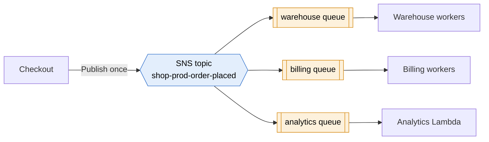

# SNS

> [!abstract] In one sentence
> SNS (Simple Notification Service) is **publish/subscribe**: a producer publishes **one** message to a **topic**, and SNS immediately **pushes a copy to every subscriber** (SQS queues, Lambda functions, HTTPS endpoints, email, SMS, mobile push). It doesn't keep messages: it delivers, retries, and forgets.

## Common misconceptions

**Wrong mental model #1:** "SNS is the email service."

**What's actually true:** email is just one subscriber type, and the least important one for architecture. Most real SNS topics deliver to **SQS queues and Lambda functions**. (For transactional email like order confirmations, the right service is **SES**, not SNS: SNS emails come from AWS's address, with an unsubscribe link, to people who confirmed a subscription.)

**Wrong mental model #2:** "SNS and SQS do the same thing, one pushes and one pulls."

**What's actually true:** they solve **different** problems and are usually used **together**:

| | [[SQS]] | **SNS** |
|---|---|---|
| Shape | Queue: **one** message → **one** consumer | Topic: **one** message → **every** subscriber |
| Delivery | Consumers **pull** | SNS **pushes** |
| Keeps messages? | Yes, up to 14 days, until deleted | **No.** Delivers (with retries), then it's gone |
| If the consumer is down | Messages wait | Retries for a while, then drops it (or sends it to a DLQ if I set one) |
| Solves | Buffering, smoothing load, retrying work | Broadcasting one event to many independent consumers |

The classic answer to "several services need the same event, reliably" is **both**: SNS topic → one SQS queue per service. That's **fan-out**.

## Build-up: telling everyone about a new order

Same shop as in [[SQS]]: checkout puts `{"orderId": "o-8812"}` in `shop-prod-orders`, and workers handle warehouse + invoice + email.

### Stage 1: one queue, more and more consumers

Now three teams want to react to each new order:
- **Warehouse**: reserve the stock
- **Billing**: generate the invoice
- **Analytics**: count sales in near real time

With a single queue, each message goes to **one** consumer. If all three teams poll `shop-prod-orders`, each order is seen by only one of them. The workaround "checkout sends to three queues" means checkout has to know every consumer, and the fourth team means a code change in checkout.

### Stage 2: SNS fan-out to one queue per team

Checkout publishes once to a topic `shop-prod-order-placed`. Each team subscribes **its own queue**.



Why the queues, and not the workers subscribed directly?
- Billing is down for a deploy → its messages **wait in its queue**. With a direct subscription, SNS would retry and eventually give up
- Each team scales, retries and has a [[DLQ]] independently. A slow analytics job doesn't slow the warehouse
- Adding a fourth team = a new queue + a subscription. **Checkout doesn't change**

Two things to set up or it silently doesn't work:
- Each queue's **access policy** must allow the topic to `sqs:SendMessage` (the console adds it if I subscribe from the queue's page)
- If the queues are encrypted with KMS, it must be a **customer managed key** whose key policy allows SNS. The AWS managed `aws/sqs` key can't be used here, because I can't edit its policy

### Stage 3: only some subscribers want some messages

The customs team only cares about **international** orders. Without filtering, they'd receive everything and throw 90% away.

**The fix: a subscription filter policy.** The publisher adds attributes (or SNS can filter on the JSON body):

```json
{ "shippingCountry": [{ "anything-but": "FR" }] }
```

Only matching messages are delivered to that subscription. The filtering happens in SNS, so the customs queue never sees domestic orders, and I'm not paying for their processing.

### Stage 4: the raw message surprise

The analytics Lambda reads its queue and crashes: the message body isn't `{"orderId": "o-8812"}`, it's an SNS **envelope**:

```json
{ "Type": "Notification", "MessageId": "…", "TopicArn": "arn:aws:sns:eu-west-1:123456789012:shop-prod-order-placed",
  "Message": "{\"orderId\": \"o-8812\"}", "Timestamp": "…", "Signature": "…" }
```

My actual payload is a **string inside** `Message`. Either the consumer parses twice, or I enable **raw message delivery** on the subscription (SQS and HTTPS subscriptions) to get the bare payload.

### Stage 5: ordering and duplicates

Like SQS standard, a standard topic is **at least once**, no ordering guarantee. When I need order (price changes per product), an **SNS FIFO topic** (`….fifo`) keeps order per message group and deduplicates, and delivers to **SQS queues** only. FIFO topic + FIFO queues = ordered fan-out.

## Subscriber types

| Subscriber | Typical use | Note |
|---|---|---|
| **SQS** | Reliable fan-out to services | The standard architecture answer |
| **Lambda** | Run code per message | Asynchronous invoke, Lambda retries too |
| **HTTP/HTTPS** | Webhook to an external system | Must **confirm** the subscription (SNS sends a confirmation URL). Configurable retry policy |
| **Email / Email-JSON** | Alerts to humans (alarms, budgets) | Recipient must click a confirmation link |
| **SMS / mobile push** | Notifications to phones | Push via APNs/FCM platform applications |
| **Data Firehose** | Archive every message to S3 or analytics | Keeping a copy of all events |

## Where SNS shows up without me building it
- **[[CloudWatch alarms]]** → SNS topic → email or a Lambda that pages someone
- **[[Auto Scaling]]** notifications (launch, terminate, failure)
- **AWS Budgets** alerts, **[[Certificate rotation|ACM expiry]]** alerts routed through [[EventBridge]] → SNS
- **[[S3]] event notifications**: a bucket can notify only one destination per event type and prefix, so "S3 → SNS → several queues" is the classic way to send one upload to several consumers (or S3 → EventBridge)

## Advanced problems I'll actually debug

| Symptom | Usual cause | Fix |
|---|---|---|
| Queue subscribed, nothing arrives | Queue access policy doesn't allow the topic, or queue encrypted with `aws/sqs` | Add the policy, use a customer managed KMS key allowing `sns.amazonaws.com` |
| Email subscription "pending confirmation" forever | Nobody clicked the link (or it's in spam) | Confirm, or use a different subscriber |
| Consumer can't parse messages | SNS envelope around the payload | Raw message delivery, or parse `Message` |
| Messages lost while a subscriber was down | Direct HTTPS/Lambda subscription, retries exhausted | Put an SQS queue in between, or a **subscription DLQ** (an SQS queue that receives undeliverable messages) |
| One subscriber gets nothing after a change | Filter policy too strict, or the publisher stopped setting the attribute | Check `NumberOfNotificationsFilteredOut` metrics, test the policy |
| Cross-account subscription fails | Topic policy doesn't allow the other account to subscribe, or the queue policy doesn't allow the topic | Both policies: topic side and queue side |
| Payload too large | Over the size limit (256 KiB) | Store in [[S3]], publish a pointer |

## Practice

> [!example]- An uploaded file must be thumbnailed, virus-scanned and indexed by three separate services. Design?
> S3 event notification → SNS topic → three SQS queues, one per service (or S3 → EventBridge with three rules). Each service consumes its own queue at its own pace.

> [!example]- Why put SQS queues behind the SNS topic instead of subscribing Lambdas directly?
> The queue keeps messages while a consumer is down or slow, gives each consumer its own retries, DLQ and scaling, and absorbs spikes. SNS alone doesn't store messages.

> [!example]- The fraud team only wants orders over 1,000 EUR. Where do I filter?
> A filter policy on their subscription (numeric match on an attribute or the body), so SNS only delivers matching messages.

## Easy to get wrong
- Thinking SNS stores messages: it doesn't. Persistence comes from the SQS queues behind it
- Using SNS email for customer emails (that's SES)
- Forgetting the queue access policy or the KMS key policy, then nothing arrives and nothing errors
- Parsing the SNS envelope as if it were the payload (raw message delivery)
- Expecting order or exactly-once from a standard topic (FIFO topic for that)
- Subscribing a FIFO topic to Lambda, email or HTTPS: FIFO topics deliver to SQS queues only
- Forgetting that HTTPS and email subscriptions must be confirmed

## Related
- Usually paired with:: [[SQS]] (fan-out = SNS + one queue per consumer)
- Alternative router:: [[EventBridge]]
- Choosing between them:: [[SQS vs SNS vs EventBridge]]
- Streams instead of queues:: [[Kafka]], [[Kafka vs AWS messaging services]]
- Subscribers and sources:: [[Lambda]], [[S3]], [[Auto Scaling]], [[Certificate rotation]]
- Alerting:: [[CloudWatch alarms]], [[CloudTrail in production]]
- Depends on:: [[IAM]] (topic and queue policies)
- Big picture:: [[How AWS services connect]]

## Flashcards
#flashcards

What is SNS? :: A managed publish/subscribe service: one message published to a topic is pushed to every subscriber
Does SNS store messages? :: No. It delivers with retries, then the message is gone (or goes to a subscription DLQ)
Push or pull: SNS vs SQS? :: SNS pushes to subscribers, SQS consumers pull
What is fan-out? :: One SNS topic delivering every message to several SQS queues, one per consumer
Why put SQS queues behind an SNS topic? :: Persistence while consumers are down, independent retries, DLQ and scaling per consumer
SNS subscriber types? :: SQS, Lambda, HTTP/HTTPS, email, email-JSON, SMS, mobile push, Data Firehose
What is an SNS filter policy? :: Rules on a subscription (on attributes or body) so it only receives matching messages
What is raw message delivery? :: Delivering the bare payload to SQS/HTTPS instead of the SNS JSON envelope
Which SNS subscriptions need confirmation? :: HTTP/HTTPS and email
What can an SNS FIFO topic deliver to? :: SQS queues only
What must allow an SNS topic to deliver to an encrypted SQS queue? :: The queue access policy and a customer managed KMS key whose policy allows SNS (not aws/sqs)
SNS email vs SES? :: SNS email is for notifying subscribed people (alerts). SES is for application email to customers
How to send one S3 upload event to several consumers? :: S3 → SNS topic → several SQS queues, or S3 → EventBridge with several rules
