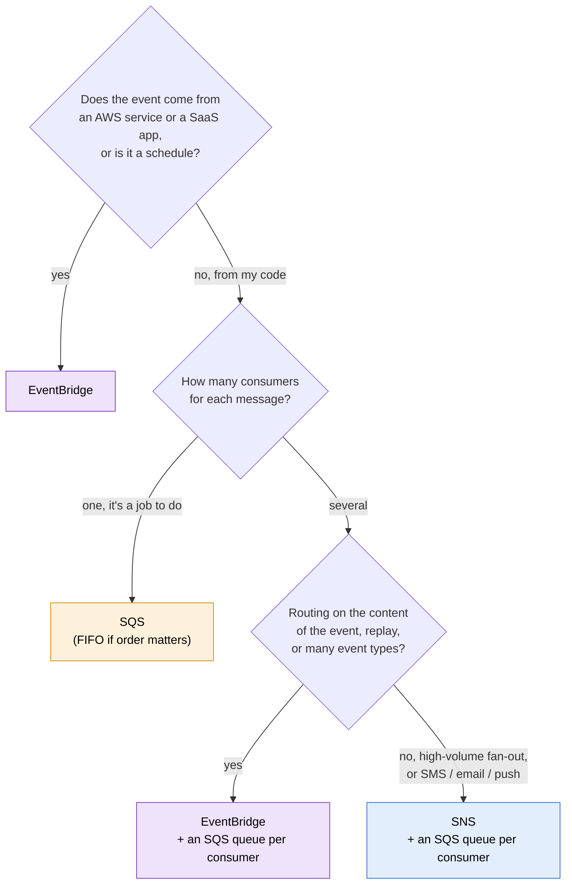

# SQS vs SNS vs EventBridge

> [!abstract] The short answer
> **SQS** = a queue that **holds** work until **one** consumer takes it. **SNS** = a topic that **pushes a copy** to **every** subscriber right now. **EventBridge** = a bus that **routes** events to targets **by their content**, including events from AWS itself. In real designs they're combined: SNS or EventBridge decides *who* gets an event, an SQS queue per consumer makes sure nothing is lost while it waits.

## Side by side

| | [[SQS]] | [[SNS]] | [[EventBridge]] |
|---|---|---|---|
| Model | Queue (point-to-point) | Topic (pub/sub) | Event bus (pub/sub + routing) |
| Delivery | Consumer **pulls** | **Pushes** | **Pushes** |
| One message reaches | **One** consumer | **All** subscribers | Every **rule** that matches (≤ 5 targets each) |
| Stores messages? | **Yes**, up to 14 days | No | No (unless I create an **archive**) |
| Filtering | None (the consumer reads everything) | Filter policy per subscription | Rich event patterns on any field |
| Ordering | FIFO queues | FIFO topics | **None** |
| Who produces | My code | My code, some AWS services (alarms, ASG…) | My code, **almost every AWS service**, SaaS partners, schedules |
| Typical latency | Depends on polling | Lowest | Low, a bit higher than SNS |
| Failure handling | Retries by redelivery, DLQ | Retries per protocol, subscription DLQ | Retries up to 24 h, target DLQ |
| Unique extras | Buffering, visibility timeout, delay queues | SMS, email, mobile push, huge fan-out | Archive and replay, Scheduler, Pipes, schema registry, cross-account buses |

## What they share
- Fully managed and serverless: no brokers to run, pay per request
- **At least once** in their standard form, so every consumer must be **idempotent**
- Access controlled by **resource-based policies** plus [[IAM]], and an encrypted target needs a KMS key policy that allows the sender
- All three exist to **decouple**: the producer doesn't wait for, or even know about, the consumers

## Where they actually differ

The question that separates them is: **what happens to a message nobody is ready to handle?**
- SQS **keeps it** until someone is ready. That's why it's the answer for buffering, spikes, slow or flaky consumers
- SNS and EventBridge **try to deliver now**, retry for a while, then give up (or go to a DLQ). That's why reliable designs put a queue behind them

The second question: **how does a consumer choose what it gets?**
- SQS: it doesn't, it gets the next message
- SNS: it subscribes to a topic (one topic per kind of event), and can filter
- EventBridge: it writes a rule over the content of every event on the bus

## The patterns the exam keeps asking about

| Situation                                                                              | Answer                                                                                                    |
| -------------------------------------------------------------------------------------- | --------------------------------------------------------------------------------------------------------- |
| Web tier must not wait for slow processing, or must survive spikes                     | Web tier → **SQS** → workers (ASG scaled on queue depth, or Lambda)                                       |
| One event, several independent consumers, none may lose messages                       | **SNS → one SQS queue each** (fan-out)                                                                    |
| Same, but each consumer wants only some events, filtered on the body                   | **EventBridge** rules (or SNS filter policies) → SQS                                                      |
| React to "an instance stopped / a certificate is expiring / GuardDuty found something" | **EventBridge** rule on the default bus                                                                   |
| Run something every night, or once at a given date                                     | **EventBridge Scheduler**                                                                                 |
| Strict order + no duplicates                                                           | **SQS FIFO** (with SNS FIFO in front for fan-out)                                                         |
| Email/SMS/push to people                                                               | **SNS** (customer email → SES)                                                                            |
| Re-process past events after a bug                                                     | **EventBridge archive and replay**                                                                        |
| Real-time stream, many readers replaying the same data, ordering per shard             | Not these three: **Kinesis Data Streams**, or **MSK** for Kafka (see [[Kafka vs AWS messaging services]]) |
| Migrating an app that already speaks [[AMQP]]/[[MQTT]]/[[JMS]]                                     | Not these three: **Amazon MQ**                                                                            |
| A multi-step workflow with branches, waits and retries                                 | Not these three: [[Step Functions]] (orchestration, while these do choreography)                          |

## If you have to choose
- If the consumer might be slow, down, or overwhelmed → **SQS** (in front of it, always)
- If one message must reach many consumers, at high volume, or reach people's phones/inboxes → **SNS**
- If routing depends on what's *in* the event, the event comes from AWS or a SaaS, or I need replay or schedules → **EventBridge**
- If two of these apply → combine: router (**SNS** or **EventBridge**) in front, **SQS** behind

## Flashcards
#flashcards

SQS vs SNS vs EventBridge in one line each? :: SQS: queue that holds work for one consumer. SNS: pushes a copy to every subscriber. EventBridge: routes events to targets by content, including AWS service events
Which of SQS, SNS, EventBridge stores messages? :: Only SQS (up to 14 days). EventBridge only with an archive
Why put an SQS queue behind SNS or EventBridge? :: They don't hold messages, the queue keeps them while the consumer is slow or down
Which service to react to AWS service events (EC2 state change, ACM expiry)? :: EventBridge (default bus)
Which service for strict ordering? :: SQS FIFO (SNS FIFO in front for ordered fan-out). EventBridge has no ordering
Which service for SMS, email or mobile push notifications? :: SNS
Which service to replay past events after a bug? :: EventBridge (archive and replay)
Which service for cron jobs without a server? :: EventBridge Scheduler
When is Kinesis the answer instead? :: Real-time streams with several readers replaying the same ordered data
When is Amazon MQ the answer instead? :: Migrating apps that use standard protocols like AMQP, MQTT, JMS
When is Step Functions the answer instead? :: Orchestrating a multi-step workflow with branches, waits and retries
