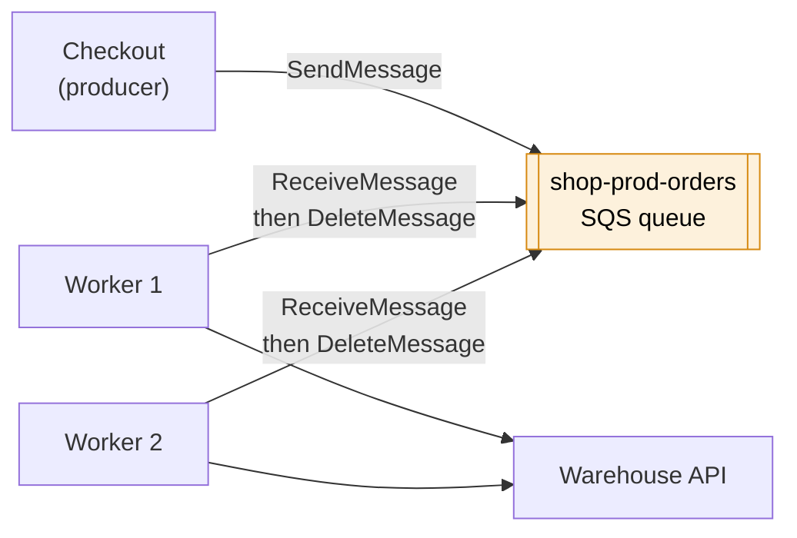
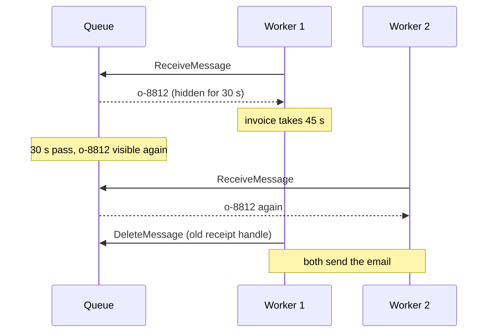
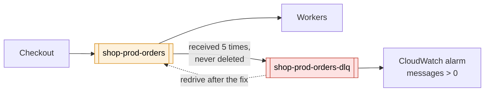

# SQS

> [!abstract] In one sentence
> SQS (Simple Queue Service) is a **managed queue**: one part of my app drops a message in, and another part **pulls** it out when it's ready, processes it, and **deletes** it. Neither side has to be up, fast, or even exist at the same moment as the other. That's what "decoupling" means on the exam.

## Common misconceptions

**Wrong mental model #1:** "SQS pushes messages to my workers, like a webhook."

**What's actually true:** SQS never calls anyone. Consumers **poll** it (`ReceiveMessage`). Even when [[Lambda]] "is triggered by SQS", it's really Lambda's own pollers (the *event source mapping*) asking the queue for messages and then invoking my function. If nobody polls, messages just sit there until they expire.

**Wrong mental model #2:** "Once a worker receives a message, it's gone from the queue."

**What's actually true:** receiving a message only **hides** it for a while (the **visibility timeout**). The worker must explicitly **delete** it after processing. If it doesn't delete it in time (crashed, too slow, forgot), the message becomes visible again and another worker gets it.

| Wrong mental models                                           | What happens                                                                                                                               |
| ------------------------------------------------------------- | ------------------------------------------------------------------------------------------------------------------------------------------ |
| Receive = take it out                                         | Receive = borrow it, hidden for the visibility timeout (default 30 s)                                                                      |
| Each message is delivered once                                | **Standard** queues: **at least once**. Duplicates are rare but normal. My worker must be **idempotent**                                   |
| Messages come out in the order they went in                   | Standard: **best-effort** order. Only **FIFO** queues guarantee order (per message group)                                                  |
| A queue can feed several different consumers the same message | No. Each message goes to **one** consumer (competing consumers). For "==everyone gets a copy" I need [[SNS]] or [[EventBridge]] in front== |

## Build-up: order processing in my shop

Same shop as in [[S3]] and [[RDS]]: account `123456789012`, `eu-west-1`, app instances behind an ALB, PostgreSQL on RDS.

### Stage 1: everything inside the checkout request

When a customer clicks "Pay", the app does it all **synchronously**: charge the card, write the order to [[RDS]], call the warehouse API to reserve stock, generate the invoice PDF and put it in S3, send the confirmation email.

**The problems:**
- Checkout takes 6 seconds because the invoice and email are slow
- The warehouse API is down for 10 minutes → **every checkout fails**, even though the order could have waited
- Black Friday: 50× the orders. The warehouse API can handle 20 requests/second, and it falls over, taking checkout with it

The customer only needs two things to happen *now*: payment and the order saved. The rest can happen a few seconds later.

### Stage 2: a queue between checkout and the slow work

I create a standard queue `shop-prod-orders` and split the work:
- **Producer** (checkout): charges, saves the order, then `SendMessage` with `{"orderId": "o-8812"}` and answers the customer right away
- **Consumers** (a group of worker instances): poll the queue, do warehouse + invoice + email, then `DeleteMessage`

What this buys me:
- Checkout is fast again, and doesn't care if the warehouse API is down: messages **wait** in the queue (up to the **retention period**: default 4 days, max **14 days**)
- The workers set the pace. Black Friday fills the queue instead of crushing the warehouse API. The queue is a **buffer** that turns a spike into a backlog
- I can add or remove workers without touching checkout

### Stage 3: the same order processed twice

A worker receives order `o-8812`, but generating the invoice takes 45 seconds. The visibility timeout is the default **30 seconds**, so at second 30 the message reappears, worker 2 picks it up, and the customer gets **two emails**.

**The fixes, together:**
- Set the visibility timeout **longer than the processing time** (it can go up to 12 hours). For a long job, the worker can extend it while working (`ChangeMessageVisibility`, a "heartbeat")
- Make the worker **idempotent** anyway: before emailing, check in the database whether `o-8812` already has `email_sent = true`. Standard queues can deliver a message twice even with a perfect timeout, so this isn't optional

### Stage 4: the poison message

One message has a broken order ID. The worker crashes on it, never deletes it, it comes back after 30 s, crashes the next worker, and so on forever. It also costs money and hides real problems.

**The fix: a dead-letter queue (DLQ).** I create `shop-prod-orders-dlq` and set a **redrive policy** on the main queue: `maxReceiveCount = 5`. After 5 receives without a delete, SQS moves the message to the DLQ.

- Alarm on the DLQ's `ApproximateNumberOfMessagesVisible > 0`: a message there means a bug
- After fixing the bug, **redrive** the messages back to the source queue (a button in the console)
- The DLQ must be the **same type** as the source (FIFO source → FIFO DLQ)
- Set the DLQ's retention **longer** than the source's: a message keeps its original timestamp, so it can expire soon after arriving in the DLQ

### Stage 5: order matters for stock updates

A second flow: the warehouse sends stock changes for each product (`+10`, `-3`, `set to 0`). Applied out of order, the stock count is wrong. And duplicates mean double counting.

**The fix: a FIFO queue**, `shop-prod-stock.fifo` (the name **must** end with `.fifo`).

| | **Standard** | **FIFO** |
|---|---|---|
| Delivery | At least once (rare duplicates) | **Exactly-once processing**: duplicates removed within a 5-minute window, using a **deduplication ID** (or a hash of the body) |
| Order | Best effort | Strict, **per message group ID** |
| Throughput | Nearly unlimited | Limited: 300 messages/s per API action, 3,000 with batches of 10. **High-throughput mode** raises it a lot |
| Use | Most things: jobs, buffering, fan-out targets | When order or no-duplicates is part of correctness |

The trick is the **message group ID**. I set it to the product ID: all changes for `sku-42` are processed in order, one at a time, but `sku-42` and `sku-77` are processed **in parallel** by different workers. Using one group ID for everything would work, but serializes the whole queue onto one consumer at a time.

> [!warning] FIFO blocks behind a stuck message
> Inside one message group, the next message isn't delivered until the current one is deleted or moved to the DLQ. A poison message in a FIFO group freezes that whole group until it hits `maxReceiveCount`.

### Stage 6: scaling the workers with the queue

Fixed workers either sit idle at night or fall behind on Black Friday.

**Option A: workers in an [[Auto Scaling]] group**, scaled on the backlog. The useful metric is **backlog per instance** = `ApproximateNumberOfMessagesVisible / number of instances`, with a target like "each instance can do 100 messages in an acceptable delay". Scaling on CPU is the classic wrong answer here: the workers may be waiting on the warehouse API with idle CPU while the queue grows.

**Option B: [[Lambda]] with the queue as an event source.** Lambda polls, scales the number of concurrent functions with the queue depth, and deletes the batch when my function returns successfully. Details that bite:
- If one message in a batch of 10 fails and the function throws, **the whole batch** comes back. Enable **partial batch responses** (`ReportBatchItemFailures`) and return only the failed IDs
- Set the queue's visibility timeout to **at least 6× the function timeout** (AWS's advice), or messages reappear while Lambda is still retrying
- Lambda can scale fast enough to flatten my database. Set **maximum concurrency** on the event source mapping (or use RDS Proxy, see [[RDS]])

## Other knobs worth knowing

| Knob | What it does | When |
|---|---|---|
| **Long polling** (`WaitTimeSeconds` up to 20 s) | `ReceiveMessage` waits for a message instead of returning empty immediately | Almost always. Fewer empty responses = lower cost and less CPU. Short polling (0 s) is the default |
| **Delay queue** / message timers | Message invisible for up to **15 minutes** after sending | "Send the review request email 10 minutes after delivery" (longer delays → [[EventBridge]] Scheduler) |
| **Message size** | Up to **1 MiB** (it was 256 KiB until 2025, and older exam material still says so). Bigger: put the payload in [[S3]] and send a pointer (the *extended client library* does it for me) | Large documents |
| **Batching** | Send/receive/delete up to 10 messages per call | Throughput and cost (billed per request) |
| **Encryption** | SSE-SQS (on by default) or SSE-KMS with my key | KMS if I need key policies or audit per key |
| **Access policy** | Resource policy on the queue | Required for [[SNS]], S3, [[EventBridge]] or another account to send to it |
| **VPC endpoint** | Interface endpoint for SQS | Private-subnet workers without a NAT gateway |

## Advanced problems I'll actually debug

| Symptom | Usual cause | Fix |
|---|---|---|
| Same job done twice | Visibility timeout shorter than processing, or a normal standard-queue duplicate | Longer timeout or heartbeat, **idempotent** consumers |
| Messages "disappear" without being processed | Retention expired (4 days default) while consumers were down, or they went to the DLQ | Check the DLQ, raise retention, alarm on `ApproximateAgeOfOldestMessage` |
| Queue keeps growing but CPU is low | Scaling on the wrong metric, or consumers blocked on a downstream API | Scale on backlog per instance, watch the downstream |
| High bill for an idle queue | Short polling in a tight loop | Long polling (20 s) |
| One bad message, whole Lambda batch retried forever | No partial batch response, no DLQ | `ReportBatchItemFailures` + DLQ with `maxReceiveCount` |
| FIFO queue stalls for one customer only | Stuck message at the head of that message group | DLQ, fix the poison message |
| S3/SNS can't deliver to the queue, no error anywhere | The queue's access policy doesn't allow that service, or the queue uses a KMS key whose policy doesn't allow it | Add the access policy statement, use a customer managed KMS key that allows the service |
| Workers in a private subnet time out on `ReceiveMessage` | No route to the SQS API | NAT gateway or an SQS interface VPC endpoint |
| `ApproximateNumberOfMessages` looks off by a few | It's **approximate** by design (distributed system) | Don't build exact logic on it |

## Practice

> [!example]- A worker takes up to 2 minutes per message, and some messages get processed twice. What do I change?
> Raise the visibility timeout above 2 minutes (or extend it from the worker while it runs), and make the processing idempotent, since standard queues can still deliver duplicates.

> [!example]- Three services must each react to every new order. Can three consumers on one SQS queue do it?
> No. A message goes to one consumer only. Put an SNS topic (or EventBridge) in front and give each service its own queue: fan-out.

> [!example]- I need stock updates per product applied in order, but products processed in parallel. How?
> FIFO queue, with the product ID as the message group ID. Order is kept inside a group, groups are processed in parallel.

> [!example]- My workers are an Auto Scaling group. Which metric do I scale on?
> Backlog per instance: visible messages divided by the number of instances, against a target the workers can handle. Not CPU.

## Easy to get wrong
- Thinking SQS pushes: consumers poll, even Lambda (through the event source mapping)
- Forgetting to **delete** the message after processing, so it comes back
- Visibility timeout shorter than the processing time → duplicates
- Assuming exactly-once on a standard queue. Only FIFO deduplicates, and only within 5 minutes
- Expecting one message to reach several consumers (that's SNS/EventBridge)
- Forgetting the `.fifo` suffix, or using one message group ID for everything
- A DLQ with a shorter retention than the source queue
- Scaling workers on CPU instead of queue depth
- Max retention is 14 days, not forever. A queue is not a database

## Related
- Fan-out and routing in front of it:: [[SNS]], [[EventBridge]]
- Choosing between them:: [[SQS vs SNS vs EventBridge]]
- Streams instead of queues:: [[Kafka]], [[Kafka vs AWS messaging services]]
- Consumers:: [[Lambda]], [[EC2]], [[Auto Scaling]]
- Works with:: [[S3]] (event notifications, big payloads), [[RDS]] (protect it from spikes), [[IAM]]
- Network path:: [[VPC]], [[Connecting AWS to a private network]] (on-prem agents polling SQS)
- Big picture:: [[How AWS services connect]]

## Flashcards
#flashcards

What is SQS? :: A managed message queue: producers send, consumers poll, process, and delete messages
Does SQS push messages to consumers? :: No, consumers poll. Lambda uses an event source mapping that polls for me
What happens when a consumer receives a message? :: It's hidden for the visibility timeout. The consumer must delete it, or it becomes visible again
Default and maximum visibility timeout? :: 30 seconds by default, up to 12 hours
Default and maximum SQS message retention? :: 4 days by default, 1 minute to 14 days
Delivery guarantee of a standard queue? :: At least once, best-effort ordering. Consumers must be idempotent
What does a FIFO queue guarantee? :: Strict order per message group ID and exactly-once processing (deduplication within 5 minutes)
What must a FIFO queue's name end with? :: .fifo
How do I get ordering and parallelism with FIFO? :: Use a message group ID per entity (e.g. product ID): ordered within a group, parallel across groups
What is a dead-letter queue? :: A queue that receives messages that failed processing maxReceiveCount times
What sets when a message goes to the DLQ? :: The redrive policy's maxReceiveCount on the source queue
Can a standard queue have a FIFO DLQ? :: No, the DLQ must be the same type as the source
What is long polling? :: ReceiveMessage waits up to 20 seconds for a message, fewer empty responses and lower cost
Maximum delay for an SQS delay queue? :: 15 minutes
Max SQS message size, and what for bigger payloads? :: 1 MiB (256 KiB before 2025). Bigger: store in S3 and send a pointer
Can several consumers each get every message from one SQS queue? :: No, each message goes to one consumer. Use SNS or EventBridge fan-out to several queues
Which metric to scale SQS workers on? :: Backlog per instance (visible messages / instances), not CPU
What is ReportBatchItemFailures for? :: Lambda returns only the failed messages of a batch, so the successful ones aren't retried
Recommended SQS visibility timeout for a Lambda consumer? :: At least 6 times the function timeout
What must allow SNS or S3 to send to a queue? :: The queue's access policy (and the KMS key policy if the queue uses a customer managed key)
