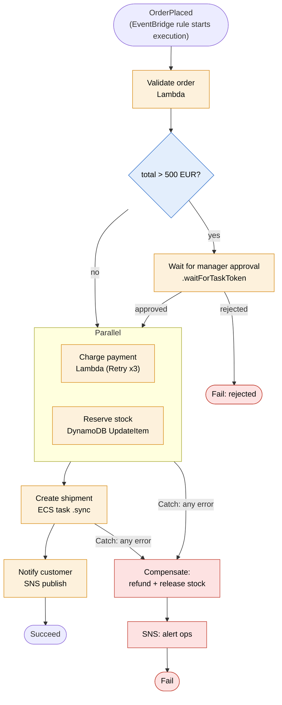
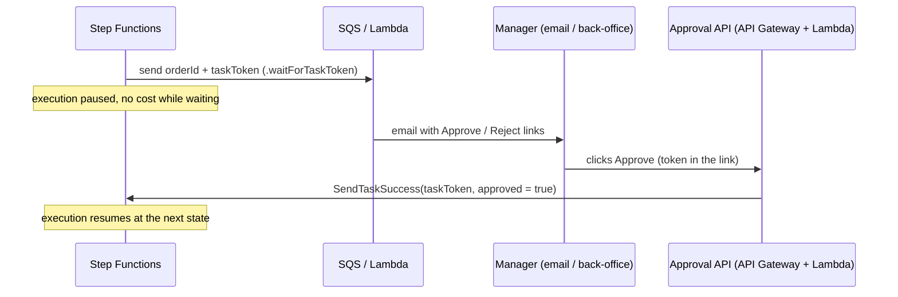
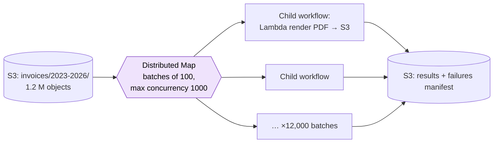

# Step Functions

> [!abstract] In one sentence
> Step Functions is AWS's **serverless workflow orchestrator**: I describe a process as a **state machine** (steps, branches, parallel work, waits, retries, error handling) in JSON, and AWS runs each **execution** of it, calls the services for each step (Lambda, ECS, Glue, DynamoDB, SQS, any AWS API…), remembers where every execution is, and can pause for up to **a year** without anything running. The workflow logic lives in the state machine, not scattered in the code of the services it calls.

## Common misconceptions

**Wrong mental model #1:** "Step Functions is a way to chain Lambda functions."

**What's actually true:** Lambda is just one of the things it calls. It integrates **directly** with 200+ AWS services (about every API action through the **AWS SDK integrations**): it can write to DynamoDB, start an ECS task and wait for it, run a Glue job, send to SQS, publish to SNS, call Bedrock, start another state machine, or call an HTTPS API. Many steps need **no Lambda at all**, and every Lambda that only "calls one AWS API and passes the result on" is a Lambda to delete.

**Wrong mental model #2:** "Orchestration is just code: one Lambda calling the others in sequence does the same thing."

**What's actually true:** an orchestrating Lambda breaks on everything that makes workflows hard:

| Need | One Lambda calling the others | Step Functions |
|---|---|---|
| Process takes 3 days (waiting for a human, a carrier, a batch job) | Lambda stops at **15 minutes** | Waits up to **1 year**, paying nothing while waiting (Standard) |
| Step 3 fails after steps 1–2 succeeded | Custom retry loops, state saved somewhere by hand | Declarative **Retry** with backoff, **Catch** to a compensation path, state kept for me |
| "Where is order o-8812 right now, and why did it fail?" | Grep logs across services | Visual execution history: every step's input, output, error and timing |
| Fixing a failure halfway | Re-run everything, or hand-written resume logic | **Redrive**: restart a failed execution from the failed step |
| Paying for waiting | The orchestrator Lambda is billed while it waits for others | No compute while waiting |

**Wrong mental model #3:** "Step Functions is AWS's Airflow."

**What's actually true:** they overlap on "run steps in order with retries", but they're built around different things. Step Functions is **event-driven and per-request**: thousands of executions started by events, each one a single business process (one order, one file, one approval). Airflow is **schedule- and data-driven**: a DAG of batch tasks run per time interval, with backfills and catch-up over dates. The full comparison is below.

**Wrong mental model #4:** "A Standard workflow is exactly-once, so my steps don't need to be idempotent."

**What's actually true:** a Standard **execution** won't run twice and its state transitions happen exactly once, but a **task** can still be retried (my Retry rules, a timeout after the work actually happened, a redrive). Anything with side effects (charging a card) still needs an **idempotency key**.

## The building blocks

A state machine is written in **Amazon States Language (ASL)**, a JSON document (or built in **Workflow Studio**, the visual editor, which produces the same JSON).

| State type | Does | Example |
|---|---|---|
| **Task** | One unit of work: call a service | Charge the card, start a Glue job |
| **Choice** | Branch on the data | `total > 500` → approval path |
| **Parallel** | Run fixed branches at the same time, wait for all | Reserve stock **and** run fraud check |
| **Map** | Run the same steps for **each item** of an array (or of an S3 dataset) | Each line of the order, each file in a bucket |
| **Wait** | Pause for a duration or until a timestamp | Wait 3 days before sending a review request |
| **Pass** | Pass/reshape data, no work | Inject defaults, test |
| **Succeed / Fail** | End the execution | Fail with an error name and cause |

### How a Task waits: the three integration patterns

| Pattern | Syntax | Step Functions… | Example |
|---|---|---|---|
| **Request/Response** | `arn:aws:states:::sns:publish` | Calls the API and moves on as soon as it answers | Publish to SNS, put an item in DynamoDB |
| **Run a job** | `…:::ecs:runTask.sync` | Starts the job and **waits until it finishes** (polls for me) | ECS/Fargate task, Glue job, Batch job, Athena query, CodeBuild, a child state machine |
| **Wait for callback** | `…:::sqs:sendMessage.waitForTaskToken` | Sends a **task token** and **pauses** until someone calls `SendTaskSuccess` / `SendTaskFailure` with that token | Human approval, an external system, an on-prem worker |

The callback pattern is the key to anything that isn't an AWS job: put the token in a message, an email link, a database row, and whoever finishes the work returns it.

### Standard vs Express

| | **Standard** | **Express** |
|---|---|---|
| Max duration | **1 year** | **5 minutes** |
| Execution semantics | **Exactly-once** execution | **At-least-once** (asynchronous) or **at-most-once** (synchronous) |
| Start rate | Hundreds to a few thousand per second (quota) | Very high (≈100,000/s) |
| Pricing | Per **state transition** (~$25 per million) | Per request + **duration × memory** (like Lambda) |
| Execution history | Kept and visible in the console (90 days), redrive possible | Only in **CloudWatch Logs** (if enabled) |
| `.sync` and `.waitForTaskToken` | Yes | **No** |
| Good for | Long, auditable business processes, human steps, jobs | High-volume, short event processing, IoT ingestion, synchronous API backends |

Rule of thumb: **Standard** unless the workflow is short, high-volume and doesn't need to wait for anything. A 4-step Express workflow at 50 million runs per month is a fraction of the Standard cost.

### Errors: Retry and Catch

Every Task (and Parallel/Map) can have:
- **Retry**: which errors, how many attempts (`MaxAttempts`, default 3), the first delay (`IntervalSeconds`), **`BackoffRate`** (default 2.0), `MaxDelaySeconds`, `JitterStrategy: FULL` so retries don't arrive in waves
- **Catch**: after retries are exhausted, go to another state (a compensation, a notification), keeping the error in the data with `ResultPath`

Error names to know: `States.ALL` (catch-all), `States.Timeout`, `States.TaskFailed`, `States.Permissions`, `States.HeartbeatTimeout`, and the service's own (`Lambda.TooManyRequestsException`, or my own error type thrown from code).

### Data flow

Each state receives a JSON input and produces JSON output, max **256 KiB**. Two ways to shape it:
- **JSONPath** (the classic, what most exam material shows): `InputPath` → `Parameters` → task → `ResultSelector` → `ResultPath` → `OutputPath`. The classic trap is `ResultPath`: by default the task's result **replaces** the whole input, so the order ID disappears after the first step unless I put the result under a field (`"ResultPath": "$.payment"`)
- **JSONata** (since late 2024, set `"QueryLanguage": "JSONata"`): `Arguments` and `Output` with JSONata expressions, plus **variables** (`Assign`) that later states can read without carrying everything in the payload. Simpler for new workflows

## Build-up: the shop's order workflow

Same shop as in [[SQS]] and [[EventBridge]]: an `OrderPlaced` event exists, and several services must act on it. Some steps depend on others, some can fail, one may need a human.

### Stage 1: the order process as choreography

Each service reacts to events and publishes its own: payment listens to `OrderPlaced` and emits `PaymentCaptured`, the warehouse listens to `PaymentCaptured` and emits `StockReserved`, shipping listens to that… (that's **choreography**, the [[EventBridge]] style).

It works for simple flows. Then the questions start:
- "Where is order o-8812?" → nobody knows without reading 5 services' logs
- Payment succeeded but stock reservation failed → who refunds? Each service needs to know about the others' failures
- "Orders over 500 EUR need a manager's approval" → which service owns that rule?

When the **process itself** has logic (order, branches, compensation, deadlines), it deserves an owner: an **orchestrator**.

### Stage 2: the state machine



A piece of the ASL (JSONPath style), the payment step with its retry and catch:

```json
"ChargePayment": {
  "Type": "Task",
  "Resource": "arn:aws:states:::lambda:invoke",
  "Parameters": {
    "FunctionName": "arn:aws:lambda:eu-west-1:123456789012:function:shop-prod-charge",
    "Payload": { "orderId.$": "$.orderId", "amount.$": "$.total", "idempotencyKey.$": "$.orderId" }
  },
  "ResultSelector": { "chargeId.$": "$.Payload.chargeId" },
  "ResultPath": "$.payment",
  "TimeoutSeconds": 30,
  "Retry": [{
    "ErrorEquals": ["Lambda.TooManyRequestsException", "PaymentGatewayTimeout"],
    "IntervalSeconds": 2, "MaxAttempts": 3, "BackoffRate": 2.0, "JitterStrategy": "FULL"
  }],
  "Catch": [{ "ErrorEquals": ["States.ALL"], "ResultPath": "$.error", "Next": "Compensate" }],
  "Next": "CreateShipment"
}
```

What this buys:
- One place that **is** the process. The diagram in the console is the real thing, not documentation that drifted
- Each execution is named after the order (`order-o-8812`), so "where is it?" is one click. Execution names are unique, so starting the same order twice is rejected (a free deduplication on starts)
- `RES` calls **DynamoDB directly**: no Lambda for a single `UpdateItem`

### Stage 3: the failure path is a saga

Payment succeeded, then shipment creation fails for good. There is no database transaction spanning a payment provider, DynamoDB and a carrier API. The **[[Saga pattern]]**: each step that changed something has a **compensating** step that undoes it, and the Catch runs them in reverse order (refund, release stock, notify). The compensations must themselves be idempotent and retried, since they can fail too. The pattern itself (pivot steps, isolation countermeasures, choreography vs orchestration, the outbox) is in [[Saga pattern]].

### Stage 4: the manager's approval (callback)

Orders over 500 EUR wait for a human:



Two settings that matter:
- **`TimeoutSeconds`** on the callback task (e.g. 48 hours), then a Catch that escalates or auto-rejects. Without it, the execution waits until the 1-year limit
- **`HeartbeatSeconds`** for long-running workers that must prove they're still alive (`SendTaskHeartbeat`)

### Stage 5: re-processing a million invoices (Distributed Map)

Finance asks to regenerate every invoice PDF of the last 3 years (1.2 million JSON files in [[S3]]) with the new legal footer.

A normal (inline) Map runs inside one execution, is limited in concurrency (40) and in history (25,000 events per execution). **Distributed Map** is built for this:
- Reads the item list **from S3** directly (a prefix listing, a CSV, a JSON array, or an S3 Inventory manifest)
- Runs each item (or each **batch** of items, `ItemBatcher`) as a **child workflow execution**, up to **10,000 in parallel**
- `ToleratedFailurePercentage` (e.g. 1%) so a few broken files don't fail the whole job
- `ResultWriter` writes results and failures to S3 instead of the 256 KiB payload



The concurrency limit is the real design decision: 10,000 parallel Lambdas will hit the account's concurrency limit and any database behind them. Set `MaxConcurrency` to what the downstream can take.

## Architectures (catalogue)

| Architecture | Shape | Type |
|---|---|---|
| **Order / booking [[Saga pattern\|saga]]** | Event → validate → parallel steps → Catch with compensations (above) | Standard |
| **Human approval** | Task with `.waitForTaskToken`, token in an email/UI, timeout + escalation (above) | Standard |
| **Large-scale batch over S3** | Distributed Map over objects, batches, tolerated failures, results to S3 (above) | Standard parent, Express or Standard children |
| **Synchronous API backend** | API Gateway → `StartSyncExecution` → Express workflow calling 3–4 services → response to the client in < 29 s | Express (sync) |
| **High-volume event processing** | EventBridge / Pipes / IoT rule → Express workflow per event: filter, enrich, write to DynamoDB, fan out | Express (async) |
| **Document pipeline** | S3 upload → EventBridge → start Textract async job → wait (callback via SNS completion, or Wait + poll loop with Choice) → parse → store → notify | Standard |
| **Data / ETL job chain** | EventBridge Scheduler (nightly) → Glue job `.sync` → Athena query `.sync` → Choice on row counts → SNS on failure | Standard |
| **ML pipeline** | Prepare data (Glue/Processing job) → SageMaker training `.sync` → evaluate → Choice on accuracy → deploy or alert | Standard |
| **Security incident response** | GuardDuty finding → EventBridge → isolate the instance (swap security group), snapshot EBS volumes, tag, page on-call, wait for analyst callback | Standard |
| **Infrastructure automation** | Patch fleet in waves: Map over instance groups with `MaxConcurrency 1`, SSM Run Command `.sync`-style polling, health check, rollback on failure | Standard |
| **GenAI chain** | Bedrock `InvokeModel` direct integration: summarize → classify → Choice → route, with retries on throttling | Express or Standard |

How executions get started: an [[EventBridge]] rule or **Scheduler**, **EventBridge Pipes** from an [[SQS]] queue or a stream, API Gateway, a [[Lambda]] or any app with `StartExecution`, another state machine.

## Step Functions vs Airflow (from the Step Functions side)

The details of Airflow itself go in *[[Airflow]]*. What matters here is when each one is the right tool.

| | **Step Functions** | **Airflow** (self-run, or Amazon MWAA) |
|---|---|---|
| Workflow defined in | JSON (ASL) / visual designer | **Python** code (DAGs) |
| A run is usually | **One business event**: one order, one file, one request | **One time interval of data**: "load 2026-10-01" |
| Started by | Events, APIs, schedules. Thousands of concurrent executions are normal | Mostly **schedules** (and data/asset triggers). Tens of runs, not thousands per second |
| Latency to start a step | Milliseconds | Seconds to tens of seconds (scheduler loop, workers) |
| Infrastructure | **None**, serverless, pay per transition / duration | Scheduler, workers, metadata database, web UI (or MWAA environment billed per hour even when idle) |
| Reach | AWS services natively, HTTPS endpoints, callback for anything else | Huge operator library: **any cloud**, on-prem databases, Spark, dbt, SaaS |
| Backfill / re-run past dates | Not a concept: I start executions with the dates myself | **Built in**: catch-up and backfill over date ranges |
| Long waits, human steps | Native (callback, Wait up to 1 year, no cost) | Possible (sensors, deferrable operators), not its strength |
| Passing data between steps | JSON payload (256 KiB), S3 for big data | XCom (small), real data stays in the warehouse/lake |
| Visibility | Per execution, step-level input/output | Per DAG run and task, grid of runs over time, data-team friendly |

### When to use which

- **Step Functions** when:
  - A process runs **per event** or per request (orders, uploads, sign-ups, tickets), possibly thousands at once
  - It waits for **humans or external systems**, or lasts hours to months
  - The steps are **AWS services** and I want no infrastructure and no idle cost
  - It's part of an application's backend (sync Express behind an API, sagas)
- **Airflow** when:
  - The work is **scheduled data pipelines**: nightly/hourly ETL over dates, with dependencies between many datasets
  - I need **backfills** ("re-run the last 90 days with the fixed logic")
  - The team writes **Python**, and the pipeline touches **many systems outside AWS** (other clouds, on-prem databases, Snowflake, dbt)
  - Data engineers need the run-history-over-time view
- **Both together** is common: Airflow schedules the daily pipeline and triggers a Step Functions workflow for an AWS-heavy part of it, or a Step Functions workflow runs per uploaded file while Airflow runs the nightly aggregation

Exam keywords: "serverless orchestration", "coordinate Lambda functions / microservices", "human approval", "wait for a job", "visual workflow" → **Step Functions**. "Existing Apache Airflow DAGs", "migrate Airflow", "Python-based data pipelines" → **Amazon MWAA**.

## Advanced problems I'll actually debug

| Symptom | Usual cause | Fix |
|---|---|---|
| `States.DataLimitExceeded` | A state's input/output over **256 KiB** (a big API response, a Map collecting results) | `ResultSelector` to keep only needed fields, store payloads in S3 and pass the key, Distributed Map `ResultWriter` |
| Execution fails with "history limit exceeded" | More than **25,000 events** in one Standard execution (a loop polling every 10 s for days, an inline Map over thousands) | Child executions, Distributed Map, callback instead of polling loops |
| The order ID is gone after a step | Default `ResultPath` replaced the whole state input with the task result | `ResultPath: "$.result"` (JSONPath), or JSONata variables |
| Execution stuck "Running" for weeks | Callback task without `TimeoutSeconds`/`HeartbeatSeconds`, the token was lost | Always set timeouts on callback and `.sync` tasks, Catch `States.Timeout` |
| `States.Permissions` / `AccessDenied` on a step | The state machine's **execution role** lacks the action (or `iam:PassRole` for ECS/Glue roles, or KMS) | Add the permission to the execution role. Workflow Studio can generate it |
| Lambda step fails on throttling at peak | Lambda concurrency limit, especially under Map | Retry on `Lambda.TooManyRequestsException` with backoff + jitter, `MaxConcurrency` on Map |
| Card charged twice | A retried task (timeout after success, redrive, or Express at-least-once) | Idempotency key on every side-effecting call |
| Bill much higher than expected | Standard with polling loops (each loop = several transitions), or high-volume short workflows on Standard | Callback or `.sync` instead of polling, Express for short high-volume flows |
| Express executions "disappear" | Express history isn't stored by Step Functions | Enable CloudWatch Logs (level ERROR or ALL) on the Express state machine |
| API Gateway → Express returns 504 | Sync execution exceeded API Gateway's timeout (29 s default) | Faster steps, or async start + polling/callback for long work |
| New version broke in-flight executions | Running executions keep the definition they started with, new ones use the new one | Publish **versions** and route with **aliases** (gradual deployment), keep compatibility for long-running ones |
| Execution failed at step 7 of 9, re-running everything is costly | Standard execution failed | **Redrive** from the failed state (within 14 days of the failure) |

## Practice

> [!example]- A workflow must wait up to 3 days for a warehouse system to confirm an order. Which pattern and type?
> Standard workflow with a `.waitForTaskToken` task: send the token to the warehouse (via SQS or an API), it calls `SendTaskSuccess`. Set `TimeoutSeconds` to 3 days with a Catch. Express can't (5 minutes max, no callback).

> [!example]- 30 million IoT events a day, each needing 3 quick steps (validate, enrich, store). Standard or Express?
> Express (asynchronous): short, high-volume, no waits. Standard would charge per transition and has lower start rates.

> [!example]- Payment succeeded but shipping failed permanently. How does the workflow keep things consistent?
> A saga: Catch on the shipping step leads to compensating steps (refund the payment, release the stock), themselves retried and idempotent, then an alert and Fail.

> [!example]- Re-run a transformation over 2 million objects in S3 with controlled parallelism. Which feature?
> Distributed Map reading the S3 listing or inventory, with ItemBatcher, MaxConcurrency sized to the downstream, ToleratedFailurePercentage and ResultWriter to S3.

> [!example]- A data team has 60 Python DAGs running nightly with backfills over dates, touching Snowflake and an on-prem Oracle. Step Functions or Airflow?
> Airflow (Amazon MWAA if they want it managed on AWS): schedule- and date-driven pipelines, backfills, Python, many non-AWS systems.

## Easy to get wrong
- Writing a Lambda just to call one AWS API: use the direct service integration
- Express can't wait for callbacks or `.sync` jobs, and lasts 5 minutes max
- Standard is exactly-once **per execution**, tasks can still be retried: idempotency keys anyway
- Forgetting `ResultPath` and losing the input data
- No timeout on callback tasks: executions hang until the 1-year limit
- Polling loops in Standard: they cost transitions and fill the 25,000-event history
- 256 KiB payload limit: pass S3 keys, not documents
- Distributed Map without `MaxConcurrency` can flatten Lambda limits and databases
- Treating Step Functions as Airflow: no backfill concept, not built around date intervals
- The state machine needs an **execution role** with permission for every service it calls

## Related
- Patterns it implements:: [[Saga pattern]]
- Event sources and siblings:: [[EventBridge]], [[SQS]], [[SNS]]
- Choosing an integration service:: [[SQS vs SNS vs EventBridge]]
- Tasks it runs:: [[Lambda]], [[EC2]] (via SSM), [[S3]], [[RDS]]
- Depends on:: [[IAM]] (execution role)
- Batch and data pipelines:: *[[Airflow]]*
- Big picture:: [[How AWS services connect]]

## Flashcards
#flashcards

What is AWS Step Functions? :: A serverless orchestrator running state machines (steps, branches, parallel, waits, retries) that call AWS services
What language defines a state machine? :: Amazon States Language (ASL), JSON
The state types? :: Task, Choice, Parallel, Map, Wait, Pass, Succeed, Fail
Standard vs Express max duration? :: Standard 1 year, Express 5 minutes
Standard vs Express execution semantics? :: Standard exactly-once. Express at-least-once (async) or at-most-once (sync)
How is Standard priced vs Express? :: Standard per state transition. Express per request plus duration and memory
Where is Express execution history? :: Only in CloudWatch Logs, if enabled
The three service integration patterns? :: Request/Response, Run a job (.sync), Wait for callback (.waitForTaskToken)
What does .sync do? :: Starts a job (ECS, Glue, Batch, Athena, child workflow) and waits until it completes
How does the callback pattern resume an execution? :: An external party calls SendTaskSuccess or SendTaskFailure with the task token
Can Express workflows use .sync or callbacks? :: No
What should every callback task have? :: TimeoutSeconds (and HeartbeatSeconds for long work), otherwise it can wait a year
Retry fields? :: ErrorEquals, IntervalSeconds, MaxAttempts (default 3), BackoffRate (default 2.0), MaxDelaySeconds, JitterStrategy
What does Catch do? :: After retries are exhausted, routes the error to another state (compensation, alert)
Error name that matches everything? :: States.ALL
Max payload between states? :: 256 KiB
What is the default ResultPath trap? :: The task result replaces the whole input unless ResultPath puts it under a field
Max events in a Standard execution's history? :: 25,000
Inline Map vs Distributed Map? :: Inline: inside one execution, limited concurrency (40). Distributed: child executions, up to 10,000 parallel, reads items from S3
What is the saga pattern in Step Functions? :: Catch failures and run compensating steps that undo the earlier successful steps
What is redrive? :: Restarting a failed Standard execution from the failed state
Why use direct service integrations instead of Lambda? :: No code to maintain or pay for when a step is just one AWS API call
How does API Gateway use Step Functions synchronously? :: StartSyncExecution on an Express workflow, within API Gateway's timeout
Step Functions vs Airflow in one line? :: Step Functions: serverless, event-driven, per-request workflows on AWS. Airflow: Python, schedule- and date-driven data pipelines with backfills, any system
AWS service for existing Airflow DAGs? :: Amazon MWAA (Managed Workflows for Apache Airflow)
Orchestration vs choreography? :: Orchestration: a central workflow tells each service what to do. Choreography: services react to each other's events
