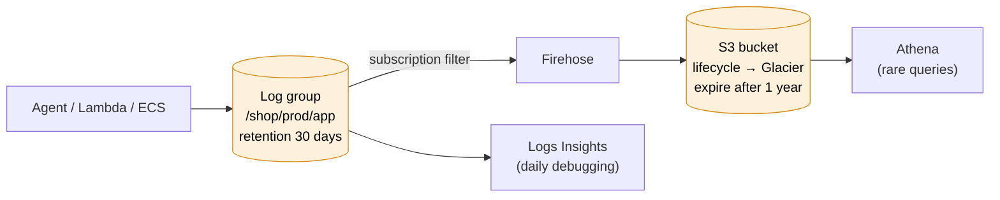

# CloudWatch Logs

> [!abstract] In one sentence
> CloudWatch Logs stores text and JSON log lines from my servers, containers, Lambda functions and AWS services in **log groups**, lets me **query** them with **Logs Insights**, turn patterns into **metrics** with **metric filters**, and **stream** them elsewhere with **subscription filters**.

## Common misconceptions

**Wrong mental model #1:** "A metric filter will count the errors from last week too."

**What's actually true:** a metric filter only looks at log events that arrive **after** it's created. It never reprocesses history. For the past, I run a **Logs Insights** query.

**Wrong mental model #2:** "Logs Insights is like grep, it's free."

**What's actually true:** Logs Insights charges **per GB scanned**. A query over 30 days of a verbose log group can scan hundreds of GB. Narrow the **time range** first, and pick only the log groups I need.

| Wrong mental model | What's actually true |
|---|---|
| Log groups clean themselves up | Default retention is **Never expire** |
| A log stream = a log file name | A stream is one **source** inside a group (one instance, one Lambda execution environment, one container) |
| Logs are only for reading | Metric filters and EMF turn them into **metrics**, so they can drive alarms |
| CloudWatch Logs is the cheapest long-term archive | Ingestion and storage cost more than S3. For years of retention, export or stream to [[S3]] |
| Deleting a log group is harmless | All events in it are gone. Restrict `logs:DeleteLogGroup` in production |

## Vocabulary

| Term | Meaning | Example |
|---|---|---|
| **Log event** | One line (timestamp + message) | `{"level":"ERROR","msg":"card declined","orderId":"o-8812"}` |
| **Log stream** | Events from one source, in order | `i-0a1b2c3d4e5f60718` |
| **Log group** | A set of streams sharing retention, encryption, permissions, filters | `/shop/prod/app`, `/aws/lambda/shop-prod-invoice` |
| **Retention** | How long events are kept: 1 day to 10 years, or never expire | 30 days |
| **Log class** | **Standard** (all features) or **Infrequent Access** (cheaper ingestion, fewer features: no metric filters, no Live Tail) | Debug logs → Infrequent Access |
| **Metric filter** | A pattern that turns matching events into a metric | count `"level":"ERROR"` |
| **Subscription filter** | Streams matching events to Lambda, Kinesis, Firehose or OpenSearch in near real time | → Firehose → S3 |

Where AWS services write: Lambda → `/aws/lambda/<function>`, ECS (awslogs driver) → the group I configure, API Gateway, VPC Flow Logs, Route 53 query logs, RDS (exported logs) → `/aws/rds/instance/<db>/postgresql`, and [[CloudTrail]] if I connect a trail.

## Build-up: debugging checkout errors in the shop

The [[CloudWatch agent]] ships `/var/log/shop/app.log` from every `shop-prod-web` instance into `/shop/prod/app`, one stream per instance. The app writes **JSON** lines:

```json
{"ts":"2026-10-03T14:32:07Z","level":"ERROR","service":"checkout","orderId":"o-8812","customerId":"c-4471","provider":"stripe","latency_ms":2210,"msg":"payment declined: timeout"}
```

> [!tip] Log in JSON
> Logs Insights **discovers JSON fields automatically** (`level`, `orderId`, `latency_ms`…). With plain text I'd have to `parse` every query by hand. One structured line per event is the single best logging habit.

### Stage 1: clicking through streams

A customer complains at 14:35. I open the log group, see 12 streams (one per instance), and open them one by one looking for their order.

**The problem:** I don't know which instance served the request, and scrolling 12 streams doesn't scale.

### Stage 2: Logs Insights queries

**Logs Insights** queries all streams (and several log groups) at once. The language is pipes of commands:

| Command | Does |
|---|---|
| `fields` | Pick fields to show |
| `filter` | Keep matching events (`=`, `!=`, `like /regex/`, `in [...]`) |
| `stats` | Aggregate: `count()`, `avg()`, `max()`, `pct(x, 99)`, `count_distinct()`, grouped `by` fields or `bin(5m)` |
| `sort`, `limit` | Order and cut |
| `parse` | Extract fields from unstructured text |
| `dedup` | Keep one event per value |

Built-in fields start with `@`: `@timestamp`, `@message`, `@logStream`, `@log`.

**Find the customer's order:**

```
fields @timestamp, level, msg, @logStream
| filter orderId = "o-8812"
| sort @timestamp asc
```

**Errors per 5 minutes, to see when it started:**

```
filter level = "ERROR"
| stats count(*) as errors by bin(5m)
```

**Which payment provider is failing:**

```
filter level = "ERROR" and service = "checkout"
| stats count(*) as errors by provider
| sort errors desc
```

**p50 / p99 latency per minute:**

```
filter service = "checkout"
| stats pct(latency_ms, 50) as p50, pct(latency_ms, 99) as p99 by bin(1m)
```

**Top 10 customers hitting errors** (the thing I refused to make a metric dimension, see [[CloudWatch#Stage 4: the dimension that blew up the bill]]):

```
filter level = "ERROR"
| stats count(*) as errors by customerId
| sort errors desc
| limit 10
```

**Plain-text logs (nginx access log)** with `parse`:

```
parse @message '* - - [*] "* * *" * * *' as ip, time, method, path, proto, status, bytes, rest
| filter status >= 500
| stats count(*) by path
| sort count(*) desc
```

**Lambda: how close are my functions to their memory limit?** Lambda writes a `REPORT` line per invocation:

```
filter @type = "REPORT"
| stats max(@maxMemoryUsed / 1000 / 1000) as maxMB,
        max(@memorySize / 1000 / 1000) as allocatedMB,
        pct(@duration, 99) as p99ms
```

Results can be added to a **dashboard** and **saved** as named queries for the on-call team. Newer options: query in natural language (it writes the query), and OpenSearch PPL/SQL as alternative languages.

**Live Tail** is the `tail -f` version: watch matching events arrive in real time while I reproduce a bug.

### Stage 3: from looking at logs to being paged

Queries are for when I'm already looking. To be **told**, I need a metric and an alarm.

**Metric filter** on `/shop/prod/app`:
- Filter pattern (JSON syntax): `{ $.level = "ERROR" && $.service = "checkout" }`
- Metric: namespace `Shop/Checkout`, name `CheckoutErrors`, value `1`, default value `0` (so quiet minutes are `0`, not missing)

Then a [[CloudWatch alarms|CloudWatch alarm]] on `CheckoutErrors`. Filter pattern syntax, quickly:

| Pattern | Matches |
|---|---|
| `ERROR` | Lines containing the word ERROR |
| `"payment declined"` | The exact phrase |
| `?ERROR ?FATAL` | ERROR **or** FATAL |
| `{ $.level = "ERROR" }` | JSON field equals |
| `{ $.latency_ms > 2000 }` | JSON numeric comparison |
| `[ip, id, user, time, request, status=5*, size]` | Space-delimited, status starting with 5 |

If the app can emit **EMF** instead, it's better: the metric is defined in the app, with values (latency), not just counts.

### Stage 4: keeping a year of logs without paying CloudWatch prices

Compliance wants app logs kept **one year**; the on-call team only queries the last two weeks.



- Retention on the log group: **30 days** (hot, queryable)
- **Subscription filter** → **Firehose** → [[S3]] (compressed, partitioned by date), with an S3 lifecycle rule to cheaper classes and expiry at 1 year
- Old logs queried with **Athena** when needed
- Alternative: `CreateExportTask` to S3 (batch, not real time, one export at a time per account)

A log group can have **2 subscription filters**. Cross-account: subscribe to a **destination** in a central log-archive account.

## Protecting logs in production
- **Encryption**: log groups can use a **KMS** key (the key policy must allow the `logs.<region>.amazonaws.com` principal)
- **Data protection policies**: detect and **mask** sensitive data (emails, card numbers, keys) as it's ingested. Only principals with `logs:Unmask` see it in clear
- **IAM**: developers get `logs:StartQuery`/`GetLogEvents`, not `DeleteLogGroup` or `PutRetentionPolicy` in prod
- **Resource policies**: needed for some AWS services to write into a group (e.g. EventBridge rules targeting a log group, Route 53 query logs)

## Practice

> [!example]- I created a metric filter for ERROR today. Why does the graph show nothing for yesterday's incident?
> Metric filters only apply to events ingested after they exist. Use Logs Insights for the past.

> [!example]- Which query shows when errors started, in 5-minute buckets?
> `filter level = "ERROR" | stats count(*) by bin(5m)`

> [!example]- My metric filter's metric has gaps instead of zeros, and my alarm goes to INSUFFICIENT_DATA at night. Fix?
> Set the metric filter's **default value** to 0 (and/or the alarm's missing-data treatment to `notBreaching`).

> [!example]- How do I keep logs for 7 years cheaply but still query recent ones fast?
> Short retention on the log group (e.g. 30 days) + subscription filter → Firehose → S3 with lifecycle rules. Query old logs with Athena.

## Easy to get wrong
- Leaving retention on **Never expire**
- Expecting metric filters to work on past events
- Querying 90 days in Logs Insights when the problem was in the last hour (cost per GB scanned)
- Logging plain text and then needing `parse` everywhere: log JSON
- A metric filter with no default value, so quiet periods are missing data
- Using Infrequent Access log class, then wanting metric filters or Live Tail on it
- Logging secrets or card numbers: mask them with a data protection policy, or better, don't log them
- Only 2 subscription filters per log group

## Related
- Part of:: [[CloudWatch]]
- Fed by:: [[CloudWatch agent]], [[Lambda]], [[EC2]], [[CloudTrail]], [[Route 53]], [[RDS]]
- Feeds:: [[CloudWatch alarms]] (metric filters), [[S3]] (archive), [[Lambda]] (subscription)
- Audit trail of API calls:: [[CloudTrail in production]]
- Permissions:: [[IAM]]

## Flashcards
#flashcards

Log group vs log stream? :: A group holds settings (retention, KMS, filters) for many streams. A stream is the events from one source
Default retention of a new log group? :: Never expire
What is CloudWatch Logs Insights? :: A query language over log groups (fields, filter, stats, sort, parse), billed per GB scanned
Logs Insights query for errors per 5 minutes? :: filter level = "ERROR" | stats count(*) by bin(5m)
How to compute p99 latency in Logs Insights? :: stats pct(latency_ms, 99)
How to extract fields from plain text in Logs Insights? :: parse @message 'pattern with *' as field1, field2
What is a metric filter? :: A pattern on a log group that publishes a CloudWatch metric for matching events
Does a metric filter process old log events? :: No, only events ingested after it was created
Why set a metric filter's default value to 0? :: So periods with no matches report 0 instead of missing data
JSON metric filter pattern for error level? :: { $.level = "ERROR" }
What is a subscription filter? :: Streams log events in near real time to Lambda, Kinesis, Firehose or OpenSearch
How many subscription filters per log group? :: 2
Cheap long-term log retention pattern? :: Short log group retention + subscription filter → Firehose → S3 with lifecycle, query with Athena
What does a log data protection policy do? :: Detects and masks sensitive data at ingestion. logs:Unmask is needed to see it
What is Live Tail? :: Real-time streaming view of incoming log events, like tail -f
Why log in JSON? :: Logs Insights discovers JSON fields automatically, no parse needed
