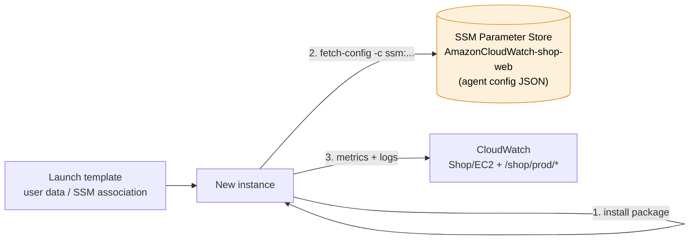
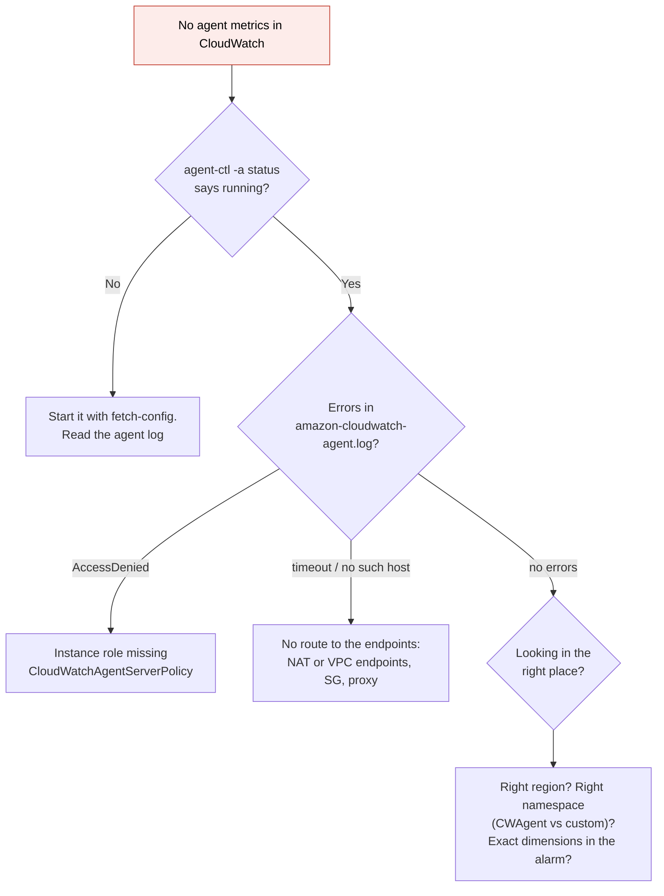

# CloudWatch agent

> [!abstract] In one sentence
> The CloudWatch agent is a small program I install **inside** a server (EC2 or on-premises) that collects what AWS can't see from outside, like **memory, disk space, processes, log files and my app's StatsD metrics**, and ships them to [[CloudWatch]] metrics and [[CloudWatch Logs]].

## Common misconceptions

**Wrong mental model #1:** "Installing the agent is enough."

**What's actually true:** the agent needs three things, and a missing one fails **silently** from the console's point of view (no metrics show up, no error anywhere visible):
1. The **package** installed
2. A **config file** telling it what to collect (no config = it collects nothing)
3. **Permission** to write: an [[IAM]] role on the instance with `CloudWatchAgentServerPolicy` (on-prem: credentials), and a network path to the CloudWatch endpoints

**Wrong mental model #2:** "My alarm on `disk_used_percent` with `InstanceId` will work."

**What's actually true:** the agent adds **extra dimensions** to disk metrics (`path`, `device`, `fstype`). An alarm must name **all** dimensions of the metric exactly, so an alarm with only `InstanceId` watches a metric that **doesn't exist** and sits in `INSUFFICIENT_DATA` forever.

| Wrong mental model | What's actually true |
|---|---|
| Agent metrics are free like EC2 metrics | They're **custom metrics**: billed per metric per month |
| The agent is the old "CloudWatch Logs agent" | That one (`awslogs`) is deprecated. The **unified** agent does metrics **and** logs |
| Each instance needs its config typed by hand | The config lives in **SSM Parameter Store**, and Systems Manager installs and configures fleets |
| It only works on EC2 | Works on-premises and on other clouds too (mode `onPremise`, with credentials) |
| A private subnet with no internet can't use it | It can, through **VPC interface endpoints** for `monitoring` and `logs` (or a NAT gateway) |

## What it can collect

| Section | Examples | Namespace / destination |
|---|---|---|
| `mem` | `mem_used_percent`, `mem_available` | Metrics (`CWAgent` by default) |
| `disk` | `disk_used_percent`, `disk_inodes_free` | Metrics |
| `diskio`, `net`, `netstat`, `swap`, `cpu` (per core) | I/O time, TCP connections, swap usage | Metrics |
| `procstat` | Is `nginx` running? `pid_count`, its CPU and memory | Metrics |
| `statsd` | My app's counters/timers on UDP `8125` | Metrics |
| `collectd` | Metrics from collectd plugins | Metrics |
| `logs` → `files` | `/var/log/nginx/access.log`, app logs | [[CloudWatch Logs]] log groups |
| Windows | Performance counters, Windows Event Log | Metrics / Logs |

## Build-up: putting the agent on the shop's web servers

Shop account `123456789012`, `eu-west-1`, Auto Scaling group `shop-prod-web` running Amazon Linux 2023, the app logs to `/var/log/shop/app.log`.

### Stage 1: one instance, by hand

**1. Permission.** The instance profile role `shop-prod-web-role` gets the AWS managed policy **`CloudWatchAgentServerPolicy`** (`cloudwatch:PutMetricData`, `logs:CreateLogStream`, `logs:PutLogEvents`, `ssm:GetParameter` on `AmazonCloudWatch-*`, a few `ec2:Describe*`).

**2. Install.**

```bash
sudo dnf install -y amazon-cloudwatch-agent
```

**3. Config.** Either run the wizard (`/opt/aws/amazon-cloudwatch-agent/bin/amazon-cloudwatch-agent-config-wizard`), or write the JSON myself. Here's the one I'd actually use:

```json
{
  "agent": {
    "metrics_collection_interval": 60,
    "run_as_user": "cwagent"
  },
  "metrics": {
    "namespace": "Shop/EC2",
    "append_dimensions": {
      "InstanceId": "${aws:InstanceId}",
      "AutoScalingGroupName": "${aws:AutoScalingGroupName}"
    },
    "aggregation_dimensions": [["AutoScalingGroupName"]],
    "metrics_collected": {
      "mem": { "measurement": ["mem_used_percent"] },
      "disk": {
        "measurement": ["used_percent"],
        "resources": ["/"],
        "drop_device": true,
        "ignore_file_system_types": ["sysfs", "devtmpfs", "tmpfs"]
      },
      "procstat": [
        { "pattern": "shop-api", "measurement": ["pid_count", "memory_rss"] }
      ],
      "statsd": {
        "service_address": ":8125",
        "metrics_collection_interval": 10,
        "metrics_aggregation_interval": 60
      }
    }
  },
  "logs": {
    "logs_collected": {
      "files": {
        "collect_list": [
          {
            "file_path": "/var/log/shop/app.log",
            "log_group_name": "/shop/prod/app",
            "log_stream_name": "{instance_id}",
            "retention_in_days": 30
          },
          {
            "file_path": "/var/log/nginx/access.log",
            "log_group_name": "/shop/prod/nginx-access",
            "log_stream_name": "{instance_id}",
            "retention_in_days": 14
          }
        ]
      }
    }
  }
}
```

What each choice is for:
- **`namespace: Shop/EC2`**: my own **custom namespace** instead of the default `CWAgent`, so agent metrics are grouped per project
- **`append_dimensions`**: tag every metric with the instance and its Auto Scaling group (the agent reads them from instance metadata)
- **`aggregation_dimensions: [["AutoScalingGroupName"]]`**: also publish a copy of each metric with **only** the group as dimension. That's what lets me alarm on "memory of the **whole group**", which survives instances being replaced (an alarm on one `InstanceId` dies with the instance)
- **`drop_device: true`**: removes the `device` dimension (`nvme0n1p1`, `xvda1`…), whose name changes between instance types and breaks alarms
- **`procstat`**: `pid_count` = 0 means my process died even though the instance is healthy
- **`retention_in_days`**: without it, the log group is created with **Never expire**

**4. Start it** with the config:

```bash
sudo /opt/aws/amazon-cloudwatch-agent/bin/amazon-cloudwatch-agent-ctl \
  -a fetch-config -m ec2 -s \
  -c file:/opt/aws/amazon-cloudwatch-agent/etc/config.json

# Is it running?
sudo /opt/aws/amazon-cloudwatch-agent/bin/amazon-cloudwatch-agent-ctl -a status
```

`-a fetch-config` loads a config, `-m ec2` is the mode (`onPremise` outside AWS), `-s` (re)starts the agent, `-c` is where the config comes from (`file:` or `ssm:`).

After a minute or two, `Shop/EC2` shows up in the CloudWatch console under **Metrics → All metrics → Custom namespaces**.

**The problem:** it works on one instance. But the Auto Scaling group replaces instances all the time, and each new one comes up **without** the agent.

### Stage 2: the whole fleet, automatically



1. **Store the config once** in Parameter Store, named with the `AmazonCloudWatch-` prefix (the managed policy only allows reading that prefix):
   ```bash
   aws ssm put-parameter --name AmazonCloudWatch-shop-web \
     --type String --tier Advanced --value file://config.json
   ```
   Writing it needs `CloudWatchAgentAdminPolicy`, which I give to my admin role, **not** to the instances.
2. **Install and configure on every instance**, one of:
   - **User data** in the launch template: `dnf install` + `amazon-cloudwatch-agent-ctl -a fetch-config -m ec2 -s -c ssm:AmazonCloudWatch-shop-web`
   - **Systems Manager State Manager association** targeting the tag `App=shop-web`: document `AWS-ConfigureAWSPackage` (package `AmazonCloudWatchAgent`) then `AmazonCloudWatch-ManageAgent` (with the parameter name). Re-applies on every new instance, and re-applies after I change the config
   - Baking it into the **AMI** (install only; still fetch the config at boot so I can change it without a new AMI)
3. Changing what's collected = edit the parameter, then re-run `AmazonCloudWatch-ManageAgent` on the fleet. No SSH.

### Stage 3: my app's own metrics through StatsD

The `shop-api` process already uses a StatsD client. The agent's `statsd` section listens on UDP `8125` locally, so the app just sends:

```python
import socket
s = socket.socket(socket.AF_INET, socket.SOCK_DGRAM)
s.sendto(b"checkout.latency:412|ms", ("127.0.0.1", 8125))
s.sendto(b"checkout.payments_failed:1|c", ("127.0.0.1", 8125))
```

The agent aggregates them for 60 s and publishes one data point per minute into `Shop/EC2`, with the same appended dimensions. This is cheaper and faster than calling `PutMetricData` from the request path (see [[CloudWatch#Stage 3: business metrics in a custom namespace]] for the other options).

### Stage 4: an on-premises server

A legacy billing server in the office (reached over [[Site-to-Site VPN]]) should report in the same dashboards.

- Install the agent (`.rpm`/`.deb`/`.msi` from AWS), run with **`-m onPremise`**
- **Credentials**: no instance role here. Options, best first: **Systems Manager hybrid activation** (the server becomes a managed node with temporary credentials), **IAM Roles Anywhere** (certificates), or an IAM user's access key in a profile named `AmazonCloudWatchAgent` (long-lived key: last resort)
- `common-config.toml` sets the credentials profile and, if needed, the HTTP **proxy**
- `${aws:InstanceId}` doesn't exist off EC2, so I use `"host"` (added by default) or a fixed dimension like `"Server": "billing-01"`

### Stage 5: instances in a private subnet with no internet

The agent talks HTTPS to `monitoring.eu-west-1.amazonaws.com` and `logs.eu-west-1.amazonaws.com`. With no NAT gateway, I create **interface VPC endpoints** for `com.amazonaws.eu-west-1.monitoring` and `com.amazonaws.eu-west-1.logs` (plus `ssm`, `ssmmessages`, `ec2messages` if the config comes from Parameter Store / SSM manages the agent), with private DNS on, and a [[Security groups|security group]] allowing 443 from the instances.

## When the metrics don't show up



- Agent log: `/opt/aws/amazon-cloudwatch-agent/logs/amazon-cloudwatch-agent.log`
- The config actually in use (after translation): `/opt/aws/amazon-cloudwatch-agent/etc/amazon-cloudwatch-agent.toml`
- Logs not arriving but metrics are: the file path is wrong, the `cwagent` user can't **read** the file (permissions), or the log group exists with a different name

## In containers and Lambda
- **ECS/EKS**: the agent runs as a **DaemonSet / daemon service** for **Container Insights**, and can scrape **Prometheus** endpoints. On EKS it's the *Amazon CloudWatch Observability* add-on
- **Lambda**: no agent. Use **EMF** log lines, and **Lambda Insights** (a layer) for memory/CPU (see [[CloudWatch]])

## Practice

> [!example]- New Auto Scaling instances have no memory metrics. The first instance had them. Why?
> The agent was installed by hand on the first instance. New instances come from the launch template, which doesn't install it. Fix: user data or an SSM State Manager association, with the config in Parameter Store.

> [!example]- I want one alarm "memory of the web fleet above 85%" that keeps working when instances are replaced. What do I configure?
> `aggregation_dimensions: [["AutoScalingGroupName"]]` (with `AutoScalingGroupName` in `append_dimensions`), then alarm on `mem_used_percent` with only the `AutoScalingGroupName` dimension.

> [!example]- My alarm on `disk_used_percent` stays in INSUFFICIENT_DATA. The graph shows data. Why?
> The alarm's dimensions don't match: disk metrics also carry `path`, `fstype` (and `device` unless dropped). The alarm must specify all of them exactly.

> [!example]- The agent log shows `AccessDeniedException` on `PutMetricData`. Fix?
> Attach `CloudWatchAgentServerPolicy` to the instance's role (or check that an SCP / permissions boundary isn't denying `cloudwatch:PutMetricData`).

## Easy to get wrong
- Installing the agent but never loading a config (`fetch-config`)
- Giving instances `CloudWatchAgentAdminPolicy` (that's for writing the config to Parameter Store)
- Naming the parameter without the `AmazonCloudWatch-` prefix, so the managed policy can't read it
- Alarming on a single `InstanceId` in an Auto Scaling group: the alarm dies with the instance
- Leaving the `device` dimension in, then alarms break when the device name changes
- Forgetting `retention_in_days`: new log groups never expire
- Thinking a private subnet can't send metrics: VPC endpoints for `monitoring` and `logs`
- Expecting agent metrics in `AWS/EC2`: they're in `CWAgent` or my custom namespace
- Collecting every measurement at 1 second "just in case": each one is a billed custom metric

## Related
- Sends to:: [[CloudWatch]], [[CloudWatch Logs]]
- Used by:: [[CloudWatch alarms]]
- Runs on:: [[EC2]], [[Auto Scaling]]
- Needs:: [[IAM]] (instance role), [[VPC]] (endpoints or NAT), [[Security groups]]
- On-premises path:: [[Site-to-Site VPN]], [[Connecting AWS to a private network]]

## Flashcards
#flashcards

What is the CloudWatch agent for? :: Collecting metrics and logs from inside the OS (memory, disk, processes, log files, StatsD) and sending them to CloudWatch
Which managed policy does an instance need to run the CloudWatch agent? :: CloudWatchAgentServerPolicy
What is CloudWatchAgentAdminPolicy for? :: Also allows writing the agent config to SSM Parameter Store. For admins, not instances
Default namespace of agent metrics? :: CWAgent (can be changed with "namespace" in the config)
Where should a fleet's agent config live? :: SSM Parameter Store, in a parameter named AmazonCloudWatch-<something>
Command to load a config and start the agent on EC2? :: amazon-cloudwatch-agent-ctl -a fetch-config -m ec2 -s -c file:<path> (or ssm:<parameter>)
How do you install and configure the agent on every new Auto Scaling instance? :: User data in the launch template, or an SSM State Manager association (AWS-ConfigureAWSPackage + AmazonCloudWatch-ManageAgent)
What does append_dimensions do? :: Adds dimensions like InstanceId and AutoScalingGroupName to every agent metric
What does aggregation_dimensions do? :: Also publishes metrics rolled up on fewer dimensions, e.g. per Auto Scaling group only
Why use drop_device on disk metrics? :: The device name changes between instance types and breaks alarms that match on it
Which agent metric shows a process died? :: procstat pid_count = 0
How does an app send custom metrics through the agent? :: StatsD on UDP 8125 (or collectd)
How does the agent run outside AWS? :: Mode onPremise, with credentials from SSM hybrid activation, IAM Roles Anywhere, or a profile named AmazonCloudWatchAgent
How does the agent work from a private subnet with no NAT? :: Interface VPC endpoints for monitoring and logs (plus SSM endpoints if needed)
Where is the agent's own log on Linux? :: /opt/aws/amazon-cloudwatch-agent/logs/amazon-cloudwatch-agent.log
