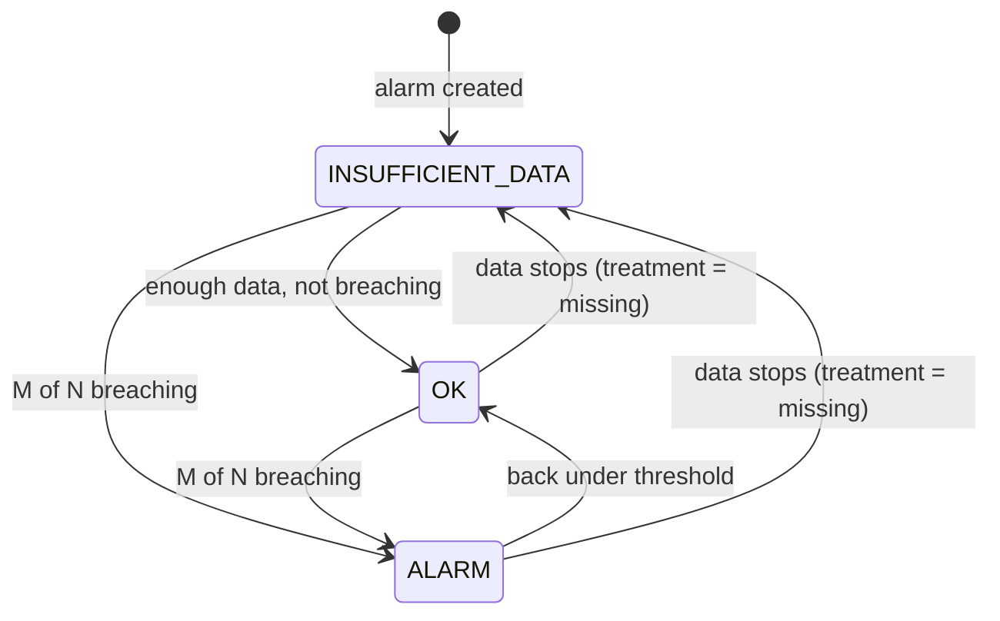
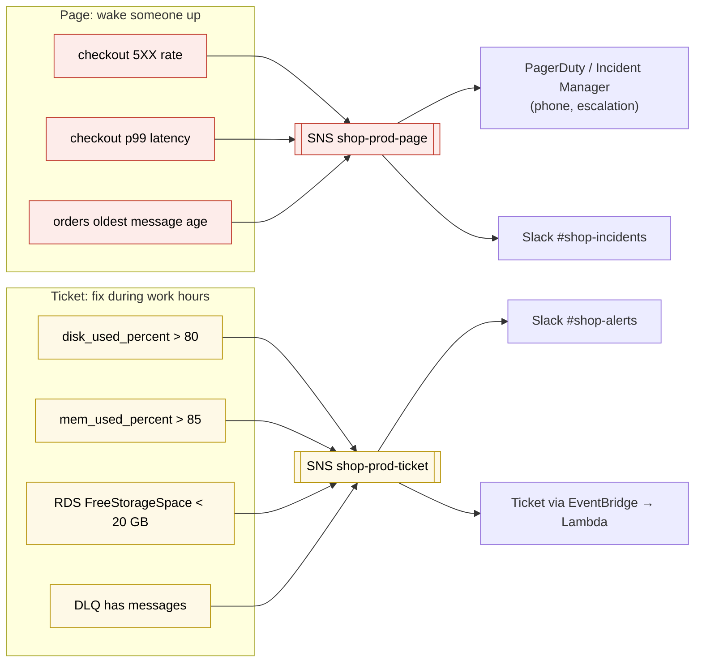

# CloudWatch alarms

> [!abstract] In one sentence
> A CloudWatch alarm watches **one metric** (or a metric math expression), compares it to a **threshold** over a number of **periods**, and when its **state changes** (OK ↔ ALARM ↔ INSUFFICIENT_DATA) it **acts**: notify through [[SNS]], scale an [[Auto Scaling]] group, stop/reboot/recover an [[EC2]] instance, or invoke a [[Lambda]] function.

## Common misconceptions

**Wrong mental model #1:** "The alarm emails me every minute until the problem is fixed."

**What's actually true:** actions run on **state transitions**. OK → ALARM sends **one** notification. If it stays in ALARM for 6 hours, nothing more is sent. If I want reminders, that's the job of the paging tool (PagerDuty, Opsgenie, Incident Manager), not the alarm.

**Wrong mental model #2:** "One data point over the threshold = alarm."

**What's actually true:** the alarm looks at **M out of N** periods ("**datapoints to alarm**" out of "**evaluation periods**"). With period 60 s, 3 out of 5, CPU must be high in **3 of the last 5 minutes**. This is how I avoid being woken by a single spike.

| Wrong mental model | What's actually true |
|---|---|
| No data = everything is fine | Missing data has its **own setting** (`missing`, `notBreaching`, `breaching`, `ignore`). For a heartbeat metric, no data **is** the problem |
| An alarm can watch "all instances" | One alarm = one metric (one set of dimensions). For a fleet: an aggregated dimension, metric math, or a **Metrics Insights** query |
| More alarms = safer | Too many alarms train people to ignore them. Page on **symptoms**, the rest goes to a ticket or a dashboard |
| An alarm in ALARM means something is down | It means a number crossed a line. The alarm description should say **what it means and what to do** |
| SNS email works right after I subscribe | The address must **confirm** the subscription first. Unconfirmed = nothing delivered |

## Anatomy of an alarm

| Setting | Meaning | Shop example |
|---|---|---|
| Metric + **statistic** | What is watched, and how it's reduced per period | `CheckoutErrorRate`, `Average` |
| **Period** | Size of each bucket | 60 s |
| **Threshold** + comparison | The line | `> 2` (%) |
| **Evaluation periods** (N) | How many recent periods are looked at | 5 |
| **Datapoints to alarm** (M) | How many of them must breach | 3 |
| **Missing data treatment** | What an empty period counts as | `notBreaching` |
| **Actions** per state | What to do on → ALARM, → OK, → INSUFFICIENT_DATA | ALARM: SNS `shop-prod-page`. OK: same topic (to say "resolved") |
| **Description** | Shown in the notification | "Checkout error rate > 2%. Runbook: …" |

**States:**



**Missing data treatment:**

| Value | A missing period counts as… | Use it for |
|---|---|---|
| `missing` (default) | Nothing: if all are missing → INSUFFICIENT_DATA | General metrics |
| `notBreaching` | Good | Error counts that only exist when errors happen |
| `breaching` | Bad | **Heartbeats**: "the nightly job must report every day" |
| `ignore` | Keep the current state | Sparse metrics where state shouldn't flap |

## Actions an alarm can take

| Action | Example |
|---|---|
| **SNS topic** | → email, SMS, HTTPS (PagerDuty/Opsgenie), Lambda, SQS, **Amazon Q Developer in chat applications** (formerly AWS Chatbot) → Slack / Teams |
| **Lambda function** (direct) | Auto-remediation code. The function's resource policy must allow `lambda.alarms.cloudwatch.amazonaws.com` |
| **EC2 action** | `stop`, `terminate`, `reboot`, **`recover`** (moves the instance to new hardware on a system status check failure) |
| **Auto Scaling policy** | Step scaling: add 2 instances when CPU > 70% |
| **Systems Manager** | Create an **OpsItem** or an **Incident Manager** incident (with escalation and on-call rotation) |

On top of that, every state change emits an **EventBridge** event (`CloudWatch Alarm State Change`), so an [[EventBridge]] rule can route it anywhere (Step Functions runbook, ticketing system, another account).

## Build-up: alerting for the shop in production

Shop account `123456789012`, `eu-west-1`. Metrics come from AWS services, the [[CloudWatch agent]] (namespace `Shop/EC2`) and the app (namespace `Shop/Checkout`, see [[CloudWatch]]).

### Stage 1: an alarm on CPU, sent by email

```bash
aws sns create-topic --name shop-prod-alerts
aws sns subscribe --topic-arn arn:aws:sns:eu-west-1:123456789012:shop-prod-alerts \
  --protocol email --notification-endpoint oncall@example.com   # then click the confirmation email

aws cloudwatch put-metric-alarm \
  --alarm-name shop-prod-web-cpu-high \
  --namespace AWS/EC2 --metric-name CPUUtilization \
  --dimensions Name=AutoScalingGroupName,Value=shop-prod-web \
  --statistic Average --period 300 --evaluation-periods 1 \
  --threshold 80 --comparison-operator GreaterThanThreshold \
  --alarm-actions arn:aws:sns:eu-west-1:123456789012:shop-prod-alerts
```

**The problems** after a week:
- It fired 9 times: batch jobs, deploys, a cache warmup. Each time the site was fine. The team starts muting the email
- The one real outage (payment provider timing out) never fired it: CPU was **low**, because requests were waiting, not computing

High CPU is a **cause** (maybe). What the customer feels is a **symptom**.

### Stage 2: alarm on symptoms, M out of N

The things that mean "customers are hurting":

| Symptom | Metric | Alarm |
|---|---|---|
| Checkout failing | Metric math `100 * HTTPCode_Target_5XX_Count / RequestCount` on the ALB, or `PaymentsFailed / OrdersAttempted` from `Shop/Checkout` | `> 2 %` for **3 of 5** minutes |
| Checkout slow | `TargetResponseTime` **p99** | `> 1.5 s` for 5 of 5 minutes |
| Orders stuck | `AWS/SQS` `ApproximateAgeOfOldestMessage` on `shop-prod-orders` | `> 600 s` for 3 of 3 |
| Nobody buying (silent failure) | `Shop/Checkout` `OrdersPlaced` | **Anomaly detection** band, below expected for 15 min |

The error-rate alarm with metric math:

```bash
aws cloudwatch put-metric-alarm \
  --alarm-name shop-prod-checkout-5xx-rate \
  --alarm-description "Checkout 5XX > 2% for 3 of 5 min. Runbook: wiki/runbooks/checkout-5xx" \
  --evaluation-periods 5 --datapoints-to-alarm 3 \
  --threshold 2 --comparison-operator GreaterThanThreshold \
  --treat-missing-data notBreaching \
  --metrics '[
    {"Id":"errors","ReturnData":false,"MetricStat":{"Metric":{"Namespace":"AWS/ApplicationELB","MetricName":"HTTPCode_Target_5XX_Count","Dimensions":[{"Name":"LoadBalancer","Value":"app/shop-prod-alb/50dc6c495c0c9188"}]},"Period":60,"Stat":"Sum"}},
    {"Id":"requests","ReturnData":false,"MetricStat":{"Metric":{"Namespace":"AWS/ApplicationELB","MetricName":"RequestCount","Dimensions":[{"Name":"LoadBalancer","Value":"app/shop-prod-alb/50dc6c495c0c9188"}]},"Period":60,"Stat":"Sum"}},
    {"Id":"rate","Expression":"100 * errors / requests","Label":"5XX %","ReturnData":true}
  ]' \
  --alarm-actions arn:aws:sns:eu-west-1:123456789012:shop-prod-page \
  --ok-actions    arn:aws:sns:eu-west-1:123456789012:shop-prod-page
```

**Anomaly detection** learns the metric's normal shape (daily and weekly pattern) and alarms when it leaves a **band**. "10 orders per minute" is normal at 3 a.m. and a disaster at 8 p.m. on a Friday: a fixed threshold can't say both.

### Stage 3: two kinds of alerts, two channels

Not everything should wake someone up. I split by **severity**:



- **Page** alarms: few, about customer impact, each with a runbook link in the description, and an **OK action** so the channel sees "resolved"
- **Ticket** alarms: causes that will *become* incidents if ignored (disk filling, memory creeping, a dead-letter queue receiving messages)
- Slack/Teams through **Amazon Q Developer in chat applications** subscribed to the SNS topic
- The SNS topic for paging is **encrypted** (KMS key whose policy allows `cloudwatch.amazonaws.com`) and has a **DLQ** on HTTPS subscriptions, so a pager outage doesn't silently drop alerts

### Stage 4: one incident, 14 alerts

The RDS instance fails over. In 2 minutes: 5XX rate, latency, SQS age, RDS connections, 8 per-instance app error alarms… all fire. The on-call person gets 14 pages for **one** problem.

**Composite alarms** combine alarms with `AND`, `OR`, `NOT`:

```
ALARM("shop-prod-checkout-5xx-rate") OR ALARM("shop-prod-checkout-p99")
```

- The child alarms have **no actions**. Only the composite `shop-prod-checkout-unhealthy` pages
- **Actions suppressor**: while the alarm `shop-prod-deploy-in-progress` is in ALARM (set by the pipeline), the composite doesn't act. No pages during a planned deploy
- Another classic: `ALARM(cpu-high) AND ALARM(latency-high)` = "slow *because* overloaded", vs latency alone = "probably a dependency"

### Stage 5: let the alarm fix it

Some responses are always the same, so the alarm does them:

| Alarm | Automatic action |
|---|---|
| `StatusCheckFailed_System` on a standalone instance | EC2 **recover** action (same instance ID, IP, EBS, on new hardware) |
| Backlog per instance on `shop-prod-orders` above target | [[Auto Scaling]] adds workers (target tracking creates its own alarms) |
| `procstat pid_count = 0` for `shop-api` | Lambda / SSM Automation runbook: restart the service, notify ticket channel |
| `disk_used_percent > 90` | SSM Automation: rotate and delete old logs, then notify |

Rule of thumb: auto-remediate only what's **safe to repeat** and **well understood**, and still **notify** so the root cause gets fixed.

### Stage 6: the job that silently stopped

The nightly invoice export runs as a scheduled task. One night it doesn't start (IAM change). No error, no log, no alarm: nothing happened, and **nothing happening produces no data**.

**Heartbeat alarm:** the job publishes `Shop/Jobs` `InvoiceExportSucceeded = 1` at the end. The alarm: `Sum < 1` over a **period of 1 day** (86,400 s), `treat-missing-data breaching`. No success in 24 h → ALARM.

### Stage 7: many accounts

With prod spread over several accounts in [[AWS Organizations]]:
- Alarms live **as code** (CloudFormation/CDK/Terraform) next to the service, not clicked in the console, so every environment gets the same set
- **Cross-account observability**: a monitoring account sees all accounts' metrics; alarms (including Metrics Insights alarms over the fleet) can be built there
- Alarm state changes → [[EventBridge]] → a central bus in the ops account → one routing point to the pager

## Practice

> [!example]- My alarm went to ALARM at 02:00 and I got one email. It's still in ALARM at 08:00. Why no more emails?
> Actions fire on state transitions, not continuously. Repeated reminders are the job of an incident tool.

> [!example]- I want to be paged if CPU is high in 3 of the last 5 minutes, not on one spike. Settings?
> Period 60 s, evaluation periods 5, datapoints to alarm 3.

> [!example]- A nightly job must succeed every day. How do I alarm when it doesn't run at all?
> It publishes a success metric. Alarm on `Sum < 1` over 1 day with missing data treated as **breaching**.

> [!example]- A database failover sends 14 pages. How to get one?
> Remove actions from the child alarms, create a composite alarm (OR of the symptom alarms) with the paging action. Optionally an actions suppressor during deploys.

> [!example]- How can an alarm restart a dead process automatically?
> Alarm on the agent's `procstat pid_count` < 1, action: invoke a Lambda (or SSM Automation via EventBridge) that runs the restart through Run Command, and also notify.

> [!example]- EC2 instance on failing hardware, not in an Auto Scaling group. Which alarm action?
> The `recover` EC2 action on `StatusCheckFailed_System`.

## Easy to get wrong
- Expecting repeated notifications while an alarm stays in ALARM
- Alarming on causes (CPU) and missing the symptom (errors, latency, queue age)
- Using a raw 5XX count instead of a rate (metric math)
- Default missing-data treatment on a heartbeat metric: the job that never runs never alarms
- Forgetting OK actions, so nobody knows it's resolved
- Unconfirmed SNS email subscriptions
- An SNS topic with a KMS key that doesn't allow CloudWatch to use it: alarms fire, nothing is delivered
- One alarm per instance in an Auto Scaling group: they die with the instances
- Dimensions in the alarm not matching the metric exactly → INSUFFICIENT_DATA forever
- 1-minute alarms on EC2 basic monitoring (5-minute data)
- Paging on everything: alert fatigue

## Related
- Watches:: [[CloudWatch]], [[CloudWatch Logs]] (metric filters), [[CloudWatch agent]]
- Notifies through:: [[SNS]], [[EventBridge]]
- Acts on:: [[Auto Scaling]], [[EC2]], [[Lambda]]
- Typical metrics from:: [[Load balancers]], [[SQS]], [[RDS]]
- Security alerts from API calls:: [[CloudTrail in production]]
- Health checks for DNS failover:: [[Route 53]]

## Flashcards
#flashcards

What are the three CloudWatch alarm states? :: OK, ALARM, INSUFFICIENT_DATA
When does an alarm run its actions? :: On state transitions, not continuously while in a state
What is "M out of N" in an alarm? :: Datapoints to alarm (M) out of evaluation periods (N) must breach
Four missing-data treatments? :: missing, notBreaching, breaching, ignore
Which missing-data treatment for a heartbeat metric? :: breaching
What actions can an alarm take? :: SNS, Lambda, EC2 (stop/terminate/reboot/recover), Auto Scaling policy, SSM OpsItem/Incident Manager
What does the EC2 recover action do? :: Moves the instance to healthy hardware keeping ID, private IP and EBS volumes
How do you alarm on an error rate? :: Metric math, e.g. 100 * 5XX count / request count
What is a composite alarm? :: An alarm whose rule combines other alarms with AND/OR/NOT, to reduce noise
What is an actions suppressor? :: An alarm that, while in ALARM, stops a composite alarm from running its actions (e.g. during deploys)
What does anomaly detection do in an alarm? :: Learns the metric's normal pattern and alarms when it leaves the expected band
Page vs ticket alarms? :: Page on customer-facing symptoms. Ticket on causes that will become problems (disk, memory, DLQ)
How do alarms reach Slack? :: SNS topic → Amazon Q Developer in chat applications (formerly AWS Chatbot)
Which EventBridge event does an alarm emit? :: CloudWatch Alarm State Change
Which principal must a Lambda resource policy allow for a direct alarm action? :: lambda.alarms.cloudwatch.amazonaws.com
Why does a KMS-encrypted SNS topic sometimes get no alarm notifications? :: The key policy doesn't allow cloudwatch.amazonaws.com to use the key
