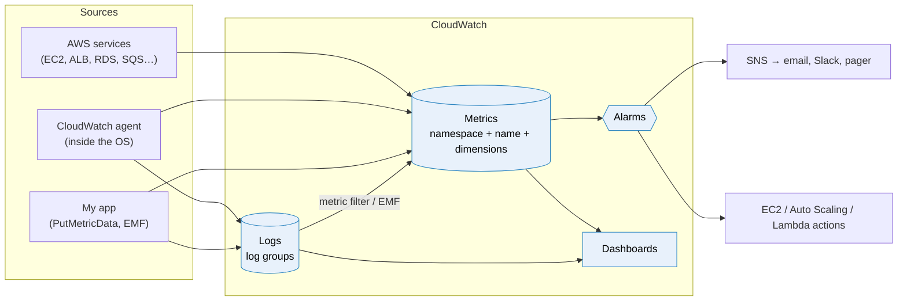

# CloudWatch

> [!abstract] In one sentence
> CloudWatch is AWS's **monitoring service**: it stores **metrics** (numbers over time), **logs** (text lines), and **alarms** that watch those metrics and act when something goes wrong. AWS services send their own metrics automatically, and I can push my own into **custom namespaces**.

## Common misconceptions

**Wrong mental model #1:** "CloudWatch sees everything happening on my EC2 instance."

**What's actually true:** AWS only sees the instance **from the outside** (the hypervisor). It knows CPU, network bytes, disk I/O on instance store and status checks. It has **no idea** how much **memory** is used, how full the **filesystem** is, or whether `nginx` is running. Those need the [[CloudWatch agent]] running *inside* the OS, or my app publishing them itself.

**Wrong mental model #2:** "A metric is a name like `CPUUtilization`."

**What's actually true:** a metric is the full combination **namespace + metric name + every dimension**. `CPUUtilization` for instance `i-0a1b` and for instance `i-0c2d` are **two different metrics**. This matters for alarms (they must match the dimensions exactly) and for the bill (each combination is billed as its own custom metric).

| Wrong mental model | What's actually true |
|---|---|
| CloudWatch = CloudTrail | CloudWatch: **how are things running** (metrics, logs). [[CloudTrail]]: **who called which API** |
| EC2 metrics come every minute | **Basic monitoring** is every **5 minutes**. **Detailed monitoring** (paid) is every minute |
| I can delete a wrong custom metric | No. Metrics can't be deleted: they **expire** 15 months after the last data point |
| Logs are kept a reasonable time by default | A new log group's retention is **Never expire**. I pay for storage forever unless I set it (see [[CloudWatch Logs]]) |
| An alarm notifies me every minute while it's broken | It notifies on **state changes** (OK → ALARM), once (see [[CloudWatch alarms]]) |
| "Insights" is one feature | It's a family: Logs Insights, Metrics Insights, Container Insights, Lambda Insights, Contributor Insights, Application Signals… and CloudTrail Insights is a different service (table below) |

## The pieces



| Piece | What it holds | Note |
|---|---|---|
| **Metrics** | Time series of numbers | This note |
| **Logs** | Text/JSON lines in log groups, queried with Logs Insights | [[CloudWatch Logs]] |
| **Alarms** | A rule on one metric (or metric math) with actions | [[CloudWatch alarms]] |
| **Agent** | Collects OS metrics and log files from servers | [[CloudWatch agent]] |
| **Dashboards** | Graphs of metrics and log queries, can span regions and accounts | This note |

## Metrics vocabulary

| Term | Meaning | Example |
|---|---|---|
| **Namespace** | A container that keeps metrics apart. AWS uses `AWS/<Service>` | `AWS/EC2`, `AWS/SQS`, `CWAgent`, `Shop/Checkout` |
| **Metric name** | What is measured | `CPUUtilization`, `OrdersPlaced` |
| **Dimension** | A name/value pair that says *which thing* (up to 30 per metric) | `InstanceId=i-0a1b…`, `Environment=prod` |
| **Data point** | A value + timestamp (+ unit) | `42` at `14:32:00`, unit `Count` |
| **Period** | The time bucket a statistic is computed over | 60 s, 300 s |
| **Statistic** | How data points in a period are combined | `Average`, `Sum`, `Minimum`, `Maximum`, `SampleCount`, percentiles `p99` |
| **Resolution** | How fine the stored data is | **Standard** = 1 minute. **High resolution** = down to 1 second |

**Retention** is automatic and rolls data up as it ages:

| Data granularity | Kept for |
|---|---|
| Under 60 s (high resolution) | 3 hours |
| 1 minute | 15 days |
| 5 minutes | 63 days |
| 1 hour | 455 days (15 months) |

So I can look at one-second data for a few hours, but a graph of "last year" only has hourly points.

## Build-up: monitoring the shop's checkout

Same shop as in [[SQS]] and [[RDS]]: account `123456789012`, `eu-west-1`, app instances in an [[Auto Scaling]] group behind an ALB, orders go to the `shop-prod-orders` queue, PostgreSQL on [[RDS]].

### Stage 1: only what AWS gives me for free

Without doing anything, CloudWatch already has:
- `AWS/EC2`: `CPUUtilization`, `NetworkIn/Out`, `StatusCheckFailed` per instance (every 5 minutes)
- `AWS/ApplicationELB`: `RequestCount`, `TargetResponseTime`, `HTTPCode_Target_5XX_Count`
- `AWS/SQS`: `ApproximateNumberOfMessagesVisible`, `ApproximateAgeOfOldestMessage`
- `AWS/RDS`: `CPUUtilization`, `FreeStorageSpace`, `DatabaseConnections`

**The problem:** an instance dies at 3 a.m. because its root disk filled up with logs. CloudWatch showed CPU at 4%: everything looked fine. And nothing tells me the business is broken: if payments start failing, the ALB still returns `200` (the app shows a friendly error page), so no AWS metric moves.

### Stage 2: OS metrics with the agent

I install the [[CloudWatch agent]] on every instance (through the launch template). It publishes `mem_used_percent` and `disk_used_percent` into the `CWAgent` namespace (or one I choose), with the instance and Auto Scaling group as dimensions. Now "disk at 85%" is a number I can alarm on.

### Stage 3: business metrics in a custom namespace

What I really want to watch is **what the customer experiences**: orders placed, payments failed, checkout latency. Only my app knows those, so the app publishes them into a **custom namespace** `Shop/Checkout`.

> [!info] Creating a custom namespace
> There's no "create namespace" button or API. A namespace **exists as soon as the first data point is published into it**. The only rules: it can't start with `AWS/` (reserved), and it's up to 255 characters. My convention: `<Project>/<Component>`, e.g. `Shop/Checkout`, `Shop/Workers`, so the console groups them nicely.

**Option A: call the API (`PutMetricData`)**

From the CLI, good for scripts and cron jobs:

```bash
aws cloudwatch put-metric-data \
  --namespace "Shop/Checkout" \
  --metric-name PaymentsFailed \
  --dimensions Environment=prod,PaymentProvider=stripe \
  --unit Count \
  --value 1
```

From the app (Python, boto3). I **batch** values instead of calling once per order, since every call costs money and adds latency:

```python
import boto3
from datetime import datetime, timezone

cw = boto3.client("cloudwatch", region_name="eu-west-1")

def flush(orders_placed: int, payments_failed: int, latencies_ms: list[float]):
    now = datetime.now(timezone.utc)
    dims = [{"Name": "Environment", "Value": "prod"}]
    cw.put_metric_data(
        Namespace="Shop/Checkout",
        MetricData=[
            {"MetricName": "OrdersPlaced", "Dimensions": dims,
             "Timestamp": now, "Value": orders_placed, "Unit": "Count"},
            {"MetricName": "PaymentsFailed", "Dimensions": dims,
             "Timestamp": now, "Value": payments_failed, "Unit": "Count"},
            # many raw values in one entry: CloudWatch can still compute p99
            {"MetricName": "CheckoutLatency", "Dimensions": dims,
             "Timestamp": now, "Values": latencies_ms,
             "Unit": "Milliseconds"},
        ],
    )
```

The instance needs `cloudwatch:PutMetricData` in its [[IAM]] role. Its `Condition` can pin the namespace (`"cloudwatch:namespace": "Shop/*"`), so a compromised app can't write fake `AWS/…`-looking data elsewhere.

**Option B: Embedded Metric Format (EMF), metrics from log lines**

Instead of calling an API, the app **prints a JSON log line** with a special `_aws` block. [[CloudWatch Logs]] reads it and creates the metric **asynchronously**. This is the best choice for [[Lambda]] (no extra API call slowing the function) and for anything already shipping logs:

```json
{
  "_aws": {
    "Timestamp": 1790000000000,
    "CloudWatchMetrics": [{
      "Namespace": "Shop/Checkout",
      "Dimensions": [["Environment"]],
      "Metrics": [
        {"Name": "CheckoutLatency", "Unit": "Milliseconds"},
        {"Name": "PaymentsFailed", "Unit": "Count"}
      ]
    }]
  },
  "Environment": "prod",
  "CheckoutLatency": 412,
  "PaymentsFailed": 0,
  "orderId": "o-8812",
  "customerId": "c-4471"
}
```

The nice part: `orderId` and `customerId` stay in the **log**, searchable with Logs Insights, but they're **not dimensions**, so they don't create millions of metrics.

**Option C: StatsD / collectd through the agent.** If the app already speaks StatsD, the agent listens on UDP `8125` and forwards (see [[CloudWatch agent]]).

| Way in | Good for | Watch out |
|---|---|---|
| `PutMetricData` | Scripts, batch jobs, apps that can batch | Each call costs. Up to 1,000 metrics per call. Timestamps up to 2 weeks in the past |
| EMF log line | Lambda, containers, high volume | Needs the log to land in CloudWatch Logs. Pays log ingestion |
| Agent StatsD/collectd | Apps already instrumented that way | Agent must run next to the app |
| Metric filter on logs | Counting a pattern in logs I can't change | Only counts **new** log events, not history (see [[CloudWatch Logs]]) |

### Stage 4: the dimension that blew up the bill

A teammate adds `CustomerId` as a dimension on `CheckoutLatency` "to debug slow customers". With 200,000 customers, that's **200,000 separate custom metrics**, each billed per month.

**The fix:** dimensions should have **low cardinality**: environment, service, region, payment provider, AZ. A handful of values each. High-cardinality IDs go in **logs** (EMF properties), and I find the slow customers with a Logs Insights query instead.

### Stage 5: finding the outlier among 40 instances

"Which instance has the highest memory?" With 40 instances, 40 graph lines are unreadable. **Metrics Insights** queries metrics with SQL:

```sql
SELECT MAX(mem_used_percent)
FROM SCHEMA(CWAgent, AutoScalingGroupName, InstanceId)
WHERE AutoScalingGroupName = 'shop-prod-web'
GROUP BY InstanceId
ORDER BY MAX() DESC
LIMIT 5
```

The query works on the latest 3 hours, can feed a dashboard widget, and can drive an alarm ("alarm if **any** instance is above 90%", without one alarm per instance).

**Metric math** combines metrics on the fly. The classic one is an **error rate**, which means much more than a raw count:

```
m1 = HTTPCode_Target_5XX_Count (Sum)
m2 = RequestCount (Sum)
e1 = 100 * m1 / m2        → % of requests failing
```

10 errors out of 100 requests is a disaster. 10 out of 1,000,000 is noise. The count alone can't tell them apart.

### Stage 6: dashboards for the on-call person

One dashboard `shop-prod-overview` per service, laid out **top to bottom like the request**:
1. Customer view: orders/minute, payment failure %, checkout p99 latency
2. Front door: ALB requests, 5XX %, target response time
3. Workers: SQS visible messages and **age of oldest message**
4. Database: RDS CPU, connections, free storage
5. A Logs Insights widget: the last 20 errors

Dashboards can show metrics from **several regions and accounts**. With **cross-account observability**, a central monitoring account sees the metrics, logs and traces of every workload account in the [[AWS Organizations|organization]].

## The Insights family

The name is reused a lot. Each one answers a different question:

| Feature | Answers | Where |
|---|---|---|
| **Logs Insights** | "Search and aggregate my logs" (query language) | [[CloudWatch Logs]] |
| **Metrics Insights** | "SQL over metrics: top N, group by" | Stage 5 above |
| **Container Insights** | CPU/memory/restarts per ECS task, EKS pod, node | Agent/add-on in the cluster |
| **Lambda Insights** | Memory, CPU, cold starts per function | A Lambda layer (extension) |
| **Contributor Insights** | "Top talkers": which IP, URL, customer causes the most traffic or errors | Rules over logs (also DynamoDB, VPC Flow Logs) |
| **Application Signals** | Service map, latency/errors per API, SLOs | OpenTelemetry instrumentation |
| **Database Insights** | Database load, slow SQL (successor of RDS Performance Insights) | RDS/Aurora |
| **CloudTrail Insights** | "Unusual **API call** volume or errors" | Not CloudWatch: [[CloudTrail#CloudTrail Insights]] |

## Pricing in one look
- AWS service metrics at basic resolution: **free**
- Custom metrics (including agent metrics): **per metric per month** (each namespace + name + dimensions combination). High resolution doesn't cost more to store, but alarms on it do
- API calls (`PutMetricData`, `GetMetricData`): per 1,000 requests
- Logs: **per GB ingested** (the big one) + per GB stored + per GB scanned by Logs Insights
- Alarms: per alarm per month (more for high resolution, anomaly detection and composite)

The two classic surprise bills: a high-cardinality dimension, and verbose debug logs with no retention.

## How it fits with the rest

| Tool | Question it answers |
|---|---|
| **CloudWatch** | How is it performing? Is it healthy? |
| [[CloudTrail]] | Who called which API, when, from where? |
| **AWS Config** | What did a resource's configuration look like over time, is it compliant? |
| **X-Ray / Application Signals** | Where did this one request spend its time across services? |
| [[EventBridge]] | React to something that happened (alarm state changes, AWS events) |

## Practice

> [!example]- The disk of my EC2 instance is full but CloudWatch shows nothing. Why?
> EC2's built-in metrics come from the hypervisor and don't include filesystem usage or memory. I need the CloudWatch agent (`disk_used_percent`, `mem_used_percent`).

> [!example]- How do I create the custom namespace `Shop/Checkout`?
> I just publish a data point into it (`PutMetricData`, EMF, or the agent's `namespace` setting). It appears automatically. It can't start with `AWS/`.

> [!example]- I want to know which customers have slow checkouts. Should I add `CustomerId` as a dimension?
> No: every customer becomes a separate billed metric. Log the customer ID as an EMF property (or a plain log field) and use Logs Insights to find them.

> [!example]- I publish 1-second data. A month later, can I still see the 1-second points?
> No. Sub-minute data is kept 3 hours, then rolled up: 1-minute data for 15 days, 5-minute for 63 days, 1-hour for 15 months.

> [!example]- Why alarm on an error rate instead of a 5XX count?
> A count depends on traffic: 50 errors is fine at peak and terrible at night. Metric math `100 * 5XX / RequestCount` gives a percentage that means the same thing at any traffic level.

## Easy to get wrong
- Expecting memory and disk-space metrics from EC2 without the agent
- Treating a metric name as a metric: the dimensions are part of its identity, and alarms must match them exactly
- Putting IDs (customer, order, request) in dimensions: one billed metric per value
- Looking for a "create namespace" button: a namespace is created by publishing into it
- Using `AWS/` as a custom namespace prefix (reserved)
- Thinking metrics can be deleted (they expire after 15 months without data)
- Forgetting EC2 basic monitoring is 5-minute data, so a 1-minute alarm on it has missing points
- Calling `PutMetricData` once per request in a hot path instead of batching or using EMF
- Mixing up CloudWatch (performance) with CloudTrail (API audit)

## Related
- Parts of CloudWatch:: [[CloudWatch agent]], [[CloudWatch Logs]], [[CloudWatch alarms]]
- Differs from:: [[CloudTrail]]
- Metrics come from:: [[EC2]], [[Load balancers]], [[SQS]], [[RDS]], [[Lambda]], [[Auto Scaling]]
- Acts through:: [[SNS]], [[EventBridge]], [[Auto Scaling]]
- Permissions:: [[IAM]]
- Many accounts:: [[AWS Organizations]]
- Big picture:: [[How AWS services connect]]

## Flashcards
#flashcards

What is CloudWatch? :: AWS's monitoring service: metrics, logs, alarms and dashboards
CloudWatch vs CloudTrail? :: CloudWatch: how resources perform (metrics, logs). CloudTrail: who made which API call
What identifies a CloudWatch metric? :: Namespace + metric name + all its dimensions
What is a CloudWatch namespace? :: A container that keeps metrics apart, e.g. AWS/EC2 or a custom one like Shop/Checkout
How do you create a custom namespace? :: Publish a data point into it. It exists from the first data point
Which namespace prefix is reserved? :: AWS/
Default namespace of the CloudWatch agent? :: CWAgent
Which EC2 metrics are NOT available by default? :: Memory usage and filesystem (disk space) usage. They need the CloudWatch agent
EC2 basic vs detailed monitoring? :: Basic: 5-minute metrics, free. Detailed: 1-minute metrics, paid
Standard vs high-resolution metrics? :: Standard: 1-minute granularity. High resolution: down to 1 second
How long are 1-minute data points kept? :: 15 days (then 5-minute for 63 days, 1-hour for 15 months)
How long are sub-minute data points kept? :: 3 hours
Can a custom metric be deleted? :: No, it expires 15 months after its last data point
Maximum dimensions per metric? :: 30
Why not use CustomerId as a dimension? :: High cardinality: every value is a separate billed metric. Put IDs in logs instead
What is Embedded Metric Format (EMF)? :: A JSON log line with an _aws block that CloudWatch Logs turns into metrics asynchronously
Why is EMF good for Lambda? :: No synchronous PutMetricData call: the function just prints a log line
What IAM permission does PutMetricData need, and how to restrict it? :: cloudwatch:PutMetricData, restricted with the cloudwatch:namespace condition key
What is Metrics Insights? :: SQL-like queries over metrics (GROUP BY, ORDER BY, LIMIT) for the last 3 hours
What is metric math for? :: Combining metrics into a new series, e.g. an error rate from 5XX count / request count
What is CloudWatch cross-account observability? :: A monitoring account that sees metrics, logs and traces from linked workload accounts
What is Contributor Insights? :: Top-N contributors (IPs, URLs, customers) computed from log data
