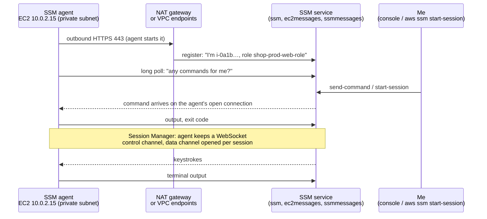
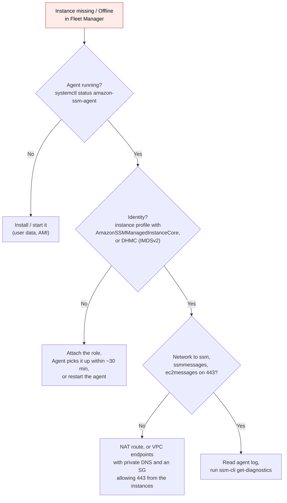

# Systems Manager

> [!abstract] In one sentence
> AWS Systems Manager (SSM) manages servers (EC2, on-premises, other clouds) through an **agent** on each machine that **dials out** to the SSM service over HTTPS: from that one outbound channel I get a shell (**Session Manager**), run commands on a fleet (**Run Command**), patch (**Patch Manager**), enforce config (**State Manager**), and store config and secrets (**Parameter Store**), with **no inbound port, no SSH key, no bastion**.

## Sub-services & features

| Group                 | Feature                                 | What it's for                                                                                                          |
| --------------------- | --------------------------------------- | ---------------------------------------------------------------------------------------------------------------------- |
| **Node tools**        | **Fleet Manager**                       | See managed nodes, their OS, agent, files, users, from the console                                                     |
|                       | **Session Manager**                     | Shell or port forwarding to a node, no inbound port, logged                                                            |
|                       | **Run Command**                         | Run a document (script) on many nodes at once, with rate control                                                       |
|                       | **State Manager**                       | Associations: keep nodes in a desired state (agent installed, config applied), re-applied on schedule and on new nodes |
|                       | **Patch Manager**                       | Scan and install OS patches by baseline, report compliance                                                             |
|                       | **Distributor**                         | Install packages (e.g. the CloudWatch agent)                                                                           |
|                       | **Inventory**, **Compliance**           | What software/config each node has, and whether it complies                                                            |
|                       | **Hybrid activations**                  | Register on-premises/other-cloud servers as managed nodes (`mi-…`)                                                     |
| **Change management** | **Automation**                          | Runbooks: multi-step workflows calling AWS APIs (restart, snapshot, patch an AMI), with approvals                      |
|                       | **Maintenance Windows**                 | Schedule when disruptive tasks may run                                                                                 |
|                       | **Change Manager**, **Change Calendar** | Approvals and "no changes during Black Friday"                                                                         |
| **Application tools** | **Parameter Store**                     | Config values and secrets (`SecureString` via KMS), in a hierarchy                                                     |
|                       | AppConfig                               | Feature flags and config rollout with validation and rollback                                                          |
| **Operations**        | **OpsCenter**, **Incident Manager**     | Ops items and incidents (Incident Manager: on-call, escalation, response plans)                                        |
|                       | **Explorer**, **Quick Setup**           | Dashboards across accounts, one-click org-wide setup                                                                   |

## Common misconceptions

**Wrong mental model #1:** "Systems Manager connects **to** my instance to run commands, so my private instance behind a NAT gateway needs an inbound rule, or it can't work at all."

**What's actually true:** SSM never opens a connection to the instance. The **agent** opens **outbound HTTPS (443)** connections to the SSM endpoints and keeps them open. Commands and shell data come back **on those connections the agent opened**. The NAT gateway lets them through for the same reason it lets any HTTPS response through: they belong to a flow started from inside. SSM can't send a new TCP SYN to the instance, and doesn't need to.

The full reasoning, with the HTTP request/response vs TCP connection distinction (the HTTPS connection does **not** end when a response arrives, and a NAT mapping is **not** an open door for anyone who has talked to the instance): [[Outbound-initiated connections]].

**Wrong mental model #2:** "SSM needs internet access."

**What's actually true:** it needs a path to the **SSM endpoints**, not to the internet. With **VPC interface endpoints** for `ssm`, `ssmmessages` and `ec2messages`, an instance in a subnet with **no NAT gateway and no internet gateway route** is fully manageable.

| Wrong mental model | What's actually true |
|---|---|
| I need port 22 open (at least from a bastion) | **No inbound rule at all**. The security group only needs outbound 443 to the endpoints |
| The agent being installed is enough | Also needed: an **IAM role** (instance profile with `AmazonSSMManagedInstanceCore`, or Default Host Management Configuration) and a **network path** to the endpoints |
| Session Manager is SSH in a browser | It's a separate protocol over the agent's WebSocket. It *can* tunnel SSH, but doesn't need it: no keys, no sshd |
| Session Manager gives root by default | Sessions run as `ssm-user` (with sudo on Linux by default: worth restricting) or a **Run As** user mapped from the IAM identity |
| Parameter Store and Secrets Manager are the same | Parameter Store: config + simple secrets, free standard tier, no built-in rotation. Secrets Manager: **rotation**, cross-account sharing, paid per secret |
| Run Command on 500 instances runs everywhere at once | **Rate control**: max concurrency (e.g. 10% at a time) and max errors (stop after 2 failures) |

## How the agent talks to SSM



| Endpoint | Used for |
|---|---|
| `ssm.<region>.amazonaws.com` | Registration, inventory, Parameter Store, association status |
| `ec2messages.<region>.amazonaws.com` | Run Command message delivery (long polling) for older agents. Recent agent versions use `ssmmessages` instead when they can |
| `ssmmessages.<region>.amazonaws.com` | Session Manager WebSocket channels (and Run Command on recent agents) |
| Optional: `s3`, `logs`, `kms` | Command output / session logs to S3 or CloudWatch Logs, KMS-encrypted sessions |

The three ingredients for a **managed node** (it then shows up in Fleet Manager as "Online"):
1. **Agent** running: preinstalled on Amazon Linux 2/2023, Ubuntu and Windows Server AWS AMIs
2. **Identity**: the instance profile role with `AmazonSSMManagedInstanceCore`, **or** account-wide **Default Host Management Configuration** (DHMC: SSM gives every instance credentials through a role I designate, requires IMDSv2), or a hybrid activation for non-EC2 servers
3. **Network**: outbound 443 to the endpoints (NAT gateway, internet gateway with public IP, or VPC interface endpoints, or a proxy)

## Build-up: operating the shop's private fleet

Shop account `123456789012`, `eu-west-1`. The `shop-prod-web` Auto Scaling group lives in private subnets `10.0.2.0/24` and `10.0.3.0/24`, the database is RDS `shop-prod-db` in data subnets.

### Stage 1: a bastion host

The starting point from [[Bastion host]]: an EC2 instance in a public subnet, port 22 open to the office IP, SSH keys copied to every engineer, `ssh -J bastion 10.0.2.15`.

**The problems:**
- Port 22 open to the internet (or an office IP that changes), a server to patch, a key per person to rotate and revoke when people leave
- Nothing records what someone **typed**
- The bastion is a single point of failure and a juicy target

### Stage 2: Session Manager instead

1. The instance role `shop-prod-web-role` gets `AmazonSSMManagedInstanceCore` (or I turn on DHMC for the whole account)
2. Private subnets reach SSM through a NAT gateway, or better, **interface endpoints** `com.amazonaws.eu-west-1.ssm`, `.ssmmessages`, `.ec2messages`, private DNS enabled, with a [[Security groups|security group]] allowing **443 from the VPC CIDR**
3. The instance's own security group: **no inbound rules at all**
4. Delete the bastion

Opening a shell:

```bash
# needs the Session Manager plugin for the AWS CLI on my laptop
aws ssm start-session --target i-0a1b2c3d4e5f60718
# Starting session with SessionId: amira@example.com-0f1e2d3c4b5a69788
sh-5.2$ whoami
ssm-user
```

Who may open a session is **IAM**: `ssm:StartSession` on the instance, which I can scope by **tag**:

```json
{
  "Effect": "Allow",
  "Action": "ssm:StartSession",
  "Resource": "arn:aws:ec2:eu-west-1:123456789012:instance/*",
  "Condition": { "StringEquals": { "ssm:resourceTag/Environment": "staging" } }
}
```

Developers get staging, only the on-call role gets prod.

### Stage 3: reaching the database without exposing it

I need `psql` on my laptop against `shop-prod-db`, which only accepts connections from the web instances' security group. **Port forwarding to a remote host** through an instance:

```bash
aws ssm start-session --target i-0a1b2c3d4e5f60718 \
  --document-name AWS-StartPortForwardingSessionToRemoteHost \
  --parameters '{"host":["shop-prod-db.abc123xyz.eu-west-1.rds.amazonaws.com"],"portNumber":["5432"],"localPortNumber":["15432"]}'

# in another terminal
psql -h localhost -p 15432 -U shop_admin shop
```

The bytes flow: laptop → SSM → agent on the instance (over the agent's outbound channel) → RDS on 5432. Nothing new is opened inbound anywhere. The same trick for SSH-based tools (`scp`, Ansible) with a `ProxyCommand`:

```
# ~/.ssh/config
Host i-*
    ProxyCommand sh -c "aws ssm start-session --target %h --document-name AWS-StartSSHSession --parameters 'portNumber=%p'"
```

### Stage 4: recording what people do

Session Manager **preferences** (one per region, a document `SSM-SessionManagerRunShell`):
- **Log session output** to an S3 bucket and/or a CloudWatch Logs group (`/ssm/sessions`), so every command typed and its output is kept
- **KMS encryption** of session data, beyond TLS
- **Idle timeout** (default 20 min) and max session duration
- **Run As**: sessions run as the OS user named in the IAM principal's `SSMSessionRunAs` tag instead of `ssm-user`
- Shell profile (`set -o history`, a banner)

Plus [[CloudTrail]] records `StartSession`, `TerminateSession`, `SendCommand` with the IAM identity: who connected to what, when. Combined with the session log: **who did what inside**.

### Stage 5: one command, 40 instances

A config change requires restarting `shop-api` on the whole fleet, but not all at once.

```bash
aws ssm send-command \
  --document-name AWS-RunShellScript \
  --targets Key=tag:App,Values=shop-web Key=tag:Environment,Values=prod \
  --parameters 'commands=["systemctl restart shop-api","sleep 10","systemctl is-active shop-api"]' \
  --max-concurrency 10% --max-errors 1 \
  --timeout-seconds 600 \
  --cloud-watch-output-config CloudWatchOutputEnabled=true,CloudWatchLogGroupName=/ssm/run-command \
  --comment "Restart shop-api for config v42"
```

- **Targets by tag**: new instances in the group are included automatically
- `--max-concurrency 10%`: 4 instances at a time, so the load balancer always has healthy targets
- `--max-errors 1`: if two fail, stop the rollout instead of breaking everything
- Output to CloudWatch Logs (the console only keeps the first 2,500 characters)

**Documents** are the scripts: AWS-provided (`AWS-RunShellScript`, `AWS-RunPowerShellScript`, `AWS-ConfigureAWSPackage`, `AWS-RunPatchBaseline`) or my own, versioned and parameterized, so on-call runs a reviewed document instead of pasting commands.

### Stage 6: desired state on every new instance

Auto Scaling replaces instances all the time. **State Manager associations** apply a document to every node matching a target, on a schedule **and** when a new node appears:

| Association | Document | Schedule |
|---|---|---|
| Keep the SSM agent updated | `AWS-UpdateSSMAgent` | Every 14 days |
| CloudWatch agent installed and configured | `AWS-ConfigureAWSPackage` + `AmazonCloudWatch-ManageAgent` | On new nodes + daily (see [[CloudWatch agent#Stage 2: the whole fleet, automatically]]) |
| Inventory | `AWS-GatherSoftwareInventory` | Every 30 min |
| Hardening script | My `Shop-Harden-Linux` document | Daily (re-fixes drift) |

### Stage 7: patching without surprises

**Patch Manager**:
- A **patch baseline** says which patches qualify (e.g. Amazon Linux: Security + Bugfix, severity Critical/Important, **auto-approved 7 days after release** so they've been tested by the world first)
- Nodes are grouped by a tag (`Patch Group`), or org-wide with a **patch policy** from Quick Setup
- `AWS-RunPatchBaseline` with `Operation=Scan` daily (report compliance only), `Operation=Install` in a **maintenance window** (Sunday 03:00, staging first, prod a week later), with reboot if needed
- Compliance shows up per node: "12 instances missing 3 critical patches"

For immutable fleets the better pattern is patching the **AMI** (an Automation runbook, EC2 Image Builder or [[Packer]] builds a new AMI monthly) and rolling the Auto Scaling group with **instance refresh**. Patch Manager is the answer for long-lived servers.

### Stage 8: config and secrets in Parameter Store

The app needs the DB host, a feature flag and the DB password, different per environment. A hierarchy:

```
/shop/prod/db/host          String         shop-prod-db.abc123xyz.eu-west-1.rds.amazonaws.com
/shop/prod/db/password      SecureString   (KMS key alias/shop-prod)
/shop/prod/features/newcheckout   String   true
/shop/staging/db/host       String         …
```

```bash
aws ssm put-parameter --name /shop/prod/db/password --type SecureString \
  --key-id alias/shop-prod --value 'S3cr3t-example'

# the app, at startup: everything under its environment in one call
aws ssm get-parameters-by-path --path /shop/prod/ --recursive --with-decryption
```

- [[IAM]] by path: `ssm:GetParametersByPath` on `arn:aws:ssm:eu-west-1:123456789012:parameter/shop/prod/*` for the prod role only, plus `kms:Decrypt` on that key
- Every change creates a **version**, history is kept, and CloudTrail logs who changed it
- **Standard** tier: free, 4 KB values, 10,000 parameters. **Advanced**: 8 KB, parameter policies (expiration, "notify if not changed in 90 days"), paid
- **Public parameters** from AWS: the latest Amazon Linux AMI ID, so templates never hardcode AMIs:
  `/aws/service/ami-amazon-linux-latest/al2023-ami-kernel-default-x86_64`
- Need automatic **rotation** of the DB password? That's **Secrets Manager** (which can still be read through the Parameter Store API with the `/aws/reference/secretsmanager/` prefix)

### Stage 9: runbooks instead of heroics

**Automation** runs multi-step workflows **through AWS APIs** (no agent needed for most steps):
- `AWS-RestartEC2Instance`, `AWS-CreateImage`, `AWS-StopEC2Instance`
- `AWSSupport-TroubleshootSSH`, `AWSSupport-ExecuteEC2Rescue` (fix an instance that won't boot or lost its key)
- My own: "snapshot the volume, quarantine the instance (swap its security group), notify security", triggered by an [[EventBridge]] rule on a GuardDuty finding, or by a [[CloudWatch alarms|CloudWatch alarm]] (see [[CloudWatch alarms#Stage 5: let the alarm fix it]])
- Steps can require **approval** (`aws:approve`) before something destructive

### Stage 10: on-premises and other clouds

The office billing server joins the same tooling with a **hybrid activation**:

```bash
aws ssm create-activation --default-instance-name billing-01 \
  --iam-role SSMServiceRole --registration-limit 5
# on the server, after installing the agent:
sudo amazon-ssm-agent -register -code "<activation-code>" -id "<activation-id>" -region eu-west-1
```

It appears as `mi-0123456789abcdef0` in Fleet Manager. Same outbound-only model: the server dials out to the SSM endpoints (over the internet, a proxy, or the [[Site-to-Site VPN]] to the VPC endpoints).

## When an instance doesn't show up as managed



- Agent log: `/var/log/amazon/ssm/amazon-ssm-agent.log` (and `errors.log`)
- Built-in checks: `sudo ssm-cli get-diagnostics --output table` (tests endpoints, IMDS, credentials, proxy)
- Classic causes: endpoint security group allowing 443 only from itself, private DNS disabled on the endpoints, IMDS blocked or hop limit too low in containers, a proxy the agent doesn't know about (`https_proxy` in the agent's systemd environment), clock skew

## Practice

> [!example]- Private instance, no NAT gateway, no internet gateway, no inbound rules. Can I get a shell?
> Yes: Session Manager with VPC interface endpoints for `ssm`, `ssmmessages`, `ec2messages`, the agent running and the instance role with `AmazonSSMManagedInstanceCore`.

> [!example]- How does SSM send a command to an instance behind a NAT gateway if the NAT blocks inbound connections?
> The agent opened an outbound HTTPS connection and keeps it open (long polling / WebSocket). The command travels back on that connection. No new inbound connection is ever made.

> [!example]- How do I let developers into staging instances but not prod with Session Manager?
> IAM: allow `ssm:StartSession` with a condition on `ssm:resourceTag/Environment = staging`.

> [!example]- Restart a service on 200 instances without taking the site down. How?
> Run Command targeted by tag with `--max-concurrency` (e.g. 10%) and `--max-errors`.

> [!example]- How do I connect `psql` on my laptop to a private RDS instance without a bastion?
> Session Manager port forwarding with `AWS-StartPortForwardingSessionToRemoteHost` through an instance that can reach the database.

> [!example]- Parameter Store or Secrets Manager for a DB password that must rotate every 30 days?
> Secrets Manager (built-in rotation). Parameter Store SecureString has no rotation.

## Easy to get wrong
- Thinking SSM connects inbound to instances, and opening port 22 or inbound 443 "for SSM"
- Forgetting one of the three endpoints (`ssmmessages` missing = Run Command may work but Session Manager fails)
- Endpoint security groups that don't allow 443 from the instances
- Installing the agent but no instance role (or IMDSv1-only with DHMC)
- Leaving `ssm-user` with sudo and no session logging in prod
- No rate control on Run Command across a fleet
- Putting rotating secrets in Parameter Store and expecting rotation
- The `AmazonCloudWatch-` parameter prefix and the agent's managed policy (see [[CloudWatch agent]])
- Granting `ssm:SendCommand` broadly: it's root on every targeted instance

## Related
- How the agent's channel works:: [[Outbound-initiated connections]], [[NAT and PAT]], [[HTTP]], [[WebSocket]]
- Replaces:: [[Bastion host]]
- Needs:: [[IAM]], [[VPC]] (endpoints or NAT), [[Security groups]]
- Manages:: [[EC2]], [[Auto Scaling]], [[CloudWatch agent]]
- Shell into containers:: [[ECS]] (ECS Exec is Session Manager underneath)
- Audit:: [[CloudTrail]], [[CloudTrail in production]], [[CloudWatch Logs]]
- Triggered by:: [[EventBridge]], [[CloudWatch alarms]]
- Hybrid:: [[Site-to-Site VPN]], [[Connecting AWS to a private network]]

## Flashcards
#flashcards

What is AWS Systems Manager? :: A service that manages EC2 and on-prem servers through an agent: shell, commands, patching, desired state, parameters
Does SSM open connections to the instance? :: No. The agent opens outbound HTTPS to SSM and receives commands on that connection
Three things a node needs to be managed by SSM? :: The agent running, an identity (instance role with AmazonSSMManagedInstanceCore or DHMC), and a network path to the SSM endpoints
Which VPC interface endpoints does SSM need? :: ssm, ssmmessages, ec2messages
What inbound security group rules does Session Manager need on the instance? :: None. Only outbound 443 to the endpoints
What is Default Host Management Configuration? :: An account setting giving every EC2 instance SSM credentials through one designated role, no instance profile needed (requires IMDSv2)
Default OS user of a Session Manager session? :: ssm-user (or a Run As user from the IAM principal's SSMSessionRunAs tag)
How to reach a private RDS from a laptop with SSM? :: Port forwarding with the AWS-StartPortForwardingSessionToRemoteHost document
How are Session Manager sessions audited? :: Session output to S3/CloudWatch Logs, and StartSession in CloudTrail
What do max-concurrency and max-errors do in Run Command? :: Limit how many nodes run at once, and stop after N failures
What is a State Manager association? :: A document applied to target nodes on a schedule and on new nodes, to keep a desired state
What is a patch baseline? :: Rules defining which patches are approved (classification, severity, auto-approval delay)
Patch Manager Scan vs Install? :: Scan reports missing patches. Install applies them (in a maintenance window)
Parameter Store parameter types? :: String, StringList, SecureString (KMS encrypted)
Standard vs Advanced parameters? :: Standard: free, 4 KB, 10,000 per region. Advanced: 8 KB, parameter policies, paid
Parameter Store vs Secrets Manager? :: Secrets Manager adds automatic rotation and cross-account sharing, paid per secret
How to get the latest Amazon Linux AMI ID without hardcoding? :: Public parameter /aws/service/ami-amazon-linux-latest/...
What does SSM Automation do? :: Runs multi-step runbooks calling AWS APIs, with optional approvals
How do on-prem servers join SSM? :: Hybrid activation (code + ID), they appear as mi- managed nodes
Where is the SSM agent log on Linux? :: /var/log/amazon/ssm/amazon-ssm-agent.log
Command to diagnose SSM agent connectivity? :: ssm-cli get-diagnostics
