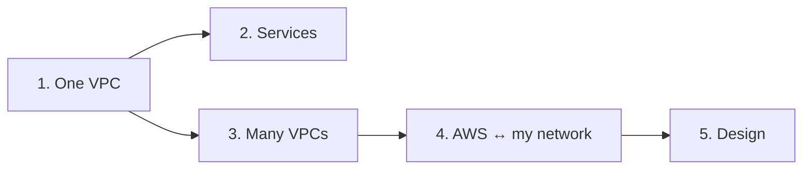

# AWS › Networking

> What this covers: every AWS networking note, in the order I'd study them. Each stage assumes the ones above it. The vendor-neutral concept behind each stage is listed first, so I know what to read in [[Networking]] before the AWS product.

Part of [[AWS]]. The general networking learning path is [[Networking]], whose section 9 ("Applied: cloud networking") points back here.

## The map



## 1. One VPC: where things live

Read first in Networking: [[IP addressing and subnetting]], [[Routing tables]], [[NAT and PAT]], [[ACL]].

- [[VPC]]: my private network. Subnets, route tables, internet gateway, NAT gateway, the console wizard
- [[Security groups]]: the stateful firewall on each network interface, and how it differs from NACLs
- [[VPC IP address planning]]: choosing every VPC's CIDR from a company-wide plan. AWS's rules (`/16`–`/28`, 5 reserved per subnet, no resizing), one block per environment, a standard subnet layout, AWS IPAM pools, EKS pod ranges. Builds on [[IP address planning]]
- [[Bastion host]]: reaching instances in private subnets (and the alternatives: Session Manager, EC2 Instance Connect Endpoint)

## 2. Services inside AWS: names and traffic

Read first in Networking: [[DNS]], [[DNS in production]], [[Load balancing]], [[Reverse proxy]], [[Proxies]], [[Service discovery]].

- [[Route 53]]: DNS as a service. Delegation, Alias vs CNAME, private hosted zones, health checks and failover, routing policies, Resolver endpoints for hybrid DNS, DNSSEC
- [[Proxies, load balancing and discovery in AWS]]: ALB, NLB, GWLB, CloudFront, API Gateway, Global Accelerator, Cloud Map, Service Connect, VPC Lattice, egress control, each mapped to its general concept
- Related, filed under Compute: [[Load balancers]] (ALB/NLB setup, target groups, health checks)
- Related, filed under Security: [[AWS WAF]] (Layer 7 filtering)

## 3. Many VPCs: the transit gateway

Read first in Networking: [[Routing tables#What a route can point at]], [[Policy-based routing]] (VRFs), [[Network interfaces]].

- [[Connecting VPCs]]: peering vs transit gateway in the console, why peering isn't transitive
- [[Transit gateway]]: why one VGW per VPC stops scaling, the TGW as a regional core router, what it is and isn't (connectivity vs routing), segmentation, ECMP, inspection VPC and appliance mode, peering, Connect
- [[Transit gateway attachments]]: what an attachment is from a networking view (a managed interface, not a protocol, no IP or MAC), what each type runs underneath, why AWS built the TGW around them, the interface/VRF analogy
- [[Transit gateway routing]]: the two routing decisions (VPC table → TGW table), attach vs associate vs propagate, which side is automatic, a packet traced through every table, static vs propagated, segmentation designs, keeping VPC routes short with 50 networks

## 4. AWS ↔ my own network: hybrid connectivity

Read first in Networking: [[VPN]], [[Types of VPN]], [[IPsec and IKE]], [[AS and BGP]].

- [[Site-to-Site VPN]]: customer gateway, virtual private gateway, two tunnels, static vs BGP, route propagation, CloudHub, limits, the "tunnel UP but nothing works" checklist
- [[BGP in AWS hybrid networking]]: BGP carries routes, not traffic. Office → BGP → VPN attachment → propagation → TGW table, what BGP never does (VPC routes), BGP vs propagation, failover between tunnels, static vs BGP
- [[Direct Connect]]: a private physical link. Dedicated vs hosted, private/transit/public VIFs, Direct Connect gateway, VPN as backup, resilience, encryption, reaching one instance
- [[Connecting AWS to a private network]]: when the managed VPN isn't possible. Eight workarounds (EC2 as a VPN router, dial-out, mesh, SSH, connectors…) and where each breaks

## 5. Designing it

Read first in Networking: [[Nested VPNs]], [[Overlapping address spaces]].

- [[Hybrid connectivity architectures]]: the problems in the order they show up (many VPCs, bandwidth, failover, overlapping ranges, DNS, a client network that's already a chain of VPNs, inspection, multi-region) and the AWS design for each

## Which note answers…

| Question | Note |
|---|---|
| Why can't my private instance reach the internet? | [[VPC]] (NAT gateway, route tables) |
| Allowed or blocked: security group or NACL? | [[Security groups]] |
| Which CIDR should this new VPC get? | [[VPC IP address planning]] |
| Why can't VPC A reach VPC C through VPC B? | [[Connecting VPCs]] (no transitive peering) |
| I attached the VPC, why doesn't traffic flow? | [[Transit gateway routing#Which side is automatic?]] |
| What is an attachment, really? Does it have an IP? | [[Transit gateway attachments#Is an attachment a network interface?]] |
| How do I keep prod and dev apart on one TGW? | [[Transit gateway routing#Stage 6: several route tables, and segmentation]] |
| 50 networks: do I need 50 routes in every VPC? | [[Transit gateway routing#Stage 7: 50 networks, and the VPC side gets long]] |
| Tunnels are UP but nothing works | [[Site-to-Site VPN#Stage 2: the tunnels are UP but nothing works]] |
| BGP vs propagation? | [[BGP in AWS hybrid networking#Stage 6: BGP vs propagation, side by side]] |
| VPN or Direct Connect? | [[Direct Connect]], [[Hybrid connectivity architectures#Problem 2: the VPN is too slow]] |
| Branches reach HQ by VPN, only HQ reaches AWS | [[Hybrid connectivity architectures#Problem 6: the client network is already a chain of VPNs]] |
| My range overlaps the office or a partner | [[Hybrid connectivity architectures#Problem 4: overlapping address ranges]] |
| The office can't resolve AWS private names | [[Route 53#Stage 6: the office and the VPC need each other's names]] |
| The company admin won't set up a VPN | [[Connecting AWS to a private network]] |
| How do I get into a private instance? | [[Bastion host]] |

## Not written yet
- *[[VPC endpoints and PrivateLink]]*: gateway vs interface endpoints, exposing a service across VPCs without routing
- *[[AWS Network Firewall]]*: the firewall in the inspection VPC
- *[[VPC Flow Logs]]*: what got accepted or rejected, and where
- *[[AWS Client VPN]]*: remote access into a VPC
- *[[AWS Cloud WAN]]*: multi-region routing with a global policy
- *[[CloudFront]]*: CDN in front of S3 and load balancers
- *[[VPC Lattice]]*: service-to-service networking (an open question in [[AWS]])

## Weakest first
```dataview
TABLE WITHOUT ID file.link AS Note, type AS Type, confidence AS Conf
FROM ""
WHERE subtopic = this.file.name AND confidence
SORT confidence ASC
```
