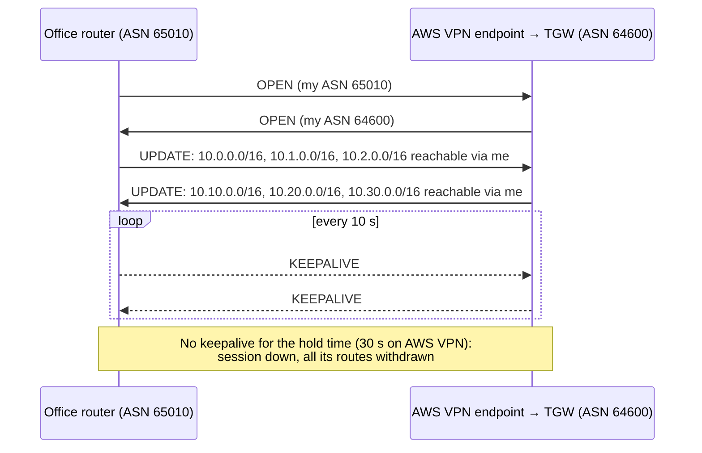
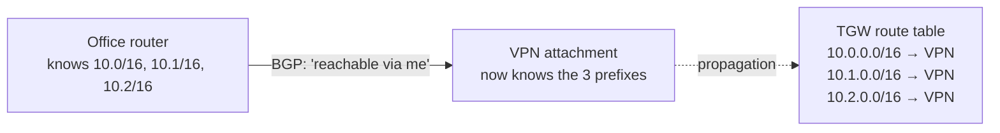
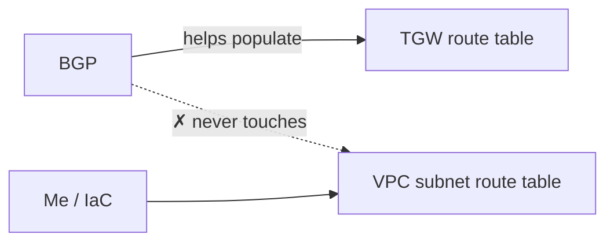
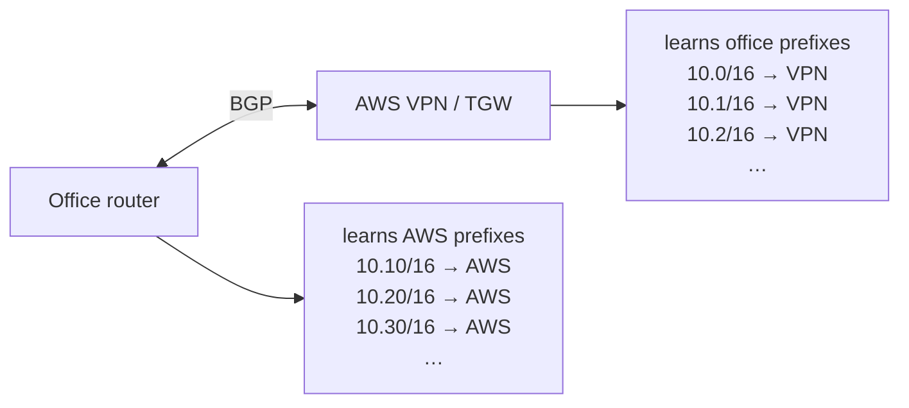
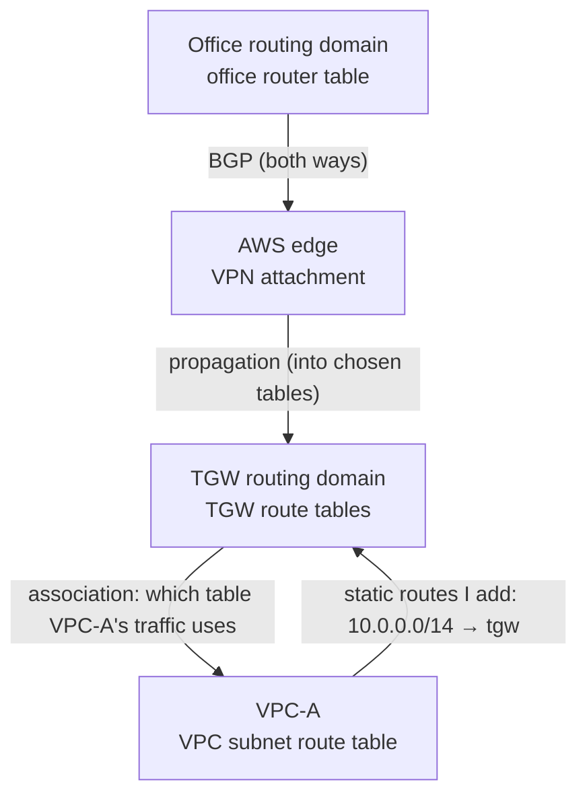
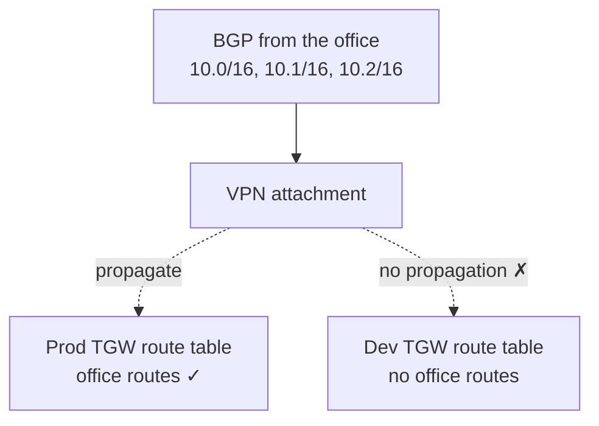
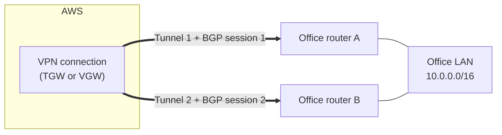
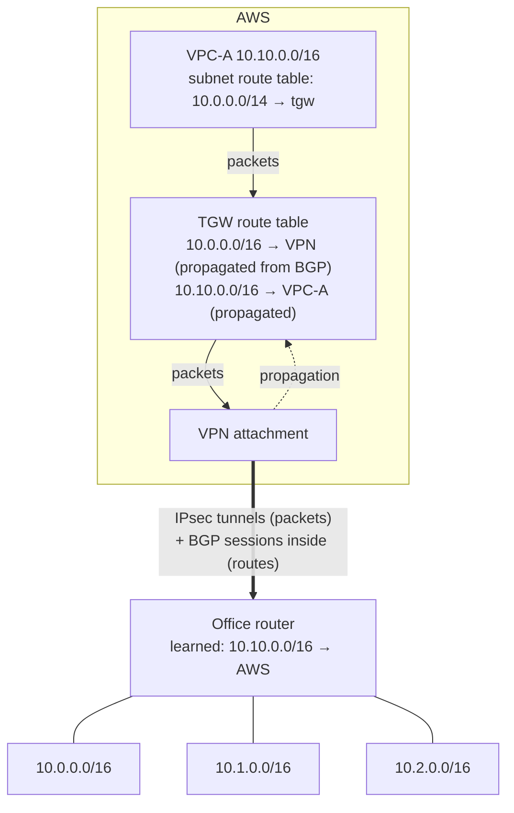

# BGP in AWS hybrid networking

> [!abstract] In one sentence
> Over a Site-to-Site VPN or Direct Connect, BGP is a conversation between my router and AWS where each side says **"these prefixes are reachable through me"**; it carries **routing information, not traffic**, and on a transit gateway those learned routes reach the TGW route tables through **propagation**, while the VPC route tables still have to be set by me.

What BGP is in general (autonomous systems, ASNs, why not OSPF between organisations) is in [[AS and BGP]]. How the TGW's own tables work is in [[Transit gateway routing]]. This note connects the two: where BGP sits in an AWS hybrid network, what it automates, and what it doesn't.

## Common misconceptions

| Wrong mental model | What's actually true |
|---|---|
| "BGP carries my traffic to AWS" | BGP only exchanges **routes**. The application packets travel through the IPsec tunnels (or the Direct Connect link). BGP is the control plane, the tunnel is the data plane |
| "With BGP, everything is automatic" | BGP fills my router's table and (through propagation) the TGW route tables. It **never** touches VPC subnet route tables |
| "BGP and route propagation are the same thing" | BGP exchanges routes **between two routing domains** (my network ↔ AWS). Propagation **installs** routes an attachment knows into a TGW route table. One feeds the other |
| "If BGP learns the routes, TGW route tables don't matter" | BGP says what **exists**. TGW route tables decide **who may use it**: I can propagate the office routes into Prod's table and not into Dev's |
| "Every TGW attachment speaks BGP" | Only VPN (dynamic), Direct Connect and Connect attachments. A VPC attachment has no BGP session: AWS already knows the VPC's CIDR and propagates it |

## What BGP actually does

BGP is a protocol for exchanging one kind of statement: **"these IP prefixes are reachable through me"**.

The office router knows its networks:

```text
Office networks
10.0.0.0/16
10.1.0.0/16
10.2.0.0/16
```

Over the VPN, it opens a BGP session with AWS (inside the tunnel, between the `169.254.x.x` addresses of the tunnel's inside `/30`) and **announces** them:



What's exchanged is **prefixes plus attributes** (AS path, MED…), never application data. The SSH session from `10.0.1.20` to an EC2 instance goes through the IPsec tunnel like any packet; BGP just made sure both routers knew where to send it.

## Build-up: the office, the TGW and VPC-A

**Setup.** Office `10.0.0.0/16`, `10.1.0.0/16`, `10.2.0.0/16` behind a router with ASN `65010`. A [[Site-to-Site VPN]] with dynamic (BGP) routing to TGW `tgw-0dd` (ASN `64600`). VPC-A `10.10.0.0/16`, later VPC-B `10.20.0.0/16`, VPC-C `10.30.0.0/16`.

### Stage 1: where the office routes come from

Earlier ([[Transit gateway routing#Stage 3: let propagation fill the TGW side]]) the TGW route table "learned" `10.0.0.0/16 → VPN attachment` by propagation. Propagation can only install what the attachment knows. For a VPN attachment, that knowledge **comes from BGP**:



The chain: **BGP → the VPN attachment learns the office prefixes → propagation → TGW route table**. Nobody types `10.0.0.0/16 → VPN attachment`. And when the office adds `10.3.0.0/16` and announces it, it appears in the TGW table on its own.

With a **static** VPN this chain doesn't exist: the attachment has nothing to propagate, and I type the TGW routes myself.

### Stage 2: what BGP doesn't do: the VPC route table

The TGW now knows the way to the office. VPC-A doesn't:

```text
VPC-A subnet route table (before)
10.10.0.0/16      local
0.0.0.0/0         nat-0ee
```

An instance sending to `10.0.1.20` matches only `0.0.0.0/0` and goes to the NAT gateway, where it dies. VPC-A needs:

```text
VPC-A subnet route table (after)
10.10.0.0/16      local
10.0.0.0/14       tgw-0dd        ← the office's 10.0–10.3 (or a bigger summary from the plan)
0.0.0.0/0         nat-0ee
```



BGP's reach ends at the TGW. The VPC side is configured exactly as described in [[Transit gateway routing#Which side is automatic?]], and kept short with summaries from the [[VPC IP address planning|address plan]].

### Stage 3: one packet, AWS → office

EC2 `10.10.1.50` in VPC-A → office server `10.0.1.20`:

| Step | Where | Decision | Where the route came from |
|---|---|---|---|
| 1 | VPC-A subnet route table | `10.0.0.0/14 → tgw-0dd` | **Me** |
| 2 | TGW route table associated with VPC-A's attachment | `10.0.0.0/16 → VPN attachment` | **BGP** from the office router, then **propagation** |
| 3 | VPN attachment | Encrypts into the IPsec tunnel | The tunnel ([[IPsec and IKE]]) |
| 4 | Office router | Decrypts, routes to `10.0.1.20` on its LAN | Its own connected routes |

And the reply needs the opposite direction to work, which is Stage 4.

### Stage 4: the other direction: the office learns AWS

BGP runs both ways. AWS announces the VPC prefixes to the office router:

| AWS side | What it announces to my router |
|---|---|
| **Virtual private gateway** | The VPC's CIDR (and, with CloudHub, the other sites' prefixes) |
| **Transit gateway** | The routes in the TGW route table **associated with the VPN attachment** |

So the office router learns, with no static route typed:

```text
Office router table (learned by BGP)
10.10.0.0/16 → AWS tunnel
10.20.0.0/16 → AWS tunnel
10.30.0.0/16 → AWS tunnel
```

Without BGP, someone maintains `10.10/16 → VPN`, `10.20/16 → VPN`, `10.30/16 → VPN`… on the office router, and again on every change.

### Stage 5: 50 networks, and networks that come and go



When **VPC-D** `10.40.0.0/16` is created and attached:
1. Its attachment propagates `10.40.0.0/16` into the TGW table associated with the VPN attachment
2. The TGW announces it to the office over BGP
3. The office router learns `10.40.0.0/16 → AWS` and its LAN can reach it

Nothing changes on the office router's configuration. The only manual piece left is VPC-D's own route table (`10.0.0.0/14 → tgw`), and with a good address plan that's a standard line in the VPC module.

With 50 prefixes, a static setup means 50 routes on each side and a ticket for every change. With BGP, it's one session configuration, and the tables follow the network. Watch the limits though: a VGW accepts **100** prefixes from my router, a TGW VPN attachment 1 000. Summaries keep both sides small.

### Stage 6: BGP vs propagation, side by side

| | BGP | Route propagation |
|---|---|---|
| Question it answers | "How do two **routing domains** exchange routes?" | "How do routes an **attachment** knows get into a **TGW route table**?" |
| Between | My router ↔ AWS (VGW or TGW) | An attachment → one or more TGW route tables |
| Configured on | Both routers (ASNs, neighbours, what to announce) | The TGW route table (create propagation) |
| Runs for | VPN (dynamic), Direct Connect, Connect attachments | Every attachment type that has routes: VPC, VPN, DX, Connect |
| What it automates | Learning the other side's prefixes, and failover | Filling TGW route tables |

They chain: **office → BGP → VPN attachment → propagation → TGW route table**. BGP is the route-learning mechanism; propagation makes what was learned available where I choose.

### Stage 7: several routing domains, each with its own job



| Domain | Filled by | Decides |
|---|---|---|
| Office router table | Its own networks + BGP from AWS | Which office traffic enters the tunnel |
| VPN attachment | BGP from the office | What the TGW *could* know about the office |
| TGW route tables | Propagation (+ static routes) | Which attachment gets a packet, and **who may reach what** |
| VPC subnet route table | Me / IaC | Which VPC traffic goes to the TGW at all |

### Stage 8: BGP doesn't replace TGW route tables

BGP tells the TGW what exists behind the office. Whether a VPC can **use** it is still the TGW's policy:



The office's prefixes are propagated into Prod's table, not Dev's: Prod reaches the office, Dev has no route there, even though BGP learned the same prefixes for both. And on the way back, what the office learns is only what's in the table associated with the VPN attachment: if Dev isn't propagated there, the office never even hears of Dev's CIDR. Segmentation stays a TGW decision ([[Transit gateway routing#Stage 6: several route tables, and segmentation]]).

### Stage 9: failover between the two tunnels

Every AWS VPN connection has two tunnels, each with its own BGP session. Often each tunnel ends on a different office router for device redundancy:



- **Both up**: both sessions announce `10.0.0.0/16`. A VGW uses one tunnel; a TGW with ECMP can use both
- **Tunnel 1 dies** (AWS maintenance, router A reboots, internet path breaks): its BGP session stops getting keepalives, after the hold time it's declared down and **its routes are withdrawn**. Only tunnel 2's routes remain, so traffic moves there, in both directions, without anyone changing a route
- **With static routing**: nothing is withdrawn. Failover depends on dead peer detection on my device and on whether it moves its static route, which many devices do badly

**Choosing the tunnel.** The side that **receives** routes chooses where to send traffic. To make AWS prefer tunnel 1 toward the office, my routers announce on tunnel 2 with a longer **AS path** (prepending `65010 65010 65010`) or a higher MED. To make the office prefer tunnel 1 toward AWS, my router sets a higher **local preference** on routes learned over tunnel 1. Keeping both directions on the same tunnel avoids asymmetric routing through stateful firewalls.

## Static vs BGP VPN

| | Static routing | Dynamic (BGP) |
|---|---|---|
| Office router | `10.10.0.0/16 → VPN`, `10.20.0.0/16 → VPN`, `10.30.0.0/16 → VPN`… typed | Learns AWS prefixes |
| AWS side | Static routes on the VPN connection (VGW) or TGW route table | Learns office prefixes; propagation fills TGW tables |
| New VPC / new office network | Edit both sides | Announced automatically |
| Tunnel failover | DPD + device behaviour | BGP withdraws the dead tunnel's routes |
| ECMP over several VPNs (TGW) | No | Yes |
| CloudHub between sites | No | Yes |
| Needs | Any IPsec device | A device that speaks BGP, ASNs on both sides |
| Good for | One small site, a few prefixes, a lab | Anything that grows, or needs real failover |

## The whole picture



The four concepts, each with one job:

| Concept | Job |
|---|---|
| **BGP** | "These networks exist behind me": exchanges prefixes between my network and AWS, and withdraws them on failure |
| **Propagation** | "Put that knowledge into these TGW route tables" |
| **VPC route table** | "Send traffic for those networks to the TGW" (mine to configure) |
| **TGW route table** | "Send it through the right attachment", and only for the attachments allowed to |

## BGP on Direct Connect

The same model, over a physical link instead of a tunnel. Each Direct Connect **virtual interface** is a BGP session ([[Direct Connect#Private VIF, transit VIF and the Direct Connect gateway]]):
- My router announces the office/data-centre prefixes; on a transit VIF they reach the TGW through the DX gateway attachment and propagation
- AWS announces what's allowed by the **allowed prefixes** on the DX gateway association, not every VPC CIDR individually
- For the same prefix over DX and VPN, AWS prefers DX; my side uses local preference to prefer DX outbound ([[Direct Connect#VPN as a backup for Direct Connect]])
- **BFD** speeds up failure detection, and AWS **BGP communities** let me tell AWS how widely to spread my prefixes and which path to prefer

## Advanced problems

| Symptom | Cause | Fix |
|---|---|---|
| Tunnels UP, BGP down | ASN mismatch, wrong neighbour IPs (inside `/30`), MD5/auth mismatch, firewall blocking TCP 179 inside the tunnel | Compare with the generated config; check `show bgp summary` on the device |
| BGP up, "0 routes" received by AWS | My router announces nothing (no `network` statements / redistribution, or a filter) | Announce the prefixes; check the export policy |
| AWS knows the office, the office doesn't know a VPC | The VPC isn't propagated into the table associated with the VPN attachment (TGW), or route propagation not attached (VGW) | Propagate it into the VPN's associated table |
| Prefixes missing on the AWS side | Over the limit (100 to a VGW, 1 000 to a TGW VPN), or longer than allowed | Summarise |
| Instance can't reach the office although BGP is perfect | VPC subnet route table has no route to the TGW | Add it: BGP never does |
| Traffic out on tunnel 1, back on tunnel 2, dropped | Asymmetric path through a stateful firewall | AS path prepend / MED toward AWS, local preference on my side |
| Failover takes ~30 s | BGP hold time | Expected on VPN; on DX use BFD |
| Office routes reach Dev that shouldn't | VPN propagated into Dev's TGW table | Remove that propagation |

## Practice

> [!example]- BGP over the VPN is Established and the TGW route table shows `10.0.0.0/16 → VPN (propagated)`. An instance in VPC-A still can't reach `10.0.1.20`. Most likely cause?
> VPC-A's subnet route table has no route sending `10.0.0.0/16` (or a summary) to the TGW. BGP and propagation only fill the TGW side.

> [!example]- Is the SSH traffic from `10.0.1.20` to `10.10.1.50` carried by BGP?
> No. It's carried inside the IPsec tunnel. BGP only told both routers where `10.0.0.0/16` and `10.10.0.0/16` are.

> [!example]- A new VPC is attached and propagated into every TGW table. Does the office learn it without anyone touching the office router?
> Yes, if it's propagated into the table associated with the VPN attachment: the TGW announces that table's routes over BGP.

> [!example]- How do I make AWS send office-bound traffic through tunnel 1 rather than tunnel 2?
> Make the routes my router announces on tunnel 2 less attractive: AS path prepending (or a higher MED). AWS picks the shorter path, tunnel 1.

> [!example]- Which TGW attachments run BGP, and how does a VPC attachment get its route into the TGW then?
> VPN (dynamic), Direct Connect gateway and Connect attachments. A VPC attachment has no BGP: AWS knows the VPC's CIDRs and propagates them.

## Easy to get wrong
- Thinking BGP carries traffic: it carries routes, the tunnel carries traffic
- Expecting BGP to add VPC routes
- Confusing BGP (between routing domains) with propagation (into TGW tables)
- Forgetting that what the office learns from a TGW is the VPN attachment's **associated** table
- Using BGP but configuring only one tunnel: no failover partner
- Asymmetric routing over the two tunnels
- Announcing every small prefix and hitting the 100-route limit on a VGW
- Thinking a static VPN gets propagated routes on a TGW

## Related
- Concepts:: [[AS and BGP]], [[Routing tables]], [[IPsec and IKE]], [[VPN]]
- AWS:: [[Transit gateway attachments]], [[Site-to-Site VPN]], [[Transit gateway routing]], [[Transit gateway]], [[Direct Connect]], [[VPC IP address planning]], [[Hybrid connectivity architectures]]
- Problems:: [[Nested VPNs]] (BGP across chained VPNs)

## Flashcards
#flashcards

What does BGP exchange? :: Prefixes ("these networks are reachable through me") plus attributes, never application traffic
Over an AWS VPN, what carries the packets and what carries the routes? :: Packets: the IPsec tunnel. Routes: the BGP session running inside it
Chain from an office prefix to a TGW route table? :: Office router announces it over BGP → VPN attachment learns it → propagation → TGW route table
Does BGP add routes to VPC subnet route tables on a TGW design? :: No. Only the TGW side. VPC routes to the TGW are mine to add
What does a transit gateway announce to the office over BGP? :: The routes in the TGW route table associated with the VPN attachment
What does a virtual private gateway announce over BGP? :: The VPC's CIDR (plus other sites' prefixes with CloudHub)
BGP vs route propagation? :: BGP exchanges routes between routing domains (my router ↔ AWS). Propagation installs an attachment's routes into TGW route tables
Why do TGW route tables still matter with BGP? :: BGP says what exists; TGW tables decide which attachments may use it (e.g. office routes in Prod's table, not Dev's)
Which TGW attachments use BGP? :: VPN (dynamic), Direct Connect gateway, Connect. Not VPC attachments
How does BGP give failover between the two VPN tunnels? :: Each tunnel has a session; when one dies its routes are withdrawn after the hold time and traffic uses the other
AWS VPN BGP timers? :: Keepalive 10 s, hold time 30 s
How do I make AWS prefer one tunnel toward my office? :: Announce on the other tunnel with AS path prepending or a higher MED
How do I make my office prefer one tunnel toward AWS? :: Higher local preference on routes learned over that tunnel
Static vs BGP VPN when a new VPC is added? :: Static: edit routes on both sides. BGP: the TGW announces it automatically (if propagated into the VPN's associated table)
Max prefixes my router can announce to a VGW vs a TGW VPN attachment? :: 100 vs 1 000
What port does BGP use, and where does it run on an AWS VPN? :: TCP 179, between the tunnel's inside 169.254.x.x addresses
