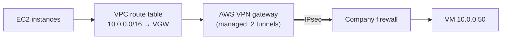
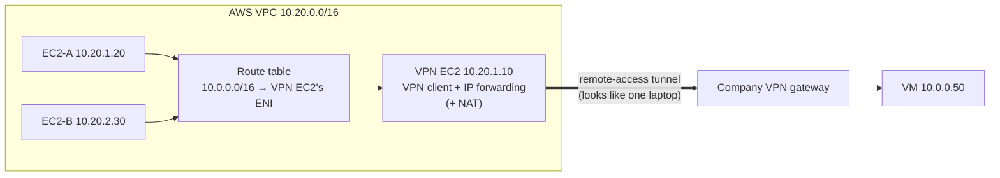
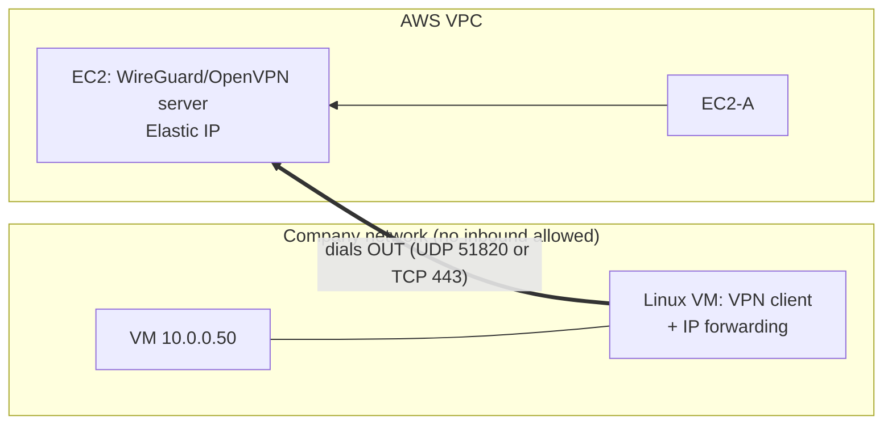
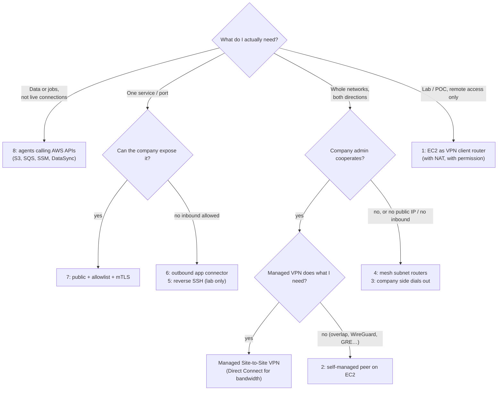

# Connecting AWS to a private network

> [!abstract] The short answer
> The "proper" way is a managed **Site-to-Site VPN** (or Direct Connect). But there are at least eight other ways to get packets, or just data, between a VPC and a private network. Each one answers four questions differently: **who ends the tunnel on the AWS side, how AWS instances' packets reach it, how replies get back, and who is allowed to initiate.** Working out why each one breaks teaches me more about networking than the official path does.

This note is for learning. Most of these are hacks, and the point is to understand *why* they work and *where* they stop working.

## The setup

| | |
|---|---|
| AWS VPC | `10.20.0.0/16`, instances `10.20.1.20`, `10.20.2.30`… |
| Company network | `10.0.0.0/16`, the VM with the data at `10.0.0.50` |
| Company VPN gateway | A firewall with a public IP that runs a **remote-access VPN** for employees' laptops |

**The constraint that makes it interesting:** I'm not the one who administers the company firewall, or it only offers remote access, or I just want to see what's possible without the AWS managed VPN.

## The baseline: managed Site-to-Site VPN



It needs the **company firewall admin** to configure an IPsec peer, and the company side must be reachable on UDP 500/4500. Everything else in this note is a way around one of those two requirements. Details: [[Site-to-Site VPN]], [[IPsec and IKE]], and why there's a gateway on each side: [[VPN#Site-to-site vs remote access: where does the tunnel end?]].

---

## Workaround 1: an EC2 instance as a "VPN client router"

**The idea.** A laptop can join the company network with the remote-access VPN. An EC2 instance can do the same thing. Then I make that instance a **router** for the rest of the VPC.



A packet `10.20.1.20 → 10.0.0.50`:
1. EC2-A's subnet route table says `10.0.0.0/16 → eni-of-VPN-EC2`. EC2-A itself knows nothing: **no config on the other instances**, the route table does it for every subnet it's associated with
2. The VPC delivers the packet to the VPN EC2, **even though the destination isn't the instance's own IP**. By default AWS drops that: I have to turn off **source/destination check**
3. The VPN EC2's Linux kernel sees a packet that isn't for it. With **IP forwarding** on, it routes it: `10.0.0.0/16 dev tun0`
4. The VPN client encrypts it into the tunnel. The company gateway decrypts it and routes it to the VM

### Setting it up

```bash
# on my machine: let the instance forward packets that aren't its own
aws ec2 modify-instance-attribute --instance-id i-0abc --no-source-dest-check

# point the company range at the instance's network interface
aws ec2 create-route --route-table-id rtb-0123 \
  --destination-cidr-block 10.0.0.0/16 --network-interface-id eni-0456

# on the VPN EC2
sudo sysctl -w net.ipv4.ip_forward=1        # route between eth0 and tun0
# connect the VPN client (openvpn / openconnect / wg-quick…)
```

Plus the **security group** of the VPN EC2 must allow the traffic coming *from* the other instances (it's forwarded traffic, but the SG still sees it as inbound to that ENI).

### The real problem: how do replies come back?

The VM answers `10.0.0.50 → 10.20.1.20`. The company network has **no idea** where `10.20.0.0/16` is. A remote-access VPN is built for **one host**: the gateway gave my EC2 one tunnel IP (say `10.99.0.42`) and only routes that single address back through the tunnel.

Two ways out:

| | **Option A: NAT on the VPN EC2** | **Option B: a route on the company side** |
|---|---|---|
| How | Masquerade: everything leaving `tun0` takes the EC2's tunnel IP `10.99.0.42` | The company gateway learns `10.20.0.0/16 → this client` (OpenVPN `iroute`, WireGuard `AllowedIPs`, a static route on the firewall) |
| Needs the company admin? | ❌ No | ✅ Yes |
| Company → AWS connections | ❌ Impossible: nothing on the company side can reach `10.20.x.x` | ✅ Works both ways |
| Company logs show | One "user" doing everything | The real AWS source IPs |

```bash
# Option A on the VPN EC2
sudo iptables -t nat -A POSTROUTING -o tun0 -j MASQUERADE
```

And if I can get Option B, I'm already talking to the company admin, which means I could just ask for a real site-to-site VPN. That's the first hint this is a workaround and not a design.

### Limits

| Limit | Why it happens | What it means in practice |
|---|---|---|
| **Single point of failure** | One instance in one AZ. VPC route tables don't health-check their targets | Instance reboots, AZ outage, or the VPN client crashes → the whole VPC loses the company network. HA means two instances in two AZs + a script/Lambda that **rewrites the route** when one dies. Existing connections break during failover |
| **It borrows a person's identity** | Remote-access VPNs authenticate **users**: SSO, MFA, posture checks | The link dies when the password rotates, MFA asks for a push, the session times out after 12 h, or that employee leaves. And it's usually against the company's acceptable use policy: to their security team it's an unapproved bridge into the network (shadow IT) |
| **One-way only** (with NAT) | Everything hides behind one tunnel IP | The company can't initiate anything to AWS: no callbacks, no monitoring from on-prem, no AD talking to AWS |
| **No real audit trail** | NAT collapses every instance into one IP | The company firewall can't tell which instance did what |
| **It's a pivot point** | The instance sits in both networks | Whoever compromises it is inside the company network, and the company network (via this box) is one hop from the VPC. It must be hardened like a firewall, because it *is* one |
| **Bandwidth** | One tunnel = one UDP flow, and AWS caps a **single flow at ~5 Gbps** (less to the internet). OpenVPN is mostly single-threaded | Often a few hundred Mbps with OpenVPN, more with WireGuard. The managed VPN gives ~1.25 Gbps per tunnel |
| **Only reaches what the route tables reach** | Only subnets whose route table has the `→ ENI` route use it | **Peered VPCs can't use it**: AWS doesn't allow "edge-to-edge" routing through a peering (see [[Connecting VPCs]]). For several VPCs I need a transit gateway with the appliance VPC (and **appliance mode** to keep flows symmetric) |
| **Overlapping ranges** | If the company also uses `10.20.0.0/16` somewhere | Routes collide: NAT on the EC2 helps one way only → [[Overlapping address spaces]] |
| **MTU** | Tunnel headers eat into 1500 (and the VPC's 9001 jumbo frames can't cross it) | Big transfers hang → clamp MSS on the VPN EC2 (see [[VPN]]) |
| **DNS** | Instances use the VPC resolver, which doesn't know `corp.example.com` | Route 53 Resolver **outbound endpoint** + a forwarding rule to the company DNS server, routed through the VPN EC2 (see [[Route 53]]) |
| **Outer tunnel needs internet** | The VPN client must reach the company's public IP | Instance in a public subnet with an Elastic IP, or a private subnet behind a NAT gateway |
| **Operations** | It's my server now | Patching, monitoring, VPN client updates, certificate expiry, logs. Everything the managed service did for me |

> [!tip] What this teaches me
> A VPN gateway is just a **router that also terminates a tunnel**. The only magic in the managed one is HA, monitoring, and that it's configured as a *network* link (both sides route to each other) instead of a *user* link.

**When it's reasonable:** a lab, a proof of concept, a temporary migration bridge, or reaching a network that truly only offers remote access, with the owner's permission.

---

## Workaround 2: EC2 as a self-managed site-to-site peer

Same box, but instead of pretending to be a laptop, the EC2 instance runs **strongSwan** (IPsec) or **WireGuard** and peers with the company firewall **as a gateway**. Both sides route each other's ranges, so it's two-way with no NAT.

- **Needs** the company admin (they configure a peer), so it doesn't dodge the politics
- **Why do it anyway:** features the managed VPN lacks: NAT *inside* the tunnel for overlapping ranges, GRE or VXLAN over IPsec, a routing protocol other than BGP, custom algorithms, more than two tunnels, or a WireGuard peer (the managed VPN only does IPsec)
- **Limits:** everything operational from workaround 1 (HA, bandwidth, patching, peering can't use it). Only the identity and one-way problems disappear

Productized version of the same idea: a vendor's virtual firewall or SD-WAN appliance from the Marketplace, attached with **Transit Gateway Connect** (see [[Types of VPN]]).

---

## Workaround 3: flip the direction, the company side dials out

**The problem it solves:** the company side has **no public IP** (behind CGNAT) or its firewall blocks all **inbound** traffic. Nothing in AWS can start a tunnel to it.

**The idea:** put the tunnel server in **AWS** and a small client **inside the company network** (a Linux VM next to the data). The client dials **out**, which almost every firewall allows. Once the tunnel is up, traffic flows both ways inside it.



- Routing on the AWS side is the same as workaround 1 (route table → server ENI, source/dest check off)
- On the company side, either the other company machines route `10.20.0.0/16` to the client VM (needs someone to add a route) or the client VM NATs, making it one-way again
- **With AWS Client VPN** as the server instead of my own EC2: it works for "company → AWS", but Client VPN **doesn't allow connections initiated from the VPC to clients**, so AWS can't reach the VM. Client VPN is built for users, not networks
- **Limits:** it's still a personal box bridging a corporate network. The tunnel drops whenever the company's egress firewall resets long-lived connections, so keepalives are mandatory

---

## Workaround 4: a mesh overlay with subnet routers

**The idea:** Tailscale / Netbird / ZeroTier. Put a **subnet router** node in the VPC and one in the company network. Both dial **out** to the coordination server, then connect directly with NAT hole punching (see [[Types of VPN]], stage 5).

- **Solves:** no public IP needed on *either* side, no inbound ports, ACLs by identity instead of IPs, and I can add more sites or laptops later without redesigning anything
- **Same AWS rules apply:** the VPC subnet router needs source/dest check off and route table entries to its ENI
- **Limits:**
  - A third-party control plane now decides who can reach the company network (or self-host Headscale)
  - Subnet routers **SNAT by default**, so the far side sees the router's IP, the same audit problem as workaround 1 (can be turned off, then real routes are needed)
  - If hole punching fails (hard NAT on the company side), traffic goes through relays: encrypted but slower
  - HA: several subnet routers can advertise the same range, with failover handled by the mesh, which is better than the route-table-rewrite script of workaround 1

---

## Workaround 5: SSH tunnels, one port at a time

When I only need **one service** (the database on the VM, port 5432), I don't need to route networks at all.

```bash
# from inside the company network: publish the VM's 5432 on an AWS bastion
ssh -N -R 5432:10.0.0.50:5432 ec2-user@bastion.example.com
# → apps in AWS connect to bastion:5432 and land on 10.0.0.50:5432

# or, from AWS, through a company jump host
ssh -N -L 5432:10.0.0.50:5432 me@jump.corp.example.com
```

- `-R` (remote forward) is the "dial out" trick again: the company machine starts the connection, AWS gets a port
- For `-R` to be reachable by *other* instances, the bastion needs `GatewayPorts yes` in `sshd_config` (otherwise it listens on localhost only)
- **Limits:** TCP only, one port per forward, no routing, TCP-over-TCP slowdowns on bad links, dies silently unless supervised (`autossh`, a systemd unit with `Restart=always`), and again a personal key bridging two networks
- See [[Bastion host]] and [[IPsec vs TLS vs WireGuard vs SSH]]

---

## Workaround 6: an outbound-only app connector (ZTNA style)

**The idea:** a connector next to the VM (Cloudflare Tunnel, Zscaler, ngrok-style tools) keeps an **outbound** connection open to a provider's edge. AWS reaches the app through the provider, which checks identity on every request.

- Per **application**, not per network: nothing else on the company network is exposed. It's stage 4 of [[Types of VPN]] applied to machine-to-machine traffic
- AWS-side callers authenticate with a service token or a client certificate ([[mTLS]])
- **Limits:** best for HTTP. Raw TCP works with client-side helpers, UDP less so. Traffic goes through a third party. Latency via the provider's edge

---

## Workaround 7: expose the one service publicly, locked down

No tunnel at all. The company publishes the service on a public IP and restricts it hard:
- **IP allowlist**: only the AWS side's egress IP. Instances in private subnets leave through a **NAT gateway**, whose **Elastic IP** is stable and can be allowlisted (see [[VPC]])
- **[[mTLS]]**: the service requires a client certificate issued by a private CA, so an allowlisted IP alone isn't enough
- **Limits:** needs a public IP and an inbound firewall rule on the company side (the thing I was trying to avoid), the service is on the internet (scanned all day, DDoS-able), and every service needs its own exposure

---

## Workaround 8: don't connect the networks, move the data

Often the real need isn't "packets between networks" but "the data on that VM must get to AWS" (or instructions must get to the VM). Then an **agent on the company side calls AWS APIs over outbound HTTPS**, and no network link exists at all:

| Need | Outbound-only way |
|---|---|
| Files → AWS | Agent/script uploads to **S3** (or **DataSync** agent, **Storage Gateway**) |
| AWS asks the VM to do things | VM polls **SQS**, or runs the **SSM agent** as a hybrid managed node (run commands, patching, Session Manager) |
| Run containers on company hardware managed from AWS | **ECS Anywhere** / **EKS Hybrid Nodes** |

- **Solves:** no routes, no overlapping IP problems, no tunnel to keep up, IAM decides access (see [[IAM]])
- **Limits:** asynchronous. It can't replace a live connection (a database query, a legacy protocol). Credentials for the agent have to live on the company machine (IAM Roles Anywhere with a certificate is the clean way, see [[Workload identity (SPIFFE)]])

---

## Side by side

| # | Approach | Who initiates | Needs company admin? | Two-way? | Scope | HA | Main limit |
|---|---|---|---|---|---|---|---|
| — | **Managed Site-to-Site VPN** | Either | ✅ | ✅ | Networks | ✅ Built in (2 tunnels) | Needs the admin and a reachable public IP |
| 1 | EC2 as VPN client router | AWS | ❌ (with NAT) | ❌ with NAT | Networks → one host identity | ❌ DIY | Borrowed user identity, SPOF |
| 2 | EC2 as self-managed IPsec/WG peer | Either | ✅ | ✅ | Networks | ❌ DIY | I run a VPN gateway now |
| 3 | Company side dials out | Company | Partly (routes) | ✅ inside the tunnel | Networks | ❌ DIY | Personal bridge, egress firewall resets |
| 4 | Mesh subnet routers | Both, outbound | ❌ | ✅ | Networks, identity ACLs | ✅ Multiple routers | Third-party control plane, SNAT |
| 5 | SSH tunnels | Either | ❌ | One port | One port | ❌ | TCP only, fragile |
| 6 | Outbound app connector | Company | ❌ | Caller → app | One app | ✅ Provider | HTTP-first, third party |
| 7 | Public + allowlist + mTLS | AWS | ✅ | Caller → app | One service | Depends | Service on the internet |
| 8 | Move data, not packets | Company | ❌ | Async | Data / jobs | ✅ AWS managed | Not a live connection |

## Choosing



## Easy to get wrong
- Forgetting **source/destination check**: the route points to the instance, packets arrive, AWS drops them, and nothing logs why
- Forgetting the **return path**: AWS → company works in the first test (a ping gets NATed), then company → AWS fails
- Expecting a **peered VPC** to use my EC2 router: AWS blocks edge-to-edge routing through peering
- Thinking a route table fails over by itself: an `→ ENI` route to a dead instance is a **blackhole** until something rewrites it
- Using an employee's VPN account for a server: it will break on MFA, password rotation or offboarding, and it bypasses the company's security team
- Assuming AWS Client VPN lets the VPC reach clients: connections from the VPC side to clients aren't supported
- Building a network link when the need was moving files

## Related
- Concepts:: [[VPN]], [[Types of VPN]], [[IPsec and IKE]], [[Routing tables]], [[Network layers]]
- AWS:: [[Site-to-Site VPN]], [[Transit gateway]], [[Direct Connect]], [[Hybrid connectivity architectures]], [[VPC]], [[Connecting VPCs]], [[Security groups]], [[Route 53]], [[Bastion host]], [[EC2]], [[IAM]]
- Problems:: [[Overlapping address spaces]]
- Alternatives by protocol:: [[IPsec vs TLS vs WireGuard vs SSH]], [[mTLS]]

## Flashcards
#flashcards

The four questions every AWS ↔ private network design answers? :: Who ends the tunnel on the AWS side, how instances' packets reach it, how replies come back, who may initiate
How do other EC2 instances use an EC2 VPN router without config? :: The subnet route table sends the company range to the router's ENI
What must be disabled on an EC2 instance that forwards traffic? :: Source/destination check (plus IP forwarding in the OS)
Why does an EC2 on a remote-access VPN need NAT to serve the VPC? :: The company gateway only routes the one tunnel IP it gave the client back into the tunnel
What breaks when the EC2 VPN router uses NAT? :: The company can't initiate connections to AWS, and every instance looks like one user in the logs
Why does a VPN client EC2 break over time? :: It uses a person's identity: MFA, password rotation, session timeouts, offboarding
Can a peered VPC use my EC2 VPN router? :: No, AWS blocks edge-to-edge routing through peering. Use a transit gateway (with appliance mode)
Do VPC route tables fail over when the target instance dies? :: No. The route blackholes until something (a script, Lambda) rewrites it
Single-flow bandwidth limit that caps a self-managed tunnel? :: About 5 Gbps per flow, and a tunnel is one flow
When use a self-managed IPsec/WireGuard peer on EC2 instead of the managed VPN? :: Need features it lacks: NAT inside the tunnel, GRE/VXLAN, WireGuard, custom routing
How do you connect when the company side allows no inbound traffic? :: The company side dials out: a VPN client in the company network, a mesh subnet router, reverse SSH, or an app connector
Why doesn't AWS Client VPN work for AWS → on-prem traffic? :: Connections initiated from the VPC to clients aren't supported
What does ssh -R do in this context? :: A company machine publishes a company port on the AWS bastion by dialing out
Why is GatewayPorts needed for a reverse SSH tunnel used by other instances? :: Without it, the forwarded port only listens on the bastion's localhost
How do you allowlist AWS instances in private subnets on a company firewall? :: Their traffic leaves through a NAT gateway, allowlist its Elastic IP (+ mTLS)
When is "no network link at all" the right answer? :: When the need is moving data or jobs: agents call S3/SQS/SSM over outbound HTTPS
DNS problem with any AWS → company link, and the fix? :: The VPC resolver doesn't know company names. Route 53 Resolver outbound endpoint + forwarding rule
