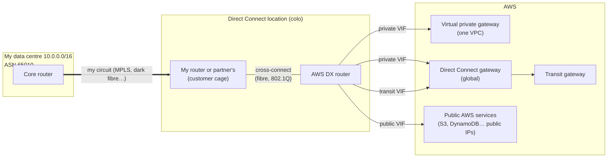
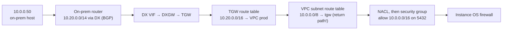

# Direct Connect

> [!abstract] In one sentence
> Direct Connect is a **private physical link** (a fibre cross-connect in a colocation building) between my network and AWS, over which I run BGP sessions called **virtual interfaces**, giving steady bandwidth and latency that an internet VPN can't, but **no encryption** unless I add it.

## Common misconceptions

| Wrong mental model | What's actually true |
|---|---|
| "Direct Connect plugs an EC2 instance into my office" | It connects **networks**. It's a router-to-router BGP link; an instance is reached through the normal VPC route table and security groups |
| "It's private, so it's encrypted" | It's private (not the internet), but frames are plain. Add **MACsec** (on supported dedicated ports) or an **IPsec VPN over it** |
| "It's a cable from my office to AWS" | It ends at a **Direct Connect location** (a colocation data centre). From my office to there is my problem (my circuit, or a partner's) |
| "One DX connection = redundant" | One port, one device, one building. AWS's own resiliency recommendations start at **two** connections |
| "I can set it up this afternoon" | A physical circuit takes **weeks** (sometimes months). A VPN is the bridge until then |

## The pieces



| Piece | What it is |
|---|---|
| **Connection** | The physical port. **Dedicated**: 1, 10, 100 or 400 Gbps, my own port. **Hosted**: from 50 Mbps to 25 Gbps, a slice of a partner's port |
| **DX location** | The colocation building where the AWS router lives. Not an AWS region; each is tied to a home region |
| **LOA-CFA** | The letter AWS gives me so the colo can run the cross-connect to the right port |
| **Virtual interface (VIF)** | A VLAN (802.1Q tag) + a BGP session on the connection. One connection carries several VIFs |
| **Direct Connect gateway (DXGW)** | A global object: one VIF reaches VGWs or TGWs in **many regions** |
| **LAG** | Several connections bundled with LACP into one logical link |

## Private VIF, transit VIF and the Direct Connect gateway

| VIF type | Lands on | Reaches | Use |
|---|---|---|---|
| **Private** | A VGW (one VPC) or a DXGW → VGWs | VPC private IPs | A few VPCs |
| **Transit** | A DXGW → **transit gateway(s)** | Everything attached to the TGW | Many VPCs, hub design → [[Transit gateway]] |
| **Public** | AWS public endpoints | AWS public IP ranges (S3, DynamoDB, public VPN endpoints…) | Reach AWS services without the internet; run a Site-to-Site VPN over it for encryption |

The DXGW is the "one VIF, many VPCs in many regions" piece. What it **doesn't** do: route between the VPCs/VGWs associated with it. VPC A and VPC B behind the same DXGW can't talk through it; that's what a TGW is for. It only joins on-prem ↔ AWS.

## Build-up: from VPN to Direct Connect

**Setup.** Data centre `10.0.0.0/16` (ASN `65010`), today connected with a [[Site-to-Site VPN]] to a TGW in `eu-west-1`. Nightly database replication needs 4 Gbps and steady latency, and the VPN tops out around 1.25 Gbps per flow over the internet.

### Stage 1: order a connection

1. Pick a DX location near my data centre (or my carrier's network)
2. Request a 10 Gbps dedicated connection. AWS allocates a port and gives me the **LOA-CFA**
3. My carrier brings a circuit from my data centre to the colo, and the colo runs the **cross-connect** from my cage (or the carrier's) to the AWS port
4. Link comes up at Layer 1/2. Nothing routes yet

Alternative: a **hosted connection** from a DX partner who already has ports there. Faster to get, smaller sizes, one VIF per hosted connection.

### Stage 2: create a transit VIF and BGP

```text
VIF:  transit, VLAN 101, my ASN 65010, Amazon side: the DXGW ASN
BGP:  peer IPs 169.254.10.1/30 (AWS) – 169.254.10.2/30 (me), MD5 key
DXGW: associated with tgw-0dd, allowed prefixes 10.20.0.0/14
```

- I announce `10.0.0.0/16` to AWS
- AWS announces the **allowed prefixes** I set on the DXGW ↔ TGW association (here a summary of the VPC ranges) back to me
- The TGW route table associated with the VPCs gets `10.0.0.0/16` via the DXGW attachment

Jumbo frames: private VIFs support MTU 9001, transit VIFs 8500. Worth it for replication traffic (the VPN can't do it).

### Stage 3: keep the VPN as a backup

Now the same `10.0.0.0/16` reaches AWS two ways. What decides?

#### VPN as a backup for Direct Connect

- **AWS → on-prem**: for the same prefix, AWS prefers **Direct Connect over VPN**. Nothing to configure. If the DX BGP session drops, its routes are withdrawn and traffic falls back to the VPN
- **On-prem → AWS**: that's *my* router's decision. I make the DX routes preferred with **local preference** on my side (or announce more specific prefixes over DX). Otherwise traffic can go out over the VPN and come back over DX (asymmetric), and stateful firewalls drop it

> [!warning] The backup has to carry the load. A 1.25 Gbps VPN can't back up 4 Gbps of replication. Either the backup is a second DX, or I accept degraded service and know which flows to cut.

### Stage 4: resilience for real

| Model | Shape | Survives |
|---|---|---|
| Dev/test | 1 connection, 1 location | Nothing (maintenance included) |
| **High** | 1 connection in each of **2 locations** | A device, a building |
| **Maximum** | 2 connections in each of 2 locations | A device *and* a building at the same time |

Plus BFD on the BGP sessions for sub-second failure detection (default BGP hold timers take ~90 s).

### Stage 5: encryption

The board asks "is this encrypted?" Not by default.

| Option | Layer | Notes |
|---|---|---|
| **MACsec** | 2, hop by hop on the cross-connect | Supported on certain dedicated 10/100/400 Gbps ports. Line rate, but only protects my router ↔ AWS router |
| **Private IP VPN** | 3, IPsec over a transit VIF | Site-to-Site VPN to the TGW using private IPs over DX. Keeps DX's path, adds IPsec's 1.25 Gbps-per-tunnel limits and overhead |
| **VPN over a public VIF** | 3 | The older way: normal Site-to-Site VPN, reaching its public endpoints over DX |
| **TLS in the application** | 7 | Often enough: databases and APIs already use [[TLS]] |

## Reaching one EC2 instance over Direct Connect

There's no "connect this instance to DX" button. Reaching `10.20.1.20` from `10.0.0.50` is a chain, and every link has to be there:



1. On-prem learns the VPC prefix over BGP (allowed prefixes on the DXGW association)
2. The TGW route table associated with the DXGW attachment has the VPC's CIDR
3. **The return path**: the instance's subnet route table needs on-prem → TGW (or VGW propagation). Forgetting it gives "SYN arrives, no SYN-ACK"
4. The NACL and the [[Security groups|security group]] allow the on-prem source range
5. DNS: on-prem resolving the instance's private name needs a Route 53 Resolver **inbound endpoint** → [[Route 53#Stage 6: the office and the VPC need each other's names]]

> [!tip] If the need is just **admin access to one instance**, I don't need a hybrid link at all: Session Manager (SSM) or an EC2 Instance Connect Endpoint reach private instances over AWS APIs, with IAM and logging. Compare with [[Bastion host]].

## Advanced problems

| Symptom | Cause | Fix |
|---|---|---|
| BGP up, no routes received from AWS | DXGW ↔ TGW association has no (or wrong) allowed prefixes | Set allowed prefixes to the VPC summaries |
| Traffic goes out over DX, comes back over VPN | AWS prefers DX, my router prefers VPN, or more specific prefixes over the VPN | Make on-prem prefer DX (local pref), keep the same prefix lengths on both |
| Failover to VPN takes ~90 s | BGP hold timer | Enable BFD |
| Some VPCs reachable, one isn't | Its CIDR outside the allowed prefixes, or VPC route table missing the return route | Check the chain above link by link |
| Too many prefixes rejected | Route limits per BGP session (e.g. 100 from me on a private VIF) | Summarise |
| VPC A can't reach VPC B "through the DXGW" | DXGW doesn't route between its associations | TGW or peering |

## Practice

> [!example]- I need two VPCs in two regions reachable from on-prem with one VIF. What do I use?
> A Direct Connect gateway. A private VIF to the DXGW, the DXGW associated with both VPCs' VGWs (or a transit VIF to a DXGW associated with a TGW in each region).

> [!example]- DX is up and preferred. A security audit says the link must be encrypted end to end at the network layer. Options?
> Private IP VPN (IPsec over a transit VIF to the TGW), or MACsec if the port supports it (but MACsec is hop by hop, not end to end). Or argue it at the application layer with TLS.

> [!example]- After moving to DX, the database replication still uses the VPN path one way. Why?
> On-prem routing still prefers the VPN (or the VPN carries more specific prefixes). AWS prefers DX for AWS → on-prem. Fix the on-prem side with local preference.

## Easy to get wrong
- Thinking DX is encrypted
- Thinking DX ends in my office: it ends in a colo
- One connection called "redundant"
- Confusing **private** (VPC IPs), **transit** (TGW) and **public** (AWS public services) VIFs
- Expecting the DXGW to route VPC ↔ VPC
- Forgetting the return route in the VPC route table
- Planning DX for next week: it takes weeks; start with a VPN

## Related
- Concepts:: [[AS and BGP]], [[Routing tables]], [[Types of VPN]] (private carrier links like MPLS), [[VPN]], [[Encryption basics]]
- AWS:: [[BGP in AWS hybrid networking]], [[Site-to-Site VPN]], [[Transit gateway]], [[VPC]], [[Security groups]], [[Route 53]], [[Bastion host]], [[EC2]]
- Designs:: [[Hybrid connectivity architectures]], [[Connecting AWS to a private network]]

## Flashcards
#flashcards

What is AWS Direct Connect? :: A private physical link from my network to AWS at a DX location, carrying BGP sessions (VIFs)
Is Direct Connect encrypted? :: No. Add MACsec (supported dedicated ports) or IPsec (private IP VPN / VPN over public VIF), or TLS in apps
Where does a Direct Connect connection physically end? :: At a Direct Connect location (colocation), not in my office
Dedicated vs hosted connection? :: Dedicated: my own 1/10/100/400 Gbps port. Hosted: a partner's slice, 50 Mbps to 25 Gbps
Private vs transit vs public VIF? :: Private → VGW/DXGW (VPC IPs). Transit → DXGW → TGW. Public → AWS public service IPs
What does a Direct Connect gateway do? :: Lets one VIF reach VGWs/TGWs in many regions. It doesn't route between them
Same prefix over DX and VPN: what does AWS prefer? :: Direct Connect
How do you make on-prem prefer DX outbound? :: Local preference (or more specific prefixes) on the on-prem router
Maximum resiliency model for DX? :: Two connections in each of two DX locations
How do you speed up DX failover detection? :: BFD on the BGP sessions
MTU on private and transit VIFs? :: 9001 on private VIFs, 8500 on transit VIFs
How long does Direct Connect take to set up? :: Weeks or more (physical circuit). Use a VPN meanwhile
Can I attach one EC2 instance to Direct Connect? :: No. DX connects networks; the instance is reached via routes (both directions), NACL, SG and DNS
Admin access to a private instance without any hybrid link? :: Session Manager or EC2 Instance Connect Endpoint
