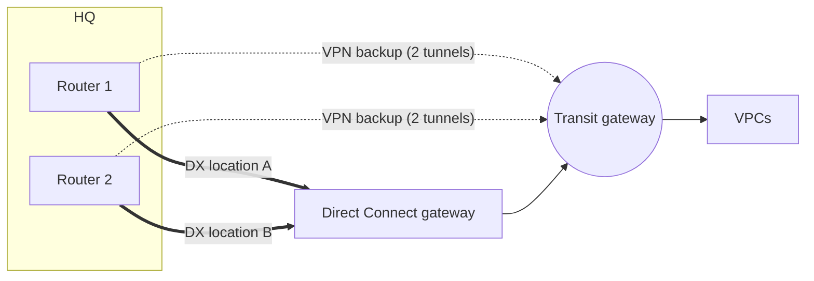
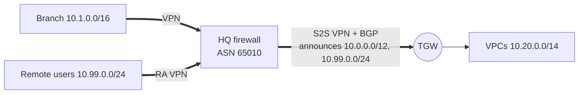
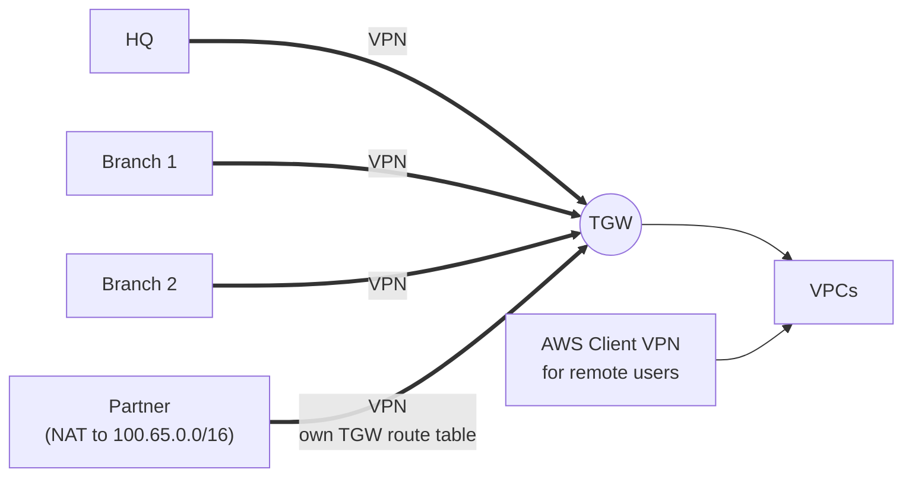

# Hybrid connectivity architectures

> [!abstract] The short answer
> Connecting a company network to AWS starts as "one VPN to one VPC" and then hits the same walls in the same order: **more VPCs, more bandwidth, more sites, overlapping ranges, DNS, inspection, and a client network that is itself a chain of VPNs**. Each wall has a standard AWS answer, and most of them end in the same shape: a **transit gateway hub** reached by VPN and Direct Connect, with BGP everywhere.

The pieces are explained in their own notes: [[Site-to-Site VPN]], [[Transit gateway]], [[Direct Connect]]. Workarounds for when the managed VPN isn't possible at all are in [[Connecting AWS to a private network]]. This note is the map of problems → designs.

## The company

| | |
|---|---|
| HQ | `10.0.0.0/16`, firewall `203.0.113.10`, ASN `65010` |
| Branches | `10.1.0.0/16`, `10.2.0.0/16`, each with an IPsec VPN to HQ |
| Remote employees | Remote-access VPN to HQ, pool `10.99.0.0/24` |
| A partner | Partner VPN to HQ, partner uses `10.1.0.0/16` too |
| AWS | Starts with one VPC `10.20.0.0/16` in `eu-west-1` |

## Problem 1: one VPC → many VPCs

**Starting point:** a VGW on the VPC, one Site-to-Site VPN from HQ. Fine.

**Then:** prod, dev, shared services, data, in several accounts. A VGW per VPC means a VPN per (site, VPC) and no VPC ↔ VPC routing.

| Design | How | When |
|---|---|---|
| VGW per VPC | One VPN per VPC | 1–2 VPCs, nothing more planned |
| VGWs + **Direct Connect gateway** | One DX VIF reaches many VGWs, even across regions | Many VPCs over DX, no VPC ↔ VPC needed |
| **Transit gateway hub** | One VPN/DX per site to the TGW, every VPC attached, TGW route tables for segmentation | The default answer from ~3 VPCs on → [[Transit gateway]] |
| Legacy "transit VPC" | EC2 router appliances in a hub VPC, VPNs from every VPC to them | Before TGW existed. Now only with special needs |

## Problem 2: the VPN is too slow

| Need | Design |
|---|---|
| > 1.25 Gbps aggregate | Several VPN connections to a TGW with **ECMP** (BGP, same AS path). Still ~1.25 Gbps per flow |
| Bad internet path to a far region | **Accelerated VPN** (TGW only) |
| Steady multi-Gbps, predictable latency | [[Direct Connect]], VPN as backup |
| Encrypted *and* fast | DX + **MACsec**, or private IP VPN over DX (IPsec limits again) |

## Problem 3: one link is a single point of failure

- Both VPN **tunnels** configured, BGP on both
- Two customer gateway **devices**, each with its own VPN connection (one device = one failure)
- DX in **two locations**, BFD on BGP, VPN as last resort
- On-prem prefers DX with local preference; AWS already prefers DX over VPN for the same prefix → [[Direct Connect#VPN as a backup for Direct Connect]]
- Alarms on `TunnelState` and DX connection state. A backup nobody monitors is found broken on the day it's needed

## Problem 4: overlapping address ranges

The partner (or an acquired company, or a VPC someone built with the default `10.0.0.0/16`) collides with an existing range. Routing can't tell two `10.1.0.0/16` apart (→ [[Overlapping address spaces]]).

| Design | What it does | Limit |
|---|---|---|
| **Renumber** | Real fix | Time, politics |
| **Private NAT gateway** | The overlapping VPC gets a second, unique "routable" CIDR. Its workloads go out through a private NAT gateway in that range, toward the TGW | Outbound only (AWS → elsewhere). Inbound needs an NLB/ALB in the routable range |
| **PrivateLink** | Publish one service behind an NLB as an endpoint service; consumers get an endpoint IP in their own range | Per service, one direction (consumer → provider) |
| **NAT on the on-prem edge** | HQ firewall maps the partner's `10.1.0.0/16` to `100.65.0.0/16` (1:1 NETMAP) before it enters AWS | Must be done where the clash meets; DNS returns real IPs |
| **Self-managed router on EC2** | NAT inside the tunnel, which the managed VPN can't do | I run and patch it → [[Connecting AWS to a private network#Workaround 2: EC2 as a self-managed site-to-site peer]] |
| VPC Lattice | Service-to-service by name, IPs don't need to be unique | HTTP/gRPC/TCP services, not whole networks |

## Problem 5: DNS across the link

The link carries packets. Names don't follow.
- On-prem resolving AWS private names (`*.internal`, private hosted zones): **Route 53 Resolver inbound endpoint**, on-prem DNS conditionally forwards to it
- AWS resolving `corp.example`: **outbound endpoint** + forwarding rule, shared with other accounts via RAM
- One pair of endpoints in a shared-services VPC on the TGW, not one per VPC

Details: [[Route 53#Stage 6: the office and the VPC need each other's names]], the general pattern in [[DNS in production#Hybrid DNS: joining internal DNS worlds]].

## Problem 6: the client network is already a chain of VPNs

The common real case: AWS only has a VPN to **HQ**, and everyone else reaches HQ through their own VPNs. Branches, remote users and the partner want AWS too. The general problems of chaining (routes beyond the neighbour, policy-based selectors, firewall zone pairs, hairpinning, MTU when tunnels are stacked) are in [[Nested VPNs]]. Here's how they play out with AWS, and the designs that fix them.

### Option A: keep HQ as the hub, make the chain routable

What has to be true:
1. HQ's AWS VPN is **route-based with BGP**. AWS takes one selector pair per tunnel, so policy-based configs listing each branch break (→ [[Site-to-Site VPN#Advanced problems]])
2. HQ **announces** every branch and the remote-access pool to AWS, ideally as summaries (`10.0.0.0/12`, `10.99.0.0/24`). Watch the 100-route limit toward a VGW
3. The VPC route tables send those ranges to the TGW/VGW (the **return path**)
4. HQ re-announces the AWS ranges (`10.20.0.0/14`) to the branches, and the remote-access **split-tunnel** list includes them
5. HQ's firewall allows branch-tunnel → AWS-tunnel and RA-pool → AWS-tunnel, **without NAT**
6. MTU: branch → HQ → AWS is chained (each hop re-encrypts), so it's normal 1446/1379 per tunnel. But if the branch link is itself IPsec over an SD-WAN, it's stacked: clamp MSS lower

Cheap, no new tunnels. The cost: everything hairpins through HQ, HQ's bandwidth and uptime cap everyone, and the partner's overlapping range needs NAT at HQ.

### Option B: every site connects to the TGW directly

- Each branch gets its own Site-to-Site VPN to the TGW. No HQ hairpin, no single point of failure in HQ. With BGP, the TGW can also route branch ↔ branch and branch ↔ HQ (the CloudHub idea, at TGW scale)
- The partner gets its own VPN attachment **associated with its own TGW route table**, which only has the VPCs it's allowed to reach, and its range NATed on its side (or a private NAT gateway on the AWS side for outbound)
- Remote users use **AWS Client VPN** in a VPC attached to the TGW, or keep the HQ VPN if they mostly need on-prem things. Client VPN's client CIDR must not overlap anything
- Branch firewalls now carry two tunnels (HQ and AWS) → route-based tunnels and BGP on them, or the routing becomes static spaghetti

### Option C: the company already runs SD-WAN

Don't build parallel IPsec. Put a virtual SD-WAN appliance in a transit VPC (or use the vendor's AWS offering), and connect it to the TGW with a **Connect attachment** (GRE + BGP). AWS becomes one more site in the existing fabric, branches reach it over their normal SD-WAN paths → [[Transit gateway#Connect attachments: SD-WAN on top]]. For multi-region, AWS Cloud WAN does the same with a global policy.

### Choosing

| Situation | Pick |
|---|---|
| Few branches, little cloud traffic, HQ firewall capable | **A**: make the chain routable |
| Branches heavy users of AWS, or HQ a bottleneck / SPOF | **B**: direct VPNs to the TGW |
| SD-WAN already in place | **C**: Connect attachment / Cloud WAN |
| Remote users who mostly need AWS | Client VPN in AWS (or ZTNA) instead of backhauling through HQ |

## Problem 7: everything must go through a firewall

Security wants east-west (VPC ↔ VPC) and north-south (on-prem ↔ AWS, internet) inspected.

- **Inspection VPC** on the TGW: all spoke route tables point `0.0.0.0/0` at it, it runs AWS Network Firewall or appliances behind a Gateway Load Balancer, and **appliance mode** keeps flows symmetric → [[Transit gateway#Inspection VPC: all traffic through a firewall]]
- **Centralised egress**: one NAT gateway VPC for internet access from all VPCs, instead of a NAT per VPC
- Or inspect on-prem: send AWS → internet through HQ. Usually a bad idea (latency, HQ bandwidth), but some regulations require it

## Problem 8: many regions, many accounts

- One TGW **per region**, peered (static routes only), or **Cloud WAN** for dynamic routing and a single policy
- A **network account** owns TGWs, DX and VPNs, shares the TGW with RAM to workload accounts → [[AWS Organizations]]
- An IP plan (IPAM) with non-overlapping blocks per region/environment *before* the second region

## Side by side

| Design | Sites | VPCs | Bandwidth | Encryption | Effort |
|---|---|---|---|---|---|
| VGW + VPN | 1–few | 1 | ~1.25 Gbps | ✅ | Low |
| VGW + VPN CloudHub | Several | 1 | ~1.25 Gbps per tunnel | ✅ | Low |
| TGW + VPN (ECMP) | Many | Many | N × 1.25 Gbps aggregate | ✅ | Medium |
| DX + DXGW + VGWs | Few | Many, any region | Up to the port | ❌ (add MACsec / VPN) | High (physical) |
| DX + DXGW + TGW, VPN backup | Many | Many | Up to the port | ❌ / ✅ backup | High |
| TGW + Connect (SD-WAN) | Many (fabric) | Many | High | SD-WAN fabric | Medium–high |
| Cloud WAN | Many, global | Many, multi-region | High | Depends on attachments | Medium |

## Easy to get wrong
- Designing for one VPC and paying for it at the third
- One customer gateway device presented as "two tunnels, so redundant"
- Forgetting that every new on-prem range must be **announced to AWS and routed back** from the VPCs
- Chaining branches through HQ with policy-based tunnels to AWS
- Partner networks on the same TGW route table as internal sites
- No DNS plan: the link works by IP, nobody can use it by name
- Stateful inspection through a TGW without appliance mode
- Leaving IP planning until the second overlapping VPC appears

## Related
- Pieces:: [[Site-to-Site VPN]], [[Transit gateway]], [[Direct Connect]], [[Connecting VPCs]], [[Route 53]]
- Concepts:: [[VPN]], [[Types of VPN]], [[Nested VPNs]], [[IPsec and IKE]], [[AS and BGP]], [[Overlapping address spaces]], [[NAT and PAT]], [[DNS in production]]
- Workarounds:: [[Connecting AWS to a private network]]
- AWS:: [[VPC]], [[AWS Organizations]], [[Proxies, load balancing and discovery in AWS]]

## Flashcards
#flashcards

Default hybrid design once there are ~3+ VPCs? :: A transit gateway hub, one VPN/DX per site to it, VPCs attached, TGW route tables for segmentation
How to get more than 1.25 Gbps over VPN to AWS? :: Several VPN connections to a TGW with ECMP and BGP (per flow still ~1.25 Gbps), or Direct Connect
Why are two tunnels not full redundancy? :: Both end on one customer gateway device. Use two devices with their own VPN connections
Ways to handle an on-prem range overlapping a VPC? :: Renumber, private NAT gateway, PrivateLink, NAT on the on-prem edge, self-managed router, VPC Lattice
How do on-prem hosts resolve Route 53 private names? :: Conditional forwarding to a Route 53 Resolver inbound endpoint
AWS has a VPN to HQ only. What must be true for branches behind HQ to reach AWS? :: Route-based BGP VPN, HQ announces branch ranges, VPC routes back, HQ re-announces AWS ranges to branches, firewall allows tunnel-to-tunnel without NAT
Downside of keeping HQ as the hub for AWS traffic? :: Hairpinning: HQ bandwidth and uptime cap every site
How do you isolate a partner VPN on a TGW? :: Its own VPN attachment associated with its own TGW route table that only has the allowed VPCs
How does a company with SD-WAN plug AWS in? :: A TGW Connect attachment (GRE + BGP) to an SD-WAN appliance, or Cloud WAN
Remote users who mostly need AWS: what instead of backhauling through HQ? :: AWS Client VPN (or ZTNA) in AWS
Multi-region hybrid routing options? :: TGW per region with peering (static), or AWS Cloud WAN (dynamic, one policy)
