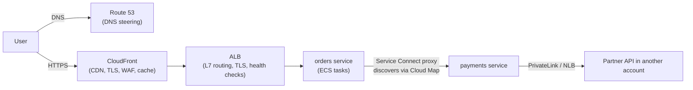
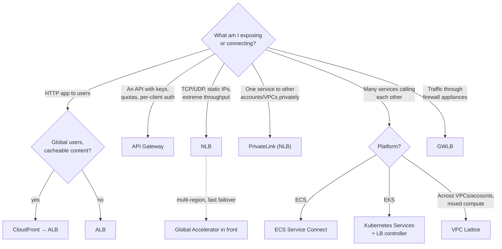

# Proxies, load balancing and discovery in AWS

> [!abstract] The short answer
> AWS sells each idea from [[Proxies]], [[Reverse proxy]], [[Load balancing]] and [[Service discovery]] as a managed product: **ALB** is an L7 reverse proxy/LB, **NLB** an L4 LB, **GWLB** sends traffic through appliances, **CloudFront** is a CDN, **API Gateway** an API gateway, **Global Accelerator** anycast, **Route 53** DNS-based steering, **Cloud Map** a service registry, and **ECS Service Connect / VPC Lattice** do service-to-service discovery and balancing. The one thing AWS barely offers is the classic **forward proxy**: I build that with egress controls instead.

## Concept → AWS product

| Concept (vendor-neutral) | AWS product | Notes |
|---|---|---|
| L7 load balancer / [[Reverse proxy]] | **ALB** (Application Load Balancer) | HTTP/HTTPS/gRPC, host/path/header routing, TLS termination, auth (OIDC/Cognito), WAF |
| L4 load balancer | **NLB** (Network Load Balancer) | TCP/UDP/TLS, static IP per AZ, huge throughput, preserves client IP (depending on target type) |
| "Bump in the wire" for appliances | **GWLB** (Gateway Load Balancer) | Sends packets through firewalls/IDS appliances, GENEVE on UDP 6081 |
| CDN (distributed reverse proxy) | **CloudFront** | Caching at edge locations, TLS at the edge, origins = S3/ALB/any HTTP server |
| API gateway | **API Gateway** | REST/HTTP/WebSocket APIs, auth, throttling per client, usage plans |
| Anycast global entry point | **Global Accelerator** | Two static anycast IPs, traffic enters the AWS backbone at the nearest edge, fast regional failover |
| DNS-based / global load balancing | **Route 53** routing policies | Weighted, latency, failover, geo, health checks ([[Route 53]], [[DNS in production]]) |
| Service registry | **Cloud Map** | Registry with DNS or API-based lookup, health status |
| Service mesh / service-to-service discovery | **ECS Service Connect**, **VPC Lattice** (App Mesh is being retired) | Discovery + balancing + retries between services |
| Kubernetes Service / Ingress | **EKS** + AWS Load Balancer Controller | Ingress → ALB, `Service type: LoadBalancer` → NLB, pods as IP targets |
| Private exposure of one service | **PrivateLink** (endpoint services behind an NLB) | One-way, per service, works across accounts and overlapping CIDRs |
| Forward proxy / egress filtering | No classic managed one: **Squid on EC2**, **Network Firewall** domain rules, **Route 53 Resolver DNS Firewall**, NAT gateway | See below |

## A typical request path, and who does what

Each hop is one of the concepts: global steering (DNS), a CDN reverse proxy, an L7 load balancer, service discovery with a sidecar proxy between services, and an L4 load balancer exposing a private service.

## ALB: the L7 reverse proxy

- **Listeners** (protocol + port) → **rules** (host, path, header, method, query string, source IP) → **target groups** (instances, IPs, Lambda functions, even an ALB behind an NLB)
- **Algorithms**: round robin (default), **least outstanding requests**, weighted random (with automatic anomaly mitigation that shifts traffic away from misbehaving targets)
- **Health checks** per target group. If **all** targets are unhealthy, the ALB **fails open** and sends to all of them ([[Load balancing#Health checks: the part that actually keeps the service up]])
- **Stickiness**: duration-based cookie or application cookie. **Slow start** for new targets. **Deregistration delay** (300 s by default) = connection draining
- Adds **`X-Forwarded-For`**, **`X-Forwarded-Proto`**, `X-Forwarded-Port` ([[Reverse proxy#Fix 1: headers (L7 proxies)]]). The backend's security group should allow **only the ALB's security group**, so the headers can be trusted and nobody bypasses the ALB
- **Idle timeout 60 s** by default: long requests, uploads and WebSockets need it raised, and the backend's keep-alive must be **longer** or I get the random-502 race
- Built-in extras: OIDC/Cognito authentication, [[AWS WAF]], mTLS with trust stores ([[mTLS#In AWS]]), redirects and fixed responses
- Scales automatically, and its IPs **change**: always point DNS at it with an **alias**, never at an IP

## NLB: the L4 load balancer

- TCP, UDP, TLS (can terminate TLS or pass it through). One **static IP per AZ**, or my own Elastic IPs, which partners can allowlist
- Balances **flows** with a hash of protocol, source/destination IP and port: every packet of a connection goes to the same target
- **Client IP preservation**: on by default for instance targets. When it isn't preserved (some IP-target setups), enable **PROXY protocol v2** so the backend gets the client IP ([[Reverse proxy#Fix 2: PROXY protocol (L4 proxies)]])
- Supports security groups (newer NLBs), and is the only LB that can sit behind **PrivateLink**
- Common pattern: **NLB → ALB** as a target, to get static IPs *and* HTTP routing

## Cross-zone load balancing: a detail that matters

Each load balancer has a node in each AZ, and by default DNS spreads clients across nodes.
- **ALB**: cross-zone is **on**: each node spreads across targets in all AZs, so uneven target counts per AZ don't matter
- **NLB / GWLB**: cross-zone is **off** by default: each node only sends to targets in **its own** AZ. With 1 target in AZ-a and 4 in AZ-b, the AZ-a target gets **half** of all traffic. Turning it on fixes the imbalance but adds inter-AZ data charges

## GWLB: inserting appliances

For "all traffic must go through our firewall appliances" (third-party firewalls, IDS). A route table sends traffic to a **GWLB endpoint**, the GWLB spreads flows across a fleet of appliances (health-checked), each flow always to the same appliance, wrapped in **GENEVE** so the appliance sees the original packet. It's load balancing for **network appliances**, not for apps.

## CloudFront, API Gateway, Global Accelerator: three different "front doors"

| | **CloudFront** | **API Gateway** | **Global Accelerator** |
|---|---|---|---|
| Layer | L7 (HTTP) | L7 (HTTP, WebSocket) | L4 (TCP/UDP) |
| Main job | **Cache** content close to users, absorb attacks | **Manage APIs**: auth, keys, quotas, throttling, transformation | **Route** users onto the AWS backbone at the nearest edge, with static anycast IPs |
| Caches? | ✅ | Optional (REST APIs) | ❌ |
| Static IPs? | ❌ (DNS name) | ❌ | ✅ Two anycast IPs |
| Failover between regions | Origin failover groups | Via Route 53 | ✅ Health-based, in seconds, no DNS caching |
| Watch out for | Cache keys and invalidations | Default **29 s** integration timeout, payload limits | Cost, not a cache |

## Service discovery in AWS

### Cloud Map
The registry. A **namespace** holds services, and instances are registered with their IP/port and attributes:
- **Public DNS namespace**: registered instances become Route 53 records on the internet
- **Private DNS namespace**: records in a private hosted zone, resolvable inside the VPC
- **HTTP namespace**: no DNS at all, clients call the `DiscoverInstances` API (client-side discovery, no DNS caching problem)
- Health: Route 53 health checks (public) or custom health status reported by the platform. **ECS** registers and deregisters tasks automatically (third-party registration)

### ECS: two generations
- **ECS service discovery** (older): tasks registered in Cloud Map as DNS records. Plain DNS, with its caching limits
- **ECS Service Connect** (newer): ECS injects an **Envoy-based proxy** next to each task. Apps call a short name (`http://payments:8080`), the proxy finds healthy tasks via Cloud Map, balances per request, retries, and exports metrics. A small service mesh without running a mesh

### VPC Lattice
Service-to-service networking **across VPCs and accounts**: define services and a **service network**, associate VPCs, and Lattice handles discovery, L7 routing, and **IAM-based auth policies** ("only the orders role may call POST /charge"). It works even with **overlapping CIDRs**, because clients never route to the target's IP directly ([[Overlapping address spaces]]). Close to what a service mesh gives, without sidecars.

### App Mesh
AWS's Envoy-based service mesh. AWS announced end of support for it (September 2026) and points to Service Connect and VPC Lattice instead. Worth recognizing on older architectures and exam material, not for new designs.

### EKS
Kubernetes' own discovery (Services, CoreDNS, kube-proxy, see [[Service discovery#How Kubernetes does it (the one I'll meet most)]]) works as usual. The **AWS Load Balancer Controller** turns Kubernetes objects into AWS load balancers: an Ingress becomes an **ALB**, a `LoadBalancer` Service becomes an **NLB**, and with **IP targets** the LB sends straight to pod IPs, skipping the extra kube-proxy hop.

## Forward proxies and egress control in AWS

The forward proxy is the one concept without a classic managed product. The goal ("instances may only reach these domains, and I want logs") is reached in pieces:

| Option | What it controls | Limits |
|---|---|---|
| **NAT gateway** | Outbound access for private subnets | No filtering at all: any destination ([[NAT and PAT#In AWS]]) |
| **AWS Network Firewall** | Stateful rules, **domain allowlists** using the HTTP Host header or TLS SNI | Sees domains, not URLs (no TLS inspection unless configured), cost |
| **Route 53 Resolver DNS Firewall** | Blocks lookups of domains not on a list | Bypassed by connecting to an IP directly: combine with network rules ([[DNS security#8. DNS as a security control]]) |
| **Squid (or another proxy) on EC2** | A real explicit proxy: URL filtering, auth, full logs | I run it: HA across AZs, patching, scaling ([[Connecting AWS to a private network]] has the same operational trade-offs) |
| **VPC endpoints** | Reach AWS services (S3, ECR, STS…) without going to the internet at all | Per service, and interface endpoints cost per hour |

A common secure design: no NAT gateway, **VPC endpoints** for AWS services, and a **proxy or Network Firewall allowlist** for the few external domains the workloads really need.

## Choosing

## Easy to get wrong
- Pointing DNS at an ALB's IP (it changes): use an alias record
- Letting instances accept traffic from anywhere instead of only from the ALB's security group
- ALB idle timeout vs backend keep-alive: random 502s
- NLB with cross-zone off and uneven targets per AZ
- Expecting a NAT gateway to filter anything
- DNS Firewall alone as egress control (direct IP connections bypass it)
- Starting new designs on App Mesh
- API Gateway for long-running requests (29 s default timeout)

## Related
- Concepts:: [[Proxies]], [[Reverse proxy]], [[Load balancing]], [[Service discovery]], [[Service mesh]]
- AWS:: [[Load balancers]], [[Route 53]], [[AWS WAF]], [[VPC]], [[Security groups]], [[Connecting VPCs]], [[Connecting AWS to a private network]]
- DNS:: [[DNS in production]]

## Flashcards
#flashcards

AWS product for an L7 reverse proxy / load balancer? :: ALB
AWS product for an L4 load balancer with static IPs? :: NLB
What is GWLB for? :: Sending traffic through a fleet of firewall/IDS appliances (GENEVE, UDP 6081)
CloudFront vs API Gateway vs Global Accelerator? :: CDN caching at the edge. API management (auth, quotas). Anycast static IPs onto the AWS backbone, L4
ALB load balancing algorithms? :: Round robin, least outstanding requests, weighted random (with anomaly mitigation)
What does the ALB do when all targets are unhealthy? :: Fails open: sends to all targets
How does an NLB backend get the client IP when it isn't preserved? :: Enable PROXY protocol v2
Cross-zone load balancing defaults? :: On for ALB, off for NLB and GWLB
Why point Route 53 at an ALB with an alias record? :: The ALB's IPs change as it scales
How to get static IPs and HTTP routing together? :: NLB in front with an ALB as its target
What is Cloud Map? :: AWS's service registry: DNS (public/private) or API-based discovery (HTTP namespace)
ECS service discovery vs Service Connect? :: Old: Cloud Map DNS records. New: an Envoy proxy per task doing discovery, balancing, retries
What is VPC Lattice? :: Service-to-service networking across VPCs/accounts with discovery, L7 routing and IAM auth policies, works with overlapping CIDRs
What replaces App Mesh? :: ECS Service Connect and VPC Lattice (App Mesh end of support)
How does EKS create AWS load balancers? :: AWS Load Balancer Controller: Ingress → ALB, Service type LoadBalancer → NLB
Is there a managed forward proxy in AWS? :: Not a classic one: Squid on EC2, Network Firewall domain rules, DNS Firewall, VPC endpoints
Why isn't DNS Firewall enough for egress control? :: Connections to IPs directly bypass DNS
API Gateway default integration timeout? :: 29 seconds
