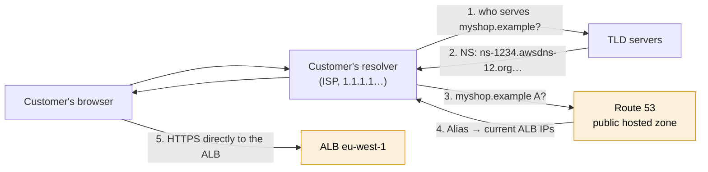
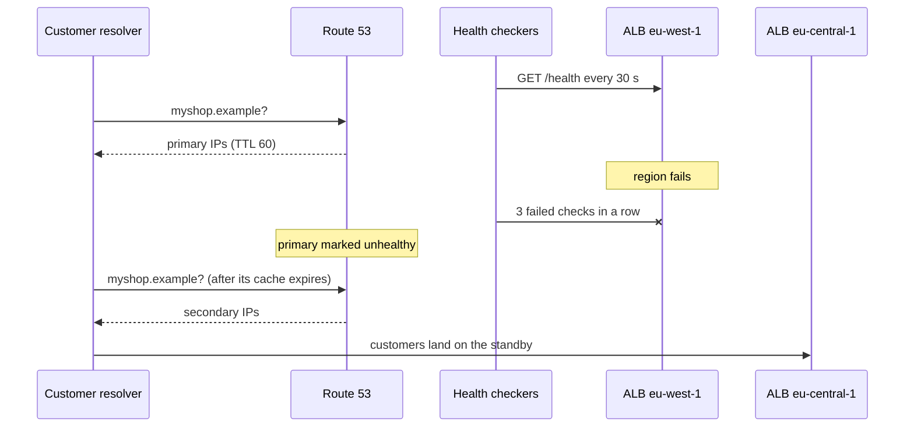
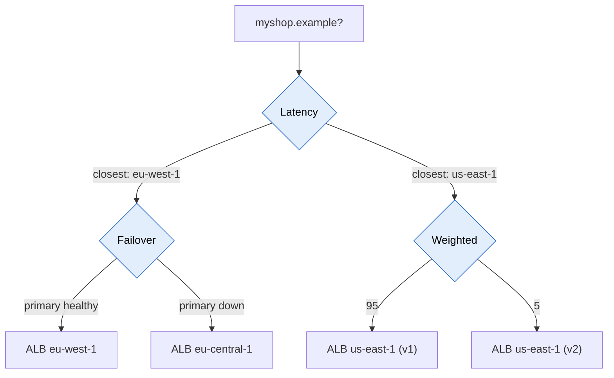
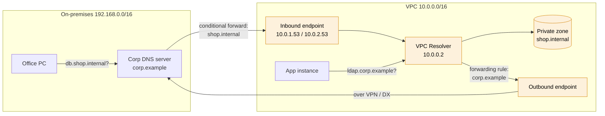

# Route 53

> [!abstract] In one sentence
> AWS's DNS service: it turns `myapp.com` into the address of my load balancer / server. It can also **register domains**, **health-check** endpoints to route around failures, give my VPCs **private DNS names**, and connect VPC DNS with on-premises DNS (the **Resolver**). It's still DNS underneath: it only **answers questions**, it never touches the traffic itself.

(The name comes from **port 53**, the port DNS runs on.)

## Sub-services & features

> Everything this service contains, grouped the way the console's left menu groups it. Linked = I have a note on it.

![[aws-console route 53 sidebar.png|250]]

| Menu group | Sub-service | What it's for |
|---|---|---|
| **Dashboard** | | Quick links: register domain, create zone… |
| **Hosted zones** | Public / private hosted zones | The DNS records of my domains (see below) |
| | DNSSEC signing | Cryptographically sign my zone against DNS spoofing |
| **Health checks** | Health checks | Monitor endpoints, used by failover routing and CloudWatch alarms |
| **Traffic flow** | Traffic policies / policy records | A visual editor to combine routing policies (e.g. latency *then* failover) |
| **IP-based routing** | CIDR collections | Lists of client IP ranges for IP-based routing |
| **Profiles** | Profiles | Share DNS config (private zones, resolver rules) across VPCs/accounts |
| **Domains** | Registered domains / requests | Buy, renew and transfer domains |
| **Resolver** | VPCs | The built-in DNS server of every VPC (`.2` address) |
| | Inbound / outbound endpoints + rules | **Hybrid DNS**: on-prem ↔ VPC name resolution |
| | Query logging | Log DNS queries made from my VPCs |
| **DNS Firewall** | Rule groups, domain lists | Block lookups of malicious domains from my VPCs |
| **Application Recovery Controller** | *(now its own console)* | Readiness checks + routing controls for multi-region failover |

## Common misconceptions

**Wrong mental model #1:** "Route 53 routes my traffic, like a load balancer. Failover and weighted routing move requests instantly."

**What's actually true:** Route 53 only chooses **which DNS answer** to give. The client then connects to that IP directly, and Route 53 never sees the traffic.

| Assumption | Reality |
|---|---|
| Failover switches traffic the moment the primary dies | Failover = health check detection time (≈ 30 s interval × 3 failures by default, faster with 10 s checks) **+ the record's TTL** in every resolver's cache + clients that cache longer than the TTL |
| Weighted 90/10 means exactly 10% of requests | 10% of **DNS answers**. A big corporate resolver caching one answer for thousands of users skews it a lot |
| Route 53 balances load between my servers | It spreads **lookups**. Connection-level balancing, health per request and sticky sessions are the [[Load balancers\|load balancer's]] job. Usually: Route 53 picks the **region**, the ALB picks the **instance** |

The general limits of DNS-based balancing are in [[DNS in production#DNS for load balancing and failover]].

**Wrong mental model #2:** "Alias is just AWS's name for CNAME."

**What's actually true:** an Alias is an **A/AAAA record** whose value Route 53 fills in itself from an AWS resource.

| | CNAME | **Alias** |
|---|---|---|
| What the resolver gets | "Go look up this other name" (a second lookup) | Directly the IPs of the target |
| At the zone apex (`myapp.com`) | **Not allowed** by DNS rules | Allowed |
| Points to | Any name, anywhere | AWS resources: ELB, CloudFront, API Gateway, S3 website endpoint, VPC interface endpoint, Global Accelerator, another record in the same zone |
| Query cost | Charged | **Free** to AWS resources |
| TTL | I set it | Taken from the target |
| Health | Needs a separate health check | **Evaluate target health**: inherits the ALB's own target health |

**Wrong mental model #3:** "A private hosted zone works like a public one, just hidden."

**What's actually true:** a private hosted zone answers **only** to queries that reach the **VPC Resolver** of a VPC **associated** with it. Nothing else can see it: not the internet, not another VPC that isn't associated, not my office network (unless I add a Resolver **inbound endpoint**). And when a private zone and a public zone have the same name, a VPC associated with the private one **never falls back** to the public one.

**Wrong mental model #4:** "Health checks can watch my private instances."

**What's actually true:** Route 53 health checkers run **on the internet**, from several AWS locations. They can only reach **public** endpoints. For a private resource, the health check watches a **CloudWatch alarm** instead (e.g. an alarm on the internal ALB's `HealthyHostCount`).

## How DNS works (and where Route 53 fits)

![[aws-docs route53 how dns routes.png]]
*From the AWS docs*

1. I type `www.example.com`
2. My DNS resolver (usually my ISP) doesn't know it, so it asks around:
3. **Root name server** → "ask the `.com` servers"
4. **`.com` name server** → "ask Route 53's name servers for example.com"
5. **Route 53** → "it's `192.0.2.44`"
6. The resolver gives me the IP (and caches it for the **TTL**)
7. My browser talks to that IP directly

So Route 53 is the **last stop**: the **authoritative** server that actually knows the answer for my domain. The full lookup, caching and delegation are in [[DNS]].

## The pieces

| Piece | What it is |
|---|---|
| **Hosted zone** | A container for all the DNS records of one domain (`myapp.com`). $0.50 per month |
| **Public hosted zone** | Answers for the whole internet |
| **Private hosted zone** | Only answers inside the [[VPC]]s I associate it with (e.g. `shop.internal`) |
| **Record** | One line: name → type → value (+ routing policy) |
| **Domain registration** | Buying the domain itself. Route 53 can do it, and creates the hosted zone for me |
| **Health check** | Probes an endpoint (or watches a CloudWatch alarm). Can take unhealthy answers out of DNS |
| **Resolver** | The DNS server every VPC gets at its CIDR base **+2** (e.g. `10.0.0.2`), also `169.254.169.253`. Answers private zones, VPC names, and the internet |

### Record types I actually need
| Type | Points to | Example |
|---|---|---|
| **A** | IPv4 address | `myapp.com → 203.0.113.10` |
| **AAAA** | IPv6 address | |
| **CNAME** | Another name | `www.myapp.com → myapp.com` |
| **MX** | Mail server | |
| **TXT** | Any text (ownership proofs, SPF) | |
| **NS** | The name servers for the zone | Created automatically |
| **CAA** | Which CAs may issue certificates for the domain | `0 issue "amazon.com"` |
| **Alias** ⭐ | An AWS resource | `myapp.com → my-alb-123.eu-west-1.elb.amazonaws.com` |

> [!tip] Alias records are the AWS superpower
> Load balancer IPs **change all the time**, so I can't hardcode an A record. An Alias follows the resource automatically, works on the **root domain**, and queries are free.

## Build-up: DNS for my shop

Same shop as in [[S3]] and [[RDS]]: account `123456789012`, `eu-west-1`, a [[VPC]] `10.0.0.0/16`, an ALB in front of the app, PostgreSQL on RDS. The domain is `myshop.example`.

### Stage 1: the domain answers on the internet

Steps (the console version is in the walkthrough below):
1. Create a **public hosted zone** `myshop.example`. Route 53 creates the **NS** record (4 name servers, e.g. `ns-1234.awsdns-12.org`) and the **SOA**
2. The domain was bought at another registrar, so I put those 4 name servers in the registrar's settings. That's the **delegation**: the `.example` servers now send everyone to Route 53. If the domain was registered in Route 53, this is done for me
3. `myshop.example` → **A, Alias** → the ALB. `www.myshop.example` → **A, Alias** → the same ALB (or a CNAME to the apex)
4. `dig +short NS myshop.example` from my laptop should list the 4 Route 53 name servers. Then `dig myshop.example` should return the ALB's IPs

### Stage 2: HTTPS needs DNS too

[[Certificate Manager (ACM)]] proves I own `myshop.example` with a **CNAME** it asks me to create. The zone is in Route 53, so it's one **"Create records in Route 53"** button, and the record must **stay** there: ACM uses it again for every automatic renewal (see [[Certificate rotation]]). A **CAA** record allowing `amazon.com` keeps other CAs from issuing for my domain, and must allow Amazon or ACM can't issue at all.

### Stage 3: internal names inside the VPC

The app connects to the database with `shop-prod-db.abc123xyz.eu-west-1.rds.amazonaws.com`. I want `db.shop.internal` instead, so the app config doesn't change when the database does.

- Create a **private hosted zone** `shop.internal`, **associated** with the shop's VPC
- `db.shop.internal` → **CNAME** → the RDS endpoint (a CNAME, not an IP, because the RDS IP changes on failover, see [[RDS]])
- The VPC needs **`enableDnsSupport`** and **`enableDnsHostnames`** both on, or private zones don't resolve

> [!warning] Same name, public and private: no fallback
> If I create a private zone called `myshop.example` (to give internal answers for some names, i.e. **split-horizon**), every VPC associated with it asks **only** the private zone for anything under `myshop.example`. A name that exists only in the public zone gets **NXDOMAIN** from inside the VPC. Every record needed internally must exist in the private zone too.

A second VPC (another account, say) that needs `db.shop.internal` must be **associated** with the zone too. Cross-account association is done through the CLI/API: an authorization from the zone's account, then the association from the other account. Or share it with a Route 53 **Profile**.

### Stage 4: surviving a region outage (failover)

I build a standby copy of the shop in `eu-central-1` (pilot light: small ALB + instances, a cross-region RDS replica). If `eu-west-1` fails, DNS must send customers there.

**Failover routing:** two records with the same name `myshop.example`:
- **Primary**: Alias → ALB in `eu-west-1`, **Evaluate target health = Yes**
- **Secondary**: Alias → ALB in `eu-central-1`

What decides how fast this is:
- **Detection**: interval (30 s standard, 10 s fast) × failure threshold (3 by default). An endpoint is healthy if more than 18% of the checkers say so
- **Caching**: the TTL on the answer. Alias records to an ALB use a 60 s TTL
- **Clients**: browsers and runtimes that cache longer than the TTL (see the JVM note in [[RDS]])
- And only the **web tier** moves. Promoting the RDS replica in `eu-central-1` is a separate step (or Aurora Global Database)

Health check types:

| Type | Checks | For |
|---|---|---|
| **Endpoint** | HTTP/HTTPS/TCP on an IP or name, optional string match in the response | Public endpoints |
| **Calculated** | Combines other health checks ("healthy if 2 of 3 are healthy") | One health status for a whole stack |
| **CloudWatch alarm** | The state of an alarm | **Private** resources the checkers can't reach |

With Alias to an ALB, **Evaluate target health** already uses the ALB's own target health, so I don't need a separate health check. A health check on a `/health` URL that tests the database too is better, though: an ALB with healthy instances and a dead database still sends customers into errors.

### Stage 5: customers in two continents (latency, weighted, geo)

The shop opens in North America with a full copy in `us-east-1`. Now both regions are active.

| Need | Policy |
|---|---|
| Each customer to the region that answers fastest | **Latency**: one record per region. Route 53 uses its latency measurements between the resolver's network and AWS regions |
| EU customers must stay in the EU (data rules) | **Geolocation**: by continent/country of the resolver's IP. Always add a **Default** record, or users from unlisted places get **no answer** |
| Test the new version on 5% of lookups | **Weighted**: 95 / 5. Weight 0 = no traffic (unless all are 0) |
| Shift traffic gradually between regions by distance | **Geoproximity** with a **bias** |
| Several answers, only healthy ones | **Multivalue**: up to 8 healthy records per answer |
| Send specific ISPs or networks somewhere | **IP-based** with CIDR collections |

Policies combine as a tree: latency between regions, then failover or weighted inside each region. Either with Alias records pointing to other records, or with the **Traffic flow** visual editor.

### Stage 6: the office and the VPC need each other's names

The company has an on-premises network `192.168.0.0/16` with its own DNS server for `corp.example`, connected to the VPC over a VPN or Direct Connect (see [[Connecting AWS to a private network]]).
- Instances in the VPC need `ldap.corp.example` → on-prem DNS
- Office machines need `db.shop.internal` → the private hosted zone

The VPC Resolver doesn't listen on the network for outside clients, and it doesn't know `corp.example`. **Resolver endpoints** fix both directions:

- **Inbound endpoint**: network interfaces (in 2+ AZs) that on-prem DNS servers **forward to**
- **Outbound endpoint** + **forwarding rule** (`corp.example` → `192.168.10.53`): the VPC Resolver forwards those queries on-prem
- Rules can be shared with other accounts' VPCs through **RAM**, so one set of endpoints serves the whole organization
- Security groups on the endpoints must allow **UDP and TCP 53**, and the VPN/DX path must route between them

The vendor-neutral version of this (conditional forwarding, split-horizon) is in [[DNS in production#Hybrid DNS: joining internal DNS worlds]].

### Stage 7: protecting the DNS itself

| Threat | Route 53 feature |
|---|---|
| Forged answers (cache poisoning) | **DNSSEC signing** on the public zone: a key-signing key backed by an asymmetric **KMS key in `us-east-1`**, then a **DS record** at the registrar/parent. Without the DS record, nobody validates |
| Malware on an instance looking up a command-and-control domain, or exfiltrating data through DNS | **DNS Firewall**: block/alert lists on the VPC Resolver |
| "What did this instance look up?" | **Resolver query logging** to CloudWatch Logs, S3 or Firehose |
| A record pointing at a deleted resource (an S3 website bucket, an old CloudFront distribution) that someone else can claim | Alias records (they stop answering when the target is gone), and cleaning up records when deleting resources. See *subdomain takeover* in [[DNS security]] |
| Someone deletes the zone or changes NS records | [[IAM]] permissions, [[CloudTrail]] alerts on `ChangeResourceRecordSets` and `DeleteHostedZone` |

## Routing policies

When I create a record I pick *how* Route 53 answers:

| Policy | What it does | Use it when | Health checks |
|---|---|---|---|
| **Simple** | One answer (can contain several IPs, returned in random order) | One server / one ALB | No |
| **Weighted** | 80% → A, 20% → B | Canary releases, A/B tests, blue/green | Yes |
| **Latency** | Sends the user to the region with the lowest latency | App deployed in several regions | Yes |
| **Failover** | Primary, and secondary only if the primary is unhealthy | Disaster recovery (active-passive) | Required on the primary (or Evaluate target health) |
| **Geolocation** | Based on the user's country/continent | Legal/language reasons. Needs a **Default** | Yes |
| **Geoproximity** | Based on distance, with a "bias" knob | Shift traffic between regions gradually | Yes |
| **Multivalue answer** | Up to 8 healthy records | Simple client-side spreading with health | Yes |
| **IP-based** | Based on the user's IP range (CIDR collections) | Route specific ISPs/networks | Yes |

## Console walkthrough: point my domain at a load balancer

> [!note] The AWS docs for Route 53 have no console screenshots. The steps below are written out; I'll paste my own screenshots here the next time I do it.

1. **Route 53 → Hosted zones → Create hosted zone**
   - Domain name: `myapp.com`, Type: **Public hosted zone**
   - AWS creates **NS** and **SOA** records automatically
2. *If the domain was bought somewhere else* (Namecheap, OVH…): copy the 4 **NS** values into the registrar's name server settings. Otherwise nobody on the internet will ever ask Route 53
3. **Create record**
   - Record name: leave empty (root) or `www`
   - Record type: **A**
   - Turn on the **Alias** toggle
   - Route traffic to: **Alias to Application and Classic Load Balancer** → region → pick my ALB
   - Routing policy: **Simple**
4. Wait a minute, then `dig myapp.com` or `nslookup myapp.com` to check

## Advanced problems I'll actually debug

| Symptom | Usual cause | Fix |
|---|---|---|
| New hosted zone, the domain doesn't resolve (or resolves to the old host) | The registrar still points to the old name servers, or I created a **second** hosted zone with the same name and the registrar points to the other one's NS | `dig NS myshop.example @<TLD server>` (or `+trace`) and compare with the zone's NS record |
| Changed a record, some users still get the old IP | Resolver caches until the TTL expires (and the old **NS** TTL is often 2 days) | Lower the TTL **a day before** a migration, then change, then raise it again |
| Works from the internet, `NXDOMAIN` from inside the VPC | A private zone with the same name and without that record (no fallback) | Add the record to the private zone too |
| Private zone name doesn't resolve from an instance | VPC not associated with the zone, or `enableDnsHostnames`/`enableDnsSupport` off, or the instance uses a custom DNS server instead of the VPC Resolver | Associate, enable both settings, check `/etc/resolv.conf` and the DHCP options set |
| Office can't resolve `shop.internal` | No inbound endpoint, on-prem forwarder not configured, or SG/route blocks 53 | Inbound endpoint, conditional forwarder, allow UDP+TCP 53 |
| Failover "didn't work" | Health check passing (checks a static page while the app is broken), checkers blocked by a security group or [[AWS WAF]], or health check on a private IP | Check a deep `/health`, allow the [Route 53 health checker IP ranges](https://docs.aws.amazon.com/Route53/latest/DeveloperGuide/route-53-ip-addresses.html), CloudWatch alarm health check for private resources |
| Failover worked but took 5+ minutes | Health check interval × threshold + TTL + client caching | 10 s checks, lower threshold, short TTL, clients respecting TTL |
| Some countries get no answer | Geolocation without a Default record | Add a Default record |
| Can't create a CNAME for the apex | DNS forbids CNAME next to the SOA/NS at the apex | Alias record |
| ACM certificate stuck in "Pending validation" | Validation CNAME missing or in the wrong zone, or a **CAA** record doesn't allow `amazon.com` | Create the CNAME in the zone the registrar actually points to, fix CAA |
| DNSSEC: the whole domain stops resolving for validating resolvers | DS record at the registrar doesn't match the key, or the KMS key was disabled/deleted | Fix the DS record, never delete the KMS key while signing is on. Disable DNSSEC in the right order (remove DS first, wait for TTL, then disable signing) |

## Practice

> [!example]- I created a hosted zone for a domain registered at another company. Nothing resolves. Why?
> The registrar still delegates to its own name servers. I must set the domain's name servers at the registrar to the 4 NS values of my Route 53 zone.

> [!example]- I need `myapp.com` (no www) to point at an ALB. A CNAME is refused. What do I use?
> An A record with Alias to the ALB. Alias works at the apex, follows the ALB's changing IPs, and is free to query.

> [!example]- Active-passive across two regions with automatic DNS failover. Which pieces?
> Failover routing: primary record → ALB in region 1 with a health check (or Evaluate target health), secondary record → ALB in region 2. Plus a plan for the data tier (promote a cross-region replica). Expect failover in about detection time + TTL, not instantly.

> [!example]- Instances in my VPC must resolve names that only the on-premises DNS server knows. What do I add?
> A Route 53 Resolver **outbound** endpoint and a forwarding rule for the on-prem domain pointing at the on-prem DNS server's IP, over the VPN/DX. (Inbound endpoint is the other direction: on-prem resolving private zone names.)

> [!example]- I want EU users to always go to eu-west-1 for legal reasons. Latency or geolocation?
> Geolocation (by location, a rule). Latency routing could send an EU user to another region if it measures faster. Add a Default record for everyone else.

## Easy to get wrong
- Creating a hosted zone does **nothing** until the registrar points to its NS records
- **CNAME at the root domain is not allowed** (DNS rule). Use an Alias
- DNS changes aren't instant for everyone, because resolvers cache answers for the TTL. Failover too
- Thinking Route 53 load-balances connections: it only picks answers
- Route 53 is a **global** service: no region selector in the console (but a DNSSEC KMS key must be in `us-east-1`)
- A private zone with the same name as the public one hides every public record from associated VPCs
- Private zones need both VPC DNS settings on, and an association per VPC
- Health checks can't reach private IPs: use a CloudWatch alarm health check
- Geolocation without a Default record
- Mixing up inbound (on-prem → AWS names) and outbound (AWS → on-prem names) Resolver endpoints
- Deleting a resource and leaving its DNS record behind (subdomain takeover)

## Related
- Concept:: [[DNS]], [[DNS security]], [[DNS in production]]
- Points at:: [[Load balancers]], [[Proxies, load balancing and discovery in AWS]] (CloudFront, API Gateway, Global Accelerator), [[S3]] (website endpoints), [[EC2]] (an **Elastic IP**, since a plain public IP changes on stop/start)
- Certificates:: [[Certificate Manager (ACM)]] (validation CNAME, one button when the zone is in Route 53), [[Certificate rotation]]
- Private names:: [[VPC]], [[RDS]] (CNAME to the endpoint), [[Connecting VPCs]]
- Hybrid:: [[Connecting AWS to a private network]]
- Alternatives:: [[Lightsail]] has its **own** DNS zones (simpler, free), but I can use Route 53 instead
- Monitoring:: CloudWatch (health check alarms), [[CloudTrail]] (record changes)
- Big picture:: [[How AWS services connect]]

## Flashcards
#flashcards

What is a Route 53 hosted zone? :: A container for all DNS records of one domain
Why use an Alias record instead of an A record for an ALB? :: ALB IPs change. An Alias follows the resource automatically, works at the root domain, and is free
Can I use a CNAME for `myapp.com` (root)? :: No, CNAMEs aren't allowed at the zone apex. Use an Alias record
Which routing policy sends users to the closest-performing region? :: Latency-based routing
Which routing policy gives primary/backup behaviour? :: Failover (with a health check on the primary)
I created a hosted zone but the domain doesn't resolve. Why? :: The registrar's NS records don't point to the hosted zone's name servers yet
Does Route 53 see or forward my application traffic? :: No, it only answers DNS queries. Clients connect to the returned IPs directly
What decides how long a Route 53 failover takes? :: Health check interval × failure threshold, plus the record's TTL, plus client caching
What can an Alias record point to? :: AWS resources (ELB, CloudFront, API Gateway, S3 website, VPC interface endpoint, Global Accelerator) or another record in the same zone
What does Evaluate target health do? :: An Alias record inherits the target's health (e.g. the ALB's target health) without a separate health check
Who can resolve a private hosted zone? :: Only queries reaching the VPC Resolver of VPCs associated with the zone
Which two VPC settings must be on for private hosted zones? :: enableDnsSupport and enableDnsHostnames
Private and public zones with the same name: what happens for a missing private record? :: NXDOMAIN inside associated VPCs. No fallback to the public zone
What is the VPC Resolver's address? :: The VPC CIDR base +2 (e.g. 10.0.0.2), also 169.254.169.253
How can a health check monitor a private resource? :: Health check on a CloudWatch alarm
What is a calculated health check? :: A health check combining the status of other health checks
Inbound vs outbound Resolver endpoint? :: Inbound: on-prem resolves AWS private names. Outbound + forwarding rules: VPC resolves on-prem names
How are Resolver forwarding rules shared across accounts? :: With AWS RAM
What happens with geolocation routing and no Default record? :: Users from unmatched locations get no answer
Latency vs geolocation routing? :: Latency: fastest region, can change. Geolocation: fixed by the user's location (compliance, language)
What does multivalue answer routing return? :: Up to 8 healthy records
What does weight 0 mean in weighted routing? :: No traffic to that record (unless all weights are 0)
Where must the KMS key for Route 53 DNSSEC signing be? :: us-east-1 (asymmetric key)
What does DNSSEC signing need at the registrar? :: A DS record for the zone's key-signing key
What does Route 53 DNS Firewall do? :: Blocks or alerts on lookups of listed domains from VPCs
Why lower a record's TTL before a migration? :: So caches expire quickly when the record changes

## Links
- [What is Amazon Route 53? (docs)](https://docs.aws.amazon.com/Route53/latest/DeveloperGuide/Welcome.html)
- [Routing traffic to an ELB load balancer](https://docs.aws.amazon.com/Route53/latest/DeveloperGuide/routing-to-elb-load-balancer.html)
- [Choosing a routing policy](https://docs.aws.amazon.com/Route53/latest/DeveloperGuide/routing-policy.html)
