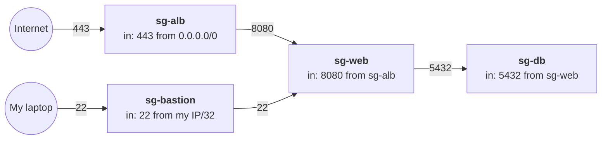

# Security groups

> [!abstract] In one sentence
> A security group is a **stateful firewall attached to a resource** (really, to its network interface). It lists which traffic is **allowed** in and out, and everything else is blocked.

## What it is

Every resource that sits in a [[VPC]] with a network card wears one or more security groups:
- [[EC2]] instances (and the ones [[Auto Scaling]] creates, through the launch template)
- [[Load balancers]] (ALB / NLB)
- Databases (RDS), EFS mount targets, VPC endpoints
- VPC-attached [[Lambda]] functions

It's found in both the **EC2 console → Network & Security → Security Groups** and the **VPC console → Security → Security groups** (same thing, two doors).

## Anatomy of a rule

| Field | Example | Notes |
|---|---|---|
| **Type** | SSH, HTTP, HTTPS, Custom TCP, All ICMP | A shortcut that fills protocol + port |
| **Protocol** | TCP / UDP / ICMP / All | |
| **Port range** | `22`, `443`, `8000-8100` | |
| **Source** (inbound) / **Destination** (outbound) | `41.x.x.x/32`, `0.0.0.0/0`, `sg-0abc…`, a prefix list | An IP range **or another security group** |
| **Description** | "SSH from home" | Optional, but future me will thank me |

## The rules of the game

- **Allow rules only.** There is no "deny". Anything not allowed is blocked. To block one specific IP → use a Network ACL or [[AWS WAF]]
- **Stateful.** If a request is allowed in, its response is allowed back out automatically (and vice versa). No need for return-traffic rules
- **A new security group** has **no inbound** rules (nothing gets in) and **allows all outbound**
- **Several groups on one resource** (up to 5 per network interface by default): their rules are **added together**. The most permissive one wins
- **Changes apply immediately** to every resource wearing the group, and I can swap the groups of a running instance at any time
- A security group belongs to **one VPC**
- Each VPC has a **default security group** (can't be deleted): it allows all inbound traffic *from members of that same group* and all outbound. Better to create my own than use it

## Referencing another security group

The most useful trick. Instead of an IP range, a rule's source is **another security group**: "allow anything wearing `sg-web`". No IPs to maintain, and it keeps working when [[Auto Scaling]] adds or replaces instances.

The classic 3-tier chain, where each layer only accepts traffic from the layer in front of it:

`sg-web` also allows SSH (22) from `sg-bastion` (see [[Bastion host]]). Names following [[AWS naming conventions]] would be `shop-prod-sg-alb`, `shop-prod-sg-web`…

> [!note]
> Referencing a group means "traffic coming from the **private IPs** of resources wearing it". It does **not** copy that group's rules.

## Security group vs Network ACL

> More on how ACLs work (rule order, ephemeral ports) → [[ACL]]

| | **Security group** | **Network ACL** |
|---|---|---|
| Attached to | A resource (its network interface) | A **subnet** |
| Rules | Allow only | Allow **and deny** |
| State | **Stateful**: responses allowed automatically | **Stateless**: return traffic needs its own rule (ephemeral ports `1024-65535`) |
| Rule order | All rules evaluated together | Evaluated **in number order**, first match wins |
| Default | New SG: nothing in, everything out | Default NACL: everything in and out |
| Typical use | The everyday firewall | An extra coarse layer, e.g. block a bad IP range for the whole subnet |

Traffic has to get through **both**: the subnet's NACL, then the resource's security group.

## Example

A web server that answers HTTPS to the world and SSH only to me:

| Direction | Type | Port | Source / Destination |
|---|---|---|---|
| Inbound | HTTPS | 443 | `0.0.0.0/0` |
| Inbound | SSH | 22 | `41.x.x.x/32` (my IP) |
| Inbound | All ICMP - IPv4 | – | my IP (so `ping` works, see [[ICMP]]) |
| Outbound | All traffic | All | `0.0.0.0/0` (the default) |

## Easy to get wrong

- **SSH or RDP open to `0.0.0.0/0`.** The whole internet starts guessing passwords within minutes. Use my IP, a [[Bastion host]], or Session Manager
- **Ping doesn't work** but HTTP does → ICMP isn't allowed inbound
- **App behind an ALB open to the internet.** It should only allow traffic **from the ALB's security group** (see [[Load balancers]])
- **Timeout ≠ refused.** A connection that *hangs* usually means a security group / NACL / route is dropping it. "Connection refused" means it reached the machine but nothing listens on that port
- **A Lightsail firewall is not a security group** (see [[Lightsail]])
- A security group can't be renamed, only its `Name` tag can change

## Related
- Similar to:: Network ACLs (subnet level, see [[VPC]]), the [[Lightsail]] instance firewall
- Differs from:: [[AWS WAF]] (L7, reads the HTTP request; SGs only see IPs and ports)
- Depends on:: [[VPC]], [[Ingress and egress]]
- Used by:: [[EC2]], [[Load balancers]], [[Bastion host]], [[Lambda]] in a VPC, [[RDS]]
- Debugging "why can't A reach B?" → **Reachability Analyzer** in the VPC console

## Flashcards
#flashcards

What is a security group attached to? :: A resource's network interface (ENI), not a subnet
Can a security group deny traffic? :: No, only allow rules. Use a NACL or WAF to deny
Is a security group stateful? :: Yes, responses to allowed traffic are allowed back automatically
Default rules of a newly created security group? :: No inbound rules, all outbound allowed
What happens with several security groups on one instance? :: Their rules are combined, the most permissive wins
How do I allow only the ALB to reach my app? :: App SG inbound rule with source = the ALB's security group
Security group vs NACL? :: SG: resource level, stateful, allow only. NACL: subnet level, stateless, allow + deny, numbered order
Why do NACLs need ephemeral port rules? :: They're stateless, so return traffic (ports 1024-65535) must be allowed explicitly
What does the VPC's default security group allow? :: All inbound from members of the same group, all outbound
Connection times out vs refused? :: Timeout: dropped by a SG/NACL/route. Refused: reached the host, nothing listening
