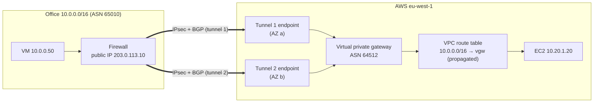

# Site-to-Site VPN

> [!abstract] In one sentence
> AWS Site-to-Site VPN is a managed pair of IPsec tunnels between my office's router (the **customer gateway**) and an AWS-side gateway (a **virtual private gateway** for one VPC, or a **transit gateway** for many), with BGP or static routes telling each side which networks are behind the other.

The general idea (why there's a gateway at each end, what the tunnel does) is in [[VPN#Site-to-site vs remote access: where does the tunnel end?]]. The protocol is in [[IPsec and IKE]]. This note is about how AWS packages it and where it hurts.

## The pieces

| Piece | What it is | Lives where |
|---|---|---|
| **Customer gateway (CGW)** | An AWS *record* describing my device: its public IP, its BGP ASN, optionally a certificate. It doesn't create anything on my side | AWS (a resource) |
| **Customer gateway device** | The real firewall/router in my office (Fortinet, Palo Alto, Cisco, strongSwan on Linux…) | My network |
| **Virtual private gateway (VGW)** | The AWS-side VPN router for **one VPC**. Has its own ASN (default `64512`) | Attached to one VPC |
| **Transit gateway (TGW)** | Same role, but a hub for **many VPCs** → [[Transit gateway]] | Region |
| **VPN connection** | The link between one CGW and one VGW/TGW. Always **two tunnels** | AWS |
| **Tunnel** | One IPsec tunnel to one AWS endpoint (public IP), each in a different AZ | AWS |



## Build-up: connecting the office to one VPC

**Setup.** Office `10.0.0.0/16`, firewall with public IP `203.0.113.10`, BGP ASN `65010`. One VPC `10.20.0.0/16` in `eu-west-1` with an app server `10.20.1.20`.

### Stage 1: create the three AWS objects

```bash
# 1. describe my device
aws ec2 create-customer-gateway --type ipsec.1 \
  --public-ip 203.0.113.10 --bgp-asn 65010

# 2. the AWS-side router, attached to the VPC
aws ec2 create-vpn-gateway --type ipsec.1 --amazon-side-asn 64512
aws ec2 attach-vpn-gateway --vpn-gateway-id vgw-0aa --vpc-id vpc-0bb

# 3. the connection (two tunnels), with BGP
aws ec2 create-vpn-connection --type ipsec.1 \
  --customer-gateway-id cgw-0cc --vpn-gateway-id vgw-0aa \
  --options StaticRoutesOnly=false
```

Then **Download configuration** in the console: AWS generates a config file for my device's vendor, with both tunnels' outside IPs, PSKs, inside `/30` addresses (`169.254.x.x`) and the BGP neighbours. I (or the firewall admin) paste it in.

### Stage 2: the tunnels are UP but nothing works

The classic first day. The console shows both tunnels **UP**, `ping 10.20.1.20` from the office times out. Three things are still missing, and none of them is "the VPN":

1. **The VPC doesn't know the office exists.** The route table has `10.20.0.0/16 → local` and nothing for `10.0.0.0/16`. Fix: turn on **route propagation** for the VGW on each subnet route table (or add a static route `10.0.0.0/16 → vgw-0aa`). With propagation, whatever the office announces in BGP appears in the table by itself
2. **The security group** on the instance only allows traffic from inside the VPC. Add an inbound rule from `10.0.0.0/16` (only the ports needed)
3. **The office doesn't route `10.20.0.0/16` into the tunnel.** With BGP, AWS announces the VPC CIDR to the firewall and it's automatic. With static routing, the firewall needs a route `10.20.0.0/16 → tunnel interface`, plus a firewall policy that allows it

> [!tip] Order to check: tunnel state → BGP state → VPC route table → security group / NACL → office route and firewall policy → the server's own firewall. "Tunnel UP" only proves step 1.

### Stage 3: one tunnel isn't redundancy unless the router uses both

AWS takes one tunnel down at a time for maintenance. If my firewall only configured tunnel 1 (common: "the second one looked optional"), the VPN goes down during maintenance windows.

| Routing | How failover works | Notes |
|---|---|---|
| **Static** | I configure the routes on both sides. Failover depends on my device noticing the tunnel is dead (DPD) and switching the route | Simple, but slow and device-dependent |
| **Dynamic (BGP)** | Each tunnel has a BGP session. If one dies, its routes are withdrawn, traffic moves to the other | The recommended mode. Needs a device that speaks BGP |

With BGP both tunnels are up at once. AWS picks **one tunnel for traffic toward the office** (the other is standby) unless I influence it. From my side I can prefer a tunnel with **AS path prepending** or MED on the routes I announce, so that traffic is symmetric and doesn't come back on the other tunnel and get dropped by a stateful firewall. Background on ASNs and path selection: [[AS and BGP]].

### Stage 4: the second office

A second office (`10.1.0.0/16`, ASN `65011`) needs the same VPC. I create a second CGW and a second VPN connection **to the same VGW**. Both offices can reach the VPC.

And because the VGW re-announces each office's routes to the other over BGP, the two offices can also reach **each other through AWS**. That's **VPN CloudHub**: a hub-and-spoke between sites, with the VGW as the hub. It needs BGP and a **unique ASN per site**. Useful for small companies without their own WAN; it's the same hub-and-spoke idea as in [[Types of VPN#Stage 2: fifty offices, and the mesh explodes]].

### Stage 5: a second VPC, and the VGW stops scaling

A VGW attaches to **exactly one VPC**. A second VPC means a second VGW and a second VPN connection from each office. Ten VPCs × two offices = 20 VPN connections = 40 tunnels and 40 BGP sessions on the office firewalls. And the VPCs still can't reach each other through the VGWs.

That's the problem the transit gateway solves → [[Transit gateway#The problem: one VGW per VPC]].

## Limits that shape designs

| Limit | Value (check current quotas) | What it forces |
|---|---|---|
| Bandwidth per tunnel | About **1.25 Gbps** (standard tunnels) | More → ECMP over several VPNs on a TGW, or [[Direct Connect]] |
| Packets per second per tunnel | About 140 000 pps | Small packets (VoIP, DNS) hit this before Gbps |
| Active tunnels used by a VGW | **One** at a time per connection toward my network | ECMP only exists on a TGW |
| Routes my device can announce to a VGW | **100** | Summarise (`10.0.0.0/8` instead of 300 /24s) |
| MTU inside the tunnel | **1446** bytes, recommended TCP MSS **1379** | Clamp MSS on the CGW, no jumbo frames |
| VGWs per VPC | 1 attached | → [[Transit gateway]] for many VPCs |
| Policy-based VPN | **One pair of SAs** (one selector pair) per tunnel | Use route-based, or `0.0.0.0/0 ↔ 0.0.0.0/0` selectors |

## Route priority in the VPC route table

When the same prefix arrives from several places, the VPC picks:
1. The **longest prefix** (always first, see [[Routing tables]])
2. For the same prefix: static routes I typed in the table beat propagated ones
3. Among propagated routes from the VGW: **Direct Connect BGP** > **VPN static** > **VPN BGP**
4. Among VPN BGP routes: shortest AS path, then lowest MED

This is how a VPN can be the **backup for Direct Connect** without any extra config: same prefix over both, DX wins until it disappears → [[Direct Connect#VPN as a backup for Direct Connect]].

## Options worth knowing

- **Accelerated VPN**: tunnels land on the nearest AWS edge location via Global Accelerator, then ride the AWS backbone. Only on a **transit gateway**. Helps when the office is far from the region and the internet path is bad
- **Private IP VPN**: IPsec over a [[Direct Connect]] transit VIF instead of the internet, so DX traffic is encrypted. TGW only
- **Certificate authentication**: instead of a PSK, from AWS Private CA. Lets the CGW have a **dynamic** public IP
- **CGW behind NAT**: supported with NAT-T (UDP 4500). The CGW record gets the NAT's public IP → [[IPsec and IKE#NAT traversal (NAT-T)]]
- **Startup action "start"**: with IKEv2, AWS initiates the tunnel instead of waiting for my device
- **Tunnel logs** to CloudWatch Logs (IKE and BGP events) and the `TunnelState` CloudWatch metric: alarm on it

## Advanced problems

| Symptom | Cause | Fix |
|---|---|---|
| Tunnel flaps every hour | Phase 2 lifetime / rekey mismatch, or DPD too aggressive on my side | Match lifetimes from the generated config. Check the IKE logs |
| Tunnel up, only **one** of my subnets reaches AWS | Policy-based device with several selectors: AWS only keeps one SA pair per tunnel | Route-based (VTI) config, or one `any/any` selector |
| Small pings work, SSH hangs after login, HTTPS stalls | MTU: big packets + DF bit are dropped in the tunnel | Clamp TCP MSS to 1379 on the CGW → [[VPN#MTU]] |
| Works, then breaks during AWS maintenance | Only one tunnel configured | Configure both, use BGP |
| Return traffic dropped by my firewall | Asymmetric routing: out on tunnel 1, back on tunnel 2 | Prepend/MED to make AWS prefer the same tunnel, or allow asymmetric state on the firewall |
| Office reaches the VPC, not the **peered** VPC | VPC peering forbids edge-to-edge routing: a VGW can't be used to reach a peered VPC | [[Transit gateway]] |
| Names like `db.internal.example` don't resolve from the office | The VPN carries packets, not DNS | Route 53 Resolver endpoints → [[Route 53#Stage 6: the office and the VPC need each other's names]] |
| Office and VPC both use `10.0.0.0/16` | Overlap: the `local` route wins, the office is unreachable | → [[Overlapping address spaces]], [[Hybrid connectivity architectures#Problem 4: overlapping address ranges]] |

## Practice

> [!example]- Both tunnels are UP, the route table has no route to the office, BGP is up. What did I forget?
> Route propagation on that subnet's route table. BGP delivers routes to the VGW, propagation copies them into each route table. It's per route table, so a subnet using a different table won't get them.

> [!example]- The office firewall can't run BGP. What do I lose with static routing?
> Fast, automatic failover between the two tunnels (it depends on DPD on my device), CloudHub between sites, ECMP on a TGW, and automatic announcement of new VPC CIDRs. I have to update routes by hand on both sides.

> [!example]- I need 3 Gbps between the office and one VPC. Is a VGW enough?
> No. A VGW uses one tunnel at a time (~1.25 Gbps). Options: TGW with several VPN connections and ECMP (still ~1.25 Gbps per flow), or Direct Connect.

## Easy to get wrong
- The **customer gateway** in AWS is just a description of my device, not a device
- "Tunnel UP" ≠ working: routes (both sides), propagation, SG/NACL, office firewall policy
- Configuring only one of the two tunnels
- Expecting the VGW to load-balance over both tunnels: it doesn't, ECMP is a TGW feature
- Forgetting route propagation is **per route table**
- Announcing hundreds of specific prefixes to a VGW (limit 100): summarise
- Thinking the VPN reaches peered VPCs: edge-to-edge routing is blocked
- Thinking it encrypts traffic inside the VPC or the office: it only protects the internet part

## Related
- Concepts:: [[VPN]], [[IPsec and IKE]], [[Types of VPN]], [[AS and BGP]], [[Routing tables]]
- Problems:: [[Overlapping address spaces]], [[Nested VPNs]]
- AWS:: [[VPC]], [[Transit gateway]], [[Direct Connect]], [[Connecting VPCs]], [[Route 53]], [[Security groups]]
- Bigger picture:: [[Hybrid connectivity architectures]], [[Connecting AWS to a private network]] (workarounds when the managed VPN isn't possible)

## Flashcards
#flashcards

What is an AWS customer gateway? :: An AWS resource describing my on-prem device (public IP, BGP ASN, optional certificate). Not a device itself
Virtual private gateway vs transit gateway for a VPN? :: A VGW serves one VPC. A TGW is a regional hub for many VPCs and VPNs
How many tunnels in one AWS VPN connection, and why? :: Two, to endpoints in different AZs, so AWS maintenance or an AZ issue doesn't cut the link
Tunnels are UP but nothing works: three usual missing pieces? :: Route propagation / route in the VPC table, SG/NACL rules for the office CIDR, office route + firewall policy toward the VPC
What does route propagation do? :: Copies the routes the VGW learns (BGP or static VPN routes) into a subnet route table
Static vs BGP routing for AWS VPN? :: BGP gives automatic failover, CloudHub and ECMP on TGW. Static depends on my device's DPD and manual routes
Bandwidth of one AWS VPN tunnel? :: About 1.25 Gbps (and ~140k pps)
Does a VGW use both tunnels at once for traffic? :: No, one active tunnel. ECMP across tunnels needs a transit gateway
Max routes my device can announce to a VGW? :: 100. Summarise
Recommended TCP MSS for AWS VPN? :: 1379 (tunnel MTU 1446)
What is VPN CloudHub? :: Several sites with VPNs to the same VGW (BGP, unique ASNs) reach each other through it: hub and spoke
Why does a policy-based device with several subnets only half work with AWS VPN? :: AWS supports one SA pair per tunnel. Use route-based or any/any selectors
Route priority in a VPC for the same prefix from DX and VPN? :: Longest prefix first, then static > propagated, then DX BGP > VPN static > VPN BGP
What is accelerated VPN? :: Tunnels enter AWS at the nearest edge (Global Accelerator) and ride the backbone. TGW only
Can the office reach a peered VPC through the VGW? :: No, VPC peering forbids edge-to-edge routing
