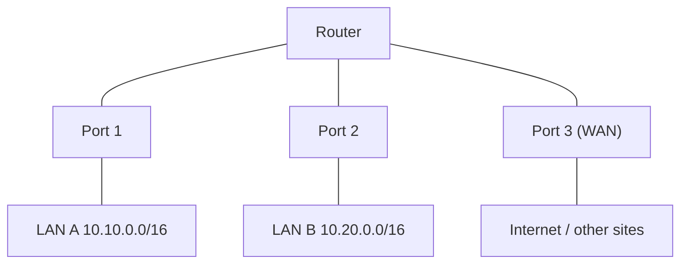
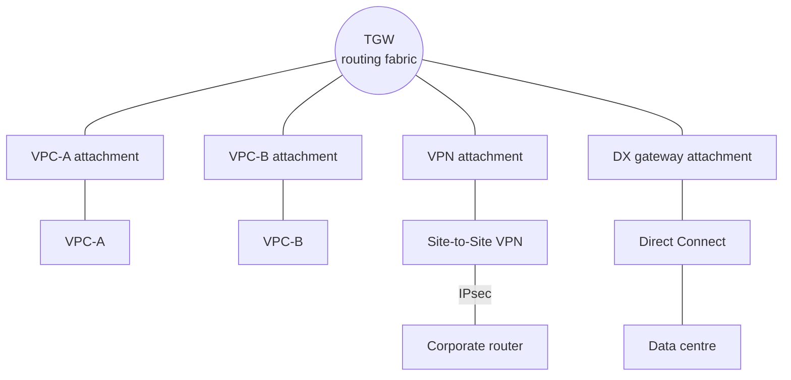
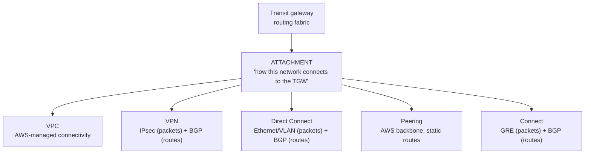
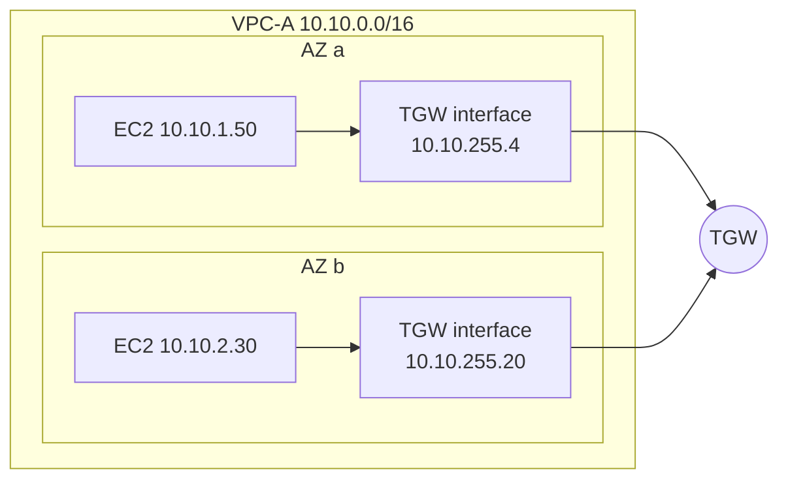
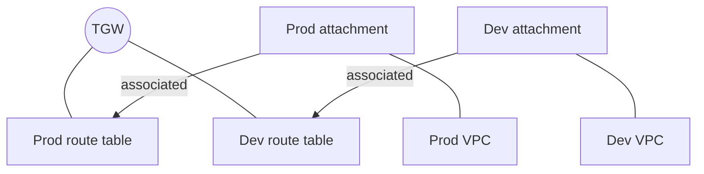
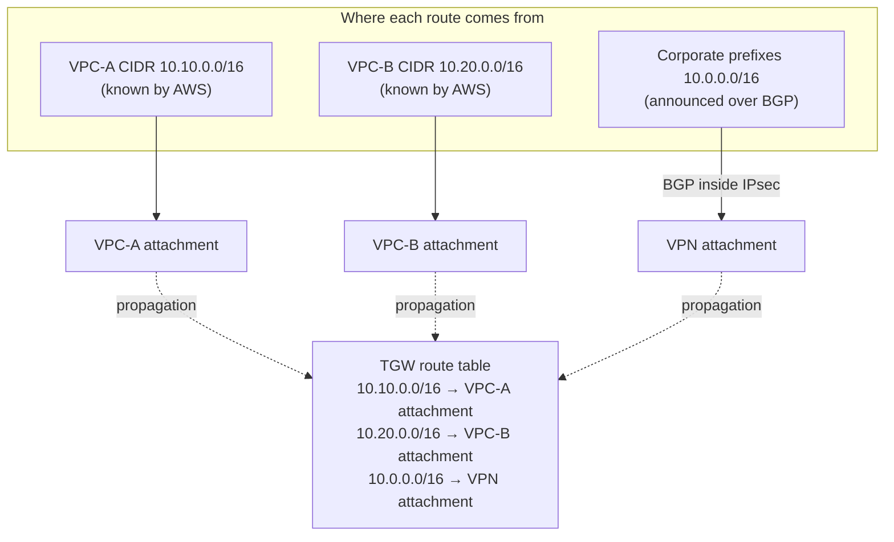

# Transit gateway attachments

> [!abstract] In one sentence
> A transit gateway attachment isn't a protocol or a device: it's the **managed interface** between the TGW's routing domain and one other network (a VPC, a VPN, Direct Connect, another TGW, an SD-WAN appliance), giving the TGW **one uniform thing to route toward** whatever technology is underneath, and one place to hang routing policy (association, propagation), ownership, metrics and billing.

How routing through attachments works step by step is in [[Transit gateway routing]]. This note steps back: what an attachment *is*, what each type runs underneath, and why AWS built the TGW around them.

## Common misconceptions

| Wrong mental model | What's actually true |
|---|---|
| "An attachment speaks some protocol" | The attachment itself speaks nothing. **What runs underneath depends on the type**: nothing visible for a VPC, IPsec + BGP for a VPN, Ethernet + BGP for Direct Connect, GRE + BGP for Connect |
| "The attachment is BGP" | BGP is the route-exchange protocol on some connections (VPN, DX, Connect). The attachment is the object the TGW routes toward. BGP runs *alongside* it, it doesn't replace it |
| "Attaching = propagating" | Attaching connects the network. Propagation is a separate step that installs that network's routes into a TGW route table |
| "An attachment is just a cable" | It's also a **policy boundary**: each attachment is associated with one TGW route table and propagates into chosen ones. That's where segmentation is built |
| "A VPC attachment is somewhere in the VPC, abstractly" | It's concrete: a TGW-managed network interface in **one subnet per AZ** I selected. Traffic enters the TGW through the interface in its own AZ |

## Start from a physical router

A normal router has ports, one per network it connects:



A route says `10.20.0.0/16 → Port 2`. Two different things are going on:

| | Question | Example |
|---|---|---|
| **Route** | "Where should I send this?" | `10.20.0.0/16 → Port 2` |
| **Interface / connection** | "How do I physically or logically reach that network?" | Port 2: Ethernet, an IP address, ARP, a cable |

The route points **at** an interface; the interface does the actual delivery. A routing table without interfaces has nowhere to send anything.

## What a TGW is, and where attachments fit

A transit gateway is a **managed Layer 3 transit router**: it has route tables, and it forwards IP packets between the networks connected to it.

```text
TGW route table
Destination          Next hop
10.10.0.0/16         VPC-A
10.20.0.0/16         VPC-B
10.0.0.0/16          VPN
```

But "VPC-A", "VPC-B" and "VPN" aren't ports with cables. A VPC is a software-defined network, a VPN is a pair of IPsec tunnels, Direct Connect is a VLAN on a fibre in a colocation building. AWS needs **one abstraction** that stands for "the TGW's connection to that network", so routes can point at it the way a router's routes point at an interface. That's the attachment:



Now the route table reads:

```text
10.10.0.0/16  → VPC-A attachment
10.20.0.0/16  → VPC-B attachment
10.0.0.0/16   → VPN attachment
```

which is: **route → attachment → underlying connectivity**. When I see `10.0.0.0/16 → VPN attachment`, I read it as: *"to reach 10.0.0.0/16, send the packet through the TGW's connection toward the VPN-connected network"*.

## What each attachment runs underneath

The useful question isn't "what protocol is the attachment?" but **"what network does this attachment connect, and what mechanisms exist on that connection?"**

| Attachment | Connects the TGW to | Data plane (how packets travel) | Control plane (how the TGW learns routes) | What it can propagate | MTU |
|---|---|---|---|---|---|
| **VPC** | A VPC | AWS-managed, invisible: packets enter/leave through TGW network interfaces in the chosen subnets | None. AWS already knows the VPC's CIDRs | The VPC's CIDRs | 8 500 |
| **VPN** | A [[Site-to-Site VPN]] (2 tunnels) | **IPsec** ESP over the internet (UDP 4500 with NAT-T) | **BGP** inside the tunnels, or static | Prefixes learned by BGP | 1 500 (less inside IPsec) |
| **Direct Connect gateway** | A [[Direct Connect]] gateway, behind it transit VIFs | **Ethernet** (802.1Q VLAN) on the DX connection | **BGP** on each transit VIF | Prefixes my routers announce over DX | 8 500 |
| **Peering** | Another TGW (other region or account) | AWS backbone, encrypted between regions | **None**: static routes only | Nothing | 8 500 |
| **Connect** | An SD-WAN / virtual router appliance | **GRE** tunnels, carried over a VPC or DX "transport" attachment | **BGP** between the TGW and the appliance (a Connect peer) | Prefixes learned by BGP | 8 500 |

Packets bigger than the attachment's MTU are dropped at the TGW, which is why a VPC → VPN path behaves like a 1 500-byte (or smaller) network even if both VPCs use jumbo frames (→ [[VPN#MTU]]).



BGP sits **alongside** the VPN, DX and Connect connectivity as the route-exchange protocol; it doesn't replace the attachment, and VPC and peering attachments don't use it at all (→ [[BGP in AWS hybrid networking]]).

### VPC attachment

What it physically is: when I create it, I pick **one subnet per AZ**, and the TGW places a network interface in each. That interface is the "port".



- An instance's packet for `10.20.0.0/16` hits its subnet route table (`→ tgw`), and the VPC delivers it to the TGW interface **in the same AZ**. An AZ with no attachment subnet has no way in
- The TGW keeps traffic in the AZ it entered when the destination attachment also has that AZ (AZ affinity). For stateful firewalls in an inspection VPC, **appliance mode** pins both directions of a flow to one AZ instead ([[Transit gateway#Inspection VPC: all traffic through a firewall]])
- No BGP, no tunnel, nothing to configure on the VPC side except routes. The TGW knows the VPC's CIDRs because AWS manages both
- Options on the attachment: DNS support (resolve the other VPC's public DNS names to private IPs), IPv6, appliance mode, and security group referencing across the TGW (where enabled)

### VPN attachment

Created by building a Site-to-Site VPN with the TGW as its AWS side. Two layers are visible:

| Layer | Protocol | Job |
|---|---|---|
| Data plane | IPsec (ESP in UDP) | Carries the encrypted packets across the internet, two tunnels |
| Control plane | BGP (or static routes) | Tells the TGW which office prefixes exist, and the office which AWS prefixes exist |
| Into the TGW | The VPN attachment | The object the TGW routes toward: `10.0.0.0/16 → VPN attachment` |

Unique to VPN attachments: **ECMP** across tunnels and connections, and **accelerated VPN** (Global Accelerator edge entry).

### Direct Connect gateway attachment

The TGW doesn't attach to a DX connection directly. The chain is: my router → DX connection (physical, Ethernet) → **transit VIF** (a VLAN + a BGP session) → **Direct Connect gateway** (global) → DX gateway attachment on the TGW. BGP runs on the VIF; the DXGW association decides which prefixes AWS announces back (**allowed prefixes**).

### Peering attachment

TGW ↔ TGW, across regions or accounts. One side requests, the other **accepts**. No routing protocol: I add static routes pointing at the peering attachment on both sides. Dynamic multi-region routing is what AWS Cloud WAN adds.

### Connect attachment

For appliances that want to speak BGP with the TGW directly (SD-WAN routers, virtual firewalls). It runs **on top of** an existing VPC or DX attachment (the *transport*): the appliance and the TGW build **GRE** tunnels over that transport, and a **BGP** session over each GRE tunnel (a *Connect peer*). Why GRE instead of IPsec: the SD-WAN fabric already encrypts, and GRE + BGP gives more bandwidth per peer and dynamic routes without IPsec overhead.

## Why AWS designed it this way

### 1. One routing target for very different technologies

The TGW's route table looks the same whatever is behind each line:

```text
Destination        Attachment
10.10.0.0/16       VPC attachment
10.20.0.0/16       VPC attachment
10.0.0.0/16        VPN attachment
192.168.0.0/16     DX gateway attachment
```

The forwarding logic doesn't need a different architecture per technology: it does a longest-prefix lookup and hands the packet to an attachment. The attachment type deals with IPsec, VLANs, GRE or VPC delivery. This is the classic separation between **routing** (which way?) and **interfaces** (how to get there?).

### 2. A policy boundary

Because every network enters through its own attachment, the TGW can apply policy per attachment:



| Relationship | Meaning |
|---|---|
| **Attachment** | The connectivity relationship: "this network is connected to this TGW" |
| **Association** | Which TGW route table this attachment's **incoming** traffic is looked up in (exactly one) |
| **Propagation** | Which TGW route tables **learn** this attachment's routes (any number) |

Propagation isn't "connect VPC-B to the TGW" (the attachment already did that). It's "install the reachability information that comes with this attachment into this route table". The attachment is what makes route-table association, propagation, isolation, segmentation, centralised inspection, multi-account networking and VPN/DX connectivity expressible at all. So it's more than a cable: it's a **managed connectivity and routing-policy boundary**.

### 3. Ownership across accounts

The TGW usually lives in a central network account and is shared with RAM. The **VPC attachment is created by the VPC's owner** in their account, and the TGW owner **accepts** it (or auto-accept is on). The attachment is the object both accounts can see: who connected what, when, to which TGW.

### 4. Observability and cost per connection

Metrics (bytes and packets in/out, drops for no route or blackhole), flow logs and pricing are all **per attachment**: an hourly charge per attachment plus per GB processed. "How much traffic does the dev VPC send through the hub, and what does it cost?" has a direct answer.

### 5. Scale: one relationship per network

With VPC peering, every pair is a relationship to manage (A–B, A–C, A–D, B–C, B–D, C–D…, `n(n-1)/2`). With a TGW, each network has **one** relationship, its attachment, and the TGW is the central routing fabric:

```text
VPC-A → TGW attachment
VPC-B → TGW attachment
VPC-C → TGW attachment
...
```

## The router analogy, made precise

An attachment is like a port, but don't take it literally: I never configure `interface eth0` / `ip address …` on a TGW, and there's no ARP between the TGW and an attachment. Mapped onto concepts from a router with VRFs:

| Router concept | TGW equivalent |
|---|---|
| Interface / sub-interface (VLAN) | **Attachment** |
| VRF (a separate routing table) | **TGW route table** |
| Putting an interface into a VRF (an interface belongs to exactly one) | **Association** (an attachment uses exactly one table) |
| Connected routes of an interface appearing in its VRF | VPC attachment **propagating** its CIDRs |
| Route leaking / importing a network's routes into several VRFs (route targets in MPLS VPNs) | **Propagation** into several TGW route tables |
| BGP neighbour on an interface | BGP on a VPN, DX or Connect attachment |
| Static route `ip route 10.0.0.0/16 <interface>` | Static TGW route to an attachment |
| `null0` route | **Blackhole** route |

VRFs and why one box can hold separate routing tables: [[Policy-based routing#Stronger isolation: VRFs and network namespaces]]. Interfaces in general (physical, VLAN, tunnel): [[Network interfaces]].

## Putting it together



- **VPC routes**: VPC CIDR → VPC attachment → propagation → TGW route table
- **VPN routes**: corporate prefixes → BGP → VPN → VPN attachment → propagation → TGW route table

Same destination (a TGW route table), same mechanism at the end (propagation), different origins depending on the attachment type.

## Lifecycle

| Step | Detail |
|---|---|
| Create | VPC: `create-transit-gateway-vpc-attachment`. VPN: `create-vpn-connection --transit-gateway-id`. Peering: `create-transit-gateway-peering-attachment`. DX: associate the DX gateway with the TGW. Connect: `create-transit-gateway-connect` on a transport attachment |
| Accept | Cross-account (shared TGW) and peering attachments wait in `pendingAcceptance` until the TGW owner accepts (unless auto-accept is on) |
| Wire | Associate with one route table, propagate into the right ones (automatic only if the default options are on) |
| Route | VPC side: routes to the TGW in subnet route tables. Static TGW routes where nothing propagates |
| Observe | Per-attachment metrics, TGW flow logs, Route Analyzer |
| Delete | Remove routes that point at it first (they'd become blackholes), then delete. Billing stops |

## Advanced problems

| Symptom | Cause | Fix |
|---|---|---|
| Attachment stuck in `pendingAcceptance` | Created from another account, TGW owner hasn't accepted | Accept it, or enable auto-accept for shared attachments |
| Attachment `available` but no traffic | Not associated with any table, or no VPC routes to the TGW | Associate; add VPC routes |
| One AZ can't reach the TGW | No attachment subnet in that AZ | Add a subnet in that AZ |
| Big packets lost VPC → office, fine VPC → VPC | MTU: 8 500 on VPC attachments, 1 500 (minus IPsec) on VPN | Clamp MSS / lower MTU on the path to the VPN |
| Expecting a VPC attachment to "announce" routes by BGP | VPC attachments have no BGP | Propagation of the VPC CIDR is how its routes get in |
| Peered TGW routes missing | Peering doesn't propagate | Static routes to the peering attachment on both sides |
| Stateful firewall drops replies | Flow crosses AZs through the inspection VPC | Appliance mode on that VPC attachment |

## Practice

> [!example]- What protocol does a VPC attachment speak with the TGW?
> None that I configure or see. AWS delivers packets between the VPC and the TGW through the TGW's interfaces in the attachment subnets, and already knows the VPC's CIDRs, so there's no routing protocol either.

> [!example]- A VPN attachment: which protocol carries my packets, and which one tells the TGW about `10.0.0.0/16`?
> IPsec carries the packets. BGP (inside the tunnels) announces `10.0.0.0/16`; propagation then installs it into TGW route tables.

> [!example]- In router terms, what are an attachment, a TGW route table, association and propagation?
> Interface, VRF, putting the interface into a VRF, and importing/leaking a network's routes into VRFs.

> [!example]- Why does a TGW need attachments instead of routing "to VPC-B" directly?
> It needs one uniform object to point routes at, regardless of technology; and that object is where association, propagation, cross-account ownership, metrics and billing attach.

> [!example]- A 9 000-byte packet from VPC-A to VPC-B, and one to the office over VPN. What happens?
> Both are over the TGW's limits for their path: VPC ↔ VPC carries up to 8 500 bytes, VPN 1 500. Larger packets are dropped, so the hosts must use smaller MTU/MSS.

## Easy to get wrong
- Asking "what protocol is the attachment?" instead of "what runs on this connection?"
- Treating BGP and the attachment as the same thing
- Thinking a VPC attachment exchanges routes by BGP
- Thinking attaching also propagates (only with the default options on)
- Forgetting the AZ subnets of a VPC attachment are real interfaces, per AZ
- Forgetting MTU differs per attachment type
- Expecting peering attachments to propagate
- Deleting an attachment that routes still point at

## Related
- Part of:: [[Transit gateway]]
- How routing through them works:: [[Transit gateway routing]], [[BGP in AWS hybrid networking]]
- Concepts:: [[Network interfaces]], [[Routing tables]], [[Policy-based routing]] (VRFs), [[IPsec and IKE]], [[AS and BGP]]
- AWS:: [[Site-to-Site VPN]], [[Direct Connect]], [[Connecting VPCs]], [[VPC]], [[AWS Organizations]]

## Flashcards
#flashcards

What is a transit gateway attachment? :: The managed interface between the TGW's routing domain and one other network, the object TGW routes point at
Route vs attachment, in router terms? :: The route says where to send a packet; the attachment is the interface/connection that delivers it
What does a VPC attachment run underneath? :: AWS-managed delivery through TGW interfaces in one subnet per AZ. No BGP, no tunnel
What does a VPN attachment run underneath? :: IPsec for packets, BGP (or static) for routes
What does a Direct Connect gateway attachment run underneath? :: Ethernet/VLAN on the DX link (transit VIF) for packets, BGP on the VIF for routes, via a DX gateway
What does a Connect attachment run underneath? :: GRE tunnels over a VPC/DX transport attachment, with BGP per Connect peer
How does a peering attachment get routes? :: Static routes only, on both TGWs
Which attachments use BGP? :: VPN (dynamic), Direct Connect gateway, Connect
How does the TGW learn a VPC's routes without BGP? :: AWS knows the VPC CIDRs; the VPC attachment propagates them
Attachment vs association vs propagation? :: Attachment: the connection. Association: which table its incoming traffic uses (one). Propagation: which tables learn its routes (many)
Why did AWS build the TGW around attachments? :: One uniform routing target for different technologies, plus a place for policy (association/propagation), ownership, metrics and billing
Router analogy: attachment, TGW route table, association, propagation? :: Interface, VRF, interface-in-VRF, route leaking/import into VRFs
TGW MTU for VPC/DX/peering/Connect vs VPN? :: 8 500 bytes vs 1 500
How do I read `10.0.0.0/16 → VPN attachment`? :: To reach 10.0.0.0/16, send the packet through the TGW's connection toward the VPN-connected network
Cross-account VPC attachment lifecycle? :: Created by the VPC owner, pendingAcceptance until the TGW owner accepts (or auto-accept)
How is a TGW billed? :: Per attachment-hour plus per GB processed
