# Transit gateway routing

> [!abstract] In one sentence
> A packet through a transit gateway is routed **twice**: the **VPC subnet route table** decides "send this to the TGW", then the **TGW route table** (the one *associated* with the attachment the packet came in on) decides "send it to that attachment". **Propagation** isn't something packets do; it's how routes get *into* a TGW route table without my typing them.

What a TGW is, why it replaces one VGW per VPC, and the designs built on it are in [[Transit gateway]]. This note is about how its routing works, step by step, and how I control it.

## Routing from zero

Before AWS: three things everything below relies on.

### What a route is

A router receives a packet `10.0.1.20 → 10.20.5.10` and has to answer one question: **where do I send this next?** Its routing table answers it:

```text
Destination       Next hop
10.10.0.0/16      Router A
10.20.0.0/16      Router B
10.30.0.0/16      Router C
0.0.0.0/0         Internet
```

`10.20.5.10` is inside `10.20.0.0/16`, so the packet goes to Router B. If several routes match, the **longest prefix** (the most specific one) wins. That's all a routing table is: **destination network → where to send traffic for that network**. More in [[Routing tables]].

### What `/16` covers

`10.20.0.0/16` means "the first 16 bits are fixed": every address from `10.20.0.0` to `10.20.255.255`. So `10.20.5.10` belongs to it, `10.21.0.1` doesn't. A route `10.20.0.0/16 → X` reads: **any traffic for an address inside 10.20.x.x, send toward X**. More in [[IP addressing and subnetting]].

### Destination prefix vs target

In a line like `10.20.0.0/16 → VPC-B attachment`:
- `10.20.0.0/16` is the **destination prefix**: which packets the line is about
- `VPC-B attachment` is the **target** (next hop): where those packets go

The line isn't "a route to VPC-B's router". It's "packets for 10.20.x.x leave through the VPC-B attachment".

### The VPC's `local` route

Every VPC route table starts with one route I can't delete:

```text
VPC-A route table (associated with subnet 10.10.1.0/24)
Destination       Target
10.10.0.0/16      local
```

`local` means: traffic for another address inside this VPC stays inside the VPC. An instance `10.10.1.50` reaches `10.10.2.30` with nothing else configured. Anything outside `10.10.0.0/16` needs another route, or it's dropped.

## Common misconceptions

| Wrong mental model | What's actually true |
|---|---|
| "Turning on propagation makes my VPC send traffic to the TGW" | Propagation only fills the **TGW** route table. The **VPC** route table still needs `10.20.0.0/16 → tgw-…`, which I add myself |
| "Adding `→ tgw` routes to subnet route tables by hand is the beginner way" | It's **required**. A TGW never edits VPC route tables. At scale I make it shorter (a summary route, a prefix list) or generate it (IaC), never "automatic" |
| "Creating the attachment connects the VPCs" | The attachment is the cable. No traffic uses it until a VPC route points at the TGW and a TGW route points at the destination |
| "Once a VPC is attached, everything attached can reach it" | Only if its CIDR is in the route table **associated with the sender's attachment**, and the sender's VPC routes to the TGW, and the replies have the same in the other direction |
| "The TGW route table says which networks can reach me" | It says where traffic **from the attachments associated with it** can go. Reachability is read per sender |
| "Propagation filters which routes are shared" | It's all or nothing per (attachment, route table). I can't pick individual prefixes inside a propagation |
| "A TGW means every VPC can talk to every VPC" | Only with the default settings. With several TGW route tables, any-to-any becomes a choice |

## The pieces, and the four actions

| Action | Question it answers | Configured on | Direction |
|---|---|---|---|
| **Attach** | "Is this network plugged into the TGW?" | A TGW attachment (VPC, VPN, DX gateway, peering, Connect) | Neither, it's the cable |
| **VPC route** | "Which traffic leaving this subnet goes to the TGW?" | The **VPC subnet** route table: `10.20.0.0/16 → tgw-0dd` | Outbound from the VPC |
| **Associate** | "When traffic **enters** the TGW from this attachment, which TGW route table looks it up?" | The attachment ↔ **one** TGW route table | Traffic *from* the attachment |
| **Propagate** | "Which TGW route tables learn the networks **behind** this attachment?" | The attachment → **zero or more** TGW route tables | Traffic *to* the attachment |

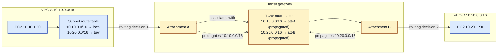

Solid arrows are the packet. Dotted arrows are routing information: they happen once, when the propagation is created, not per packet.

### Four layers to keep apart

| Layer | Question | Example |
|---|---|---|
| 1. **VPC subnet route table** | "Where do packets leave this subnet?" | `10.20.0.0/16 → tgw` |
| 2. **TGW attachment** | "This network is connected to the TGW here" | VPC-A attachment, subnets in AZ a and b |
| 3. **TGW route table** | "Which attached network should receive this packet?" | `10.10.0.0/16 → VPC-A`, `10.20.0.0/16 → VPC-B`, `10.0.0.0/16 → VPN` |
| 4. **Route propagation** | "How do routes get **into** the TGW table?" | VPC CIDRs propagated, BGP routes from the VPN propagated |

Layer 4 is the one that trips people up: **propagation isn't how the packet travels, it's how routing information gets populated.** The packet only ever follows layers 1 → 2 → 3.

## Which side is automatic?

The apparent contradiction: "the TGW can propagate routes automatically" and "after attaching a VPC I must add routes by hand". Both are true, because they're about **two different route tables**.

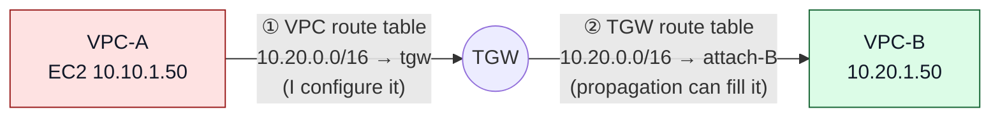

| Side | Route | Means | Automatic? |
|---|---|---|---|
| ① **VPC → TGW** | VPC subnet route table: `10.20.0.0/16 → tgw-0dd` | "Traffic for VPC-B leaves this subnet through the TGW" | **No.** I add it (or my IaC does) |
| ② **TGW → attachment** | TGW route table: `10.20.0.0/16 → attach-B` | "Now that the packet is at the TGW, hand it to VPC-B" | **Yes**, if attach-B propagates into the table associated with the sender |

The same prefix appears in **both** tables, with different targets, at two different points in the journey. Neither one is enough alone.

"Automatic propagation" therefore doesn't mean *"AWS configures everything VPC-A needs to talk to VPC-B"*. It means something much narrower: *"AWS puts the attachment's reachable CIDRs into the TGW route tables I selected"*.

**An analogy.** Room A, a hallway with a receptionist, Room B. A sign in Room A says "to Room B, take the hallway": that's the VPC route ①. The receptionist's directory says "Room B → door 2, Room C → door 3, the VPN → the exit": that's the TGW route table ②. Propagation **keeps the receptionist's directory up to date**. It never puts a sign in Room A.

**Why AWS doesn't automate side ①.** Only I know which traffic should go to the TGW. When I attach VPC-A, should AWS add `0.0.0.0/0 → tgw`? That would suddenly send all its internet traffic through the TGW. Should it add `10.20.0.0/16` and `10.30.0.0/16`? AWS doesn't know whether I want those reachable. VPC-A may send `10.0.0.0/8 → tgw` but `0.0.0.0/0 → NAT gateway` or an internet gateway. So the VPC's own forwarding decision stays mine, and the TGW separately decides `10.20.0.0/16 → VPC-B`, `10.30.0.0/16 → VPC-C`, `10.0.0.0/16 → VPN`.

> [!warning] "Propagation" means two different things in AWS
> - **VGW route propagation** (with a [[Site-to-Site VPN]] on a virtual private gateway): a setting on a **VPC route table**. The VGW's BGP routes **do** appear in the VPC route table by themselves
> - **TGW route propagation**: a setting on a **TGW route table**. It fills only the TGW's table. A VPC route table has no "propagate from TGW" option
>
> Someone who learned VPNs on a VGW first expects the TGW to fill VPC tables too. It doesn't. That's the source of most "but I thought it was automatic" moments.

## Build-up

**Setup.** `VPC-A` (prod) `10.10.0.0/16`, `VPC-B` (dev) `10.20.0.0/16`, later `VPC-C` (data) `10.30.0.0/16` and `VPC-S` (shared) `10.40.0.0/16`. An office `10.0.0.0/16` behind a [[Site-to-Site VPN]] (ASN `65010`). One TGW `tgw-0dd` in `eu-west-1`. Goal at first: VPC-A ↔ VPC-B, VPC-A ↔ office.

### Stage 1: create the attachments

The VPCs aren't physically plugged into the TGW. AWS creates an **attachment** for each: the connection, the "interface", between one network and the TGW.

**Console:** VPC → Transit gateway attachments → **Create transit gateway attachment**:

| Field | Value |
|---|---|
| Attachment type | VPC |
| Transit gateway ID | `tgw-0dd` |
| VPC ID | `vpc-0aa` (VPC-A) |
| Subnet IDs | **One subnet per Availability Zone** I want the TGW to serve |
| Options | DNS support, appliance mode (see [[Transit gateway#Inspection VPC: all traffic through a firewall]]) |

**CLI** (the API is `CreateTransitGatewayVpcAttachment`):

```bash
aws ec2 create-transit-gateway-vpc-attachment \
  --transit-gateway-id tgw-0dd --vpc-id vpc-0aa \
  --subnet-ids subnet-0a1 subnet-0a2          # one per AZ
```

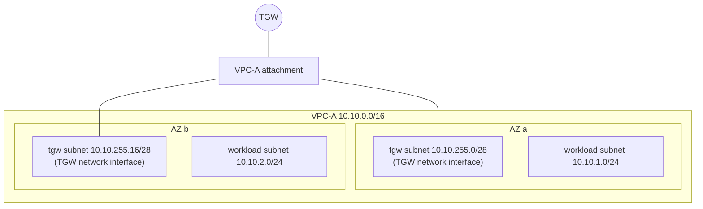

The TGW puts a network interface in each selected subnet. Two consequences:
- An AZ **without** an attachment subnet can't reach the TGW: instances there have nowhere to hand the packet. One subnet in every AZ that has workloads
- Common practice: small dedicated subnets (a `/28` per AZ) just for TGW interfaces, with their own route table, so the attachment's NACLs and routes don't get mixed up with workload subnets

**And now, nothing works yet.** Creating the attachment doesn't mean VPC traffic goes through it. Nothing in VPC-A's route table points at the TGW, and the TGW doesn't yet know where anything is. That's the next two stages.

### Stage 2: do all the routing by hand first

Before automating anything, it helps to configure every route manually once, so it's obvious what propagation will later do for me. Assume the TGW was created with the defaults **off** (Stage 4 explains them), and one TGW route table `rt-main` associated with all attachments.

**VPC side.** VPC-A's subnet route table:

```text
Destination       Target
10.10.0.0/16      local        ← my own VPC
10.20.0.0/16      tgw-0dd      ← VPC-B: hand it to the TGW
10.0.0.0/16       tgw-0dd      ← the office: hand it to the TGW
```

The important line is `10.20.0.0/16 → tgw-0dd`: "if the destination is in VPC-B, send the packet to the transit gateway". VPC-B needs the mirror (`10.10.0.0/16 → tgw-0dd`), or replies never come back.

**TGW side.** Static routes in `rt-main`, typed by me:

```bash
aws ec2 create-transit-gateway-route --transit-gateway-route-table-id tgw-rtb-0main \
  --destination-cidr-block 10.10.0.0/16 --transit-gateway-attachment-id tgw-attach-A
aws ec2 create-transit-gateway-route --transit-gateway-route-table-id tgw-rtb-0main \
  --destination-cidr-block 10.20.0.0/16 --transit-gateway-attachment-id tgw-attach-B
aws ec2 create-transit-gateway-route --transit-gateway-route-table-id tgw-rtb-0main \
  --destination-cidr-block 10.0.0.0/16  --transit-gateway-attachment-id tgw-attach-vpn
```

```text
rt-main
Destination       Attachment         Type
10.10.0.0/16      VPC-A              static
10.20.0.0/16      VPC-B              static
10.0.0.0/16       VPN                static
```

**Follow one packet**, EC2-A `10.10.1.50` → EC2-B `10.20.1.50`:
1. The packet leaves EC2-A and hits **VPC-A's subnet route table**. `10.20.1.50` matches `10.20.0.0/16 → tgw-0dd` (more specific than nothing else; `10.10.0.0/16 local` doesn't match). It goes to the TGW interface in its AZ
2. It enters the TGW through **attachment A**. Attachment A is associated with `rt-main`, so that's the table the TGW reads
3. The TGW asks "which route matches `10.20.1.50`?" → `10.20.0.0/16 → VPC-B attachment`. It sends the packet through attachment B
4. Inside VPC-B, the `local` route delivers it to `10.20.1.50`. The security group must allow `10.10.0.0/16`
5. The reply `10.20.1.50 → 10.10.1.50` does the same in reverse: VPC-B's route table (`10.10.0.0/16 → tgw`), then the table associated with attachment B, then attachment A

It works. But with 50 VPCs, 10 VPNs and 5 Direct Connect links, I'd be maintaining hundreds of TGW routes by hand, and updating them every time a VPC gets a new CIDR or the office adds a network. That's what propagation removes.

### Stage 3: let propagation fill the TGW side

**Propagation = the routes an attachment knows are automatically inserted into a TGW route table.** That's the whole idea; the word sounds more complicated than it is. I don't say "add `10.20.0.0/16 → VPC-B`", I say "**let VPC-B's attachment put its routes into this table**".

What each attachment "knows":

| Attachment | What it propagates |
|---|---|
| VPC | The VPC's CIDR blocks (secondary CIDRs too) |
| VPN with **BGP** | Every prefix the office router announces |
| VPN with **static** routing | Nothing: there's no routing protocol to learn from. Static TGW routes stay |
| Direct Connect gateway | The prefixes announced over the DX BGP session |
| TGW peering | Nothing: peering is static routes only |

**One attachment at a time.** I delete my static routes and enable propagation instead:

```bash
aws ec2 enable-transit-gateway-route-table-propagation \
  --transit-gateway-route-table-id tgw-rtb-0main --transit-gateway-attachment-id tgw-attach-A
```

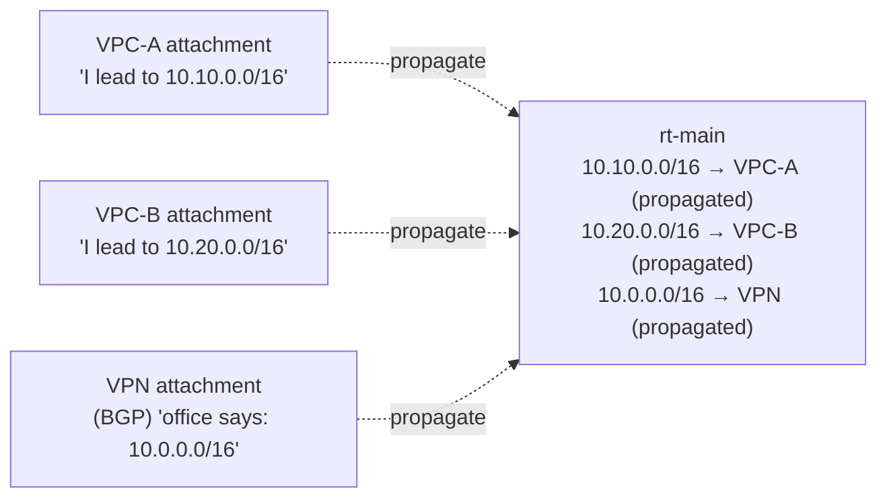

Console: VPC → Transit gateway route tables → select `rt-main` → **Propagations** tab (or Actions) → **Create propagation** → choose the attachment → Create propagation. The same tab shows existing propagations, and **Delete propagation** (`disable-transit-gateway-route-table-propagation`) removes that attachment's routes from the table.

Check what's in the table:

```bash
aws ec2 search-transit-gateway-routes \
  --transit-gateway-route-table-id tgw-rtb-0main \
  --filters Name=state,Values=active
```
```text
10.10.0.0/16   tgw-attach-A     vpc   propagated   active
10.20.0.0/16   tgw-attach-B     vpc   propagated   active
10.0.0.0/16    tgw-attach-vpn   vpn   propagated   active
```

Same table as in Stage 2, but nobody typed it, and when VPC-B gets a secondary CIDR `10.21.0.0/16`, it appears by itself.

#### BGP makes it work in both directions

With a BGP VPN, routing information flows **both ways** without manual routes on either router:

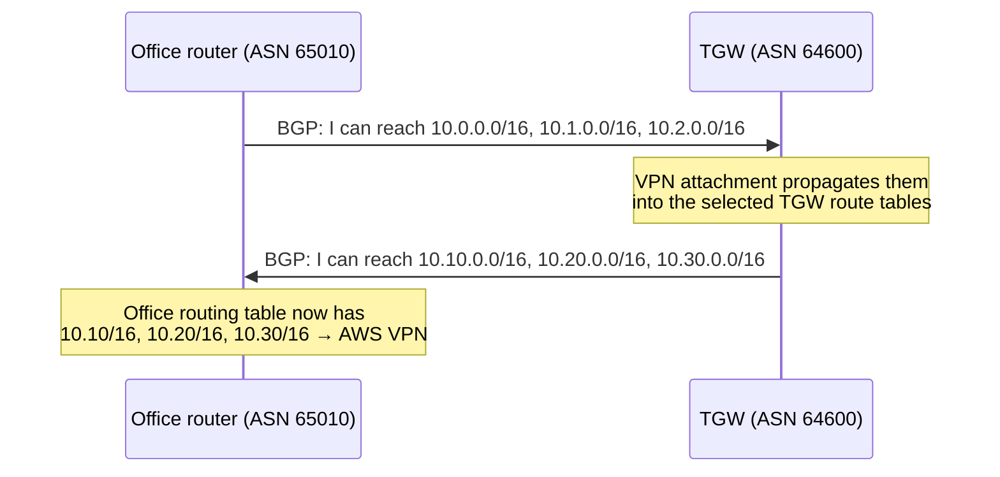

- **Office → AWS**: the office router announces its networks. The VPN attachment propagates them into the TGW route tables I chose
- **AWS → office**: the TGW announces the routes in the TGW route table **associated with the VPN attachment**. So the office learns `10.10.0.0/16 → AWS` etc. without anyone typing them

A new VPC attached and propagated into the VPN's associated table is announced to the office automatically. A new office subnet announced over BGP shows up in the TGW automatically. The only manual part left is still side ①: the VPC route tables. Background on BGP: [[AS and BGP]].

#### Static vs propagated routes in one table

A TGW route table can hold both:

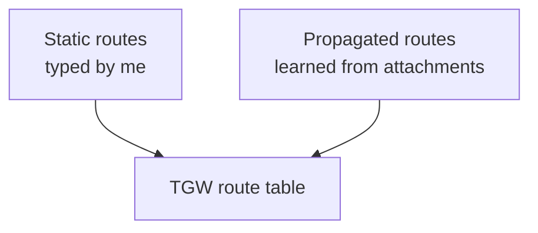

| | Static | Propagated |
|---|---|---|
| Created by | Me: `create-transit-gateway-route` | The attachment, once propagation is enabled |
| Changes when the network changes | No, I update it | Yes: a new VPC CIDR or BGP prefix appears by itself |
| Same prefix in both | **Static wins** | |
| Needed for | Static-routing VPNs, TGW peering, default routes to an inspection VPC, blackholes | VPC CIDRs, BGP from VPN and Direct Connect |

Longest prefix still wins over everything: a propagated `10.20.5.0/24` beats a static `10.20.0.0/16`.

### Stage 4: the default route table settings

When I create a TGW (VPC → Transit gateways → Create), two options decide how much of Stages 2–3 happens by itself. Both are **on** by default:

| Option | Means |
|---|---|
| **Default route table association** | "When I attach something, automatically **associate** it with the default TGW route table" |
| **Default route table propagation** | "When I attach something, automatically **propagate** its routes into the default TGW route table" |

AWS creates that default route table and uses it as both the association and the propagation target:

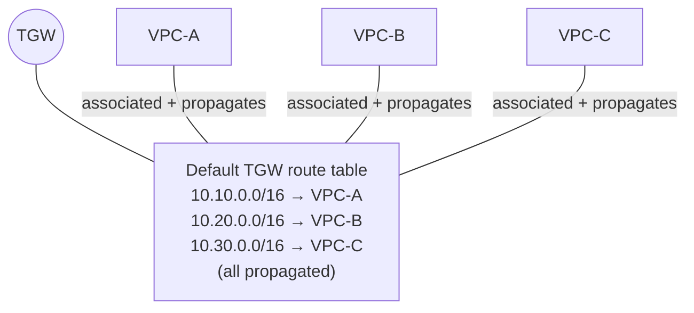

Result: every attachment uses the same table, and every attachment's routes are in it. **Everything reaches everything** (as long as the VPC routes and security groups allow it).

**The lab recipe** (fine for learning, two or three VPCs):
1. Create the TGW, leave both defaults on
2. Create the VPC attachments
3. Add the VPC-side routes: `10.20.0.0/16 → tgw` in VPC-A, `10.10.0.0/16 → tgw` in VPC-B
4. Look at the default TGW route table: both CIDRs are there, type `propagated`. Ping works

That's what I did in [[Connecting VPCs#Option 2: transit gateway]]: the manual `→ tgw` routes I added there were step 3, and they were the correct, required step, not a shortcut.

**The production recipe**: turn both defaults off, so that no new attachment lands anywhere by accident, and place each attachment deliberately (Stage 6):

```bash
aws ec2 create-transit-gateway --description "core" \
  --options AmazonSideAsn=64600,DefaultRouteTableAssociation=disable,DefaultRouteTablePropagation=disable
# or, on an existing TGW (affects new attachments only):
aws ec2 modify-transit-gateway --transit-gateway-id tgw-0dd \
  --options DefaultRouteTableAssociation=disable,DefaultRouteTablePropagation=disable
```

> [!warning] With default association off, a new attachment is associated with **no** table, and its traffic is dropped at the TGW until I associate it. That's a feature (nothing joins the network by accident), but it's also the first thing to check when "the new VPC can't send anything".

### Stage 5: one packet from the office, every table it touches

Office host `10.0.1.20` → `10.20.1.50` in VPC-B, and back.

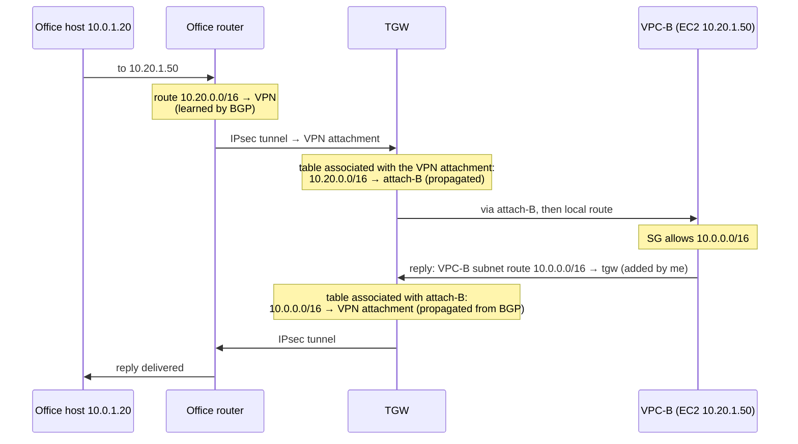

| # | Where | Table / mechanism | Entry used | Learned how |
|---|---|---|---|---|
| 1 | Office router | Its routing table | `10.20.0.0/16 → VPN tunnel` | **BGP**: the TGW announced it (or a static route on the router) |
| 2 | VPN tunnel | IPsec | Encrypted across the internet | [[IPsec and IKE]] |
| 3 | TGW, VPN attachment | The TGW route table **associated with the VPN attachment** | `10.20.0.0/16 → attach-B` | **Propagation** from attach-B |
| 4 | VPC-B | Delivered to the subnet via the `local` route | | |
| 5 | Security group / NACL on `10.20.1.50` | Allow `10.0.0.0/16` | | I add it |
| 6 | Reply leaves VPC-B | VPC-B **subnet** route table | `10.0.0.0/16 → tgw-0dd` | **I add it** |
| 7 | TGW, attach-B | The TGW route table **associated with attach-B** | `10.0.0.0/16 → VPN attachment` | **Propagation** of the VPN's BGP routes |
| 8 | VPN back to the office | | | |

Three things this trace shows:
- **The way there and the way back use different TGW route tables** when the attachments are associated with different tables (step 3 vs step 7). Both must have the route, or the reply dies at the TGW
- **BGP appears twice**: the office tells AWS about `10.0.0.0/16` (it ends up in TGW tables through VPN propagation), and AWS tells the office about the VPC CIDRs
- **What the TGW announces to the office** over BGP is the content of the route table **associated with the VPN attachment**. If VPC-B's CIDR isn't in that table, the office never learns it exists. Association decides what the office *sees*, not only what it can *reach*

### Stage 6: several route tables, and segmentation

Now the interesting part. A TGW can have **many route tables**, and the two relationships decide who reaches whom:

| | Association | Propagation |
|---|---|---|
| Question | "When traffic **arrives from** this attachment, which table does the TGW use to route it?" | "Which tables should **receive the routes** of this attachment?" |
| How many per attachment | Exactly **one** | **Zero, one or many** |
| Controls | Where this attachment's traffic can **go** | Who can **reach** this attachment |

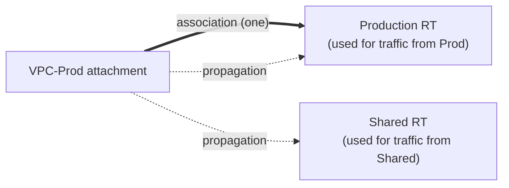

Prod's traffic is looked up in Production RT. Prod's CIDR is in both Production RT (other prod VPCs can reach it) and Shared RT (the shared VPC can reach it, for replies and for its own connections).

#### Why propagate into several tables?

Because one network often has to be reachable from several segments. Goal:

```text
Prod → Shared   ✓        Dev → Shared   ✓
Prod → Dev      ✗        Dev → Prod     ✗
Office → all    ✓
```

The shared VPC must be reachable from Prod **and** from Dev, so it propagates into both of their tables. Prod and Dev don't propagate into each other's tables, so neither has a route to the other. A TGW is therefore more than "a router that connects my VPCs": it's a **central routing policy**. The same idea as a VRF ([[Policy-based routing#Stronger isolation: VRFs and network namespaces]]): one box, several separate routing tables.

#### Design A: one table per segment

| Attachment | Associated with (its traffic is looked up in) | Propagates into (who can reach it) |
|---|---|---|
| VPC-A prod | `rt-prod` | `rt-shared`, `rt-onprem` |
| VPC-B dev | `rt-dev` | `rt-shared`, `rt-onprem` |
| VPC-S shared | `rt-shared` | `rt-prod`, `rt-dev`, `rt-onprem` |
| VPN office | `rt-onprem` | `rt-prod`, `rt-dev`, `rt-shared` |

Read a table's contents by collecting who propagates into it: `rt-prod` receives shared and VPN, **not dev**, so traffic from prod has no route to `10.20.0.0/16` and is dropped **at the TGW**, whatever the security groups say. Same for `rt-dev`. Both reach shared and the office.

```bash
aws ec2 create-transit-gateway-route-table --transit-gateway-id tgw-0dd   # → tgw-rtb-0prod
aws ec2 associate-transit-gateway-route-table \
  --transit-gateway-route-table-id tgw-rtb-0prod --transit-gateway-attachment-id tgw-attach-A
aws ec2 enable-transit-gateway-route-table-propagation \
  --transit-gateway-route-table-id tgw-rtb-0prod --transit-gateway-attachment-id tgw-attach-S
aws ec2 enable-transit-gateway-route-table-propagation \
  --transit-gateway-route-table-id tgw-rtb-0prod --transit-gateway-attachment-id tgw-attach-vpn
```

Console: VPC → Transit gateway route tables → select the table → **Associations** tab → Create association, and **Propagations** tab → Create propagation.

#### Design B: two tables, "spokes" and "services"

When there are many isolated VPCs and only a few things everyone needs (shared services, the office), two tables are enough, whatever the number of VPCs:

| Attachment | Associated with | Propagates into |
|---|---|---|
| Prod VPCs, Dev VPCs (the spokes) | `rt-spokes` | `rt-services` |
| Shared VPC | `rt-services` | `rt-spokes`, `rt-services` |
| VPN office | `rt-services` | `rt-spokes`, `rt-services` |

- `rt-spokes` contains only Shared and the office: any spoke reaches those two, **no spoke reaches another spoke**
- `rt-services` contains everything: Shared and the office reach every spoke (and each other)

A new isolated VPC = associate with `rt-spokes`, propagate into `rt-services`. No other change.

#### Design C: the production layout, with inspection

| Attachment | Associated with | Propagates into |
|---|---|---|
| Prod-A, Prod-B | `rt-prod` | `rt-prod` (prod VPCs reach each other), `rt-firewall` |
| Dev-A, Dev-B | `rt-dev` | `rt-dev`, `rt-firewall` |
| Shared | `rt-shared` | `rt-prod`, `rt-dev`, `rt-firewall` |
| VPN | `rt-vpn` | `rt-prod`, `rt-dev`, `rt-firewall` |
| Inspection VPC (firewall) | `rt-firewall` | nothing |

Plus a **static** `0.0.0.0/0 → inspection attachment` in `rt-prod`, `rt-dev`, `rt-shared` and `rt-vpn` for anything not explicitly routed. Reading it: prod VPCs reach each other directly (`rt-prod` has their routes), everyone reaches shared directly (shared propagates into their tables), and everything else (dev ↔ prod, VPN → anything) matches the default route, goes **through the firewall**, comes back to the TGW on the inspection attachment, and `rt-firewall` (which knows every network) delivers it if the firewall allowed it. Details in [[Transit gateway#Inspection VPC: all traffic through a firewall]].

#### The tools for limiting, from coarse to fine

| Tool | What it does | Limit |
|---|---|---|
| **Don't propagate** into a table | That table has no route to the attachment's networks | All or nothing for that attachment |
| **Disable a propagation** later | `disable-transit-gateway-route-table-propagation`: its routes leave the table | Same |
| **Blackhole static route** | `create-transit-gateway-route --blackhole --destination-cidr-block 10.20.66.0/24`: drop one prefix even if a broader one is propagated | Matches by longest prefix, so it must be at least as specific |
| **More specific static route** | Override where one sub-range goes (e.g. to an inspection VPC) | I maintain it |
| **Filter at the source** | The office router only announces what AWS should know. On Direct Connect, **allowed prefixes** on the DX gateway association decide what AWS announces | Outside the TGW |
| **Summarise** | The office announces `10.0.0.0/12` instead of 40 prefixes | Coarser |

There is **no per-prefix filter inside a propagation**. If I need "propagate these 3 of the office's 40 prefixes", it's done on the office router's BGP export policy, or with static routes.

### Stage 7: 50 networks, and the VPC side gets long

**The worry:** side ① is manual, so with 50 networks behind the TGW, does every subnet route table need 50 routes?

With three VPCs it's clearly per-destination. If VPC-A must reach VPC-B and VPC-C:

```text
VPC-A subnet route table
10.10.0.0/16      local
10.20.0.0/16      tgw-0dd
10.30.0.0/16      tgw-0dd
```

Extend that to 50 networks and it becomes `10.20 → tgw`, `10.30 → tgw`, `10.40 → tgw`… fifty lines, in every route table of every VPC.

**The assumption is mostly right, with one correction.** A VPC route table needs routes for the destinations **this VPC should send to the TGW**, not for every network the TGW knows. The two tables are deliberately decoupled:

| Table | Holds | Example |
|---|---|---|
| TGW route table | Every network it can deliver to (filled by propagation) | 50 routes |
| VPC-A's subnet route table | Only what VPC-A sends to the TGW | 3 routes |
| VPC-B's subnet route table | Same, for VPC-B | 10 routes |
| VPC-C's subnet route table | Same, for VPC-C | 2 routes |

That's useful, not a flaw: the TGW knows 50 networks, VPC-A only knows the ones it needs.

**Choosing the approach:**

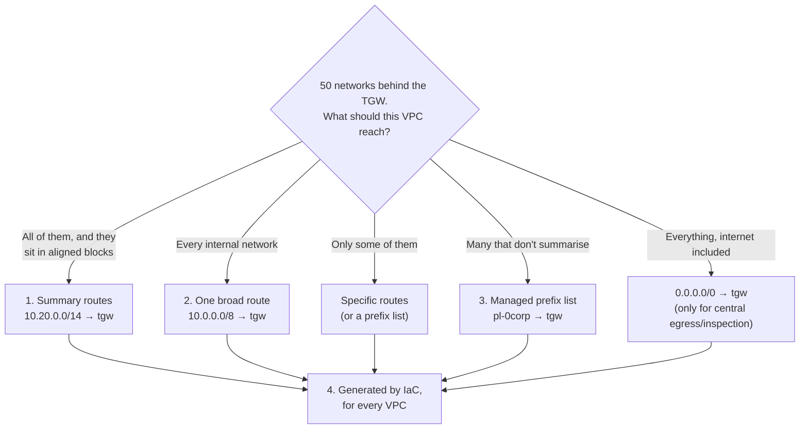

#### 1. Summarise: one route covers many networks

If the destinations sit in one aligned block, one route covers them all. The networks `10.20.0.0/16`, `10.21.0.0/16`, `10.22.0.0/16`, `10.23.0.0/16`:

```text
10.20 = 0001 0100
10.21 = 0001 0101
10.22 = 0001 0110
10.23 = 0001 0111
        ^^^^ ^^      ← first 6 bits of the 2nd octet are shared → 8 + 6 = /14
```

So the exact summary is **`10.20.0.0/14`** (covers `10.20.0.0` – `10.23.255.255`, nothing else). Four routes become one:

```text
10.20.0.0/14      tgw-0dd
```

How summarisation works → [[IP addressing and subnetting#Summarization]].

> [!warning] A summary that's too wide sends traffic to the wrong place
> `10.16.0.0/12` also "covers" those four networks, but it covers `10.16`–`10.31`, sixteen /16s. If `10.24.0.0/16` is a VPN to a partner that this VPC shouldn't reach, or a range that lives somewhere else, it now goes to the TGW too. And `10.20.0.0/16` and `10.50.0.0/16` can't be replaced by `10.0.0.0/8` "because both start with 10": that's 256 /16s. Summarise to the **smallest** block that contains exactly what I mean, or make sure the extra space is unused **by plan**.

#### 2. One broad route for "all internal networks"

If everything private the company owns is inside `10.0.0.0/8`, and this VPC may send anything internal to the TGW:

```text
Destination     Target
10.10.0.0/16    local          ← my own VPC, more specific, still wins
10.0.0.0/8      tgw-0dd        ← every other internal network, current and future
0.0.0.0/0       nat-0ee        ← internet stays on the NAT gateway
```

`10.20.0.0/16`, `10.30.0.0/16`, `10.50.0.0/16`, `10.100.0.0/16` all match `10.0.0.0/8`: one route for 50 networks, and network 51 needs no change. The TGW route table then decides what's actually reachable.

**But only if all of them should go to the TGW.** If VPC-A may only reach 5 of the 50, a broad route hands the other 45 to the TGW too, and it's the TGW tables (Stage 6) that must stop them.

`0.0.0.0/0 → tgw` is a different design: "anything not matched otherwise goes to the TGW", **internet included**. That's right only for **centralised egress or inspection** (a shared NAT/firewall VPC behind the TGW). Otherwise keep `10.0.0.0/8 → tgw` + `0.0.0.0/0 → NAT/IGW`.

#### Specific routes: when the VPC should reach only a few

When VPC-A is allowed to reach 5 networks out of 50, listing exactly those 5 is the honest choice:

```text
Prod VPC subnet route table
10.10.0.0/16      local
10.30.0.0/16      tgw-0dd     # shared
10.40.0.0/16      tgw-0dd     # finance
                              # no route to 10.20.0.0/16 (dev)
```

Prod → Shared ✓, Prod → Finance ✓, Prod → Dev has no route out of the subnet.

#### 3. A managed prefix list: one list, many route tables

When the destinations don't summarise (`10.20.0.0/16`, `10.47.0.0/16`, `172.16.8.0/22`…), put them in a **customer-managed prefix list** and add **one** route `pl-0corp → tgw-0dd`. Adding a network = editing the list, not 200 route tables. The list can be shared across accounts with RAM, and the same list can be used in security group rules.

Catch: a prefix list counts as its **max entries** against the route table's route quota, not as one. And that quota matters at this scale: a VPC route table allows **50 routes** by default (it can be raised, up to about 1 000, at some performance cost).

#### 4. Infrastructure as code

Even when the routes are explicit, I don't click them. A standard VPC module takes "allowed destinations" as input and creates one route per destination per route table:

```hcl
variable "allowed_destinations" {
  default = ["10.30.0.0/16", "10.40.0.0/16"]   # shared, finance
}

resource "aws_route" "to_tgw" {
  for_each               = toset(var.allowed_destinations)
  route_table_id         = aws_route_table.private.id
  destination_cidr_block = each.value
  transit_gateway_id     = var.tgw_id
}
```

A new VPC built from the module gets the same routes as its siblings, and a code review shows every routing change. Same idea in CloudFormation or CDK, plus RAM to share the TGW across accounts and a pipeline to apply it.

#### What actually makes this easy: the address plan

All four approaches only work well if CIDRs were planned so that **one environment = one aligned block**:

| Block | For | Summary route |
|---|---|---|
| `10.0.0.0/12` | Production VPCs (`10.0`–`10.15`) | `10.0.0.0/12` |
| `10.16.0.0/12` | Development VPCs (`10.16`–`10.31`) | `10.16.0.0/12` |
| `10.32.0.0/12` | Shared services | `10.32.0.0/12` |
| `10.48.0.0/12` | Networking / on-prem sites | `10.48.0.0/12` |

With this plan, "dev may reach shared" is one route in each direction, whatever the number of dev VPCs. With VPCs numbered randomly (`10.17.0.0/16`, `10.83.0.0/16`, `10.194.0.0/16`), nothing summarises and every table becomes a long list. CIDR planning isn't an academic exercise: it decides how manageable cloud routing is. AWS **VPC IPAM** hands out CIDRs from such pools so the plan holds as accounts grow. Planning method → [[IP address planning]], and the AWS version (IPAM pools, subnet layout) → [[VPC IP address planning]].

#### Are missing VPC routes a security boundary?

Partly. In the prod example above, prod's traffic to dev has no route out of the subnet. But it's the **weakest** layer:
- Anyone allowed to edit route tables in the prod account can add the route
- A broad `10.0.0.0/8 → tgw` elsewhere quietly undoes it

So the real isolation lives in the **TGW route tables** (Stage 6), backed by security groups, NACLs and, where needed, AWS Network Firewall. VPC routes decide *where traffic goes*, the TGW tables decide *what's reachable*, security groups decide *what's allowed*.

> [!tip] Why the edge still needs routes at all
> If the TGW is meant to solve large-scale networking, why do I still maintain routes in every VPC? Because a central router never removes routing at the edge. In an office: `PC → local router → core router → destination`. The PC (or its local router) still has to know "where do I send this?", and the core router knows "where is that network?". AWS is the same: VPC route table (edge) → TGW (core) → destination. The TGW centralises and automates the **core** knowledge, but each VPC keeps its own routing policy at the edge. The TGW removes the mesh, not the edge.

## The model to memorise

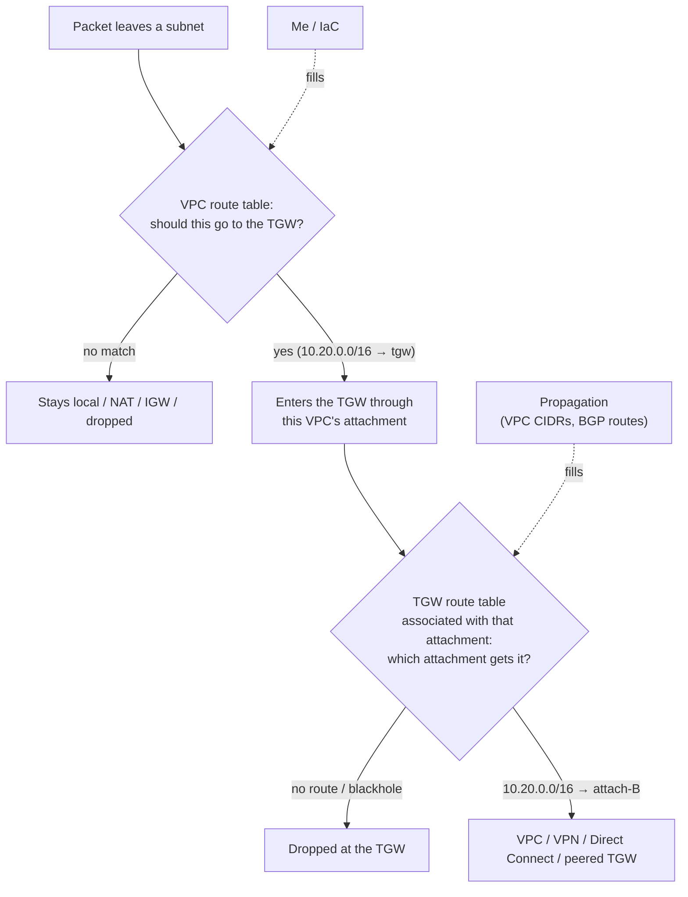

Attachments → associations → propagation → TGW route tables: once those four click, inspection VPCs, multi-account and multi-region designs are just more of the same.

## Advanced problems

| Symptom | Cause | Fix |
|---|---|---|
| Attachment created, nothing flows | No VPC route to the TGW, and/or no TGW route to the destination | Side ① and side ② |
| A new attachment can't send anything | Default association disabled, so it's associated with **no** route table: its traffic is dropped | Associate it with a table |
| New VPC attached, but no one can reach it | Default propagation disabled and no propagation created | Enable propagation into the tables that should reach it |
| Office can't reach a VPC, the VPC can reach the office | The VPC's CIDR isn't in the table associated with the **VPN** attachment, so it isn't announced over BGP and not routable from the VPN | Propagate the VPC into the VPN's associated table |
| Instances in one AZ can't reach the TGW, others can | The VPC attachment has no subnet in that AZ | Add a subnet in that AZ to the attachment |
| SYN arrives, no reply | Return path missing: the destination VPC's subnet route table, or the TGW table associated with the destination's attachment | Check steps 6 and 7 of the Stage 5 trace |
| Dev reaches prod after a change | Someone propagated dev into `rt-prod` (or re-enabled defaults) | Review propagations per table, alarm on changes with [[CloudTrail]] |
| A propagated route is ignored | A static route for the same prefix exists, or a longer prefix elsewhere | Check with `search-transit-gateway-routes` |
| A BGP route from the office doesn't show up | Over the route limits, or the VPN is static (nothing to propagate) | Summarise, or add static routes |
| Can't add more routes to a VPC route table | Route quota (50 by default; a prefix list counts as its max entries) | Summarise, request a quota increase |
| A partner range is reachable "by accident" | An over-wide summary route (`10.16.0.0/12`) in a VPC table | Exact summaries, and block it in the TGW table |

Debugging tools: `search-transit-gateway-routes` (what a table contains), `get-transit-gateway-route-table-associations` / `-propagations` (who's wired to it), **Route Analyzer** in Network Manager (checks a path between two attachments, both directions), VPC Flow Logs and TGW Flow Logs (where packets actually stop).

## Practice

> [!example]- I enabled default propagation and attached two VPCs. Ping fails. The TGW route table shows both CIDRs. What's missing?
> The VPC subnet route tables: `10.20.0.0/16 → tgw` in VPC-A and `10.10.0.0/16 → tgw` in VPC-B. Propagation only fills the TGW table.

> [!example]- In Stage 2, which of the three TGW static routes would propagation replace, and which would it not replace if the VPN were static?
> Propagation replaces the two VPC routes (VPC CIDRs). With a static VPN, there's nothing to propagate: `10.0.0.0/16 → VPN` stays a static route.

> [!example]- Prod is associated with `rt-prod`. Which table decides whether the office can reach prod?
> The table associated with the **VPN** attachment (`rt-onprem`): it must contain prod's CIDR (prod propagates into it). And for the reply, `rt-prod` must contain the office prefixes (the VPN propagates into it).

> [!example]- In design B, I add a new isolated VPC. What do I configure?
> Associate its attachment with `rt-spokes`, propagate it into `rt-services`, and add its VPC routes to the TGW (e.g. the shared and office summaries). Nothing else changes.

> [!example]- I want dev to reach the shared VPC but not one subnet `10.40.9.0/24` in it. How?
> Shared propagates `10.40.0.0/16` into `rt-dev`; add a static **blackhole** route `10.40.9.0/24` in `rt-dev`. The longer prefix wins and drops that traffic. (Security groups in shared should block it too.)

> [!example]- The office announces 40 prefixes. Only 3 should be reachable from the data VPC. Where do I filter?
> Not in the propagation (no per-prefix filter). Either don't propagate the VPN into the data VPC's table and add 3 static routes to the VPN attachment, or filter on the office router's BGP export (but that affects every table).

> [!example]- Summarise `10.40.0.0/16` to `10.47.0.0/16` in one route.
> They share the first 5 bits of the second octet (`00101xxx`): `10.40.0.0/13`.

> [!example]- VPC-A has `10.0.0.0/8 → tgw` and `0.0.0.0/0 → nat`. It sends to `8.8.8.8` and to `10.99.0.5`. Where does each go?
> `8.8.8.8` matches only `0.0.0.0/0` → NAT gateway. `10.99.0.5` matches `10.0.0.0/8` (longer than `/0`) → TGW, where the TGW table decides (and drops it if no route).

## Easy to get wrong
- Thinking propagation touches VPC route tables. It never does
- Thinking the manual `→ tgw` routes in subnet route tables are a beginner shortcut. They're required
- Thinking creating the attachment is enough
- Confusing VGW route propagation (fills VPC tables) with TGW propagation (fills TGW tables)
- Reading a TGW route table as "who can reach this", when it's "where traffic **from** the associated attachments can go"
- Forgetting the **return** direction uses a **different** TGW table
- Forgetting that what the office learns over BGP is the VPN attachment's associated table
- Disabling default association and leaving a new attachment unassociated
- Missing an AZ in the VPC attachment's subnets
- Expecting to filter individual prefixes inside a propagation
- A static route silently shadowing a propagated one
- Over-wide summaries ("they all start with 10")
- `0.0.0.0/0 → tgw` when only internal traffic was meant to go there

## Related
- Part of:: [[Transit gateway]]
- Depends on:: [[Routing tables]], [[IP addressing and subnetting]], [[IP address planning]], [[VPC IP address planning]], [[AS and BGP]], [[VPC]]
- Similar to:: VRFs in [[Policy-based routing]] (one router, several separate tables)
- AWS:: [[Connecting VPCs]], [[Site-to-Site VPN]], [[Direct Connect]], [[Hybrid connectivity architectures]], [[Security groups]], [[CloudTrail]]

## Flashcards
#flashcards

What does a route say? :: Destination prefix → next hop: traffic for addresses in that prefix goes there. Longest prefix wins
In `10.20.0.0/16 → VPC-B attachment`, what's the destination and what's the target? :: Destination prefix 10.20.0.0/16, target the VPC-B attachment
What does the `local` route in a VPC route table do? :: Keeps traffic for the VPC's own CIDR inside the VPC
The two routing decisions for VPC-A → TGW → VPC-B? :: VPC-A's subnet route table sends the destination to the TGW, then the TGW route table associated with VPC-A's attachment picks VPC-B's attachment
Does creating a VPC attachment make traffic flow? :: No. It's the cable. A VPC route to the TGW and a TGW route to the destination are both needed
Does TGW route propagation add routes to VPC route tables? :: No. It only fills TGW route tables. VPC routes to the TGW are added by me
Is adding `10.20.0.0/16 → tgw` to subnet route tables by hand a beginner approach? :: No, it's required. AWS never adds VPC routes to a TGW
Which side of a VPC → TGW → VPC path can propagation automate? :: Only the TGW route table (10.20.0.0/16 → attach-B). The VPC route (10.20.0.0/16 → tgw) is always configured by me
Why doesn't AWS add VPC routes to the TGW automatically? :: Only I know which traffic should go to the TGW (e.g. 10.0.0.0/8 → tgw but 0.0.0.0/0 → NAT). Auto routes could hijack internet traffic
VGW route propagation vs TGW route propagation? :: VGW propagation fills VPC route tables with VPN routes. TGW propagation only fills TGW route tables
What is a TGW attachment? :: The connection of one network (VPC, VPN, DX gateway, peering, Connect) to the TGW
API / console path to create a VPC attachment? :: CreateTransitGatewayVpcAttachment; VPC → Transit gateway attachments → Create, type VPC, one subnet per AZ
Why one subnet per AZ in a VPC attachment? :: The TGW gets an interface there. Instances in an AZ without one can't reach the TGW
What is route propagation, in one line? :: Routes an attachment knows are automatically inserted into a TGW route table
What does a VPC attachment propagate? :: The VPC's CIDR blocks
What does a BGP VPN attachment propagate? :: The prefixes the office router announces over BGP
What does a static VPN attachment propagate? :: Nothing. Add static TGW routes to it
How do you create a propagation in the console? :: Transit gateway route tables → select table → Propagations → Create propagation → choose attachment
TGW association? :: The one TGW route table used to look up traffic coming in from an attachment
TGW propagation? :: The attachment installs the networks behind it into a TGW route table. One attachment can propagate into many tables
Why propagate one attachment into several tables? :: So it's reachable from several segments (e.g. shared services reachable from prod and dev)
What do the two "default route table" options on a TGW do? :: Automatically associate new attachments with, and propagate them into, the default route table
Result of leaving both TGW defaults on? :: One table, every attachment in it: everything reaches everything
Lab vs production TGW setup? :: Lab: defaults on, add VPC routes. Production: defaults off, one table per segment, explicit associations and propagations
What happens to traffic from an attachment associated with no route table? :: It's dropped
Static vs propagated route for the same prefix in a TGW table? :: Static wins (longest prefix still comes first)
What does a TGW announce to the office over a BGP VPN? :: The routes in the TGW route table associated with the VPN attachment
Two-table "spokes/services" design? :: Spokes associate with rt-spokes (only shared + office) and propagate into rt-services (everything). Spokes can't reach each other
Can I filter individual prefixes inside a TGW propagation? :: No. Choose which tables it goes into, use static/blackhole routes, or filter at the BGP source
How to block one subnet inside a propagated range? :: A more specific static blackhole route in that TGW table
Does a VPC route table need a route for every network attached to the TGW? :: No, only for the destinations that VPC should send to the TGW. The TGW table can know 50 networks while a VPC has 3 routes
Exact summary of 10.20.0.0/16 to 10.23.0.0/16? :: 10.20.0.0/14 (10.16.0.0/12 also covers them but includes 12 other /16s)
Risk of an over-wide summary route to the TGW? :: Unrelated ranges inside it are sent to the TGW too
10.0.0.0/8 → tgw vs 0.0.0.0/0 → tgw? :: The first sends all internal traffic to the TGW, internet stays on NAT/IGW. The second also sends internet traffic: only for centralised egress/inspection
How do you route to many non-summarisable networks without long VPC tables? :: A customer-managed prefix list as the route destination (counts as its max entries against the route quota)
Default route quota of a VPC route table? :: 50 routes (adjustable)
How to avoid typing VPC routes for many VPCs? :: Infrastructure as code: a VPC module creating one route per allowed destination
What makes VPC-side routes short at scale? :: An address plan where each environment is one aligned block, so one summary route covers it
Are missing VPC routes enough to isolate prod from dev? :: No, weakest layer. Isolation belongs in TGW route tables, plus SGs/NACLs/firewall
Why does the VPC edge still need routes if the TGW is the central router? :: Like PC → local router → core router: the edge decides what to hand to the core, the core knows where networks are
Where is isolation enforced in a TGW design: VPC tables or TGW tables? :: TGW route tables (and security groups). A VPC route to the TGW is harmless if the TGW has no route onward
