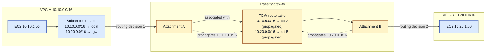
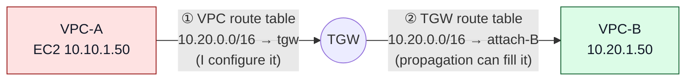

# Transit gateway routing

> [!abstract] In one sentence
> A packet through a transit gateway is routed **twice**: the **VPC subnet route table** decides "send this to the TGW", then the **TGW route table** (the one *associated* with the attachment the packet came in on) decides "send it to that attachment". **Propagation** isn't something packets do; it's how routes get *into* a TGW route table without my typing them.

What a TGW is and the designs built on it are in [[Transit gateway]]. This note is only about how its routing works and how I control it. What a route is (destination prefix → next hop, longest prefix wins) is in [[Routing tables]], and what `/16` covers in [[IP addressing and subnetting]].

## Common misconceptions

| Wrong mental model | What's actually true |
|---|---|
| "Turning on propagation makes my VPC send traffic to the TGW" | Propagation only fills the **TGW** route table. The **VPC** route table still needs `10.20.0.0/16 → tgw-…`, which I add myself |
| "Adding `→ tgw` routes to subnet route tables by hand is the beginner way" | It's **required**. A TGW never edits VPC route tables. At scale I make it shorter (a summary route, a prefix list), not automatic |
| "Once a VPC is attached, everything attached can reach it" | Only if its CIDR is in the route table **associated with the sender's attachment**, and the sender's VPC routes to the TGW, and the replies have the same in the other direction |
| "The TGW route table says which networks can reach me" | It says where traffic **from the attachments associated with it** can go. Reachability is read per sender |
| "Propagation filters which routes are shared" | It's all or nothing per (attachment, route table). I can't pick individual prefixes inside a propagation |
| "`10.20.0.0/16 → VPC-B` is a route to VPC-B's router" | `10.20.0.0/16` is the **destination prefix**, `VPC-B attachment` is the **target**: "anything inside 10.20.x.x leaves the TGW through the VPC-B attachment" |

## Four separate actions

Most confusion comes from mixing these up. Each one answers a different question, and each one is configured in a different place.

| Action | Question it answers | Configured on | Direction |
|---|---|---|---|
| **Attach** | "Is this network plugged into the TGW?" | A TGW attachment (VPC, VPN, DX gateway, peering, Connect) | Neither, it's the cable |
| **VPC route** | "Which traffic leaving this subnet goes to the TGW?" | The **VPC subnet** route table: `10.20.0.0/16 → tgw-0dd` | Outbound from the VPC |
| **Associate** | "When traffic **enters** the TGW from this attachment, which TGW route table looks it up?" | The attachment ↔ **one** TGW route table | Traffic *from* the attachment |
| **Propagate** | "Which TGW route tables learn the networks **behind** this attachment?" | The attachment → **zero or more** TGW route tables | Traffic *to* the attachment |



Solid arrows are the packet. Dotted arrows are routing information: they happen once, when the propagation is created, not per packet.

## Which side is automatic?

The short answer to "propagation is automatic, but I still had to add routes by hand?": **one side can be automated, the other is always mine.**



| Side | Route | Means | Automatic? |
|---|---|---|---|
| ① **VPC → TGW** | VPC subnet route table: `10.20.0.0/16 → tgw-0dd` | "Traffic for VPC-B leaves this subnet through the TGW" | **No.** I add it (or my IaC does) |
| ② **TGW → attachment** | TGW route table: `10.20.0.0/16 → attach-B` | "Now that the packet is at the TGW, hand it to VPC-B" | **Yes**, if attach-B propagates into the table associated with the sender |

The same prefix appears in **both** tables, with different targets, at two different points in the journey. Neither one is enough alone.

**An analogy.** Room A, a hallway with a receptionist, Room B. A sign in Room A says "to Room B, take the hallway": that's the VPC route ①. The receptionist's directory says "Room B → door 2, Room C → door 3, the VPN → the exit": that's the TGW route table ②. Propagation **keeps the receptionist's directory up to date**. It never puts a sign in Room A.

**Why AWS doesn't automate side ①.** Only I know which traffic should go to the TGW. VPC-A may send `10.0.0.0/8 → tgw` but `0.0.0.0/0 → NAT gateway` (or an internet gateway, or an inspection VPC). If attaching a VPC rewrote its route tables, attaching could silently move its internet traffic.

> [!warning] "Propagation" means two different things in AWS
> - **VGW route propagation** (with a [[Site-to-Site VPN]] on a virtual private gateway): a setting on a **VPC route table**. The VGW's BGP routes **do** appear in the VPC route table by themselves
> - **TGW route propagation**: a setting on a **TGW route table**. It fills only the TGW's table. A VPC route table has no "propagate from TGW" option
>
> Someone who learned VPNs on a VGW first expects the TGW to fill VPC tables too. It doesn't. That's the source of most "but I thought it was automatic" moments.

## Build-up

**Setup.** `VPC-A` (prod) `10.10.0.0/16`, `VPC-B` (dev) `10.20.0.0/16`, later `VPC-S` (shared) `10.30.0.0/16`, and an office `10.0.0.0/16` behind a [[Site-to-Site VPN]] with BGP (ASN `65010`). One TGW `tgw-0dd` in `eu-west-1`.

### Stage 1: two VPCs, default settings

**Create the TGW.** Console: VPC → Transit gateways → Create. Two options decide how much is automatic:

| Option | When on (the default) |
|---|---|
| **Default route table association** | Every new attachment is associated with the TGW's default route table |
| **Default route table propagation** | Every new attachment propagates its routes into the default route table |

Leave both on for now.

**Create the attachments.** Console: VPC → Transit gateway attachments → Create → type **VPC**, pick the TGW, the VPC, and **one subnet per AZ**:

```bash
aws ec2 create-transit-gateway-vpc-attachment \
  --transit-gateway-id tgw-0dd --vpc-id vpc-0aa \
  --subnet-ids subnet-0a1 subnet-0a2          # one per AZ
```

The TGW puts a network interface in each of those subnets. Two consequences:
- An AZ **without** an attachment subnet can't reach the TGW: instances there have nowhere to hand the packet. One subnet in every AZ that has workloads
- Common practice: small dedicated subnets (a `/28` per AZ) just for TGW interfaces, with their own route table, so the attachment's NACLs and routes don't get mixed up with workload subnets

**Look at the TGW route table.** With default propagation, it fills itself:

```bash
aws ec2 search-transit-gateway-routes \
  --transit-gateway-route-table-id tgw-rtb-0default \
  --filters Name=state,Values=active
```
```text
10.10.0.0/16   tgw-attach-A   vpc   propagated   active
10.20.0.0/16   tgw-attach-B   vpc   propagated   active
```

For a VPC attachment, "its routes" are the VPC's CIDR blocks (secondary CIDRs too).

**Ping still fails.** Nothing in either VPC sends anything to the TGW. Add, in VPC-A's subnet route tables:

```text
10.20.0.0/16 → tgw-0dd
```

and in VPC-B's: `10.10.0.0/16 → tgw-0dd`. Now it works. That manual step is the one I did in [[Connecting VPCs#Option 2: transit gateway]], and it's not a shortcut: AWS can't guess which traffic I want to hand to the TGW (`0.0.0.0/0 → tgw` would send all internet traffic there), so it never adds VPC routes itself.

### Stage 2: one packet from the office, every table it touches

Office host `10.0.1.20` → `10.20.1.50` in VPC-B, and back.

| # | Where | Table / mechanism | Entry used | Learned how |
|---|---|---|---|---|
| 1 | Office router | Its routing table | `10.20.0.0/16 → VPN tunnel` | **BGP**: the TGW announced it |
| 2 | VPN tunnel | IPsec | Encrypted across the internet | [[IPsec and IKE]] |
| 3 | TGW, VPN attachment | The TGW route table **associated with the VPN attachment** | `10.20.0.0/16 → attach-B` | **Propagation** from attach-B |
| 4 | VPC-B | Delivered to the subnet via the `local` route | | |
| 5 | Security group / NACL on `10.20.1.50` | Allow `10.0.0.0/16` | | I add it |
| 6 | Reply leaves VPC-B | VPC-B **subnet** route table | `10.0.0.0/16 → tgw-0dd` | **I add it** |
| 7 | TGW, attach-B | The TGW route table **associated with attach-B** | `10.0.0.0/16 → VPN attachment` | **Propagation** of the VPN's BGP routes |
| 8 | VPN back to the office | | | |

Three things this table shows:
- **The way there and the way back use different TGW route tables** when the attachments are associated with different tables (step 3 vs step 7). Both must have the route, or the reply dies at the TGW
- **BGP appears twice**: the office tells AWS about `10.0.0.0/16` (it ends up in TGW tables through VPN propagation), and AWS tells the office about the VPC CIDRs
- **What the TGW announces to the office** over BGP is the content of the route table **associated with the VPN attachment**. If VPC-B's CIDR isn't in that table, the office never learns it exists. Association decides what the office *sees*, not only what it can *reach*

### Stage 3: static vs propagated routes

A TGW route table can hold both:

| | Static | Propagated |
|---|---|---|
| Created by | Me: `create-transit-gateway-route` | The attachment, once propagation is enabled |
| Changes when the network changes | No, I update it | Yes: a new VPC CIDR or BGP prefix appears by itself |
| Same prefix in both | **Static wins** | |
| Needed for | Static-routing VPNs (no BGP, so nothing to propagate), TGW peering (static only), default routes to an inspection VPC, blackholes | VPC CIDRs, BGP from VPN and Direct Connect |

```bash
# a static VPN gives the TGW nothing to propagate, so I add the office route myself
aws ec2 create-transit-gateway-route --transit-gateway-route-table-id tgw-rtb-0prod \
  --destination-cidr-block 10.0.0.0/16 --transit-gateway-attachment-id tgw-attach-vpn
```

Longest prefix still wins over everything: a propagated `10.20.5.0/24` beats a static `10.20.0.0/16`.

### Stage 4: limiting propagation (prod and dev stop seeing each other)

With the defaults, every attachment propagates into one table that every attachment uses: a flat network, dev reaches prod. To segment:

**1. Turn the automation off** (for new attachments; existing ones keep what they have):

```bash
aws ec2 modify-transit-gateway --transit-gateway-id tgw-0dd \
  --options DefaultRouteTableAssociation=disable,DefaultRouteTablePropagation=disable
```

**2. Create one route table per segment** and decide, for each attachment, one association and its propagations:

| Attachment | Associated with (its traffic is looked up in) | Propagates into (who can reach it) |
|---|---|---|
| VPC-A prod | `rt-prod` | `rt-shared`, `rt-onprem` |
| VPC-B dev | `rt-dev` | `rt-shared`, `rt-onprem` |
| VPC-S shared | `rt-shared` | `rt-prod`, `rt-dev`, `rt-onprem` |
| VPN office | `rt-onprem` | `rt-prod`, `rt-dev`, `rt-shared` |

Read a column to check a rule: `rt-prod` receives propagations from shared and VPN, **not dev**, so traffic from prod has no route to `10.20.0.0/16` and is dropped at the TGW. Same for `rt-dev`. Both can reach shared and the office.

```bash
aws ec2 create-transit-gateway-route-table --transit-gateway-id tgw-0dd   # → tgw-rtb-0prod
aws ec2 associate-transit-gateway-route-table \
  --transit-gateway-route-table-id tgw-rtb-0prod --transit-gateway-attachment-id tgw-attach-A
aws ec2 enable-transit-gateway-route-table-propagation \
  --transit-gateway-route-table-id tgw-rtb-0prod --transit-gateway-attachment-id tgw-attach-S
aws ec2 enable-transit-gateway-route-table-propagation \
  --transit-gateway-route-table-id tgw-rtb-0prod --transit-gateway-attachment-id tgw-attach-vpn
```

Console equivalent: VPC → Transit gateway route tables → select the table → **Associations** tab → Create association, and **Propagations** tab → Create propagation (or Actions → Create propagation).

**3. The tools for limiting, from coarse to fine:**

| Tool | What it does | Limit |
|---|---|---|
| **Don't propagate** into a table | That table has no route to the attachment's networks | All or nothing for that attachment |
| **Disable a propagation** later | `disable-transit-gateway-route-table-propagation`: its routes leave the table | Same |
| **Blackhole static route** | `create-transit-gateway-route --blackhole --destination-cidr-block 10.20.66.0/24`: drop one prefix even if a broader one is propagated | Matches by longest prefix, so it must be at least as specific |
| **More specific static route** | Override where one sub-range goes (e.g. to an inspection VPC) | I maintain it |
| **Filter at the source** | The office router only announces what AWS should know. On Direct Connect, **allowed prefixes** on the DX gateway association decide what AWS announces | Outside the TGW |
| **Summarise** | The office announces `10.0.0.0/12` instead of 40 prefixes | Coarser |

There is **no per-prefix filter inside a propagation**. If I need "propagate these 3 of the office's 40 prefixes", it's done on the office router's BGP export policy, or with static routes.

### Stage 5: keeping the VPC side short

The VPC side never becomes automatic, but it doesn't have to be long:
- **One summary route**: if every private network the company owns is inside `10.0.0.0/8`, then `10.0.0.0/8 → tgw` in every subnet route table covers all VPCs and offices, current and future. The `local` route for the VPC's own CIDR is more specific, so it still wins inside the VPC
- **A managed prefix list** as the destination (`pl-0corp → tgw`): one list maintained centrally, referenced by many route tables, shareable across accounts with RAM
- Infrastructure as code (Terraform, CloudFormation) so a new subnet gets the route automatically

Isolation is then done in the **TGW** route tables, not by leaving routes out of VPC tables: a VPC route that points at the TGW is harmless when the TGW has no route onward.

## Advanced problems

| Symptom | Cause | Fix |
|---|---|---|
| A new attachment can't send anything | Default association disabled, so it's associated with **no** route table: its traffic is dropped | Associate it with a table |
| New VPC attached, but no one can reach it | Default propagation disabled and no propagation created | Enable propagation into the tables that should reach it |
| Office can't reach a VPC, the VPC can reach the office | The VPC's CIDR isn't in the table associated with the **VPN** attachment, so it isn't announced over BGP and not routable from the VPN | Propagate the VPC into the VPN's associated table |
| Instances in one AZ can't reach the TGW, others can | The VPC attachment has no subnet in that AZ | Add a subnet in that AZ to the attachment |
| SYN arrives, no reply | Return path missing: the destination VPC's subnet route table, or the TGW table associated with the destination's attachment | Check steps 6 and 7 of the trace |
| Dev reaches prod after a change | Someone propagated dev into `rt-prod` (or re-enabled defaults) | Review propagations per table, alarm on changes with [[CloudTrail]] |
| A propagated route is ignored | A static route for the same prefix exists, or a longer prefix elsewhere | Check with `search-transit-gateway-routes` |
| A BGP route from the office doesn't show up | Over the route limits, or the VPN is static (nothing to propagate) | Summarise, or add static routes |

Debugging tools: `search-transit-gateway-routes` (what a table contains), `get-transit-gateway-route-table-associations` / `-propagations` (who's wired to it), **Route Analyzer** in Network Manager (checks a path between two attachments, both directions), VPC Flow Logs and TGW Flow Logs (where packets actually stop).

## Practice

> [!example]- I enabled default propagation and attached two VPCs. Ping fails. The TGW route table shows both CIDRs. What's missing?
> The VPC subnet route tables: `10.20.0.0/16 → tgw` in VPC-A and `10.10.0.0/16 → tgw` in VPC-B. Propagation only fills the TGW table.

> [!example]- Prod is associated with `rt-prod`. Which table decides whether the office can reach prod?
> The table associated with the **VPN** attachment (`rt-onprem`): it must contain prod's CIDR (prod propagates into it). And for the reply, `rt-prod` must contain the office prefixes (the VPN propagates into it).

> [!example]- I want dev to reach the shared VPC but not one subnet `10.30.9.0/24` in it. How?
> Shared propagates `10.30.0.0/16` into `rt-dev`; add a static **blackhole** route `10.30.9.0/24` in `rt-dev`. The longer prefix wins and drops that traffic. (Security groups in shared should block it too.)

> [!example]- The office announces 40 prefixes. Only 3 should be reachable from the data VPC. Where do I filter?
> Not in the propagation (no per-prefix filter). Either don't propagate the VPN into the data VPC's table and add 3 static routes to the VPN attachment, or filter on the office router's BGP export (but that affects every table).

> [!example]- Static VPN (no BGP) attached to a TGW with default propagation on. Will the office range appear in the TGW table?
> No. A static VPN has no routes to propagate. Add a static TGW route `10.0.0.0/16 → VPN attachment`.

## Easy to get wrong
- Thinking propagation touches VPC route tables. It never does
- Thinking the manual `→ tgw` routes in subnet route tables are a beginner shortcut. They're required
- Reading a TGW route table as "who can reach this", when it's "where traffic **from** the associated attachments can go"
- Forgetting the **return** direction uses a **different** TGW table
- Forgetting that what the office learns over BGP is the VPN attachment's associated table
- Disabling default association and leaving a new attachment unassociated
- Missing an AZ in the VPC attachment's subnets
- Expecting to filter individual prefixes inside a propagation
- A static route silently shadowing a propagated one

## Related
- Part of:: [[Transit gateway]]
- Depends on:: [[Routing tables]], [[IP addressing and subnetting]], [[AS and BGP]], [[VPC]]
- Similar to:: VRFs in [[Policy-based routing]] (one router, several separate tables)
- AWS:: [[Connecting VPCs]], [[Site-to-Site VPN]], [[Direct Connect]], [[Hybrid connectivity architectures]], [[CloudTrail]]

## Flashcards
#flashcards

The two routing decisions for VPC-A → TGW → VPC-B? :: VPC-A's subnet route table sends the destination to the TGW, then the TGW route table associated with VPC-A's attachment picks VPC-B's attachment
Does TGW route propagation add routes to VPC route tables? :: No. It only fills TGW route tables. VPC routes to the TGW are added by me
Is adding `10.20.0.0/16 → tgw` to subnet route tables by hand a beginner approach? :: No, it's required. AWS never adds VPC routes to a TGW
What is a TGW attachment? :: The connection of one network (VPC, VPN, DX gateway, peering, Connect) to the TGW
TGW association? :: The one TGW route table used to look up traffic coming in from an attachment
TGW propagation? :: The attachment installs the networks behind it into a TGW route table. One attachment can propagate into many tables
What does a VPC attachment propagate? :: The VPC's CIDR blocks
What does a BGP VPN attachment propagate? :: The prefixes the office router announces over BGP
What does a static VPN attachment propagate? :: Nothing. Add static TGW routes to it
What do the two "default route table" options on a TGW do? :: Automatically associate new attachments with, and propagate them into, the default route table
What happens to traffic from an attachment associated with no route table? :: It's dropped
Static vs propagated route for the same prefix in a TGW table? :: Static wins (longest prefix still comes first)
Can I filter individual prefixes inside a TGW propagation? :: No. Choose which tables it goes into, use static/blackhole routes, or filter at the BGP source
What does a TGW announce to the office over a BGP VPN? :: The routes in the TGW route table associated with the VPN attachment
How to block one subnet inside a propagated range? :: A more specific static blackhole route in that TGW table
Why one subnet per AZ in a VPC attachment? :: The TGW gets an interface there. Instances in an AZ without one can't reach the TGW
How to keep VPC-side routes short at scale? :: A summary route (10.0.0.0/8 → tgw) or a managed prefix list, plus infrastructure as code
Which side of a VPC → TGW → VPC path can propagation automate? :: Only the TGW route table (10.20.0.0/16 → attach-B). The VPC route (10.20.0.0/16 → tgw) is always configured by me
Why doesn't AWS add VPC routes to the TGW automatically? :: Only I know which traffic should go to the TGW (e.g. 10.0.0.0/8 → tgw but 0.0.0.0/0 → NAT). Auto routes could hijack internet traffic
VGW route propagation vs TGW route propagation? :: VGW propagation fills VPC route tables with VPN routes. TGW propagation only fills TGW route tables
Where is isolation enforced in a TGW design: VPC tables or TGW tables? :: TGW route tables (and security groups). A VPC route to the TGW is harmless if the TGW has no route onward
