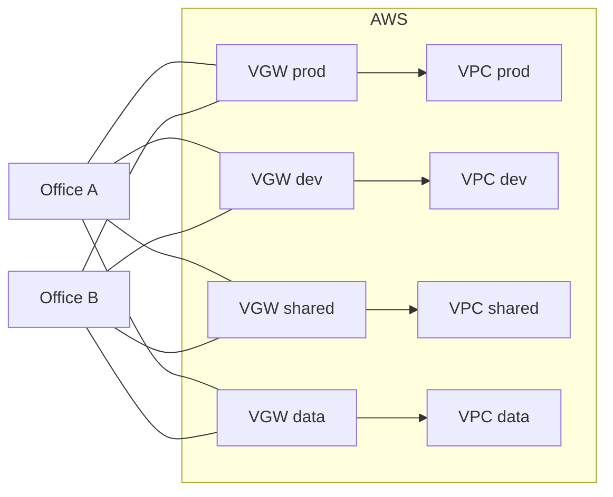
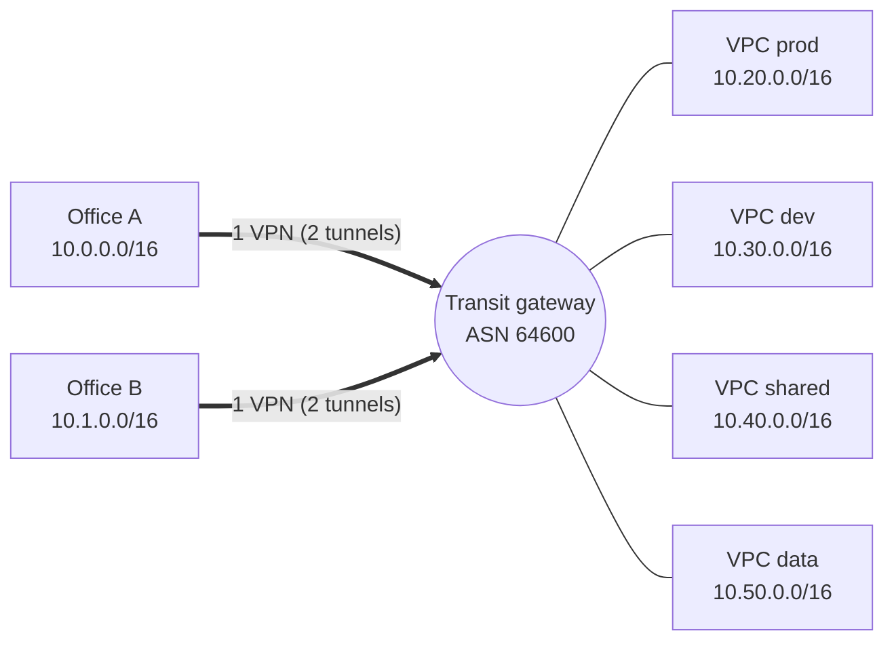
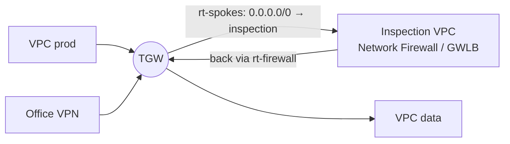

# Transit gateway

> [!abstract] In one sentence
> A transit gateway is a regional router that I own: every VPC, VPN, Direct Connect gateway and peered TGW plugs into it as an **attachment**, and **its own route tables** decide which attachment can reach which, so one VPN from the office reaches every VPC and I can still keep prod and dev apart.

The basics (creating it, attaching VPCs, peering vs TGW, transitivity) are in [[Connecting VPCs]]. This note is about the TGW as the hub of a **hybrid** network: why it replaces per-VPC virtual private gateways, how its route tables work, and the designs built on it.

## The problem: one VGW per VPC

Start where [[Site-to-Site VPN#Stage 5: a second VPC, and the VGW stops scaling]] stopped. Two offices, four VPCs (`prod`, `dev`, `shared`, `data`), each VPC with its own virtual private gateway:



| Pain | Why |
|---|---|
| **8 VPN connections, 16 tunnels, 16 BGP sessions** on the office firewalls | One connection per (office, VPC) pair. Each new VPC = one more per office |
| VPCs can't reach each other through this | A VGW only routes between its VPC and its VPNs. VPC ↔ VPC needs peering, which isn't transitive either |
| Each tunnel capped at ~1.25 Gbps, one active tunnel per VGW | No way to aggregate |
| No central place to filter or log | Every VGW is its own island |

## The fix: one hub



Now each office has **one** VPN connection. A new VPC is one VPC attachment plus routes, and the offices don't change. The VPN attachment is created by pointing the Site-to-Site VPN at the TGW instead of a VGW:

```bash
aws ec2 create-vpn-connection --type ipsec.1 \
  --customer-gateway-id cgw-0cc --transit-gateway-id tgw-0dd \
  --options StaticRoutesOnly=false
```

**Two layers of routing, always.** The TGW doesn't replace the VPC route tables:
1. **VPC route table**: "to reach `10.0.0.0/8`, go to `tgw-0dd`". Note: VPC route tables **don't learn routes from a TGW**. I add them myself (a summary like `10.0.0.0/8 → tgw` is common)
2. **TGW route table**: "`10.0.0.0/16` is behind the Office A VPN attachment"

## TGW route tables: association and propagation

The part that makes the TGW more than a big router.

| Word | Meaning | Rule |
|---|---|---|
| **Association** | Which TGW route table is used to route traffic **coming from** this attachment | Exactly **one** per attachment |
| **Propagation** | This attachment **installs its routes into** a TGW route table (VPC CIDR, BGP routes from a VPN/DX) | Into **any number** of tables |
| **Static route** | A route I type, e.g. `0.0.0.0/0 → inspection VPC` | Beats propagated for the same prefix |
| **Blackhole route** | Drop this prefix explicitly | Useful to block `10.30.0.0/16` from somewhere |

By default every attachment associates with and propagates to the **default route table**, so everything reaches everything. Fine for a lab, wrong for a company.

### Segmentation: prod and dev share the VPN, not each other

Goal: offices reach every VPC. `shared` (DNS, AD, CI) is reachable by all. **Prod and dev must not talk.**

| TGW route table | Associated (traffic from) | Propagations (who it can reach) |
|---|---|---|
| `rt-prod` | VPC prod | shared, VPN Office A, VPN Office B |
| `rt-dev` | VPC dev | shared, VPN Office A, VPN Office B |
| `rt-shared` | VPC shared | prod, dev, data, VPNs |
| `rt-onprem` | VPN A, VPN B | prod, dev, shared, data |

Traffic from prod looks up `rt-prod`. There's no route to `10.30.0.0/16` in it, so prod → dev is dropped **at the TGW**, whatever the security groups say. This is the same idea as a VRF ([[Policy-based routing#Stronger isolation: VRFs and network namespaces]]): one box, several separate routing tables.

> [!warning] Isolation needs both directions to be absent. If `rt-dev` had prod's route, dev → prod packets would arrive, and replies would be dropped by `rt-prod`. Half-open isolation is confusing to debug: design it as a table.

## Things the TGW does that a VGW can't

### ECMP: more than 1.25 Gbps over VPN

With **VPN ECMP support** enabled on the TGW and BGP on the VPNs, the TGW spreads traffic over **all** tunnels that announce the same prefix with the same AS path. Four VPN connections = eight tunnels ≈ 10 Gbps aggregate.

Catch: ECMP hashes **per flow**. One big file transfer is still one flow on one tunnel, still ~1.25 Gbps. And my firewall must also do ECMP outward, or AWS → office is balanced and office → AWS isn't.

### Inspection VPC: all traffic through a firewall

Central filtering between VPCs and toward the office: route every attachment's default route to an **inspection VPC** that runs AWS Network Firewall or third-party appliances behind a Gateway Load Balancer.



The trap is **appliance mode**. Without it, the TGW sends the request through a firewall endpoint in AZ a and the reply through AZ b, and a stateful firewall drops the reply because it never saw the SYN. Turn on **appliance mode** on the inspection VPC attachment so a flow sticks to one AZ.

### Peering across regions and accounts

- **TGW peering** links TGWs in different regions (or accounts). Routes over peering are **static only**: no propagation across. Multi-region with dynamic routing is what **AWS Cloud WAN** adds
- **Sharing with RAM** (Resource Access Manager): one network account owns the TGW, other accounts attach their VPCs. The usual setup with [[AWS Organizations]]

### Connect attachments: SD-WAN on top

A **Connect** attachment runs **GRE tunnels + BGP** between the TGW and a third-party appliance (SD-WAN router, virtual firewall), on top of an existing VPC or Direct Connect attachment used as transport. Why: an SD-WAN appliance in a VPC can announce all my branch prefixes to the TGW over BGP, with higher bandwidth than IPsec VPN, and without the IPsec overhead (the SD-WAN fabric already encrypts). This is how a company that already runs an SD-WAN overlay (see [[Types of VPN#Then SD-WAN: the same idea, plus choosing the path]]) plugs AWS in as "one more site".

### Direct Connect gateway attachment

A Direct Connect **transit VIF** lands on a **Direct Connect gateway**, which associates with the TGW. Details → [[Direct Connect#Private VIF, transit VIF and the Direct Connect gateway]].

## Advanced problems

| Symptom | Cause | Fix |
|---|---|---|
| New VPC attached, office can't reach it | Missing: the VPC route table route to the TGW, the TGW propagation into the on-prem route table, or the CIDR not announced to the office | Check all three layers: VPC RT, TGW RT, BGP toward on-prem |
| Office sees the VPC routes, VPC instances can't reply | VPC route table has no route back to the office via the TGW | Add `10.0.0.0/8 → tgw` in the VPC route tables |
| Prod reaches dev "by accident" | Everything still on the default route table | Disable default association/propagation, build tables per segment |
| Firewall drops replies intermittently | Asymmetric AZ path through the inspection VPC | Appliance mode on the inspection attachment |
| VPN aggregate never goes past ~1.25 Gbps | ECMP off, static routing, different AS paths, or a single flow | Enable VPN ECMP, use BGP with equal paths, parallelise flows |
| Cost surprise | TGW charges per attachment-hour **and** per GB processed, on every hop | For heavy VPC ↔ VPC traffic between two VPCs, peering (no per-GB processing) can be cheaper |
| Two VPCs with the same CIDR | A TGW route table can't send one prefix to two attachments | Private NAT gateway, PrivateLink → [[Overlapping address spaces#In AWS]] |

## Practice

> [!example]- I attach VPC dev to the TGW, and dev can reach the office but the office can't reach dev. Where do I look?
> The route table **associated with the VPN attachment**: dev's CIDR must be propagated into it. Then BGP announces it to the office. Traffic from the office is looked up in the VPN attachment's associated table, not dev's.

> [!example]- How many VPN connections from one office to reach 12 VPCs with VGWs, and with a TGW?
> 12 with VGWs (24 tunnels). 1 with a TGW (2 tunnels), or a few more for ECMP bandwidth.

> [!example]- Why can't two attachments propagate the same /16 into one TGW route table usefully?
> A route table holds one best path per prefix (or ECMP between VPN paths). Two different VPCs with the same CIDR aren't "two paths to the same place", they're two places. Traffic would go to one of them.

## Easy to get wrong
- Thinking the TGW updates VPC route tables: it doesn't, I add `→ tgw` routes myself
- Leaving default association/propagation on in a multi-environment setup: flat network
- Confusing **association** (where my traffic is looked up, one) with **propagation** (where my routes go, many)
- Expecting ECMP to speed up one flow
- Forgetting **appliance mode** with stateful inspection
- Expecting dynamic routing over TGW peering: static only
- Thinking a TGW is global: it's **regional**. Other regions need peering or Cloud WAN

## Related
- Basics:: [[Connecting VPCs]]
- Concepts:: [[Routing tables]], [[Policy-based routing]] (VRFs), [[AS and BGP]], [[Types of VPN]] (hub and spoke, SD-WAN), [[VPN]]
- AWS:: [[Site-to-Site VPN]], [[Direct Connect]], [[VPC]], [[AWS Organizations]], [[Proxies, load balancing and discovery in AWS]] (GWLB)
- Designs:: [[Hybrid connectivity architectures]], [[Nested VPNs]]
- Problems:: [[Overlapping address spaces]]

## Flashcards
#flashcards

Why does a virtual private gateway stop scaling with many VPCs? :: One VGW per VPC, so one VPN per (site, VPC) pair, and VPCs can't reach each other through VGWs
What does a TGW change for an office reaching 10 VPCs? :: One VPN connection to the TGW instead of 10
Does a TGW add routes to VPC route tables? :: No. I add routes like 10.0.0.0/8 → tgw myself
TGW association vs propagation? :: Association: the one TGW route table used for traffic from an attachment. Propagation: the attachment installs its routes into one or more tables
How do you stop prod and dev talking through a TGW? :: Separate TGW route tables, and don't propagate prod into dev's table or dev into prod's
What is VPN ECMP on a TGW? :: Spreading traffic over several VPN tunnels announcing the same prefix with BGP, for more aggregate bandwidth
Does ECMP make one big transfer faster? :: No, hashing is per flow: one flow stays on one tunnel
What is TGW appliance mode for? :: Keeping both directions of a flow in the same AZ through an inspection VPC, so stateful firewalls see the whole flow
Routing over TGW peering? :: Static routes only
What is a TGW Connect attachment? :: GRE tunnels + BGP to an SD-WAN/virtual appliance, on top of a VPC or DX attachment
Is a TGW regional or global? :: Regional
How is a TGW shared across accounts? :: AWS Resource Access Manager (RAM)
