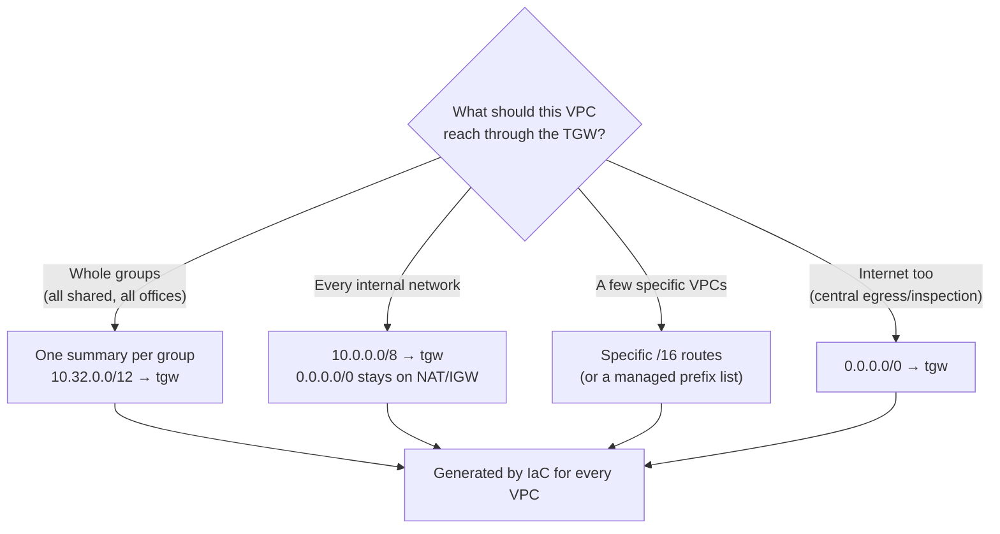
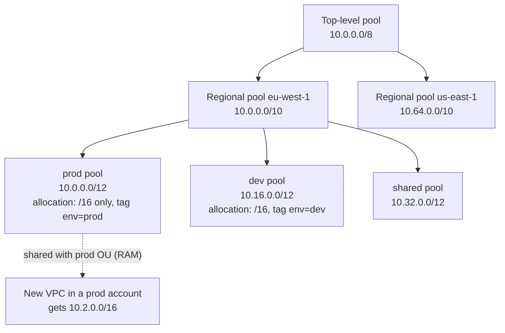

# VPC IP address planning

> [!abstract] In one sentence
> In AWS, every VPC's CIDR should come from a company-wide plan where each environment (and region) owns one aligned block, because those blocks are what keep **VPC route tables, transit gateway tables, VPN/Direct Connect announcements and security group rules** short, and because a VPC's primary range and its subnets **can't be resized** later.

The general method (hierarchy of bits, aligned blocks, reserving ranges, a source of truth) is in [[IP address planning]]. This note is how it applies to AWS: the rules AWS adds, a plan for an organisation, the layout inside one VPC, how the plan shortens routing through a [[Transit gateway]], and AWS IPAM.

## Common misconceptions

| Wrong mental model | What's actually true |
|---|---|
| "I'll pick the CIDR when I create the VPC" | The wizard suggests `10.0.0.0/16`, and so does every tutorial. Ten teams doing that = ten VPCs that can never be connected to each other or to a transit gateway together |
| "A VPC can be resized later" | The **primary** CIDR can't change, and a **subnet** can't be resized. I can only add **secondary** CIDRs (and new subnets in them) |
| "Each VPC has its own IP space, so overlaps don't matter" | Overlaps don't matter **until** VPCs are peered, attached to the same TGW, or connected to the office. Peering refuses them, a TGW table can't route them |
| "The plan doesn't affect routing" | With a random plan, every VPC route table lists every destination one by one (and hits the 50-route quota). With an aligned plan, a few summary routes cover everything |
| "A `/28` subnet holds 16 hosts" | AWS reserves **5** addresses per subnet: a `/28` has **11** usable |
| "Kubernetes pods don't use VPC addresses" | With the default EKS networking, **every pod gets a VPC IP**. Clusters exhaust `/16`s |

## The rules AWS adds

| Rule | Detail | Consequence for the plan |
|---|---|---|
| VPC CIDR size | Between `/16` (65 536) and `/28` (16) per block | A `/16` per VPC is the common standard: the largest possible, so no VPC outgrows its block |
| Primary CIDR | Fixed for the VPC's life | Choose it from the plan the first time |
| Secondary CIDRs | Extra blocks added later (5 per VPC by default, adjustable). Can't mix RFC 1918 ranges with the primary (a `10.x` VPC can't add `172.16.x`), but `100.64.0.0/10` is allowed | The growth path. Take secondaries from the **same environment block**, or summaries break |
| Subnet | One AZ, a slice of a VPC CIDR, **can't be resized** | Size subnets generously, leave free space in the VPC for new tiers |
| Reserved addresses | 5 per subnet: network, `+1` VPC router, `+2` DNS, `+3` reserved, broadcast | `/28` = 11 usable, `/24` = 251, `/20` = 4 091 |
| Load balancer subnets | An ALB needs at least a `/27` with free addresses in each subnet it uses | Don't make public subnets tiny |
| Default VPC | `172.31.0.0/16` in **every** region of **every** account | Never connect default VPCs: they all overlap. Delete them or ignore them |
| Overlaps | Refused by peering; a TGW route table can't route one prefix to two VPCs | The plan has to be organisation-wide, across accounts and regions → [[Overlapping address spaces#In AWS]] |

## Build-up: from wizard defaults to a plan

**Setup.** A company in `eu-west-1`, later `us-east-1` too. An office `10.48.0.0/16` connected by a [[Site-to-Site VPN]]. A transit gateway in each region. Accounts per team and environment, managed with [[AWS Organizations]].

### Stage 1: every VPC created with the wizard

```text
VPC prod-web     10.0.0.0/16     (wizard default)
VPC dev-web      10.0.0.0/16     (wizard default, other account)
VPC data         10.0.0.0/16     (tutorial)
VPC tools        172.31.0.0/16   (the default VPC, used "temporarily")
```

The day they're attached to the TGW: three VPCs claim `10.0.0.0/16`. The TGW route table can send that prefix to one attachment only, and the office's VPN can't tell them apart either. Two of them have to be rebuilt (new VPC, new subnets, redeploy everything, new IPs everywhere). That's the cost of not planning, paid in the worst possible moment.

### Stage 2: one block per environment

The plan (same as in [[IP address planning#Stage 2: give each group one aligned block]]):

| Block | For | Holds |
|---|---|---|
| `10.0.0.0/12` | Production VPCs | 16 VPCs of `/16`: `10.0` – `10.15` |
| `10.16.0.0/12` | Development VPCs | `10.16` – `10.31` |
| `10.32.0.0/12` | Shared services VPCs (DNS, AD, CI, inspection, egress) | `10.32` – `10.47` |
| `10.48.0.0/12` | Networking: offices, VPN client pools, Client VPN, TGW link ranges | `10.48` – `10.63` |
| `10.64.0.0/10` | Second region (same layout inside) | `10.64` – `10.127` |
| `10.128.0.0/9` | Reserved | |

The VPCs again:

```text
VPC prod-web     10.0.0.0/16
VPC prod-data    10.1.0.0/16
VPC dev-web      10.16.0.0/16
VPC shared       10.32.0.0/16
Office           10.48.0.0/16
```

Instead of random allocations like `10.17.0.0/16`, `10.83.0.0/16`, `10.194.0.0/16`, the address now says what the VPC is: anything in `10.16.x.x` is dev.

### Stage 3: what the plan does to routing

This is where it pays. Without a plan, each VPC route table needs one route **per destination** it should reach through the TGW, and with 50 VPCs that's 50 routes per route table, in every VPC, against a default quota of **50 routes per route table**. With the plan, each VPC needs one route per **group** it may reach:

```text
prod-web subnet route table
Destination       Target
10.0.0.0/16       local          ← itself
10.0.0.0/12       tgw-0dd        ← other prod VPCs (local is more specific, still wins for itself)
10.32.0.0/12      tgw-0dd        ← shared services
10.48.0.0/12      tgw-0dd        ← offices, VPN users
0.0.0.0/0         nat-0ee        ← internet stays on the NAT gateway
                                 ← no route to 10.16.0.0/12: dev isn't reachable from here
```

```text
dev-web subnet route table
Destination       Target
10.16.0.0/16      local
10.16.0.0/12      tgw-0dd        ← other dev VPCs
10.32.0.0/12      tgw-0dd        ← shared services
10.48.0.0/12      tgw-0dd        ← offices
0.0.0.0/0         nat-0ee
```

Five lines each, and they **never change** when a new prod or dev VPC is created: it lands inside a block that's already routed.

Meanwhile the TGW route tables know every individual VPC, filled automatically by propagation. The two levels are deliberately decoupled:

| Table | Knows | Filled by |
|---|---|---|
| TGW route table | All 50 VPCs, one `/16` each | Propagation, automatically |
| prod-web's route table | 3 summaries + local + internet | Me / IaC, but only once thanks to the plan |
| dev-web's route table | Same shape, different summaries | Same |

So a VPC doesn't need to know every network, just which **groups** it hands to the TGW. The TGW (the core) knows where each network actually is; the VPC (the edge) knows only "these groups → core". Why VPC routes are never automatic, and the other ways to keep them short (prefix lists, a broad `10.0.0.0/8`, IaC): [[Transit gateway routing#Stage 7: 50 networks, and the VPC side gets long]].

**Choosing the VPC-side routes for 50 networks:**



The same plan shortens everything else:

| Where | Random plan | Aligned plan |
|---|---|---|
| VPC route tables | One route per destination VPC (quota: 50) | One per group |
| On-prem → AWS over a VPN on a VGW | Each VPC CIDR, against a **100-route** limit | `10.0.0.0/10` for the whole region |
| AWS → on-prem over BGP | Every office prefix | `10.48.0.0/12` |
| Direct Connect allowed prefixes | A list of VPC CIDRs to maintain | One summary per region |
| Security groups / NACLs | "Allow from shared" = one rule per shared VPC | `10.32.0.0/12`, one rule |
| A firewall policy in an inspection VPC | Pairs of VPC ranges | "Deny `10.16.0.0/12` → `10.0.0.0/12`" |

### Stage 4: the layout inside one VPC

A standard layout, the same in every VPC so IaC can compute it. `prod-web` = `10.0.0.0/16`, 3 AZs, tiers by purpose:

| Tier | Size | AZ a | AZ b | AZ c | Usable each |
|---|---|---|---|---|---|
| Private app | `/20` | `10.0.0.0/20` | `10.0.16.0/20` | `10.0.32.0/20` | 4 091 |
| Data (RDS, caches) | `/22` | `10.0.48.0/22` | `10.0.52.0/22` | `10.0.56.0/22` | 1 019 |
| Public (ALB, NAT) | `/24` | `10.0.60.0/24` | `10.0.61.0/24` | `10.0.62.0/24` | 251 |
| TGW attachment | `/28` | `10.0.63.0/28` | `10.0.63.16/28` | `10.0.63.32/28` | 11 |
| **Free** | | `10.0.64.0/18` and `10.0.128.0/17` | | | a 4th AZ, new tiers, pods |

Choices behind it:
- **Biggest first, aligned** (the VLSM rule from [[IP addressing and subnetting#Designing an address plan (VLSM)]]): the `/20`s at the start, the small ones packed at the end of the used space
- **Private app subnets big**: instances, Lambda functions in a VPC, ECS tasks and EKS pods all take addresses there
- **Public subnets small but not tiny**: only load balancers and NAT gateways live there (ALB needs at least `/27`)
- **Dedicated `/28`s for the TGW attachment**, with their own route table (see [[Transit gateway routing#Stage 1: create the attachments]])
- **Half the VPC left free**: subnets can't be resized, so growth means new subnets in free space

In Terraform, the same layout is computed from the VPC's block instead of typed:

```hcl
locals {
  vpc_cidr = "10.0.0.0/16"
  # cidrsubnet(prefix, extra_bits, index)
  app  = [for i in range(3) : cidrsubnet(local.vpc_cidr, 4, i)]        # /20s: 10.0.0.0, 10.0.16.0, 10.0.32.0
  data = [for i in range(3) : cidrsubnet(local.vpc_cidr, 6, 12 + i)]   # /22s: 10.0.48.0, 10.0.52.0, 10.0.56.0
  pub  = [for i in range(3) : cidrsubnet(local.vpc_cidr, 8, 60 + i)]   # /24s: 10.0.60.0, 10.0.61.0, 10.0.62.0
  tgw  = [for i in range(3) : cidrsubnet(local.vpc_cidr, 12, 1008 + i)] # /28s: 10.0.63.0, .16, .32
}
```

(`cidrsubnet("10.0.0.0/16", 4, 2)` adds 4 bits → a `/20`, and takes the 3rd one: `10.0.32.0/20`.)

### Stage 5: AWS IPAM hands out the blocks

Typing CIDRs is how plans drift. **Amazon VPC IP Address Manager (IPAM)** turns the plan into pools that VPCs are allocated from:



- **Pools** mirror the hierarchy: top level → region (the pool's *locale*) → environment
- **Allocation rules** on a pool: allowed netmask lengths (min/max/default, e.g. only `/16`), required tags
- Pools are **shared with RAM** to the accounts or OUs that may use them: a prod account sees only the prod pool
- A VPC asks for "a `/16` from the prod pool" instead of naming a CIDR:

```bash
aws ec2 create-vpc --ipv4-ipam-pool-id ipam-pool-0prod --ipv4-netmask-length 16
```

```hcl
resource "aws_vpc" "this" {
  ipv4_ipam_pool_id   = var.prod_pool_id
  ipv4_netmask_length = 16
}
```

- IPAM also **monitors**: it discovers every VPC CIDR in the organisation and flags overlapping and non-compliant ones (a VPC created outside the pools, with a typed `10.0.0.0/16`)

The plan stops being a document people are supposed to read and becomes the only way to get a range.

### Stage 6: ranges that need special care

| Need | AWS detail | Plan |
|---|---|---|
| **EKS pods** | The VPC CNI gives each pod a VPC address. A busy cluster eats thousands | Pods in a **secondary CIDR from `100.64.0.0/10`** (custom networking), reused in every VPC because it's never routed outside; or prefix delegation; or IPv6 |
| **Client VPN** | Its client CIDR must not overlap the VPC or anything the users reach | A block in "networking" (`10.49.0.0/16`) |
| **Site-to-Site VPN tunnel inside addresses** | `/30`s from `169.254.0.0/16`, chosen by AWS or by me | Nothing to plan in `10/8`, but avoid AWS's reserved `/30`s if choosing |
| **Default VPCs** | `172.31.0.0/16` everywhere | Never attach them; delete them in new accounts |
| **Partners / acquisitions** | Their ranges collide with mine | NAT into a reserved block, or PrivateLink → [[Hybrid connectivity architectures#Problem 4: overlapping address ranges]] |
| **IPv6** | AWS gives each VPC a `/56`, each subnet a `/64`; no overlap problem | Dual-stack where possible: the IPv4 plan still decides routing for IPv4 |

## Advanced problems

| Problem | Symptom | Fix |
|---|---|---|
| VPC out of addresses | `InsufficientFreeAddressesInSubnet`, pods stuck pending, Lambda can't create ENIs | Add a secondary CIDR **from the same environment pool**, new subnets in it. For pods, `100.64.0.0/10` |
| Secondary CIDR from the wrong block | A prod VPC gets `10.20.0.0/16` (dev's block) "because it was free": dev summaries now cover part of prod | Release it, take one from the prod pool |
| Two VPCs overlap at TGW attachment time | One prefix, two attachments: one of them unreachable | Rebuild one VPC from the pool; meanwhile private NAT gateway or PrivateLink → [[Overlapping address spaces#In AWS]] |
| VPC route table full | `RouteLimitExceeded` at 50 routes | Summaries per group; prefix lists (count as max entries); quota increase as last resort |
| Subnet too small | A `/28` public subnet can't hold an ALB plus NAT | New, bigger subnet in free VPC space (subnets can't grow) |
| Over-wide summary | `10.0.0.0/8 → tgw` sends a partner's `10.200.x.x` (reached via the internet) to the TGW | Exact group summaries, or a more specific route for the exception |
| Default VPC attached "for a test" | `172.31.0.0/16` collides with every other account's default VPC | Never; create a planned VPC |

## Practice

> [!example]- A new prod VPC needs a range. With the plan above, what's the process?
> Request a `/16` from the prod IPAM pool (in IaC: `ipv4_ipam_pool_id` + `ipv4_netmask_length = 16`). It lands inside `10.0.0.0/12`; no VPC route table anywhere changes, and the TGW learns it by propagation.

> [!example]- prod-web must reach shared and the office, not dev. Which routes go in its subnet route tables?
> `10.32.0.0/12 → tgw`, `10.48.0.0/12 → tgw` (plus `10.0.0.0/12 → tgw` if other prod VPCs are needed), `0.0.0.0/0 → nat`. No route for `10.16.0.0/12`, and the TGW route tables enforce the isolation too.

> [!example]- What does the office router need to reach all of eu-west-1 over BGP, and what does AWS need for the office?
> One prefix each way: `10.0.0.0/10` announced to the office, `10.48.0.0/12` (or the office's `/16`) announced to AWS.

> [!example]- `cidrsubnet("10.16.0.0/12", 4, 3)`?
> 4 extra bits → `/16`, index 3 → `10.19.0.0/16`.

> [!example]- How many usable addresses in a `/26` AWS subnet?
> 64 − 5 = 59.

## Easy to get wrong
- Accepting the wizard's `10.0.0.0/16`
- Using or attaching default VPCs (`172.31.0.0/16`)
- Taking a secondary CIDR from another environment's block
- Tiny subnets: 5 addresses reserved, ALBs need room, subnets can't grow
- Forgetting pods consume VPC addresses on EKS
- Typing CIDRs in IaC instead of allocating from IPAM pools
- Thinking a TGW makes VPC routes unnecessary: it makes them **short**, if the plan allows

## Related
- Method:: [[IP address planning]], [[IP addressing and subnetting]]
- Routing:: [[Transit gateway routing]], [[Transit gateway]], [[Routing tables]]
- AWS:: [[VPC]], [[Connecting VPCs]], [[Site-to-Site VPN]], [[Direct Connect]], [[Hybrid connectivity architectures]], [[AWS Organizations]], [[Security groups]]
- Problems:: [[Overlapping address spaces]]

## Flashcards
#flashcards

VPC CIDR block size limits? :: /16 (largest) to /28 (smallest)
Can a VPC's primary CIDR or a subnet be resized? :: No. Add secondary CIDRs and new subnets instead
How many addresses does AWS reserve per subnet? :: 5 (network, VPC router, DNS, future use, broadcast). /28 = 11 usable
Default VPC CIDR, and why never connect default VPCs? :: 172.31.0.0/16 in every account and region: they all overlap
Why does an environment-per-block plan shorten VPC route tables? :: Each VPC needs one route per group it may reach (10.32.0.0/12 → tgw), and new VPCs land inside already-routed blocks
Default route quota per VPC route table? :: 50
What does the TGW know vs a VPC route table in a planned design? :: TGW: every VPC (/16 each, by propagation). VPC: a few group summaries → tgw
Rule for secondary CIDRs in a planned VPC? :: Take them from the same environment block/pool, or summaries break
What is AWS IPAM? :: VPC IP Address Manager: hierarchical pools (top → region → environment) with allocation rules, shared via RAM, plus overlap/compliance monitoring
How does a VPC get a CIDR from IPAM? :: create-vpc --ipv4-ipam-pool-id … --ipv4-netmask-length 16 (or ipv4_ipam_pool_id in Terraform)
Why do EKS clusters exhaust VPC addresses? :: The VPC CNI gives each pod a VPC IP. Fix: secondary 100.64.0.0/10 for pods, prefix delegation, or IPv6
Standard subnet layout idea for a VPC? :: Same layout everywhere: big private app /20s per AZ, smaller data and public subnets, /28s for TGW, half the VPC left free
What does cidrsubnet("10.0.0.0/16", 4, 2) return? :: 10.0.32.0/20
Minimum subnet size for an ALB? :: /27, with free addresses
