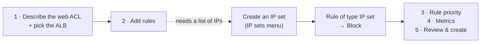

# AWS WAF

> [!abstract] In one sentence
> WAF (**Web Application Firewall**) inspects **HTTP requests** before they reach my app and blocks the bad ones: SQL injection, XSS, known bad bots, too many requests from one IP…

## Sub-services & features

> Everything this service contains, grouped the way the console's left menu groups it. Linked = I have a note on it.

![[Pasted image 20260926193804.png]]

*The **WAF & Shield** console sidebar (older layout): Web ACLs, Bot control, IP sets, Regex pattern sets, Rule groups, Marketplace rules, then the Shield section.*

WAF shares a console with Shield and Firewall Manager (**WAF & Shield**). The console was redesigned in 2025, so some names differ (e.g. web ACLs can appear as **protection packs**).

| Area                 | Sub-feature                                  | What it's for                                                                                      |
| -------------------- | -------------------------------------------- | -------------------------------------------------------------------------------------------------- |
| **AWS WAF**          | Web ACLs / protection packs                  | The rule sets attached to ALB, CloudFront, API Gateway…                                            |
|                      | Rule groups                                  | My reusable groups of rules                                                                        |
|                      | AWS managed rules                            | Ready-made: core rule set, SQL injection, known bad inputs, IP reputation…                         |
|                      | Marketplace managed rules                    | Rule sets sold by security vendors                                                                 |
|                      | IP sets / Regex pattern sets                 | Reusable lists referenced by rules                                                                 |
|                      | Bot Control                                  | Detect and manage bots (paid add-on)                                                               |
|                      | Fraud Control                                | Account takeover / fake account creation protection (paid add-on)                                  |
|                      | CAPTCHA / Challenge                          | Make suspicious clients prove they're human/browsers                                               |
|                      | Application integration SDKs                 | Client-side tokens for web/mobile apps                                                             |
|                      | Logging & metrics                            | Full request logs to CloudWatch Logs / S3 / Firehose, sampled requests                             |
| **AWS Shield**       | Standard (free, automatic) / Advanced (paid) | DDoS protection. Advanced adds a response team + cost protection                                   |
| **Firewall Manager** | Security policies                            | Push WAF/Shield/security group rules across all accounts of an [[AWS Organizations\|organization]] |

## In my own words

*Starter note, to fill in when I study it properly.*

A [[Security groups|security group]] only sees IPs and ports ("port 443 open"). It has no idea *what's inside* the request. WAF works at **Layer 7**: it reads the URL, headers, body, and decides.

- **Web ACL**: the list of rules I attach to a resource
- **Rules**: e.g. "block if the body looks like SQL injection", "block IPs from this list", "max 100 requests per 5 minutes per IP" (**rate-based rule**)
- **Managed rule groups**: ready-made rule sets from AWS (common attacks, known bad inputs, bot control…), so I don't write everything myself
- Each rule: **Allow / Block / Count** (Count = just watch, handy for testing a rule before enforcing it)

## Where it plugs in

![[Pasted image 20260926194303.png]]

*The setup the demo below builds: requests hit WAF first, then the ALB, which forwards them to an EC2 instance in the VPC.*

WAF doesn't stand alone. It attaches to something that receives HTTP:

```
User ──► CloudFront ──► ALB ──► app
          ▲ WAF         ▲ WAF
```

- [[Load balancers|Application Load Balancer]]
- CloudFront
- API Gateway
- AppSync, Cognito, App Runner…

**Not** on an NLB (that one doesn't understand HTTP) and not directly on EC2.

### How to create a Web ACL

The demo: put a web ACL on an ALB and **block my own laptop's IP** to check that it works.



**Step 1: Describe the web ACL and associate it with AWS resources**

![[Pasted image 20260926193956.png]]

- **Name** and **CloudWatch metric name**: letters, digits, `-` and `_` only (the metric name is filled in from the name)
- **Resource type** is the key choice:
  - **CloudFront distributions**: a global web ACL (it lives in `us-east-1`)
  - **Regional resources**: ALB, API Gateway REST APIs, App Runner, AppSync, Cognito user pools, Verified Access
- **Region**: for regional resources, it must be the **same region as the ALB** (here Europe (Frankfurt))

![[Pasted image 20260926194142.png]]

**Associated AWS resources** is optional, so I can attach the ACL later. **Add AWS resources** opens a picker:

![[Pasted image 20260926194357.png]]

Pick the resource type (**Application Load Balancer**), tick the load balancer (`lb-aws-waf-demo`), **Add**, then **Next**.

**Step 2: Add rules and rule groups**

![[Pasted image 20260926194457.png]]

- **Add rules ▾** gives two choices: **managed rule groups** (AWS / Marketplace) or **my own rules and rule groups**
- Rules are checked **in the order they appear** (step 3 changes that order)
- Every rule costs **WCUs** (web ACL capacity units). A web ACL can hold at most **5000 WCUs**, and going over **1500** costs extra. A simple IP set rule costs 1, managed groups cost much more

**Side trip: create the IP set first**

To block an IP I need an **IP set** (a named, reusable list of IPs). If it doesn't exist yet, I create it from the sidebar → **IP sets**:

![[Pasted image 20260926194607.png]]

> [!warning] The region selector matters
> IP sets are listed **per region**. The IP set must be in the **same region (or CloudFront/global) as the web ACL**, otherwise it won't show up in the rule. Note also that WAF **Classic** resources don't work with the new WAF.

![[Pasted image 20260926194747.png]]

- **IP set name**: `my-laptop-ip`
- **Region**: Europe (Frankfurt), same as the web ACL
- **IP version**: IPv4 or IPv6 (one set holds only one version)
- **IP addresses**: one CIDR per line, e.g. `41.x.x.x/32` for a single address (find it with `curl ifconfig.me`)

**Back to step 2: add my own rule**

![[Pasted image 20260926195419.png]]

**Add rules ▾ → Add my own rules and rule groups** offers three **rule types**:

| Rule type | What it does |
|---|---|
| **IP set** | Match requests coming from the IPs of an IP set. The one for this demo |
| **Rule builder** | A custom rule: match on query strings, headers, URI, body, **countries**, **rate limits**… Has a visual editor and a **JSON editor** for nested AND/OR logic |
| **Rule group** | Add one of my own rule groups (a reusable bundle of rules) |

![[Pasted image 20260926195447.png]]

With **IP set** selected:
- **Name**: `block-my-laptop-access`
- **IP set**: `my-laptop-ip`
- **IP address to use as the originating address**:
  - **Source IP address**: the IP the request comes from. The normal choice
  - **IP address in header** (e.g. `X-Forwarded-For`): when a CDN or proxy sits in front, the source IP is the proxy's and the real client IP is in a header. Careful: headers **can be faked** to get around the rule
- **Action**: **Block** (or Allow / Count)

![[Pasted image 20260926195522.png]]

The rule now shows in the list: `block-my-laptop-access`, **capacity 1** (so 1/5000 WCUs used), action **Block**.

Below it is the **default web ACL action**: what happens to requests that **match no rule**. Usually **Allow** (block only what the rules catch). **Block** is for "allow only what's on my list".

**Steps 3 to 5**: set the rule priority (order), configure CloudWatch metrics and sampled requests, then review and **Create web ACL**. Opening the ALB's address from my laptop now returns **403 Forbidden**, while it still works from other networks.

## Alternatives for non-HTTP traffic

WAF only understands **HTTP/HTTPS**. For anything else (SSH, databases, game servers on UDP, traffic through an NLB…) it can't help, so these take over:

| Service | Layer | Traffic | Main purpose |
|---|---|---|---|
| [[Security groups]] | L3/L4 | TCP/UDP/ICMP | Per-resource firewall. **Allow rules only**, stateful |
| **Network ACL** (see [[VPC]]) | L3/L4 | TCP/UDP/ICMP | Subnet-level filtering. Allow **and deny**, stateless |
| **AWS Network Firewall** | L3–L7 | TCP/UDP + more | Managed stateful firewall for a whole VPC: deep packet inspection, IDS/IPS rules, domain filtering |
| **AWS Shield** | L3/L4 (Advanced adds L7) | Network traffic | DDoS protection. Standard is free and automatic |
| **AWS WAF** | L7 | HTTP/HTTPS | Web attack / request filtering |

> [!tip] Which one?
> - Only open the ports I need → **security group**
> - Block an IP range for a whole subnet → **NACL**
> - Inspect or filter all traffic entering/leaving the VPC (e.g. "only allow outbound to `*.github.com`") → **Network Firewall**
> - Absorb floods (SYN/UDP floods, reflection attacks) → **Shield**
> - Filter what's *inside* HTTP requests (SQLi, XSS, bad bots) → **WAF**
>
> They stack: a request can go through Shield → WAF → NACL → security group.

## Related
- **Shield**: DDoS protection. Standard is free and automatic. WAF handles the application-level stuff
- [[Certificate Manager (ACM)]]: HTTPS on the same ALB/CloudFront

## Connects to
- [[Load balancers]]
- [[How AWS services connect]]

## Flashcards
#flashcards

What layer does WAF work at? :: Layer 7 (HTTP)
Name three things WAF can attach to :: ALB, CloudFront, API Gateway
How do you block an IP that sends too many requests? :: A rate-based rule in the web ACL
Security group vs WAF? :: SG filters IPs/ports (L3/L4). WAF inspects the HTTP request content (L7)
What is an IP set? :: A named, reusable list of IP addresses/CIDRs (IPv4 or IPv6) that WAF rules can reference
Why doesn't my IP set show up when creating a rule? :: It was created in a different region than the web ACL
Which region for a web ACL on CloudFront? :: CloudFront (global), which lives in us-east-1
What are WCUs? :: Web ACL capacity units, the cost of each rule. Max 5000 per web ACL, above 1500 costs extra
What is the web ACL default action? :: What happens to requests that match no rule (usually Allow)
Source IP vs "IP address in header"? :: Use the header (e.g. X-Forwarded-For) only behind a CDN/proxy, and remember headers can be faked
What does a blocked request get back? :: HTTP 403 Forbidden
The three rule types in "Add my own rules"? :: IP set, Rule builder (custom conditions, geo, rate limits), Rule group
How to filter non-HTTP traffic (SSH, UDP, databases)? :: Security groups, NACLs, or AWS Network Firewall for deep inspection. WAF only handles HTTP/HTTPS
Which AWS service is a stateful L3–L7 firewall for a whole VPC? :: AWS Network Firewall

## Links
- [What is AWS WAF? (docs)](https://docs.aws.amazon.com/waf/latest/developerguide/what-is-aws-waf.html)
