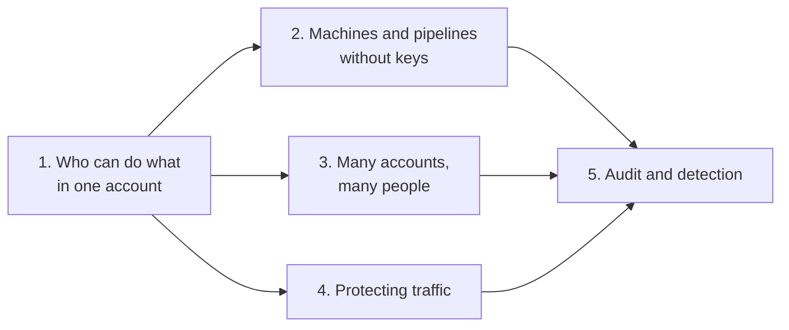

# AWS security

> What this covers: every AWS security, identity and audit note, in the order I'd study them. Each stage assumes the ones above it. The vendor-neutral concept behind each stage is listed first, so I know what to read in [[Identity and access]] or [[Networking]] before the AWS product.

Part of [[AWS]]. The general identity learning path is [[Identity and access]]; TLS (Transport Layer Security), certificates and PKI (Public Key Infrastructure) live in [[Networking]].

## The map



## 1. Who can do what in one account: IAM and STS

Read first in Identity and access: [[Authentication and authorization]], [[HMAC request signing]] (how every AWS (Amazon Web Services) API (Application Programming Interface) call is signed, SigV4), [[Multi-factor authentication and passkeys]].

- [[IAM]]: IAM (Identity and Access Management). Root vs users, groups, roles, policies and how they're evaluated (explicit deny wins). Console screens for creating policies, roles (trusted entity types), users and access keys, Access Advisor
- [[STS]]: STS (Security Token Service). Temporary credentials for roles. Why a role beats a user holding the permissions, the two checks (identity policy + trust policy), what "trust this account" really means, external ID and the confused deputy, trusting an identity provider, what `AssumeRole` returns, debugging AccessDenied
    - [[Assuming a role step by step]]: hands-on. A program outside AWS invokes one Lambda through a user whose only permission is assuming a role. Every console screen, then C#/Python/CLI (Command Line Interface) clients

## 2. Machines and pipelines without keys

Read first in Identity and access: [[OpenID Connect]] (especially [[OpenID Connect#Stage 8: OIDC for machines]]), [[JWT and bearer tokens]], [[Workload identity (SPIFFE)]].

- [[Connecting GitHub Actions to AWS]]: production tutorial for CI/CD (Continuous Integration / Continuous Delivery) with GitHub OIDC (OpenID Connect). One provider per account, one role per job type trusting an exact `sub`, environments and branch rules that make approvals binding, least-privilege deploy policies, Terraform bootstrap, workflows, hardening, troubleshooting
- Related, filed under Compute: [[ECS production stack]] (the same OIDC setup inside a full ECS (Elastic Container Service) pipeline, plus task and execution roles), [[Lambda#Two kinds of permissions (confusing at first!)]] (execution role vs who may invoke), [[EC2]] (instance profiles)

## 3. Many accounts, many people

Read first in Identity and access: [[Single sign-on]].

- [[AWS Organizations]]: many accounts managed as one. The hierarchy (root, OUs (Organizational Units), accounts), SCPs (Service Control Policies) as guardrails that cap what IAM can grant, user vs account, Control Tower
- [[AWS Identity Center]]: one login for people across every account. Permission sets become roles in each account, assumed through [[STS]] behind the scenes
- Related, at the area root: [[AWS Regions and Availability Zones]] (SCP Region guardrails, STS tokens in opt-in Regions)

## 4. Protecting traffic: certificates and filtering

Read first in Networking: [[Encryption basics]], [[TLS]], [[Certificates and PKI]], [[mTLS]], [[ACL]].

- [[Certificate Manager (ACM)]]: free public certificates for load balancers and CloudFront, DNS (Domain Name System) validation, automatic renewal
- [[Certificate rotation]]: replacing certificates before they expire, without downtime. ACME (Automatic Certificate Management Environment), ACM managed renewal, imported certificates, Private CA (Certificate Authority), rotating a CA, monitoring expiry
- [[AWS WAF]]: WAF (Web Application Firewall). Layer 7 filtering of HTTP (Hypertext Transfer Protocol) requests: web ACLs (Access Control Lists), managed rule groups, rate-based rules, where it plugs in, and the alternatives for non-HTTP traffic
- Related, filed under Networking: [[Security groups]] (stateful firewall per network interface, vs NACLs (Network ACLs))

## 5. Audit and detection: who did what

Read first: [[Authentication and authorization]] (an audit log records both who and what).

- [[CloudTrail]]: the audit log of every API call. Event anatomy, management vs data vs network activity events, an organization trail into a log archive account, advanced event selectors, log file validation, Insights, querying
- [[CloudTrail in production]]: alerting on dangerous calls (EventBridge rules, metric filters), Athena investigations, playbooks: who deleted the database, assumed role back to a person, leaked access key, AccessDenied after a deploy, audit evidence
- Related, filed under Monitoring: [[CloudWatch Logs]], [[CloudWatch alarms]] (where CloudTrail alerts end up)

## Which note answers…

| Question | Note |
|---|---|
| User, group, role, policy: which is which? | [[IAM#The building blocks]] |
| One policy allows, another denies: what wins? | [[IAM#Creating policies]] (explicit deny wins) |
| Why assume a role instead of giving a user the permissions? | [[STS#Why roles instead of a user with the permissions]] |
| `AccessDenied` on `sts:AssumeRole`: trust or identity policy? | [[STS#Stage 3: two checks guard the door]], [[STS#Advanced problems]] |
| My role trusts the account, why can't this user assume it? | [[STS#Stage 4: "This account" in the trust policy means "let IAM policies decide"]] |
| What is the external ID for? | [[STS#Stage 5: the external ID, a password for the trust]] |
| Which trusted entity type do I pick when creating a role? | [[STS#Stage 7: the same idea everywhere in AWS]], [[IAM#Creating a role]] |
| A program outside AWS needs narrow access | [[Assuming a role step by step]] |
| How do I deploy from GitHub without storing an AWS key? | [[Connecting GitHub Actions to AWS]] |
| How do I make sure only approved `main` runs can deploy prod? | [[Connecting GitHub Actions to AWS#The design]] |
| GitHub job: "Not authorized to perform sts:AssumeRoleWithWebIdentity" | [[Connecting GitHub Actions to AWS#Advanced problems]] |
| How should an EC2 instance or a Lambda get permissions? | [[IAM#Roles: how services get permissions]] |
| When is an access key acceptable, and how do I handle it? | [[IAM#Access keys]] |
| How do I stop any account from using a Region or a service? | [[AWS Organizations#SCPs: the guardrails]] |
| How do people log into many accounts with one identity? | [[AWS Identity Center]] |
| Which certificate goes on my load balancer, and who renews it? | [[Certificate Manager (ACM)]], [[Certificate rotation#How AWS does it]] |
| Block SQL injection or too many requests from one IP | [[AWS WAF]] |
| Which permissions has this role never used? | [[IAM#Access Advisor]] |
| Who deleted this resource? | [[CloudTrail in production#Scenario 1: "Who deleted the production database?"]] |
| This assumed-role session did something: which human was it? | [[CloudTrail in production#Scenario 2: "From an assumed role back to a human"]] |
| An access key leaked | [[CloudTrail in production#Scenario 3: a leaked access key]], [[STS#Advanced problems]] (Revoke sessions) |
| Access Advisor or CloudTrail? | [[IAM#Access Advisor vs CloudTrail]] |

## Not written yet
- *[[KMS]]*: encryption keys, key policies, envelope encryption, and why cross-account S3 or AMI sharing fails without key grants
- *[[Secrets Manager]]*: storing and rotating database passwords and API keys, vs Parameter Store
- *[[Amazon Cognito]]*: user pools (login for my app's users) and identity pools (their AWS credentials through STS)
- *[[GuardDuty]]*: threat detection from CloudTrail, VPC (Virtual Private Cloud) flow logs and DNS logs
- *[[AWS Config]]*: the configuration history of each resource, and rules that flag drift
- *[[Security Hub]]*: one place for findings and best-practice checks across accounts

## Weakest first
```dataview
TABLE WITHOUT ID file.link AS Note, type AS Type, confidence AS Conf
FROM "Areas/AWS/Security"
WHERE confidence
SORT confidence ASC
```
