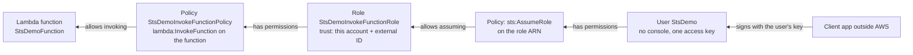

# Assuming a role step by step

> [!abstract] What this achieves
> A program running **outside AWS** (Amazon Web Services) invokes one Lambda function, using an IAM (Identity and Access Management) user whose **only** permission is to ask STS (Security Token Service) for a role that can invoke that function. Every console screen of the setup, then the client code.

**When you'd do this:** a program that has no other way to prove its identity (no OIDC (OpenID Connect) token, not running on AWS) needs a narrow, revocable slice of access. When the caller *can* use an identity provider, like GitHub Actions, skip the user entirely: see [[STS#Stage 6: no user at all, trusting an identity provider (GitHub)]].
**Needed first:** the why and the two checks (identity policy + trust policy) are in [[STS]].

The chain I'm building, from the resource back to the caller:



So the order of work is: **Lambda → invoke policy → role → assume-role policy → user → access key → code**.

## Steps

### 1. Create the Lambda function

Lambda → **Create function** → *Author from scratch*. Name `StsDemoFunction`, runtime Python 3.10, architecture x86_64. Permissions: leave the default (a new **execution role** that can only write logs to CloudWatch).

![[Pasted image 20261004100043.png]]

> [!warning] Two different roles
> The default role created here is the function's **execution role**: what the function's code may do, trusted by `lambda.amazonaws.com`. It has nothing to do with the role I build below, which is about **who may invoke** the function. See [[Lambda#Two kinds of permissions (confusing at first!)]].

The function page. **Copy ARN** (ARN = Amazon Resource Name, see [[ARN]]) puts `arn:aws:lambda:us-east-2:111122223333:function:StsDemoFunction` in the clipboard: I need it for the policy.

![[Pasted image 20261004100114.png]]

The default code just returns a greeting, which is all the test needs:

![[Pasted image 20261004100212.png]]

```python
import json

def lambda_handler(event, context):
    # TODO implement
    return {
        'statusCode': 200,
        'body': json.dumps('Hello from Lambda!')
    }
```

### 2. Create the policy that allows invoking it

IAM → Policies → **Create policy**. In the visual editor, pick the service **Lambda**:

![[Pasted image 20261004100407.png]]

Under *Actions allowed*, open **Write** and tick only `InvokeFunction`. Under *Resources* choose **Specific** and add the function ARN copied above (not "All": that would allow invoking every function in the account).

![[Pasted image 20261004100435.png]]

Review and create, named `StsDemoInvokeFunctionPolicy`. The summary shows one service, *Limited: Write*, scoped to the function name and Region `us-east-2`:

![[Pasted image 20261004100525.png]]

The JSON (JavaScript Object Notation) it produces:

```json
{
  "Version": "2012-10-17",
  "Statement": [
    {
      "Effect": "Allow",
      "Action": "lambda:InvokeFunction",
      "Resource": "arn:aws:lambda:us-east-2:111122223333:function:StsDemoFunction"
    }
  ]
}
```

### 3. Create the role, trusted by this account

IAM → Roles → **Create role**. Step 1 is *who may assume it* (the trusted entity). The five types are explained in [[STS#Stage 7: the same idea everywhere in AWS]].

![[Pasted image 20261004101523.png]]

Pick **AWS account → This account**. I also ticked **Require external ID** and pasted a random identifier (a UUID (Universally Unique Identifier)). The console's own note: an external ID is the best practice when a **third party** assumes the role, and roles that require one can't be used with the console's *Switch Role* button.

![[Pasted image 20261004101640.png]]

Step 2, permissions: tick `StsDemoInvokeFunctionPolicy` (the refresh button picks up a policy created in another tab):

![[Pasted image 20261004101852.png]]

Step 3, name it `StsDemoInvokeFunctionRole` and read the generated **trust policy**. `"AWS": "111122223333"` means "any principal in this account that its own IAM policies allow", and the condition demands the external ID:

![[Pasted image 20261004101920.png]]

The role page. Three things to note: the **role ARN** (copy it for the next step and for the code), **Maximum session duration** (1 hour, the longest a session can last), and the tabs *Trust relationships* (the trust policy) and *Revoke sessions* (kill every session issued so far).

![[Pasted image 20261004102014.png]]

### 4. Create the policy that allows assuming the role

Back to IAM → Policies → **Create policy**, service **STS**. Search `assu` and tick only **AssumeRole** (not `AssumeRoleWithSAML` (SAML = Security Assertion Markup Language) or `AssumeRoleWithWebIdentity`, which are for federation). Resources: **Specific**, the role ARN `arn:aws:iam::111122223333:role/StsDemoInvokeFunctionRole`.

![[Pasted image 20261004102224.png]]

```json
{
  "Version": "2012-10-17",
  "Statement": [
    {
      "Effect": "Allow",
      "Action": "sts:AssumeRole",
      "Resource": "arn:aws:iam::111122223333:role/StsDemoInvokeFunctionRole"
    }
  ]
}
```

I named it `StsDemoAssumeRolePolicy`.

### 5. Create the user that consumes the role

IAM → Users → **Create user**, named `StsDemo`. **Don't** tick console access: this user is for a program, it never logs into the console. On *Set permissions*, **Attach policies directly** and pick only `StsDemoAssumeRolePolicy`. (For people, groups are the better habit; one technical user with one policy is fine attached directly.)

![[Pasted image 20261004102620.png]]

The user page: *Console access: Disabled*, no access key yet. The **Security credentials** tab is where console password, MFA (Multi-Factor Authentication) and access keys live.

![[Pasted image 20261004102725.png]]

### 6. Create an access key for the user

Security credentials → **Create access key**. AWS first asks what the key is for, and for most choices suggests a better alternative (CloudShell or IAM Identity Center for the CLI (Command Line Interface), a role for code running on AWS compute):

![[Pasted image 20261004102841.png]]

For a program on a machine outside AWS, **Application running outside AWS**. AWS accepts it, with the usual rules: never store the key in plain text, a code repository or code, disable it when unused, least privilege, rotate regularly.

![[Pasted image 20261004102934.png]]

The key ID (starts with `AKIA`, a long-term key) and the secret. **This is the only time the secret can be seen or downloaded.** Lose it, and the fix is a new key.

![[Pasted image 20261004103108.png]]

### 7. The client code: assume, then invoke

The demo client is a C# console app with the AWS SDK (Software Development Kit) packages `AWSSDK.SecurityToken` and `AWSSDK.Lambda`. Two clients, two credentials: the **STS client** is built with the user's long-term key, the **Lambda client** with the temporary credentials STS returned.

![[Pasted image 20261004103325.png]]

![[Pasted image 20261004103455.png]]

```csharp
using Amazon;
using Amazon.SecurityToken;
using Amazon.SecurityToken.Model;
using Amazon.Lambda;
using Amazon.Lambda.Model;

namespace STSDemo
{
    class Program
    {
        static void Main(string[] args)
        {
            // Replace these with your IAM user's access key ID and secret access key
            var accessKeyId = "REPLACE WITH ACCESS KEY ID";
            var secretAccessKey = "REPLACE WITH SECRET ACCESS KEY";

            // Replace this with your AWS account ID and role name
            var roleArn = "REPLACE WITH ROLE ARN";

            // Replace with your assumed role's External ID
            var externalId = "REPLACE WITH ROLE EXTERNAL ID";

            // Create an STS client
            var stsClient = new AmazonSecurityTokenServiceClient(accessKeyId, secretAccessKey);

            // Assume the role
            var assumeRoleRequest = new AssumeRoleRequest
            {
                RoleArn = roleArn,
                RoleSessionName = "DemoSession",
                ExternalId = externalId
            };
            var assumeRoleResponse = stsClient.AssumeRoleAsync(assumeRoleRequest).Result;

            // Create a Lambda client with the temporary credentials
            var regionEndpoint = RegionEndpoint.USEast2; // Replace this with the appropriate region
            var lambdaClient = new AmazonLambdaClient(
                assumeRoleResponse.Credentials.AccessKeyId,
                assumeRoleResponse.Credentials.SecretAccessKey,
                assumeRoleResponse.Credentials.SessionToken,
                regionEndpoint);

            // Replace this with your Lambda function name
            var functionName = "StsDemoFunction";

            // Invoke the Lambda function
            var invokeRequest = new InvokeRequest
            {
                FunctionName = functionName
            };
            var invokeResponse = lambdaClient.InvokeAsync(invokeRequest).Result;

            // Read the response
            using (var reader = new StreamReader(invokeResponse.Payload))
            {
                string response = reader.ReadToEnd();
                Console.WriteLine("Lambda function response: " + response);
            }
        }
    }
}
```

> [!warning] The Region
> The first version of the code had `RegionEndpoint.USEast1`. The function lives in **`us-east-2`** (Ohio), so the Lambda client must point there, otherwise the call fails with "function not found" even though the credentials are fine. Lambda functions are regional, see [[AWS Regions and Availability Zones]].

The same thing in Python with boto3:

```python
import boto3

sts = boto3.client(
    "sts",
    aws_access_key_id="AKIA...",          # the StsDemo user's key: read from env/config, never hard-coded
    aws_secret_access_key="...",
)

resp = sts.assume_role(
    RoleArn="arn:aws:iam::111122223333:role/StsDemoInvokeFunctionRole",
    RoleSessionName="DemoSession",
    ExternalId="ebe74ca7-78fb-4fb2-9133-b5eb5eb7945c",
)
creds = resp["Credentials"]               # AccessKeyId (ASIA...), SecretAccessKey, SessionToken, Expiration

lam = boto3.client(
    "lambda",
    region_name="us-east-2",
    aws_access_key_id=creds["AccessKeyId"],
    aws_secret_access_key=creds["SecretAccessKey"],
    aws_session_token=creds["SessionToken"],
)
out = lam.invoke(FunctionName="StsDemoFunction")
print(out["Payload"].read().decode())     # {"statusCode": 200, "body": "\"Hello from Lambda!\""}
```

And with the CLI, letting a profile do the assume (in `~/.aws/config`, with the user's key in the `stsdemo-user` profile):

```ini
[profile stsdemo-invoker]
role_arn = arn:aws:iam::111122223333:role/StsDemoInvokeFunctionRole
source_profile = stsdemo-user
external_id = ebe74ca7-78fb-4fb2-9133-b5eb5eb7945c
region = us-east-2
```

```bash
aws sts get-caller-identity --profile stsdemo-invoker
# "Arn": "arn:aws:sts::111122223333:assumed-role/StsDemoInvokeFunctionRole/botocore-session-..."
aws lambda invoke --profile stsdemo-invoker --function-name StsDemoFunction out.json && cat out.json
```

## Watch out for
- **Hard-coded keys** in the demo code are for the demo only. In a real program read them from the environment or the shared credentials file (the SDKs do it by default), and never commit them
- The **external ID** must be sent on every `AssumeRole`: it's a condition of the trust policy, so forgetting it gives `AccessDenied` that looks exactly like a missing permission
- The temporary credentials need **all three** values. A Lambda client built with only the key ID and secret fails with "security token invalid"
- The credentials expire after the session duration (1 hour by default): a long-running program must call `AssumeRole` again (the SDK credential providers and CLI profiles refresh on their own)
- Resource ARNs in both policies must be **exact** (Region, account, name). A typo in the invoke policy shows up as `AccessDenied` on `lambda:InvokeFunction` *after* a successful assume
- The user has no permission besides `sts:AssumeRole` on one role. Trying `aws lambda invoke` with the user's own key (without the role) must fail: that's the point
- The user's long-term key is still a secret worth stealing (it can assume the role). Rotate it, and consider requiring MFA in the trust policy for human callers

## How to tell it worked
- `aws sts get-caller-identity` with the user's key shows `arn:aws:iam::111122223333:user/StsDemo`; with the assumed credentials it shows `arn:aws:sts::111122223333:assumed-role/StsDemoInvokeFunctionRole/DemoSession`
- The program prints `Lambda function response: {"statusCode": 200, "body": "\"Hello from Lambda!\""}`
- In [[CloudTrail]], an `AssumeRole` event by user `StsDemo`, then an `Invoke` by the assumed role with session name `DemoSession` (Lambda invokes are data events: they only show up if the trail records them)
- The role page shows a *Last activity*, and its **Access Advisor** tab shows Lambda as last accessed

## Related
- Explains:: [[STS]]
- Uses:: [[IAM]], [[Lambda]], [[ARN]]
- Audit:: [[CloudTrail]], [[CloudTrail in production]]
