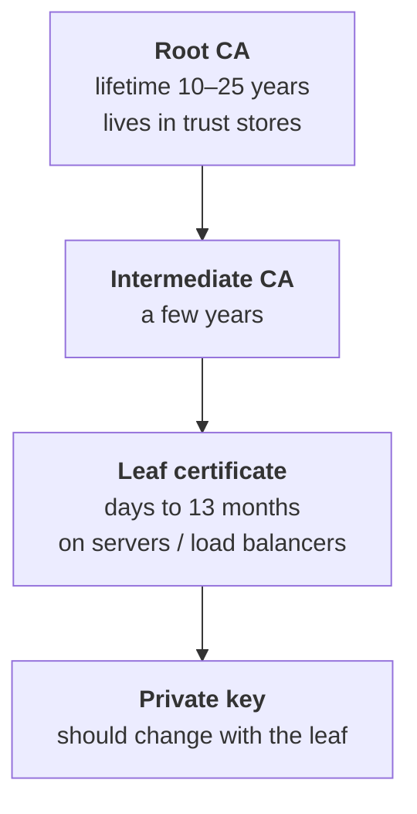
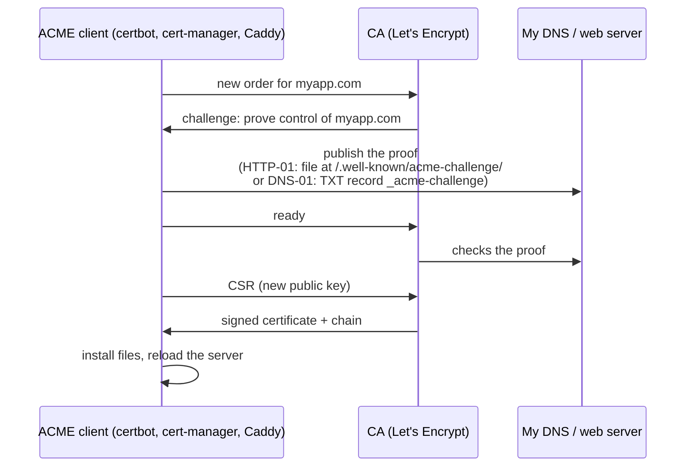
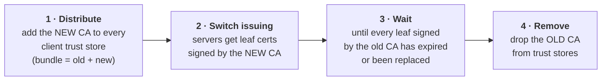
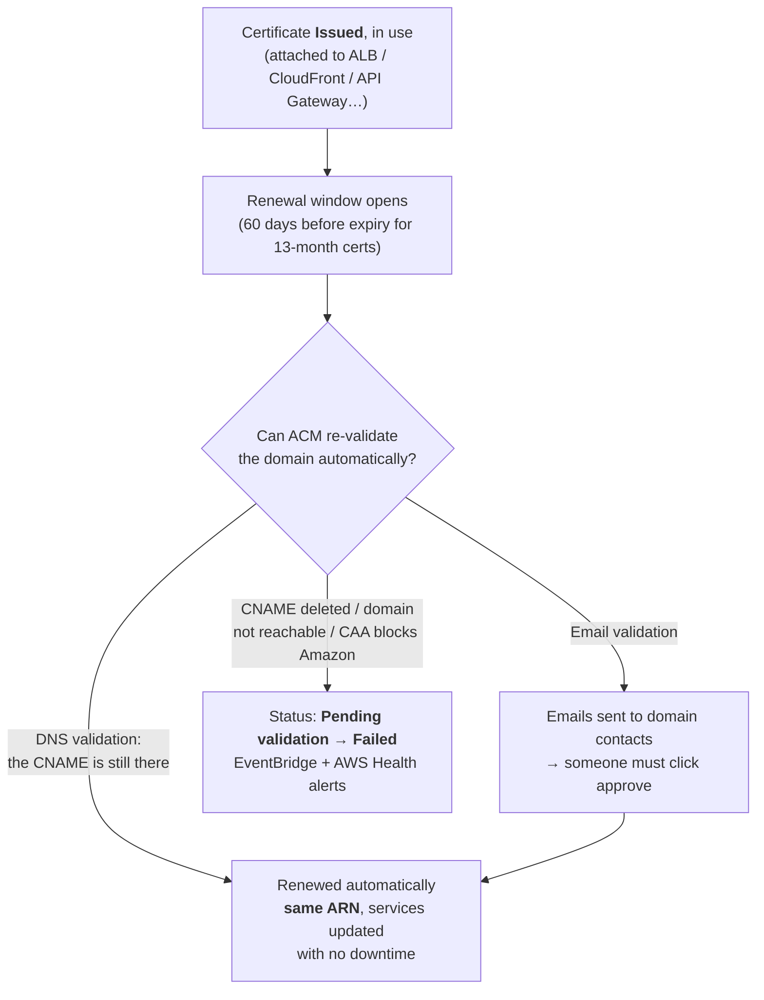

# Certificate rotation

> [!abstract] In one sentence
> Certificate rotation is **replacing a certificate (and ideally its private key) with a new one before the old one expires or becomes untrusted**, and getting every server and client to use it **without downtime**. Certificates keep getting shorter-lived, so rotation has to be **automatic**. In AWS, [[Certificate Manager (ACM)|ACM]] does it for me wherever it can.

## Why certificates have to be rotated

| Reason | Example |
|---|---|
| **Expiry** | Every certificate has a "not after" date. Past it, clients refuse the connection: the classic outage |
| **Key compromise** | Private key leaked (in a Git repo, a stolen laptop, a vulnerable server) → revoke and replace **now** |
| **CA problems** | A CA is distrusted by browsers (e.g. Chrome distrusting Entrust in 2024), or a CA certificate expires (RDS's `rds-ca-2019` in 2024) |
| **Algorithm upgrades** | SHA-1 → SHA-256, RSA → ECDSA, and soon post-quantum |
| **Shrinking lifetimes** | The CA/Browser Forum is cutting the maximum lifetime of public TLS certificates |

### The lifetimes are getting short

| From | Max validity of a public TLS certificate |
|---|---|
| Before 2026 | 398 days |
| 15 March 2026 | 200 days |
| 15 March 2027 | 100 days |
| 15 March 2029 | **47 days** |

(Domain validation results can be reused for less and less time too.) With 47-day certificates, manual renewal means doing it roughly **every month, for every certificate**. Anything not automated will break.

## What exactly gets rotated



| Level | What rotating it means | Difficulty |
|---|---|---|
| **Leaf** (server/client cert) | New certificate for the same name, deployed where the old one was | Easy if automated |
| **Private key** | New key pair with the new certificate ("re-key"). Renewing with the **same key** is possible but defeats part of the purpose | Easy, same step |
| **Intermediate CA** | Servers must send the **new chain** | Medium: forgotten chains break older clients |
| **Root / private CA** | Every **client trust store** must trust the new CA **before** anything is signed by it | Hard: done in overlapping phases (below) |

## The rotation mechanisms

### 1. Manual (the thing to avoid)

Buy/generate a certificate, copy the files to the servers, restart, set a calendar reminder for next year. Fails because people leave, reminders get ignored, and one forgotten server takes the site down.

### 2. ACME (automated renewal against a CA)

**ACME** (RFC 8555) is the protocol behind Let's Encrypt, and also supported by other CAs (ZeroSSL, Google Trust Services, Sectigo…) and internal CAs (step-ca, Vault).



| Challenge | How | Good for |
|---|---|---|
| **HTTP-01** | Serve a token on port 80 | A simple public web server |
| **DNS-01** | Create a TXT record | **Wildcards**, servers not reachable from the internet, many servers |
| **TLS-ALPN-01** | Answer a special TLS handshake on 443 | When port 80 is closed |

Clients renew automatically at about **2/3 of the lifetime** (day 60 of a 90-day cert). **ARI** (ACME Renewal Information) lets the CA tell clients to renew **early**, e.g. before a mass revocation.

### 3. Managed certificates (the provider owns the whole lifecycle)

The platform issues, stores the private key, renews **and** deploys: **AWS ACM**, Cloudflare, Azure App Service / Front Door, Google-managed certificates. Nothing to do as long as domain validation keeps working. The trade-off: the certificate only works **inside** that platform.

### 4. Internal PKI with short-lived certificates

For service-to-service traffic ([[TLS|mTLS]]), certificates can live **hours**, rotated constantly by software, so a leaked key is useless quickly and revocation matters less:
- **Service meshes** (Istio, Linkerd): every workload gets a certificate, rotated automatically (Istio: 24 h by default)
- **SPIFFE / SPIRE**: workload identities as short-lived certificates
- **HashiCorp Vault PKI**, **step-ca**, **AWS Private CA** (below)
- **Kubernetes cert-manager**: renews certificates (ACME or internal CA) and updates the Secret, and apps or ingresses pick up the new one

### 5. Kubernetes-native

`cert-manager` watches `Certificate` resources, renews before expiry (default at 2/3 of the lifetime), and writes the new cert to a Secret. The Ingress controller reloads it automatically.

## Deploying the new certificate without downtime

Getting the new certificate is half the job. The server must actually **use** it:

| Technique | How |
|---|---|
| **Hot reload** | `nginx -s reload`, `systemctl reload haproxy`, SIGHUP. New connections use the new cert, open ones finish on the old one. Certbot's `--deploy-hook` runs this after each renewal |
| **Overlap** | Issue the new cert **while the old one is still valid**, so there's no gap. Never wait for the last day |
| **Several certificates at once** | A load balancer with **SNI** can hold old and new certs together during the switch |
| **Load balancer / CDN termination** | The cert lives on the ALB/CloudFront only. Replacing it there changes nothing on the servers behind (see [[TLS]]) |
| **Rolling deploy** | Replace instances/pods one by one with the new cert baked in or mounted |

> [!warning] The most common rotation outage
> The certificate **file was renewed**, but the server still serves the **old certificate from memory** because nobody reloaded it. Always pair renewal with a reload and **check what's actually served**:
> `echo | openssl s_client -connect myapp.com:443 -servername myapp.com 2>/dev/null | openssl x509 -noout -dates -serial`

## Rotating a CA (the hard one)

Clients only trust certificates signed by CAs **in their trust store**. Switching CAs in one step breaks every client that hasn't been updated yet. So it's done in overlapping phases:



- **Cross-signing**: the new root is also signed by the old one, so old clients that only know the old root still accept the new chain. Let's Encrypt used this to move to its own root
- For **mTLS**, both directions have trust stores: the server trusts the client CA **and** clients trust the server CA
- Real AWS example: **RDS/Aurora CA rotation** (below)

## Revocation vs rotation

- **Revocation** = declaring a certificate invalid **before** it expires (key compromise, mis-issuance). Checked through **CRLs** (lists downloaded by clients) or **OCSP** (a live "is this revoked?" query, "stapled" by the server). Many clients check poorly, and Let's Encrypt dropped OCSP in 2025 in favour of CRLs
- That weakness is exactly why **short lifetimes** are the industry's answer: a stolen certificate that expires in days does little damage even if revocation isn't checked
- After a key compromise: **revoke + rotate** (new key), never just rotate

## How AWS does it

### ACM public certificates: fully managed



- **Eligibility**: ACM renews certificates it issued that are **in use** by an integrated service (or exported). An unused certificate isn't renewed
- **Same ARN**: the renewed certificate keeps the ARN, so the ALB listener, CloudFront distribution or API Gateway domain picks it up by itself. Nothing to redeploy
- **DNS validation** is what makes it truly hands-off. The validation **CNAME must stay** in DNS forever
- **CAA records**: if my domain has CAA records, they must allow `amazon.com` (or `amazontrust.com`, `awstrust.com`, `amazonaws.com`), or issuance and renewal fail
- **Check the status**: `RenewalSummary` in the certificate details (`PENDING_AUTO_RENEWAL`, `PENDING_VALIDATION`, `SUCCESS`, `FAILED`):
  ```bash
  aws acm describe-certificate --certificate-arn <arn> --query 'Certificate.[NotAfter,RenewalEligibility,RenewalSummary]'
  ```

### Imported certificates: my job

ACM **never renews** imported certificates (bought elsewhere, or from my own CA). The rotation:
1. Get the new certificate (from the CA, or an ACME client)
2. **Re-import into the same ARN**: `aws acm import-certificate --certificate-arn <existing-arn> --certificate fileb://cert.pem --private-key fileb://key.pem --certificate-chain fileb://chain.pem`
3. Every service using that ARN switches to the new certificate automatically

Keeping the same ARN is the trick. Importing as a **new** certificate means updating every listener/distribution by hand.

### Exportable public certificates

ACM renews them, but the copy I exported to my own servers doesn't update itself: I must **export again and redeploy**. Automate it with the EventBridge event for a renewed certificate → Lambda / SSM Run Command → install + reload.

### Private certificates: AWS Private CA

| Issued how | Renewal |
|---|---|
| Through **ACM** (request private certificate) | **Automatic**, like public ones (ACM needs permission on the Private CA) |
| Directly with the **Private CA API** (`issue-certificate`) | **Not renewed**: my automation (cert-manager with the `aws-privateca-issuer`, Vault, a script) must rotate them |
| **Short-lived certificate mode** | CA meant for certificates valid ≤ 7 days, cheaper per certificate. Rotation constantly, revocation rarely needed |

Rotating the **Private CA itself**: create a new CA (or a new subordinate), distribute its certificate to all trust stores, switch issuing, then retire the old one (the phases above).

### Monitoring expiry in AWS

| Tool | What it gives |
|---|---|
| **EventBridge** events | "ACM Certificate Approaching Expiration" (daily from 45 days before, configurable per account), "Renewal Action Required", "Certificate Expired", "Certificate Available" |
| **CloudWatch metric** `DaysToExpiry` | Per certificate, alarm on it (e.g. < 30 days) |
| **AWS Health** | Notifications when ACM can't renew, and for AWS-side CA changes (RDS…) |
| **AWS Config** rule `acm-certificate-expiration-check` | Flags certificates expiring within N days across accounts |
| **Trusted Advisor** | Checks for expiring certificates |

Typical setup: EventBridge rule on the expiration / action-required events → SNS → email or Slack.

### Certificates AWS manages that I still have to act on

| Where | What rotates | What I must do |
|---|---|---|
| **[[RDS]] / Aurora** | The server certificate's CA (e.g. `rds-ca-2019` → `rds-ca-rsa2048-g1`) | Update clients' trust bundles **first**, then modify the DB instance to the new CA (may need a restart). Apps using `sslmode=verify-full` break if the bundle is old |
| **ALB mTLS trust store** | My client-CA bundle in S3 | Upload a new bundle (old + new CA during the overlap), update the trust store |
| **API Gateway mTLS** | Truststore file in S3 | Upload a new version, update the domain's truststore version |
| **IoT Core** device certificates | Each device's certificate | Rotate with IoT Jobs / fleet provisioning before expiry |
| **Site-to-Site VPN** (certificate auth) | Customer gateway certificate from Private CA | Renew and update the customer gateway device |
| **EC2 with nginx** | Certificate on the instance | ACM for **Nitro Enclaves** keeps ACM certs rotated on the instance, or use an ALB in front, or ACME on the instance |
| **IAM server certificates** (legacy) | Manually uploaded certs | Upload new, switch, delete old. Prefer ACM wherever it's supported |

### Not to confuse with

- **Secrets Manager rotation**: rotates **passwords / API keys** with a Lambda function, not certificates
- **KMS key rotation**: automatic rotation of the key material of KMS keys (yearly by default when enabled), not TLS certificates

## Easy to get wrong
- **Deleting the ACM validation CNAME** after issuance: renewal fails months later
- **Imported certificates in ACM** are assumed to renew themselves. They don't
- **Renewed but not reloaded**: the file is new, the server still serves the old one
- Forgetting the **intermediate chain** in the new deployment: browsers cope, but APIs, Java and mobile clients fail
- **Certificate pinning** in mobile apps or clients: pinning the leaf means every rotation breaks the app. Pin the CA/public key, or don't pin
- Rotating a **CA** in one step instead of distributing it to trust stores first
- A **CAA record** that doesn't allow Amazon's CA
- Old **clocks** on devices: a brand-new certificate looks "not yet valid"

## Related
- Depends on:: [[TLS]], [[Certificates and PKI]] (chains, trust stores, CAs)
- AWS:: [[Certificate Manager (ACM)]], [[Load balancers]], [[Route 53]] (DNS validation)
- Used in:: [[IPsec and IKE]] (certificate-authenticated tunnels), [[VPN]], [[mTLS]]
- Short-lived certificates at scale:: [[Service mesh]], [[Workload identity (SPIFFE)]]

## Flashcards
#flashcards

What is certificate rotation? :: Replacing a certificate (and ideally its key) before it expires or becomes untrusted, without downtime
Max lifetime of a public TLS certificate from March 2029? :: 47 days (200 days from 2026, 100 days from 2027)
Why re-key when rotating? :: Renewing with the same private key keeps any past key exposure valid. A new key limits the damage
What is ACME? :: The protocol (RFC 8555) for automated certificate issuance/renewal, used by Let's Encrypt, certbot, cert-manager
HTTP-01 vs DNS-01 challenge? :: HTTP-01: serve a token on port 80. DNS-01: TXT record, needed for wildcards or private servers
When do ACME clients usually renew? :: At about 2/3 of the lifetime
The most common rotation outage? :: The file is renewed but the server wasn't reloaded and still serves the old certificate
The 4 phases of rotating a CA? :: Distribute the new CA to trust stores, issue from the new CA, wait for old leafs to expire, remove the old CA
What is cross-signing? :: The new CA is also signed by the old one, so old clients still trust the new chain
Why are short-lived certificates an answer to revocation problems? :: A stolen certificate expires quickly even if clients don't check revocation
What makes ACM renewal fully automatic? :: DNS validation with the CNAME record left in place, and the certificate being in use
Does a renewed ACM certificate get a new ARN? :: No, same ARN, so attached services update automatically
Does ACM renew imported certificates? :: No. Re-import the new one into the same ARN
Why re-import into the same ARN? :: Every service using that ARN switches to the new certificate automatically
Private CA certificates issued directly via the Private CA API: renewed? :: No, only ones requested through ACM are renewed automatically
How to get alerted about expiring ACM certificates? :: EventBridge expiration events → SNS, or a CloudWatch alarm on DaysToExpiry, or the Config rule
What can block ACM issuance/renewal at the DNS level? :: A CAA record that doesn't allow Amazon
RDS CA rotation: which order? :: Update client trust bundles first, then switch the DB instance to the new CA
Secrets Manager rotation vs certificate rotation? :: Secrets Manager rotates passwords/API keys via Lambda, not TLS certificates
