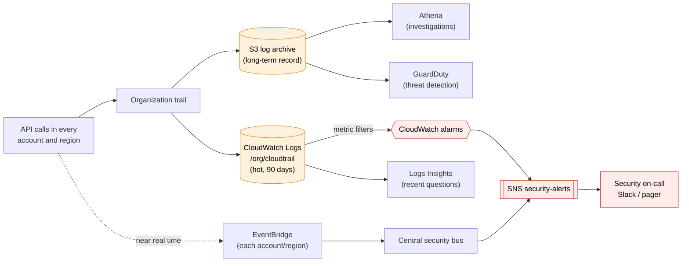
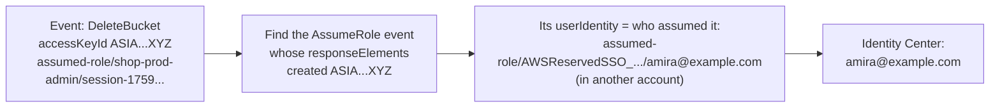

# CloudTrail in production

> [!abstract] In one sentence
> In production, [[CloudTrail]] is used three ways: **alert** on dangerous API calls within minutes (EventBridge, metric filters), **investigate** incidents after the fact (Athena, Logs Insights: "who did this, what else did they do?"), and **prove** to auditors that changes are recorded and the record wasn't touched.

## Common misconceptions

**Wrong mental model #1:** "We have a trail, so we're covered."

**What's actually true:** a trail nobody reads is a **recorder in a drawer**. Without alerts, a leaked key can mine crypto for weeks, and the trail will faithfully record all of it. The value comes from what's built **on top**: rules that fire, queries ready for an incident, people who know how to read an event.

**Wrong mental model #2:** "`userIdentity.arn` tells me which person did it."

**What's actually true:** in a well-run account almost nobody uses IAM users. People and machines **assume roles**, so the ARN says `assumed-role/AWSReservedSSO_AdministratorAccess_…/amira@example.com` or `assumed-role/shop-prod-web-role/i-0a1b…`. Finding the human means reading the **session name**, the **source identity**, or following the chain of `AssumeRole*` events back.

| Wrong mental model | What's actually true |
|---|---|
| Alert on everything CloudTrail sees | Millions of events a day. Alert on a **short list** of high-signal calls, and let GuardDuty handle the rest |
| Investigations start in the console's Event history | 90 days, one region, one account. Real investigations query the **org trail** in S3 (Athena) or CloudWatch Logs |
| An `AccessDenied` event means an attack | Usually a broken deploy or a missing permission. A **spike**, an unknown principal, or an unknown IP is what's suspicious |
| Deleting the IAM user stops a leaked key | Temporary credentials it already created (`GetSessionToken`, assumed roles) keep working until they expire. Revoke sessions too |

## The production setup

Prerequisites from [[CloudTrail#Build-up: from Event history to a real audit trail]]: an **organization trail**, multi-region, in a **log archive account** with Object Lock and KMS, log file validation, and an SCP protecting it. On top of it:



| Piece | Why |
|---|---|
| **S3 + Athena** | The complete, tamper-evident record, all accounts, years back. Slow-ish, cheap to keep |
| **CloudWatch Logs** copy | Fast queries on recent events, and **metric filters → alarms** |
| **EventBridge rules** | React to a specific call in seconds to minutes, with the full event in the alert |
| **GuardDuty** | Reads CloudTrail (plus Flow Logs, DNS) for known-bad patterns: calls from Tor or known-malicious IPs, credentials used from outside AWS that belong to an instance role, unusual regions. I don't write those rules myself |

## Part 1: alerting on dangerous calls

### Which calls deserve an alert

These are the classic list (it overlaps the **CIS AWS Foundations** benchmark, which Security Hub checks):

| Event | Why it matters |
|---|---|
| Any **root** user activity, especially `ConsoleLogin` | Root should almost never be used |
| `ConsoleLogin` **without MFA**, or failed logins in bursts | Stolen password, brute force |
| `StopLogging`, `DeleteTrail`, `UpdateTrail`, `PutEventSelectors` | Someone blinding the audit log: a typical first step of an attacker |
| `CreateUser`, `CreateAccessKey`, `AttachUserPolicy`, `PutUserPolicy`, `CreateLoginProfile` | Persistence: a backdoor user or key |
| `AuthorizeSecurityGroupIngress` with `0.0.0.0/0` on admin ports | Database or SSH opened to the internet |
| `PutBucketPolicy`, `PutBucketAcl`, `DeletePublicAccessBlock` | A bucket being made public |
| `ScheduleKeyDeletion`, `DisableKey` (KMS) | Data becoming unreadable (ransom pattern) |
| `LeaveOrganization`, `DeleteFlowLogs`, `DeleteDetector` (GuardDuty), `DisableSecurityHub` | Escaping or disabling controls |
| Many `AccessDenied` / `UnauthorizedOperation` from one principal | Probing with stolen credentials |
| Any write activity in **regions we don't use** | Crypto mining loves an unwatched region |

### Way A: EventBridge rules (fast, per event)

CloudTrail sends management events to [[EventBridge]] in the account and region where they happen. A rule matches on the event's fields.

**Root signed in to the console:**

```json
{
  "detail-type": ["AWS Console Sign In via CloudTrail"],
  "detail": {
    "userIdentity": { "type": ["Root"] }
  }
}
```

**Someone touching the trail:**

```json
{
  "detail-type": ["AWS API Call via CloudTrail"],
  "detail": {
    "eventSource": ["cloudtrail.amazonaws.com"],
    "eventName": ["StopLogging", "DeleteTrail", "UpdateTrail", "PutEventSelectors"]
  }
}
```

**A security group opened to the whole internet:**

```json
{
  "detail-type": ["AWS API Call via CloudTrail"],
  "detail": {
    "eventSource": ["ec2.amazonaws.com"],
    "eventName": ["AuthorizeSecurityGroupIngress"],
    "requestParameters": {
      "ipPermissions": { "items": { "ipRanges": { "items": { "cidrIp": ["0.0.0.0/0"] } } } }
    }
  }
}
```

Target: the SNS topic `security-alerts` with an **input transformer** so the message is readable (`<user> called <eventName> on <resource> from <sourceIPAddress>`), or a [[Lambda]] that also **auto-remediates** (revokes the rule it just saw, tags the security group, notifies).

Things that bite:
- Rules are **regional**: the event is only seen in the region where the call happened. **IAM, STS, Organizations** events (and most console sign-ins) appear in **`us-east-1`**, so those rules must exist there
- Rules are **per account**: in an organization, each account forwards to a **central security bus** in the security account (a rule with the other bus as target), deployed everywhere with **CloudFormation StackSets**
- API-call events need a trail logging management events. **Read-only** calls (`Get*`, `List*`, `Describe*`) aren't sent to EventBridge unless I opt in
- Delivery is near real time and **best effort**. For "must never be missed", the metric filter path below on the full trail is the safety net

### Way B: metric filters on the CloudTrail log group (counts, thresholds)

With the trail also delivering to the log group `/org/cloudtrail`, a [[CloudWatch Logs#Stage 3: from looking at logs to being paged|metric filter]] turns patterns into metrics, and a [[CloudWatch alarms|CloudWatch alarm]] fires on them. This is how the CIS benchmark describes its checks:

| Metric | Filter pattern |
|---|---|
| `UnauthorizedApiCalls` | `{ ($.errorCode = "*UnauthorizedOperation") \|\| ($.errorCode = "AccessDenied*") }` |
| `ConsoleLoginWithoutMfa` | `{ ($.eventName = "ConsoleLogin") && ($.additionalEventData.MFAUsed != "Yes") && ($.userIdentity.type = "IAMUser") && ($.responseElements.ConsoleLogin = "Success") }` |
| `RootUsage` | `{ $.userIdentity.type = "Root" && $.userIdentity.invokedBy NOT EXISTS && $.eventType != "AwsServiceEvent" }` |
| `TrailChanges` | `{ ($.eventName = CreateTrail) \|\| ($.eventName = UpdateTrail) \|\| ($.eventName = DeleteTrail) \|\| ($.eventName = StartLogging) \|\| ($.eventName = StopLogging) }` |
| `SecurityGroupChanges` | `{ ($.eventName = AuthorizeSecurityGroupIngress) \|\| ($.eventName = RevokeSecurityGroupIngress) \|\| ($.eventName = CreateSecurityGroup) \|\| ($.eventName = DeleteSecurityGroup) }` |
| `ConsoleLoginFailures` | `{ ($.eventName = ConsoleLogin) && ($.errorMessage = "Failed authentication") }` |

(The `\|` is only escaping for this table: in the console the pattern uses plain `||`.)

The advantage over EventBridge: **thresholds**. "More than 20 `AccessDenied` in 5 minutes" or "3 failed console logins in 5 minutes" are counts, which is what alarms do. Metric filter default value `0`, alarm missing data `notBreaching`.

| | EventBridge rule | Metric filter + alarm |
|---|---|---|
| Speed | Seconds to minutes | ~5–15 min (trail delivery + period) |
| Unit | One event | A count over a period |
| Alert content | The full event (who, what, IP) | Only "the metric crossed X". Then I query the logs |
| Scope | Per account and region | One org log group sees everything |
| Best for | "This must never happen" calls | Rates and bursts |

## Part 2: investigating

### Querying the record

**Logs Insights** on `/org/cloudtrail` for recent events (fields are the event's JSON paths):

```
fields eventTime, userIdentity.arn, eventName, sourceIPAddress, errorCode
| filter eventSource = "rds.amazonaws.com" and eventName like /Delete/
| sort eventTime desc
```

**Athena** on the S3 archive for anything older, or across all accounts. The table is created once, with **partition projection** so I don't manage partitions:

> [!example]- Athena table over an organization trail
> ```sql
> CREATE EXTERNAL TABLE cloudtrail_logs (
>   eventversion STRING,
>   useridentity STRUCT<
>     type: STRING, principalid: STRING, arn: STRING, accountid: STRING,
>     invokedby: STRING, accesskeyid: STRING, username: STRING,
>     sessioncontext: STRUCT<
>       attributes: STRUCT<mfaauthenticated: STRING, creationdate: STRING>,
>       sessionissuer: STRUCT<type: STRING, principalid: STRING, arn: STRING,
>                             accountid: STRING, username: STRING>,
>       sourceidentity: STRING>>,
>   eventtime STRING, eventsource STRING, eventname STRING, awsregion STRING,
>   sourceipaddress STRING, useragent STRING, errorcode STRING, errormessage STRING,
>   requestparameters STRING, responseelements STRING, additionaleventdata STRING,
>   requestid STRING, eventid STRING, readonly STRING,
>   resources ARRAY<STRUCT<arn: STRING, accountid: STRING, type: STRING>>,
>   eventtype STRING, recipientaccountid STRING, eventcategory STRING
> )
> PARTITIONED BY (account STRING, region STRING, day STRING)
> ROW FORMAT SERDE 'org.apache.hive.hcatalog.data.JsonSerDe'
> STORED AS INPUTFORMAT 'com.amazon.emr.cloudtrail.CloudTrailInputFormat'
> OUTPUTFORMAT 'org.apache.hadoop.hive.ql.io.HiveIgnoreKeyTextOutputFormat'
> LOCATION 's3://org-audit-logs-111122223333/AWSLogs/o-a1b2c3d4e5/'
> TBLPROPERTIES (
>   'projection.enabled' = 'true',
>   'projection.account.type' = 'enum',
>   'projection.account.values' = '123456789012,210987654321,111122223333',
>   'projection.region.type' = 'enum',
>   'projection.region.values' = 'us-east-1,eu-west-1,eu-central-1,us-west-2',
>   'projection.day.type' = 'date',
>   'projection.day.format' = 'yyyy/MM/dd',
>   'projection.day.range' = '2025/01/01,NOW',
>   'projection.day.interval' = '1',
>   'projection.day.interval.unit' = 'DAYS',
>   'storage.location.template' =
>     's3://org-audit-logs-111122223333/AWSLogs/o-a1b2c3d4e5/${account}/CloudTrail/${region}/${day}'
> );
> ```
> The region list should contain **every** enabled region, not just the ones I use: the point is catching activity where I don't expect it.

**Always filter on `day` (and `account`/`region` when I can)**: they're partitions, so Athena only reads those files. Without them it scans the whole archive and bills for it.

### Scenario 1: "Who deleted the production database?"

The `shop-prod-db` RDS instance is gone at 09:12.

```sql
SELECT eventtime, useridentity.arn, sourceipaddress, useragent,
       json_extract_scalar(requestparameters, '$.skipFinalSnapshot') AS skip_final_snapshot
FROM cloudtrail_logs
WHERE account = '123456789012' AND region = 'eu-west-1'
  AND day = '2026/10/03'
  AND eventname = 'DeleteDBInstance'
  AND json_extract_scalar(requestparameters, '$.dBInstanceIdentifier') = 'shop-prod-db';
```

Result: `assumed-role/terraform-deploy/GitHubActions`, user agent `Terraform/1.9`. Not a person: the **pipeline**. Next step is the pipeline's run at 09:12 (a plan that replaced the database). And the fix is preventive: deletion protection on the instance, and an SCP or permission boundary so the deploy role can't `DeleteDBInstance` in prod without a break-glass step.

### Scenario 2: "From an assumed role back to a human"

The event says `assumed-role/shop-prod-admin/session-1759480000`. Not helpful. I follow the chain:



```sql
SELECT eventtime, recipientaccountid, useridentity.arn AS who_assumed, sourceipaddress
FROM cloudtrail_logs
WHERE day BETWEEN '2026/10/02' AND '2026/10/03'
  AND eventname = 'AssumeRole'
  AND json_extract_scalar(responseelements, '$.credentials.accessKeyId') = 'ASIAEXAMPLEXYZ';
```

To make this easy **before** an incident:
- People only through [[AWS Identity Center]]: the session name is the user's email
- **Source identity** (`sts:SourceIdentity`): set once at the first role assumption and **carried through every role chain**, and the assuming principal can't change it later. Require it in role trust policies
- Pipelines set a meaningful **session name** (`GitHubActions-<repo>-<run id>`)

### Scenario 3: a leaked access key

GitHub secret scanning reports `AKIAEXAMPLELEAKED` in a public repo, committed 6 days ago. AWS may already have attached the `AWSCompromisedKeyQuarantine` policy to the user, which blocks some actions but is **not** a full lockdown.

**Contain first, then investigate:**
1. **Deactivate** the key (don't delete yet: keeps the evidence clear). If a role session was created with it, **revoke sessions** on that role (IAM console: "Revoke active sessions", which adds a deny for tokens issued before now)
2. Look at **everything the key did**:
   ```sql
   SELECT eventtime, awsregion, eventsource, eventname, sourceipaddress, useragent, errorcode
   FROM cloudtrail_logs
   WHERE day >= '2026/09/27'
     AND useridentity.accesskeyid = 'AKIAEXAMPLELEAKED'
   ORDER BY eventtime;
   ```
3. Look for **what it created**, since that's how attackers stay after the key is revoked:
   - `CreateUser`, `CreateAccessKey`, `CreateLoginProfile`, `UpdateAssumeRolePolicy` (a backdoor trust), `CreateRole`
   - `RunInstances` in **every region** (crypto mining), `CreateFunction`
   - `GetSessionToken` / `AssumeRole`: temporary credentials that **survive** the key's deactivation until they expire. Then search for those `ASIA…` keys too
4. Look for **what it read**: `GetSecretValue`, `GetParameter`, S3 `GetObject` (only if data events were on for that bucket, which is exactly why sensitive buckets have them)
5. Clean up, rotate whatever secrets it read, then delete the key. Write down the timeline from the query results

### Scenario 4: AccessDenied after a deploy

Not security at all, and the most common use in a normal week. A new release of `shop-api` fails to read a secret.

```
fields eventTime, userIdentity.arn, eventSource, eventName, errorCode, errorMessage
| filter errorCode like /AccessDenied|UnauthorizedOperation|KMS/
| filter userIdentity.arn like /shop-prod-web-role/
| sort eventTime desc
| limit 20
```

Result: `kms:Decrypt` denied: the secret was re-created with a **new KMS key** whose key policy doesn't include the role. CloudTrail tells me **which principal**, **which action** and **which resource**. The `errorMessage` often says **which policy type** denied it (identity policy, SCP, resource policy, permissions boundary, session policy), which tells me where to look in [[IAM]].

### Scenario 5: "What changed right before the outage?"

5XX errors start at 14:33 (see [[CloudWatch alarms]]). The first question in any incident is "what changed?":

```
fields eventTime, userIdentity.arn, eventSource, eventName, requestParameters
| filter readOnly = 0 and recipientAccountId = "123456789012" and awsRegion = "eu-west-1"
| filter eventSource not in ["sts.amazonaws.com", "logs.amazonaws.com"]
| sort eventTime desc
```

over 14:00–14:35. There it is: 14:31:52, `RevokeSecurityGroupIngress` on `sg-0a1b…` port 5432 by `amira@example.com` from the CLI (the event shown in [[CloudTrail#Anatomy of an event]]): the app lost access to the database. **AWS Config** then shows the full before/after of that security group.

### Scenario 6: proving it to an auditor

The questions and where the evidence is:

| Auditor asks | Evidence |
|---|---|
| Are all API calls in all accounts recorded? | Organization trail, multi-region, status `IsLogging: true` (`get-trail-status`) |
| Can someone erase them? | Log archive account, Object Lock retention, SCP denying `StopLogging`/`DeleteTrail`, KMS key policy |
| Were they modified? | `validate-logs` output over the audit period |
| Would you notice someone disabling it? | The EventBridge rule + metric filter alarm on trail changes, and a test alert |
| Who accessed customer data? | S3 data events on the sensitive buckets, an Athena query |
| How long are they kept? | Object Lock / lifecycle settings (e.g. 1 year hot, 7 years in Glacier) |

## Practice

> [!example]- Which region must hold the EventBridge rule that catches `CreateAccessKey`?
> `us-east-1`: IAM is a global service and its events are delivered there.

> [!example]- EventBridge rule or metric filter for "more than 20 AccessDenied in 5 minutes"?
> Metric filter on the CloudTrail log group + CloudWatch alarm: it's a count over a period. EventBridge matches single events.

> [!example]- I deactivated a leaked IAM user key. Can the attacker still act?
> Yes, with temporary credentials obtained earlier through that key (`GetSessionToken`, `AssumeRole`) until they expire. Revoke role sessions and look for `ASIA…` keys created by it.

> [!example]- An event shows `assumed-role/shop-prod-admin/session-1759…`. How do I find the person?
> Find the `AssumeRole` event whose response created that access key ID. Its `userIdentity` is the caller. Going forward, use Identity Center session names and require `sts:SourceIdentity`.

> [!example]- My Athena query over CloudTrail costs a lot. First fix?
> Filter on the partition columns (`day`, `account`, `region`) so it only scans the relevant files.

> [!example]- Who downloaded `exports/customers-2026-09.csv`? CloudTrail has nothing. Why?
> S3 object reads are data events, off by default. Only events after enabling data events on that bucket are recorded. (S3 server access logs are another option, also only going forward.)

## Easy to get wrong
- Having a trail but no alerts and no tested queries
- EventBridge rules for IAM/sign-in events created in my home region instead of `us-east-1`
- Rules in one account only, in a multi-account organization
- Relying only on EventBridge (best effort): keep the metric-filter or GuardDuty path as a safety net
- Stopping at the assumed-role ARN instead of tracing it to a person
- Revoking a leaked key but not the temporary credentials made from it
- Athena queries without partition filters
- An Athena region list that only includes the regions I use
- Thinking every `AccessDenied` is an attack: most are deploy bugs, and CloudTrail is the fastest way to debug them
- Discovering during the incident that data events weren't on for the bucket that mattered

## Related
- Builds on:: [[CloudTrail]]
- Alerting through:: [[EventBridge]], [[CloudWatch Logs]], [[CloudWatch alarms]], [[SNS]]
- Identities in the events:: [[IAM]], [[AWS Identity Center]], [[ARN]]
- Org-wide controls:: [[AWS Organizations]]
- Archive and queries:: [[S3]]
- Remediation code:: [[Lambda]]
- Things it catches:: [[Security groups]], [[S3]], [[RDS]], [[Route 53]]

## Flashcards
#flashcards

Three production uses of CloudTrail? :: Alerting on dangerous calls, investigating incidents, proving audit compliance
EventBridge detail-type for API calls recorded by CloudTrail? :: AWS API Call via CloudTrail
EventBridge detail-type for console sign-ins? :: AWS Console Sign In via CloudTrail
In which region do IAM and console sign-in events reach EventBridge? :: us-east-1 (mostly, for sign-ins)
EventBridge rule vs metric filter for CloudTrail alerts? :: EventBridge: single events, fast, full event content. Metric filter + alarm: counts and thresholds over the whole trail log group
Which API calls show someone blinding CloudTrail? :: StopLogging, DeleteTrail, UpdateTrail, PutEventSelectors
Metric filter pattern for unauthorized API calls? :: { ($.errorCode = "*UnauthorizedOperation") || ($.errorCode = "AccessDenied*") }
How to find who was behind an assumed-role session? :: Find the AssumeRole event that created its access key ID, read its userIdentity. Identity Center session names and sts:SourceIdentity make it direct
What is sts:SourceIdentity for? :: An identity set at first role assumption, carried through role chaining and not changeable, so actions trace back to a person
First steps for a leaked access key? :: Deactivate the key, revoke sessions, query everything it did, look for created users/keys/roles/instances and temporary credentials
Why doesn't deactivating a leaked key end the incident? :: Temporary credentials created with it keep working until they expire, and backdoors may have been created
Why filter Athena CloudTrail queries on day/account/region? :: They're partitions: Athena only scans matching files, which cuts time and cost
How does CloudTrail help debug AccessDenied? :: The event shows principal, action, resource, and often which policy type denied it
What does GuardDuty add on top of CloudTrail? :: Threat detection with threat intel and ML (malicious IPs, unusual regions, instance credentials used outside AWS) without writing rules
Who changed it vs what it looked like? :: CloudTrail: who made the change. AWS Config: the configuration before and after
