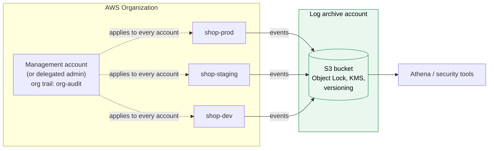

# CloudTrail

> [!abstract] In one sentence
> CloudTrail records **every API call** made in my AWS account (who did what, on which resource, from where, when, and whether it worked), whether it came from the console, the CLI, an SDK, or another AWS service. It's the **audit log** of the account.

## Sub-services & features

> Everything this service contains, grouped the way the console's left menu groups it. Linked = I have a note on it.

![[aws-console cloudtrail sidebar.png|250]]

| Menu | Sub-feature | What it's for |
|---|---|---|
| **Dashboard** | | Trails status, recent events, Insights |
| **Event history** | | Last 90 days of management events, free, searchable |
| **Insights** | | Detects **unusual activity** (e.g. a sudden spike of `TerminateInstances` calls) |
| **Lake** | Event data stores | Store events in a queryable store (up to years) |
| | Query | Search events with **SQL** |
| | Dashboards | Built-in/custom dashboards over Lake data |
| | Integrations (channels) | Bring in events from outside AWS |
| **Trails** | | Deliver events to S3 (+ CloudWatch Logs). Can be **organization trails** |
| | Event types | **Management** (default), **Data** (S3 object/Lambda invoke…, paid), **Network activity** (calls through VPC endpoints), **Insights** |
| | Log file validation | Detect if log files were tampered with |
| **Settings** | | Org delegated admin, etc. |

## Common misconceptions

**Wrong mental model #1:** "CloudTrail logs everything that happens in my account."

**What's actually true:** it logs **AWS API calls**. It does **not** see what happens *inside* resources: an SSH login to an instance, a `DELETE FROM orders` in PostgreSQL, a `curl` from a container, a page served by nginx. Those are OS, database and app logs ([[CloudWatch Logs]]). And even among API calls, **data events** (S3 object reads/writes, Lambda invokes, DynamoDB item operations) are **off by default**.

**Wrong mental model #2:** "CloudTrail can block a bad action."

**What's actually true:** CloudTrail is **detective**, not preventive. It records *after* the call. Prevention is [[IAM]] policies and [[AWS Organizations|SCPs]]. CloudTrail tells me it happened (and with [[EventBridge]], within seconds to minutes) so I can react.

| Wrong mental model | What's actually true |
|---|---|
| CloudTrail = CloudWatch | CloudTrail: **who called which API**. [[CloudWatch]]: **how things perform** |
| Event history is my audit log | It's only **90 days**, management events only, per region. A real audit log is a **trail** to S3 |
| Logs show up instantly | Trail files land in S3 in about **5 minutes** on average (not a guarantee). EventBridge gets events faster |
| `userIdentity` always names a person | Often it's an **assumed role** session. The human behind it is in the session name, the source identity, or the earlier `AssumeRole*` event |
| Logs in S3 are trustworthy by default | Only if I protect them: separate account, Object Lock, KMS, **log file validation** |
| A trail in `eu-west-1` sees my IAM changes | IAM, STS and other **global** services log in `us-east-1`. A **multi-region** trail catches everything |
| A failed call isn't logged | It is, with `errorCode` (e.g. `AccessDenied`). Failures are some of the most useful events |

## Anatomy of an event

Every event is a JSON record. This is someone deleting a security group rule in the shop's prod account:

```json
{
  "eventVersion": "1.10",
  "userIdentity": {
    "type": "AssumedRole",
    "principalId": "AROAEXAMPLEID:amira@example.com",
    "arn": "arn:aws:sts::123456789012:assumed-role/AWSReservedSSO_AdministratorAccess_1a2b3c4d/amira@example.com",
    "accountId": "123456789012",
    "accessKeyId": "ASIAEXAMPLEKEY",
    "sessionContext": {
      "sessionIssuer": {
        "type": "Role",
        "arn": "arn:aws:iam::123456789012:role/aws-reserved/sso.amazonaws.com/AWSReservedSSO_AdministratorAccess_1a2b3c4d",
        "userName": "AWSReservedSSO_AdministratorAccess_1a2b3c4d"
      },
      "attributes": { "creationDate": "2026-10-03T13:58:01Z", "mfaAuthenticated": "false" }
    }
  },
  "eventTime": "2026-10-03T14:31:52Z",
  "eventSource": "ec2.amazonaws.com",
  "eventName": "RevokeSecurityGroupIngress",
  "awsRegion": "eu-west-1",
  "sourceIPAddress": "203.0.113.45",
  "userAgent": "aws-cli/2.17.0 Python/3.12",
  "requestParameters": {
    "groupId": "sg-0a1b2c3d4e5f60718",
    "ipPermissions": { "items": [{ "ipProtocol": "tcp", "fromPort": 5432, "toPort": 5432 }] }
  },
  "responseElements": { "_return": true },
  "requestID": "6f1c3e9a-…",
  "eventID": "b2d4…",
  "readOnly": false,
  "eventType": "AwsApiCall",
  "managementEvent": true,
  "recipientAccountId": "123456789012",
  "eventCategory": "Management"
}
```

| Field | Tells me |
|---|---|
| `userIdentity.type` | `Root`, `IAMUser`, `AssumedRole`, `AWSService`, `FederatedUser`, `IdentityCenterUser`… |
| `userIdentity.arn` | Who. For a role session: `assumed-role/<role>/<session name>`. With [[AWS Identity Center]], the session name is the user's email |
| `accessKeyId` | `AKIA…` = long-term key (IAM user). `ASIA…` = temporary credentials (role session) |
| `eventSource` + `eventName` | Which service and which API |
| `sourceIPAddress` | Where from. An AWS service name (`ec2.amazonaws.com`) when a service called on my behalf |
| `userAgent` | Console, CLI, SDK, Terraform… |
| `requestParameters` / `responseElements` | What was asked and what came back (the IDs created, for example) |
| `errorCode` / `errorMessage` | Present only if the call **failed** (`AccessDenied`, `UnauthorizedOperation`…) |
| `readOnly` | `true` for `Describe*`/`Get*`/`List*` |

## Event types

| Type | What | On by default? | Cost |
|---|---|---|---|
| **Management events** | Control-plane calls: create, modify, delete, configure (`RunInstances`, `PutBucketPolicy`, `ConsoleLogin`) | **Yes** (Event history, and trails log them unless excluded) | First copy in each region free. Extra trails pay |
| **Data events** | Data-plane calls on resources: S3 `GetObject`/`PutObject`/`DeleteObject`, Lambda `Invoke`, DynamoDB item ops, SQS/SNS messages… | **No**, enabled per trail with selectors | Per 100,000 events: can be **big** on a busy bucket |
| **Network activity events** | API calls made **through a VPC endpoint**, including ones denied by the endpoint policy | No | Paid |
| **Insights events** | Unusual API call **rate** or **error rate** | No | Paid per events analyzed |

Management events can be split into **read** and **write**. Many trails log only **write** management events, plus all errors, to cut noise. I'd keep read events for prod accounts though: `GetSecretValue` or `ListBuckets` from an unknown IP is exactly what an attacker's reconnaissance looks like.

## Build-up: from Event history to a real audit trail

Shop account `123456789012`, prod in `eu-west-1`, other accounts in an [[AWS Organizations|organization]].

### Stage 1: Event history only

It's there without doing anything. "Who stopped the instance this morning?" → **Event history**, filter on Event name `StopInstances`. Same from the CLI:

```bash
aws cloudtrail lookup-events --region eu-west-1 \
  --lookup-attributes AttributeKey=EventName,AttributeValue=StopInstances \
  --start-time 2026-10-03T00:00:00Z --max-results 20
```

**The problems:**
- 90 days only. The auditor asks about something 7 months ago
- Management events only: "who downloaded the customer export file from S3?" isn't there
- **Per region** and **per account**: 6 accounts × several regions = many places to look
- Nothing alerts me. I only look after someone notices damage

### Stage 2: a multi-region trail to S3

I create a trail `shop-audit`:
- **Multi-region** (the default from the console): every region, including `us-east-1` where IAM/STS global events are recorded, and regions I never use (that's where an attacker mines crypto)
- Delivers to an S3 bucket (files every few minutes, gzip JSON, path `AWSLogs/<account>/CloudTrail/<region>/<yyyy>/<mm>/<dd>/`)
- **SSE-KMS** encryption with a customer managed key
- **Log file validation** on (see [[CloudTrail#Log file integrity]])
- Optionally also to a **CloudWatch Logs** group, which is what lets metric filters and Logs Insights work on CloudTrail (see [[CloudTrail in production]])

**The problem:** the bucket is in the same account. An attacker who gets admin in prod can `StopLogging`, delete the trail, or delete the log files to cover their tracks.

### Stage 3: an organization trail into a log archive account



- An **organization trail** is created in the management account (or a **delegated administrator** account). It applies to **every account**, including new ones, and **member accounts can see it but not change or delete it**
- The bucket lives in a dedicated **log archive account** that almost nobody can log into (the [[AWS Organizations]] / Control Tower pattern)
- Bucket protections: **versioning**, **S3 Object Lock** (compliance mode, e.g. 1 year) so even an admin can't delete logs early, a bucket policy that only lets CloudTrail write, a **KMS** key whose policy only lets the security team decrypt
- An **SCP** denies `cloudtrail:StopLogging`, `DeleteTrail`, `UpdateTrail`, `PutEventSelectors` to everyone except a break-glass role

Now the audit log survives a fully compromised workload account.

### Stage 4: data events for what matters

The bucket `shop-prod-customer-exports` holds personal data. I want **every read**, but logging data events on *all* S3 buckets (including the static assets bucket serving millions of images) would cost a fortune.

**Advanced event selectors** pick precisely:

```json
[
  {
    "Name": "Customer exports: all object access",
    "FieldSelectors": [
      { "Field": "eventCategory", "Equals": ["Data"] },
      { "Field": "resources.type", "Equals": ["AWS::S3::Object"] },
      { "Field": "resources.ARN", "StartsWith": ["arn:aws:s3:::shop-prod-customer-exports/"] }
    ]
  },
  {
    "Name": "All buckets: deletes only",
    "FieldSelectors": [
      { "Field": "eventCategory", "Equals": ["Data"] },
      { "Field": "resources.type", "Equals": ["AWS::S3::Object"] },
      { "Field": "eventName", "Equals": ["DeleteObject", "DeleteObjects"] }
    ]
  }
]
```

### Stage 5: being told, not just recording

A trail is a recorder. Alerting and investigation on top of it are in [[CloudTrail in production]]: EventBridge rules on dangerous calls, CIS-style metric filters, Athena queries for investigations, and playbooks (leaked key, deleted resource, AccessDenied debugging).

## Log file integrity

With **log file validation**, CloudTrail writes a **digest file** every hour: the SHA-256 hash of each log file delivered in that hour, **signed** with a private key AWS holds, and chained to the previous digest. Anyone can later check that no file was modified, deleted or added:

```bash
aws cloudtrail validate-logs \
  --trail-arn arn:aws:cloudtrail:eu-west-1:111122223333:trail/org-audit \
  --start-time 2026-09-01T00:00:00Z
```

It **detects** tampering, it doesn't **prevent** it. Prevention = Object Lock + separate account + SCP.

## CloudTrail Insights

**Insights** learns the normal **volume** of each write API and its **error rate**, and creates an Insights event when it deviates. Example: `TerminateInstances` normally ~5 calls an hour, suddenly 400 → Insights event with the baseline, the spike, and the top users/user agents behind it. Also `AccessDenied` errors on `GetObject` jumping (someone probing, or a broken deploy).

It's enabled per trail (paid per events analyzed), and Insights events go to the trail's S3 bucket, the console, and EventBridge.

Not to be confused with the CloudWatch "Insights" features (see [[CloudWatch#The Insights family]]).

## Querying the logs: Lake, Athena, Logs Insights

| Option | How | Good for |
|---|---|---|
| **Event history** | Console / `lookup-events` | Quick questions, last 90 days, one region |
| **Athena** over the S3 bucket | A table over the trail's files (partition projection on date/region) | Long-term investigations across all accounts. Pay per TB scanned |
| **CloudWatch Logs Insights** | Trail → CloudWatch Logs group | Recent events, fast queries, metric filters and alarms |
| **CloudTrail Lake** | Managed event data store, SQL, retention up to 10 years | Was the managed option. **Closed to new customers since 31 May 2026** (existing users keep it, critical fixes only). AWS points to CloudWatch for similar capabilities |

So for a new setup in 2026: **trail → S3 (+ Athena)** for the long-term record, and **trail → CloudWatch Logs** for near-real-time queries and alarms.

## CloudTrail vs the others

| Tool | Answers |
|---|---|
| **CloudTrail** | Who did **what API call**, when, from where |
| IAM **Access Advisor** | When was a **service** last used by this principal (see [[IAM]]) |
| [[CloudWatch]] | How are my resources **performing** (metrics, app logs) |
| **AWS Config** | What did a resource's **configuration** look like over time, and is it compliant |
| **GuardDuty** | Is something **malicious** going on? (reads CloudTrail, VPC Flow Logs and DNS logs for me, with threat intelligence) |
| **Security Hub** | One place for findings and compliance checks (CIS, AWS Foundational) |
| **VPC Flow Logs** | Which **IP packets** flowed (network level, no API calls) |

CloudTrail says *who changed* the security group. Config says *what it looked like* before and after. Flow Logs say *what traffic* went through it.

## Practice

> [!example]- How long is CloudTrail Event history kept, and what does it include?
> 90 days, management events only, per region, free and always on.

> [!example]- An auditor needs 7 years of API logs from every account, tamper-evident. Design?
> Organization trail (multi-region) → S3 bucket in a log archive account, SSE-KMS, versioning + Object Lock, log file validation on, SCP denying StopLogging/DeleteTrail. Lifecycle to Glacier for old files.

> [!example]- I need to know who downloaded files from one sensitive bucket. Is that logged by default?
> No. S3 object reads are data events. Add an advanced event selector for that bucket's ARN on the trail.

> [!example]- The event shows `assumed-role/AdminRole/i-0a1b2c3d…`. Who did it?
> The instance `i-0a1b…` using its instance profile role: the session name is the instance ID. So something running on that instance (or someone who got onto it).

> [!example]- A trail in `eu-west-1` (single region) never shows `CreateUser`. Why?
> IAM is a global service, its events are recorded in `us-east-1`. Use a multi-region trail.

## Easy to get wrong
- Thinking it logs everything: not OS logins, SQL queries or app activity, and data events are off by default
- Confusing Event history (90 days) with a trail (as long as I keep the S3 files)
- Single-region trails: miss global service events and unused regions
- Keeping the trail's bucket in the same account as the workloads
- Thinking log file validation prevents tampering: it only detects it
- Enabling S3 data events on every bucket and getting a surprise bill
- Expecting real-time delivery to S3: ~5 minutes on average
- Reading `AssumedRole` and stopping there: trace the session name / source identity back to a person
- Planning a new setup around CloudTrail Lake: closed to new customers since May 2026
- Mixing it up with CloudWatch (performance) and Config (configuration history)

## Related
- Production use:: [[CloudTrail in production]]
- Differs from:: [[CloudWatch]]
- Sends to:: [[S3]], [[CloudWatch Logs]], [[EventBridge]]
- Records actions by:: [[IAM]], [[AWS Identity Center]]
- Org-wide:: [[AWS Organizations]]
- Names everything with:: [[ARN]]
- Shows up in:: [[Bastion host]] (Session Manager), [[Lambda]] (function changes, invokes as data events), [[Route 53]] (record changes), [[Transit gateway routing]] (route changes)

## Flashcards
#flashcards

What does CloudTrail record? :: AWS API calls: who, what, on which resource, from where, when, and the result
How long is CloudTrail event history kept by default? :: 90 days (management events, per region, free)
How do you keep CloudTrail logs longer? :: Create a trail that delivers to an S3 bucket
CloudTrail vs CloudWatch? :: CloudTrail is who did which API call. CloudWatch is metrics and logs about how things run
Are S3 object reads logged by default? :: No, those are data events and must be enabled on a trail
Management vs data events? :: Management = control plane (create/modify/delete resources), logged by default. Data = operations on data (S3 objects, Lambda invokes), opt-in and paid
What are network activity events? :: API calls made through VPC endpoints, including those denied by the endpoint policy
Is CloudTrail preventive or detective? :: Detective. Prevention is IAM policies and SCPs
Where are IAM and STS events recorded? :: us-east-1 (global service events). Use a multi-region trail
What is an organization trail? :: A trail created in the management (or delegated admin) account that logs every account. Members can't change it
How does log file validation work? :: Hourly signed digest files with SHA-256 hashes of each log file, checked with validate-logs
Does log file validation prevent deletion? :: No, it detects tampering. Prevent with Object Lock, a separate account and SCPs
How fast do trail logs reach S3? :: About 5 minutes on average
What does CloudTrail Insights detect? :: Unusual API call volume or error rate compared with a learned baseline
What does an AKIA access key ID mean in an event? :: A long-term IAM user key. ASIA = temporary credentials
Where is the error of a failed call in an event? :: errorCode / errorMessage (e.g. AccessDenied)
How to log S3 data events for just one bucket? :: Advanced event selectors with resources.ARN StartsWith the bucket ARN
Status of CloudTrail Lake in 2026? :: Closed to new customers since 31 May 2026. Use S3 + Athena or CloudWatch Logs instead
CloudTrail vs AWS Config? :: CloudTrail: who made the change (API call). Config: what the configuration looked like over time
Which service analyzes CloudTrail for threats automatically? :: GuardDuty

## Links
- [What is AWS CloudTrail? (docs)](https://docs.aws.amazon.com/awscloudtrail/latest/userguide/cloudtrail-user-guide.html)
- [CloudTrail Lake availability change (docs)](https://docs.aws.amazon.com/awscloudtrail/latest/userguide/cloudtrail-lake-service-availability-change.html)
