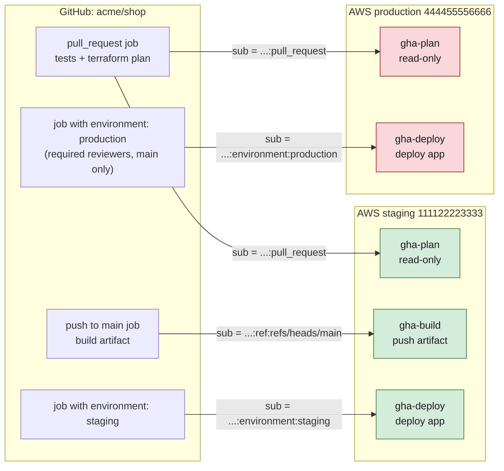

# Connecting GitHub Actions to AWS

> [!abstract] What this achieves
> GitHub Actions workflows deploy and operate an AWS (Amazon Web Services) account **with no AWS key stored anywhere**: each job gets a short-lived OIDC (OpenID Connect) token from GitHub, trades it with STS (Security Token Service) for temporary credentials of **one IAM (Identity and Access Management) role** that trusts exactly that repository and that kind of job, and the credentials die after the job. Production-grade: one role per job type and environment, approvals enforced by AWS through GitHub environments, least-privilege policies, everything in Terraform, auditable in CloudTrail.

**When you'd do this:** any repository whose CI/CD (Continuous Integration / Continuous Delivery) pipeline touches AWS: deploying a Lambda, pushing images and updating ECS (Elastic Container Service), syncing a site to S3 (Simple Storage Service), running `terraform plan/apply`, invoking functions, reading parameters.
**Needed first:** how roles, trust policies and `AssumeRoleWithWebIdentity` work → [[STS]] (especially [[STS#Stage 6: no user at all, trusting an identity provider (GitHub)]]). What the GitHub token is → [[OpenID Connect#Stage 8: OIDC for machines]] and [[JWT and bearer tokens]].

## The starting point and what's wrong with it

The common setup: an IAM user `github-deployer` with `AdministratorAccess`, its access key pasted into the repository secrets as `AWS_ACCESS_KEY_ID` / `AWS_SECRET_ACCESS_KEY`.

- The key **never expires**. Anyone who can edit a workflow can `echo` it somewhere, and it keeps working after they leave
- Every job, including the one that runs tests on a pull request, holds **production admin** rights
- Rotating it means editing GitHub secrets by hand, so nobody does
- In [[CloudTrail]] every action is "`github-deployer` did it": no idea which workflow, branch or run

The target replaces all of it:

| | Before | After |
|---|---|---|
| Secret in GitHub | Long-lived access key | **None** (role ARNs aren't secrets) |
| Credential lifetime | Forever | Job length, 1 hour max by default |
| Who can get prod rights | Any workflow in the repo | Only a job in the `production` environment, from `main`, after a human approval |
| Permissions | Admin everywhere | One role per job type, scoped to what that job does |
| Audit | One user | Session name = run ID, token claims (repo, branch, environment, actor) logged by CloudTrail |

## The design

Example: repository `acme/shop`, a staging account `111122223333` and a production account `444455556666` (one account per environment is the production habit, see [[AWS Organizations]]; the same design works in a single account with different role names).



The rule behind it: **a role trusts exactly one kind of job**, and the `sub` claim of the GitHub token is what tells job kinds apart:

| The job… | `sub` claim GitHub puts in the token |
|---|---|
| runs on a pull request | `repo:acme/shop:pull_request` |
| runs on a push to `main` (no environment) | `repo:acme/shop:ref:refs/heads/main` |
| runs on a tag `v1.4.0` (no environment) | `repo:acme/shop:ref:refs/tags/v1.4.0` |
| declares `environment: production` | `repo:acme/shop:environment:production` (the branch is **not** in it anymore) |

> [!warning] With an environment, the branch disappears from `sub`
> A job with `environment: production` gets `...:environment:production` whatever branch it runs on. So the branch restriction must come from **GitHub**: the environment's *deployment branches* rule ("`main` only"). Without that rule, anyone who can push a branch could write a workflow using `environment: production` and get prod credentials. The two halves only work together.

| Role | Trusts `sub` | Can do |
|---|---|---|
| `gha-plan` (each account) | `pull_request` | `ReadOnlyAccess` + read the Terraform state: `terraform plan`, nothing that writes |
| `gha-build` (staging, or a shared tooling account) | `ref:refs/heads/main` | Upload the build artifact (S3 bucket / ECR (Elastic Container Registry) repository), nothing else |
| `gha-deploy` (each account) | `environment:staging` / `environment:production` | Update the app: Lambda code, ECS service, S3 site, run migrations |
| `gha-infra` (each account, optional) | `environment:production-infra` | `terraform apply`: broad, so behind its own approval |

## Steps

### 1. Bootstrap: who creates the roles?

The pipeline can't create its own login, so the OIDC provider and the CI roles are created **once, by an admin**, from their machine (with [[AWS Identity Center]] credentials), in Terraform kept in the same repository (`infra/bootstrap/`). After that, the pipeline manages everything else.

> [!warning] The pipeline must not be able to change its own trust
> No CI role, not even `gha-infra`, gets `iam:UpdateAssumeRolePolicy` or `iam:PutRolePolicy` on the `gha-*` roles. Otherwise one malicious workflow could widen its own trust to any branch and stay. Changes to `infra/bootstrap/` go through review and are applied by a human.

### 2. Register GitHub as an identity provider (each account)

One provider per account, shared by all repositories. Console: IAM → **Identity providers** → Add provider → **OpenID Connect**:
- Provider URL (Uniform Resource Locator): `https://token.actions.githubusercontent.com`
- Audience: `sts.amazonaws.com` (what the official action requests)

Terraform:

```hcl
# infra/bootstrap/oidc.tf
resource "aws_iam_openid_connect_provider" "github" {
  url            = "https://token.actions.githubusercontent.com"
  client_id_list = ["sts.amazonaws.com"]
  # thumbprint_list is optional in recent AWS provider versions:
  # AWS validates GitHub's certificate against its own trusted CAs
}
```

CLI (Command Line Interface) equivalent: `aws iam create-open-id-connect-provider --url https://token.actions.githubusercontent.com --client-id-list sts.amazonaws.com`.

### 3. Create the roles with tight trust policies

A small module so every role is built the same way:

```hcl
# infra/bootstrap/modules/gha_role/main.tf
variable "name"         { type = string }
variable "provider_arn" { type = string }
variable "subjects"     { type = list(string) }   # exact sub values
variable "policy_json"  { type = string }
variable "managed_policy_arns" {
  type    = list(string)
  default = []
}

resource "aws_iam_role" "this" {
  name                 = var.name
  max_session_duration = 3600
  assume_role_policy = jsonencode({
    Version = "2012-10-17"
    Statement = [{
      Effect    = "Allow"
      Principal = { Federated = var.provider_arn }
      Action    = "sts:AssumeRoleWithWebIdentity"
      Condition = {
        StringEquals = {
          "token.actions.githubusercontent.com:aud" = "sts.amazonaws.com"
          "token.actions.githubusercontent.com:sub" = var.subjects
        }
      }
    }]
  })
}

resource "aws_iam_role_policy" "inline" {
  role   = aws_iam_role.this.id
  policy = var.policy_json
}

resource "aws_iam_role_policy_attachment" "managed" {
  for_each   = toset(var.managed_policy_arns)
  role       = aws_iam_role.this.name
  policy_arn = each.value
}

output "arn" { value = aws_iam_role.this.arn }
```

The trust policy it produces for the production deploy role:

```json
{
  "Version": "2012-10-17",
  "Statement": [
    {
      "Effect": "Allow",
      "Principal": {
        "Federated": "arn:aws:iam::444455556666:oidc-provider/token.actions.githubusercontent.com"
      },
      "Action": "sts:AssumeRoleWithWebIdentity",
      "Condition": {
        "StringEquals": {
          "token.actions.githubusercontent.com:aud": "sts.amazonaws.com",
          "token.actions.githubusercontent.com:sub": "repo:acme/shop:environment:production"
        }
      }
    }
  ]
}
```

`StringEquals`, exact values, a list when one role must accept several. `StringLike` with a wildcard only when unavoidable and narrow (`repo:acme/shop:ref:refs/tags/v*` for release tags), **never** `repo:acme/*` or `*`.

### 4. Give each role only what its job does

**`gha-plan`**: AWS-managed `ReadOnlyAccess` plus reading the state and its lock:

```hcl
module "gha_plan" {
  source              = "./modules/gha_role"
  name                = "gha-plan"
  provider_arn        = aws_iam_openid_connect_provider.github.arn
  subjects            = ["repo:acme/shop:pull_request"]
  managed_policy_arns = ["arn:aws:iam::aws:policy/ReadOnlyAccess"]
  policy_json = jsonencode({
    Version = "2012-10-17"
    Statement = [
      { Effect = "Allow", Action = ["s3:GetObject", "s3:ListBucket"],
        Resource = ["arn:aws:s3:::acme-shop-tfstate-prod", "arn:aws:s3:::acme-shop-tfstate-prod/*"] },
      { Effect = "Allow", Action = ["s3:PutObject", "s3:DeleteObject"],
        Resource = "arn:aws:s3:::acme-shop-tfstate-prod/*.tflock" }   # plan takes the lock
    ]
  })
}
```

> [!info] ReadOnlyAccess can still read secrets in some places
> `ReadOnlyAccess` lets a pull request job read things like Parameter Store values and Lambda environment variables. If those hold secrets, add an explicit `Deny` on `ssm:GetParameter*`, `secretsmanager:GetSecretValue` and `lambda:GetFunction` for the plan role, or use a narrower custom read policy.

**`gha-deploy`**: one example per kind of thing a deploy does. Keep only the blocks the app needs:

```hcl
module "gha_deploy" {
  source       = "./modules/gha_role"
  name         = "gha-deploy"
  provider_arn = aws_iam_openid_connect_provider.github.arn
  subjects     = ["repo:acme/shop:environment:production"]
  policy_json = jsonencode({
    Version = "2012-10-17"
    Statement = [
      # Lambda: new code, publish a version, move the "live" alias
      { Effect = "Allow",
        Action = ["lambda:UpdateFunctionCode", "lambda:PublishVersion", "lambda:UpdateAlias",
                  "lambda:GetFunction", "lambda:GetFunctionConfiguration", "lambda:InvokeFunction"],
        Resource = ["arn:aws:lambda:us-east-2:444455556666:function:shop-api",
                    "arn:aws:lambda:us-east-2:444455556666:function:shop-api:*"] },

      # Read the artifact the build job uploaded
      { Effect = "Allow", Action = "s3:GetObject",
        Resource = "arn:aws:s3:::acme-shop-artifacts/*" },

      # ECS: new task definition revision + update one service
      { Effect = "Allow", Action = ["ecs:RegisterTaskDefinition", "ecs:DescribeTaskDefinition"],
        Resource = "*" },
      { Effect = "Allow", Action = ["ecs:UpdateService", "ecs:DescribeServices", "ecs:RunTask", "ecs:DescribeTasks"],
        Resource = ["arn:aws:ecs:us-east-2:444455556666:service/shop/shop-api",
                    "arn:aws:ecs:us-east-2:444455556666:task-definition/shop-api:*",
                    "arn:aws:ecs:us-east-2:444455556666:task/shop/*"] },
      # registering a task definition hands its two roles to ECS
      { Effect = "Allow", Action = "iam:PassRole",
        Resource = ["arn:aws:iam::444455556666:role/shop-api-task",
                    "arn:aws:iam::444455556666:role/shop-api-execution"],
        Condition = { StringEquals = { "iam:PassedToService" = "ecs-tasks.amazonaws.com" } } },

      # Static site: sync to the bucket, invalidate the CDN
      { Effect = "Allow", Action = ["s3:ListBucket"], Resource = "arn:aws:s3:::acme-shop-web" },
      { Effect = "Allow", Action = ["s3:PutObject", "s3:DeleteObject"], Resource = "arn:aws:s3:::acme-shop-web/*" },
      { Effect = "Allow", Action = "cloudfront:CreateInvalidation",
        Resource = "arn:aws:cloudfront::444455556666:distribution/E2EXAMPLE" },

      # Non-secret config the deploy reads
      { Effect = "Allow", Action = "ssm:GetParameter",
        Resource = "arn:aws:ssm:us-east-2:444455556666:parameter/shop/prod/deploy/*" }
    ]
  })
}
```

(CDN = Content Delivery Network, here CloudFront. `iam:PassRole` is explained in [[ECS production stack]].)

Two extra guardrails worth adding in a real organization:
- A **permissions boundary** on every `gha-*` role, so even a mistake in the inline policy can't grant IAM or billing actions
- An SCP (Service Control Policy) in [[AWS Organizations]] denying `iam:CreateOpenIDConnectProvider` and changes to `gha-*` roles except from the admin role, so nobody quietly adds a second, looser trust

Apply the bootstrap once per account and note the role ARNs (Amazon Resource Names, see [[ARN]]).

### 5. Prepare the GitHub side

In the repository settings:

1. **Environments** → create `staging` and `production`
   - `production`: **required reviewers** (a team), **prevent self-review**, **deployment branches: selected → `main`**, optionally a wait timer
   - `staging`: deployment branches `main` only, no reviewer
2. **Variables** (not secrets: an ARN reveals nothing usable on its own). Per environment: `AWS_ROLE_ARN` = the `gha-deploy` ARN of that account. Repository-level: `AWS_PLAN_ROLE_ARN_STAGING`, `AWS_PLAN_ROLE_ARN_PROD`, `AWS_BUILD_ROLE_ARN`
3. **Branch protection / ruleset on `main`**: pull request with review required, status checks required, no force push. The environment rule "main only" is worth nothing if anyone can push to `main`
4. **CODEOWNERS**: `.github/workflows/` and `infra/` owned by the platform team, so workflow and trust changes need their review
5. **Actions settings**: allow only GitHub-owned and verified actions (or a list), set the default `GITHUB_TOKEN` to read-only
6. Delete the old `AWS_ACCESS_KEY_ID` / `AWS_SECRET_ACCESS_KEY` secrets **after** the new pipeline works, then deactivate and delete the IAM user's key

### 6. The workflows

**Pull requests: tests and a read-only plan in each account.**

```yaml
# .github/workflows/ci.yml
name: ci
on:
  pull_request:

permissions:
  contents: read
  id-token: write        # lets the job request a GitHub OIDC token

jobs:
  test:
    runs-on: ubuntu-latest
    steps:
      - uses: actions/checkout@v4
      - run: make test

  plan:
    runs-on: ubuntu-latest
    strategy:
      matrix:
        include:
          - env: staging
            role: ${{ vars.AWS_PLAN_ROLE_ARN_STAGING }}
          - env: prod
            role: ${{ vars.AWS_PLAN_ROLE_ARN_PROD }}
    steps:
      - uses: actions/checkout@v4
      - uses: aws-actions/configure-aws-credentials@v4
        with:
          role-to-assume: ${{ matrix.role }}
          role-session-name: gha-plan-${{ github.run_id }}-${{ github.run_attempt }}
          aws-region: us-east-2
      - uses: hashicorp/setup-terraform@v3
      - run: terraform -chdir=infra/envs/${{ matrix.env }} init -input=false
      - run: terraform -chdir=infra/envs/${{ matrix.env }} plan -input=false -lock-timeout=60s
```

**`main`: build once, deploy to staging, then production after approval.**

```yaml
# .github/workflows/deploy.yml
name: deploy
on:
  push:
    branches: [main]

permissions:
  contents: read
  id-token: write

concurrency:
  group: deploy-${{ github.ref }}
  cancel-in-progress: false      # never kill a deploy halfway

jobs:
  build:
    runs-on: ubuntu-latest
    outputs:
      key: ${{ steps.up.outputs.key }}
    steps:
      - uses: actions/checkout@v4
      - run: make package                      # produces dist/shop-api.zip
      - uses: aws-actions/configure-aws-credentials@v4
        with:
          role-to-assume: ${{ vars.AWS_BUILD_ROLE_ARN }}
          role-session-name: gha-build-${{ github.run_id }}-${{ github.run_attempt }}
          aws-region: us-east-2
      - id: up
        run: |
          key="shop-api/${GITHUB_SHA}.zip"
          aws s3 cp dist/shop-api.zip "s3://acme-shop-artifacts/${key}"
          echo "key=${key}" >> "$GITHUB_OUTPUT"

  deploy-staging:
    needs: build
    uses: ./.github/workflows/deploy-env.yml
    with:
      environment: staging
      key: ${{ needs.build.outputs.key }}

  deploy-production:
    needs: deploy-staging
    uses: ./.github/workflows/deploy-env.yml
    with:
      environment: production
      key: ${{ needs.build.outputs.key }}
```

The same deploy steps for both environments, in a reusable workflow:

```yaml
# .github/workflows/deploy-env.yml
name: deploy-env
on:
  workflow_call:
    inputs:
      environment: { type: string, required: true }
      key:         { type: string, required: true }

permissions:
  contents: read
  id-token: write

jobs:
  deploy:
    runs-on: ubuntu-latest
    environment: ${{ inputs.environment }}     # pauses here for reviewers on production
    steps:
      - uses: aws-actions/configure-aws-credentials@v4
        with:
          role-to-assume: ${{ vars.AWS_ROLE_ARN }}   # environment-level variable
          role-session-name: gha-deploy-${{ github.run_id }}-${{ github.run_attempt }}
          aws-region: us-east-2

      - name: Who am I
        run: aws sts get-caller-identity

      - name: Deploy the Lambda
        run: |
          aws lambda update-function-code --function-name shop-api \
            --s3-bucket acme-shop-artifacts --s3-key "${{ inputs.key }}"
          aws lambda wait function-updated --function-name shop-api
          version=$(aws lambda publish-version --function-name shop-api \
            --description "${GITHUB_SHA}" --query Version --output text)
          aws lambda update-alias --function-name shop-api --name live --function-version "$version"

      - name: Smoke test
        run: |
          aws lambda invoke --function-name shop-api:live --payload '{"path":"/health"}' \
            --cli-binary-format raw-in-base64-out out.json
          grep -q '"statusCode": 200' out.json
```

> [!info] Artifact bucket and two accounts
> The build job uploads into a bucket in the staging (or tooling) account. For production to read it, the bucket policy must allow `s3:GetObject` to `arn:aws:iam::444455556666:role/gha-deploy` (cross-account needs both sides, see [[STS]]). Same idea with ECR: the repository policy allows the production account to pull.

**Other things a job can do once it has credentials**, each needing the matching permission on its role:

| Task | Command |
|---|---|
| Push an image and roll an ECS service | `aws ecr get-login-password \| docker login …`, `docker push`, then register the task definition and `aws ecs update-service` (full version in [[ECS production stack#Stage 7: CI/CD]]) |
| Run a database migration before the deploy | `aws ecs run-task` with the new task definition and a command override, then `aws ecs wait tasks-stopped` and check the exit code |
| Static site | `aws s3 sync build/ s3://acme-shop-web --delete` then `aws cloudfront create-invalidation --paths "/*"` |
| Read config | `aws ssm get-parameter --name /shop/prod/deploy/feature-flags` |
| Infrastructure | `terraform apply` in a job with `environment: production-infra` and the `gha-infra` role |
| Scheduled ops (nightly cleanup, report) | a workflow `on: schedule` on `main`: its `sub` is `ref:refs/heads/main`, so it needs a role trusting that, with its own narrow policy |

### 7. Multiple repositories

Each repository gets its **own** roles with its own `sub`. Never one shared `gha-deploy` trusting a list of ten repositories: a compromise of the weakest repository would deploy all of them. With many repos, generate the roles from a list in Terraform (`for_each` over the module).

## Hardening beyond the basics

- **Pin actions to a commit SHA (Secure Hash Algorithm)** in production workflows (`aws-actions/configure-aws-credentials@<40-char sha> # v4.x`): a moved tag can't then inject code into a job that holds AWS credentials. Dependabot keeps the pins updated
- **`id-token: write` only where needed**: put it at job level on the jobs that call AWS, not workflow-wide, when a workflow has many jobs
- **Never combine `pull_request_target` with checking out the pull request's code and requesting AWS credentials.** That trigger runs in the context of the base branch, with its permissions, so untrusted code would get a token that looks like it came from `main`
- **Fork pull requests** don't receive an OIDC token by default. Keep it that way (don't enable "send write tokens to workflows from fork pull requests")
- **Self-hosted runners**: a persistent runner can leak credentials from one job to the next. Use ephemeral runners, and never let public repositories use them
- **Customize the `sub` claim** for stronger matching: GitHub lets an organization or repository change which claims go into `sub` (for example adding `repository_owner_id` and `repository_id`, which survive a rename and can't be re-registered by someone else after the repo is deleted, or `job_workflow_ref` to require that a specific reusable workflow does the deploy). The trust policy must then match the new format: print the token claims once and copy the exact string
- **Session length**: keep 1 hour. A deploy that needs longer should be split, not given 12-hour credentials

## Watch out for
- Missing `permissions: id-token: write` → the action fails with "Credentials could not be loaded" / no token. Declaring any `permissions:` block also drops every unlisted permission, so add `contents: read` back
- The `sub` must match **exactly**: a job with `environment:` never matches a `ref:refs/heads/main` trust, and vice versa
- The environment's **deployment branches** rule and branch protection on `main` are part of the security, not nice-to-haves
- `aud` must be `sts.amazonaws.com` on both sides (the action's default and the provider's client ID list)
- One OIDC provider per **account**, not per repository: creating a second one for the same URL fails
- Region: credentials are global, but every CLI call goes to the `aws-region` set in the action. A function in `us-east-2` called with `us-east-1` is "not found"
- Role ARNs as **variables**, credentials as nothing. If an AWS secret is still in the repository secrets, the migration isn't finished
- CloudTrail data events (like Lambda `Invoke`) only appear if the trail records them; management events (`UpdateFunctionCode`, `AssumeRoleWithWebIdentity`) always do

## How to tell it worked
- The `aws sts get-caller-identity` step prints `arn:aws:sts::444455556666:assumed-role/gha-deploy/gha-deploy-<run id>-<attempt>`
- A pull request's plan job succeeds, and adding `aws lambda update-function-code` to it fails with `AccessDenied` (read-only, as designed)
- The production job waits for approval in the GitHub UI (User Interface), and a branch other than `main` can't even start it
- In [[CloudTrail]], an `AssumeRoleWithWebIdentity` event whose `userIdentity` shows the `token.actions.githubusercontent.com` provider and the `sub` (repository and environment), followed by the deploy calls under the session name with the run ID. From the run ID, GitHub shows the commit, the actor and the approver. More on tracing sessions: [[CloudTrail in production#Scenario 2: "From an assumed role back to a human"]]
- IAM shows **no** access key for the old deploy user (or the user is gone)

## Advanced problems

| Symptom | Cause | Fix |
|---|---|---|
| `Not authorized to perform sts:AssumeRoleWithWebIdentity` | `sub` mismatch (job has/lacks `environment`, different branch, tag vs branch, renamed repo), or `aud` wrong | Print the claims: a step running `curl` on `$ACTIONS_ID_TOKEN_REQUEST_URL` with `audience=sts.amazonaws.com`, decode the JWT payload, compare `sub` character by character |
| `No OpenIDConnect provider found in your account for https://token.actions.githubusercontent.com` | Provider not created in **that** account (common when adding the production account) | Run the bootstrap there |
| Assume works, deploy call `AccessDenied` | Role's permissions policy: wrong resource ARN, missing `:*` for versions/aliases, missing `iam:PassRole` | Read the denied action and resource from the error or CloudTrail, add exactly that |
| Production job never starts, "waiting" forever | Required reviewers not acting, or the branch isn't allowed by the environment rule | Approve, or deploy from `main` |
| Works on `main`, fails on a release tag | Tag jobs present `ref:refs/tags/...` | Add a trust entry for tags (`StringLike` on `repo:acme/shop:ref:refs/tags/v*`) or deploy tags through the environment |
| `ExpiredToken` in a long job | Job longer than the session | Split the job, or re-run `configure-aws-credentials` before the late steps |
| Production deploy reads the artifact: `AccessDenied` on `s3:GetObject` | Cross-account: the bucket policy doesn't allow the production role (or the object is encrypted with a key production can't use) | Bucket policy + key policy grant to the production `gha-deploy` role |

## Practice

> [!example]- The prod role trusts `repo:acme/shop:environment:production`. A developer pushes a branch `hotfix` with a workflow that uses `environment: production`. What stops them?
> The environment's deployment branches rule (`main` only) refuses to run the job, and required reviewers would have to approve anyway. AWS alone wouldn't stop it, because the `sub` doesn't contain the branch when an environment is used.

> [!example]- Why one role per job type instead of one `gha` role for the repository?
> So a pull request job (which runs code anyone can propose) only ever holds read-only credentials, the build job can only upload artifacts, and only an approved production job can change production. A single role would give every job the union of all rights.

> [!example]- Why are role ARNs stored as variables and not secrets?
> An ARN isn't a credential: without a GitHub token whose claims match the trust policy, nobody can assume the role. Keeping them as variables makes it visible which role each environment uses.

> [!example]- A scheduled workflow (`on: schedule`) must clean old Lambda versions every night. Which `sub` does it present?
> Scheduled runs use the default branch: `repo:acme/shop:ref:refs/heads/main` (unless the job declares an environment). Give it a dedicated role trusting that `sub`, with only `lambda:ListVersionsByFunction` and `lambda:DeleteFunction` on that function's versions.

## Related
- Concepts:: [[STS]], [[IAM]], [[OpenID Connect]], [[JWT and bearer tokens]]
- Simpler hands-on first:: [[Assuming a role step by step]]
- Deploy targets:: [[Lambda]], [[ECS]], [[S3]]
- Full ECS pipeline in Terraform:: [[ECS production stack]]
- Terraform pipelines:: [[Terraform in production]], [[Terraform worked example]]
- Accounts and guardrails:: [[AWS Organizations]], [[AWS Identity Center]]
- Audit:: [[CloudTrail]], [[CloudTrail in production]]

## Flashcards
#flashcards

Which STS call does GitHub Actions use to get AWS credentials? :: AssumeRoleWithWebIdentity, with the GitHub OIDC token
What must the workflow declare to get an OIDC token? :: permissions: id-token: write (plus contents: read, since a permissions block drops the rest)
Provider URL and audience for the GitHub OIDC provider in IAM? :: https://token.actions.githubusercontent.com, audience sts.amazonaws.com
What is the `sub` claim of a job that uses `environment: production`? :: repo:OWNER/REPO:environment:production (no branch in it)
What enforces "production only from main" when the role trusts the environment sub? :: The GitHub environment's deployment branches rule (plus branch protection on main and required reviewers)
Why one role per job type? :: Each job gets only its rights: PRs read-only, build uploads artifacts, only approved prod jobs can deploy prod
Why must CI roles not be able to edit their own trust policy? :: A malicious workflow could widen the trust (any branch, any repo) and keep access
What makes a GitHub OIDC trust policy dangerous? :: A missing or wildcard sub condition: every GitHub repository gets tokens from the same issuer
Why put the run ID in role-session-name? :: It appears in CloudTrail on every call, linking each AWS action to the exact GitHub run (commit, actor, approver)
Are role ARNs secrets? :: No. Without a matching GitHub token they can't be assumed; store them as variables
