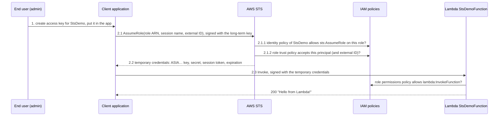
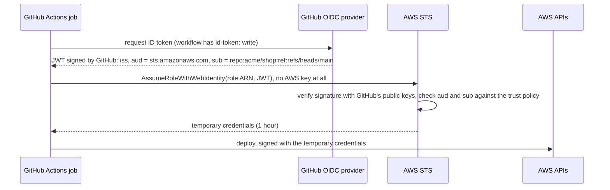
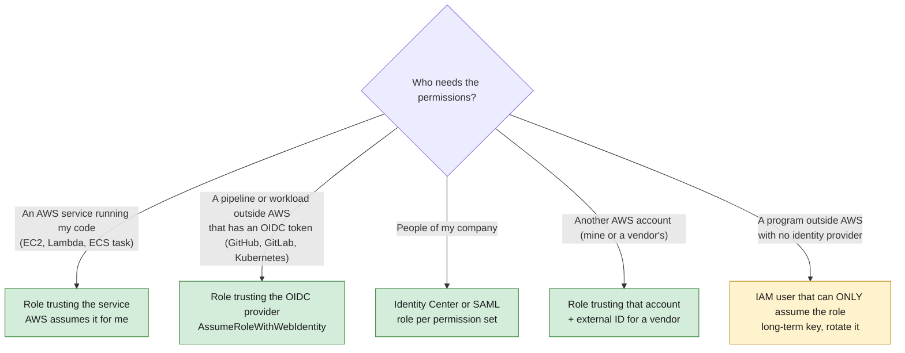

# STS

> [!abstract] In one sentence
> STS (Security Token Service) is the AWS service that hands out **temporary credentials** for an IAM (Identity and Access Management) role: a caller proves who it is (an IAM user's access key, a GitHub token, a corporate SAML (Security Assertion Markup Language) login), STS checks that the caller's own permissions **and** the role's **trust policy** both allow it, and returns a key that expires on its own (15 minutes to 12 hours) and carries only the role's permissions.

## The situation

I have a Lambda function, `StsDemoFunction`, in `us-east-2`. A small program running **outside AWS** (a desktop app, a script on a partner's server) must be able to invoke it, and do **nothing else** in my account.

The program has no AWS identity of its own. Everything below is about how to give it one, and why the "obvious" answer isn't the best one.

## Build-up

### Stage 1: the obvious answer, a user with the permission

The quickest thing: create an IAM user `StsDemo`, attach a policy allowing `lambda:InvokeFunction` on the function, create an access key, paste the key into the program.

It works. The problems show up later:

- The access key (`AKIA…`) **never expires**. It lives in a config file, a laptop, maybe a Git repository by accident. Whoever copies it has the permission until someone notices and deletes the key
- The permission sits **on the user**. If three programs need the same access, I make three users with three copies of the policy, or share one key between them (and then I can't tell them apart in [[CloudTrail]])
- If the program runs on another AWS account, or in GitHub Actions, or the person logs in through the company's directory, there is no natural place for an IAM user at all: I'd be creating a user per account, per pipeline, per person
- There's no way to say "you may use this power **only** when you also passed MFA (Multi-Factor Authentication)" or "only from this partner, with this secret identifier" in a way that's checked at the moment of use

### Stage 2: put the permission on a role instead

A **role** is an IAM identity with permissions but **no credentials**. Nobody logs into a role. Someone *assumes* it, and gets a short-lived copy of its permissions.

So I split the identity in two:

| Piece                                                      | Holds                                                          | Lifetime                                            |
| ---------------------------------------------------------- | -------------------------------------------------------------- | --------------------------------------------------- |
| **The caller** (user, GitHub job, EC2 instance, SSO user…) | A way to prove who it is                                       | Long (user key) or none at all (federation)         |
| **The role** `StsDemoInvokeFunctionRole`                   | The actual permission: `lambda:InvokeFunction` on one function | Permanent definition, but every **session** expires |

The program now does two calls instead of one:

1. **Ask STS**: "I am `StsDemo`, give me credentials for `StsDemoInvokeFunctionRole`" (`sts:AssumeRole`, pointing at the role by its ARN (Amazon Resource Name), see [[ARN]])
2. **Call Lambda** with the temporary credentials STS returned

### Stage 3: two checks guard the door

STS doesn't hand a role to anyone who asks. Two independent policies must agree:

| Check | Lives on | Question it answers | Example |
|---|---|---|---|
| **Identity policy** of the caller | The user / role that calls STS | "Is this caller allowed to call `sts:AssumeRole` on *that* role?" | `Allow sts:AssumeRole` on `arn:aws:iam::111122223333:role/StsDemoInvokeFunctionRole` |
| **Trust policy** of the role | The role itself (tab *Trust relationships*) | "Does this role accept being assumed by *that* principal?" | `Principal: {"AWS": "111122223333"}` |

Then a third policy matters **after** STS: the role's **permissions policy** decides what the temporary credentials can actually do (invoke the Lambda).

This is exactly the diagram from my notes:

![[Pasted image 20261004095806.png]]

The same flow as a sequence:



The full console walkthrough (create the Lambda, the policy, the role, the user, the key, then the code) is in [[Assuming a role step by step]].

### Stage 4: "This account" in the trust policy means "let IAM policies decide"

When I create the role with trusted entity **AWS account → This account**, the console writes this trust policy:

```json
{
  "Version": "2012-10-17",
  "Statement": [
    {
      "Effect": "Allow",
      "Action": "sts:AssumeRole",
      "Principal": { "AWS": "111122223333" },
      "Condition": {
        "StringEquals": { "sts:ExternalId": "ebe74ca7-78fb-4fb2-9133-b5eb5eb7945c" }
      }
    }
  ]
}
```

`"AWS": "111122223333"` (same as `arn:aws:iam::111122223333:root`) does **not** mean "only the root user". It means: *the account trusts the role to anyone in it whose own identity policy allows `sts:AssumeRole` on it*. The role delegates the decision to the account's IAM policies.

That's why the user side is so simple: **attach one small policy to the user and it can assume the role**:

```json
{
  "Version": "2012-10-17",
  "Statement": [
    {
      "Effect": "Allow",
      "Action": "sts:AssumeRole",
      "Resource": "arn:aws:iam::111122223333:role/StsDemoInvokeFunctionRole"
    }
  ]
}
```

The user gets **no other permission**, no console password. Its key alone can't invoke the Lambda, list anything, or read anything. It can only ask STS for the role.

> [!info] The alternative: name the user in the trust policy
> Instead of the account, the trust policy can name the principal directly: `"Principal": {"AWS": "arn:aws:iam::111122223333:user/StsDemo"}`. Inside the **same account**, that alone is enough: the user then doesn't even need the `sts:AssumeRole` identity policy. **Across accounts**, both sides are always required: the other account's admin must grant `sts:AssumeRole` to their user, *and* my role must trust that account or user.

| Trust policy principal | Same account: user needs an identity policy? | Other account: user needs an identity policy? |
|---|---|---|
| The account (`"AWS": "111122223333"`) | **Yes** | **Yes** |
| The exact user ARN | No | **Yes** |

### Stage 5: the external ID, a password for the trust

The demo role also checked **Require external ID** (ID = identifier). That adds the `sts:ExternalId` condition: the caller must send the same random string in its `AssumeRole` request, or STS refuses.

Its real job is the **confused deputy** problem, which only exists with **third parties**:

1. A monitoring SaaS (Software as a Service) vendor assumes roles in its customers' accounts, from its own AWS account
2. I give the vendor my role ARN. Another customer of the same vendor guesses or learns my role ARN and types it into *their own* vendor settings
3. Without an external ID, the vendor's account (which my role trusts) would assume my role on that other customer's behalf
4. With an external ID that the **vendor generates per customer** and that I put in my trust policy, the vendor always sends the *other customer's* ID with their requests, and my role rejects it

So: external ID = for roles assumed by a third party's AWS account. In the same account it adds little, and the console warns that the **Switch Role** button in the console can't send an external ID: the role becomes usable only through the API (Application Programming Interface), the CLI (Command Line Interface) or an SDK (Software Development Kit).

### Stage 6: no user at all, trusting an identity provider (GitHub)

Stages 1 to 5 still have one long-lived secret: the user's access key. The next step removes it completely. Instead of "prove you're `StsDemo` with a key", the caller proves "I am this GitHub Actions job on `main` of `acme/shop`" with a token **GitHub** signs, and AWS trusts GitHub's signature.

This uses OIDC (OpenID Connect, see [[OpenID Connect]]): every GitHub Actions run can ask GitHub for a short-lived JWT (JSON Web Token, see [[JWT and bearer tokens]]) whose claims say which repository, branch and environment is running.



What I set up in the account, once:

**1. Register GitHub as an identity provider.** IAM → Identity providers → Add provider → **OpenID Connect**:
- Provider URL (Uniform Resource Locator): `https://token.actions.githubusercontent.com`
- Audience: `sts.amazonaws.com`

**2. Create the role with trusted entity *Web identity*** (or *Custom trust policy*). Pick the GitHub provider and audience, then tighten the trust policy to one repository and branch:

```json
{
  "Version": "2012-10-17",
  "Statement": [
    {
      "Effect": "Allow",
      "Principal": {
        "Federated": "arn:aws:iam::111122223333:oidc-provider/token.actions.githubusercontent.com"
      },
      "Action": "sts:AssumeRoleWithWebIdentity",
      "Condition": {
        "StringEquals": {
          "token.actions.githubusercontent.com:aud": "sts.amazonaws.com",
          "token.actions.githubusercontent.com:sub": "repo:acme/shop:ref:refs/heads/main"
        }
      }
    }
  ]
}
```

Note what changed compared to Stage 4: the principal is `Federated` (an identity provider), the action is `sts:AssumeRoleWithWebIdentity`, and **the conditions are the whole security**. Every GitHub repository in the world gets tokens from the same issuer, so the `sub` condition is what keeps other people's workflows out.

**3. Attach the permissions policy** to the role (what the deploy needs, nothing more).

**4. In the workflow**, allow the job to request a token and let the official action do the exchange:

```yaml
permissions:
  id-token: write    # lets the job ask GitHub for an OIDC token
  contents: read

jobs:
  deploy:
    runs-on: ubuntu-latest
    steps:
      - uses: actions/checkout@v4
      - uses: aws-actions/configure-aws-credentials@v4
        with:
          role-to-assume: arn:aws:iam::111122223333:role/shop-gha-deploy
          aws-region: us-east-2
      - run: aws sts get-caller-identity   # prints the assumed-role ARN
      - run: aws lambda invoke --function-name StsDemoFunction out.json
```

No secret is stored in GitHub. A leaked workflow log contains, at worst, credentials that die within the hour.

What the `sub` claim looks like depends on how the job runs:

| The job… | `sub` claim |
|---|---|
| runs on a push to `main` | `repo:acme/shop:ref:refs/heads/main` |
| uses `environment: production` | `repo:acme/shop:environment:production` |
| runs on a pull request | `repo:acme/shop:pull_request` |
| runs on a tag `v1.2.0` | `repo:acme/shop:ref:refs/tags/v1.2.0` |

The production version with Terraform, one role per kind of job and environment approvals enforced by AWS is in [[ECS production stack#Stage 0: the pipeline needs state and a way to log in]].

### Stage 7: the same idea everywhere in AWS

Once I see "caller proves identity → STS checks trust → temporary credentials for a role", it's behind almost every way AWS gives out access. The **trusted entity type** I pick when creating a role decides who can call STS for it:

![[Pasted image 20261004101523.png]]

| Trusted entity type (console) | Principal in the trust policy | STS call | Typical use |
|---|---|---|---|
| **AWS service** | `"Service": "ec2.amazonaws.com"` / `lambda.amazonaws.com` / `ecs-tasks.amazonaws.com` | `AssumeRole`, done **by the service for me** | [[EC2]] instance profile, [[Lambda]] execution role, [[ECS]] (Elastic Container Service) task role |
| **AWS account** | `"AWS": "<account ID or ARN>"` | `AssumeRole` | Users of this account (the demo), another account of mine, a vendor (with external ID) |
| **Web identity** | `"Federated": "<OIDC provider>"` or `cognito-identity.amazonaws.com` | `AssumeRoleWithWebIdentity` | GitHub Actions, GitLab, Kubernetes service accounts (EKS (Elastic Kubernetes Service)), mobile apps through Cognito |
| **SAML 2.0 federation** | `"Federated": "<SAML provider>"` | `AssumeRoleWithSAML` | Corporate directory (Entra ID, Okta, AD FS (Active Directory Federation Services)) logging people into roles. SAML = Security Assertion Markup Language |
| **Custom trust policy** | Anything above, written by hand | Any | Several principals, tighter conditions |

[[AWS Identity Center]] is the same thing packaged: each permission set becomes a role in each account, and logging in through the portal assumes it.



The IAM user with an access key is the **last** option: only when the caller has no other way to prove who it is.

## Why roles instead of a user with the permissions

Collecting the reasons from the build-up:

| | IAM user with the permissions | Role assumed through STS |
|---|---|---|
| Credentials | Long-term `AKIA…` key, valid until deleted | `ASIA…` key + session token, **expire** (15 min–12 h) |
| Leaked credential | Works until someone notices | Works until expiry, and **Revoke sessions** kills all current sessions |
| Same access for many callers | One user per caller, or a shared key | One role, many principals in the trust policy |
| Callers with no AWS user (GitHub, SSO people, other accounts, AWS services) | Impossible without creating users everywhere | Native: that's what trust policies are for |
| Conditions at the moment of use | Limited | MFA required, external ID, source IP (Internet Protocol) address, specific repo/branch, session tags |
| Audit | "user X did it" | `assumed-role/RoleName/SessionName`: which role **and** which session (person, job, app) |
| Elevated access on demand | Permanent | Read-only by default, assume an admin role only when needed (break-glass) |

> [!warning] A user that can assume a role isn't automatically safer
> In the demo, if the `StsDemo` key leaks, the attacker can call `AssumeRole` too. The gain there is smaller: the user has **no direct permission**, the role is the single place to change or revoke access, sessions are visible in CloudTrail, and the trust can demand MFA or an external ID. The **big** gain comes when the long-term key disappears entirely (Stages 6 and 7).

## What STS returns

```bash
aws sts assume-role \
  --role-arn arn:aws:iam::111122223333:role/StsDemoInvokeFunctionRole \
  --role-session-name DemoSession \
  --external-id ebe74ca7-78fb-4fb2-9133-b5eb5eb7945c
```

```json
{
  "Credentials": {
    "AccessKeyId": "ASIAEXAMPLEEXAMPLE",
    "SecretAccessKey": "wJalr...EXAMPLE",
    "SessionToken": "IQoJb3JpZ2luX2VjE...",
    "Expiration": "2026-10-04T11:35:00Z"
  },
  "AssumedRoleUser": {
    "AssumedRoleId": "AROAEXAMPLEID:DemoSession",
    "Arn": "arn:aws:sts::111122223333:assumed-role/StsDemoInvokeFunctionRole/DemoSession"
  }
}
```

- **Three values, not two.** Temporary credentials only work with the **session token**. Forgetting it gives "The security token included in the request is invalid"
- Key ID prefix: `AKIA` = long-term user key, `ASIA` = temporary STS key. Handy when reading a leaked key or a CloudTrail record
- `--role-session-name` is free text that ends up in the ARN and in **every CloudTrail record** of the session. Put the person or job in it (`alice`, `gha-run-4812`)
- `--duration-seconds`: 900 (15 minutes) up to the role's **maximum session duration** (1 hour by default, settable up to 12 hours). **Role chaining** (using role credentials to assume another role) is capped at 1 hour
- `--policy`: an optional **session policy** that narrows the session further. The session gets the intersection of the role's permissions and the session policy, never more

To check *who am I right now* (the first thing to run when debugging): `aws sts get-caller-identity`. It needs no permission at all.

The other STS calls worth knowing:

| Call | Does |
|---|---|
| `AssumeRole` | Credentials for a role, called with existing AWS credentials |
| `AssumeRoleWithWebIdentity` | Same, proving identity with an OIDC token (GitHub, Kubernetes, Cognito) |
| `AssumeRoleWithSAML` | Same, with a SAML assertion from a corporate IdP (Identity Provider) |
| `GetSessionToken` | Temporary credentials for the **same user**, typically to add MFA to CLI calls |
| `GetFederationToken` | Temporary credentials for a federated user, issued by a user (older pattern) |
| `GetCallerIdentity` | Who am I (account, ARN) |
| `DecodeAuthorizationMessage` | Decodes the encoded reason in some AccessDenied errors (EC2 mostly) |

Using the role from the CLI without calling `assume-role` by hand, in `~/.aws/config`:

```ini
[profile invoker]
role_arn = arn:aws:iam::111122223333:role/StsDemoInvokeFunctionRole
source_profile = stsdemo-user
external_id = ebe74ca7-78fb-4fb2-9133-b5eb5eb7945c
role_session_name = invoker-cli
```

`aws lambda invoke --profile invoker --function-name StsDemoFunction out.json` then assumes the role, caches the credentials and refreshes them before they expire.

## Advanced problems

| Symptom | Cause | Fix |
|---|---|---|
| `AccessDenied: ... is not authorized to perform: sts:AssumeRole on resource: ...role/X` | Either check failed: the caller's identity policy doesn't allow it, **or** the trust policy doesn't accept the caller (the error message is the same for both) | Check both. `aws sts get-caller-identity` first to see who is really calling, then the role's *Trust relationships* tab |
| Same error, everything looks right, the role has an external ID | The request didn't send the external ID, or sent another one (the console Switch Role can't send it) | Pass `ExternalId` / `--external-id` / `external_id` in the profile |
| `Not authorized to perform sts:AssumeRoleWithWebIdentity` from GitHub | `sub` in the trust policy doesn't match the job (branch vs environment vs pull request), wrong `aud`, or provider not registered | Print the token's claims, compare `sub` exactly. Use `StringLike` with a narrow pattern if several branches must match |
| `Credentials could not be loaded` in GitHub Actions | Workflow lacks `permissions: id-token: write` | Add it at workflow or job level |
| Assume works, the next call fails with `AccessDenied` | The role's **permissions** policy doesn't cover the action or the resource (wrong function ARN, wrong Region in the ARN) | Fix the permissions policy, not the trust |
| `ResourceNotFoundException` invoking the function | The client is pointed at a different Region than the function (`us-east-1` vs `us-east-2`) | Set the Region of the Lambda client to the function's Region |
| `The security token included in the request is invalid` | Session token missing, credentials expired, or global STS endpoint token used in an opt-in Region | Pass all three values; refresh; use the regional STS endpoint (see [[AWS Regions and Availability Zones]]) |
| Credentials expire in the middle of a long job | Session shorter than the job, or role chaining (max 1 hour) | Raise the role's max session duration, request a longer `DurationSeconds`, let the SDK refresh |
| A leaked session must die **now** | Temporary credentials can't be deleted | Role → **Revoke sessions**: adds a deny for all sessions issued before now. Then fix the source of the leak |

## Practice

> [!example]- A role trusts `"AWS": "111122223333"` (its own account). A user in that account with only `ReadOnlyAccess` tries to assume it. Does it work?
> No. Trusting the account delegates the decision to identity policies, and `ReadOnlyAccess` doesn't include `sts:AssumeRole` on that role. Add an identity policy allowing `sts:AssumeRole` on the role ARN.

> [!example]- The trust policy names `arn:aws:iam::111122223333:user/StsDemo` directly. Does the user need an identity policy for `sts:AssumeRole`?
> Not in the same account: the resource-based trust policy granting the user is enough. In a cross-account setup it would.

> [!example]- When is an external ID actually useful?
> When a **third party's** AWS account assumes a role in my account (vendor, SaaS). The vendor generates a unique ID per customer, so another customer can't trick the vendor into assuming my role (confused deputy).

> [!example]- A GitHub workflow on a pull request can't assume the deploy role, the one on `main` can. Why?
> The trust policy's `sub` condition is `repo:acme/shop:ref:refs/heads/main`. Pull request jobs present `sub = repo:acme/shop:pull_request`. That's intended: pull requests (including from forks) shouldn't get deploy credentials.

> [!example]- In CloudTrail I see `arn:aws:sts::111122223333:assumed-role/StsDemoInvokeFunctionRole/DemoSession` invoking the function. Who was it?
> Whoever assumed the role with session name `DemoSession`. Find the matching `AssumeRole` event in CloudTrail (same session) to see the original caller, here the `StsDemo` user. See [[CloudTrail in production#Scenario 2: "From an assumed role back to a human"]].

## Easy to get wrong
- **Trust policy ≠ permissions policy.** The trust policy says *who may become* the role. The permissions policy says *what the role may do*. AccessDenied on `AssumeRole` is a trust/identity problem, AccessDenied on the later call is a permissions problem
- Trusting the account (`"AWS": "<account ID>"`) does **not** mean only root. It means any principal in that account allowed by its own identity policy
- Cross-account always needs **both** sides: the trust policy here and an identity policy there
- Temporary credentials are **three** values: key ID, secret, **session token**
- The Lambda's **execution role** (what the function can do, `lambda.amazonaws.com` trust) is a different role from the role a client assumes to **invoke** it
- External ID is against confused deputy for **third parties**, it's not a general password, and the console Switch Role can't use it
- GitHub OIDC trust without a tight `sub` condition trusts **every repository on GitHub**
- Revoking a session is done on the **role** (Revoke sessions), not by deleting the user's key
- `GetCallerIdentity` needs no permission: always the first debugging command

## Related
- Part of:: [[IAM]]
- Depends on:: [[IAM]], [[ARN]], [[Authentication and authorization]]
- Walkthrough:: [[Assuming a role step by step]]
- Federation:: [[OpenID Connect]], [[JWT and bearer tokens]], [[Single sign-on]], [[AWS Identity Center]]
- Used by:: [[Lambda]], [[EC2]], [[ECS]], [[ECS production stack]], [[S3 replication]]
- Auditing:: [[CloudTrail]], [[CloudTrail in production]]
- Signing:: [[HMAC request signing]] (every call with the temporary key is still SigV4-signed)
- Regional endpoints:: [[AWS Regions and Availability Zones]]

## Flashcards
#flashcards

What does STS do? :: Issues temporary credentials (key ID, secret, session token) for an IAM role after checking the caller is allowed to assume it
Which two policies must allow an AssumeRole? :: The caller's identity policy (sts:AssumeRole on the role) and the role's trust policy (accepts that principal). Same-account exception: a trust policy naming the user directly is enough on its own
Trust policy vs permissions policy of a role? :: Trust policy = who may assume the role. Permissions policy = what the role's sessions may do
What does `"Principal": {"AWS": "111122223333"}` in a trust policy mean? :: Anyone in account 111122223333 whose own identity policy allows sts:AssumeRole on this role (not only root)
Why assume a role instead of giving a user the permissions directly? :: Credentials expire, one role serves many callers, callers without IAM users (GitHub, SSO, other accounts, services) can use it, conditions like MFA/external ID at use time, sessions visible and revocable
What is the external ID for? :: Preventing the confused deputy problem when a third party's AWS account assumes a role in my account
STS call used by GitHub Actions to get AWS credentials? :: AssumeRoleWithWebIdentity, with the GitHub OIDC token (JWT)
What protects a GitHub OIDC role from other people's repositories? :: The `sub` (and `aud`) conditions in the trust policy, e.g. sub = repo:acme/shop:ref:refs/heads/main
What must a GitHub workflow declare to request an OIDC token? :: permissions: id-token: write
Key ID prefix of temporary vs long-term credentials? :: ASIA = temporary (STS), AKIA = long-term user key
Default and maximum session duration of a role? :: 1 hour by default, configurable up to 12 hours (minimum 15 minutes). Role chaining is capped at 1 hour
How do you kill all active sessions of a role? :: Revoke sessions on the role: adds a deny for sessions issued before that time
First command when debugging permissions? :: aws sts get-caller-identity (needs no permission)
What does the session name do? :: It appears in the assumed-role ARN and in every CloudTrail record of the session, so I can tell who used the role
