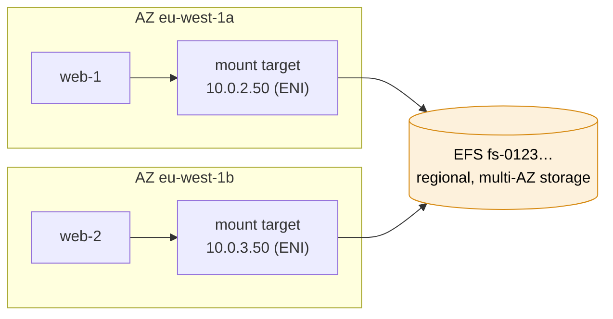

# EFS

> [!abstract] In one sentence
> EFS (Elastic File System) is AWS's managed **NFS** file system: many EC2 instances, containers and Lambda functions can mount the same files at once, it grows and shrinks automatically, and it speaks **NFSv4.0/4.1 only**, so it works with **Linux** clients and **not with Windows**, whose shared-drive needs are covered by **FSx for Windows File Server**.

## Build-up: shared uploads for the shop

Shop account `123456789012`, `eu-west-1`. The web fleet (`shop-prod-web`, Amazon Linux 2023, private subnets `10.0.2.0/24` in AZ a and `10.0.3.0/24` in AZ b) needs one `/srv/uploads` directory shared by every instance (the problem described in [[NFS and SMB#Build-up: a shared folder for the shop]]). Running my own NFS server would mean patching it, sizing its disk, and it being a single point of failure. EFS is the managed version.

### Stage 1: a file system and its mount targets

```bash
aws efs create-file-system --encrypted --performance-mode generalPurpose \
  --throughput-mode elastic --tags Key=Name,Value=shop-prod-uploads
# → fs-0123456789abcdef0

aws efs create-mount-target --file-system-id fs-0123456789abcdef0 \
  --subnet-id subnet-0priv2a --security-groups sg-0efs
aws efs create-mount-target --file-system-id fs-0123456789abcdef0 \
  --subnet-id subnet-0priv3b --security-groups sg-0efs
```

- The file system itself is **regional**: data is stored redundantly across several AZs (Standard). A **One Zone** file system is cheaper and lives in one AZ
- A **mount target** is an **ENI with a private IP** in one subnet, the NFS endpoint clients connect to. **One per AZ** where clients run (an instance in AZ b mounting a target in AZ a works, but pays cross-AZ traffic and fails with that AZ)
- The DNS name `fs-0123456789abcdef0.efs.eu-west-1.amazonaws.com` resolves to the mount target **in the client's own AZ** (the VPC needs DNS resolution and DNS hostnames enabled)
- **Security groups:** `sg-0efs` on the mount targets allows **TCP 2049 (NFS)** from the web servers' security group. Nothing else. A missing 2049 rule is the #1 reason a mount hangs (see [[Security groups]])



### Stage 2: mounting it from Linux

Two ways to mount.

**With the EFS mount helper** (`amazon-efs-utils`, recommended): it adds TLS, IAM authentication, access points, and the right NFS options for me.

```bash
sudo dnf install -y amazon-efs-utils          # Amazon Linux. Other distros: build/install efs-utils
sudo mkdir -p /srv/uploads
sudo mount -t efs -o tls fs-0123456789abcdef0:/ /srv/uploads
```

`/etc/fstab`:

```
fs-0123456789abcdef0:/  /srv/uploads  efs  _netdev,noresvport,tls  0 0
```

**With the plain NFS client**: no helper, no TLS, no IAM. This is where the **`nfs-utils`** package (RHEL/Amazon Linux; `nfs-common` on Ubuntu) comes in:

```bash
sudo mount -t nfs4 -o nfsvers=4.1,rsize=1048576,wsize=1048576,hard,timeo=600,retrans=2,noresvport \
  fs-0123456789abcdef0.efs.eu-west-1.amazonaws.com:/ /srv/uploads
```

Both are **Linux** commands, for a **Linux** NFS client. `-t efs` is the helper's filesystem type, and `-o` passes options (`tls`, `iam`, `accesspoint=…`). There's no `-o force` or `--mount` option involved in any of this.

### Stage 3: authorizing clients with IAM

So far, any machine that can reach port 2049 on a mount target can mount the whole file system: access is purely **network-based** (security groups) plus Unix file permissions. For production, I want to say **which roles** may mount, write, or act as root.

1. A **file system policy** (a resource policy on the file system):

```json
{
  "Statement": [
    { "Effect": "Allow",
      "Principal": { "AWS": "arn:aws:iam::123456789012:role/shop-prod-web-role" },
      "Action": ["elasticfilesystem:ClientMount", "elasticfilesystem:ClientWrite"],
      "Resource": "arn:aws:elasticfilesystem:eu-west-1:123456789012:file-system/fs-0123456789abcdef0",
      "Condition": { "Bool": { "elasticfilesystem:AccessedViaMountTarget": "true" } } },
    { "Effect": "Deny", "Principal": { "AWS": "*" }, "Action": "*",
      "Resource": "arn:aws:elasticfilesystem:eu-west-1:123456789012:file-system/fs-0123456789abcdef0",
      "Condition": { "Bool": { "aws:SecureTransport": "false" } } }
  ]
}
```

   - `ClientMount` = read-only mount, `ClientWrite` = write, `ClientRootAccess` = root on the file system (without it, root is squashed)
   - The deny forces **TLS** for every client

2. Mount with the **`iam`** option, which makes the helper sign the connection with the **instance profile's credentials**:

```bash
sudo mount -t efs -o tls,iam fs-0123456789abcdef0:/ /srv/uploads
```

`iam` **requires `tls`**. Clients that don't use `iam` are treated as **anonymous** and only get what the policy allows anonymous principals (here: nothing).

> [!question] The exam question
> *"You are configuring an EC2 **Windows** instance to connect to EFS. While attempting to mount with IAM, you use the `-o iam` option in your mount command, but the mount fails. Why?"*
>
> **Because it's a Windows instance, and EFS doesn't support Windows.** EFS speaks only NFSv4.0/4.1; Windows' built-in NFS client stops at NFSv3, and EFS doesn't speak SMB (see [[NFS and SMB#Stage 4: can Windows mount NFS, and Linux mount SMB?]]). The `-o iam` option itself is correct (it belongs to the Linux mount helper). The distractors:
> - *"-o force instead of -o iam"*: there's no such fix, `iam` is the right option for IAM authorization
> - *"--mount instead of -o iam"*: not an option of the mount helper
> - *"nfs-utils not installed"*: `nfs-utils` is a **Linux** package. On Windows there's nothing to install that would make EFS work
>
> The question's details about IAM and mount options are noise. The first thing to check is the **operating system**. A Windows file share on AWS → **FSx for Windows File Server**.

### Stage 4: one file system, several apps (access points)

The invoices service and the uploads service should share the EFS file system but **not each other's directories**, and each should write files as its own POSIX user, whatever UID the container runs as.

An **access point** is an application-specific entry into the file system that **enforces**:
- A **root directory** (`/uploads`): the client sees it as `/` and can't go above it. Created automatically with the owner and permissions I specify
- A **POSIX user and group** (UID/GID) applied to **every** request through it, regardless of who the client claims to be (this fixes NFS's classic UID mismatch problem)

```bash
aws efs create-access-point --file-system-id fs-0123456789abcdef0 \
  --posix-user Uid=1001,Gid=1001 \
  --root-directory 'Path=/uploads,CreationInfo={OwnerUid=1001,OwnerGid=1001,Permissions=750}'
# → fsap-0abc…

sudo mount -t efs -o tls,iam,accesspoint=fsap-0abc… fs-0123456789abcdef0:/ /srv/uploads
```

The file system policy can then allow each role only **its** access point (`Condition: { "StringEquals": { "elasticfilesystem:AccessPointArn": "arn:…:access-point/fsap-0abc…" } }`).

Access points are how containers and functions use EFS: an [[ECS]] task definition volume (Fargate included) and a [[Lambda]] function's file system configuration both point at an access point, with IAM authorization.

### Stage 5: cost and performance

**Storage classes** with **lifecycle management**:

| Class | For | Notes |
|---|---|---|
| **Standard** | Frequently used files | Multi-AZ (or One Zone) |
| **Infrequent Access (IA)** | Not touched for weeks | Cheaper storage, pay per GB read |
| **Archive** | Rarely touched for months | Cheapest storage, higher access cost |

A lifecycle policy moves files to IA after e.g. 30 days without access, to Archive after 90, and **back to Standard on first access** if configured. Old product photos then cost a fraction of new ones. I pay for **what's stored**, nothing to provision.

**Throughput modes:**
- **Elastic** (default, recommended): throughput scales with the workload, pay per GB transferred. Good for spiky or unknown workloads
- **Provisioned**: a fixed throughput I pay for, for steady high throughput with little data
- **Bursting**: throughput tied to the amount of data stored, with burst credits (older default: a small file system can run out of credits and crawl)

**Performance mode:** General Purpose (default, lowest latency). Max I/O is a legacy option for very parallel workloads.

Latency is **network file system latency**: fine for shared content, slow for many tiny files, wrong for databases (see [[NFS and SMB#Advanced problems]]).

### Stage 6: protecting the data

- **Encryption at rest** with KMS: chosen **at creation** (can't be turned on later; a new file system and a copy would be needed)
- **Encryption in transit**: the helper's `tls` option (enforced by the `aws:SecureTransport` deny above)
- **Backups**: *[[AWS Backup]]* plans (automatic backups are on by default for file systems created in the console)
- **EFS replication**: a read-only replica file system in another Region or account, kept in sync automatically (RPO of minutes), promoted on failover

## EFS vs the other AWS storage

| | **EFS** | **EBS** | **S3** | **FSx for Windows File Server** | **FSx for NetApp ONTAP** |
|---|---|---|---|---|---|
| Type | File (NFS) | Block (a disk) | Object (HTTP API) | File (**SMB**) | File (NFS **and** SMB) + block (iSCSI) |
| Clients | **Linux** | One instance (Multi-Attach for special cases) | Anything with HTTP | **Windows** (and Linux via SMB) | Windows **and** Linux |
| Shared by many | ✅ Thousands | ❌ | ✅ (not as a filesystem) | ✅ | ✅ |
| Scope | Regional (or One Zone) | One AZ | Regional | Single- or Multi-AZ | Single- or Multi-AZ |
| Sizing | Automatic | Provisioned size | Automatic | Provisioned | Provisioned |
| Identity | IAM + POSIX | n/a | IAM | **Active Directory**, Windows ACLs | AD and/or POSIX |

Rules of thumb:
- Linux servers sharing files → **EFS**
- Windows servers or users needing a shared drive (`\\server\share`), AD permissions → **FSx for Windows File Server**
- Both Windows and Linux on the **same** data → **FSx for NetApp ONTAP**
- One instance's disk, databases → **EBS**
- New apps storing files → **[[S3]]**

## When the mount fails

| Symptom | Likely cause | Fix |
|---|---|---|
| Mount hangs, then times out | Security group on the mount target doesn't allow TCP 2049 from the client, or no mount target in that AZ | SG rule from the clients' SG, a mount target per AZ |
| `Failed to resolve "fs-….efs.eu-west-1.amazonaws.com"` | VPC DNS hostnames/resolution off, or a custom DNS server | Enable VPC DNS attributes, or mount by mount target IP |
| `access denied by server` | File system policy doesn't allow this role, or `iam` not used when required | Policy actions/principal, mount with `-o tls,iam` |
| `mount: unknown filesystem type 'efs'` | Mount helper not installed | Install `amazon-efs-utils` (or use `-t nfs4`) |
| `iam` option rejected | `iam` without `tls` | `-o tls,iam` |
| Writes fail with permission denied | POSIX permissions / UID mismatch, root squashed (no `ClientRootAccess`) | Access point with a POSIX user, or fix ownership |
| It's a **Windows** instance | EFS doesn't support Windows | FSx for Windows File Server (SMB) |

## Practice

> [!example]- A Windows EC2 instance can't mount EFS with `-o iam`. Why?
> EFS isn't supported on Windows (NFSv4 only, Windows' NFS client is v3, EFS has no SMB). Use FSx for Windows File Server.

> [!example]- What does a mount target need so that instances can mount?
> A security group allowing inbound TCP 2049 from the clients, and a mount target in each AZ where clients run.

> [!example]- What does `-o iam` do, and what must accompany it?
> The mount helper authenticates with the instance's IAM role, so the file system policy can authorize it. It requires `-o tls`.

> [!example]- Two apps share one EFS file system but must not see each other's files, and must write as fixed UIDs. How?
> One access point per app, each with its own root directory and POSIX user, and a file system policy restricting each role to its access point.

> [!example]- Windows and Linux servers must work on the same shared files. Which service?
> FSx for NetApp ONTAP (NFS and SMB on the same data).

> [!example]- Can encryption at rest be enabled on an existing unencrypted EFS file system?
> No, only at creation. Create an encrypted file system and copy the data.

## Easy to get wrong
- Trying to use EFS from Windows (Linux only: FSx for Windows instead)
- Forgetting TCP 2049 on the mount targets' security group
- One mount target for all AZs (cross-AZ cost, AZ failure)
- `-o iam` without `-o tls`
- Thinking IAM replaces POSIX permissions (both apply)
- No file system policy: anyone on the network path can mount
- Encryption at rest not set at creation
- Bursting throughput on a small file system running out of credits
- Putting databases or millions of tiny files on EFS
- Confusing the package names: `amazon-efs-utils` (helper) vs `nfs-utils`/`nfs-common` (plain NFS client)

## Related
- Concept:: [[NFS and SMB]], [[How network file sharing works]], [[Mounting]], *[[Block, file and object storage]]*, [[Storage]]
- Clients:: [[EC2]], [[ECS]], [[ECS tasks and task definitions]] (EFS volumes), [[Lambda]]
- Network and access:: [[VPC]], [[Security groups]], [[IAM]]
- Other storage:: [[S3]], *[[EBS]]*
- Regions and AZs:: [[AWS Regions and Availability Zones]]

## Flashcards
#flashcards

What is EFS? :: AWS's managed NFS file system: shared by many Linux clients, elastic size, regional
Which protocol and versions does EFS use? :: NFSv4.0 and NFSv4.1
Does EFS support Windows instances? :: No. Use FSx for Windows File Server (SMB)
Why can't Windows mount EFS? :: EFS is NFSv4 only, Windows' NFS client supports only v2/v3, and EFS doesn't speak SMB
What is an EFS mount target? :: An ENI with a private IP in one subnet, the NFS endpoint clients connect to. One per AZ
Which port must the mount target's security group allow? :: TCP 2049 (NFS) from the clients
What is amazon-efs-utils? :: The EFS mount helper (mount -t efs) adding TLS, IAM auth and access points
What does nfs-utils provide? :: The plain Linux NFS client (nfs-common on Ubuntu), for mount -t nfs4
What does -o iam do on an EFS mount? :: Authenticates the mount with the instance's IAM role, checked against the file system policy
What option must accompany -o iam? :: -o tls
EFS IAM actions for clients? :: elasticfilesystem:ClientMount, ClientWrite, ClientRootAccess
What is an EFS access point? :: An app-specific entry enforcing a root directory and a POSIX user/group on every request
How do ECS tasks and Lambda functions use EFS? :: Through access points (with IAM authorization)
EFS storage classes? :: Standard, Infrequent Access, Archive, with lifecycle management
Default and recommended EFS throughput mode? :: Elastic
Can EFS encryption at rest be enabled later? :: No, only at creation
Shared files for Windows and Linux on the same data? :: FSx for NetApp ONTAP
EFS vs EBS? :: EFS: shared NFS file system, regional, many clients. EBS: block disk for one instance in one AZ
