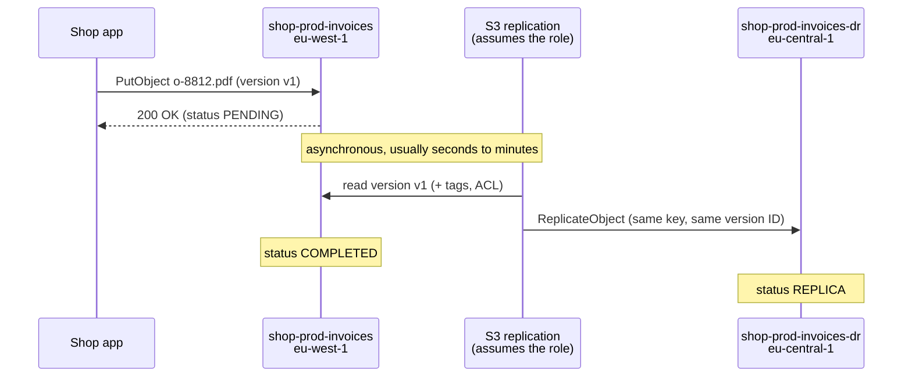
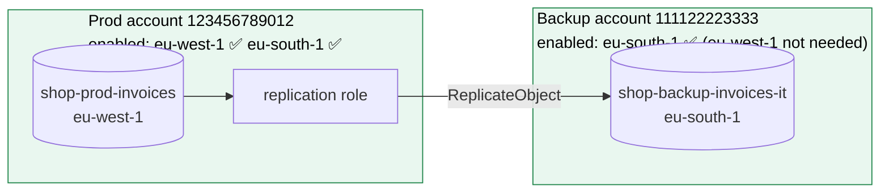

# S3 replication

> [!abstract] In one sentence
> S3 replication **copies new objects automatically and asynchronously** from a source bucket to one or more destination buckets, in another Region (**CRR**) or the same one (**SRR**), in the same or **another account**. S3 does the copying by assuming an **IAM role** I give it, and it only works when a short list of requirements holds: versioning on both sides, the right permissions on both sides, and the Regions involved **enabled** for the accounts that need them.

## Build-up: protecting the shop's invoices

Shop prod account `123456789012`, bucket `shop-prod-invoices` in `eu-west-1`. A separate **backup account** `111122223333` holds copies nobody in prod can touch. The basics of buckets and versioning are in [[S3]].

### Stage 1: the simplest rule (same account, another Region)

Goal: every new invoice also lands in `shop-prod-invoices-dr` in `eu-central-1` (Frankfurt), in case `eu-west-1` has a bad day.

**Requirement 1: versioning on both buckets.** Replication works on **object versions**, so both buckets must have versioning enabled:

```bash
aws s3api put-bucket-versioning --bucket shop-prod-invoices    --versioning-configuration Status=Enabled
aws s3api put-bucket-versioning --bucket shop-prod-invoices-dr --versioning-configuration Status=Enabled
```

**Requirement 2: a role S3 can assume.** S3 copies the objects **as** this role, so it needs to read from the source and write to the destination:

```json
// trust policy: who can assume the role
{ "Effect": "Allow", "Principal": { "Service": "s3.amazonaws.com" }, "Action": "sts:AssumeRole" }
```

```json
// permissions
[
  { "Effect": "Allow",
    "Action": ["s3:GetReplicationConfiguration", "s3:ListBucket"],
    "Resource": "arn:aws:s3:::shop-prod-invoices" },
  { "Effect": "Allow",
    "Action": ["s3:GetObjectVersionForReplication", "s3:GetObjectVersionAcl", "s3:GetObjectVersionTagging"],
    "Resource": "arn:aws:s3:::shop-prod-invoices/*" },
  { "Effect": "Allow",
    "Action": ["s3:ReplicateObject", "s3:ReplicateDelete", "s3:ReplicateTags"],
    "Resource": "arn:aws:s3:::shop-prod-invoices-dr/*" }
]
```

**Requirement 3: a replication configuration** on the **source** bucket (rules are always defined on the source):

```json
{
  "Role": "arn:aws:iam::123456789012:role/s3-replication-invoices",
  "Rules": [{
    "ID": "invoices-to-frankfurt",
    "Status": "Enabled",
    "Priority": 1,
    "Filter": { "Prefix": "invoices/" },
    "DeleteMarkerReplication": { "Status": "Disabled" },
    "Destination": {
      "Bucket": "arn:aws:s3:::shop-prod-invoices-dr",
      "StorageClass": "STANDARD_IA"
    }
  }]
}
```

```bash
aws s3api put-bucket-replication --bucket shop-prod-invoices --replication-configuration file://replication.json
```

- **Filter**: a prefix and/or tags, so only part of the bucket can be replicated
- **StorageClass** of the replica can differ: a cheaper class for a copy that's rarely read
- Several rules can send different prefixes to different destinations (priority decides overlaps)

Now upload an invoice and check the source object's **replication status**:

```bash
aws s3api head-object --bucket shop-prod-invoices --key invoices/2026/10/o-8812.pdf \
  --query ReplicationStatus
# "PENDING" → "COMPLETED"   (or "FAILED")
# on the destination copy: "REPLICA"
```



The upload returns **before** the copy exists. Replication is **asynchronous**: a Region outage a few seconds after an upload can lose that last object's replica.

### Stage 2: what about last year's invoices?

The rule only applies to objects written **after** it exists. The 400,000 invoices already in the bucket aren't copied.

**S3 Batch Replication** replicates existing objects (and retries ones that **FAILED**): a Batch Operations job over a generated manifest of the bucket's objects. The console offers it right after creating the rule.

### Stage 3: copying into another account

Copies in the prod account don't protect against a compromised prod admin, or a deleted prod account. The real backup goes to `shop-backup-invoices` in account `111122223333`.

Cross-account adds one thing: the **destination account must let the source's role write**. The source account's IAM permissions aren't enough, because the bucket belongs to someone else (same rule as any cross-account S3 access: their IAM policy **and** my bucket policy, see [[S3#Who can access a bucket: the evaluation]]).

Destination bucket policy (in the backup account):

```json
{
  "Effect": "Allow",
  "Principal": { "AWS": "arn:aws:iam::123456789012:role/s3-replication-invoices" },
  "Action": ["s3:ReplicateObject", "s3:ReplicateDelete", "s3:ReplicateTags",
             "s3:GetBucketVersioning", "s3:PutBucketVersioning"],
  "Resource": ["arn:aws:s3:::shop-backup-invoices", "arn:aws:s3:::shop-backup-invoices/*"]
}
```

**Who owns the replicas?** With **Object Ownership = Bucket owner enforced** (ACLs disabled, the default for new buckets), the **destination account** owns every replica automatically. With ACLs still in use, the rule needs **owner override** (`AccessControlTranslation: { Owner: Destination }` plus `s3:ObjectOwnerOverrideToBucketOwner`), or the backup account would hold objects owned by prod that it can't fully control.

Also: the source bucket owner must be able to **read** every object it replicates. Objects uploaded by **another account** into the source bucket (with ACLs) aren't replicated unless their owner granted read access.

### Stage 4: replicating into an opt-in Region

Compliance now wants a copy in **Italy**: `eu-south-1` (Milan). Milan is an **opt-in Region**: disabled by default in every account until someone enables it (see [[AWS Regions and Availability Zones#Stage 4: a Region that isn't there (opt-in Regions)]]).

Two accounts, two Regions. Which account needs which Region enabled?

| Account | Its role in replication | Must have enabled |
|---|---|---|
| **Source bucket owner** (prod) | Its bucket is in the source Region, and **its role** reads there and writes into the destination Region | **Source and destination** Regions |
| **Destination bucket owner** (backup) | Its bucket is in the destination Region | **Destination** Region only |



The logic: each account needs the Regions **where it acts**. The source owner's role works in both Regions. The destination owner only has a bucket in the destination Region and doesn't do anything in the source Region, so it doesn't need it.

> [!question] The exam question
> *"You must perform S3 replication. The source bucket owner has access to both source and destination Regions, while the destination bucket owner has access to only the destination Region. Which statement is true, given that you have met other replication considerations?"*
>
> **The replication will be successful.** This is exactly the documented requirement: source owner → both Regions enabled, destination owner → destination Region enabled. The trap is assuming both accounts need both Regions ("the destination owner can't see the source Region, so it fails"). The destination owner never touches the source Region. S3 also never "prompts with a warning": replication is a background process configured by a rule, with nothing interactive about it.

### Stage 5: encrypted objects

The invoices bucket uses **SSE-KMS** with a customer managed key. The first cross-Region test copies nothing for KMS-encrypted objects. They're **not replicated by default**:
- The rule must opt in: `SourceSelectionCriteria: { SseKmsEncryptedObjects: { Status: Enabled } }`
- The destination must say which key to use: `EncryptionConfiguration: { ReplicaKmsKeyID: <key ARN in the destination Region> }` (KMS keys are regional; a **multi-Region key** can be the same logical key in both)
- The role needs `kms:Decrypt` on the **source** key and `kms:Encrypt` on the **destination** key
- Cross-account: the **destination key's policy** must allow the source role

Objects with **SSE-S3** (the default encryption) replicate with no extra setup.

### Stage 6: deletes, mistakes and ransomware

What happens to the copy when something is deleted on the source:

| Action on the source | Replicated? |
|---|---|
| `DELETE` without a version ID (adds a **delete marker**) | **Only if** `DeleteMarkerReplication` is enabled in the rule |
| `DELETE` of a **specific version** (permanent delete) | **Never** |
| Lifecycle expiration | **Never** (lifecycle actions aren't replicated) |

That asymmetry is deliberate: a malicious or buggy permanent delete on the source **can't wipe the replica**. For a backup copy, I keep delete-marker replication **off**.

For backups that even a compromised admin can't destroy: **S3 Object Lock** on the destination (compliance mode, e.g. 7 years). If the **source** bucket has Object Lock, the destination **must** have it too.

### Stage 7: "how fast is it, and how do I know?"

Most objects replicate within seconds to minutes, but there's no guarantee by default. For a contractual RPO:
- **S3 Replication Time Control (RTC)**: 99.99% of objects replicated within **15 minutes**, backed by an SLA, plus replication **metrics** (bytes and operations pending, latency) and **events** when an object misses the 15 minutes
- Even without RTC, replication metrics can be enabled and watched in [[CloudWatch]], with [[CloudWatch alarms]] on pending operations and S3 event notifications for failures (`s3:Replication:OperationFailedReplication`)

### Stage 8: two-way replication

Customers upload photos to the nearest of two Regions, and both buckets should end up with everything (active-active):
- One rule A → B and one rule B → A
- **Replica modification sync**: changes to a replica's metadata (tags, ACL, Object Lock) also sync back
- **S3 Multi-Region Access Points**: one global endpoint that routes requests to the closest bucket and can fail over between them

Replication isn't **chained**: if A replicates to B and B to C, objects that arrived in B as **replicas** of A are not passed on to C. C only gets what was written directly to B. To get A's objects into C, A needs its own rule to C.

## What replication copies, and what it doesn't

| Replicated | Not replicated |
|---|---|
| New object versions written after the rule | Objects that existed before the rule (use **Batch Replication**) |
| Object metadata, tags, (ACLs), Object Lock retention | Bucket-level settings: lifecycle rules, bucket policy, notifications, CORS |
| SSE-S3 objects; SSE-KMS objects if opted in | SSE-KMS objects when the rule doesn't opt in |
| Delete markers, if enabled | Permanent deletes of a version, lifecycle expirations |
| Objects the source owner can read | Objects owned by other accounts without read permission for the source owner |
| | Objects already in S3 Glacier Flexible Retrieval / Deep Archive |
| | Replicas created by another replication rule (no chaining) |

## When objects stay PENDING or turn FAILED

| Cause | Check |
|---|---|
| Versioning off on one side | `get-bucket-versioning` on both |
| Role missing a permission | Role policy, and that the trust policy allows `s3.amazonaws.com` |
| Cross-account: destination bucket policy doesn't allow the role | Destination bucket policy |
| KMS: rule not opted in, wrong destination key, key policy missing the role | Rule's `SourceSelectionCriteria`, both key policies |
| A Region not enabled for an account that needs it | Opt-in status of source + destination Region (source owner) and destination Region (destination owner) |
| Object Lock on the source but not the destination | Destination bucket's Object Lock configuration |
| Object owned by another account | Object ACL / ownership |

FAILED objects are retried with **Batch Replication**.

## Practice

> [!example]- The source owner has both Regions enabled, the destination owner only the destination Region. Will replication work (other requirements met)?
> Yes. Source owner: source + destination Regions. Destination owner: destination Region only.

> [!example]- I created a replication rule today. Why aren't last month's objects in the destination?
> Rules only apply to new writes. Use S3 Batch Replication for existing objects.

> [!example]- What does the destination account need for cross-account replication?
> A bucket policy allowing the source's replication role to replicate (ReplicateObject etc.), versioning on, the destination Region enabled, and if KMS is used, a key policy allowing the role.

> [!example]- Someone permanently deletes object versions in the source. What happens to the replicas?
> Nothing. Deleting specific versions is never replicated.

> [!example]- KMS-encrypted objects aren't replicated, SSE-S3 ones are. Why?
> SSE-KMS objects need an explicit opt-in in the rule, a destination key, and KMS permissions for the role.

> [!example]- I need a guaranteed replication time for compliance. What feature?
> S3 Replication Time Control: 99.99% within 15 minutes, with an SLA and metrics.

> [!example]- A replicates to B, B replicates to C. Do A's objects reach C?
> No. Replicas aren't replicated again. A needs a rule to C.

## Easy to get wrong
- Forgetting versioning on the **destination**
- Expecting existing objects to be copied (Batch Replication)
- Thinking both accounts need both Regions enabled (only the source owner does)
- Defining the rule on the destination (rules live on the source)
- Cross-account without a destination bucket policy for the role
- Assuming SSE-KMS objects replicate by default
- Expecting deletes to mirror: permanent deletes and lifecycle expirations never replicate
- Expecting bucket settings (lifecycle, policies) to be copied
- Expecting chained replication A → B → C
- Treating replication as synchronous: the latest writes can be lost in a Region outage (RTC for a 15-minute guarantee)
- Source Object Lock with a destination that doesn't have it

## Related
- Basics:: [[S3]]
- Regions and opt-in:: [[AWS Regions and Availability Zones]]
- Permissions:: [[IAM]], [[AWS Organizations]] (separate backup account)
- Monitoring:: [[CloudWatch]], [[CloudWatch alarms]], [[CloudTrail]]
- Concept:: *[[Storage replication]]*, [[Storage]]

## Flashcards
#flashcards

What is S3 CRR vs SRR? :: Cross-Region Replication copies to a bucket in another Region. Same-Region Replication to a bucket in the same Region
Is S3 replication synchronous? :: No, asynchronous: the upload returns before the copy exists
What must be enabled on both buckets for replication? :: Versioning
Where is the replication rule configured? :: On the source bucket
How does S3 get permission to replicate? :: It assumes an IAM role (trusted by s3.amazonaws.com) that can read the source and replicate to the destination
Does a new replication rule copy existing objects? :: No. Use S3 Batch Replication
Replication requirement for the source bucket owner's Regions? :: Source and destination Regions enabled for its account
Replication requirement for the destination bucket owner's Regions? :: Only the destination Region enabled
Extra requirement for cross-account replication? :: The destination bucket policy must allow the source's replication role
Who owns replicas with Bucket owner enforced? :: The destination bucket owner, automatically
Are SSE-KMS objects replicated by default? :: No. The rule must opt in, name a destination key, and the role needs KMS permissions
Are delete markers replicated? :: Only if delete marker replication is enabled in the rule
Are permanent version deletes replicated? :: Never
Are lifecycle expirations replicated? :: No
Can objects in Glacier Flexible Retrieval or Deep Archive be replicated? :: No
Is replication chained (A→B→C)? :: No. Replicas aren't replicated again
What does S3 RTC guarantee? :: 99.99% of objects replicated within 15 minutes, with an SLA and metrics
Replication status values? :: PENDING, COMPLETED, FAILED on the source, REPLICA on the destination
If the source bucket uses Object Lock, what must the destination have? :: Object Lock enabled
How are FAILED replications retried? :: S3 Batch Replication
