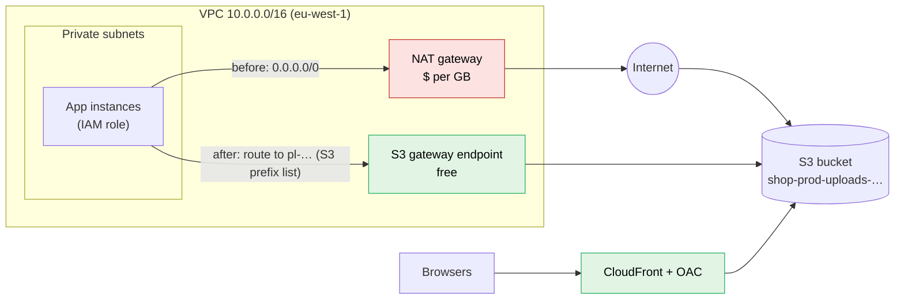
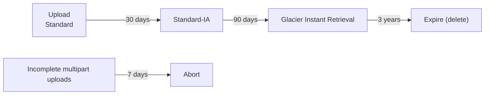
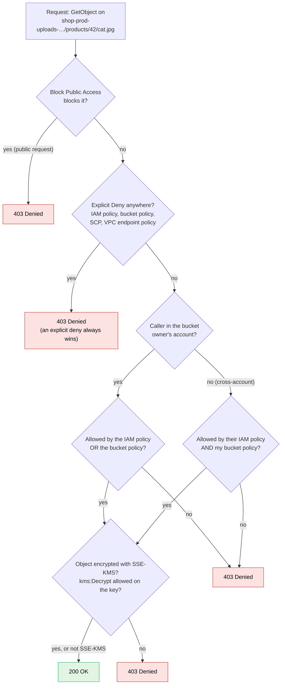

# S3

> [!abstract] In one sentence
> S3 (Simple Storage Service) is AWS's **object storage**. I put whole files ("objects") into a **bucket** under a **key** (a name like `uploads/2026/cat.jpg`) and get them back over an **HTTPS API**. It's not a disk and it's not a filesystem. It's a giant, extremely durable key → blob store that almost every other AWS service writes logs, backups and data into.

## The misconceptions I had

**Wrong mental model #1:** "S3 is a hard drive in the cloud. I make folders, I put files in them, my app reads and writes them like on a disk."

**What's actually true:** S3 is a **flat key-value store** that talks HTTP. The "folders" in the console are fake: they're just the part of the key before a `/`.

| What I assumed (disk / filesystem) | What S3 actually does |
|---|---|
| Folders exist | No folders. `photos/2026/cat.jpg` is **one key**. The console groups by `/` to look like folders (it calls the part before the name a **prefix**) |
| I can open a file and change a few bytes | **No partial updates.** I replace the whole object with a new PUT |
| Renaming a folder is instant | "Renaming" = copy every object to a new key + delete the old ones. For a million objects that's two million requests |
| I mount it and use `open()` / `read()` | I call an API: `PutObject`, `GetObject`, `ListObjectsV2`, `DeleteObject`. Tools like Mountpoint for S3 fake a filesystem on top, with limits (no in-place edits, no real renames) |
| A disk belongs to one server | Any number of clients can read and write at once, from anywhere with credentials and a network path |
| Size is what I provisioned | No provisioning. I pay for what's stored (GB-month), the requests, and the data going out |

→ Block vs file vs object storage in general: *[[Block, file and object storage]]* (planned, see [[Storage]]).

**Wrong mental model #2:** "S3 is global, it doesn't live in a region."

**What's actually true:** the **bucket name** is global (unique across every AWS account in the world, which is why my convention puts the account ID in it, see [[AWS naming conventions]]). But the **data lives in one region**, the one I pick when I create the bucket. It's stored across at least 3 Availability Zones in that region (except the One Zone classes). It only leaves that region if I set up replication. The S3 *console* just shows all my buckets on one page, which is what fooled me. Same reason a bucket [[ARN]] has no region in it.

**Wrong mental model #3:** "11 nines of durability means S3 is basically never down."

**What's actually true:** two different promises:

| | Durability | Availability |
|---|---|---|
| Question it answers | "Will my object still **exist** next year?" | "Can I **reach** it right now?" |
| S3 Standard | 99.999999999% (11 nines) | 99.99% |
| What it protects against | Disks dying, a whole AZ burning down | Nothing to do with my mistakes |
| What it **doesn't** protect against | **Me deleting it**, a bad script overwriting it, ransomware with my credentials | |

Durability is about AWS losing my data. Deleting it myself is 100% "durable". That's what versioning and backups are for (see the build-up).

## Build-up: where my shop's uploaded photos should live

The scenario: a small shop app. Users upload product photos. AWS account `123456789012`, region `eu-west-1`, app servers in private subnets behind an ALB (the usual [[VPC]] layout).

### Stage 1: photos on the server's disk

The app saves uploads to `/var/www/uploads` on the [[EC2]] instance. Works fine with one server.

**The problem:** I add [[Auto Scaling]] and a second instance. A user uploads a photo through instance A, the next request lands on instance B, and the photo "doesn't exist". And when Auto Scaling terminates instance A, its photos are gone with it. Instances should be **disposable**, and my data shouldn't be.

### Stage 2: put the files in a bucket

I create a bucket `shop-prod-uploads-123456789012` in `eu-west-1`. Every instance writes to and reads from the same place:

```bash
aws s3 cp cat.jpg s3://shop-prod-uploads-123456789012/products/42/cat.jpg
aws s3 ls s3://shop-prod-uploads-123456789012/products/42/
```

How does the app get permission? **Not** with access keys in a config file. The instances get an [[IAM]] **role** (instance profile) with a policy like:

```json
{
  "Effect": "Allow",
  "Action": ["s3:GetObject", "s3:PutObject"],
  "Resource": "arn:aws:s3:::shop-prod-uploads-123456789012/products/*"
}
```

Note the two ARN shapes, which trip me up every time:
- `arn:aws:s3:::bucket-name` → the **bucket** (for `s3:ListBucket`)
- `arn:aws:s3:::bucket-name/*` → the **objects** in it (for `GetObject`, `PutObject`, `DeleteObject`)

**The new problem:** browsers need to *display* these photos. My first instinct was "make the bucket public".

### Stage 3: showing the photos without making the bucket public

New buckets come with **Block Public Access** turned on, and that's on purpose: public buckets are the classic cloud data leak. Two better ways:

| Need | Solution | How it works |
|---|---|---|
| One user downloads one private file (an invoice, their own upload) | **Presigned URL** | The app signs a URL with *its* credentials, valid for N minutes. Whoever has the link can do that one operation until it expires. No AWS account needed on the client side |
| Lots of users view public-ish content (product photos) | **CloudFront** in front of the bucket, with **Origin Access Control (OAC)** | The bucket stays private. Its bucket policy only allows the CloudFront distribution to read. Users get HTTPS, caching near them, and cheaper data transfer |

Presigned URLs also work for **uploads**: the browser PUTs straight to S3, and my servers never touch the bytes.

```bash
aws s3 presign s3://shop-prod-uploads-123456789012/invoices/1001.pdf --expires-in 600
```

> [!warning] A presigned URL can't outlive the credentials that signed it
> Signed by an instance role, it stops working when the role's temporary session expires (a few hours at most), whatever `--expires-in` says. That's the "my links die early" mystery.

### Stage 4: the NAT gateway bill

My instances are in private subnets, so all their S3 traffic goes out through the **NAT gateway**, which charges per GB processed. Uploads and downloads of photos make that a real line on the bill.

**The fix:** an **S3 gateway endpoint**. It adds a route to the private route tables (destination = the S3 prefix list `pl-…`, target = `vpce-…`), so S3 traffic stays inside AWS's network and skips the NAT entirely. **Gateway endpoints for S3 are free.** (The "VPC and more" wizard offers to create it, see [[VPC]].)



Bonus: a bucket policy can then say "deny unless the request came through **my** endpoint" (`aws:SourceVpce`), so even leaked credentials can't read the bucket from outside.

### Stage 5: storage cost grows forever

A year later: terabytes of photos. Most are never looked at after the first month, but I pay the S3 Standard price for all of them.

**The fix:** **storage classes** + **lifecycle rules**. Same bucket, same keys, different price/access trade-off per object:

| Class | For | Retrieval | Min. storage charge | Notes |
|---|---|---|---|---|
| **Standard** | Hot data, accessed often | Instant | None | The default. 3+ AZs |
| **Intelligent-Tiering** | Access pattern unknown or changing | Instant (optional archive tiers aren't) | None | Moves objects between tiers by itself. Small monthly monitoring fee per object |
| **Standard-IA** (Infrequent Access) | Rarely read, but needed fast when it is | Instant, **per-GB retrieval fee** | 30 days, 128 KB per object | Cheaper storage, pricier reads |
| **One Zone-IA** | Re-creatable data (thumbnails, copies) | Instant, retrieval fee | 30 days, 128 KB | **One AZ**: if the AZ is lost, so is the data |
| **Glacier Instant Retrieval** | Archive I still read sometimes (old photos) | Milliseconds | 90 days | |
| **Glacier Flexible Retrieval** | Archives, backups | **Minutes to hours**: must *restore* first | 90 days | Expedited 1–5 min, standard 3–5 h, bulk 5–12 h |
| **Glacier Deep Archive** | Compliance archives kept for years | **12–48 hours** | 180 days | The cheapest storage AWS has |
| **Express One Zone** | Very low latency (ML training, analytics scratch) | Single-digit ms | None | Special "directory buckets", one AZ |

A lifecycle rule for my shop:



> [!tip] The minimum durations are the trap
> Moving an object to Standard-IA and deleting it 5 days later still bills 30 days. Lots of tiny objects in IA are billed as 128 KB each. Cold classes are for data that is **big and stays put**.

### Stage 6: someone deletes the photos

A bug in a cleanup job runs `aws s3 rm --recursive` on the wrong prefix. 11 nines of durability, and the photos are gone, because I asked for it.

**The fix:** **versioning**. With versioning on:
- An overwrite keeps the old object as a **previous (noncurrent) version**
- A delete doesn't remove anything: it adds a **delete marker** on top. Removing the marker brings the object back
- Only deleting a *specific version ID* removes data for real

Then, to stop old versions from piling up forever, a lifecycle rule expires **noncurrent versions** after N days.

For "even an admin can't delete it" (backups, audit logs, ransomware protection): **Object Lock** (needs versioning) in **governance** mode (special permission can override) or **compliance** mode (nobody can, not even root, until the retention date).

### Stage 7: the whole region has a bad day

For disaster recovery or keeping data close to users in another region: **replication**.
- **CRR** (Cross-Region Replication) and **SRR** (Same-Region, e.g. into a separate backup or log account)
- **Versioning must be on** on both source and destination
- It only copies objects written **after** the rule exists. Existing objects need **Batch Replication**
- Deletes are tricky on purpose: delete markers are optional to replicate, and deleting a specific version is **never** replicated (so a bad delete on the source can't wipe the copy)

## Who can access a bucket: the evaluation

This is where all my "Access Denied" errors come from. Several layers have to agree:



- **IAM (identity) policy**: attached to the user/role, "this role can read that bucket"
- **Bucket policy**: a resource-based policy on the bucket, "these principals can do this". The only place for cross-account access, CloudFront OAC, `aws:SourceVpce` conditions, "deny anything not over HTTPS" (`aws:SecureTransport`)
- **ACLs**: legacy, **disabled by default** on new buckets (Object Ownership = "bucket owner enforced"). I leave them off (see [[ACL]])
- **Encryption**: every new object is encrypted at rest by default with **SSE-S3** (AWS-managed keys, invisible to me). **SSE-KMS** uses a KMS key, so I get key policies and a CloudTrail record of every use, **and** readers need `kms:Decrypt` on that key

## Other features I'll meet

| Feature | What it does | Shows up when… |
|---|---|---|
| **Event notifications** | Object created/deleted → [[Lambda]], SQS, SNS, or EventBridge | "Resize the image when it's uploaded" (my [[Lambda]] note has the example) |
| **Static website hosting** | Serves `index.html` from a bucket at `http://bucket.s3-website-<region>.amazonaws.com` | Simple sites. The website endpoint is **HTTP only**: for HTTPS + my domain, put CloudFront in front ([[Certificate Manager (ACM)]] for the cert, [[Route 53]] alias) |
| **Multipart upload** | Upload a big object in parallel parts, retry just the failed part | Recommended above ~100 MB, **required above 5 GB** (the single-PUT limit). The CLI does it automatically |
| **Transfer Acceleration** | Uploads enter AWS at the nearest edge location | Users far from the bucket's region uploading big files |
| **CORS** | Lets browser JavaScript from another origin call the bucket | Browser direct uploads with presigned URLs |
| **Server access logs / CloudTrail data events** | Who read or wrote which object | Audits. Object-level events aren't in [[CloudTrail]] by default |
| **S3 Inventory, Storage Lens** | Reports of what's in the bucket, how big, which class | "Why is this bucket 40 TB?" |
| **Access points** | Named entry points to a bucket, each with its own policy and optionally VPC-only | One shared data bucket used by many teams, instead of one giant bucket policy |
| **Athena** | SQL straight on files in S3 | Querying ALB or CloudTrail logs without loading them anywhere |

## Advanced problems I'll actually debug

| Symptom | Usual cause | Fix |
|---|---|---|
| `403 Access Denied`, but my IAM policy clearly allows it | An explicit deny in the bucket policy (e.g. `aws:SourceVpce`, `aws:SecureTransport`), an SCP, a VPC endpoint policy, or **no `kms:Decrypt`** on the object's KMS key | Go through the evaluation above layer by layer. IAM Policy Simulator and CloudTrail show which policy denied it |
| `403` on an object that **doesn't exist** (I expected 404) | Without `s3:ListBucket`, S3 won't tell me whether the key exists, so "missing" looks like "forbidden" | Grant `s3:ListBucket` on the **bucket** ARN (not `/*`) if the app needs real 404s |
| `ListBucket` denied even though I allowed `s3:*` on `arn:…:bucket/*` | `ListBucket` acts on the **bucket** ARN, `/*` only covers objects | Put both ARNs in `Resource` |
| Cross-account: they can list but not read objects another account uploaded | Old buckets with ACLs: the uploader **owns** the object | Object Ownership → "bucket owner enforced" |
| Private instances can't reach S3 after removing the NAT | No gateway endpoint route in **that subnet's** route table, or the bucket is in **another region** (gateway endpoints are same-region only) | Associate the endpoint with every private route table. Other region or on-prem → interface endpoint (PrivateLink, costs per hour) |
| Bucket size looks small but the bill doesn't | Hidden things: **noncurrent versions**, **incomplete multipart uploads**, delete markers | Lifecycle: expire noncurrent versions, abort incomplete uploads after 7 days. Storage Lens to see it |
| `InvalidObjectState` on GET | The object is in Glacier Flexible Retrieval / Deep Archive | `RestoreObject` first, wait (hours), then GET the temporary copy |
| `503 Slow Down` under heavy load | Over ~3,500 writes or 5,500 reads per second **per prefix** | Spread keys over more prefixes, retry with backoff (the SDKs do), or cache reads with CloudFront |
| Browser upload fails with a CORS error, curl works | No CORS rule on the bucket for my site's origin | Add a CORS configuration allowing that origin and method |
| Presigned links expire after an hour or so, not the 7 days I asked | Signed with temporary role credentials | Sign with credentials that last long enough, or generate links on demand |
| Website endpoint gives 403 for everything | Website hosting needs the objects to be **publicly readable**, and Block Public Access says no | Don't fight it: CloudFront + OAC on the regular bucket endpoint instead |

## Practice

> [!example]- My app's role has `s3:GetObject` on `arn:aws:s3:::reports/*`. Reading `reports/q3.pdf` returns 403. The bucket policy has no deny, and the object exists. What do I check next?
> How the object is encrypted. If it's SSE-KMS with a customer managed key, the role also needs `kms:Decrypt` on that key (and the key policy must allow it). S3 permission alone isn't enough.

> [!example]- Monthly logs go to S3, are read during the first week, then kept 7 years for compliance and almost never read. Which lifecycle?
> Standard for ~30 days → Glacier Flexible Retrieval or Deep Archive (reads can wait hours) → expire after 7 years. Add Object Lock in compliance mode if nobody, admins included, may delete them early.

> [!example]- I enabled Cross-Region Replication yesterday. Why isn't last year's data in the destination bucket?
> Replication only applies to objects written after the rule is created. Existing objects need S3 Batch Replication.

> [!example]- Gateway endpoint or interface endpoint for S3?
> Gateway: free, a route in the route table, only for traffic from inside the VPC to buckets in the same region. Interface (PrivateLink): costs per hour and per GB, gives private IPs in my subnets, so it's reachable from on-prem over VPN/Direct Connect and from peered networks.

## Easy to get wrong
- Thinking prefixes are folders: "renaming a folder" rewrites every object
- Confusing durability (data survives) with protection against my own deletes (versioning, Object Lock, backups)
- Forgetting that `ListBucket` uses the bucket ARN and object actions use `bucket/*`
- Making a bucket public to serve files, instead of CloudFront + OAC or presigned URLs
- Leaving private subnets' S3 traffic going through the NAT gateway
- Putting short-lived or tiny objects in IA/Glacier and paying the minimum duration and size anyway
- Enabling versioning without a noncurrent-version expiry rule, then paying for every overwrite forever
- Expecting replication to copy existing objects, or to replicate deletes like a mirror
- Forgetting the KMS key policy when using SSE-KMS (especially cross-account)
- Expecting the static website endpoint to do HTTPS

## Related
- Concept:: *[[Block, file and object storage]]*, *[[Object storage]]*, [[Storage]]
- Depends on:: [[IAM]], [[VPC]]
- Works with:: [[Lambda]], [[SQS]], [[SNS]], [[EventBridge]], [[CloudTrail]], [[Route 53]], [[Certificate Manager (ACM)]]
- Network path:: [[NAT and PAT]], [[Proxies, load balancing and discovery in AWS]]
- Naming:: [[AWS naming conventions]], [[ARN]]
- Big picture:: [[How AWS services connect]]

## Flashcards
#flashcards

What kind of storage is S3? :: Object storage: whole objects stored under a key in a bucket, accessed over an HTTPS API
Do folders exist in S3? :: No. The namespace is flat, "folders" are key prefixes the console groups by "/"
Can I change a few bytes of an S3 object in place? :: No, I upload a new version of the whole object
Is an S3 bucket global or regional? :: The name is globally unique, but the data lives in the one region I pick
Durability vs availability for S3 Standard? :: Durability 11 nines (the object won't be lost), availability 99.99% (I can reach it)
How should an EC2 app get access to S3? :: An IAM role (instance profile), never access keys on disk
Which ARN does s3:ListBucket need? :: The bucket ARN arn:aws:s3:::bucket, not bucket/*
How do I let one user download a private object without making it public? :: A presigned URL, valid for a limited time
How do I serve a private bucket's files to the public over HTTPS? :: CloudFront with Origin Access Control, the bucket stays private
How do private subnets reach S3 without a NAT gateway? :: An S3 gateway endpoint: a route to the S3 prefix list, free, same region only
What happens on DELETE in a versioned bucket? :: A delete marker is added. The old versions stay and can be restored
Object Lock governance vs compliance? :: Governance can be overridden with special permission. Compliance can't be overridden by anyone until retention ends
What does replication require? :: Versioning on both buckets. It only copies new objects (Batch Replication for existing ones)
Minimum storage duration for Standard-IA, Glacier IR/Flexible, Deep Archive? :: 30 days, 90 days, 180 days
How fast is Glacier Deep Archive retrieval? :: 12 to 48 hours, after a restore request
What's One Zone-IA's trade-off? :: Cheaper, but stored in one AZ, so lost if that AZ is lost
When is multipart upload required? :: Above 5 GB (the single PUT limit). Recommended above ~100 MB
Default encryption for new S3 objects? :: SSE-S3, automatically
Extra permission needed to read an SSE-KMS object? :: kms:Decrypt on the KMS key
Why does a missing object return 403 instead of 404? :: The caller lacks s3:ListBucket, so S3 won't reveal whether the key exists
Same-account vs cross-account S3 access? :: Same account: IAM policy OR bucket policy. Cross-account: their IAM policy AND my bucket policy
S3 request rate limits? :: About 3,500 writes and 5,500 reads per second per prefix
Two hidden costs that make a bucket cost more than its size? :: Noncurrent versions and incomplete multipart uploads
Can the S3 static website endpoint do HTTPS? :: No, it's HTTP only. Use CloudFront for HTTPS
