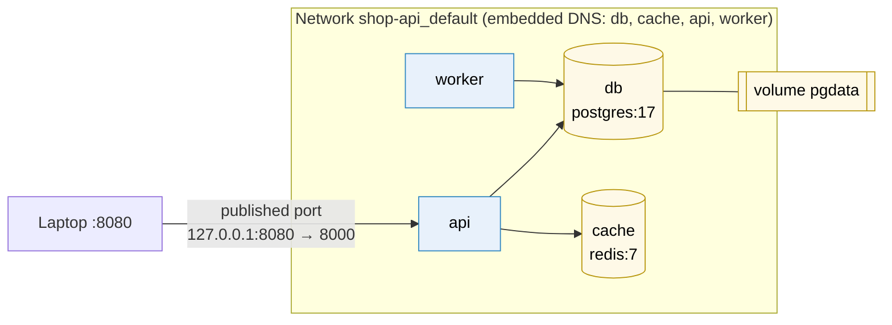

# Docker Compose

> [!abstract] In one sentence
> Docker Compose describes a **whole application made of several containers** (the API (application programming interface), its database, a cache, a worker) in one YAML (YAML Ain't Markup Language) file, `compose.yaml`, and starts, connects and stops them together with `docker compose up` / `down`. It runs everything on **one Docker host**: it's the right tool for development, CI (continuous integration) and small single-server deployments, and it's not an orchestrator.

## Build-up: the shop API stops being one container

The shop API from [[Docker]] runs as an image. But to actually work it needs **PostgreSQL**, **Redis** for sessions and a **worker** that sends emails from a queue. Every developer needs all four running on their laptop, and CI needs them for integration tests.

### Stage 1: four `docker run` commands

```bash
docker network create shop
docker volume create pgdata
docker run -d --name db --network shop \
  -e POSTGRES_PASSWORD=dev -v pgdata:/var/lib/postgresql/data postgres:17
docker run -d --name cache --network shop redis:7
docker run -d --name api --network shop -p 8080:8000 \
  -e DATABASE_URL=postgresql://postgres:dev@db:5432/shop shop-api:dev
docker run -d --name worker --network shop \
  -e DATABASE_URL=postgresql://postgres:dev@db:5432/shop shop-api:dev python -m src.worker
```

It works, and it already shows the basic ideas: a user-defined **network** (`shop`) on which containers find each other **by name** through Docker's embedded DNS (Domain Name System): `db` resolves to the database container's IP (Internet Protocol) address, and a named **volume** so the database survives the container.

**The problems:**
- The setup lives in a wiki page or a shell script nobody keeps in sync. A new developer spends an afternoon getting it right
- Order matters: the API crashes if it starts before PostgreSQL accepts connections
- Changing one environment variable means stopping, removing and re-running that container with the whole command line again
- Tearing it all down means remembering every container, network and volume name
- There's no record of "what the app needs to run" next to the code

### Stage 2: the same thing as a file

```yaml
# compose.yaml, next to the Dockerfile in the repository
services:
  db:
    image: postgres:17
    environment:
      POSTGRES_PASSWORD: dev
      POSTGRES_DB: shop
    volumes:
      - pgdata:/var/lib/postgresql/data

  cache:
    image: redis:7

  api:
    build: .
    ports:
      - "127.0.0.1:8080:8000"
    environment:
      DATABASE_URL: postgresql://postgres:dev@db:5432/shop
      REDIS_URL: redis://cache:6379/0
    depends_on:
      - db
      - cache

  worker:
    build: .
    command: ["python", "-m", "src.worker"]
    environment:
      DATABASE_URL: postgresql://postgres:dev@db:5432/shop
    depends_on:
      - db

volumes:
  pgdata:
```

```bash
docker compose up -d        # build what has build:, create network + volume, start in dependency order
docker compose ps           # what's running
docker compose logs -f api  # follow one service's logs
docker compose down         # stop and remove containers and the network (the volume stays)
docker compose down -v      # ... and delete the volumes too (the database is gone)
```

What Compose does with this file:
- The **project name** defaults to the folder name (`shop-api`). Everything it creates is prefixed with it: containers `shop-api-api-1`, `shop-api-db-1`, network `shop-api_default`, volume `shop-api_pgdata`. Two projects on one machine don't collide
- It creates **one network per project** and attaches every service to it. Each **service name** is a DNS name on that network, which is why `db:5432` works in `DATABASE_URL`
- It's **declarative and idempotent**: running `docker compose up -d` again after editing the file only recreates the containers whose configuration changed
- `build: .` builds the image from the Dockerfile; `image:` pulls one



> [!info] `docker compose`, not `docker-compose`
> Compose v1 was a separate Python tool called `docker-compose`. Compose v2 is a plugin of the Docker CLI (command-line interface): `docker compose` with a space. The old top-level `version: "3.8"` key is obsolete and ignored. Tutorials using either are older material, and the file is now called `compose.yaml` (the old `docker-compose.yml` name still works).

### Stage 3: "depends_on" doesn't mean "ready"

After a `docker compose down -v`, the API crashes on the first start with `connection refused`, then works on the second try.

`depends_on: [db]` only means **"start `db` before `api`"**. A started container isn't a ready database: PostgreSQL needs a few seconds to initialise its data directory. The fix is a **health check** on the database and a **condition** on the dependency:

```yaml
services:
  db:
    image: postgres:17
    healthcheck:
      test: ["CMD-SHELL", "pg_isready -U postgres -d shop"]
      interval: 2s
      timeout: 3s
      retries: 15

  api:
    depends_on:
      db:
        condition: service_healthy     # wait until the health check passes
      cache:
        condition: service_started
```

> [!warning] Still make the app retry
> The condition only covers **startup**. If the database restarts later, the API must reconnect on its own. Health-gated startup is a convenience for development, not a substitute for retry logic, and in production orchestrators don't order startup at all.

### Stage 4: one file for dev, CI and the demo server

The same application is run in three slightly different ways. Copying the file three times would drift. Compose has three tools for this:

**Variables** from the shell or a `.env` file next to `compose.yaml` (interpolation, done by Compose when it reads the file):
```yaml
  api:
    image: registry.example.com/shop-api:${API_TAG:-dev}
```
```bash
API_TAG=3f9c2a1 docker compose up -d
```

**Override files**: `compose.override.yaml` is merged automatically on top of `compose.yaml` when present. So the base file holds what's common and the override holds developer-only things (source code mounted into the container, a debug port). Other environments name files explicitly:
```bash
docker compose -f compose.yaml -f compose.ci.yaml up -d --wait   # --wait: return when everything is healthy
```

**Profiles**: services that only start when asked for, like an admin UI (user interface) or a mail catcher:
```yaml
  mailpit:
    image: axllent/mailpit
    profiles: ["tools"]
```
```bash
docker compose --profile tools up -d
```

> [!warning] `.env` means two different things
> The `.env` file next to `compose.yaml` feeds **variables into the Compose file** (`${API_TAG}`). It is **not** passed into containers. To give variables to a container, use `environment:` or `env_file:` on the service. Mixing them up is a classic source of "the variable is set but the app doesn't see it".

### Stage 5: the fast inner loop

Rebuilding the image for every code change is slow. Two ways to make the running container follow the source code:

- A **bind mount** of the source code into the container in `compose.override.yaml` (`- ./src:/app/src`), with the app server in reload mode. Simple, but on macOS/Windows file events across the VM (virtual machine) boundary can be slow
- **`docker compose watch`** with a `develop.watch` section: Compose syncs changed files into the container, or rebuilds when `requirements.txt` changes:

```yaml
  api:
    build: .
    develop:
      watch:
        - action: sync
          path: ./src
          target: /app/src
        - action: rebuild
          path: requirements.txt
```

### Stage 6: running it on a server

The demo environment is a single VM. Copying `compose.yaml` there and running `docker compose up -d` works, and for a small internal tool it's a perfectly reasonable deployment. A few settings make it sturdier:

```yaml
  api:
    image: registry.example.com/shop-api@sha256:…   # a pinned image, not build: (see [[Docker image tags]])
    restart: unless-stopped                          # Docker restarts it if it crashes or the host reboots
    deploy:
      resources:
        limits: { cpus: "1.0", memory: 512M }
    logging:
      driver: json-file
      options: { max-size: "10m", max-file: "3" }
```

**What stays impossible**, because Compose drives **one Docker daemon on one host**:
- The host dies → everything is down until someone fixes it. Nothing moves the containers elsewhere
- More traffic than one machine can handle → no way to spread replicas across machines
- `docker compose up -d` after a change **stops the old container, then starts the new one**: a few seconds of downtime per deploy, and a bad image means the service is down until I notice
- `restart:` only covers the process crashing. If the app hangs while its process stays alive, nothing replaces it (Docker records an `unhealthy` health status but doesn't act on it)

Solving these needs something that manages **several machines** and keeps the application in its desired state on its own: [[Container orchestration]].

## Advanced problems

### 1. Port conflicts when scaling

`docker compose up -d --scale api=3` fails with `port is already allocated`: three containers can't all publish host port 8080. Either publish a **range** (`"8080-8082:8000"`), don't publish and put a reverse proxy service in front on the same network (it reaches `api:8000`, and Docker's DNS returns all three container IPs), or accept that this is a single-host tool and use an orchestrator.

### 2. The database data "disappeared"

Usually one of: `docker compose down -v` was run (it deletes named volumes), the project name changed (running from a renamed folder or with `-p other` gives **new**, empty volumes like `other_pgdata`), or the data was written to the container's writable layer because the volume target path was wrong. Check with `docker volume ls`: the old volume is often still there under the old project name.

### 3. Containers from different projects can't talk to each other

Each project gets its own network. To connect the shop's API to a shared PostgreSQL started by another project, declare that project's network as **external** in this file and attach the service to it:
```yaml
networks:
  shared:
    external: true
    name: infra_default
```

### 4. Secrets committed in `compose.yaml`

Passwords written in `environment:` end up in Git. For local development, dummy values are fine. For anything real, read them from a non-committed `.env` file via interpolation, or use the `secrets:` key, which mounts a file at `/run/secrets/<name>` inside the container instead of exposing an environment variable (environment variables leak into `docker inspect`, crash reports and child processes).

## In AWS

Nothing in AWS (Amazon Web Services) runs a `compose.yaml` file as is. On a single EC2 (Elastic Compute Cloud) instance, Compose works as on any Linux VM. At scale, the services move to [[ECS]] (Elastic Container Service) task definitions (one task definition per service, the sidecars as extra containers in the same task) or to Kubernetes. Compose stays useful in the CI pipeline to run integration tests against real PostgreSQL and Redis containers.

## Practice

> [!example]- The API logs `could not translate host name "postgres" to address`. The Compose service is called `db`. Why?
> The DNS name of a service on the Compose network is its **service name** (`db`), not the image name (`postgres`). Use `db` in the connection string, or add `hostname`/network `aliases` if the name must be `postgres`.

> [!example]- `docker compose up -d` after changing only the worker's command: what gets restarted?
> Only the `worker` container, because its configuration changed. Compose compares the desired configuration with what's running and recreates only what differs. `api`, `db` and `cache` keep running.

> [!example]- The API works from the laptop on `localhost:8080`, but the same file on a server makes it unreachable from other machines. Why?
> The port is published as `127.0.0.1:8080:8000`, so only the host's loopback accepts it. On a server, publish on the right interface (`8080:8000` binds all interfaces), and remember that Docker's published ports bypass the host firewall (see [[Docker#1. A port published with `-p` ignores the host firewall]]).

## Easy to get wrong
- Thinking `depends_on` waits for readiness: it waits for the container to **start**, unless `condition: service_healthy` is used
- Using `localhost` to reach another service: inside a container, `localhost` is the container itself. Use the service name
- Confusing the `.env` file (variables for the Compose file) with `env_file:` (variables for the container)
- `docker compose down -v` in the wrong terminal: the database volume is deleted
- Thinking `restart: always` makes the app highly available: it only restarts on the same host
- Using Compose v1 syntax (`docker-compose`, `version:` key) from old tutorials
- Expecting Compose to spread containers across several machines: it drives one Docker host

## Related
- Builds on:: [[Docker]], [[Docker image tags]]
- Next step:: [[Container orchestration]], [[Docker Swarm]] (runs the same file format on a cluster), [[Kubernetes]]
- Compared:: [[Compose vs Swarm vs Kubernetes]]
- Under the hood:: [[Network interfaces]] (the project network is a bridge), [[DNS]] (service names), [[Mounting]] (volumes and bind mounts)
- Area:: [[Containers]]

## Flashcards
#flashcards

What is Docker Compose? :: A tool that defines a multi-container application in compose.yaml and starts, connects and stops it together on one Docker host
How do Compose services find each other? :: By service name, through Docker's embedded DNS on the project's network
What does the Compose project name do? :: Prefixes every container, network and volume (default: the folder name), so projects don't collide
What does depends_on guarantee by default? :: Start order only, not that the dependency is ready
How do you make a service wait until a dependency is ready? :: A healthcheck on the dependency and depends_on with condition: service_healthy
What does docker compose down -v do? :: Removes containers and the network, and deletes the named volumes (data loss)
What is compose.override.yaml? :: A file merged automatically on top of compose.yaml, typically for development-only settings
.env file vs env_file in Compose? :: .env feeds variables into the Compose file (interpolation). env_file passes variables into the container
What are Compose profiles for? :: Services that only start when their profile is enabled (--profile tools)
docker-compose vs docker compose? :: v1 standalone Python tool vs v2 Docker CLI plugin (current)
Why is Compose not an orchestrator? :: It drives one Docker host: no failover to other machines, no spreading replicas, stop-then-start deploys
Why can't you --scale a service that publishes a fixed host port? :: Only one container can bind that host port
