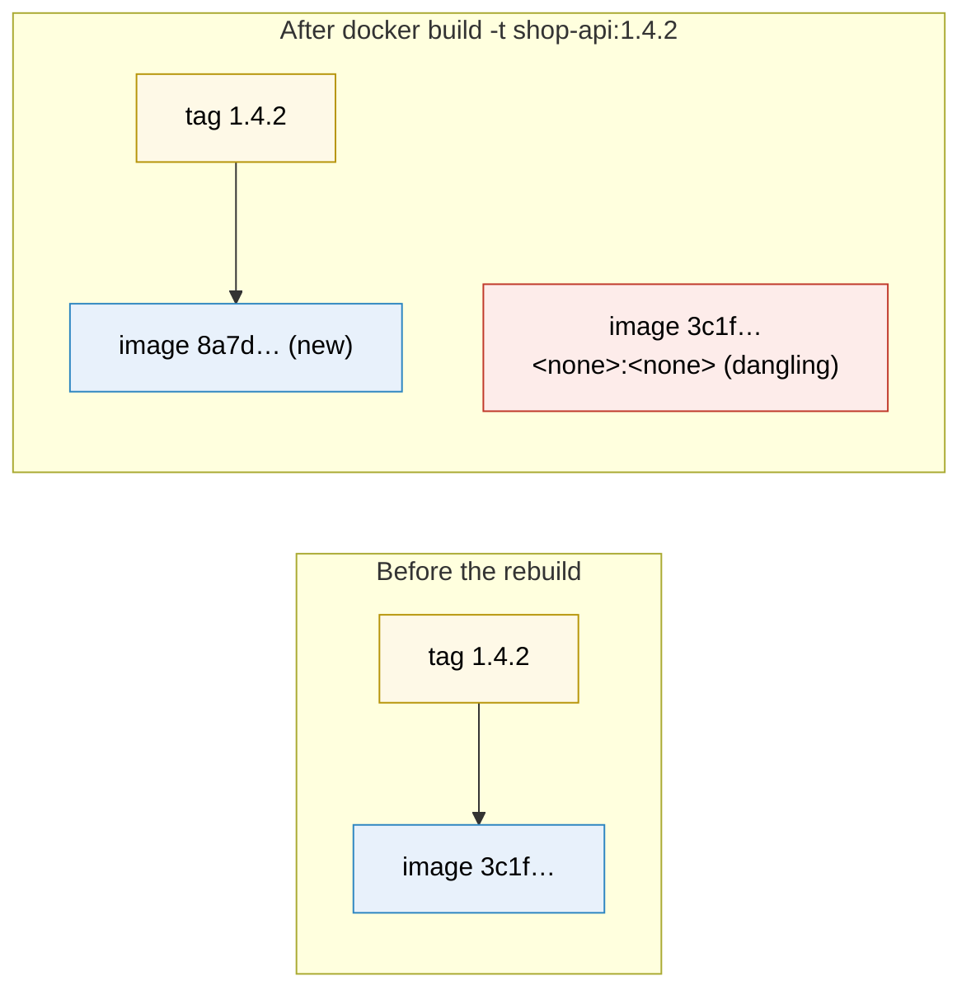
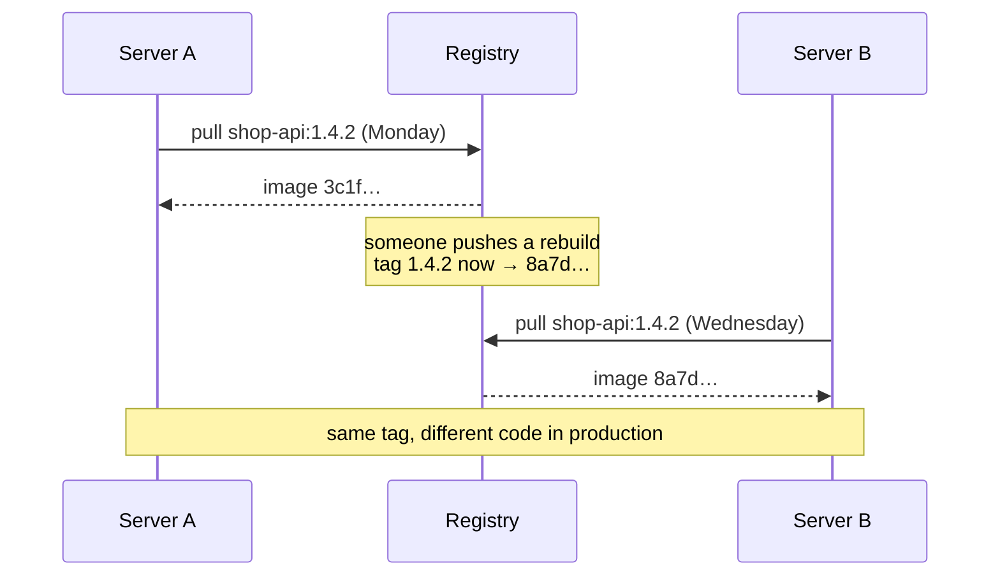
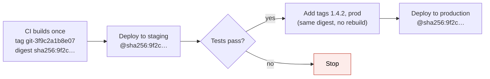

# Docker image tags

> [!abstract] In one sentence
> A tag is a **name you stick on an image** (`shop-api:1.4.2`) so people and tools can refer to it. It's only a label: you can put several on one image, remove them, or **move** one to a different image. The image's real, permanent identity is its **digest** (`sha256:…`), a hash of its content. Good tagging is about choosing labels that tell you **exactly what's running**, and never trusting a label that can move.

## Build-up: learning tags on my own machine

Everything here runs with plain Docker on a laptop and any registry (Docker Hub, GitHub Container Registry, GitLab, Harbor, a cloud registry). The app is the shop's API, `shop-api`; the company registry is `registry.example.com`.

### Stage 1: an image with no name

```bash
docker build .
docker images
```

```
REPOSITORY   TAG       IMAGE ID       CREATED          SIZE
<none>       <none>    3c1f0e9a7b2d   5 seconds ago    182MB
```

The build worked, but the image has **no name**. The only way to use it is its ID: `docker run 3c1f0e9a7b2d`. Nobody will remember that, and the next build produces another anonymous image. Tags exist to give images **names**.

### Stage 2: giving it a name with `-t`

```bash
docker build -t shop-api .
docker images
```

```
REPOSITORY   TAG       IMAGE ID       CREATED          SIZE
shop-api     latest    3c1f0e9a7b2d   5 seconds ago    182MB
```

I wrote `shop-api`, but Docker stored `shop-api:latest`. A full image name is **`repository:tag`**, and when I leave the tag out, Docker fills in **`latest`**. That's all `latest` is: the **default word** when no tag is given. It doesn't mean "newest", and nothing keeps it up to date (see [[#1. Using latest in production]]).

### Stage 3: one image, several tags

Now I want to say "this build is version 1.4.2":

```bash
docker tag shop-api:latest shop-api:1.4.2
docker images
```

```
REPOSITORY   TAG       IMAGE ID       CREATED          SIZE
shop-api     1.4.2     3c1f0e9a7b2d   2 minutes ago    182MB
shop-api     latest    3c1f0e9a7b2d   2 minutes ago    182MB
```

Two lines, **same IMAGE ID**. `docker tag` didn't copy anything (no extra 182 MB): it added a second **label** to the same image. Think of the image as a box and tags as sticky notes on it. I can stick as many as I want:

```bash
docker build -t shop-api:1.4.2 -t shop-api:latest .     # several tags in one build
```

And removing a tag only removes the sticky note:

```bash
docker rmi shop-api:latest
# Untagged: shop-api:latest
```

The image is still there under `1.4.2`. It's only deleted when its **last** tag is removed (and no container uses it).

### Stage 4: the same tag on a new build (tags move)

This is the most important thing to understand about tags. I change the code and build again **with the same tag**:

```bash
docker build -t shop-api:1.4.2 .
docker images
```

```
REPOSITORY   TAG       IMAGE ID       CREATED          SIZE
shop-api     1.4.2     8a7d2e4f1c90   3 seconds ago    182MB
<none>       <none>    3c1f0e9a7b2d   10 minutes ago   182MB
```

The tag `1.4.2` **moved** to the new image `8a7d…`. The old image lost its name and became a **dangling** image (`<none>:<none>`). Nothing warned me. From now on, `shop-api:1.4.2` means something different than it did 10 minutes ago.



So a tag is a **pointer that can be re-pointed**, like a Git branch, not like a Git commit hash. Every tagging problem in production comes from this.

Dangling images pile up and use disk: `docker images --filter dangling=true`, `docker image prune`.

### Stage 5: the name also says *where* the image lives

To share the image I push it to the registry. `docker push shop-api:1.4.2` fails or goes to the wrong place, because the name doesn't say **which registry**. The full name has more parts:

```
registry.example.com/shop/shop-api:1.4.2
└──── registry ────┘ └─ repository ─┘ └ tag ┘
```

| Part | Meaning | Default if missing |
|---|---|---|
| Registry | The server storing the image (host, optional port) | `docker.io` (Docker Hub) |
| Repository | Path of the image in that registry (`team/app`), lowercase | (required). On Docker Hub, a one-word name means `library/<name>` (official images) |
| Tag | The label | `latest` |

So `nginx` really means `docker.io/library/nginx:latest`, and `shop-api:1.4.2` means `docker.io/library/shop-api:1.4.2`, which is not what I want.

To push to my registry, I **tag the image with the full name** (again, just another sticky note), then push that name:

```bash
docker login registry.example.com
docker tag shop-api:1.4.2 registry.example.com/shop/shop-api:1.4.2
docker push registry.example.com/shop/shop-api:1.4.2
```

```
The push refers to repository [registry.example.com/shop/shop-api]
5f70bf18a086: Pushed
a3ed95caeb02: Pushed
1.4.2: digest: sha256:9f2c7c1e5b0a4d3f8e6a2b1c9d0e7f6a5b4c3d2e1f0a9b8c7d6e5f4a3b2c1e41a size: 1782
```

Note: `docker tag` only changes my **local** machine. Until `docker push`, the registry doesn't know the tag exists ("manifest unknown" when a server tries to pull it).

### Stage 6: the digest, the name that can't move

The push printed a **digest**: `sha256:9f2c…e41a`. It's the SHA-256 hash of the image's **manifest** (the file listing its layers and config), so it's computed **from the content**:
- Same content → same digest, on every machine, forever
- Any change → a different digest
- It **can't be re-pointed**. It's like a Git commit hash

I can pull and run by digest instead of by tag:

```bash
docker pull registry.example.com/shop/shop-api@sha256:9f2c…e41a
docker images --digests registry.example.com/shop/shop-api
```

```
REPOSITORY                           TAG     DIGEST              IMAGE ID       SIZE
registry.example.com/shop/shop-api   1.4.2   sha256:9f2c…e41a    8a7d2e4f1c90   182MB
```

Or both: `registry.example.com/shop/shop-api:1.4.2@sha256:9f2c…e41a`. When a digest is present, Docker **uses the digest and ignores the tag**: the tag is only there so humans can read which version it is.

> [!note] Image ID vs digest
> The `IMAGE ID` in `docker images` and the digest from the registry are often **different hashes** (on the classic Docker image store, the ID is a hash of the image config, the digest a hash of the manifest). Don't compare them. To talk about an image across machines, use the **digest**.

| | Tag | Digest |
|---|---|---|
| Looks like | `1.4.2`, `latest`, `main` | `sha256:9f2c…e41a` |
| Chosen by | Me | Computed from the content |
| Can be moved to another image | **Yes** | **No** |
| Readable by humans | Yes | No |
| Use it for | Naming, finding, communicating | Knowing **exactly** what runs |

### Stage 7: pulling a tag on another machine

A server runs `docker pull registry.example.com/shop/shop-api:1.4.2`. The registry answers with **whatever image the tag points to right now**. Two consequences:

1. If the tag was moved between Monday and Wednesday (Stage 4, but pushed), a server that pulled Monday and one that pulled Wednesday have **different images under the same name**
2. `docker run` with a tag the machine **already has** doesn't ask the registry at all. It uses the local copy, even if the tag moved remotely. Only an explicit `docker pull` (or `--pull=always`) refreshes it



That's why the rest of this note is about **choosing tags that never move**, and **deploying by digest**.

## Choosing a tagging scheme

### The kinds of tags

| Kind | Example | Moves? | What it's for |
|---|---|---|---|
| **Commit** | `git-3f9c2a1b8e07` | Never: one commit, one tag | Tracing an image back to the exact source code. What pipelines deploy |
| **Release version** | `1.4.2` | Should never | Humans: changelogs, "roll back to 1.4.1" |
| **Floating version** | `1.4`, `1` | Yes, on purpose | Users who want "the latest 1.4.x" automatically |
| **Branch** | `main`, `feature-login` | Yes, on every push | Dev and test environments |
| **Environment** | `staging`, `prod` | Yes, on every promotion | A readable record of what's deployed where. Not something to deploy *from* |
| **`latest`** | `latest` | Whenever someone pushes it | Local convenience, public images' default. Avoid in deployments |
| **Build metadata** | `1.4.2-build.381`, `2026-10-03.1` | Never | Unique per build when there's no commit tag |

### A release, tag by tag

Commit `3f9c2a1b8e07` is released as **1.4.2**. The pipeline builds **once** and puts several labels on that one image:

```bash
IMAGE=registry.example.com/shop/shop-api
SHA=$(git rev-parse --short=12 HEAD)

docker build -t $IMAGE:git-$SHA -t $IMAGE:1.4.2 -t $IMAGE:1.4 -t $IMAGE:1 .
docker push --all-tags $IMAGE
```

All four tags point at the **same digest**. Then 1.4.3 ships:

| Tag | After 1.4.2 | After 1.4.3 | After 1.5.0 |
|---|---|---|---|
| `git-3f9c2a1b8e07` | 1.4.2 image | 1.4.2 image | 1.4.2 image |
| `1.4.2` | 1.4.2 image | 1.4.2 image | 1.4.2 image |
| `1.4` | 1.4.2 image | **1.4.3** image | 1.4.3 image |
| `1` | 1.4.2 image | **1.4.3** image | **1.5.0** image |

The exact tags (`git-…`, `1.4.2`) **never move**; the floating ones (`1.4`, `1`) **follow** the newest matching release. That's exactly how official images work: `python:3.12` moves with every 3.12.x patch, `python:3.12.7` doesn't (mostly: see [[#3. The base image moved under me]]).

### Rules that keep tags trustworthy

1. **Every build gets a unique tag** (commit SHA or build number). Never reuse it
2. **Never re-push an exact tag** (`1.4.2`). A fix is `1.4.3`
3. **Turn on tag immutability** if the registry offers it (most private registries do): pushing an existing tag is then **rejected**, so rule 2 is enforced instead of hoped for
4. **Deploy by digest** (or by a tag that's immutable), never by a floating tag
5. **Build once, promote the same image** through environments (next section)

## Tags in a pipeline

### Stage 8: build once, promote by re-tagging

A pipeline that runs `docker build` separately for staging and for production produces **two different images**: the production build may pull a newer base image or dependency that staging never tested.

Instead: build once, test that image, then **add tags** to the **same digest** as it moves forward. Adding a tag in a registry doesn't need a rebuild:

```bash
# Option 1: plain Docker (pulls the image, then pushes the new name: same digest)
docker pull $IMAGE:git-$SHA
docker tag  $IMAGE:git-$SHA $IMAGE:1.4.2
docker push $IMAGE:1.4.2

# Option 2: directly in the registry, no pull
docker buildx imagetools create --tag $IMAGE:1.4.2 $IMAGE:git-$SHA
# (crane tag / skopeo copy do the same)
```



Everything that differs between environments (database host, secrets, feature flags) comes from configuration at **run time**, never from a different build (see [[Docker#Stage 6: from my laptop to production]]).

### Stage 9: deploy the digest, not the tag

The deploy step resolves the tag **once** and hands the **digest** to every server:

```bash
DIGEST=$(docker buildx imagetools inspect $IMAGE:git-$SHA --format '{{json .Manifest.Digest}}' | tr -d '"')
echo "deploying $IMAGE@$DIGEST"
# compose.yaml / systemd unit / orchestrator config gets:
#   image: registry.example.com/shop/shop-api:1.4.2@sha256:9f2c…e41a
```

Now:
- Every server runs **the same bytes**, whatever happens to tags later
- Rolling back = deploying the **previous digest**, which still exists in the registry
- Logs and alerts can include the digest (or the commit tag), so "which code produced this error?" has an answer

Orchestrators differ here. Kubernetes uses whatever string is in the manifest: with a tag and the default pull policy, each node may run a different cached image, which is why teams pin digests. Some orchestrators resolve tags to digests themselves at deploy time (ECS does, see below). Knowing which one my platform does decides how much I can trust tags.

## Where tagging goes wrong

### 1. Using latest in production

**Symptom:** nobody can say which version runs; a server restarts and comes back with different code; rollback has no target.
**Why:** `latest` moves on every push that uses it (or every push without a tag), and caches make each server's `latest` different.
**Fix:** don't deploy `latest`. Unique tags + digests. If `latest` is kept for humans, push it **after** a release, as a convenience.

### 2. A shared moving tag in concurrent pipelines

**Symptom:** staging runs code that the tests of that pipeline never saw.
**Why:** two pipelines push `shop-api:staging` minutes apart, then each deploys `staging`; one deploys the other's image.
**Fix:** deploy unique tags or digests. Update environment tags **after** deploying, as a record.

### 3. The base image moved under me

`FROM python:3.12-slim` is a **floating tag** maintained by someone else: it's re-pushed for every Python patch and OS security update. Building the same commit twice, a week apart, gives two different images; one day a base update breaks a native library.

| `FROM` line | Same result every build? | Gets security fixes? |
|---|---|---|
| `python:3.12-slim` | ❌ Changes silently | ✅ On every rebuild |
| `python:3.12.7-slim-bookworm` | Mostly (still re-pushed for OS patches) | Partly |
| `python:3.12-slim@sha256:…` | ✅ Exactly | ❌ Only when I change the digest |

Common answer: **pin the digest** and let a bot (Renovate, Dependabot) open a pull request when the upstream tag moves, so base updates are tested like any other change. And rebuild regularly so fixes actually ship.

### 4. Rolling back by rebuilding an old version

Checking out the 1.4.1 commit and building it again does **not** give back the 1.4.1 image: newer base, newer packages, new timestamps, **new digest**. It's a new, untested image. A real rollback deploys the **old digest**, so old release images must be **kept**.

### 5. One tag, several CPU architectures

A tag can point at a **multi-platform index**: one entry per architecture (built with `buildx --platform linux/amd64,linux/arm64`, see [[Docker#Stage 7: laptops on ARM, servers on x86]]).

```bash
docker buildx imagetools inspect $IMAGE:1.4.2
# MediaType: application/vnd.oci.image.index.v1+json
# Digest:    sha256:9f2c…e41a          ← index digest
# Manifests:
#   …@sha256:a71d…   Platform: linux/amd64
#   …@sha256:c03e…   Platform: linux/arm64
```

- Pin the **index** digest: each machine still gets its own architecture. Pinning one platform's digest breaks the others
- A single-platform `docker push` to an existing multi-platform tag **replaces** the index: the other architecture silently disappears

### 6. Cleanup deletes an image that is still running

Registries fill up, so someone adds a retention rule: "keep the 50 newest images". Weeks later a stable, rarely deployed service scales out and fails to pull: its image was number 51.

Safer retention:
- Delete **untagged** images after a few days (dangling results of moved tags)
- Delete **branch/PR** tags (by prefix: `pr-`, `feature-`) after N days
- Keep **release** and deployed **commit** tags much longer
- Never delete an image still referenced by a running deployment (check before cleaning)

### 7. Small mistakes with big effects

| Mistake | Effect |
|---|---|
| Forgetting the registry in the name | `docker push shop-api:1.4.2` targets Docker Hub (fails, or publishes to a public namespace) |
| Uppercase in the repository name | Rejected: repositories must be lowercase |
| Tag with `/` or `:` | Invalid: tags allow letters, digits, `_`, `.`, `-`, up to 128 characters, not starting with `.` or `-` |
| `docker tag` without `docker push` | The tag exists only on my laptop |
| `docker run` after a remote tag change | Runs the old cached image (pull first) |

## In AWS

The same ideas, with ECR as the registry and ECS as the runtime:
- **ECR tag immutability** per repository: re-pushing an existing tag is rejected (rule 3 enforced)
- **ECR lifecycle policies** implement retention: expire untagged images by age, expire tag prefixes like `pr-`, and avoid count-based rules that can reach images still in use (problem 6 above)
- **ECS** resolves an image tag to a digest when a deployment starts, so all tasks of that deployment run the same image even if the tag moves; the next deployment resolves again (details in [[ECS]])
- Copying images between accounts and regions (ECR replication) keeps the **same digest**, so promotion across accounts works like re-tagging

## Practice

> [!example]- What does `docker pull nginx` actually pull?
> `docker.io/library/nginx:latest`: default registry, official-images namespace, default tag.

> [!example]- I ran `docker tag shop-api:latest shop-api:1.4.2`. How much extra disk did that use?
> None. It added a second label to the same image (same IMAGE ID).

> [!example]- I rebuilt with `-t shop-api:1.4.2` and `docker images` shows a `<none>` image. What happened?
> The tag moved to the new image. The old image lost its name (dangling).

> [!example]- Is `latest` the newest image in a repository?
> Not necessarily. It's whatever was last pushed with the tag `latest` (or with no tag). It can be old, or missing.

> [!example]- Two servers run `shop-api:1.4.2` but behave differently. How?
> The tag was pushed twice. One server pulled before, the other after. Use immutable tags and deploy by digest.

> [!example]- Which tags would you push for release 1.4.2 built from commit 3f9c2a1b8e07?
> `git-3f9c2a1b8e07` and `1.4.2` (never move), plus `1.4` and `1` (floating) if consumers want them. All on the same digest, one build.

> [!example]- How do I move an image from staging to production without rebuilding?
> Add a tag to the same digest (`docker tag` + `push`, or `buildx imagetools create --tag`) and deploy that digest.

> [!example]- Why isn't rebuilding the 1.4.1 commit a rollback?
> The rebuild gets newer bases and packages: a different digest, an untested image. Redeploy the old digest.

## Easy to get wrong
- Forgetting that a name with no tag means `:latest`, and that `latest` isn't "newest"
- Thinking `docker tag` copies an image (it adds a label)
- Rebuilding with an existing tag: the tag moves silently, the old image goes dangling
- Pushing without the registry in the name
- Thinking a local `docker tag` exists in the registry before `docker push`
- Re-pushing a release tag instead of bumping the version
- Deploying floating tags (`latest`, `1.4`, `main`, `staging`)
- Expecting `docker run` to notice a tag changed remotely
- Building separately per environment instead of promoting one digest
- Rolling back by rebuilding old code
- Unpinned base images changing builds silently
- A single-platform push overwriting a multi-platform tag
- Retention rules that delete images still in use

## Related
- Building the images:: [[Docker]]
- Running them on AWS:: [[ECS]], [[ECS tasks and task definitions]]
- Same problem for machine images:: [[Packer]] (AMI names vs AMI IDs, keeping rollback targets)
- Area:: [[Containers]]

## Flashcards
#flashcards

What is a Docker image tag? :: A human-readable label pointing at an image. One image can have many tags, and a tag can be moved
What tag does Docker use when none is given? :: latest
Does latest mean newest? :: No. It's only the default tag name, pointing at whatever was last pushed as latest
What does docker tag do? :: Adds another name (label) to an existing image. No copy, same image ID
What happens to the old image when a rebuild reuses its tag? :: The tag moves to the new image and the old one becomes dangling (<none>:<none>)
What does docker rmi on one of several tags do? :: Removes only that tag. The image is deleted only when its last tag goes
Parts of a full image name? :: registry/repository:tag (optionally @digest)
What does docker pull nginx resolve to? :: docker.io/library/nginx:latest
Why must you tag an image with the registry hostname before pushing? :: The name decides where it's pushed. Without a registry it targets Docker Hub
Does docker tag change anything in the registry? :: No, only locally. The tag exists in the registry after docker push
What is an image digest? :: The sha256 hash of the image manifest, computed from content. It can't be moved
Tag vs digest? :: Tag: chosen by me, movable, readable. Digest: computed, immutable, exact identity
What happens with name:tag@sha256:... ? :: Docker uses the digest and ignores the tag
Does docker run re-check a tag the machine already has? :: No, it uses the local copy unless you pull first (or use --pull=always)
What are floating tags? :: Tags that move to newer releases on purpose (1.4, 1, latest)
Which tags should never move? :: Commit tags (git-<sha>) and exact release versions (1.4.2)
What does tag immutability in a registry do? :: Rejects pushing an existing tag again
Why build once and promote? :: The exact image tested is the image deployed. Separate builds can differ
How do you promote an image without rebuilding? :: Add a new tag to the same digest (docker tag + push, or buildx imagetools create --tag)
Why deploy by digest? :: Every server runs exactly the same bytes and rollback targets are exact
Why isn't rebuilding an old commit a rollback? :: It produces a new digest with newer bases/dependencies: an untested image
How to keep base images reproducible but patched? :: Pin FROM by digest and let Renovate/Dependabot propose updates
Which digest to pin for a multi-platform image? :: The index digest, so each machine pulls its own architecture
Safe registry retention approach? :: Expire untagged and branch/PR tags by age, keep release tags, never delete images still in use
