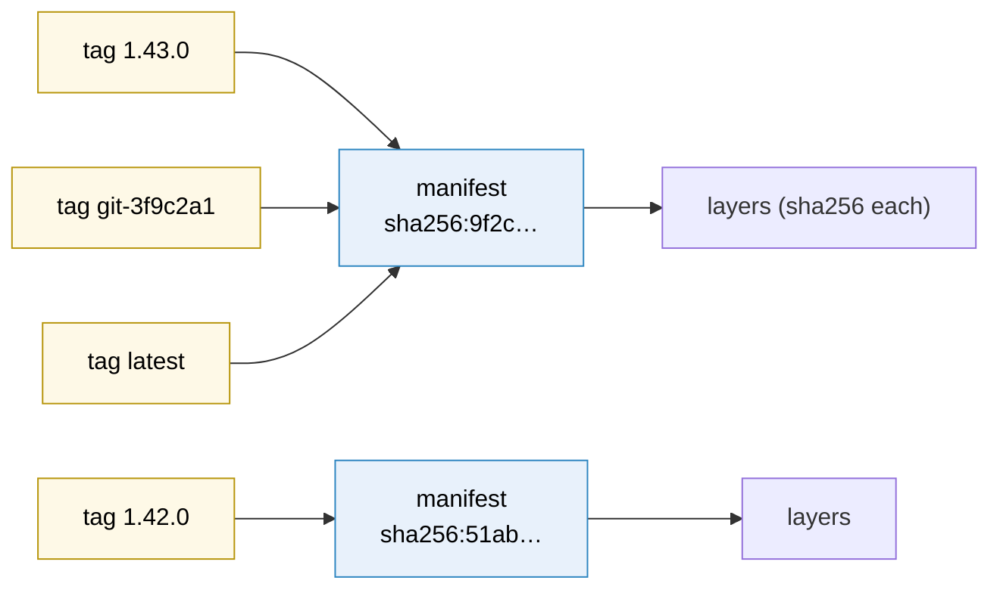
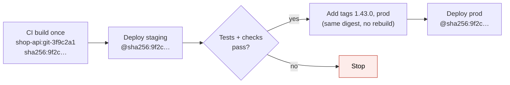

# Docker image tags

> [!abstract] In one sentence
> A tag (`shop-api:1.43.0`) is a **movable name** that a registry points at an image; the image's real, unchangeable identity is its **digest** (`sha256:…`). Tags are how humans and pipelines pick images, and because they can move, a careless tagging scheme means nobody can say for sure **which code is running**, deploys pull different images on different hosts, and rollbacks fail.

## The pieces of an image reference

```
123456789012.dkr.ecr.eu-west-1.amazonaws.com/shop/shop-api:1.43.0@sha256:9f2c…e41a
└──────────────── registry ────────────────┘ └ namespace/repo ┘ └ tag ┘ └── digest ──┘
```

| Part | If omitted | Notes |
|---|---|---|
| Registry | `docker.io` (Docker Hub) | `nginx` really means `docker.io/library/nginx` |
| Repository | (required) | Lowercase only |
| **Tag** | **`latest`** | Up to 128 characters: letters, digits, `_`, `.`, `-`, not starting with `.` or `-` |
| **Digest** | (none) | `sha256:` hash of the manifest. If present, it wins: the tag is just a label for humans |

How they relate inside a registry:



- Several tags can point at the **same** image
- A tag points at **one** image at a time, but can be **moved** to another one by pushing again
- A digest is computed from the content: it **can't** be moved. Same digest = same bytes, guaranteed

```bash
docker images --digests shop-api
docker buildx imagetools inspect 123456789012.dkr.ecr.eu-west-1.amazonaws.com/shop-api:1.43.0
docker inspect --format '{{index .RepoDigests 0}}' shop-api:1.43.0
```

## Build-up: tagging the shop API

The shop builds `shop-api` in CI and pushes to ECR (`123456789012.dkr.ecr.eu-west-1.amazonaws.com/shop-api`). It runs on a few EC2 hosts with Docker today, and on [[ECS]] for the new services.

### Stage 1: everything is `latest`

CI runs `docker build -t shop-api .` and `docker push shop-api`. With no tag given, both mean `:latest`. Deploy = `docker pull shop-api && docker run …` on each host.

**What goes wrong:**
- **"What's running in prod?"** Nobody knows. `latest` on host A was pulled Monday, on host B Wednesday after two more pushes: **same tag, different code**, and the bug only appears on B
- **A host restarts or scales out** and pulls `latest` again, which is now someone's half-finished build from a feature branch. Nobody deployed anything, yet production changed
- **Rollback is impossible**: the previous image has no name anymore (it became an untagged, "dangling" image, and may be garbage-collected)
- Logs and errors can't be tied to a commit

> [!warning] `latest` doesn't mean "newest"
> It's just the **default tag name** when none is given. The registry doesn't keep it pointing at the most recent push: it points at whatever was last pushed **with** the tag `latest`, or at nothing if nobody pushed it. A repository can have a `latest` that's a year old while `1.43.0` was pushed today.

### Stage 2: version tags

CI now tags every build with the app's version:

```bash
docker build -t "$REPO:1.43.0" .
docker push "$REPO:1.43.0"
```

Better: logs and dashboards say `1.43.0`, rollback = deploy `1.42.0`.

**What goes wrong next:** a hotfix is merged, and the release script, without a version bump, builds and pushes **`1.43.0` again**. The tag silently moves to a new image. Hosts that already had `1.43.0` cached keep the old one (Docker doesn't re-pull a tag it already has unless told to), newly started ones get the new one. Again, **one tag, two images in production**.

The same happens with **floating tags** on purpose: many projects publish `1.43.0`, `1.43`, `1` and `latest` for the same release, and `1.43` moves to `1.43.1` when it ships. Floating tags are useful for **humans** ("give me the latest 1.x"), dangerous as **deployment** references.

### Stage 3: make tags immutable and unique

Two rules fix it:

**1. Every build gets a tag that can't collide**, derived from the commit:

```bash
GIT_SHA=$(git rev-parse --short=12 HEAD)
docker build -t "$REPO:git-$GIT_SHA" -t "$REPO:1.43.0" .
docker push --all-tags "$REPO"
```

| Tag | Example | Moves? | Use |
|---|---|---|---|
| Commit SHA | `git-3f9c2a1b8e07` | Never (one commit = one tag) | **What pipelines deploy**, traceability back to the code |
| Release version | `1.43.0` | Should never | Humans, changelogs, rollback by name |
| Floating version | `1.43`, `1` | Yes, on purpose | Consumers who want patches automatically (not prod deploys) |
| Environment | `staging`, `prod` | Yes, on every promotion | Pointers "what's in staging now". Never as the source of truth |
| Branch | `main`, `feature-x` | Yes, every push | Dev/test environments only |
| `latest` | | Whenever someone pushes it | Local convenience. Best avoided entirely in CI |

**2. The registry refuses to overwrite a tag.** ECR has **tag immutability** per repository (`IMMUTABLE`; newer settings allow exceptions, e.g. let `latest` move but lock everything else). Pushing `1.43.0` a second time now **fails** instead of silently replacing it, so the hotfix pipeline is forced to produce `1.43.1`.

```bash
aws ecr put-image-tag-mutability --repository-name shop-api --image-tag-mutability IMMUTABLE
```

### Stage 4: deploy by digest

Even with unique tags, what a host **actually runs** is decided when it **resolves** the tag. To make "deployed" mean exactly one image, deploy the **digest**:

```bash
DIGEST=$(docker buildx imagetools inspect "$REPO:git-3f9c2a1b8e07" --format '{{json .Manifest.Digest}}' | tr -d '"')
docker run -d "$REPO@$DIGEST"          # or keep the tag for readability: $REPO:1.43.0@$DIGEST
```

- With `name:tag@sha256:…`, the runtime **ignores the tag** and pulls the digest. The tag stays only for humans reading the config
- **ECS** resolves the tag to a digest **when a deployment starts** and runs every task of that deployment on that digest (so a tag moved mid-deployment doesn't produce mixed tasks). New deployments resolve it again
- **Kubernetes** doesn't do that: with a tag and `imagePullPolicy: IfNotPresent`, each node uses whatever it cached. Pinning digests (or immutable tags + `Always`) is how teams avoid mixed versions
- Security tools (image signing with cosign, attestations, SBOMs) all attach to the **digest**, because only the digest is a stable identity

### Stage 5: build once, promote the same image

The old pipeline rebuilt the image for each environment (`docker build` in the staging job, `docker build` again in the prod job). Those are **two different images**: the prod build pulled a newer base image and a newer transitive dependency than what was tested in staging.

The fix is **promotion**: build once, test, then **re-tag or re-reference the same digest** for each environment:



Adding a tag to an existing image doesn't need a rebuild or even a pull: `docker buildx imagetools create --tag "$REPO:1.43.0" "$REPO@sha256:9f2c…"`, or in ECR `aws ecr put-image` with the existing manifest. Across accounts or regions, **copy** the image (ECR replication, `crane copy`, `skopeo copy`): the digest stays identical.

Configuration that differs per environment comes from the environment at run time, never from a different build (see [[Docker#Stage 6: from my laptop to production]]).

### Stage 6: the base image moved under me

`FROM python:3.12-slim` is itself a **floating tag**: the Python maintainers re-push it for every patch release and Debian security update. Two builds of the same commit a week apart produce different images, and one day a base update breaks a native library.

The trade-off:

| Approach | Reproducible? | Gets security fixes? |
|---|---|---|
| `FROM python:3.12-slim` | ❌ Changes silently | ✅ On every rebuild |
| `FROM python:3.12.7-slim-bookworm` | Mostly (still re-pushed for OS patches) | Partly |
| `FROM python:3.12-slim@sha256:…` | ✅ Exactly | ❌ Only when I change the digest |

The usual answer: **pin the digest** and let a bot (Renovate, Dependabot) open a pull request when the upstream tag moves. The update is tested like any other change instead of sneaking in during an unrelated build. And rebuild regularly so patches actually ship.

### Stage 7: one tag, several CPU architectures

`shop-api:1.43.0` is pushed as a **multi-platform image** (`linux/amd64` + `linux/arm64`, see [[Docker#Stage 7: laptops on ARM, servers on x86]]). The tag then points at an **image index** (manifest list), which lists one manifest **per platform**:

```bash
docker buildx imagetools inspect "$REPO:1.43.0"
# Name:      …/shop-api:1.43.0
# MediaType: application/vnd.oci.image.index.v1+json
# Digest:    sha256:9f2c…e41a            ← the INDEX digest
# Manifests:
#   Name: …@sha256:a71d…   Platform: linux/amd64
#   Name: …@sha256:c03e…   Platform: linux/arm64
```

Which digest to pin? The **index** digest: each host still gets its own architecture. Pinning a per-platform digest forces one architecture everywhere (and fails on the other). Also: a single-platform push to an existing tag **replaces** the index, silently dropping the other architecture.

### Stage 8: cleanup that deleted production

The ECR repository has 4,000 images, so someone adds a **lifecycle policy**: "keep the 50 most recent images". Two weeks later, an ECS service scales out and new tasks fail with `CannotPullContainerError: … not found`. The service runs `1.38.2`, which is stable, rarely changed, and was image number 51. Same for any rollback target older than the window.

Safer retention rules:
- Expire **untagged** images after a few days (dangling results of re-tags and failed builds)
- Expire **branch/dev** tags (by prefix: `feature-`, `pr-`) after N days
- Keep **release** tags (`1.*`, `git-*` that were deployed) much longer, or count-based **per prefix**
- Before deleting, check what's **in use**: running task definitions, Kubernetes manifests, launch templates. A deployed image must never be eligible for deletion

```json
{ "rules": [
  { "rulePriority": 1, "description": "untagged after 7 days",
    "selection": { "tagStatus": "untagged", "countType": "sinceImagePushed",
                   "countUnit": "days", "countNumber": 7 },
    "action": { "type": "expire" } },
  { "rulePriority": 2, "description": "PR builds after 14 days",
    "selection": { "tagStatus": "tagged", "tagPrefixList": ["pr-"],
                   "countType": "sinceImagePushed", "countUnit": "days", "countNumber": 14 },
    "action": { "type": "expire" } }
] }
```

## Advanced problems

### 1. Two pipelines race on one moving tag

Two branches merge minutes apart. Both pipelines build and push `shop-api:staging`, then both deploy `staging`. The deploy of pipeline A pulls the image pushed by pipeline B. Staging runs code A's tests never saw. Any **moving tag shared by concurrent pipelines** is a race. Deploy by unique tag or digest; if an environment tag is kept, it's written **after** the deploy, as a record, not used **for** the deploy.

### 2. "I pushed a new image but the server still runs the old one"

`docker run shop-api:1.43.0` on a host that already has a local `shop-api:1.43.0` **doesn't check the registry**. `docker pull` first, use `--pull=always`, or (better) never reuse a tag. Same with Kubernetes `IfNotPresent`, and with Compose (`docker compose pull` before `up`).

### 3. The tag exists locally, not in the registry

`docker tag` only creates a local name. Until `docker push`, the cluster can't pull it: `manifest unknown`. Also check the **full** name: `shop-api:1.43.0` without a registry prefix pushes to **Docker Hub** (and fails, or worse, succeeds into a public namespace).

### 4. The same version, two different digests

Rebuilding the same commit almost never gives the same digest: timestamps in layers, newer base image, newer packages. That's why "we'll just rebuild 1.42.0 to roll back" is not a rollback: it's a **new** untested image. The deployed image itself must be kept.

### 5. Tags in places that outlive the image

Task definitions, Helm values, launch templates, `compose.yaml` on old hosts, documentation: all reference tags. When images are deleted or tags moved, those references break or silently change meaning. Keep an inventory (what references which digest) before cleaning registries.

## Practice

> [!example]- What does `docker pull nginx` actually pull?
> `docker.io/library/nginx:latest`: default registry, default namespace, default tag.

> [!example]- Is `latest` always the newest image in the repository?
> No. It's whatever was last pushed with the tag `latest`. It may be old, or missing.

> [!example]- Two hosts run `shop-api:1.43.0` but behave differently. How is that possible?
> The tag was pushed twice (moved). One host cached the first image, the other pulled the second. Use immutable tags and deploy by digest.

> [!example]- Which reference should a production deploy use?
> A digest (optionally with a unique tag for readability), produced once by CI and promoted unchanged through environments.

> [!example]- Why not rebuild the image in the prod pipeline?
> A rebuild can pull different base images and dependencies: it's a different, untested image. Promote the tested digest.

> [!example]- A lifecycle policy "keep last 50 images" broke a service scale-out. Why, and the better policy?
> The running image fell outside the 50 newest and was deleted. Expire untagged and branch/PR images by age, keep release tags, never delete images still referenced.

> [!example]- Should I pin a multi-arch image by the index digest or a platform digest?
> The index digest, so each host pulls its own architecture.

> [!example]- How to get base image security updates without builds changing silently?
> Pin the base by digest and let Renovate/Dependabot propose digest updates as pull requests, then rebuild regularly.

## Easy to get wrong
- Treating `latest` as "newest" or deploying it at all
- Re-pushing an existing version tag (the tag moves silently)
- Floating tags (`1.43`, `staging`) as deployment references
- Not turning on tag immutability in the registry
- Expecting `docker run`/`IfNotPresent` to fetch a tag that changed remotely
- Rebuilding per environment instead of promoting one digest
- "Rolling back" by rebuilding an old commit
- Unpinned base images changing builds silently
- Single-platform push overwriting a multi-platform tag
- Retention policies that delete images still in use
- Forgetting the registry prefix and pushing to Docker Hub
- Shared moving tags in concurrent pipelines

## Related
- Building the images:: [[Docker]]
- Running them:: [[ECS]], [[ECS tasks and task definitions]]
- Same idea for machine images:: [[Packer]] (AMI names and IDs, keeping rollback targets)
- Audit of who pushed what:: [[CloudTrail]]
- Area:: [[Containers]]

## Flashcards
#flashcards

Tag vs digest? :: A tag is a movable name. A digest (sha256 of the manifest) is the immutable identity of the image
What does docker pull nginx resolve to? :: docker.io/library/nginx:latest
Does latest mean newest? :: No, it's just the default tag name, pointing at whatever was last pushed as latest
Can two tags point to the same image? :: Yes. Many tags, one digest
Can a tag be moved? :: Yes, by pushing a different image with the same tag (unless the registry enforces immutability)
What does ECR tag immutability do? :: Rejects pushing an existing tag again, so tags can't be silently moved
What happens with name:tag@sha256:... ? :: The digest is used, the tag is only a label for humans
Why deploy by digest? :: Every host runs exactly the same bytes, regardless of later tag moves or caches
Good unique tag for every build? :: The commit SHA (e.g. git-3f9c2a1b8e07), plus a release version
What are floating tags? :: Tags that move on purpose to newer releases (1.43, 1, latest). Fine for humans, risky for deploys
What is image promotion? :: Building once and moving the same digest through environments by re-tagging/copying, never rebuilding
Why isn't rebuilding an old commit a rollback? :: The rebuild gets different bases/dependencies and a new digest: an untested image
Why might a host keep running an old image after a push? :: It has the tag cached and doesn't re-pull unless forced (pull always or a new tag)
How to keep base images reproducible yet patched? :: Pin by digest and let Renovate/Dependabot propose updates
Which digest to pin for a multi-arch image? :: The image index (manifest list) digest
What does docker tag do on its own? :: Creates a local name only. It must be pushed to exist in the registry
Safe ECR lifecycle policy approach? :: Expire untagged and PR/branch images by age, keep release tags, never delete images still in use
What does ECS do with tags at deployment time? :: Resolves the tag to a digest when the deployment starts, so all its tasks run the same image
Why are shared moving tags dangerous in CI? :: Concurrent pipelines race: one deploys the image the other pushed
