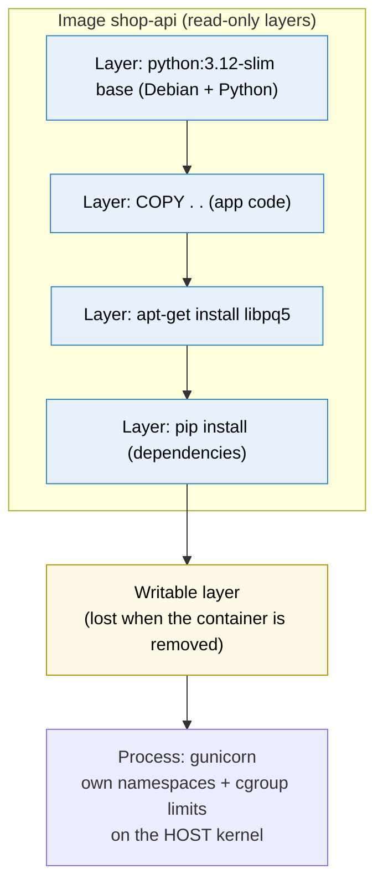
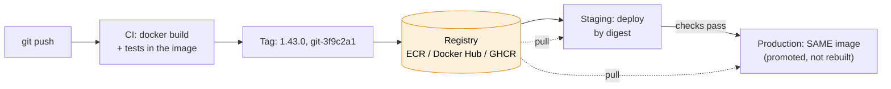

# Docker

> [!abstract] In one sentence
> Docker packages an application **with everything it needs to run** (its runtime, libraries, files and start command) into an **image**: a stack of read-only, content-addressed layers built from a `Dockerfile`. Running an image gives a **container**, an ordinary Linux process isolated by the kernel. The same image runs the same way on my laptop, in CI and in production.

## Build-up: shipping the shop API

The shop's API is a Python app (`shop-api`) using gunicorn, a PostgreSQL driver, and a few system libraries. It has to run on developers' laptops, in CI for tests, and in production (EC2 today, ECS tomorrow).

### Stage 1: copying code onto servers

Deploying today means: SSH to each server, `git pull`, `pip install -r requirements.txt`, restart the service.

**The problems:**
- The laptop has Python 3.12, one server still has 3.9. A library compiled against `libpq` 16 breaks on a host with `libpq` 13. "It works on my machine" is literally true, and useless
- `pip install` during a deploy downloads whatever is current: two servers deployed an hour apart can run **different dependency versions** of the "same" release
- Rolling back means re-installing the old version and hoping the package index still has every pinned dependency
- Every new server is set up by hand or by a long script (the problem [[Packer]] solves for whole machines)

What's missing is a **unit** that contains the app **and** its environment, built once, and run identically everywhere.

### Stage 2: an image from a Dockerfile

```dockerfile
FROM python:3.12-slim
WORKDIR /app
COPY . .
RUN apt-get update && apt-get install -y libpq5
RUN pip install -r requirements.txt
EXPOSE 8000
CMD gunicorn --bind 0.0.0.0:8000 --workers 4 src.app:wsgi
```

```bash
docker build -t shop-api:dev .
docker run --rm -p 8080:8000 shop-api:dev
curl http://localhost:8080/health
```

What happened:
- `docker build` ran each instruction in a temporary container and saved the filesystem changes of each step as a **layer**
- The **image** = those layers + a small config (environment variables, working directory, user, start command) + a **manifest** listing them. Each layer and the manifest are identified by the **SHA-256 of their content**, so identical content is stored and downloaded only once
- `docker run` created a **container**: the image's layers stacked read-only, a thin **writable layer** on top, and a process started in its own **namespaces** (its own view of PIDs, network interfaces, mounts, hostname) with **cgroup** limits on CPU and memory. More on namespaces in [[Network interfaces]]

> [!info] A container is a process, not a small VM
> There's no guest kernel. `ps aux` on the host shows gunicorn like any other process (with a different PID than inside). That's why containers start in milliseconds, and also why a container can't run a different kernel or kernel modules, and why isolation is weaker than a VM's (that's the reason Fargate wraps each task in a micro-VM, see [[ECS on Fargate vs EC2]]).



**The problems** with this first Dockerfile, which show up within a day:
- Changing **one line of Python** rebuilds everything: 4 minutes per build
- The image is **1.1 GB**
- `docker stop` takes 10 seconds every time and in-flight requests get cut
- The `.git` folder and a developer's `.env` file with real database credentials ended up **inside the image**

### Stage 3: the build cache and instruction order

Docker caches each layer and reuses it if the instruction **and its inputs** haven't changed. As soon as one layer changes, **every layer after it** is rebuilt.

Here `COPY . .` comes **before** `pip install`. Any code change changes that layer, so the dependency install below it re-runs every time, even though `requirements.txt` didn't change.

**Fix: order from least to most frequently changing**, and copy only what each step needs:

```dockerfile
FROM python:3.12-slim
WORKDIR /app
RUN apt-get update \
 && apt-get install -y --no-install-recommends libpq5 \
 && rm -rf /var/lib/apt/lists/*            # same RUN: the cleanup actually shrinks the layer
COPY requirements.txt .
RUN pip install --no-cache-dir -r requirements.txt
COPY src/ ./src/                            # code last: changes every commit
```

Now a code change rebuilds only the last layer: seconds instead of minutes.

> [!warning] Deleting a file in a later layer doesn't remove it from the image
> Layers only add. `RUN apt-get update` in one layer and `RUN rm -rf /var/lib/apt/lists/*` in the next still ships the package lists in the first layer. Same for secrets: a token copied in one step and deleted in the next **is still in the image**, readable by anyone who pulls it (`docker history`, or extract the layer). Create and clean up **in the same `RUN`**, and never put secrets in the build context.

And a `.dockerignore`, so the **build context** (everything sent to the builder) excludes what must never be in an image:

```
.git
.env
*.pem
__pycache__/
tests/
node_modules/
```

### Stage 4: multi-stage builds and a smaller image

The image contains compilers and headers needed to **build** some Python packages, but not to **run** them. A **multi-stage build** builds in one stage and copies only the result into a clean final stage:

```dockerfile
# syntax=docker/dockerfile:1
FROM python:3.12-slim AS build
RUN apt-get update && apt-get install -y --no-install-recommends gcc libpq-dev
WORKDIR /app
COPY requirements.txt .
RUN --mount=type=cache,target=/root/.cache/pip \
    pip install --prefix=/install -r requirements.txt

FROM python:3.12-slim AS runtime
RUN apt-get update \
 && apt-get install -y --no-install-recommends libpq5 \
 && rm -rf /var/lib/apt/lists/* \
 && useradd --create-home --uid 10001 app
WORKDIR /app
COPY --from=build /install /usr/local
COPY src/ ./src/
USER app
EXPOSE 8000
ENTRYPOINT ["gunicorn", "--bind", "0.0.0.0:8000", "--workers", "4", "src.app:wsgi"]
```

- Only the `runtime` stage ends up in the image: no gcc, no headers. ~180 MB instead of 1.1 GB. Smaller images pull faster (it matters a lot on Fargate, which pulls on every task start) and have fewer packages with CVEs
- `--mount=type=cache` (BuildKit) keeps pip's download cache **between builds** without putting it in a layer
- `USER app`: the process doesn't run as root. If the app is compromised, the attacker is an unprivileged user inside the container
- Even smaller bases exist: **distroless** images (no shell, no package manager) or `alpine` (musl libc, which breaks some Python wheels: test before switching)

Secrets needed **during** the build (a private package index token) go through a BuildKit **secret mount**, which never lands in a layer:

```dockerfile
RUN --mount=type=secret,id=pip_token \
    PIP_INDEX_URL="https://__token__:$(cat /run/secrets/pip_token)@pypi.example.com/simple" \
    pip install --prefix=/install -r requirements.txt
```

```bash
docker build --secret id=pip_token,env=PIP_TOKEN -t shop-api:dev .
```

### Stage 5: running it properly

**Signals and PID 1.** The first Dockerfile used the **shell form** `CMD gunicorn …`, which Docker runs as `/bin/sh -c "gunicorn …"`. The shell becomes PID 1 and **doesn't forward SIGTERM** to gunicorn. `docker stop` sends SIGTERM, nothing happens, and after 10 seconds Docker sends SIGKILL: in-flight requests are cut on every deploy. The **exec form** `ENTRYPOINT ["gunicorn", …]` makes gunicorn itself PID 1, so it gets SIGTERM and shuts down gracefully. (Why signals matter: [[Inter-process communication#Stage 3: signals, a tap on the shoulder]].) For apps that start child processes and don't reap them, `docker run --init` adds a tiny init (tini) as PID 1.

**Ports.** `EXPOSE 8000` is **documentation only**: it publishes nothing. `-p 8080:8000` publishes host port 8080 to container port 8000. Inside the container, the app must listen on `0.0.0.0`, not `127.0.0.1`: the container's loopback isn't the host's, so a `127.0.0.1` bind is unreachable through the published port (see [[Sockets#Stage 3: it works locally but not from outside]]).

**Data.** The writable layer disappears with `docker rm`. Anything that must survive goes in a **volume**:

```bash
docker run -d --name shop-api \
  -p 127.0.0.1:8080:8000 \
  -e ENV=prod --env-file /etc/shop/api.env \
  -v shop-uploads:/app/uploads \
  --memory 1g --cpus 1 \
  --restart unless-stopped \
  --log-opt max-size=50m --log-opt max-file=5 \
  shop-api:1.43.0
```

| Option | Why |
|---|---|
| `-p 127.0.0.1:8080:8000` | Only reachable from the host (nginx in front). Plain `-p 8080:8000` listens on **all** host interfaces |
| `--env-file` | Config per environment, outside the image |
| `-v shop-uploads:/app/uploads` | Named volume: survives container replacement |
| `--memory 1g` | cgroup hard limit: above it the kernel OOM-kills the process (exit 137) |
| `--restart unless-stopped` | Restart on crash and after host reboot |
| `--log-opt max-size` | The default `json-file` log driver grows **forever** otherwise |

For several containers on one machine (API + PostgreSQL + Redis for local development), **Docker Compose** describes them in one `compose.yaml` and starts them together with a shared network where they reach each other by service name.

### Stage 6: from my laptop to production

An image on my laptop helps nobody. The deployment flow:



1. **Build once, in CI**, never on servers and never per environment. The image tested in CI is the exact image that reaches production
2. **Tag** it meaningfully and **push** to a registry:
   ```bash
   docker build -t 123456789012.dkr.ecr.eu-west-1.amazonaws.com/shop-api:1.43.0 .
   docker push 123456789012.dkr.ecr.eu-west-1.amazonaws.com/shop-api:1.43.0
   ```
   How to tag, and everything that goes wrong with tags, is its own subject: [[Docker image tags]]
3. **Deploy** = tell the runtime to run that image:
   - One host: `docker compose pull && docker compose up -d` (or a systemd unit running `docker run`)
   - [[ECS]]: register a task definition revision with the new image, update the service (rolling deploy, health checks, rollback)
   - Kubernetes: update the Deployment's image
4. **Configuration and secrets come from the environment** at run time (env vars, Parameter Store, Secrets Manager), so one image serves dev, staging and prod
5. **Roll back** by deploying the **previous** image, which still exists in the registry: no rebuild

### Stage 7: laptops on ARM, servers on x86

A developer builds on an Apple Silicon Mac (`arm64`), pushes, and production on x86 instances fails instantly with `exec format error`. An image is built **for one CPU architecture** unless asked otherwise.

`buildx` builds several platforms and pushes them under **one tag** (a multi-platform index; each runtime pulls the variant for its own CPU):

```bash
docker buildx build --platform linux/amd64,linux/arm64 \
  -t 123456789012.dkr.ecr.eu-west-1.amazonaws.com/shop-api:1.43.0 --push .
```

Or build on CI runners of the target architecture. Either way, the platform must match what runs it (an ECS task definition's `runtimePlatform`, for example).

## Advanced problems

### 1. A port published with `-p` ignores the host firewall

On a Linux host with `ufw` blocking everything except 22 and 443, `docker run -p 5432:5432 postgres` makes PostgreSQL reachable **from the internet** anyway. Docker writes its own iptables NAT rules for published ports, and they're evaluated before ufw's rules. Fixes: publish on `127.0.0.1` only (`-p 127.0.0.1:5432:5432`), don't publish internal services at all (use a Docker network between containers), and rely on a firewall **outside** the host (a cloud [[Security groups|security group]]).

### 2. Anonymous pull rate limits behind NAT

Production pulls `python:3.12-slim` and other bases from Docker Hub. Docker Hub rate-limits **anonymous** pulls **per source IP**. Every instance in a private subnet goes out through the **same NAT gateway IP** (see [[NAT and PAT]]), so a scale-out of 40 instances pulling at once hits the limit and deploys fail with `toomanyrequests`. Fixes: authenticate to Docker Hub, mirror base images into a private registry (ECR **pull-through cache**), or use ECR Public's copies of official images.

### 3. The disk fills up on CI runners and hosts

Every build leaves layers, every deploy leaves old images, every container leaves logs. One day: `no space left on device`.

```bash
docker system df                      # what uses space: images, containers, volumes, build cache
docker image prune -a --filter "until=168h"
docker builder prune --keep-storage 20GB
```

Schedule cleanup on CI runners, cap logs (`max-size`), and remember that `docker system prune --volumes` **deletes data** in unused volumes.

### 4. The container is killed and restarts in a loop

Exit code **137** = SIGKILL: either the cgroup memory limit (OOM) or a stop timeout. `docker inspect --format '{{.State.OOMKilled}}' shop-api` says which. Exit code **143** = it exited on SIGTERM (normal). Code **1** = the app crashed: `docker logs shop-api`.

### 5. Builds that aren't reproducible

`FROM python:3.12-slim` and `apt-get install libpq5` today and next month give **different images** from the same Dockerfile: the base tag moved, the package version moved. Usually that's what I want (security patches), but it means "rebuild the old version" doesn't reproduce what ran. That's why a deployed image is **kept** and **identified by digest**, and why base images can be pinned by digest with a bot proposing updates (see [[Docker image tags#3. The base image moved under me]]).

## In AWS
- **ECR**: private registry per account/region, immutable tags option, scan on push, lifecycle policies, pull-through cache for Docker Hub/GHCR/Quay, replication to other regions/accounts
- **[[ECS]]** (Fargate or EC2), **EKS**, **App Runner**, **Lambda** (container images up to 10 GB): all run OCI images built exactly like above
- On EC2 hosts the image is pulled through NAT or VPC endpoints (`ecr.api`, `ecr.dkr`, and the **S3 gateway endpoint** for layers)

## Practice

> [!example]- Changing one line of code rebuilds the whole image. What's wrong with the Dockerfile?
> The code is copied before the dependency install, so every code change invalidates the install layer. Copy `requirements.txt`, install, then copy the code.

> [!example]- A token was copied into the image and deleted in the next `RUN`. Is it gone?
> No. It's still in the earlier layer. Use a BuildKit secret mount, and never put it in the build context.

> [!example]- `docker stop` always takes 10 seconds and requests get cut. Why?
> The shell form of CMD/ENTRYPOINT makes `/bin/sh` PID 1, which doesn't forward SIGTERM. Use the exec form (JSON array).

> [!example]- The app works inside the container (`curl localhost:8000`) but not through `-p 8080:8000`. Why?
> The app listens on 127.0.0.1 inside the container. It must listen on 0.0.0.0.

> [!example]- Does `EXPOSE 8000` make the port reachable?
> No, it's documentation. Publishing needs `-p` (or the orchestrator's port mapping).

> [!example]- Production fails with `exec format error` after a developer pushed from a Mac. Fix?
> The image was built for arm64. Build for the target platform (`--platform linux/amd64`) or a multi-platform image with buildx.

> [!example]- Why build the image once in CI instead of per environment?
> So the exact bytes tested are the bytes deployed. Rebuilding can pull different bases and packages.

## Easy to get wrong
- Thinking a container is a lightweight VM: it's a process on the host kernel
- `COPY . .` before installing dependencies (no cache reuse)
- Cleaning up in a later layer (the files stay in the image), secrets included
- No `.dockerignore`: `.git` and `.env` inside the image
- Shell-form `CMD`: no graceful shutdown
- Binding to 127.0.0.1 inside the container
- Expecting `EXPOSE` to publish a port
- `-p` publishing on all interfaces and bypassing the host firewall
- Data in the writable layer instead of a volume
- Default json-file logs with no size limit
- Running as root inside the container
- Building per environment instead of promoting one image
- Image built for the wrong CPU architecture
- Anonymous Docker Hub pulls from many hosts behind one NAT IP

## Related
- Tags, digests and their traps:: [[Docker image tags]]
- Several containers on one host:: [[Docker Compose]]
- Running containers at scale:: [[Container orchestration]], [[Docker Swarm]], [[Kubernetes]], [[ECS]], [[ECS tasks and task definitions]], [[ECS on Fargate vs EC2]]
- Whole-machine images instead:: [[Packer]]
- Under the hood:: [[Mounting]] (overlay root, bind mounts, mount namespaces), [[Network interfaces]] (namespaces, veth, bridges), [[NAT and PAT]] (published ports are DNAT), [[Inter-process communication]] (signals, PID 1), [[Sockets]] (bind addresses)
- Area:: [[Containers]]

## Flashcards
#flashcards

What is a Docker image? :: Read-only, content-addressed layers plus a config and a manifest, built from a Dockerfile
What is a container? :: A process started from an image, with a writable layer, isolated by namespaces and limited by cgroups on the host kernel
Container vs VM? :: A container shares the host kernel (it's a process). A VM has its own kernel
What invalidates the Docker build cache? :: A changed instruction or changed input files: that layer and every layer after it rebuild
Best order of Dockerfile instructions? :: Least to most frequently changing: base, system packages, dependency manifest + install, then code
Why does deleting a file in a later RUN not shrink the image? :: Layers only add. The file stays in the earlier layer
How do you use a secret during a build without storing it? :: BuildKit secret mount (RUN --mount=type=secret) with docker build --secret
What is a multi-stage build? :: Building in one stage and copying only the needed output into a clean final stage
What is .dockerignore for? :: Excluding files (.git, .env, keys) from the build context so they never reach the image
Shell form vs exec form of CMD/ENTRYPOINT? :: Shell form runs via /bin/sh -c (PID 1 is the shell, signals not forwarded). Exec form runs the binary as PID 1
How long does docker stop wait before SIGKILL? :: 10 seconds by default
Does EXPOSE publish a port? :: No, it's documentation. -p publishes
Why must an app listen on 0.0.0.0 in a container? :: The container's loopback isn't reachable through a published port
Where should container data that must survive go? :: A volume (or bind mount), not the writable layer
What does exit code 137 mean for a container? :: SIGKILL: OOM (cgroup memory limit) or stop timeout
Why do Docker published ports bypass ufw? :: Docker adds its own iptables NAT rules evaluated before ufw's
How to build an image for both x86 and ARM? :: docker buildx build --platform linux/amd64,linux/arm64 --push
What does exec format error mean? :: The image was built for a different CPU architecture
Why build an image once and promote it? :: The tested bytes are the deployed bytes. Rebuilding can change bases and dependencies
Why do Docker Hub pulls fail behind a NAT gateway at scale? :: Anonymous rate limits are per IP and all instances share the NAT IP. Authenticate or mirror (ECR pull-through cache)
